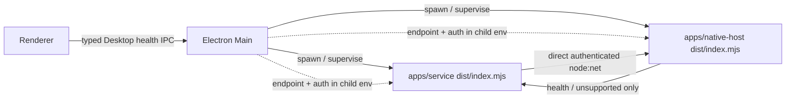

# Establish the real isolated Host boundary

## Outcome

本 Work 已建立 T2 的真实 Pi-free Native Host process/protocol/supervision seam，并完成
`review-isolated-host-20260804-r1` 要求的两项 bounded repair，可重新交给独立 reviewer。
Desktop 现在分别启动和监督既有 Product Service 与唯一的 `apps/native-host` production executable；Product
Service 使用 `node:net` 直接完成 Host 双向认证和 health probe，Electron Main 只创建 rendezvous、分发
child-private capability 并监督生命周期，不代理或解释 Engine command/fact payload。

Host 是真实可 kill/restart 的 OS child，能够完成 mutual handshake、liveness、health、typed unsupported
execution 和 controlled shutdown。它没有 Pi SDK/runtime、Package/Extension executable code、Session、Tool 或
Agent loop；任何 execution request 只能返回 `NATIVE_HOST_EXECUTION_UNSUPPORTED`，不能产生 accepted 或
indeterminate runtime evidence。

本 Work 没有把 Product execution journey 提前接到 Host。`ProductControlPlaneLive` 继续使用前序 T2 的默认
unsupported boundary；`apps/service/src/product/ProductControlPlane.ts` 在本 Work 中零 diff。Service→Host
production path当前只拥有 direct authenticated health client，execution unsupported 由同一真实 protocol
client/Host entry 的集成测试证明。T4 必须在此单一 seam 内原位增加 Product dispatch/Pi runtime message
families，不能新建第二 Host、transport、supervisor 或 translator。

这不是 Pi acceptance、T3/T4、Campaign 或独立 review 完成声明。

## r2 review repair

### Desktop-issued Host instance is now authoritative

`NativeHostClientConfig.hostInstanceId` 现在是必填 rendezvous identity。Service environment factory同时读取
`OMNIMIND_NATIVE_HOST_ENDPOINT`、`OMNIMIND_NATIVE_HOST_AUTH` 和
`OMNIMIND_NATIVE_HOST_INSTANCE`；任一缺失都返回 unconfigured，而不是创建弱化 client。

收到 `host.hello` 后，Service在发送任何 request前要求其 `hostInstanceId` 与 Desktop分发的 expected instance
精确相等；server proof payload、后续 request identity和 response identity也都使用该 expected value，不再把 Host
自报 instance回填为期望身份。真实 production Host负例使用正确 endpoint/secret但让 client期待错误 instance，得到
non-retryable `NATIVE_HOST_AUTHENTICATION_FAILED`；随后同一 Host endpoint仍接受正确 instance client，证明失败关闭
没有削弱 endpoint。

### Unavailable Product submission is queue-only

`ChatView` 保留 approved mother、Composer和 Queue editing。Product text send仍先通过
`confirmProductQueueOwnershipBeforeDraftClear` 完成 durable `putQueueItem`、publish和 exact-transfer draft clear；之后、
在构造 Entry/Run/Dispatch/Receipt ID或调用 `submitQueueItem` 之前，读取 `systemHealthStore` 的最新 snapshot。只有
`service=ready`、`nativeHost=ready` 且 `engineSelection=available` 才能继续 admission。

snapshot缺失或任一状态不可调度时，该路径 fail closed：Queue item继续由 Product Store持有并可编辑，非事实的
optimistic transcript row与 tail anchor被移除，local dispatch state被收口，然后直接成功返回。该分支不会调用
`submitQueueItem`，因此不会产生 Entry、Run、dispatch或 operation receipt。Product branch在更早位置已拒绝
attachment/skill/mention/plan，并在到达 Queue transfer前 await staged attachment cleanup；queue-only只处理 text，
不遗留 blob ownership或本地 dispatch。

allowance内的 source-boundary test读取真实 `ChatView.tsx`，证伪顺序固定为 Queue publish/ownership transfer → health
gate → queue-only `return` → Entry/Run ID与 `submitQueueItem`；health helper test覆盖 null、Service全部 non-ready、Host
全部 non-ready以及 Engine全部 non-available状态。

## Execution owner and frozen physical seam

本 executor 的第一项 production change 是先更新唯一
[Execution owner](../../../../architecture/execution.md)，确认：

- `apps/native-host` 是既有 isolated Native Host responsibility 的唯一 production executable workspace/build
  target；它不是新 Product object，也不取得 Product durable authority。
- Desktop 分别监督 `apps/service` 与 `apps/native-host`；两者不是一个聚合 child lifecycle。
- Product Service 是 Host protocol 的直接 client；Main 只建立 capability/rendezvous 和 supervision，不是
  Engine payload intermediary。

该 owner 确认完成后才创建 `apps/native-host`。实现、development build、release staging 与实际 macOS
package 都指向同一个 `apps/native-host/dist/index.mjs`。T4 冻结并原位延伸的 identity 如下：

| Seam                    | Frozen T2 identity                                                            |
| ----------------------- | ----------------------------------------------------------------------------- |
| workspace/package       | `apps/native-host` / `@omnimind/native-host`                                  |
| source entry            | `apps/native-host/src/index.ts`                                               |
| production binary       | `omnimind-native-host` → `dist/index.mjs`                                     |
| transport family        | local `node:net` byte stream：POSIX Unix-domain pathname / Windows named pipe |
| protocol                | `NATIVE_HOST_PROTOCOL_VERSION = 1`，newline-delimited closed JSON frames      |
| frame bound             | 65,536 bytes；ID bound 128 chars；exact-key validation                        |
| Desktop supervisor      | `NativeHostProcessSupervisor`                                                 |
| direct client           | `apps/service/src/native-host/client.ts`                                      |
| authenticated readiness | Service health marker only；Host stdout heartbeat不构成 ready                 |
| shutdown                | protocol `shutdown.request`/`shutdown.ack` and graceful `SIGTERM`/`SIGINT`    |



实际 development 与 packaged macOS process tree 均与此图一致：同一 Desktop process group 内恰好一个
Service entry、恰好一个 Native Host entry和至少一个 Renderer；不存在 Main payload proxy、sibling Host 或
第二 executable target。

## Endpoint, authentication and protocol

Desktop 每次 bootstrap 创建新的 UUID、32-byte random base64url authentication material 和 Host instance ID。
POSIX 使用随机 Unix-domain socket pathname；为跨 Darwin/Linux path limit，首选 TMP path 以 UTF-8 byte
length 100 为上限，超限时回落到随机短 `/tmp/omnimind-nh-*.sock`。Windows 使用
`\\.\pipe\omnimind-native-host-<uuid>`。该差异是同一个 `node:net` local endpoint family，不是第二 transport。

capability 只通过 child environment 同时交给 Service 与 Host：

- `OMNIMIND_NATIVE_HOST_ENDPOINT`
- `OMNIMIND_NATIVE_HOST_AUTH`
- `OMNIMIND_NATIVE_HOST_INSTANCE`

它们不进入 argv、Desktop health snapshot、renderer store、Product facts/SQLite、ordinary logs或 build-time
artifact values。首轮真实 Desktop fault test 曾揭示 disposable long `TMPDIR` 产生 126-byte Darwin socket
path、导致 Host bind 失败；上述 100-byte bound/fallback 修复后，同一真实 test通过。该失败没有被 fallback
state 隐藏。

Host child base environment不是 `process.env` passthrough。Desktop只正向继承启动所需的 PATH、locale、timezone、
temp/home与 Windows runtime fields，再显式加入 `ELECTRON_RUN_AS_NODE`、`OMNIMIND_HOME` 和上述 rendezvous
capability。OpenAI/Anthropic token、Desktop auth token、Pi/provider state、proxy和 `NODE_OPTIONS` 等代表性
ambient authority均被负例证明不会进入 Host。Service既有 environment composition不属于本点改动范围。

Handshake 为两端 proof：

1. Service 生成 challenge，以 HMAC-SHA256(secret, version + service instance + challenge) 发送
   `client.hello`。
2. Host 验证 client proof，生成独立 host challenge，返回绑定 service instance、host instance、两个
   challenge 与 protocol version 的 `host.hello` proof。
3. Service 验证 Host proof、version 与所有 identity 后才发送 request。
4. Host 对后续 request 再验证 service/host/request identity；auth/version/direction/type/size/excess-property
   任一失败都 destroy socket，没有 unauthenticated downgrade或 alternate transport。

Protocol v1 的唯一 T2 message set：

| Direction      | Messages                                                                                      |
| -------------- | --------------------------------------------------------------------------------------------- |
| Service → Host | `client.hello`, `liveness.request`, `health.request`, `execution.request`, `shutdown.request` |
| Host → Service | `host.hello`, `liveness.response`, `health.response`, `execution.unsupported`, `shutdown.ack` |

`health.response` 只能是 `status: ready, execution: unsupported`；execution response只能是
`code: NATIVE_HOST_EXECUTION_UNSUPPORTED, retryable: false`。不存在 accepted/indeterminate frame variant。

## Independent supervision and health

typed Desktop health snapshot独立投影：

```text
renderer: ready | crashed | recovering | unavailable
service: starting | ready | degraded | restarting | unavailable
nativeHost: starting | ready | restarting | circuitOpen | unavailable
engineSelection: available | degraded | unsupported | unauthenticated | unknown
```

health channel identity位于允许的 `apps/desktop/src/process/desktopHealthChannels.ts`；scoped bridge type位于
`packages/contracts/src/desktop/health.ts`。preload 使用 `DesktopBridge & DesktopHealthBridge`，Web health
component做局部 typed narrowing。通用 `apps/desktop/src/ipcChannels.ts` 与
`packages/contracts/src/ipc.ts` 均保持零 diff，没有为本 Work 扩大公共 aggregate。

Host stdout 的 `OMNIMIND_NATIVE_HOST_READY protocol=1` 只证明 process bind，supervisor保持
`starting/restarting`。只有 Product Service 完成 mutual auth + `health.response` 后产生的
`OMNIMIND_NATIVE_HOST_AUTHENTICATED protocol=1` 才能进入 `ready`；fake heartbeat test证明 Host 自报
ready不能提升状态。Service auth/health失败产生独立 unavailable marker，不伪装成 Engine 或 Service crash。

Native Host 独立 restart policy：

- 最多 3 次连续 crash；250 ms、500 ms backoff，第三次进入 `circuitOpen`。
- authenticated ready 连续稳定 60 秒后才重置 crash streak。
- stderr tail 为独立 8,192 chars ring；状态/log带 Host PID、attempt与归因 reason。
- circuit打开后停止自动 respawn；typed UI `Retry Host` 显式 re-arm并重新进入同一 executable。

Product Service 保留既有独立 `BackendSupervisionPolicy`：最多 5 次 startup failure、500 ms 起始且 10 秒封顶的
backoff、独立 8,192 chars output tail和既有 migration recovery/give-up处理。Host kill不改 Service PID；
Service kill不改 Host PID。Renderer crash recovery沿用既有最多 3 次 reload policy，新增 typed renderer health
投影，不把两个 child并入 renderer recovery。

Web 的 health coordinator不替换 approved mother。Service恢复时保持已有 local snapshot只读提示；Host或 Engine
unavailable时明确说明 dispatch unavailable，并保留 draft/Queue；Host circuit提供 bounded explicit retry。
`ChatView` 在 exact Product admission boundary消费同一 snapshot：不可调度时只完成 Queue ownership transfer，不调用
`submitQueueItem`。Product Queue/Conversation durable owner、draft store和 Workbench结构没有迁移或复制。

## Real fault and shutdown proof

所有 fault tests 都启动 production entries，不使用 fixture executable或 in-process Host：

| Fault/action                  | Observed result                                                              |
| ----------------------------- | ---------------------------------------------------------------------------- |
| Renderer PID `SIGABRT`        | Electron reports `reason=crashed`，产生新 Renderer PID；Service/Host PID不变 |
| Host PID `SIGKILL`            | 新 Host PID + Service re-auth marker；Window/Renderer/Service PID不变        |
| Host PID 连续 `SIGKILL` ×3    | 第三次进入 `circuitOpen`；无第四次自动 respawn                               |
| explicit Host retry           | circuit reset，同一个 production entry重新 spawn；认证前不报 ready           |
| Service PID `SIGKILL`         | 新 Service PID；Renderer/Host PID不变；不归因成 Host/Engine crash            |
| Service hard stop期间         | Host liveness仍为 true；Product SQLite Conversation/Queue关闭重开仍可读      |
| protocol shutdown             | real client收到 `shutdown.ack`，Host graceful exit code 0                    |
| Desktop process-tree teardown | Desktop等待 Service graceful stop，再等待 Host graceful `SIGTERM` stop       |

真实 Service fault test在 Product SQLite预先保存 Conversation `Service fault snapshot` 与 Queue item
`preserve this queued intent`；Service `SIGKILL` 后直接重开同一 database并读回两者，再启动新 Service且重新完成
Host auth。该 test同时扫描 SQLite main/WAL/SHM bytes，endpoint 与 random authentication canary均为零命中。

实际 Desktop test启动构建后的 Electron、`apps/service/dist/index.mjs` 与
`apps/native-host/dist/index.mjs`，逐项 signal并比较 OS PID；Main全程存活，output中 accepted/indeterminate
runtime marker为零。Host circuit test对真实 `dist/index.mjs` 连续 kill并显式 retry；不是只改 read model 的
模拟。

## Build, packaging, dependency and leakage closure

- root `build:desktop` 现在显式包含 `@omnimind/native-host`；Desktop dev在 Electron启动前确保 Host build，
  root dev runner并行启动唯一 Host watcher。
- release staging复制同一 `apps/native-host/dist`；release workspace manifest列表包含
  `apps/native-host/package.json`，使 copied root lockfile仍可 frozen install。首次实际 package暴露该 manifest
  漏项并 fail closed；修复后实际 build通过。
- 最终 macOS arm64 ZIP使用当前 scope-clean production dist实际构建；frozen staged dependencies、AppSnap helper、
  electron-builder、238-component legal closure、zip finalization和 isolated packaged startup全部通过。
- packaged startup proof要求 Desktop log含 `native host state=ready`、Service child log含 authenticated marker，
  并通过 `ps` 断言 packaged process group中恰好一个 Service、恰好一个 Host和 Renderer。
- 最终 `app.asar` 只有 `/apps/native-host/dist/index.mjs` 一个 Host file；10,959 bytes，SHA-256
  `524585830d7eb0f11c2f5fa486659ae38a3bb6e27cb1292899bbf99f01a7c96c`。
- source/package/dist/app.asar scan对 Pi packages、Pi runtime、ResourceLoader、ExtensionRunner、PackageManager、
  SessionManager、ToolExecution 与 AgentLoop均为零命中；Host production dependencies恰好只有
  `@omnimind/contracts`，且 protocol subpath被 bundling成单一 entry。
- alternate `node:http`/`node:https`/WebSocket/`ws`/fetch Host transport、in-process Host import、第二
  supervisor、第二 package/bin和 sibling entry扫描均为零。
- random endpoint/authentication不在 child argv或 Host stdout/stderr；renderer/Product source无 capability
  field，实际 Product SQLite main/WAL/SHM无 canary；runtime one-time values不可能进入 build artifact。

前序 Product Service中下列三个 Pi dependency仍保持精确 expected-red physical debt，未移动、未删除，也未进入
Host graph：

```text
@earendil-works/pi-agent-core
@earendil-works/pi-ai
@earendil-works/pi-coding-agent
```

它们继续是 non-candidate debt；本 Work不把“新 Host Pi-free”扩张为“repository/Service Pi-free”。

## Changed files

- `architecture/execution.md`
- `apps/native-host/package.json`
- `apps/native-host/tsconfig.json`
- `apps/native-host/tsdown.config.mts`
- `apps/native-host/src/index.ts`
- `packages/contracts/package.json`
- `packages/contracts/src/index.ts`
- `packages/contracts/src/native-host/index.ts`
- `packages/contracts/src/native-host/protocol.ts`
- `packages/contracts/src/native-host/protocol.test.ts`
- `packages/contracts/src/desktop/index.ts`
- `packages/contracts/src/desktop/health.ts`
- `apps/desktop/package.json`
- `apps/desktop/src/main.ts`
- `apps/desktop/src/preload.ts`
- `apps/desktop/src/process/desktopHealthChannels.ts`
- `apps/desktop/src/process/nativeHostRendezvous.ts`
- `apps/desktop/src/process/nativeHostRendezvous.test.ts`
- `apps/desktop/src/process/nativeHostEnvironment.ts`
- `apps/desktop/src/process/nativeHostEnvironment.test.ts`
- `apps/desktop/src/process/nativeHostAuthenticatedReadiness.ts`
- `apps/desktop/src/process/nativeHostAuthenticatedReadiness.test.ts`
- `apps/desktop/src/process/nativeHostSupervisor.ts`
- `apps/desktop/src/process/nativeHostSupervisor.test.ts`
- `apps/desktop/src/process/nativeHostProcess.integration.test.ts`
- `apps/desktop/src/process/desktopProcessTree.integration.test.ts`
- `apps/service/src/native-host/client.ts`
- `apps/service/src/native-host/client.integration.test.ts`
- `apps/service/src/native-host/serviceProcess.integration.test.ts`
- `apps/service/src/product/health/nativeHostHealthMonitor.ts`
- `apps/service/src/serverLayers.ts`
- `apps/web/src/routes/__root.tsx`
- `apps/web/src/components/ChatView.tsx`
- `apps/web/src/components/system-health/SystemHealthCoordinator.tsx`
- `apps/web/src/components/system-health/ProductSubmissionHealthGate.test.ts`
- `apps/web/src/store/systemHealthStore.ts`
- `apps/web/src/store/systemHealthStore.test.ts`
- `package.json`
- `bun.lock`
- `scripts/dev-runner.ts`
- `scripts/build-desktop-artifact.ts`
- `scripts/lib/release-workspace-manifests.ts`
- `scripts/verify-packaged-desktop-startup.ts`
- `scripts/native-host-boundary.test.ts`
- this handoff Concept

Shared worktree中既有的 `.omp-flow/tasks/08-03-*` modification、`.omp-flow` config/wiki/handoff/review untracked
files均保持未触碰。没有修改 Campaign、runtime/session record或 Harness configuration，也没有 commit。

## Verification

| Command / proof                                                                                                                                                                                                                 | Result                                                                                                |
| ------------------------------------------------------------------------------------------------------------------------------------------------------------------------------------------------------------------------------- | ----------------------------------------------------------------------------------------------------- |
| `bun install --frozen-lockfile`                                                                                                                                                                                                 | PASS，exit 0；1115 installs / 1283 packages，no changes                                               |
| contracts/native-host/service/desktop/web/scripts 六 workspace `typecheck`                                                                                                                                                      | PASS，六项 exit 0                                                                                     |
| `bun run build:desktop`                                                                                                                                                                                                         | PASS，exit 0；5/5 tasks；Host bundle 10.96 kB / gzip 3.11 kB                                          |
| focused matrix：protocol、rendezvous、environment allowlist、authenticated readiness、supervisor、real Host circuit、real Desktop tree、real Service restart、Product default boundary/cutover、packaging config、boundary scan | PASS；最终 scope cleanup前 13 files / 49 tests，environment hardening后相关 focused gate另见下一行    |
| Host environment hardening：Desktop typecheck/build + environment/supervisor/authenticated-readiness/real Host/real Desktop process tests                                                                                       | PASS，exit 0；5 files / 7 tests                                                                       |
| leak assertion增强后的 `apps/service/src/native-host/serviceProcess.integration.test.ts` 单独复跑                                                                                                                               | PASS，1 file / 1 test，exit 0                                                                         |
| actual final `build-desktop-artifact.ts --platform mac --target zip --arch arm64 --skip-build`                                                                                                                                  | PASS，exit 0；238-component packaged legal closure                                                    |
| actual final `verify-packaged-desktop-startup.ts`                                                                                                                                                                               | PASS，exit 0；packaged Renderer + exactly one Service + exactly one authenticated Host                |
| final `app.asar` one-entry/Pi-free extraction scan                                                                                                                                                                              | PASS，1 Host file；10,959 bytes；digest见上                                                           |
| `scripts/native-host-boundary.test.ts`                                                                                                                                                                                          | PASS，4/4；one binary/transport/supervisor/client direction、Pi-free、expected-red与 leakage negative |
| unauthorized scope cleanup：`git diff --exit-code -- apps/service/src/product/ProductControlPlane.ts apps/desktop/src/ipcChannels.ts packages/contracts/src/ipc.ts`                                                             | PASS，exit 0；三文件零 diff                                                                           |
| `git diff --check --` over Work allowed paths and this handoff                                                                                                                                                                  | PASS，exit 0                                                                                          |

r2 review repair在 fresh production build后执行的精确 gate：

| Command / proof                                                                                                                                                                                                                                                                                       | Result                                                                                                                                             |
| ----------------------------------------------------------------------------------------------------------------------------------------------------------------------------------------------------------------------------------------------------------------------------------------------------- | -------------------------------------------------------------------------------------------------------------------------------------------------- |
| `bun run build:desktop`                                                                                                                                                                                                                                                                               | PASS，exit 0；5/5 tasks；Web与Service cache miss并重建，r2 client/gate进入 production dist                                                         |
| `bunx vitest run apps/service/src/native-host/client.integration.test.ts apps/service/src/native-host/serviceProcess.integration.test.ts apps/web/src/store/systemHealthStore.test.ts apps/web/src/components/system-health/ProductSubmissionHealthGate.test.ts --maxWorkers=1 --no-file-parallelism` | PASS，4 files / 17 tests；含 production Host正确 secret + wrong expected instance拒绝、Service restart、全 health matrix和 exact ChatView boundary |
| `bun run --cwd apps/service typecheck`                                                                                                                                                                                                                                                                | PASS，exit 0                                                                                                                                       |
| `bun run --cwd apps/web typecheck`                                                                                                                                                                                                                                                                    | PASS，exit 0                                                                                                                                       |
| `node scripts/build-desktop-artifact.ts --platform mac --target zip --arch arm64 --skip-build --output-dir /tmp/omnimind-work3-r2-artifact.ySTcV3`                                                                                                                                                  | PASS，exit 0；基于 r2 final source/dist 生成 `OmniMind-0.1.0-alpha.0-arm64.zip`，重新完成 staged frozen install、238-component legal closure 与 app.asar identity verification |
| `node scripts/verify-packaged-desktop-startup.ts --assets-dir /tmp/omnimind-work3-r2-artifact.ySTcV3 --platform mac --arch arm64 --version 0.1.0-alpha.0 --timeout-ms 90000`                                                                                                                           | PASS，exit 0；`Packaged mac/arm64 startup and Service/Native Host process-tree smoke passed from isolated state.`，证明 r2 Service 从正式包取得 Desktop-issued instance 并完成 Host 认证，且 packaged tree 为 Renderer + exactly one Service + exactly one Host |

实际 package/scan临时目录在证据采集后已精确删除，不留下 release artifact或 extracted app。

## Decisions and caveats

- `apps/native-host` 不是 sandbox声明；本 Work只证明独立 process、authenticated local channel与 crash
  attribution，不声称 filesystem/network/system-call containment。
- POSIX UDS与 Windows named pipe是 `node:net` 的同一 platform-local endpoint family。macOS real path已证明；
  Windows named-pipe identity有 unit proof，但本 Work没有在 Windows/Linux主机运行实际 process/package。
- Desktop健康 snapshot是 scoped、ephemeral typed projection，不写 Product DB，也不成为第二 Product durable
  aggregate。Host/Service恢复 notice没有替换 Conversation/Workbench mother。
- Product admission health是 fail-closed：snapshot缺失也视为不可证明 dispatch，只允许 durable Queue transfer；Desktop
  正常路径通过 typed bridge提供 snapshot。该门不禁用 Composer或 Queue editing。
- T2没有 Product→Host execution production wiring。前序 Product default boundary仍 truthfully unsupported；T4
  才能在同一 client/protocol/executable内接入 dispatch并承担真实 acceptance/Session/stream/tool proof。
- 没有 Pi/provider/model catalog、Session continue/rebuild、Package loading、Tool execution、stream/control/cancel
  或 real Engine journey evidence。任何 closed protocol/state fixture都不能提升为这些能力。
- 没有运行 root全量 `bun run test`，也没有把 focused 49 tests扩张为 repository-wide green。相关 production
  build、实际 macOS package/startup、真实 child fault与 boundary scans已运行。
- `DONE` 表示 bounded implementation与 linked r2 handoff已产出；r1 review为 FAIL，其 findings已修复，但 r2尚未经过
  独立复核，不能标为 Campaign verified或总体完成。

## Dispatch identity

- actorId: `isolated_host_implementer`
- receipt: `4a598a7cb54f4eb5b779e7a4775966c5`
- predecessor receipt: `8439cdf668d241cda9b281b47873d258`
- predecessor output: `../reviews/establish-isolated-host-boundary.md`
