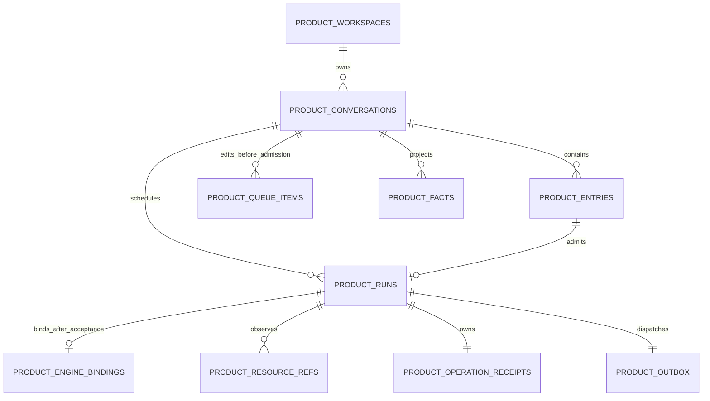
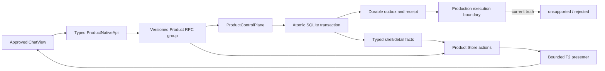

# Establish Product facts and typed ingress

## Outcome

本 Work 的 Product 侧 T2 seam 已实现并可交给独立 reviewer。新 draft 首次发送与已识别的 Product
Conversation 使用 Product RPC、`ProductControlPlane`、独立 SQLite 与 typed Product Store；同一 Product
Conversation ID 不能再进入 donor Thread import、command dispatcher 或 delivery reconciliation writer。
原有 ChatView、routes、Sidebar、split/workbench、terminal 与非 Product `EventRouter` 继续作为 approved
mother，不另建 thin shell。

Round-3 仅修复 `review-product-facts-20260804-r3` 指出的 put 在途 Composer mutation race。Product put 或
stable-id exact reconcile 成功后，draft 清理现在只能调用 Composer store 的 CAS action：该 action 在同一个
Zustand write 内确认当前 `productQueueTransfer` 仍深等于本次 staged transfer，匹配才一起清 draft 与 marker。
发送等待期间的任一同 draft mutation 仍会同步把 marker 失效为 `null`；即使用户随后把 prompt 与 choices
改回逐字节相同，CAS 也会失败并保留当前 draft，不会执行附件、preview URL 或 UI clear。第一次发送已 durable
的 Product Queue item 仍先发布并由 Product 呈现。marker flush-before-put、response-loss exact reconcile、
Product item 缺失时 stable-id retry、正常路径同 write clear，以及没有第二 Queue/public Product state 的边界
均保持不变。既有 Product-ID donor isolation、closed ingress 与 approved Queue mother 行为未改变。

这不是 T2、T3、T4 或 Campaign 完成声明。生产 execution boundary 当前只返回
`NATIVE_HOST_EXECUTION_UNSUPPORTED` 的显式 rejection；closed fixture 的 accepted/indeterminate/running/
settled observations 只验证状态机，不是 Native Host 或 Pi 接受证据。

## Fresh Product schema

- 文件：`product-state-v1.sqlite`
- schema：`PRODUCT_SCHEMA_VERSION = 1`
- 初始化：独立于 donor migrations；启用 foreign keys、WAL、5 秒 busy timeout，并通过现有 private-file
  permission seam 创建。
- Product State 责任：Workspace、Conversation、Entry、Run、EngineBinding、ResourceRef、
  OperationReceipt；Queue 保持为 admission 前可编辑所有权。Outbox 与 Facts 是持久化机制，不是新增公共
  aggregate。

实际 tables 为 `product_meta`、`product_workspaces`、`product_conversations`、`product_entries`、
`product_runs`、`product_engine_bindings`、`product_resource_refs`、`product_operation_receipts`、
`product_queue_items`、`product_outbox` 与 `product_facts`。测试从全新文件创建 managed、folder-backed 与
无 Primary Folder 的 Chat，再关闭/重开数据库，证明七项责任、ResourceRef/write authority 与可见
Conversation 不依赖 donor migration 或 Engine transcript。

## Command/fact boundary and writers

精确 writer 位置：

- 唯一 Product durable writer：`apps/service/src/product/ProductControlPlane.ts`；RPC handler 只调用它，
  execution observations 也必须回到它更新同一 receipt/outbox。
- 唯一 Product live projection writer：`apps/web/src/store/productStore.ts` 的 typed actions。command
  snapshots 与 `productProjectionCoordinator.tsx` 都经这些 actions 写入；presenter 不持有第二份状态。
- `apps/web/src/productReadModel.ts` 只是 bounded T2 adapter，把 typed
  `ProductConversationReadModel` 映射到 approved Chat timeline/error props，不读取 NativeApi 或 donor Store。
  T3 原生消费 Product read model 后，应删除该文件及 ChatView 中对应 adaptation calls，不保留永久 translator。

RPC 只暴露 responsibility-scoped create/open/shell/detail/Queue put-reorder-delete/submit/facts read。Shell facts
只携带后台 Conversation summary；detail facts携带 active Conversation 的 Queue、Entry/Run 与 dispatch 变化。
Store 分开保存 shell 与 detail cursor，split/workbench pane 使用 retain/release refcount；最后一个 consumer
释放时才清 detail。coordinator 只轮询 retained Product details，不让普通 legacy ChatView 持续产生 404；新
draft 在异步 create 前同步 retain，unmount cleanup 可平衡引用。

## Atomicity, Queue ownership and response loss

单次 admission transaction 同时写入 user Entry、requested selection、workspace observation、ResourceRefs、
package generation、Run、pending OperationReceipt、pre-send Outbox 和对应 facts，然后删除该 Queue item。任何
statement 冲突会回滚整个 transaction；测试证明失败后没有孤立 Entry/Run/outbox，原 Queue item 仍可编辑。

Queue put 使用稳定 item id。若 RPC response 丢失，Web 只在重新读取的 item 与原始 conversation、id、text、
requested selection 和 resources 全部相等时采用服务端 revision；任一字段不等即报告 conflict，不覆盖
现有 Queue。submit response 丢失只在 typed snapshot 已存在同一稳定 Entry id 时认定已 admission。accepted
或 uncertain 后 Queue 不会回到 editable 状态。

Web 的所有权顺序为 durable Composer transfer marker flush → Product Queue put → typed Product Store
publication → Composer draft 与 marker 同 write clear。put 前失败时 draft 与 marker 保留；Product 中尚无 item
时安全 retry 复用 marker 的 stable item id。put 已落盘但 response 丢失时只走上述 stable-id exact reconcile。
若 renderer 在 put 成功后、draft clear 前退出，reload 必须同时看到 marker 指定的 item id，且 conversation、
text、requested selection（包括 frozen target observation）与 resources 全部一致才清 draft。没有 marker、id
不同或任一 frozen 字段不同都 fail closed；内容相同本身不再构成 transfer evidence。clear 后、submit 前退出时，
`presentProductConversationQueue` 直接从 Product read model 重新呈现 Queue。approved mother 的 Delete 调用
typed `deleteQueueItem`，Edit 保留同一 item id/revision 并将内容恢复到 Composer，Steer 在 T2 映射为 typed
`reorderQueue` 的置前操作；所有写入仍归 Product Store / Product Control Plane。

put/reconcile 完成路径不再无条件清 draft。`clearComposerContentForProductQueueTransfer` 只对仍持有本次 exact
marker 的 Composer draft 执行 compare-and-set；CAS 命中时 draft 内容与 marker 在同一 store write 清除，CAS
未命中时当前 draft 完整保留。deferred-put regression 把 prompt 在 resolve 前从 `hello` 改为 `different` 再
改回 `hello`，确认 resolve 后 marker 仍为 `null`、prompt 仍为 `hello`、已 durable Product item 已发布且可由
approved mother presenter 呈现；配对 control 证明没有 mutation 时同一 deferred put 命中 CAS 并清除二者。

| Observation / interruption | Durable result | Automatic replay |
| --- | --- | ---: |
| validation/admission transaction rejection | transaction rollback；Queue 保持 editable | 0 |
| pre-send typed failure | admitted Entry/Run 保留；outbox 回到 `pending/pre-send` | 仅允许安全 pre-send retry |
| process stop at `sending/pre-send` | startup 恢复为 `pending/pre-send` | 仅允许安全 pre-send retry |
| explicit rejection | terminal rejected receipt；Queue 不返回 | 0 |
| explicit acceptance | terminal accepted receipt，保存 operation/binding/resolved selection | 0 |
| typed failure after persisted `markSent()` | terminal `delivery_unknown/sent` | 0 |
| process stop after persisted `markSent()` | startup 改为 `delivery_unknown/sent`，不重发 | 0 |
| accepted Run loses later outcome | `outcome_unknown`，保留 accepted context | 0 |

`markSent()` 在任何 non-idempotent fixture boundary 前持久化 `sending/sent`。若 accepted 或 indeterminate
observation 在 durable boundary 仍为 pre-send，Service 抛出 `PRODUCT_SEND_BOUNDARY_CONTRADICTION`、恢复
`pending/pre-send`，不会制造 accepted/unknown receipt。outbox 的 `automatic_replay_count` 有 DB constraint
固定为零；并发 dispatcher 通过条件 `UPDATE ... RETURNING` 只让一个 claimant 进入 boundary。

## Typed ingress and Product truth

- `PRODUCT_PROTOCOL_VERSION = 1`；所有公共 Product input/snapshot/fact batch 使用 closed Effect Schema，
  excess properties fail closed。
- `ProductReadFactsInput` 明确经过 `closedBoundary`；runtime regression 向该 input 注入
  `payload: { provider: "pi" }` 并确认 decode 抛错，不再静默 strip raw payload。
- ID、title、path、message、fact batch、Queue 和 ResourceRef 都有硬边界；消息上限 65,536 chars，fact batch
  256，Queue 128，单 Run ResourceRef 32。
- runtime fixtures拒绝 unknown protocol、oversized text、generic/raw `payload` envelope 与嵌套 provider fact；
  static negative scan 禁止 Product core/presenter 引入 Provider/Pi/ACP runtime 或 generic payload renderer。
- Workspace 是 managed、folder-backed、chat 的 closed union。Chat 没有 Primary Folder/ExecutionTarget，且
  Service 在 Queue ownership 转移前权威拒绝 read-write ResourceRef。
- first Web journey 请求 `engineId: "native-engine"`，但不把 Product Service/Host 伪装成 Engine；package
  generation 是 `unresolved-not-activated`，enforcement 是 `unverified`。生产 boundary 不调用 Pi、不选择
  fallback Engine、也不生成 accepted 或 indeterminate evidence。
- 用户选择尚未创建的 worktree 时，Product branch 在 admission 前明确报 native Engine target resolution
  unavailable 并恢复 draft；不会把当前 cwd 伪装成新 worktree ExecutionTarget。

## Single-writer cutover and negative proof

新 draft 沿用现有 draft Thread ID 作为 Product Conversation ID，create/get 后只执行 Product Queue put 与
submit；在 cutover branch 返回前不会触达 `thread.create`、`promoteThreadCreate` 或 `thread.turn.start`。旧
donor execution code保留在 marker 之后供 legacy Conversation 使用，等待后续物理删除。

客户端 registry 对已读取/创建的 Product ID 做 early fail；Service 端以 Product SQLite `hasConversation`
查询作为权威 guard。guard 显式检查 `threadId`、`sourceThreadId`、`parentThreadId`、
`sidechatSourceThreadId`，并在 donor `dispatchCommand`、`importThread`、`reconcileProviderDelivery` writer 前
执行。动态测试用真实 Product DB 覆盖四类引用、import-shaped input 与非 Product control；Web transport
测试证明 Product dispatch/import 在 request 前失败，而非 Product command 仍可通过。非 Product
EventRouter、read-only donor routes 与 project/workspace mother responsibilities 未被错误关闭。

Web registry 是可订阅的动态 ownership source；新建 local draft 因本 cutover 必定进入 Product journey，
在 registry 首次 snapshot 注册前也直接从 donor visible/retained lease 候选中排除。已注册 Product ID 从 donor
shell/detail snapshots、subscribe/get detail/replay、shell/thread/domain stream listener 以及 EventRouter 的
buffer、reconcile、catch-up 与 reducer hot-path application 前排除。动态测试先注册 Product ID，再同时发出
Product 与 non-Product subscription/snapshot/event，证明前者不触达 transport/listener（因而不能到达其下游
reducer），后者继续通过。

## Projection and recovery mechanisms

Product facts保留逐 Conversation sequence、global shell sequence、stable fact id、cursor、batch limit、
overflow/resnapshot 和 tombstone。Store focused tests覆盖按序应用、duplicate no-op、sequence gap、
cursor-ahead、overflow、unknown version、stale snapshot、reconnect generation、shell/detail 分离、detail
tombstone 与 split-pane final release。resnapshot/transport failure 保留最后一个 typed detail，直到成功
snapshot 或 tombstone；不写 fallback state。

## Changed files

- `apps/web/src/composerDraftActions.ts`
- `apps/web/src/composerDraftDomain.ts`
- `apps/web/src/productQueueReconciliation.ts`
- `apps/web/src/productQueueReconciliation.test.ts`
- `apps/web/src/components/ChatView.tsx`
- this handoff Concept

以上仅为 Round-3 executor 实际修改。No persistence schema、contracts、Service、Product public state、
`_chat` route、Sidebar、donor migration、runtime/session record、Harness configuration、architecture 或
Campaign state 被本轮修改。工作树中既有其他变更保持未触碰。

## Verification

| Command | Result |
| --- | --- |
| `bunx vitest run packages/contracts/src/product/state.test.ts apps/service/src/product/ProductControlPlane.test.ts apps/web/src/store/productStore.test.ts apps/web/src/productQueueReconciliation.test.ts apps/web/src/productCutover.test.ts apps/web/src/wsNativeApi.test.ts --maxWorkers=1 --no-file-parallelism` | PASS，exit 0；6 files / 72 tests |
| `bunx vitest run apps/web/src/productQueueReconciliation.test.ts apps/web/src/composerDraftStore.test.ts apps/web/src/composerDraftStore.persistence.test.ts --maxWorkers=1 --no-file-parallelism` | PASS，exit 0；3 files / 65 tests |
| `bun run --cwd apps/web typecheck` | PASS，exit 0 |
| `bunx oxfmt --check apps/web/src/composerDraftActions.ts apps/web/src/composerDraftDomain.ts apps/web/src/productQueueReconciliation.ts apps/web/src/productQueueReconciliation.test.ts apps/web/src/components/ChatView.tsx` | PASS，exit 0；5 files formatted |
| `bunx oxlint` over the same 5 files | PASS，exit 0；0 errors / 3 个既有 ChatView warnings；本轮新增 warning 为 0 |
| `git diff --check --` over the Round-3 allowed implementation paths and this handoff | PASS，exit 0 |

Focused coverage包括 fresh/reopen、atomic rollback、Queue edit/reorder/delete/revision conflict、put 前不清 draft、
put 后/clear 前 marker reload 去重、marker 有而 Product item 无时保留并 stable-id retry、put 在途 mutation
改走再改回仍保留独立 draft、deferred-put CAS success control、identical independent second draft 保留、同 draft
mutation marker 失效、clear 后/submit 前 Queue 重开、donor Product ID 动态
subscription/snapshot/event 拒绝与 non-Product control、Chat resource
authority、unsupported production receipt、typed pre/post-send failure、invalid boundary observation、hard restart
recovery、accepted-context retention、protocol/redaction/size rejection、Store cursor/batch/resnapshot、response-loss
reconciliation、并发 dispatcher 单一 claim 与旧 writer negative reachability。

## Residual debt and unproven conditions

- 没有 isolated Native Host、Pi import 或真实 Engine acceptance；closed fixtures 不能作为真实 dispatch、stream、
  tool 或 crash-window 证据。
- 没有完成 Work 中要求的 Web + Product Service 实际进程 checkpoint、人工 Queue UI 操作或边界 kill。当前
  restart proof 是真实 SQLite 文件关闭/重开与 boundary hard-defect fixture，不把它扩张成端到端进程证明。
- donor isolation 的动态负例运行在真实 Web transport/listener boundary，EventRouter 的 buffer/reconcile/reducer
  guards 由 focused static reachability test 覆盖；未挂载完整 React + WebSocket application 进程注入事件，不把
  该局部证明扩张成 checkpoint 级浏览器运行证明。
- T3 尚未实施 Agent/Chat IA、Product-native Sidebar/Workbench/detail rendering 或视觉验证；shell summaries
  已进入 Store，detail 仍通过明确可删除的 presenter 适配 approved mother。
- first Product Web send 当前只接受 text；attachments、skills、mentions、proposed-plan 与 new-worktree creation
  会在 admission 前 fail closed 并恢复 draft。
- donor Conversation/execution code仍有物理存在并继续服务 legacy Conversation；unrelated donor project
  setup/read-only responsibilities 仍属于 approved mother。后续 T4 在真实 replacement proof 后负责删除旧
  execution authority。
- 未运行 root `bun run test`。前序 handoff 已如实记录 inherited expected-red baseline；本 Work 只运行能
  证伪其 Product seam 的 focused suites，不把 72 个局部绿色测试扩张为 repository-wide green。
- Round-3 CAS 修复尚未经过独立 review。`DONE` 仅表示此 bounded implementation 与 handoff 已产出，不表示 review
  PASS 或 Campaign claim verified。

## Dispatch identity

- actorId: `product_facts_rework_round3`
- receipt: `8638fa665ae3437ca556d7a91b69f4db`
- predecessor receipt: `705391e3ac3146a19f8d75ef5a258e3c`
- predecessor output: `../reviews/establish-product-facts-and-typed-ingress.md`
