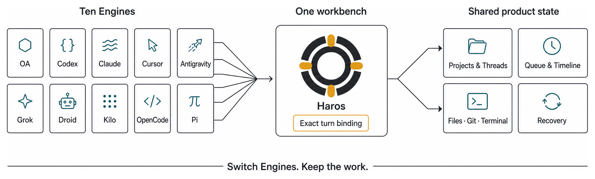

<div align="center">
  
  <p>
    <a href="docs/guide/README.md"><strong>Guidebook</strong></a> ·
    <a href="docs/README.zh-CN.md">简体中文</a> ·
    <a href="docs/architecture.md">Architecture</a> ·
    <a href="CONTRIBUTING.md">Contributing</a>
  </p>
  <p>
    
    
    
    
    
    
    
    
    
    
  </p>
</div>

Haros brings Codex, Claude, Cursor, Antigravity, Grok, Droid, Kilo, OpenCode, Pi, and its built-in
Engine into one coherent workbench. Pick the right Engine for each turn without moving the project,
rebuilding context, or giving up a shared history.

## Every Engine enters the same workbench

Each Engine keeps its own models, options, authentication, and native session semantics. Haros owns
the product around them: Projects, Threads, Queue, Timeline, tools, permissions, and recovery.

That boundary is deliberate. Haros freezes the exact Engine, model, and options admitted to every
queued turn. It never invents continuation across Engines and never hides a launch failure by
silently choosing another one.

## What the Harness OS owns

| One Haros owner | What stays consistent                                    |
| --------------- | -------------------------------------------------------- |
| Work            | Projects, Threads, messages, attachments, and workspaces |
| Orchestration   | Queue, Timeline, interruption, and follow-up work        |
| Local tools     | Files, Git, terminal, browser, and devices               |
| Recovery        | Submitted prompts and queued work remain recoverable     |

## Three ways into the Harness OS

| Surface | Best for                                   | Workspace                    |
| ------- | ------------------------------------------ | ---------------------------- |
| Agent   | Work attached to a real project            | A folder you choose          |
| Chat    | Focused conversation without project setup | A Haros-managed workspace    |
| Studio  | Iterating on concrete deliverables         | An isolated output workspace |

Agent, Chat, and Studio share the same product state. They change how a workspace begins and how
work is presented—not who owns its history.

## Run Haros from source

Requires Bun 1.3.12, Node.js 24.13.1, and macOS, Linux, or Windows.

```bash
git clone https://github.com/piai-lab/Haros.git
cd Haros
bun install --frozen-lockfile
bun run dev
```

Haros is currently `0.1.0-alpha.0`. Engine availability depends on the matching CLI, account, and
local setup. A successful local build is unsigned source software, not an official release.

## Go deeper

- Start with the [Haros Guidebook](docs/guide/README.md) for the complete, junior-friendly tour.
- Read [Architecture](docs/architecture.md) for ownership boundaries and runtime design.
- See [Contributing](CONTRIBUTING.md) before proposing a change.
- Use [Support](SUPPORT.md) for help and [Security](SECURITY.md) for private reports.

On macOS, `bun run dist:desktop:local-app` builds a replaceable unsigned `.app` under
`apps/desktop/.electron-runtime/local-app/`. This local-only path never signs, notarizes, publishes,
or creates updater metadata. Passing an explicit output directory keeps the normal no-overwrite
artifact rule.

<details>
<summary>Development checks and repository map</summary>

```bash
bun run fmt:check
bun run lint
bun run typecheck
bun run test
bun run build:desktop
```

```text
apps/desktop   Desktop shell and OS integration
apps/server    Product orchestration, local capabilities, and persistence
apps/web       Agent, Chat, and Studio workbench
packages/      Typed contracts, shared logic, and runtime composition
docs/          Guidebook, architecture, and contributor documentation
```

</details>

## License

Haros is licensed under the [Apache License 2.0](LICENSE). Third-party code and assets retain their
original licenses and notices; see [NOTICE](NOTICE) and [source-adoptions.json](source-adoptions.json).
