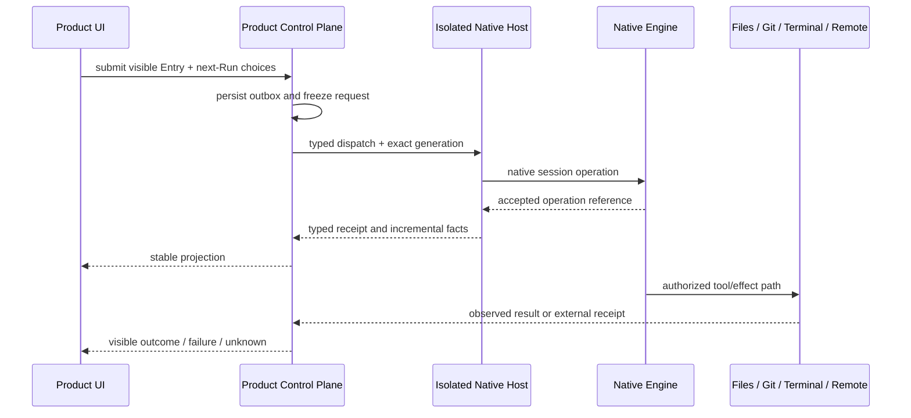

# Execution

## 目标边界

OmniMind 使用一个产品控制平面协调桌面、可见 Conversation、系统能力和多个真实 Engine。默认原生 Engine 拥有最深集成；外部 Engine 通过正式协议进入。产品只统一稳定的用户事实，不要求能力对称。

本文件是详细进程 topology 与 target responsibility layout 的唯一 owner。目标职责为：

```text
apps/web       Renderer / Product UI
    │ typed commands and view models
apps/desktop   Desktop Host: windows, menu, keychain, notifications
    ├── separately supervises apps/service
    └── separately supervises apps/native-host
apps/service   Product Service: product facts, outbox, projections, system capabilities
    ├── direct typed-protocol client of apps/native-host
    └── External Engine process/connection(s): ACP or official thin protocol
apps/native-host
               isolated Native Host executable build target: native SDK, Session and Package code
```

这些路径描述代码收敛后的职责，不要求提前制造空目录。共享 `packages/` 只在出现真实复用职责后建立；不得为了匹配 topology 创建占位 package。
`apps/native-host` 是上述已批准 Native Host 职责的唯一 production executable workspace，不是新的产品对象或执行权威。Desktop Host 以独立 child lifecycle 监督 Product Service 与 Native Host；Product Service 是 Native Host 协议的直接客户端。Desktop Host 只建立有界 rendezvous 和 supervision capability，不代理、解析或转发 Engine command/fact payload。



## 接纳后的执行权威

Product 在接纳前拥有可编辑、可排序的 Composer intent 和 next-Run 选择。Product 接纳把 intent 转为 Product State 定义的 `Run` 与一次 dispatch attempt，但不等于 Engine 已收到或接受执行。协议提供独立 acceptance acknowledgement 或 accepted operation reference 时，它仍是最强的执行权转移证据；在该证据到达前，local write、process liveness、Session create/load/resume 及 scheduled/global notification 都只属于诊断事实。

若固定版本的外部协议经来源和真实进程证据证明不提供独立 acceptance acknowledgement/reference，但会产生与单一 prompt/Run 因果且唯一相关的 Engine facts，则第一条此类 fact 证明 observed delivery 与 Engine execution authority。Product 不得把它描述或持久化为虚构的 acceptance ACK 或 opaque operation reference。correlated final/error 证明 settlement；在首条 correlated fact 前失联为 `delivery_unknown`，其后但在 final/error 前失联为 `outcome_unknown`。两种 unknown 都保留冻结输入、选择和不可变 attempt evidence，固定为一次 attempt、零自动 replay、零 fallback，且不得退回 editable Queue。

执行权由独立 ACK/reference 或上述 observed delivery 证明后，native queue、steer、follow-up、retry、abort 和 settlement 由该 Engine 拥有。Host 与 Product Service 只传递 typed command、receipt 和增量事实，不建立第二套 operation authority。若断线跨过派发边界但无法判定是否已产生 prompt-correlated Engine fact，Product 按对应的 unknown 边界保留输入；任何 Host 或 Engine 都不得自动重放，也不得把该项退回 editable Queue 冒充未派发。

Product Service 的 Engine 边界使用 source-neutral、闭合的 `ProductExecutionFact`、`ProductExecutionSnapshot` 与 `ProductExecutionUpdate`。Product-facing 顺序只称 `engineSequence`；Native Host 的 sequence 在 Pi Service edge 映射后进入该边界，真实 accepted-operation reference 仍只属于 Pi 的 acceptance、control 与 recovery 证据。无 ACK 外部 Engine 的首条唯一 correlated fact 以 `delivery-observed` 在同一 Product transaction 中建立 binding、resolved selection 并应用该事实，不携带或伪造 operation reference。Product 可见 fact 仅包含稳定的 assistant/thinking/tool/usage/plan/permission/settlement 投影；原始 payload、global notification、隐藏 reasoning、配置与凭据不得进入该边界。

Usage 事实按来源语义保持分离：Pi 的 token-detail usage 保留 input/output/cache/total；只提供 context-window consumption 的外部协议使用独立 `context.usage { used, size }`。两者不得互相填充、汇总或替代，外部协议附带的 cost/currency 不在本边界内。

cancel request、stdio write 或 process signal 只证明 `abort_requested`，除非 Engine 明确返回 cancellation acknowledgement。晚到的 correlated facts、final 或 error 继续具有权威性并收敛可见 Run；Session identity/load/resume 只证明外部 lineage，不能替代 per-prompt delivery correlation。Pi Native Host 已有的 accepted-operation reference 语义不受这一 no-ACK 外部协议规则影响。

外部 Engine 的 prepared connection 若在 `pending/pre-send`、零 attempt 时因 Service 重启而丢失，启动只能校验并展示现有 durable Run，不得自动重建连接或发送 prompt。用户针对精确 dispatch 的 typed Retry 才能在同一 selected Engine 上重建 preparation；Engine 与 frozen resolved selection 必须完全一致，且 `attemptCount` 仍只由 `markSent` 从零推进到一。重试able preparation unavailability 只刷新有界阻塞事实；任何 corruption、identity contradiction 或 non-retryable rejection 均 fail closed。该规则不改变 Pi 默认路径。

## Product Control Plane

Product Control Plane 应保留并负责：

- Desktop/Web/Server transport 与生命周期；
- Workspace、Visible Conversation、Composer 与 workbench layout；
- user command admission、dispatch receipt 与 visible recovery；
- typed projection、bounded ingress、startup reconciliation；
- File、Git、Terminal、Attachment、Artifact 与 Remote product surface；
- Package source、rights、trust、exact generation、lease 与 LKG；
- 外部 Engine 的安装、能力、版本、权限真实性和来源；
- 跨 Engine continuity。

固定 UI 母体中已经成熟的 SQLite、transport、projection、receipt、reconciliation 和 process supervision 机制可以保留并重构。判断单位是事实权威与行为质量，不是“server 代码一律删除”或“整个 Runtime 永久保留”。

## Native Execution Plane

默认原生 Engine 唯一拥有：

- Agent loop 与模型调用；
- native Session transcript、compaction 和 branch；
- Provider、Model catalog 与 Thinking；
- ResourceLoader、Extension lifecycle、Tool execution 与 Package private state；
- accepted operation、native queue、steer/follow-up、retry、abort 和 usage；
- 原生错误、lineage 与未来稳定 Harness durability。

SDK、Package 与 Extension 代码运行在独立 Node worker/sidecar 中。它们不进入 Electron Main、renderer，也不直接持有 Product Store 或其他 Engine 凭据。worker 通过 typed IPC 暴露产品需要的 commands、receipts 和 facts；未来官方 client/server 可以替换传输，但不改变权威分工。

## External Engine Gateway

外部 Agent 的优先顺序是：

1. ACP；
2. 官方 app-server/headless protocol；
3. 边界明确的薄 Bridge；
4. 真实 PTY/guest capsule；
5. 无可靠契约时明确 unsupported。

外部 Engine 保留自己的 Session、认证、模型、升级和执行语义。产品只统一可见 Entry、Run receipt、ResourceRef、OperationReceipt 和少量通用控制；Engine 特有能力通过 namespaced typed projection 增强。

有成熟官方协议 SDK 时，它唯一拥有 wire framing/parsing、schema、request identity、response correlation、handler dispatch、cancel 与协议错误；Product Service 不复制这些职责，只在 SDK 外保留进程与资源上限、秘密/临时目录边界，以及 Product-owned receipt、typed projection 和恢复真相。上游 SDK 无法满足该责任时，必须先记录可复核 falsifier，不能静默保留手写 fallback。

## 来源接管裁决

完整固定源码树是可运行产品底盘和隐性行为的物理起点，不是截图参考，也不是永久 donor archive。

接管顺序固定为：

```text
exact source baseline
→ unchanged build/run evidence
→ responsibility and authority audit
→ direct source transplant
→ typed boundary replacement
→ behavior and visual proof
→ delete superseded authority and donor structure
```

需要保留的不是某个来源目录本身，而是已经证明优质且符合单一权威的产品机制。需要删除的是与原生 Engine 争夺 Session、queue、Tool、retry、Package lifecycle 或恢复权威的部分。两者必须逐域替换，不能大爆炸重写，也不能长期双轨。

## 进程与故障边界

- Desktop Host：window、menu、keychain、notification 与 process supervision。
- Product Service：产品事实、transport、system capability coordination 与 projection。
- Native Host：按 trust/profile/package generation 隔离；必要时可降到 per-Conversation。
- External Engine：独立进程或正式远端 connection。

worker crash 不得带崩窗口或 Product Store。进程隔离只证明故障域变小；未经平台沙箱与拒绝测试，不能声称文件、网络或命令被 host 强制隔离。

## 收缩规则

对任何来源 Runtime 模块，只问三个问题：

1. 它拥有的是产品事实、Engine 私有事实，还是外部事实？
2. 当前稳定上游是否已经完整拥有同一执行语义与恢复责任？
3. 删除后是否仍有真实接纳、回执、失败、恢复和行为证据？

只有上游已经稳定拥有、替代链完整且故障测试成立时，才删除重复 execution authority。反过来，不能以未来设计稿为由提前删除已经成熟的产品控制能力。
