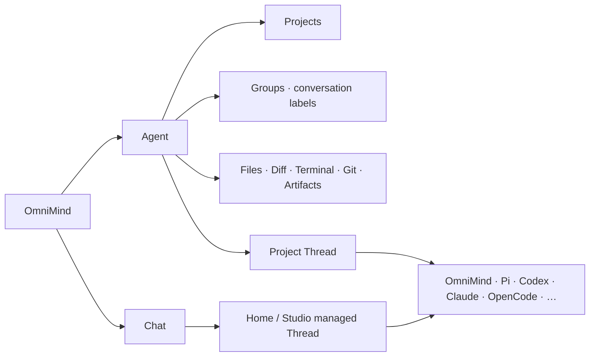

# Workbench

本文件是 OmniMind 唯一完整 UI 契约。V1 以 Synara 当前产品作为物理母体，保留其多 Provider、Project/Thread/Space、Studio、Workbench、Settings 与桌面交付能力；最终用户只感知 OmniMind 产品。OmniMind Agent 是内置默认 Provider，stock Pi 只在用户主动打开 Provider 选择或技术详情时作为独立可选项出现。

## 1. 设计立场

Synara 不是截图或灵感库，而是长期深耕这些问题的成熟产品。OmniMind 默认直接复用其 shell、navigation、Composer、Timeline、File、Diff、Terminal、Git、viewer、stream/scroll、settings、provider UI、performance 和 accessibility 机制。

复用不等于暴露 donor 品牌。App title、导航、空状态、onboarding、Agent/Chat、错误、更新、扩展与默认设置都使用 OmniMind 产品语言；`Synara`、`Pi-derived`、adapter/runtime 名称只进入 About、Licenses、诊断或用户主动展开的 Provider 技术详情。OmniMind 自有 workspace package 使用私有 `@omnimind/*` 作用域；真正承载上游或 Provider compatibility 的 API、环境变量与法定 identity 不因品牌被伪造或改写。

产品 surgery 只做四件事：

1. 替换品牌和准确 legal/provenance；
2. 将 `Agent | Chat` 作为清晰的两种工作入口；
3. 在 existing Registry 中接入 bundled OmniMind Agent，同时保留 stock Pi；
4. 补经真实 journey 证明存在的 OmniMind 差异。

没有可复现缺口时，不重画、不重写、不建第二状态。

## 2. 信息架构



`Agent | Chat` 是唯一一级工作入口，不是持久化类型。正常 shell 在侧栏顶部同时呈现 `Agent`（左）与 `Chat`（右），当前项与另一入口始终可见，用户一次激活即可切换；不得把另一入口收进 dropdown、overflow、Provider selector 或二级导航。入口直接绑定当前 route、restore 与 prewarm 机制，不能为了恢复旧视觉而重建常驻双 panel、第二份 selection state 或新的导航 authority。

用户在 Settings 中显式隐藏 Chat 时，可以只显示非交互的 `Agent` 标题；恢复 Chat 的入口仍由既有 Settings/search/deep-link 提供，不能留下只有一个选项的假 switcher。正常双入口必须在 source 最小侧栏宽度、简体中文/英文、键盘与 screen reader 下保持顺序、可见性、focus 和单次激活；实现应使用与当前 route 模型相符的互斥选择或 navigation 语义，不伪造不存在的 `tabpanel` 关系。

`Agent | Chat` 的“唯一一级”只约束工作模式，不删除 Agent 域二级控制台。Agent 选中时仍按 `New Task → Kanban → Pull Requests → Automations` 呈现；`/kanban` 是跨 Project 总览，`/kanban/:projectId` 是单 Project 看板，卡片回到对应 folder-backed Agent Thread，Project context menu 保留 `Open in Kanban`。Kanban route 的顶部仍表达 Agent 域，Chat 不把 Kanban 伪装成第三种工作模式。

```work-surface-ia
{
  "primaryModes": ["Agent", "Chat"],
  "agentSecondary": ["New Task", "Kanban", "Pull Requests", "Automations"],
  "kanbanRoutes": ["/kanban", "/kanban/:projectId"],
  "kanbanPrimaryMode": "Agent",
  "kanbanCardTarget": "folder-backed Agent Thread",
  "projectContextAction": "Open in Kanban",
  "agentSidebarSections": ["Projects", "Groups"],
  "groupTarget": "conversation-thread",
  "groupCardinality": "many-to-many",
  "ungroupedPresentation": "projects-only",
  "groupsDefaultState": "collapsed",
  "threadHeaderIdentity": {
    "emptyAgentOrChat": "hidden",
    "titledAgentOrChat": "title-only",
    "terminal": "terminal-icon-and-title",
    "genericTerminalTitle": "localized-ui-only"
  }
}
```

这项约束拥有的是稳定的产品结果，而不是旧提交的具体 DOM。历史实现可以作为视觉与行为证据，但不得整体 cherry-pick 已退休的 Product Control Plane、retained-panel 或其他旧架构。

### Agent

- 使用 folder-backed Project Thread；
- 显示 Files、Viewer、Diff、Changes、Terminal、Git、Output、Artifact 与完整 Workbench；
- 默认引擎显示为 OmniMind，技术实体是 bundled OmniMind Agent；也可以选择 stock Pi 或其他当前可用的 inherited adapter；
- 改变工作目录通过选择/创建 Project 完成，不在有实质工作后静默换 cwd；
- Projects 是 folder-backed Agent conversations 的完整来源，保持文件夹图标；Groups 是其下方默认折叠的会话归类视图，不过滤 Projects，也不给 Project 打标签。
- 一个 Thread 可以属于多个 Group；未分组 Thread 只留在 Projects，不出现“未分组”伪 Group。每个具体 Group 使用带稳定颜色的 tag glyph，section header 本身不放 tag glyph。
- Group 右键提供“添加会话…”，从 Projects 中多选 Thread；Projects 中的 Thread 右键提供“添加到分组…”，可多选 Group，并支持 `Shift+F10`。Project folder 本身不加入 Group；每个 Group 底部不重复放“添加会话”。
- 删除 Group 或移除 membership 不删除、不移动底层 Thread。Group identity/name/order 直接复用 Space；多分组 membership 是既有 Thread metadata 的 canonical field，不新增 `Group` aggregate、membership ledger、第二导航或恢复状态。

### Chat

- 使用 Synara Home/Studio managed Thread，无用户选择的 Primary Folder；
- 可以在 OmniMind-owned managed workspace/outbox 中生成 Artifact；
- 上传或引用的外部用户文件默认只读，不默认修改现有 Project；
- 不显示完整 Project Files/Git/Terminal 工作台，不暗中升级为可写 Agent；
- 需要修改真实项目时，显式 `Send to Agent`，选择/创建 Project Thread 并带入 prompt、attachments 与 artifact refs。

`Send to Agent` 不复制 Session、不 replay 旧 operation、不保证跨 Provider continuation，也不创建 Handoff platform。

## 3. Provider 与 Composer

Composer 复用现有输入、attachments、`+`、`@`、Provider、Model、traits、send、Queue 与 running controls。默认态和 Engine selector 的普通用户展示名使用 `OmniMind`，并与 `Pi` 及其他真实 Engine 明确区分，绝不合并。`OmniMind Agent` 只作为技术实体全称出现在 Engine technical detail、runtime/version、诊断、About 与 Licenses；内部 identity 继续为 `omnimind`。Pi lineage 与 license 不进入普通产品 label。

选择变化只影响下一次发送。当前 operation 不热换；Provider 切换沿用 stop-first replacement，失败恢复上一 exact binding。Timeline 可保留混合 Provider turns，但每个 turn 显示自己的 provenance。

Provider-specific 控制只在 capability data 支持时显示。这里的 capability gate 是逐 Provider 的可见性条件，不是实施团队可跳过真实能力的许可：当前选定 runtime 已暴露、且属于 V1 产品面的能力必须保持可发现、可操作和可恢复；不存在的能力才隐藏或准确显示 unavailable。不能伪造 steer、review、compaction、fork、approval、Skill 或 Plugin 能力，也不能 silent fallback。

## 4. Conversation、Timeline 与 Activity

Timeline 长期显示用户输入、Assistant 可见结果、结构化请求、重要 Tool/Activity，以及 File、Diff、Terminal、Artifact、Studio Output 引用和必要的 failure/unknown/recovery。

未发送首条消息且仍使用内部占位标题的 Agent/Chat 草稿，主内容顶栏左侧不渲染图标、标题或空 heading；形成真实标题或用户重命名后只显示标题，不显示 OmniMind/Provider 图标。Engine 与模型选择属于 Composer，混合 provenance 属于各 turn/Timeline；Terminal 因具有真实 surface 类型，保留 Terminal 图标与终端标题。Terminal 的 generic 持久占位值只在已确认 Terminal provenance 的普通 UI consumer 中按当前 locale 投影，重命名值、存储、搜索事实与诊断仍保持原文。该呈现规则不修改 Thread 的持久标题、生成/重命名流程，也不建立第二份标题 authority。

wire noise、逐 token event、重复系统消息与不应展示的 reasoning 不进入 Timeline。同一 stream item 原位归并；自然成功不额外 Toast。只有失败、结果未知、隐藏副作用或需要用户处理时升级提示。

Child Agent、Todo、Question 继续使用 source 已有的最小产品语义；不得借此创建第二 task system 或 Run hierarchy。

### 自动能力的显示原则

Goal、Agent 团队、动态工作流、记忆、知识库、会话恢复与 Computer Use 不是七个导航入口，也不是七张常驻卡。默认通过自然语言与运行条件自动触发，并只投影到已经存在的表面：

| 能力语义      | 平时                                            | 运行时                                                                                                                                                                                     | 结果/异常                                                                                                                                                                                                                     |
| ------------- | ----------------------------------------------- | ------------------------------------------------------------------------------------------------------------------------------------------------------------------------------------------ | ----------------------------------------------------------------------------------------------------------------------------------------------------------------------------------------------------------------------------- |
| 目标          | 不显示独立 Goal 实体                            | 复用 task list；范围真正变化才问                                                                                                                                                           | 最终回答准确说明完成/未完成                                                                                                                                                                                                   |
| Todo/当前步骤 | 无独立任务管理页                                | Composer 只保留一行真实进度；点击后在锚定 popover 展开步骤                                                                                                                                 | 完成后折叠或退场；不复制 task state                                                                                                                                                                                           |
| Agent 团队    | 不显示 team builder                             | 活跃时复用 `ComposerSubagentStrip`；Environment 用稳定身份纹样簇显示数量，点击进入 right dock/child Thread                                                                                 | root 汇总来源；settled 成员只在有复查价值的详情中保留                                                                                                                                                                         |
| 动态工作流    | 不显示通用 workflow editor                      | Timeline 保留有意义的阶段里程碑；Environment 保留一行可重新找到的索引；只有正在运行，或已暂停/失败/停止且存在即时恢复动作时，Composer 才显示一条薄控制行；三者都打开同一个 right-dock 详情 | 保留 Engine provenance，不把普通 tool sequence 画成 DAG；正常完成或无可行动恢复后 Composer 退场，Timeline 按现有 Thread/activity retention 保留；Environment 保留当前任务最近一次 terminal receipt，直到新 Run 替换或用户收起 |
| 记忆          | 自动、安静、无每条确认                          | 通常零 UI；确实影响回答时可显示一条可展开来源                                                                                                                                              | 通过 Workbench 的现有 Environment card 按需管理，不建 Memory pane                                                                                                                                                             |
| 知识库        | 用户正常提供/使用资料即可，不要求发起“知识更新” | 复用 File/Tool activity；后台维护不占 Composer                                                                                                                                             | Sources、Markdown、index、Diff 回到 Files/Changes；冲突只在影响结果时介入                                                                                                                                                     |
| 会话恢复      | 正常重开直接恢复                                | native resume 安静继续                                                                                                                                                                     | degraded/ambiguous 才在 Composer 前显示一条恢复介入                                                                                                                                                                           |
| Computer Use  | 无 capability card                              | 复用现有 Browser/Device pane 与 Timeline tool activity                                                                                                                                     | 文件、截图、下载与结果进入现有 Artifact/File 表面                                                                                                                                                                             |

UI 不展示 packaged、registered、context-loaded、cache breakpoint 或内部 candidate extraction。自然成功不 Toast；自动 Memory/Knowledge 的日常 write/recall 默认只进入可展开 Activity detail，不在 Timeline 为每次维护增加一行。用户主动打开 Workbench、查看来源、纠正、遗忘或诊断时，才加载完整详情。

## 5. 本地 Workbench

V1 直接保全 Synara 已有能力：

- Project/file tree、search、reveal、tabs、split、active pane；
- Markdown、PDF、Office、image、large text 与 unknown binary viewer；
- editable/saveable Explorer files、Diff、Changes、Output 与 Artifact；
- real PTY Terminal 与 per-thread terminal state；
- Git、commit、push、Pull Request、Kanban、Automations；
- Browser、Source Control、Side Chat、Subagents 和 Studio outputs；Engine 临时 Web UI 的 Host presentation policy 只由 [`architecture/execution.md`](execution.md#扩展与生态) 定义，Workbench 继续复用当前 Thread 的右侧非模态 Browser。

每个 Thread 恢复其 tabs、open files、layout、viewer refs 与 terminal state。具体 state 直接复用 source 实现，不新增 WorkbenchLayout aggregate。

文件保存、stale diff 与并发变化沿用 source 的 save/conflict behavior。只有能复现静默覆盖时才补最小检查；不建设 observed-version 平台。Git status 只表示 Git，外部文件变化通过重新观察呈现。

Terminal 使用真实 PTY，区分 running/exited，支持 input/copy/search/resize。terminal noise 不灌入 Timeline。

## 6. Settings

V1 保留 Synara 当前设置 IA、搜索、deep-link、分组和 keyboard behavior，不另起 `Models / Agents / Packages / Application` 四域重构。

当前 section 继续以 source 为准，例如 General、Profile、Appearance、Notifications、Chat behavior、Keybindings、Usage & limits、Agent providers、Model services、Agent skills、MCP connections、Managed worktrees、System tools 与 Archived threads。`Model services / 模型服务` 是对原 `Models & writing / 模型与写作` section 的定向改名与职责修正：保留现有 route、内部 section id `models`、搜索、deep-link、分组和 keyboard behavior，不借此重排整个 Settings taxonomy。

`Model services` 只管理 OmniMind 内置 Agent runtime 的模型服务连接、认证、catalog、可用模型、状态与恢复；技术 authority 是 bundled OmniMind Agent 的 Pi ModelRuntime。页面不承载 Git 写作、Composer/Project 默认值或独立 Engine 的 custom model slug。那些设置属于实际调用它们的功能或对应 `Agent engines` detail，不能因都含有“模型”就与连接/catalog 控制面混在一起。

“添加模型服务”先呈现搜索和选择 Pi runtime 当前真实暴露的 built-in/extension 服务，这是绝对主路径。低频的“没有找到你的服务？通过 API 地址连接 →”在 E6 capability 真实可用时于列表尾部弱一级呈现；未交付时不渲染禁用入口、“尚未开放”占位或其他无法完成的假操作。它不与常用服务做同权大卡片，也不藏入“高级设置”。这条次路径是必须交付的真实产品能力，不是可以用长期隐藏代替的未来设想：用户必须能测试并保存连接，关闭和重开后继续存在，并能编辑、重新测试、刷新模型和删除。普通 API 地址配置只表达 Pi `models.json` 官方支持的四种通用协议：OpenAI Chat Completions、OpenAI Responses、Anthropic Messages、Google Generative AI。非标准 API、私有 OAuth/SSO 与自定义 discovery/stream/tool/usage 必须由真实 Pi Extension 提供并自然出现在同一服务搜索中；Extension 服务的安全投影是 V1 必达结果，不是可选增强。被动 Settings 首屏不为发现列表执行第三方代码；用户进入“添加模型服务”后，以显式 intent 复用 Pi 既有 ResourceLoader/Session provenance owner 加载并投影，不能为此复制 loader 或建立全局 runtime。Host 不猜测协议、不维护静态供应商/模型镜像或逐供应商 fetcher。

Model services 使用同一 Settings pane 内互斥的 **概览 → 添加 → 详情** 三种视图，不把三者纵向堆在一个长页面。概览只显示已经配置、可恢复或正阻塞当前选择的服务，一行一个服务实例，并只有一个清楚的“添加模型服务”主动作；不能再把 Pi 支持的几十个服务铺成卡片墙。添加视图顶部是返回、标题和自动聚焦的搜索，结果使用紧凑可键盘导航的服务行；“通过 API 地址连接”固定在结果尾部作为较弱的文本动作。选择结果后用详情视图替换列表，返回时恢复原搜索、滚动与焦点，不把表单追加到长列表底部。

全新 profile 的 Chat 首屏只在**整个产品**都没有可发送的精确 Engine/model binding、Server facts 已稳定、且被动 Model-services 投影明确证明从未配置时，显示一个克制的就地 setup surface；不能仅因 OmniMind 服务为空便打断已经可用 Codex、Claude、Cursor、OpenCode、Kilo、stock Pi 或其他 Engine 的用户。unknown/loading、transport 断开、投影错误、已有配置但暂时 unavailable/auth-expired/catalog-error 必须与真正首次使用分开：前三者不伪装成 onboarding，已有服务走原连接的重试、登录与恢复。setup surface 复用现有“添加模型服务 → 详情 → OAuth/API Key/API 地址”流程，不新增 wizard backend、dismiss flag、onboarding 数据库或第二配置状态；被动资格判断不得加载 Extension、启动 Provider Session或触发网络 refresh。往返 Settings 时保留原 Thread、Composer 草稿、附件与返回位置；只有 typed mutation 成功且 authoritative runtime catalog 已产生真实可用模型时才返回 Chat，失败或取消仍停留在可恢复上下文。返回后的 selection 只能来自 runtime catalog，不合成静态 OmniMind 默认、空 model 或跨 Engine fallback。

视觉上复用 Settings 既有 typography、spacing、focus ring、divider 与 surface token，优先清晰的分组和留白，不为每个 Provider 再套独立大卡片、渐变底板或一串状态 badge。服务行的首要信息固定为图标、用户可识别名称和本地化状态；模型数量、来源与恢复提示是次要信息；endpoint、credential source、内部 id、完整 UUID 与 raw error 不进入默认层。窄宽度下次要信息自然换行或下沉，名称与主动作不得被挤掉；hover、focus、selected、loading、empty、error 和 reduced-motion 都必须有真实渲染证明。

模型服务的视觉身份与 Engine identity 分开管理。Composer 的 OmniMind、Codex、Pi 等 Engine 继续只使用现有 `ProviderIcon` owner；Model services 的 OpenAI、Anthropic、DeepSeek、Xiaomi、Google 等服务品牌在 E7 使用精确锁定、随 App 本地打包且零运行时依赖的 `@lobehub/icons-static-svg` 彩色资产。该依赖只负责 presentation：Pi runtime 仍唯一决定服务 id、名称、来源、认证、catalog、模型和 capability，图标命中或缺失都不得改变产品事实。Web 只建立一个薄的 model-service icon resolver，显式按需导入实际使用的静态资产；不得把图标表扩成 Provider Registry、静态供应商能力镜像或模型目录，也不得从 CDN、远程 URL 或未知 Extension 资源动态加载。普通缺失项使用统一模型服务 glyph；通过 API 地址连接使用中性 API/连接 glyph；Extension 仅在既有 trusted provenance owner 提供安全本地资产时采用，否则使用统一 Extension glyph。若更新图标包，只能选择同一官方仓库的零运行时依赖静态资产包并复核 exact version、integrity、MIT 文本与 packaged offline closure；不得为图标引入 `@lobehub/ui`、Ant Design 或其他 UI runtime。

彩色图标用于识别，不承担状态语义。overview、添加搜索、详情页和 Composer 的 model-service 分组应在文本身份之外使用同一视觉 resolver；connected/error/selected 仍必须有文字、结构或非颜色标记。同品牌多个实例共享品牌图标，以用户命名和稳定、非敏感的实例标签消歧，正常 UI 不展示完整 UUID。模型行只在 runtime model identity 与已打包 LobeHub model asset 精确匹配时显示模型专属图标，否则继承所属服务图标；不得为追求覆盖率建立 Host 静态 model-slug 镜像。依赖版本、MIT 许可、lockfile、legal/SBOM 与 packaged offline closure 在同一 E7 implementation commit 中闭合。

持久配置继续由 Pi 的 ModelConfig/ModelRuntime owner 管理。OmniMind 只提供 typed UI bridge、物理文件安全边界和 mutation 后的 runtime/catalog reconcile；不得另建 Host JSON parser/writer、Provider Registry、catalog fetcher、数据库或第二配置 store。锁定 Pi 尚无公开持久 mutation API 时，维护者已授权在既有 product-owned Pi source adoption 中补一个窄、typed、可删除的 mutation seam；stock Pi 保持原样，上游出现等价 API 后删除该补丁。endpoint、协议、模型定义和安全的 credential reference 必须按 Pi schema保存，renderer、日志和产品配置不得持久化明文 secret。

技术 authority 与用户语言必须分层。`Model services` 的 overview、添加/编辑、认证、模型列表、进度、Toast、错误和恢复属于 OmniMind 正常产品表面，只使用“模型服务、连接、登录、API Key、模型目录、本机凭据、重新加载”等用户概念；不得用 `Pi`、`Pi-derived`、`ModelRuntime`、`ModelConfig`、`models.json`、`runtime projection`、`credential owner`、内部 provider id、package/module 名或中英混杂术语解释 OmniMind 自身。普通详情中的来源只表达“OmniMind 内置 / 通过 API 地址连接 / 由 OmniMind 扩展提供”；精确文件、模块和 lineage 只在用户主动展开的技术详情、诊断、About、Licenses 或源码归属中出现。独立 stock Pi 仍在用户明确选择该 Engine 或查看其技术详情时准确显示为 `Pi`，不能为了品牌清理而改写其真实 identity。

凭据说明只陈述用户可验证且由当前实现保证的事实，例如“仅保存在这台设备上、用于连接该模型服务、保存后不再显示”；不能用“交给 Pi”“不在 OmniMind 设置中”等实现拓扑制造另一个产品心智，也不能无证据承诺 Keychain、加密级别、云端零接触或其他更强保证。API Key、OAuth、目录刷新与配置重载已经具有不同 typed state 时，应分别给出准确的本地化进度与恢复动作，不能用一个含糊的“等待模型服务”掩盖当前阶段。

typed bridge 只证明结构与秘密边界，不会自动把 Provider 原文变成 OmniMind 产品文案。正常认证对话框的标题、说明、状态、动作和可识别错误必须来自同一 en/zh-CN catalog；URL host、设备代码、模型/服务/选项的真实名称可以保持原文。Provider 的 raw prompt、instructions、progress message、error 或 stack 若对完成操作不可或缺，应以明确 provenance 放在次级说明或可展开技术详情，不能替代本地化主状态，也不能让普通中文路径因上游英文再次中英混杂；若缺少足够 typed 语义，准确保留 provider instruction 并标明来源，而不是猜测翻译或丢失操作信息。

浏览器 loopback OAuth completion/error 页面属于 E5 的 OmniMind 产品表面：使用亮色 OmniMind 品牌与 OmniMind 图标，不按 OpenAI 或其他单一供应商复制页面。callback 收到 code 只表示“已收到授权”，在 Pi 完成 token exchange、credential commit 与最终 login outcome 前不得显示“登录成功”或“已连接”；App 内同一 typed request 的最终结果仍是唯一成功 authority。renderer 只接收 request-scoped 的安全展示状态，不接收 code、token、Provider message/details 或原始诊断；没有 renderer 或 renderer 失败时保留 stock Pi 页面，不能移动或复制 OAuth 协议、callback server、state validation 或 token exchange。

这一边界必须有窄而成对的 source proof：模型服务正常 key 的 catalog 语义检查要阻止 donor/runtime/authority 词重新进入主表面，但不得全局禁止合法的 stock Pi identity；代表性的 API Key、OAuth、custom API、空目录与失败恢复渲染要证明中英文主状态、动作和秘密说明准确，并证明注入的上游英文/内部术语不会成为主文案；stock Pi Engine detail 的成对反例则证明真实 identity 没有被错误洗掉。翻译 key parity、组件只引用 `t(...)` 或技术测试绿色都不能单独关闭这项产品语言验收。

`Agent providers / Agent engines` 继续拥有 Codex、Claude、OpenCode、stock Pi 等独立 Engine 的安装、登录、健康状态与原生配置；这些 Engine 不被扁平化为 OmniMind Agent 的模型服务，也不把凭据迁入 OmniMind Agent 的 Pi private home。OmniMind 是 runtime-catalog-only Engine：没有 authoritative exact model 时保持未绑定并引导配置/选择，不从静态表、品牌或历史模型名合成默认值。锁定 Pi 当前只投影 DeepSeek V4 Flash / V4 Pro，Thinking 是模型原生 option；任何 Pi intake 都重新以 runtime catalog 为准，不能把这些名称升级成 Host 静态清单。

```model-services-ia
{
  "scope": ["connection", "authentication", "catalog", "models", "status-and-recovery"],
  "primaryAction": "select-runtime-model-service",
  "secondaryAction": "connect-by-api-address",
  "secondaryPlacement": "list-tail-lower-emphasis",
  "secondaryVisibility": "capability-gated-no-disabled-placeholder",
  "genericApiProtocols": [
    "openai-completions",
    "openai-responses",
    "anthropic-messages",
    "google-generative-ai"
  ],
  "nonstandardApiOwner": "pi-extension",
  "extensionServiceOutcome": "required-intent-scoped-runtime-projection",
  "customMutationOwner": "pi-model-config",
  "customMutationOutcome": "test-save-reopen-edit-refresh-delete",
  "customMutationAuthorization": "maintainer-approved-narrow-pi-owned-seam",
  "gitWritingOwner": "calling-feature-settings",
  "omnimindDefaultModel": "none-runtime-catalog-only",
  "customMutationGate": "E6"
}
```

OmniMind 只做：

- donor 品牌替换；
- OmniMind Agent 默认、bundled runtime version 与 model/auth readiness；stock Pi 的实际 session runtime version 和可选 local CLI version 分开显示；Pi lineage 只放在 provenance detail；
- Engine-specific 与 model-service-specific fields 的最小接线；
- About、Licenses、update 与 diagnostics 的准确内容。

新增设置必须进入最接近的既有 section，并通过现有 search/deep-link；不能为了架构整齐重排成熟 taxonomy。

`Usage & limits` 在同一既有页面中安静地区分两个区域，不新增顶层导航或视觉系统：

- **账户额度 / Account capacity**：只显示 Provider 原生账户容量、剩余百分比、重置时间、套餐、Credits、更新时间与陈旧标识；不显示 transcript 推算或本地历史 fallback。
- **历史用量 / Usage history**：显示 `24h / 7d / 30d / 全部历史`，并按 Provider、模型、工作区或日期查看会话数、输入/输出/缓存 token 与带定价版本的费用估算。

第一次打开历史用量只展示读取范围、隐私边界和一次确认，不静默扫描。确认后页面显示真实 `indexing / partial / ready / paused / stale`、files/bytes progress、最后更新时间以及 provider-scoped skipped/unsupported。按钮复用现有 Button、SettingsCard、Dialog/AlertDialog 与进度 primitive，提供暂停、继续、增量刷新、重新索引和清除派生索引；重新索引/清除需要说明只影响统计、不删除原始会话。

错误恢复只在历史区域内呈现，区分未授权、首次索引中的部分结果、个别文件跳过、Provider 格式暂不支持、索引器暂停和 last-good 陈旧结果，并固定说明“仅影响历史统计，不影响引擎和会话”。不使用 OOM、JSONL、heap 等实现词，不发戏剧性 Toast。所有新增状态、动作、筛选与说明同时进入简中/英文唯一 catalog。

## 7. 扩展与生态 UI

V1 不创建新的顶层 Package 平台。它恢复并复用 Synara 已有 PluginLibrary、Skills 页面和 provider discovery，以 `扩展`、`Skills`、`Plugins` 等既有产品入口呈现真实内容：

- OmniMind Agent 区显示其 bundled Pi-compatible manager/loader/settings/trust 的真实结果；锁定 runtime 已暴露的 install/update/remove/reload/enable 必须提供，未暴露的动作才不显示；
- stock Pi 与其他 Provider 保持 source 已有的 discovery、health 和原生动作，不为界面对称而新增 lifecycle API；
- item detail 可显示 source、publisher、license、artifact/version、compatible Provider/runtime 与 diagnostics；
- provider 不支持的动作直接不显示或说明 unavailable，绝不由另一 Provider 代办。

OmniMind-curated/preinstalled resources 用发行 manifest 说明 source、hash、license、经过验证的 Pi ecosystem compatibility range 和策展理由。`Curated` 不等于 sandbox，也不创建 runtime current/LKG。

禁止跨 Provider `PackageActivation`、统一 generation、通用 rollback、第二 Marketplace 或第二 loader。一个 Pi-compatible artifact 不因进入共同列表就对 Codex/Claude/OpenCode 可用。Synara PluginLibrary 只需移除其“静默选择第一个可 discovery Provider”的 fallback：若当前 Provider 不支持该页，必须让用户显式切换或准确显示不可用。

## 8. 权限与真实性

Composer 的运行模式是当前任务唯一的自动化选择；用户不应在 Provider、Browser、Device、下载和每个 Tool 上重复支付确认成本。完整语义由 [`architecture/execution.md`](execution.md#runtime-mode一个任务只有一个自动化边界) 拥有，Workbench 只负责准确投影：

- `完全访问 / Full access`：普通文件、命令、网络、Browser、Device、依赖、测试与任务内下载不出现 approval；
- `自动批准 / Approve for me`：只有 exact Engine/Host 存在真实自动 reviewer 时显示；
- `需要时询问 / Ask for approval`：只有 exact Engine/Host 存在可完成 request/response bridge 时显示；
- OAuth、2FA、系统原生权限、物理设备到场和用户未表达的不可逆外部动作使用“需要你完成/确认”的真实语言，不混称普通工具权限。

Provider/Host capability 改变时，Composer mode menu 由 loaded capability truth 决定：不支持的项隐藏或显示 unavailable reason，不能允许用户选择一个底层只会一律拒绝的 mode。Pi-family 当前没有 OmniMind approval request path 时，不显示 `需要时询问`。`acceptForSession` 若实际持久切换当前 Thread 为 `full-access`，按钮显示“此任务始终允许 / Always allow for this task”，不能显示“本会话始终允许”。

共同 UI 仍不建设第二 permission broker，也不把不同产品的 sandbox 字段判为相同底层实现。进程隔离、Package verification 与 Provider 声明不得包装成 OS sandbox；但这些隐藏工程边界不能被转化为无必要的用户审批仪式。

## 9. 运行时状态

不新增 Gold/Supported/Available-but-unverified/Unavailable 的持久 runtime tier。Gold 只用于内部验收优先级。

用户看到的是 source 已有且可观察的状态：ready/warning/error、available、auth、binary/version/update、model/capability 与具体 diagnostics。缺证据时显示 unknown 或不可用原因，而不是创造品牌级 tier。

## 10. 视觉、性能、双语与可访问性

### Device pane

iOS Simulator 作为现有 right dock 的 `device` pane 呈现，不新增顶层导航、Workspace 对象或跨 Provider 状态。入口只在 Server 运行于受支持的 macOS/Xcode 环境时出现；pane 以设备选择器、模拟器屏幕、真实 hardware/action controls、setup/degraded/boot/stream 状态和 destructive confirmation 组成。后台、preview 或不可见 pane 不持有视频订阅；断流按有界退避重连，sequence gap 重新请求 keyframe，不能让视频 backpressure 阻塞 RPC。

用户在 pane 内的点击、键盘、启动、关机、截图与录屏是显式 UI 操作；Agent mutation 的 approval 语义由 [`execution.md`](execution.md#本地系统能力) 唯一拥有。setup 状态允许直接展示命令、路径、Xcode 版本和原始 helper diagnostics，但所有 OmniMind-owned 标题、动作、进度、错误摘要、确认与无障碍标签必须进入同一 en/zh-CN catalog。capability degraded 是不遮挡屏幕的 notice：一个 private symbol 失效不能连带禁用仍可工作的 stream/input/capture。

先保全 Synara 当前 shell、panel geometry、Composer、Timeline、list density、theme、focus、motion 与 stream/scroll，再做一次完整 OmniMind 品牌和整体视觉校准。普通用户路径不得出现 Synara、Pi-derived、Native Host、adapter、donor 或 source-alignment 术语。拒绝重复 headers、胶囊泛滥、过度 cards、假 Activity 与模板化 AI 风。

能力图标只在真实状态、详情入口或管理动作出现，不组成能力墙。图标分为三个不能混用的层级：

1. **能力/集合图标**：表示“子智能体”“动态工作流”等 section 或 pane，跨入口保持统一；
2. **实例身份纹样**：表示某一个真实 child Agent。它不是能力图标，必须按 canonical child identity 确定性生成，并在 Environment、right dock、Timeline chip、Composer strip 和重开后的同一 child 中保持同一颜色与几何纹样；同一 parent 下发生碰撞时确定性顺延到下一候选；
3. **状态语义**：running、queued、completed、failed、blocked 由文字、tone 和必要的轻量 motion 表达，不能靠更换身份纹样或只靠颜色表达。

`apps/web/src/lib/subagentPresentation.ts` 已经以 label seed 生成八色 `accentColor`，因此实例纹样应扩展这一 owner，增加稳定 `glyphVariant`/identity seed，而不是新建 avatar store。`agent` 只属于第一层：用于“子智能体”集合标题、tab 或入口，不能复制到每个 Agent 行。Skill、Plugin、MCP 与所有既有全局概念继续复用当前统一图标，不做 Engine-specific 变体。

以下六项是维护者已锁定的能力/集合语义映射：

| 语义       | 锁定资产        | 来源与使用限制                                                                                          |
| ---------- | --------------- | ------------------------------------------------------------------------------------------------------- |
| 目标       | `target-arrow`  | 现有 Central reversed asset；仅在目标状态确实可行动时出现                                               |
| Agent 团队 | `agent`         | 现有 Central reversed asset；只用于 team/subagent 集合语义，不复制到每个 child，也不用于人类协作者      |
| 动态工作流 | `agent-network` | 现有 Central reversed asset；只用于工作流集合/入口，不替代 Agent 团队、child 身份、Git 图或 Automations |
| 知识库     | `books`         | 现有 Central reversed asset；经典书籍语义，只用于知识集合，不替代普通文件、文档或 Library navigation    |
| 记忆       | `brain-2`       | 现有 Central reversed asset；计算脑形，只用于 OmniMind project memory，不替代模型服务设置所用的 `brain` |
| 会话恢复   | `history`       | 现有 Central reversed asset；只用于已证明的 resume/recovery，不用于历史用量、Timeline 或 Automations    |

子智能体身份纹样采用小尺寸、低填充密度的确定性候选池，而不是为每个 Agent 维护一份手工 SVG。首个 production 候选池应从现有 Central 资产中策展 **24 个在 16px 仍可辨的低密度几何纹样 × 8 个 restrained accent**，提供 192 个组合后再按同一 parent/workflow 内 collision rule 顺延；名称始终同时出现，因此纹样是视觉 join key，不是唯一身份凭证。以 canonical child/thread id 取 seed，同一 resumed child 保持连续。纹样不编码角色、模型、Engine 或状态；这些信息由旁边文字和 provenance 承担。若 24 个候选在 16/20/24px 的邻接复核中不可区分，应删除相似项并补充更清晰的 Central 资产，而不是靠加粗、填满或提高饱和度制造差别。

### 运行摘要与右侧详情

Codex 截图所体现的可复用原则是“稳定身份 + 极短事实 + 渐进披露”，不是增加卡片：

- Environment card 是当前 Thread 的低噪声目录，可显示 changes、Todo、子智能体、structured workflow 与 sources 的一行摘要；没有真实状态的 section 不占位；
- Todo 默认行只显示 `第 x/n 步`、当前步骤和必要的 change totals；点击后用现有 popover/disclosure primitive 展开真实 task list，不创建 Todo pane；
- 子智能体摘要显示最多三个稳定身份纹样和 running/completed 数量；点击打开既有 child detail/right dock，列表、Timeline chip 与来源引用必须复用同一纹样。当前 structured workflow 已投影的 `WorkflowRunState.taskIds` 必须从 generic background/subagent 摘要排除；同一 child 不能同时计入 Workflow 行与“子智能体”行；
- structured workflow 在四个宿主中各只拥有一个互不竞争的角色：Timeline 记录已发生的里程碑；Composer 只在 running 或存在可立即执行的 pause/resume/recovery 时提供近手控制；Environment 是当前任务的持久索引；right dock 承担完整空间详情、筛选和 child 导航。所有投影从同一 Provider activities 与既有 bounded UI flags 经共享纯 selector 得到，不得各自复制 status、timer、agent list、paused/dismissed flags 或 optimistic command state；
- Composer 的 workflow 控制行只显示名称、当前 phase、最短进度与 pause/stop/resume/open；正常完成或已无可行动恢复时立即退场，pausedByUser 或 failed/stopped 且 exact run 可 resume 时可暂留恢复动作。它不显示完整 Agent 列表、模型、token、最近工具或 phase map；这些属于 right dock。未来只有 exact contract 增加 waiting 状态后才允许按同一规则显示 waiting，不能从 `runningCount === 0` 猜测；
- Timeline 只在 start、phase transition、重要失败/恢复和 terminal settlement 写一条用户可理解的 receipt；同一未稳定里程碑可原位更新，稳定后封存。不得为 poll、心跳、每个 Agent tick 或后台知识维护逐条刷 Timeline；
- Environment 的 workflow 行显示名称、当前 frontier 或 terminal status、`done/total` 与最多三个身份纹样，超出显示 `+N`。它只保留当前任务的一个 latest index：running/paused/failed/stopped 时原位更新，completed 后冻结为一行 terminal receipt；新的同类 Run 明确替换它，用户也可收起。Timeline 继续拥有完整历史，因此 Environment 不复制里程碑列表、结果正文或多 Run history；
- workflow pane 是只读空间解释与 terminal result surface，不是 editor。它使用四个不可再约的结构原语：**顺序、并行、选择、回环**。编排者—工作者是“顺序 + 并行 + 汇合”，评审—改写是“顺序 + 回环”，fallback 是“选择”，handoff 是控制权转移的 edge 语义而不是第五种拓扑。产品不向普通用户展示“模式选择器”；renderer 只根据 exact Engine/adapter 事实组合这些原语；
- 当前 Claude `WorkflowRunState` 只有 phase order、Agent membership、状态、usage/provenance 与 child Thread，没有 dependency、route、iteration 或 handoff edge，因此只渲染 phase-order spine 与 containment，不得从时间顺序、文案或 tool activity 猜测 Agent 间连线。未来 Pi result-driven loop 或 Engine-native graph 只有在现有 Provider activity owner 持久化 stable node/group identity 与 explicit transition fact 后，才能增加并行 dispatch/join、selected route、retry loop 或 handoff；这些是 presentation projection，不建立通用 Workflow runtime；
- terminal 不是“动画停止后消失”，而是同一图的稳定终态：运行 frontier 停止运动；已实际经过的 transition 变为实线；未选择分支只在 Engine 明确上报候选时弱化；loop 折叠成 iteration count；并行组折叠成完成/失败数量。pane 顶部只显示 terminal status、workflow 名称和一行结果摘要，下面保留 frozen topology 与可打开的失败节点/child/result references。当前 contract 的 `TaskCompletedPayload.summary`、status、Agent snapshots 与 usage 已足够提供第一版事实；`WorkflowRunState` builder 尚未透传 summary/usage 时应修现有 selector，不另建 outcome store；
- lifecycle status 与结果含义分开：继续使用 running/paused/completed/failed/stopped 真值；若 overall completed 但某些 child 失败，只写“已完成 · 2 个 Agent 失败”，不得擅自升级成 `partial success`。只有 Engine 明确给出 conclusion 时才增加 conclusion projection。失败/停止必须指出 exact frontier 和可用的 resume/retry/open action；正常完成只保留“查看结果”，不制造 rerun；
- 普通 tool calls、Todo 或无结构 Pi loop 不推断成 DAG。没有 provider structured workflow 时，不显示流程图入口；
- 结构图使用同一套小型 visual grammar：group、step/Agent、transition、join/result 四类形状；transition 只有 next/dispatch/join/selected/retry/handoff 六种语义。active frontier 可有一条低频流动提示，node 状态变化可短暂过渡；后台/不可见、terminal 或 `prefers-reduced-motion` 时停止持续动画。图中默认只显示能改变判断的短标签；模型、effort、token、耗时、工具与说明只在选中、异常或 terminal summary 中出现。节点不得重复写“已完成”；status 仍必须通过 accessible name、tone 和非纯颜色形态被感知。

right dock 是既有宿主；实现时只在现有 `RightDockPaneKind` owner 中增加 `workflow` 与指向真实 `workflowTaskId` 的 bounded identity，不新增 workflow route、store、database 或第二 runtime。当前 phase-only 数据先做两种同数据 fixture 的 focused bake-off：宿主 DOM/SVG 的 phase-map composition，以及 React Flow 的只读 grouped-node profile。出现任一事实就优先采用成熟 renderer：代表性 workflow 可达到 100+ Agent、需要 pan/zoom/fit、需要 visible-element rendering，或自写布局/键盘/viewport 责任开始增长。React Flow 必须关闭 drag/connect/delete/editor，只把 nodes/parent groups/phase-order edges 作为纯投影；X6 仅在 React Flow 的嵌套、路由或规模 proof 失败时升级；Mermaid 只作静态文档/导出。任何采用都必须 exact-version 复核 license、bundle、重复 Zustand runtime、keyboard/screen-reader、theme、offline packaged 与 continuous-update 性能，不能偷用 Pi transitive package，也不能因 renderer 存在而引入 workflow editor/runtime。证据与候选顺序由 [`research/omnimind-agent-capability-surface.md`](../research/omnimind-agent-capability-surface.md#34-renderer-intake先匹配真实数据再决定是否需要图引擎) 维护。

focused proof 至少覆盖 4/20/120 Agent、3–8 groups、四种结构原语的单独与混合组合，以及 running/paused/completed/failed/stopped。100+ Agent 默认只渲染 group overview、current/selected group 的 bounded children 和搜索命中；其余 group 聚合为 `done/running/failed/total`，不把 120 个节点同时动画或塞进 Timeline/Environment。completed fixture 必须验证 Environment latest receipt 仍可重开、RightDock frozen result 可读、Composer 已退场；branch/loop/handoff 只有 explicit fact fixture 才画。不能用官网 demo 选美替代真实 fixture，也不能让研究原型成为 production component donor。

2026-08-13 对当前 HEAD 的代码扫描确认：六个锁定资产都已存在于 `apps/web/public/central-icons-reversed`，且 `apps/web/src` 尚无产品调用，因此不需要新增或重画 SVG。近义现有占用必须保持分离：模型服务设置继续使用 `brain`，通用 Book wrapper 继续使用 `book-simple`，Automations 继续使用 `arrow-rotate-clockwise`；本表的 `brain-2`、`books`、`history` 不替换这些既有语义。正式接入仍须在当次 HEAD 重跑 usage/visual collision scan，并在 16/20/24px、light/dark、currentColor、1x/2x 与真实邻接环境下校验。不得再用 emoji、CSS 假图标、临时通用 glyph 或 custom 重画版本代替。`agent-network` 的语义租约只覆盖工作流集合/入口；它不得成为 Agent 团队、单个 child 身份、通用网络/集成或 Git branch/merge 的别名。

性能以真实 journey/profile 验证：startup、Thread switch、continuous stream、long thread、large list/output、Viewer/Diff、Terminal、watcher storm、background work、memory growth 与 IME。不设任意 100k 字符门槛。

Synara `02c8a6c…` 没有覆盖完整产品面的 i18n catalog；浏览器 locale、零散本地文案和英文默认 UI 不能冒充完整双语。source reset 后只新增一套逻辑上的轻量 OmniMind message catalog；实现可以按语言或稳定产品域拆开源码，但不能形成第二套运行时 catalog、Settings 或 localization platform。继续沿用 source 的组件、DOM、focus、geometry 与交互，不为翻译重写 Workbench。

Settings 提供 `System / 简体中文 / English`，默认跟随 OS/browser；中文界面的第一项显示“跟随系统”，英文界面显示 `System`。简体中文和英文是首发及未来功能的默认完整路径：任何新增或修改的 OmniMind-owned 用户文案必须在同一变更中交付两种语言，key 与 placeholder 一一对应；已支持语言缺少 key 时构建失败，不允许在正常路径逐项 fallback 成中英混杂。未来语言只有完整覆盖正常产品路径后才能进入 Settings；未支持的系统语言回退英文。

双语以用户语义和内容 ownership 为边界，而不是逐词翻译：

- `OmniMind`、`Agent`、`Chat` 保留产品身份；Agent 域使用“新建任务 / New Task”和“任务”，Chat 域使用“新建对话 / New Chat”和“对话”。`OmniMind Agent` 只在技术详情、runtime、诊断、About、Licenses 与来源语境中作为完整技术实体名。`Thread` 不进入普通用户语言，`Session` 只在真实认证、连接、恢复 ID 或诊断语境出现。
- “Agent 团队 / Agent Team”是能力与研究语义；运行时集合标题使用更具体的“子智能体 / Subagents”，单个实例直接显示其 nickname/任务名，不把“团队”重复到每一行。`agent` 表示集合，实例身份纹样表示具体 child。
- Codex、Pi、OpenCode 与 OmniMind 在普通界面称为“引擎”；OpenAI、MiMo、DeepSeek 等模型/API 来源称为“模型服务商”。`Provider` 只在内部 API 或主动展开的技术详情中保留。
- Workbench、Library、Project、Group、Kanban、Terminal、Skill、Plugin、Repository、Branch、Commit、Push、Diff、Worktree、Pull Request 等采用自然中文产品词；`Git`、`MCP`、`API`、`CLI`、`JSON`、`URL`、`ID` 与 AI 计量单位 `token` 保留标准写法。命令、参数、环境变量、路径、文件名、模型名和品牌名保持原文。
- 技能、插件、工具与 MCP 服务的真实名称始终保留来源原文。OmniMind-owned 资产的名称说明与操作文案完整双语；Engine-native 或第三方资产的原始简介保留 provenance，不由 Host 擅自翻译或运行时机翻。
- 中文产品文案简洁、直接、友好；标签和按钮省略无意义主语，引导在必要时使用“你”而不用“您”，错误明确说明发生了什么和下一步动作。英文独立按自然英文写作，不从中文逐字回译。
- 可识别故障显示本地化摘要与恢复动作；Engine、模型服务商或 CLI 的原始错误、日志和 stack 保持原文，只进入可展开、可复制的技术详情。未知故障不得编造原因。
- locale 只控制 OmniMind-owned 产品界面、日期、时间与数字格式；不向模型静默注入回复语言，不翻译或改写用户内容、项目/分组名称、既有对话或模型输出。

catalog 覆盖正常用户可达的 shell、Agent/Chat、Projects/Groups、Composer、Timeline、Workbench、Settings、插件/技能、错误与更新文案。上述产品面在两种语言下共同支持 keyboard、screen reader、focus order、contrast、focus-visible、CJK、IME、reduced motion 与 source 最小窗口/侧栏宽度；文案长度通过既有 flex、wrap、truncate 与 disclosure 责任适配，不创建语言专属 DOM 或导航。

## 11. 三平台产品面

V1 复用现有 Electron build/package/updater：

- macOS、Windows、Linux 产物可安装、启动、更新和重新安装恢复；
- macOS/Windows signing、notarization 或平台证书按实际发行条件完成；
- update 检查、下载、重启、错误、retry 与 release provenance 准确；
- updater 保持 downgrade disabled，不承诺自动应用回滚。

Git `canary:rollback` 只用于开发工作流，不是用户产品功能。

## 12. 完成门

V1 UI 候选至少证明：

- `Agent | Chat` 复用同一 Project/Thread/Provider substrate，边界准确；
- 正常侧栏顶部的 `Agent`（左）与 `Chat`（右）同时可见、一次激活，在最小侧栏宽度与中英文下无溢出；用户显式隐藏 Chat 时不呈现单选项假 switcher；
- bundled OmniMind Agent 的 Provider/Model/Thinking、Session、stream、Tool、abort、resume 与代表性 Pi-ecosystem journey 可用；
- stock Pi 作为独立 Provider 可选择，identity/version/state 与 OmniMind Agent 不混用；
- inherited Providers 没有因 OmniMind surgery 回退，状态与能力准确；
- File、Viewer、Diff、Terminal、Git、Artifact 与 Studio Output 仍是 integrated product；
- 既有 Plugin/Skill discovery 完整恢复；OmniMind Agent 的扩展动作直接驱动原生 lifecycle，其他 Provider 只呈现其真实 discovery/actions；
- Settings IA、中文/英文、keyboard、screen reader、reduced motion 与真实性能通过；
- macOS、Windows、Linux 安装后的核心 journey 通过；
- 没有第二 Product Control Plane、Package state、silent fallback、fake parity、fake progress 或 fake permission；
- `full-access` 从 Engine 到 Browser/Device/Gateway 的普通操作无二次确认，其他 mode 只在真实 supported 时出现；
- 自动 Memory/Knowledge 不要求用户发起维护命令或逐条批准，默认 UI 安静，来源与管理按需可达；
- 六个锁定能力图标只出现在真实语义位置，Skills/Plugins 等全局概念不发生图标分裂或冲突；
- 同状态人工视觉复核无 material finding。

本文冻结 UI 结果，不自证当前代码已经满足。
