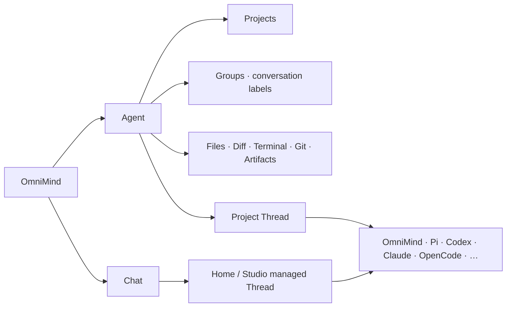

# Workbench

本文件是 OmniMind 唯一完整 UI 契约。V1 以 Synara 当前产品作为物理母体，保留其多 Provider、Project/Thread/Space、Studio、Workbench、Settings 与桌面交付能力；最终用户只感知 OmniMind 产品。OmniMind Agent 是内置默认 Provider，stock Pi 只在用户主动打开 Provider 选择或技术详情时作为独立可选项出现。

## 1. 设计立场

Synara 不是截图或灵感库，而是长期深耕这些问题的成熟产品。OmniMind 默认直接复用其 shell、navigation、Composer、Timeline、File、Diff、Terminal、Git、viewer、stream/scroll、settings、provider UI、performance 和 accessibility 机制。

复用不等于暴露 donor 品牌。App title、导航、空状态、onboarding、Agent/Chat、错误、更新、扩展与默认设置都使用 OmniMind 产品语言；`Synara`、`Pi-derived`、adapter/runtime 名称只进入 About、Licenses、诊断或用户主动展开的 Provider 技术详情。OmniMind 自有 workspace package 使用私有 `@omnimind/*` 作用域；真正承载上游或 Provider compatibility 的 API、环境变量与法定 identity 不因品牌被伪造或改写。

产品 surgery 只做四件事：

1. 替换品牌和准确 legal/provenance；
2. 将 `Agent | Chat` 作为清晰的两种工作入口；
3. 在 existing Registry 中接入 bundled OmniMind Agent，同时保留 stock Pi；
4. 补经真实 journey 证明存在的 OmniMind 差异。

没有可复现缺口时，不重画、不重写、不建第二状态。

## 2. 信息架构



`Agent | Chat` 是唯一一级工作入口，不是持久化类型。正常 shell 在侧栏顶部同时呈现 `Agent`（左）与 `Chat`（右），当前项与另一入口始终可见，用户一次激活即可切换；不得把另一入口收进 dropdown、overflow、Provider selector 或二级导航。入口直接绑定当前 route、restore 与 prewarm 机制，不能为了恢复旧视觉而重建常驻双 panel、第二份 selection state 或新的导航 authority。

用户在 Settings 中显式隐藏 Chat 时，可以只显示非交互的 `Agent` 标题；恢复 Chat 的入口仍由既有 Settings/search/deep-link 提供，不能留下只有一个选项的假 switcher。正常双入口必须在 source 最小侧栏宽度、简体中文/英文、键盘与 screen reader 下保持顺序、可见性、focus 和单次激活；实现应使用与当前 route 模型相符的互斥选择或 navigation 语义，不伪造不存在的 `tabpanel` 关系。

`Agent | Chat` 的“唯一一级”只约束工作模式，不删除 Agent 域二级控制台。Agent 选中时仍按 `New Task → Kanban → Pull Requests → Automations` 呈现；`/kanban` 是跨 Project 总览，`/kanban/:projectId` 是单 Project 看板，卡片回到对应 folder-backed Agent Thread，Project context menu 保留 `Open in Kanban`。Kanban route 的顶部仍表达 Agent 域，Chat 不把 Kanban 伪装成第三种工作模式。

```work-surface-ia
{
  "primaryModes": ["Agent", "Chat"],
  "agentSecondary": ["New Task", "Kanban", "Pull Requests", "Automations"],
  "kanbanRoutes": ["/kanban", "/kanban/:projectId"],
  "kanbanPrimaryMode": "Agent",
  "kanbanCardTarget": "folder-backed Agent Thread",
  "projectContextAction": "Open in Kanban",
  "agentSidebarSections": ["Projects", "Groups"],
  "groupTarget": "conversation-thread",
  "groupCardinality": "many-to-many",
  "ungroupedPresentation": "projects-only",
  "groupsDefaultState": "collapsed",
  "threadHeaderIdentity": {
    "emptyAgentOrChat": "hidden",
    "titledAgentOrChat": "title-only",
    "terminal": "terminal-icon-and-title",
    "genericTerminalTitle": "localized-ui-only"
  }
}
```

这项约束拥有的是稳定的产品结果，而不是旧提交的具体 DOM。历史实现可以作为视觉与行为证据，但不得整体 cherry-pick 已退休的 Product Control Plane、retained-panel 或其他旧架构。

### Agent

- 使用 folder-backed Project Thread；
- 显示 Files、Viewer、Diff、Changes、Terminal、Git、Output、Artifact 与完整 Workbench；
- 默认引擎显示为 OmniMind，技术实体是 bundled OmniMind Agent；也可以选择 stock Pi 或其他当前可用的 inherited adapter；
- 改变工作目录通过选择/创建 Project 完成，不在有实质工作后静默换 cwd；
- Projects 是 folder-backed Agent conversations 的完整来源，保持文件夹图标；Groups 是其下方默认折叠的会话归类视图，不过滤 Projects，也不给 Project 打标签。
- 一个 Thread 可以属于多个 Group；未分组 Thread 只留在 Projects，不出现“未分组”伪 Group。每个具体 Group 使用带稳定颜色的 tag glyph，section header 本身不放 tag glyph。
- Group 右键提供“添加会话…”，从 Projects 中多选 Thread；Projects 中的 Thread 右键提供“添加到分组…”，可多选 Group，并支持 `Shift+F10`。Project folder 本身不加入 Group；每个 Group 底部不重复放“添加会话”。
- 删除 Group 或移除 membership 不删除、不移动底层 Thread。Group identity/name/order 直接复用 Space；多分组 membership 是既有 Thread metadata 的 canonical field，不新增 `Group` aggregate、membership ledger、第二导航或恢复状态。

### Chat

- 使用 Synara Home/Studio managed Thread，无用户选择的 Primary Folder；
- 可以在 OmniMind-owned managed workspace/outbox 中生成 Artifact；
- 上传或引用的外部用户文件默认只读，不默认修改现有 Project；
- 不显示完整 Project Files/Git/Terminal 工作台，不暗中升级为可写 Agent；
- 需要修改真实项目时，显式 `Send to Agent`，选择/创建 Project Thread 并带入 prompt、attachments 与 artifact refs。

`Send to Agent` 不复制 Session、不 replay 旧 operation、不保证跨 Provider continuation，也不创建 Handoff platform。

## 3. Provider 与 Composer

Composer 复用现有输入、attachments、`+`、`@`、Provider、Model、traits、send、Queue 与 running controls。默认态和 Engine selector 的普通用户展示名使用 `OmniMind`，并与 `Pi` 及其他真实 Engine 明确区分，绝不合并。`OmniMind Agent` 只作为技术实体全称出现在 Engine technical detail、runtime/version、诊断、About 与 Licenses；内部 identity 继续为 `omnimind`。Pi lineage 与 license 不进入普通产品 label。

选择变化只影响下一次发送。当前 operation 不热换；Provider 切换沿用 stop-first replacement，失败恢复上一 exact binding。Timeline 可保留混合 Provider turns，但每个 turn 显示自己的 provenance。

Provider-specific 控制只在 capability data 支持时显示。不能伪造 steer、review、compaction、fork、approval、Skill 或 Plugin 能力，也不能 silent fallback。

## 4. Conversation、Timeline 与 Activity

Timeline 长期显示用户输入、Assistant 可见结果、结构化请求、重要 Tool/Activity，以及 File、Diff、Terminal、Artifact、Studio Output 引用和必要的 failure/unknown/recovery。

未发送首条消息且仍使用内部占位标题的 Agent/Chat 草稿，主内容顶栏左侧不渲染图标、标题或空 heading；形成真实标题或用户重命名后只显示标题，不显示 OmniMind/Provider 图标。Engine 与模型选择属于 Composer，混合 provenance 属于各 turn/Timeline；Terminal 因具有真实 surface 类型，保留 Terminal 图标与终端标题。Terminal 的 generic 持久占位值只在已确认 Terminal provenance 的普通 UI consumer 中按当前 locale 投影，重命名值、存储、搜索事实与诊断仍保持原文。该呈现规则不修改 Thread 的持久标题、生成/重命名流程，也不建立第二份标题 authority。

wire noise、逐 token event、重复系统消息与不应展示的 reasoning 不进入 Timeline。同一 stream item 原位归并；自然成功不额外 Toast。只有失败、结果未知、隐藏副作用或需要用户处理时升级提示。

Child Agent、Todo、Question 继续使用 source 已有的最小产品语义；不得借此创建第二 task system 或 Run hierarchy。

## 5. 本地 Workbench

V1 直接保全 Synara 已有能力：

- Project/file tree、search、reveal、tabs、split、active pane；
- Markdown、PDF、Office、image、large text 与 unknown binary viewer；
- editable/saveable Explorer files、Diff、Changes、Output 与 Artifact；
- real PTY Terminal 与 per-thread terminal state；
- Git、commit、push、Pull Request、Kanban、Automations；
- Browser、Source Control、Side Chat、Subagents 和 Studio outputs；Engine 临时 Web UI 的 Host presentation policy 只由 [`architecture/execution.md`](execution.md#扩展与生态) 定义，Workbench 继续复用当前 Thread 的右侧非模态 Browser。

每个 Thread 恢复其 tabs、open files、layout、viewer refs 与 terminal state。具体 state 直接复用 source 实现，不新增 WorkbenchLayout aggregate。

文件保存、stale diff 与并发变化沿用 source 的 save/conflict behavior。只有能复现静默覆盖时才补最小检查；不建设 observed-version 平台。Git status 只表示 Git，外部文件变化通过重新观察呈现。

Terminal 使用真实 PTY，区分 running/exited，支持 input/copy/search/resize。terminal noise 不灌入 Timeline。

## 6. Settings

V1 保留 Synara 当前设置 IA、搜索、deep-link、分组和 keyboard behavior，不另起 `Models / Agents / Packages / Application` 四域重构。

当前 section 继续以 source 为准，例如 General、Profile、Appearance、Notifications、Chat behavior、Keybindings、Usage & limits、Agent providers、Model services、Agent skills、MCP connections、Managed worktrees、System tools 与 Archived threads。`Model services / 模型服务` 是对原 `Models & writing / 模型与写作` section 的定向改名与职责修正：保留现有 route、内部 section id `models`、搜索、deep-link、分组和 keyboard behavior，不借此重排整个 Settings taxonomy。

`Model services` 是 OmniMind 内置 Agent runtime 的模型/API 服务配置中心；技术上由 bundled OmniMind Agent 的 Pi ModelRuntime 负责。页面呈现 Pi 实际支持的 provider、credential/API key、OAuth、模型目录刷新、目录缓存与 custom provider instance；同一上游供应商允许以不同稳定 provider id 配置多个 Pi 可表达的服务实例。这里复用并跟随锁定 Pi package 的真实 API、持久化格式与 capability，不维护平行的供应商枚举、静态模型镜像、逐供应商网络 fetcher 或独立 Channel runtime。Pi 上游不能表达的 auth、catalog 或 provider 语义不为界面对称而伪造。

`Agent providers / Agent engines` 继续拥有 Codex、Claude、OpenCode、stock Pi 等独立 Engine 的安装、登录、健康状态与原生配置；这些 Engine 不被扁平化为 OmniMind Agent 的模型服务，也不把凭据迁入 OmniMind Agent 的 Pi private home。现有 Git writing default 作为 `Model services` 内的次级产品默认值保留，不再定义整页名称或首要职责。

OmniMind 只做：

- donor 品牌替换；
- OmniMind Agent 默认、bundled runtime version 与 model/auth readiness；stock Pi 的实际 session runtime version 和可选 local CLI version 分开显示；Pi lineage 只放在 provenance detail；
- Engine-specific 与 model-service-specific fields 的最小接线；
- About、Licenses、update 与 diagnostics 的准确内容。

新增设置必须进入最接近的既有 section，并通过现有 search/deep-link；不能为了架构整齐重排成熟 taxonomy。

`Usage & limits` 在同一既有页面中安静地区分两个区域，不新增顶层导航或视觉系统：

- **账户额度 / Account capacity**：只显示 Provider 原生账户容量、剩余百分比、重置时间、套餐、Credits、更新时间与陈旧标识；不显示 transcript 推算或本地历史 fallback。
- **历史用量 / Usage history**：显示 `24h / 7d / 30d / 全部历史`，并按 Provider、模型、工作区或日期查看会话数、输入/输出/缓存 token 与带定价版本的费用估算。

第一次打开历史用量只展示读取范围、隐私边界和一次确认，不静默扫描。确认后页面显示真实 `indexing / partial / ready / paused / stale`、files/bytes progress、最后更新时间以及 provider-scoped skipped/unsupported。按钮复用现有 Button、SettingsCard、Dialog/AlertDialog 与进度 primitive，提供暂停、继续、增量刷新、重新索引和清除派生索引；重新索引/清除需要说明只影响统计、不删除原始会话。

错误恢复只在历史区域内呈现，区分未授权、首次索引中的部分结果、个别文件跳过、Provider 格式暂不支持、索引器暂停和 last-good 陈旧结果，并固定说明“仅影响历史统计，不影响引擎和会话”。不使用 OOM、JSONL、heap 等实现词，不发戏剧性 Toast。所有新增状态、动作、筛选与说明同时进入简中/英文唯一 catalog。

## 7. 扩展与生态 UI

V1 不创建新的顶层 Package 平台。它恢复并复用 Synara 已有 PluginLibrary、Skills 页面和 provider discovery，以 `扩展`、`Skills`、`Plugins` 等既有产品入口呈现真实内容：

- OmniMind Agent 区显示其 bundled Pi-compatible manager/loader/settings/trust 的真实结果，并且只有它已暴露原生 API 时才提供 install/update/remove/reload/enable；
- stock Pi 与其他 Provider 保持 source 已有的 discovery、health 和原生动作，不为界面对称而新增 lifecycle API；
- item detail 可显示 source、publisher、license、artifact/version、compatible Provider/runtime 与 diagnostics；
- provider 不支持的动作直接不显示或说明 unavailable，绝不由另一 Provider 代办。

OmniMind-curated/preinstalled resources 用发行 manifest 说明 source、hash、license、经过验证的 Pi ecosystem compatibility range 和策展理由。`Curated` 不等于 sandbox，也不创建 runtime current/LKG。

禁止跨 Provider `PackageActivation`、统一 generation、通用 rollback、第二 Marketplace 或第二 loader。一个 Pi-compatible artifact 不因进入共同列表就对 Codex/Claude/OpenCode 可用。Synara PluginLibrary 只需移除其“静默选择第一个可 discovery Provider”的 fallback：若当前 Provider 不支持该页，必须让用户显式切换或准确显示不可用。

## 8. 权限与真实性

共同 UI 只呈现 Provider/Host 实际产生的 approval、scope、consequence 与 result。Provider-native policy 字段保持 namespaced；没有请求就不显示虚构 permission flow。

不建设第二 permission broker，不建立跨 Provider deny-side-effect 测试矩阵，不把不同产品的 full access/sandbox 词汇判为等价。进程隔离、Package verification 与 Provider 声明都不得包装成 OS sandbox。

## 9. 运行时状态

不新增 Gold/Supported/Available-but-unverified/Unavailable 的持久 runtime tier。Gold 只用于内部验收优先级。

用户看到的是 source 已有且可观察的状态：ready/warning/error、available、auth、binary/version/update、model/capability 与具体 diagnostics。缺证据时显示 unknown 或不可用原因，而不是创造品牌级 tier。

## 10. 视觉、性能、双语与可访问性

### Device pane

iOS Simulator 作为现有 right dock 的 `device` pane 呈现，不新增顶层导航、Workspace 对象或跨 Provider 状态。入口只在 Server 运行于受支持的 macOS/Xcode 环境时出现；pane 以设备选择器、模拟器屏幕、真实 hardware/action controls、setup/degraded/boot/stream 状态和 destructive confirmation 组成。后台、preview 或不可见 pane 不持有视频订阅；断流按有界退避重连，sequence gap 重新请求 keyframe，不能让视频 backpressure 阻塞 RPC。

用户在 pane 内的点击、键盘、启动、关机、截图与录屏是显式 UI 操作；Agent mutation 的 approval 语义由 [`execution.md`](execution.md#本地系统能力) 唯一拥有。setup 状态允许直接展示命令、路径、Xcode 版本和原始 helper diagnostics，但所有 OmniMind-owned 标题、动作、进度、错误摘要、确认与无障碍标签必须进入同一 en/zh-CN catalog。capability degraded 是不遮挡屏幕的 notice：一个 private symbol 失效不能连带禁用仍可工作的 stream/input/capture。

先保全 Synara 当前 shell、panel geometry、Composer、Timeline、list density、theme、focus、motion 与 stream/scroll，再做一次完整 OmniMind 品牌和整体视觉校准。普通用户路径不得出现 Synara、Pi-derived、Native Host、adapter、donor 或 source-alignment 术语。拒绝重复 headers、胶囊泛滥、过度 cards、假 Activity 与模板化 AI 风。

性能以真实 journey/profile 验证：startup、Thread switch、continuous stream、long thread、large list/output、Viewer/Diff、Terminal、watcher storm、background work、memory growth 与 IME。不设任意 100k 字符门槛。

Synara `02c8a6c…` 没有覆盖完整产品面的 i18n catalog；浏览器 locale、零散本地文案和英文默认 UI 不能冒充完整双语。source reset 后只新增一套逻辑上的轻量 OmniMind message catalog；实现可以按语言或稳定产品域拆开源码，但不能形成第二套运行时 catalog、Settings 或 localization platform。继续沿用 source 的组件、DOM、focus、geometry 与交互，不为翻译重写 Workbench。

Settings 提供 `System / 简体中文 / English`，默认跟随 OS/browser；中文界面的第一项显示“跟随系统”，英文界面显示 `System`。简体中文和英文是首发及未来功能的默认完整路径：任何新增或修改的 OmniMind-owned 用户文案必须在同一变更中交付两种语言，key 与 placeholder 一一对应；已支持语言缺少 key 时构建失败，不允许在正常路径逐项 fallback 成中英混杂。未来语言只有完整覆盖正常产品路径后才能进入 Settings；未支持的系统语言回退英文。

双语以用户语义和内容 ownership 为边界，而不是逐词翻译：

- `OmniMind`、`Agent`、`Chat` 保留产品身份；Agent 域使用“新建任务 / New Task”和“任务”，Chat 域使用“新建对话 / New Chat”和“对话”。`OmniMind Agent` 只在技术详情、runtime、诊断、About、Licenses 与来源语境中作为完整技术实体名。`Thread` 不进入普通用户语言，`Session` 只在真实认证、连接、恢复 ID 或诊断语境出现。
- Codex、Pi、OpenCode 与 OmniMind 在普通界面称为“引擎”；OpenAI、MiMo、DeepSeek 等模型/API 来源称为“模型服务商”。`Provider` 只在内部 API 或主动展开的技术详情中保留。
- Workbench、Library、Project、Group、Kanban、Terminal、Skill、Plugin、Repository、Branch、Commit、Push、Diff、Worktree、Pull Request 等采用自然中文产品词；`Git`、`MCP`、`API`、`CLI`、`JSON`、`URL`、`ID` 与 AI 计量单位 `token` 保留标准写法。命令、参数、环境变量、路径、文件名、模型名和品牌名保持原文。
- 技能、插件、工具与 MCP 服务的真实名称始终保留来源原文。OmniMind-owned 资产的名称说明与操作文案完整双语；Engine-native 或第三方资产的原始简介保留 provenance，不由 Host 擅自翻译或运行时机翻。
- 中文产品文案简洁、直接、友好；标签和按钮省略无意义主语，引导在必要时使用“你”而不用“您”，错误明确说明发生了什么和下一步动作。英文独立按自然英文写作，不从中文逐字回译。
- 可识别故障显示本地化摘要与恢复动作；Engine、模型服务商或 CLI 的原始错误、日志和 stack 保持原文，只进入可展开、可复制的技术详情。未知故障不得编造原因。
- locale 只控制 OmniMind-owned 产品界面、日期、时间与数字格式；不向模型静默注入回复语言，不翻译或改写用户内容、项目/分组名称、既有对话或模型输出。

catalog 覆盖正常用户可达的 shell、Agent/Chat、Projects/Groups、Composer、Timeline、Workbench、Settings、插件/技能、错误与更新文案。上述产品面在两种语言下共同支持 keyboard、screen reader、focus order、contrast、focus-visible、CJK、IME、reduced motion 与 source 最小窗口/侧栏宽度；文案长度通过既有 flex、wrap、truncate 与 disclosure 责任适配，不创建语言专属 DOM 或导航。

## 11. 三平台产品面

V1 复用现有 Electron build/package/updater：

- macOS、Windows、Linux 产物可安装、启动、更新和重新安装恢复；
- macOS/Windows signing、notarization 或平台证书按实际发行条件完成；
- update 检查、下载、重启、错误、retry 与 release provenance 准确；
- updater 保持 downgrade disabled，不承诺自动应用回滚。

Git `canary:rollback` 只用于开发工作流，不是用户产品功能。

## 12. 完成门

V1 UI 候选至少证明：

- `Agent | Chat` 复用同一 Project/Thread/Provider substrate，边界准确；
- 正常侧栏顶部的 `Agent`（左）与 `Chat`（右）同时可见、一次激活，在最小侧栏宽度与中英文下无溢出；用户显式隐藏 Chat 时不呈现单选项假 switcher；
- bundled OmniMind Agent 的 Provider/Model/Thinking、Session、stream、Tool、abort、resume 与代表性 Pi-ecosystem journey 可用；
- stock Pi 作为独立 Provider 可选择，identity/version/state 与 OmniMind Agent 不混用；
- inherited Providers 没有因 OmniMind surgery 回退，状态与能力准确；
- File、Viewer、Diff、Terminal、Git、Artifact 与 Studio Output 仍是 integrated product；
- 既有 Plugin/Skill discovery 完整恢复；OmniMind Agent 的扩展动作直接驱动原生 lifecycle，其他 Provider 只呈现其真实 discovery/actions；
- Settings IA、中文/英文、keyboard、screen reader、reduced motion 与真实性能通过；
- macOS、Windows、Linux 安装后的核心 journey 通过；
- 没有第二 Product Control Plane、Package state、silent fallback、fake parity、fake progress 或 fake permission；
- 同状态人工视觉复核无 material finding。

本文冻结 UI 结果，不自证当前代码已经满足。
