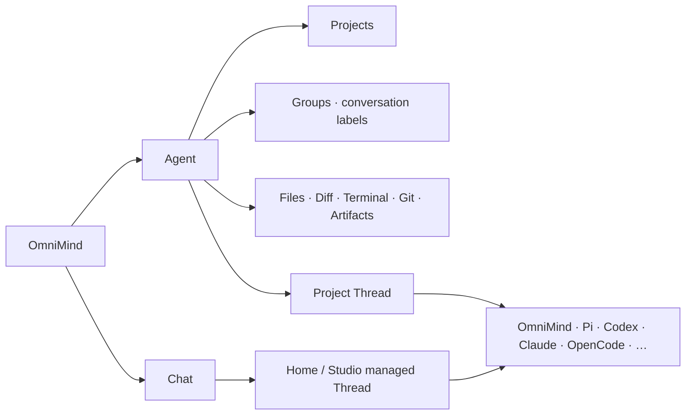

# Workbench

本文件是 OmniMind 唯一完整 UI 契约。V1 以 Synara 当前产品作为物理母体，保留其多 Provider、Project/Thread/Space、Studio、Workbench、Settings 与桌面交付能力；最终用户只感知 OmniMind 产品。OmniMind Agent 是内置默认 Provider，stock Pi 只在用户主动打开 Provider 选择或技术详情时作为独立可选项出现。

## 1. 设计立场

Synara 不是截图或灵感库，而是长期深耕这些问题的成熟产品。OmniMind 默认直接复用其 shell、navigation、Composer、Timeline、File、Diff、Terminal、Git、viewer、stream/scroll、settings、provider UI、performance 和 accessibility 机制。

复用不等于暴露 donor 品牌。App title、导航、空状态、onboarding、Agent/Chat、错误、更新、扩展与默认设置都使用 OmniMind 产品语言；`Synara`、`Pi-derived`、adapter/runtime 名称只进入 About、Licenses、诊断或用户主动展开的 Provider 技术详情。OmniMind 自有 workspace package 使用私有 `@harnessos/*` 作用域；真正承载上游或 Provider compatibility 的 API、环境变量与法定 identity 不因品牌被伪造或改写。

产品 surgery 只做四件事：

1. 替换品牌和准确 legal/provenance；
2. 将 `Agent | Chat | Studio` 作为清晰的三个一级产品工作面；
3. 在 existing Registry 中接入 bundled OmniMind Agent，同时保留 stock Pi；
4. 补经真实 journey 证明存在的 OmniMind 差异。

没有可复现缺口时，不重画、不重写、不建第二状态。

## 2. 信息架构



`Agent | Chat | Studio` 是三个一级产品工作面，不是持久化类型。侧栏顶部直接复用 Synara 的描述式 `Menu / MenuRadioGroup / MenuRadioItem`：trigger 显示当前工作面，展开后每项同时显示名称和职责说明，键盘、焦点、Chevron 与 disclosure 保持母体行为。不得改成 segmented control、tabpanel、Provider selector或新的 selection authority。`/ → Agent`、`/chat → Chat`、`/studio → Studio`；共享 `/$threadId` 从 canonical Thread→Project.kind 投影当前工作面。

Agent 与 Chat 始终作为一级入口可达，不新增显示设置。Studio 继续只服从既有 `showStudioSection`：隐藏不删除数据，且精确保留母体的 deep-link、redirect、prewarm 与 restore 行为。菜单在最小侧栏宽度、简体中文/英文、键盘与 screen reader 下保持可见性、focus 和单次激活。

三工作面的一层导航只约束产品工作面的切换，不删除 Agent 域二级控制台。Agent 选中时仍按 `New Task → Kanban → Pull Requests → Automations` 呈现；`/kanban` 是跨 Project 总览，`/kanban/:projectId` 是单 Project 看板，卡片回到对应 folder-backed Agent Thread，Project context menu 保留 `Open in Kanban`。Kanban route 的顶部仍表达 Agent 域，Chat 不把 Kanban 伪装成第三种工作模式。

```work-surface-ia
{
  "primaryModes": ["Agent", "Chat", "Studio"],
  "routes": {"Agent": "/", "Chat": "/chat", "Studio": "/studio"},
  "agentSecondary": ["New Task", "Kanban", "Pull Requests", "Automations"],
  "kanbanRoutes": ["/kanban", "/kanban/:projectId"],
  "kanbanPrimaryMode": "Agent",
  "kanbanCardTarget": "folder-backed Agent Thread",
  "projectContextAction": "Open in Kanban",
  "agentSidebarSections": ["Projects", "Groups"],
  "groupTarget": "conversation-thread",
  "groupCardinality": "many-to-many",
  "ungroupedPresentation": "projects-only",
  "groupsDefaultState": "collapsed",
  "threadHeaderIdentity": {
    "emptyAgentOrChat": "hidden",
    "titledAgentOrChat": "title-only",
    "terminal": "terminal-icon-and-title",
    "genericTerminalTitle": "localized-ui-only"
  }
}
```

这项约束拥有的是稳定的产品结果，而不是旧提交的具体 DOM。历史实现可以作为视觉与行为证据，但不得整体 cherry-pick 已退休的 Product Control Plane、retained-panel 或其他旧架构。

### Agent

- 使用 folder-backed Project Thread；
- 显示 Files、Viewer、Diff、Changes、Terminal、Git、Output、Artifact 与完整 Workbench；
- 默认引擎显示为 OmniMind，技术实体是 bundled OmniMind Agent；也可以选择 stock Pi 或其他当前可用的 inherited adapter；
- 改变工作目录通过选择/创建 Project 完成，不在有实质工作后静默换 cwd；
- Projects 是 folder-backed Agent conversations 的完整来源，保持文件夹图标；Groups 是其下方默认折叠的会话归类视图，不过滤 Projects，也不给 Project 打标签。
- 一个 Thread 可以属于多个 Group；未分组 Thread 只留在 Projects，不出现“未分组”伪 Group。每个具体 Group 使用带稳定颜色的 tag glyph，section header 本身不放 tag glyph。
- Group 右键提供“添加会话…”，从 Projects 中多选 Thread；Projects 中的 Thread 右键提供“添加到分组…”，可多选 Group，并支持 `Shift+F10`。Project folder 本身不加入 Group；每个 Group 底部不重复放“添加会话”。
- 删除 Group 或移除 membership 不删除、不移动底层 Thread。Group identity/name/order 直接复用 Space；多分组 membership 是既有 Thread metadata 的 canonical field，不新增 `Group` aggregate、membership ledger、第二导航或恢复状态。

### Chat

- 使用 Synara Home managed Thread，无用户选择的 Primary Folder；
- 可以在 OmniMind-owned managed workspace/outbox 中生成 Artifact；
- 上传或引用的外部用户文件默认只读，不默认修改现有 Project；
- 不显示完整 Project Files/Git/Terminal 工作台，不暗中升级为可写 Agent；
- Composer 提供明确的文件/文件夹引用入口和只读引用 chip；引用按消息或 draft 保存，不升级为 cwd/Project、不自动扫描；
- 需要修改真实项目时，显式 `Send to Agent`，选择/创建 Project 后 contextual fork 完整可见历史、引用与可用附件；目标不自动执行。

`Send to Agent` 不复制 Session、不 replay 旧 operation、不保证跨 Provider continuation，也不创建 Handoff platform。普通附件复制失败采用部分成功：持久 activity 保留不可用 provenance并定位源消息，命令只 Toast 一次，关闭重开仍可查看；补充文件只走目标当前 Composer，不修改不可变导入历史。

### Studio

Studio 默认 follow Synara 当前产品：继承现有 container、managed workspace、outputs、reactor、draft cwd、local environment、no-worktree/branch、创建、恢复、显示设置、隐藏和 deep-link 行为。本轮没有证据时不重设计；后续若有真实用户结果或缺口证据，只允许在既有 owner 内作窄、可回退的最小必要偏离，不能建立第二 Studio 状态机、恢复 owner 或平行生命周期。

## 3. Provider 与 Composer

Composer 复用现有输入、attachments、`+`、`@`、Provider、Model、traits、send、Queue 与 running controls。默认态和 Engine selector 的普通用户展示名使用 `OmniMind`，并与 `Pi` 及其他真实 Engine 明确区分，绝不合并。`OmniMind Agent` 只作为技术实体全称出现在 Engine technical detail、runtime/version、诊断、About 与 Licenses；内部 identity 继续为 `omnimind`。Pi lineage 与 license 不进入普通产品 label。

选择变化只影响下一次发送。当前 operation 不热换；Provider 切换沿用 stop-first replacement，失败恢复上一 exact binding。Timeline 可保留混合 Provider turns，但每个 turn 显示自己的 provenance。

每个用户可见 Assistant response 在 Timeline 中只显示一次模型身份头，且身份只消费该轮 canonical `thread.turn-start-requested` 已准入的 exact `ModelSelection`、可选 `ModelPresentationIdentity` 与当前仍存活 turn 的只读关联；Composer 当前选择、Thread 当前 binding、后来刷新的 catalog、品牌图标或模型名都不得反向猜测历史。身份头按 `模型头像 | 模型名称 / Engine · 时间` 呈现，随后同一 response 的 `Working / Worked`、过程、正文、结果卡与操作栏继续沿同一右列排列；常规列为 `30px + 12px gap`，`≤560px` 为 `28px + 10px gap`。模型名称与模型/模型服务图标是主层级，Engine 与本地化真实时间只是次级 provenance；任何 Engine 下的 Assistant 身份头都不得显示 Engine 图标。`ModelPresentationIdentity` 是资产无关的准入快照，只含 exact `model`、`displayName`、可选 `serviceId/serviceName` 与 `builtin-catalog | runtime-catalog | user-configured | extension | unknown` 来源；它不进入 `ModelSelection`，在 start、queue promotion、Automation definition/permission snapshot 与 turn provenance 中原样携带。快照与最终准入 model 不匹配时丢弃且不阻断发送。旧 Turn 只允许从该 Turn 已冻结的 exact qualified model reference 做有界兼容解析，不查询当前 catalog、不批量猜测回填；无法证明时显示通用模型图标、格式化后的冻结 model 与真实消息时间。模型头像直接呈现唯一图标 owner 的输出，不再叠加背景、边框或阴影 badge；需要深色承载的品牌仍由图标 owner 自己处理。头像裁切与 Composer 共用连续圆角 / squircle 曲率处理，并按头像尺寸保持紧凑圆角。

Provider-specific 控制只在 capability data 支持时显示。这里的 capability gate 是逐 Provider 的可见性条件，不是实施团队可跳过真实能力的许可：当前选定 runtime 已暴露、且属于 V1 产品面的能力必须保持可发现、可操作和可恢复；不存在的能力才隐藏或准确显示 unavailable。不能伪造 steer、review、compaction、fork、approval、Skill 或 Plugin 能力，也不能 silent fallback。

Composer 的 16px 上下文圆环只有一个稳定语义：当前上下文压力。尺寸、位置、线宽和动效不为缓存信息改变，也不增加双环、双色或常驻百分比。已有 Popover 可在最近一次已结算请求拥有真实互斥输入拆分且总输入大于零时追加 `缓存命中 R% · C / I 输入`；无可比拆分时整行消失，不显示 `0%`。trigger 的 accessible name 同时描述上下文占用与可用的最近一轮缓存命中。既有 Session cost 行继续属于原 Composer，不扩张到使用洞察或导出摘要。

Composer内置Slash Command的技术identity与执行继续属于Shared/runtime owner；Web只拥有一个以canonical command ID为key、穷尽内置命令的presentation descriptor，统一投影双语title、description与icon。Provider动态命令可在缺少产品文案时使用明确标注来源的原生名称或有界humanize fallback；OmniMind内置命令不得落入该fallback，也不得让title switch、description map与icon map成为三张需人肉同步的清单。新增或删除内置命令时，presentation完整性测试必须在简中/英文同时证明可读名称、说明和图标存在；availability与执行行为仍由真实command owner决定，不能把展示descriptor扩成第二Command Registry。

内置列表在 Default 后提供 `/converge` 与 `/learn`。选择后，Composer 用同一穷尽式 mode presentation descriptor 持续显示空心 Central icon 与本地化名称；标签没有 `×`，再次点击当前标签回到 Default，选择另一模式直接替换。标签在发送、流式输出、canonical Ask 等待与回答后都不自行消失，也不在 Approval、Voice 或 Settings 中复制入口。Converge 显示为“收敛 / Converge”，Learn 显示为“学习 / Learn”，后者说明为持续使用清晰模型、实例和必要图解帮助理解；正常 UI 不暴露 Host、Skill 或 Engine 等实现术语。Learn 输出的标准 fenced `mermaid` 继续复用既有 Assistant Timeline renderer，渲染失败时保留可读源码，不建立第二图表系统。

### Canonical User Input

User Input 是跨 Codex、Claude、Pi、OmniMind Agent 与未来 Engine 的同一产品投影；Provider、Pi Extension、RPC fallback 与第三方 TUI 都不能拥有私有 Ask UI 或定义能力上限。所有 `user-input.requested` 都进入既有 Composer Question surface：复用 Composer 约 736px 内容列、浅色圆角 Question card、安静灰阶、编号选项、逐题分页与必要动作，不新增页面、侧栏、弹窗、问卷后台、大标题、Review 画面或第二 Ask shell。复杂度属于 canonical contract/state，默认画面只显示当前问题与当前必须操作的控件；Preview 只在用户显式请求时于对应选项内展开。

每道有预设选项的题都由 Host projection 在 authored options 之后合成一个保留 identity 的末项，模型不得 author，也不进入回答值。简中单选显示 `自定义` / `输入自己的答案`，多选显示 `自定义` / `补充自己的答案`；英文使用同一 catalog 的语义对等文案。单选与多选复用同一 option-row 结构，仅改变 radio/checkbox、selection 与 result 语义。点击 `自定义` 后，输入框在该行内部原地展开并立即聚焦；自由回答也直接在 Question card 内编辑。主 Composer 不是 Ask answer owner，等待回答时不得把 Ask draft 同步进主 Composer 或要求用户到远处输入。

Ask answer 只包含 authored preset selections 与可选 `customText`。单选自定义替代预设；多选可同时提交多个预设与自定义答案。单选需要边界、条件或理由时，用户通过自定义入口写出完整真实答案，不建立第二个注释字段。用户文本只可用 trim 判断是否为空，展示、draft、transport 与 result 均保留原文、换行和尾随空格，不静默归并或解释。

只有一道题且为单选时，选择预设项立即提交；多题时，中间题选择单选预设项后立即进入下一题，最后一题选择后留在原题并等待显式 `提交`。单选自定义在 option row 内展开并聚焦，填写后显式 `下一题` 或 `提交`；多选与自由回答始终显式前进或提交。不存在独立 Review/确认回答步骤。Previous 允许回题修改；Preview、推荐理由和 suggestion 展开不构成选择。数字快捷键只在 Question card 的交互焦点域生效，输入框聚焦时数字与 Enter 保持正常输入；选项使用原生 radio/checkbox、可见 focus 与同组方向键语义。只有 owning focused pane 可自动聚焦题目；后台 pane 不抢焦点。题目数和选项数没有产品硬上限，只允许 contract owner 针对异常 payload 执行 1 MiB、10,000 authored question+option nodes 与固定 schema depth guard，且不得静默截断或写进模型 guidance 形成能力上限。任何 Preview、recommendation 等字段只有在 UI 与结果链真实兑现后才能进入 public schema。

Web 提交使用 request instance 的同步 exactly-once claim，不经过普通 Composer message preflight。等待回答时 Question card 只提供语境明确的 `取消`，不重复投影全局 `停止生成`；取消会以 `cancelled` 结束 owning turn。Provider 已 claim 时 Question card 继续可见但答案控件真实 disabled，Composer 右下角恢复由既有全局 owner 提供的 Stop Turn，使运行中的 turn 仍可被 `aborted`，而不在 Question card 建第二个停止入口。只有 canonical `user-input.resolved` 或明确 retryable/uncertain 事实才能分别移除 card 或释放 claim，dispatch 失败保留 draft 并允许重试。resolved 后不在 Composer 显示完成卡或 Toast。底层继续持久化不可变的 `user-input.requested` 与 `user-input.resolved` 两项事实；WorkLog 只在 presentation 层按相同 requestId、owning turn 与 lifecycle generation 将它们投影为一个保持 requested 位置的 canonical User Input interaction row，禁止按相邻、标题或 Tool 名猜测。pending 折叠行显示双气泡与 `等待回答`；answered 折叠行只显示双气泡与 `已回答`，展开后才按 request 原始题序展示已持久问题、preset selections 与 customText；其他 terminal 只显示真实状态且不泄露答案。缺失可信 request correlation 时保留诚实的独立 terminal row，不伪造问题或恢复已消失的 Promise。Timeline presentation 不得读取 Composer draft、改写底层 canonical answer 或 Tool result。

## 4. Conversation、Timeline 与 Activity

Timeline 长期显示用户输入、Assistant 可见结果、结构化请求、重要 Tool/Activity，以及 File、Diff、Terminal、Artifact、Studio Output 引用和必要的 failure/unknown/recovery。因果 transcript 是第一事实，`Worked for / 工作了`、同类 Tool 汇总和连续 reasoning 合并只是其可逆展示压缩；consumer 只能在 canonical sequence 已成立后压缩连续片段，不能先按“正文/工具/思考”二次分桶，再凭标题、到达批次或完成态猜回顺序。

canonical Timeline 的 Assistant Markdown 中，显式 `mermaid` fence 投影为 diagram-first 的安全阅读态，隐藏的原始 Markdown 始终是唯一事实；streaming 只显示紧凑生成态，settled 后自动切换为图表，失败、不支持、安全拒绝或资源超限只显示安静的局部失败与可用恢复操作，不向普通用户倾倒源码。该能力不是消息类型、Artifact、编辑器、插件协议或持久状态，只在 Assistant 正文由 `ChatMarkdown` 窄 opt-in；User、reasoning/narration、Plan、Tool 与其他 Markdown consumer 不自动识别。消息内成功态只有展开与复制 canonical 源码两个操作；图表按 intrinsic geometry 从普通阅读列向两侧扩展，最多占满当前真实 transcript pane，宽高本身不决定展示资格且消息内不裁切、不设最大高度或建立第二滚动 owner。缩放只留在复用既有 Dialog 的展开态，不与页面滚动、触控板、文本选择争夺输入。渲染内容必须处于无脚本、无导航、无 Host bridge、无外部请求能力的 opaque-origin iframe，Host 只持有主题、生命周期与控制；不得把 Mermaid SVG/HTML 插入主 DOM，也不得提供同 DOM fallback。安全、主线程、内存、输出字节与单消息数量预算独立于几何；渲染只在完成、临近视口、页面可见且交互静默时开始，按源码与 resolved theme 有界复用，离屏/过期工作可取消。依赖、私有 renderer、此 code-block projection、双语文案与测试构成完整替换/删除边界，删除后所有 fence 自然恢复普通源码，不需要迁移。第二个真实 diagram renderer 出现并证明稳定共同责任前，不建立 registry、artifact store、worker/service 或兼容层。

Timeline 的高层语义由 canonical activity facts 决定，不由 Engine 文案、首条事件或 icon 猜测：`reasoning.updated` 表示 Engine 已主动公开、产品已收到且仍在增长的可读原文，`reasoning.completed` 是同一 segment 的唯一 terminal 事实；两者共享稳定 Activity ID，并在 canonical sequence 的原位置换，不生成第二行。有可读内容的 reasoning 是正文中独立的非 Tool activity；产品不索取或推导隐藏思维链，也不翻译、改写或再摘要。公开正文受单一 8,000 字符 activity 安全上限约束；达到上限时 payload 只携带结构化截断事实，不能把产品文案混入 Provider 原文，Disclosure 在正文之后另行显示双语本地化的截断提示。同一 turn 内连续且未被 Assistant/Tool 边界打断的 reasoning 按事件顺序合为一个「思考 / Reasoning」内联 disclosure，使用 Central `brain-2` icon、不显示更新计数；单行 reasoning 与 Tool activity 标题共用同一紧凑 leading column、图标槽和文字起点，不因活动类型切换密度，品牌或疏密不同的 glyph 只在各自窄 icon owner 内做光学尺寸校准，不以逐行位移补偿。处于 `reasoning.updated` 的公开正文使用现有 streaming Markdown，并默认打开在有界高度内自动跟随最新正文；旧内容自然向上流动，用户向上滚动后暂停跟随，回到尾部或从完整高度收回后恢复。用户直接点击正文区域即可在有界与完整高度间切换，再次点击收回；不得增加可见 label、icon 或符号，文本选择、正文内交互元素与滚动手势不得误触，键盘提供同等操作。Tool、Assistant 或 terminal 边界把该 segment 原位终结并默认折叠，冷态切回一次完整 Markdown 渲染；顶部 Disclosure 继续独立负责整段显隐，用户对其做出的选择不被普通重渲染或 `updated`→`completed` 转换覆盖，reasoning 不能进入独立 Activity detail。正文增量不进入逐 token `aria-live`，只以稳定的 busy/expanded 状态表达。同一长生命周期 runtime item 在边界后的公开正文获得新 segment ID，并在真实 sequence 位置另起一组；空白、不可读或没有公开文本的事件不渲染占位。Assistant 旁白保持独立；与相邻 reasoning 在同一 turn 内经 Unicode 空白归一化后完全重复时只隐藏 reasoning 副本，旁白保留，禁止模糊去重。历史 `reasoning.completed` 与旧 `task.progress`/Reasoning trace 记录仅在展示层兼容识别，不迁移或重写。

Composer 显式选中的 OmniMind Skill 由 Host 在本轮投递后逐 Skill 投影 `skill.instructions.delivered` 或 `skill.instructions.failed` 回执；成功行使用 Skill/Central icon，失败行使用 warning icon，回执只证明 Host 已投递 inline 或 reference，不证明模型读取、执行或遵循。文件不可读、单 Skill 超限或剩余预算不足均按 Skill 独立失败，后续 Skill 仍继续尝试；部分失败仍发送原始请求。Tool 汇总只接受结构化类别（command、edit、read、search、agent、MCP/dynamic、image view、image generation），同类使用精确类别 icon，混合使用通用执行 icon，未知事件保持独立技术行且不计入 Tool 数量。

未发送首条消息且仍使用内部占位标题的 Agent/Chat 草稿，主内容顶栏左侧不渲染图标、标题或空 heading；形成真实标题或用户重命名后只显示标题，不显示 OmniMind/Provider 图标。Engine 与模型选择属于 Composer，混合 provenance 属于各 turn/Timeline；Terminal 因具有真实 surface 类型，保留 Terminal 图标与终端标题。Terminal 的 generic 持久占位值只在已确认 Terminal provenance 的普通 UI consumer 中按当前 locale 投影，重命名值、存储、搜索事实与诊断仍保持原文。该呈现规则不修改 Thread 的持久标题、生成/重命名流程，也不建立第二份标题 authority。

wire noise、逐 token event、重复系统消息与隐藏不可读 reasoning 不进入 Timeline。同一 stream item 原位归并；自然成功不额外 Toast。只有失败、结果未知、隐藏副作用或需要用户处理时升级提示。

Assistant 可见文本与 Tool activity 必须在 live 与 settled 两种投影中保持同一因果顺序。Provider runtime activity 与 Assistant text segment 使用 ingestion 写入的同域 causal sequence；orchestration envelope sequence 只为缺失 activity sequence 的通用事件兜底，不能覆盖显式 runtime sequence。虚拟列表的视觉、DOM source order 与 accessibility tree 必须在同一可观察帧服从该 canonical sequence，不能先靠绝对定位显示正确、再延迟修正屏幕阅读顺序。一个仍在流式输出的 Assistant item 若已被可见 Tool activity 打断，已经结束的文本 segment、Tool 行与当前流式 tail 按 canonical sequence 原位交错；不能为了维持单一 live message row，把完整正文钉在首段位置、把后续 Tool 堆到正文下方，再在 terminal settlement 时重排。

每个用户可见 response 只有一个 turn-level `Working for / Worked for` disclosure。terminal/current Assistant segment 是该 response 的结果正文并始终位于 disclosure 外；此前已经被 Assistant/Tool 边界终结的 Assistant narration、公开 reasoning、Tool activity、失败、重试与恢复按 canonical sequence 进入同一个过程区，不能因为存在多段 narration 或 reasoning 就重新散落到结果上方。当前 streaming tail 若随后被 Tool 打断，它从结果正文转为过程 narration，新的 terminal tail 继续作为结果正文。结构化 Proposed Plan、生成图片正文、OmniMind Thread 创建 recap、Files changed/Undo/Review、Automation 创建结果及明确 Artifact/Studio Output receipt 是结果表面，继续留在过程区外；Ask、Approval、权限、等待 Web review 与需要用户处理的 worktree recovery 等即时操作也不得被过程 disclosure 隐藏。没有可见过程的直接回答不渲染空 `Worked for`。

运行中的过程使用 `Working for`，首次出现默认展开且允许用户折叠；新 stream item 不得覆盖用户在同一 running 阶段的选择。等待用户时停止 live-status 并切为默认折叠的 `Worked for`，即时操作仍在 Composer 或既有 action surface；settled 后同样使用默认折叠的 `Worked for`。从 running 进入 waiting/settled 时原位收起，从 waiting 恢复 running 时恢复运行态默认展开；open state 只属于当前 Timeline presentation，不进入 Product State 或持久化。过程区内连续 reasoning 与 Tool summary 可以继续二级折叠，但关闭外层时其后代必须同时从交互与 accessibility tree 退场，内部状态保留。

Tool presentation 分三层而不混权：普通行显示双语产品名称，未知 identifier 只做无损可读化，绝不直接暴露 `x_y`、MCP transport prefix 或内部诊断；内联 disclosure 显示该 Tool schema 明确允许公开的输入摘要、结果、来源、状态与失败，bundled first-party Tool 既然拥有 typed payload 就不能只留一个无细节 preview；技术详情保留精确 identifier 和允许诊断。未知或第三方 Tool 不得为“看起来有详情”而任意展开敏感参数，缺失、被截断或策略禁止的字段必须以结构化事实投影为不可用，而不是伪造空白成功。标题、详情和状态都从同一 presentation projection 派生，Timeline consumer 不维护第二张 Tool 映射表。

Timeline 只有一条通用 live-status presentation，继续直接由现有 `isWorking`、turn、worktree setup 与虚拟列表生命周期控制；它位于 running `Working for` disclosure 的过程尾部，不再作为 disclosure 外的独立 Timeline 行，也不新增 Thinking message、runtime status store 或第二条进度事实。该 presentation 的普通视觉固定为 `20px Composing Orb + 双语趣味提示 + 对称潮汐三点`：提示首次随机选择，之后每五秒替换且普通重渲染不换句；它只是等待氛围，不进入 transcript、reasoning、journal、Session 或恢复数据，也不能覆盖真实 Tool、approval、error、recovery 和 Provider activity。图标与文本容器保持固定尺寸，长文案单行省略；隐藏文档、外层 disclosure 折叠和离屏状态暂停不必要绘制，`prefers-reduced-motion` 下图标、文字与三点全部静止。用户折叠 running 过程后，`Working for` trigger 本身继续准确表达 Agent 正在运行；screen reader 使用稳定、非轮播的本地化工作状态。

Child Agent、Goal、Todo、Question 继续使用 source 已有的产品语义；不得借此创建第二 task system 或 Run hierarchy。

### 自动能力的显示原则

Goal、bounded child、结果驱动执行、会话恢复与 Computer Use 不是新的导航入口或常驻卡。它们只在真实运行条件下投影到既有表面：

| 能力语义      | 平时                                                               | 运行时                                                                                                                                                        | 结果/异常                                                                                     |
| ------------- | ------------------------------------------------------------------ | ------------------------------------------------------------------------------------------------------------------------------------------------------------- | --------------------------------------------------------------------------------------------- |
| Goal          | 没有 active Goal 时不显示常驻入口；可由 `/goal` 或明确产品动作设置 | active Goal 使用 Composer stacked panel，显示完整 objective、运行/暂停状态、计时及 edit/pause/resume/clear；恢复与自动 continuation 使用同一 Thread authority | achievement 锚定真实 terminal turn；失败、取消、interrupt 或重复 blocker 准确暂停，不静默继续 |
| Todo/当前步骤 | 无独立任务管理页                                                   | 逐回合 task snapshot 在 Composer 显示当前步骤并可展开完整列表；它不拥有 Goal 生命周期                                                                         | 当前 turn 完成后折叠或退场；不复制 task state，不替代 Goal achievement                        |
| bounded child | 不显示 team builder                                                | 活跃时复用 `ComposerSubagentStrip` 和现有 child Thread/detail；只有 adapter 真实支持的 stop/background/message 才显示                                         | Root 汇总来源并对最终结果负责；不建第二 Agent registry                                        |
| 结果驱动执行  | 不显示通用 workflow editor                                         | 普通 tool/child loop 复用 Todo、Activity、Files/Diff；只有 Engine 已回报的结构化 phase 才显示低噪声里程碑和现有恢复动作                                       | 保留 Engine provenance，不把普通 sequence 画成 DAG；完成后运行控制退场                        |
| 会话恢复      | 正常重开直接恢复                                                   | native resume 安静继续                                                                                                                                        | degraded/ambiguous 才在 Composer 前显示一条恢复介入                                           |
| Computer Use  | 无 capability card                                                 | 复用现有 Browser/Device pane 与 Timeline tool activity                                                                                                        | 文件、截图、下载与结果进入现有 Artifact/File 表面                                             |

Memory/Knowledge 当前没有 first-public runtime owner，因此不预建入口、图标、设置、后台状态或 receipt。UI 也不展示 packaged、registered、context-loaded、cache breakpoint 或内部 candidate extraction；自然成功不 Toast。

## 5. 本地 Workbench

V1 直接保全 Synara 已有能力：

- Project/file tree、search、reveal、tabs、split、active pane；
- Markdown、PDF、Office、image、large text 与 unknown binary viewer；
- editable/saveable Explorer files、Diff、Changes、Output 与 Artifact；
- real PTY Terminal 与 per-thread terminal state；
- Git、commit、push、Pull Request、Kanban、Automations；
- Browser、Source Control、Side Chat、Subagents 和 Studio outputs；Engine 临时 Web UI 的 Host presentation policy 只由 `[architecture/execution.md](execution.md#扩展与生态)` 定义，Workbench 继续复用当前 Thread 的右侧非模态 Browser。

Browser 始终只存在于当前 Conversation 的 RightDock。Tab strip 是现有 Thread Browser state 的纯展示 consumer：新 Tab 继续调用既有 `browser.newTab({threadId, activate:true})`，复用同一 partition、Cookie、history、权限与 runtime；休眠时只唤醒当前 RightDock runtime。Tab 自动滚动只改变 strip 自身 `scrollLeft`，程序化地址栏聚焦先抑制建议，直到用户输入、点击或方向键。不得增加 Floating Browser、第二 Browser store、第二 Cookie Session、第二 runtime 或平行 route。

同一母体基线还包括持久 Goal、evidence-first Debug、480/960/1440 chat width、暗色 Dock icon 自动切换、本地使用洞察PNG导出，以及 Space→Group 的完整交互结果。它们必须复用现有 Composer/Thread、interaction mode、Settings、Desktop icon、Profile stats 与 Group owners，并在简体中文和英文中同时完整；不能因历史漏移植而降格成 Todo、提示词或另一套 store/API。

持续同步还保留同一批既有 owner 的冰山行为：Workspace 搜索同时覆盖文件和目录，目录结果必须展开祖先链并在现有 Explorer 中 reveal；Engine 图标、安装/登录/受限状态与容量信息继续来自 canonical Provider descriptors、health 和 usage owners；managed Thread 删除只回收产品创建且可安全证明干净的 worktree，遇到脏目录必须保留并准确提示。Windows taskbar 图标切换和 Windows/Linux custom titlebar 复用 Desktop window/icon owner，偏好写入后若重启失败必须回滚；macOS 继续使用原生 titlebar。不得为这些差异另建 Palette、Provider catalog、worktree registry、window state 或第二套 UI。

使用洞察摘要只提供设备本地、确定性的render/copy/save，不包含姓名、头像、handle、domain或外部发帖链接；完整产物合同见Settings段。Release history/What's New 可以保留通用 UI 机制，但只有存在真实 OmniMind version、changelog 与 publication evidence 才能激活；未满足时准确显示不可用，不复制 Synara release identity。

每个 Thread 恢复其 tabs、open files、layout、viewer refs 与 terminal state。具体 state 直接复用 source 实现，不新增 WorkbenchLayout aggregate。

文件保存、stale diff 与并发变化沿用 source 的 save/conflict behavior。只有能复现静默覆盖时才补最小检查；不建设 observed-version 平台。Git status 只表示 Git，外部文件变化通过重新观察呈现。

Terminal 使用真实 PTY，区分 running/exited，支持 input/copy/search/resize。terminal noise 不灌入 Timeline。

### Chat shell、环境信息与响应式 Workbench

Chat shell 只有一个会随真实可用区域自适应的主画布：Timeline 与 Composer。两者与空态 Hero、运行状态行、消息列和回到底部按钮必须共用同一横向中心轴；该轴始终是当前 Chat 左边界与当前右侧占位表面（Environment、Plan 或 Workbench）边界之间的几何中心，不是整个窗口的中心。Message Trail 是 Chat pane 左侧的辅助导航 chrome，不属于该居中内容轴：其横向位置固定锚定当前 Chat 左边界并保留稳定 inset，只有 Chat 左边界本身移动时才等量移动；窗口右缘、正文宽度或右侧占位表面变化只能改变正文居中与轨道是否有足够防碰撞空间，不能拖着轨道横向漂移。布局应由同一个 flex/grid 可用宽度自然推导，不得根据外层 Sidebar 宽度再施加反向 translate、固定 inset 或第二套几何补偿。打开或关闭宽屏 Environment、Sidebar 或 Workbench 时，主画布可以平滑重新居中于剩余区域；使用 overlay/exclusive presentation 的表面不占用该区域。

四类表面的职责固定如下：

- `Environment / 环境信息` 是当前任务的辅助检查器，承载仓库、工作树、分支、变更、Git 入口、本地服务、来源、编辑器、摘要、置顶消息、文本标记与记事本等上下文。它在每次 App 启动时默认关闭，用户从聊天标题栏打开只影响当前运行中的 shell，不写成跨启动偏好。普通宽屏桌面态使用与 Chat 并列的右侧 inspector 区域，内部仍是现有圆角卡片；打开后 Chat 主画布平滑居中于剩余可用区域。当当前 Chat surface 无法同时容纳主阅读画布与 inspector 时，系统只临时压制并列 presentation，不改写用户本次运行中的手动 intent，空间恢复后可恢复原本手动打开的 inspector。受压时用户仍可主动临时以 overlay 查看，且必须具备 focus trap、Escape 与 focus return。它不拥有 Files、Diff、Terminal、Browser 或 Device 的工作面板角色。
- `Workbench / 工作台` 是 Files、Viewer、Diff、Terminal、Browser、Device、Source Control 与 Side Chat 等真实操作区，继续复用现有 RightDock、Editor workspace、pane state 与 keep-mounted lifecycle。宽屏可与 Chat 分栏；空间不足时进入 Chat/Workbench 单面板切换，不能把 Composer 压成不可读窄条。
- Sidebar 是 Agent/Chat/Studio、Project/Thread 与全局入口的导航。用户手动开关继续由当前 route/Sidebar owner 管理；同一 mounted shell 内的手动 intent 不被空间自动压制改写，不新增当前源码并不存在的 cookie rehydrate 或跨启动持久化语义。Sidebar 是主画布之外最后退场的辅助表面：Environment 先退，Sidebar 只有在其真实宽度会把可见 Chat 压到紧凑生存宽度以下时才自动压制，不能为了维持宽屏阅读舒适度而在约 `1000–1100px` 过早消失。空间不足造成的自动压制只属于可推导 presentation，不调用现有手动 `setOpen`，因而不写回 cookie、Settings 或导航偏好。空间恢复时只恢复原本手动打开的 Sidebar；用户手动关闭的 Sidebar 不得被系统自动复活。受压时用户仍可从 header 临时以 overlay/sheet 查看导航。`23rem` 只是 authored default，不是强制宽度；用户可把常驻 Sidebar 连续缩窄到 `13rem` 的既有物理下界，所有处于该可用区间的持久宽度都必须原样保留，不能因视觉偏好迁回默认值。继续向左越过收起阈值才明确关闭 Sidebar；该手势保留最后一个有效展开宽度，不能把阈值附近的压缩宽度写入 storage。隐藏后，窗口左缘提供短延迟的 pointer hover peek：同一个 Sidebar 非模态覆盖主画布，进入面板后保持、离开热区与面板后自动收回，不自动抢焦点、不把主画布设为 `inert`、不显示 scrim，也不改写手动 intent、最后有效宽度、cookie 或 Settings。pointer peek 只是视觉预览；用户点击 Sidebar toggle 或使用键盘快捷键时，动作必须提升为明确的常驻展开，不能因为面板此刻可见而把 peek 当成已打开后再次收回。空间受压时的显式 compact overlay 继续保留 modal、focus trap、Escape 与 focus return，不能与 pointer peek 混成一种状态。Sidebar toggle 的 hover surface必须解释动作并投影当前真实快捷键；不能只有无语义的背景变色，也不能硬编码与用户 keybinding 不同的提示。
- Timeline 与 Composer 始终优先保留。Environment、Sidebar 与 Workbench 按上述职责退让，不能各自用无关 fixed width 同时争夺主画布。

现有 `PlanSidebar` 是当前 task list/proposed plan 的详情投影，不是第五个全局响应式 owner，也不并入 Environment 或 RightDock state。它的 `340px` 固定宽度必须作为真实空间消费者进入压力回归：打开时不得恢复被自动压制的 Sidebar、不得让 Environment 重新占位、不得与 Workbench split 共同把 Composer 压出可读宽度；其既有 active task/proposed plan、自动打开、按 turn dismiss 与跨 thread handoff intent 不因响应式变化丢失。当当前 Chat surface 连 `340px Plan + 320px 紧凑 Chat` 都无法容纳时，同一个 Plan DOM 进入临时 exclusive presentation，Chat 只在该 presentation 下 `inert/aria-hidden`，关闭后恢复同一 Composer；不为 PlanSidebar 新建持久状态或第二 owner。

响应状态只描述 presentation，不创建新的产品事实或持久状态。实现优先使用现有 CSS layout、media/container query、Sidebar/Sheet、RightDock 与 Composer overflow probe；只有用户调整后的 Sidebar、动态 RightDock 或真实 container 宽度使 CSS 不能唯一判断时，才允许在最靠近 shell 的 owner 使用一个局部 ResizeObserver。Observer 只在有限 presentation tier 改变时更新，不逐像素驱动 React render；缩窄与恢复使用克制的 hysteresis 或等价稳定策略，避免临界点抖动。阈值是可校准实现参数，不是新的产品 contract、数据库字段或全局 Layout Engine。

连续拖动期间，尺寸变化由浏览器原生布局直接跟手；Sidebar rail 的视觉边缘必须与指针保持直接因果，不能给每一像素加追赶 tween，也不能逐像素触发 React render 或持久化。向左越过收起阈值、反向拖回、`pointercancel` 与最终提交必须连续；拖动期间压制 Sidebar row hover card、tooltip 与行操作浮层。Timeline 与 Composer 在 Sidebar 拖拽退场和 pointer peek 开关时始终跟随当前可用区域的共享中心轴，不能靠动作结束后的补偿动画掩盖持续 reflow。只在 Sidebar 常驻/覆盖、Environment 并列/覆盖、Workbench 分栏/单面板等 tier 跨越时使用一次克制的 width/transform/opacity 过渡。继续复用现有 drawer motion token、首帧 motion suppression 与 `prefers-reduced-motion`，不得为本能力引入第二动画 runtime。stream、tail anchor、scroll、draft、attachments、IME composition、focus、PlanSidebar turn/dismiss intent、active pane、open files、Terminal/Browser/Device lifecycle 与 native occlusion 必须跨 tier 保持准确。

Desktop 原生窗口当前支持连续缩窄到 `480×620`。这个下界只表示同一窗口可进入紧凑 Chat/单工作面板 presentation，不把 OmniMind 改造成移动端产品，也不授权为窄屏另建 route、store 或第二套 Shell。Chat、Settings、PR、Editor、Workbench、dialog 与 native Browser/Device surface 都必须在该下界无横向页面 overflow、不可达关键操作或状态重挂；若某个既有表面无法分栏，优先使用同一 mounted surface 的单面板/纵向/临时 overlay presentation。

可见命名按产品角色闭合：Environment/环境信息、Environment panel/环境信息面板、Workbench/工作台、Changes/变更、Local/本地、Worktree/工作树、New worktree/新建工作树、Compare branch/比较分支、Repository/代码仓库、Local servers/本地服务、Editor/编辑器、Built-in editor/内置编辑器、Usage/用量、Outputs/产出、Recap/摘要、Pinned messages/置顶消息、Text markers/文本标记、Sources/来源、Subagents/子智能体、Notepad/记事本。打开含多种 Git 动作的菜单使用 `Commit or push / 提交或推送`；只有真实连续执行 commit 与 push 的动作使用 `Commit and push / 提交并推送`。`Changes / 变更` 只用于面板或集合名词，不能机械替换句子中的一般“更改”。

Environment、Thread environment、Workbench 与 Git 使用各自稳定 catalog domain；Settings、search、placeholder、loading/empty/error/recovery、tooltip、keyboard hint 与 ARIA 与正常标签在同一变更中闭合 `en/zh-CN`。branch、仓库名、路径、URL、命令、Cursor、Engine/model 与原始诊断保持事实原文。

Synara 的 `Project instructions` 表面在 OmniMind 中整体退休，不改名，也不改造成说明、规则或 Prompt 管理入口。产品不再注册其 Environment UI、Settings 开关/search entry、per-Project localStorage store、autosave、手动复制/追加，或首次发送与 Automation promotion 时向 Thread notes 做的隐藏预填。`Notepad / 记事本` 继续只表示当前 Thread 的任务级记录，并沿用既有 `Thread notes` 持久化、保存失败与恢复 owner；退休动作不删除或重写已经存在的 Thread notes，也不把旧 Project instructions 自动迁移为 Notepad、`AGENTS.md` 或其他 Prompt 资源。公开发行前没有用户与兼容义务，因此这里采用干净的 source removal，不新增旧 key reader、cleanup migration、兼容层或第二份存储真相。

完整证据、当前源码反例、两段 2026-08-16 Codex 连续缩放录屏的逐帧测量、storyboard、验证矩阵、stop-loss 与复验触发器见 `[research/omnimind-responsive-workbench-review.md](../research/omnimind-responsive-workbench-review.md)`。研究材料中的具体 breakpoint 不反向拥有 production contract；`480px` 下界由全路由与 exact packaged journey 共同约束，不能只由原型或单张截图推出。

## 6. Settings

V1 保留 Synara 当前设置 IA、搜索、deep-link、分组和 keyboard behavior，不另起 `Models / Agents / Packages / Application` 四域重构。

Settings taxonomy与导航identity必须稳定且与可见文案解耦。一个section descriptor唯一拥有locale-independent的section ID、group、icon、label key与description key；每个可搜索row/panel在其真实owner中声明稳定row ID和搜索metadata，Settings侧栏与搜索只聚合这些窄projection。deep-link不得从英文标题、本地化title或DOM文案生成，重命名/翻译不能改变目标；简中与英文真实渲染都必须证明每个搜索target存在且section/row ID唯一。具体section的render dispatch继续允许显式switch，不能为了消除列表同步而建设通用JSON form DSL、第二Settings schema或万能页面registry。

Settings页面可以组合Web local preferences、ServerSettings、ProviderCredentials与Desktop native四个typed read/action contract，但不能把它们压成同时写localStorage、Server、secret store与native file的通用对象或通用mutation。纯appearance、临时presentation等明确local-only偏好只写本地owner；Provider路径、endpoint、模型、Host工具intent及其他Server事实只经ServerSettings提交；credential只经秘密owner提交；Desktop图标、titlebar与应用快照（内部identity为`AppSnap`）当前native state只经现有Desktop bridge。UI只有在对应owner真实receipt后显示成功，不能让失败的Server mutation留下本地“已保存”假象。

同一Provider详情同时编辑普通配置与secret时，先提交非秘密Server字段；只有成功后才提交secret。普通配置失败不得写secret；secret失败则保留其draft，并准确显示“配置已保存，但凭据未保存”。全局`Restore defaults / 恢复默认设置`不是跨owner原子事务：Web local/Appearance、ServerSettings、ProviderCredentials与Desktop native分别报告结果，成功项不回滚，失败项可单独重试。应用快照恢复默认时先持久重置local intent，再显式应用Desktop listener/shortcut；native失败时准确说明“默认偏好已保存，但当前应用状态未完全更新”，App重开继续按durable intent收敛，已授予的OS权限不撤销。完整持久事实边界由`architecture/product.md`拥有。

当前section继续复用source的Settings母体、分组与顺序，例如General、Profile、Appearance、Notifications、Chat behavior、Keybindings、Usage & limits、Agent engines、Model services、Agent skills、Built-in tools、Managed worktrees、System tools与Archived threads；Integrations中的现有MCP连接页准确命名为`External connections / 外部连接`。`Model services / 模型服务`是对原`Models & writing / 模型与写作` section的定向改名与职责修正：保留现有route、内部section id `models`、搜索、deep-link、分组和keyboard behavior，不借此重排整个Settings taxonomy。

原 `Profile` section 的内部 ID 继续固定为 `profile`，用户可见名称收敛为 `Usage insights / 使用洞察`，中央图标库的图表图标替换身份图标。页面不再读取或展示头像、姓名、handle、badge与编辑资料入口；已有local-only身份值不破坏性清除。页头固定为标题、无句号副标题 `了解你如何使用 OmniMind / Understand how you use OmniMind` 与克制的 `导出摘要 / Export summary`；不常驻显示笼统的“所有统计都仅保存在此设备上”。

使用洞察的DOM和视觉顺序固定为：页头 → 一体式五项统计条（累计 token、峰值日期、提示词总数、当前连续天数、最长连续天数）→ 既有活动热力图 → 30天模型使用 → 30天Token使用 → 工作重心与工作方式 → Skills与Agents。活动、模型与Token永不进入tab、segmented control或互斥panel，也不默认折叠；现有ActivityHeatmap的密度、月份、单色强度、Tooltip和Token→prompts fallback保持不变。统计条的数值与标签几何居中、数字使用tabular numerals，`dd`必须显式清零margin；峰值日期渲染真实本地化日期，不用峰值Token数冒充。

模型使用按包含今天的最近30个本地自然日统计user-origin模型选择轮次：显示前五个已知模型，其余已知模型聚合为其他模型，无法确定的轮次独立显示未知模型；原模型名与Provider图标保持事实身份，长名称在Tooltip/focus可读。Token使用按同一30日本地日界线显示日级堆叠柱与常驻图例，固定区分缓存输入、未缓存输入、输出；缓存命中严格为 `C/(C+U)`，输出不进分母，unknown不冒充未缓存，零可比输入显示不可用，部分覆盖明确说明。30根柱只形成一个roving tab stop并用方向键/Home/End移动日期，pointer、键盘、触摸都能获得不透明主题Tooltip。

工作重心按lifetime user prompt显示前两个具名项目，剩余、已删除或不可命名项目合并为其他项目且显示百分比严格合计100%。工作方式只在明确reasoning选择内计算最常用强度，按lifetime prompt给出并列取较早起点的最佳连续两小时窗口，并复用最长连续天数。Skills与Agents保留真实身份和run count，默认前三项，可展开完整owner排名；标题同时显示探索数量与累计运行次数。

页面继续消费Settings route已有`max-w-3xl`，最大内容宽约720px，不复制原型外壳或扩大Settings shell。480px下五项按原顺序自然换行、工作双栏转纵向、模型与Token始终可见且页面无横向overflow。所有图表颜色只消费Appearance语义token：最强accent表示缓存输入，同accent低强度表示未缓存输入，中性foreground表示输出；不硬编码preset hex、不增加chart palette、卡墙、渐变或玻璃。

`UsageInsightsShareCard`固定本地输出1200×1600 PNG并复用同一Profile数据与静态presenter；内容包含OmniMind标识和日期、五项统计、活动、30天模型、30天Token/缓存、工作重心、工作方式及Skills/Agents摘要。产物不含姓名、头像、handle、workspace路径、费用或原始提示词；partial仍保留完整结构并准确标记。copy/save沿用现有本地流程，文件名固定为`omnimind-usage-insights-YYYY-MM-DD.png`。

Settings 的内部 `coding` 分组对用户统一显示为 `Development / 开发`。其中新增 `Prompts / 提示词`，只管理 OmniMind Agent 的两项用户结果：`Default prompt / 默认提示词` 与 `Custom rules / 自定义规则`。它不是 Prompt 文件管理器，不成为其他 Engine、Project rules、模板、历史或最终有效 Prompt 的管理入口。

这里的 OmniMind Agent 指 canonical `omnimind` Engine identity，而不是只指 `Agent` work surface：同一 Engine 的 Chat 与 Agent Session 都使用这两项 provider-level 用户资源；work surface 只改变各自不可移除的行为 contract、Project trust 与工具表面。页面不得把这些设置扩张到其他 Engine；它也不解析当前 Thread 或建立逐对话目标。

`Default prompt / 默认提示词` 页面首次打开即显示当前安装版本随附、且正在由原生 builder 使用的稳定基础指令正文；fresh profile 不显示“未创建”。用户可独立编辑、取消、保存和恢复当前安装版本的 factory default。该正文只是 native builder 的一个稳定输入：dynamic tools、guidelines、context、Skills、cwd、Extension turn mutation、Host guidance 与不可移除的 OmniMind contract 继续由原生链路组合，页面不展示或保存展开后的 effective prompt。默认提示词的定制值由既有 Server settings owner 持久化，不写安装包、不写 `SYSTEM.md`，也不建立 Prompt profile/registry/history。

`Custom rules / 自定义规则` 表达跨项目个人偏好，并继续使用 bundled runtime 的 global context discovery。无候选时编辑器为空，打开页面、取消、空保存和 no-op 不创建文件；首次非空保存才创建标准 `AGENTS.md`。已有 active candidate 时只更新 exact active source，不迁移、不改名、不复制。候选、遮蔽、文件名和 `APPEND_SYSTEM.md` / `SYSTEM.md` 不进入页面信息架构；后两者仍保留为高级用户可手工使用的原生能力，Settings 不读取、不编辑、不迁移。卡片底部只用淡色辅助文字显示 Server 生成的安全 `displayPath`；仅在真实 Desktop bridge 支持本机 reveal 时提供 `Open / 打开`，普通 Web 不呈现无效按钮。无文件时准确说明首次保存将创建 `AGENTS.md`。若 active 文件超过 Prompt 编辑边界或不是可安全编辑的文本，只将自定义规则卡标为不可编辑，保留安全定位/打开恢复，不得让默认提示词卡一同失败；更低优先级的超限候选也不得压过 bundled runtime 已选择的可编辑 active source。Renderer 不把路径提交为 mutation authority，路径也不得进入 Prompt、普通日志、Timeline、telemetry 或交付截图证据。

两个 textarea 各自拥有 draft、save、cancel、no-op 与失败恢复，并把该 draft、base version、正文状态和来源详情绑定在同一个 resource snapshot slice 上；一张卡的 mutation response 不得用另一资源的 fresh metadata 拼接其旧 draft。`Restore default / 恢复默认` 只属于默认提示词，不使用页面级恢复动作误伤自定义规则，并始终使用该编辑器实际基于的 version 做 optimistic compare，不能借另一资源刷新后的 snapshot 越过旧草稿冲突。默认卡的淡色状态必须准确区分“OmniMind 内置默认”和“已自定义”。编辑不 autosave，长正文在 textarea 内滚动。成功保存只显示全局设置已保存；页面不解析进入 Settings 前的 Thread、split view 或 Engine，不提供“当前对话资源”、逐对话 reload、目标选择器或 busy/reload receipt。已经运行的 Session 与 operation 继续保留创建时冻结的资源，新的或由正常生命周期重建的 OmniMind Agent Session 读取当前全局值；设置页不自动中断、批量重载或重建现有对话。

Custom rules 的外部并发修改必须保留用户草稿并以 conflict 呈现，不能静默覆盖。同一 source 仅正文变化时允许重新载入，或显式保留草稿并基于 fresh version 再次保存；active source 已变化时禁止把旧草稿写到新 source，只允许重新载入。该能力准确表示 OmniMind writer 串行化与 expected-version 乐观冲突检测，不宣传跨进程严格 CAS：Node 公开文件 API 无法把 target identity/version 条件与 replace/unlink 合成一个原子操作，非协作外部编辑器若恰好在最终检查与 commit 之间写入，仍存在极窄竞态。不得为消除该窗口新增 native addon、第二 writer、锁协议或 rollback。首次 create 继续使用原子 no-clobber，目标已出现时不得覆盖。Prompt snapshot 是 bounded standard read，retryable load failure 提供可操作重试。正常页面、空态、Toast、Dialog、错误、帮助与恢复只使用 OmniMind 产品语言，不出现 `Pi`、`Pi-compatible`、`ResourceLoader`、`Engine Contract`、`SYSTEM.md` 或 `APPEND_SYSTEM.md` 等内部术语；真实来源只保留在 architecture、research、诊断、About/Licenses 或明确允许的技术归属面。

`Built-in tools / 内置工具`用Tasks、Diagnostics、Goals、Automations、Browser与Device六个全局组级开关控制OmniMind Host capability是否提供给所有Agent引擎，包括OmniMind Agent；不提供Engine selector、Provider维度持久状态或逐tool权限矩阵。brand-new且没有settings文件时默认开放前五组、关闭Device；任何可读取的existing snapshot按下述migration contract保留既有intent。页面按上述顺序显示canonical catalog派生的真实组、计数、用户选择、平台/服务可用性与effective状态，不再显示含混的OmniMind aggregate，也不暴露Pi、MCP transport、动态加载器或工具注册等实现术语，不硬编码当前工具数量。

“fresh”只表示从未存在有效ServerSettings文件。升级时，既有有效snapshot继续保留legacy intent：缺失`disabledBuiltInGroups`与显式空数组都按旧三组全部enabled处理；旧`omnimind`被禁用时展开为Tasks、Diagnostics、Goals与Automations全部disabled，否则四组全部enabled；Browser、Device及unknown bounded IDs保留原意，显式禁用Device继续禁用。迁移完成后由现有revisioned settings owner写入当前版本并退休旧aggregate ID，不保留UI alias。损坏snapshot无法恢复用户选择，必须准确提示设置已隔离/恢复默认，而不能显示成一次普通fresh onboarding。页面不新增“是否迁移过”开关或隐藏marker。

关闭某组后，所有Agent的新会话都不再投影或注册该组；旧会话即使暂时仍显示stale schema，所有新调用也由Gateway按当前policy立即拒绝。已准入in-flight call不被普通开关伪装成紧急停止，取消仍由当前任务/会话拥有。重新开启不把能力偷偷加入已经稳定运行的旧会话，只按各引擎真实的安全reload或新会话边界投影；OmniMind Agent中的Device在启用且平台/服务可用后注册并active，而不是预先注册为inactive。该设置只控制Agent使用，不影响Browser/Device的人类UI，enablement也不替代availability、runtime permission、approval或call-time authority。

`Web search / 网络搜索`进入现有`Development / 开发`分组，页面技术identity为`OmniMind Web Access`。它只管理bundled OmniMind Agent随附的Pi-native Web Access Extension，不进入`Built-in tools`六组矩阵、不进入`Model services`，也不扩张到stock Pi或其他Engine。页面不提供master enable switch：一级能力始终可发现；当前搜索路径不可用时保留设置、配置与重新检查入口，并准确区分搜索、网页读取与来源审查各自的可用状态。首屏“能否搜索”必须直接消费package按当前routing选择投影的结构状态；named服务缺少或部分配置时显示需要设置，不能与同页Provider状态相互矛盾。

页面复用Settings同一shell和**概览 → 添加 → 详情**模式。概览首屏只回答四个普通用户问题：当前能否联网搜索、默认如何选择服务、结果如何交给Agent、是否自动显示搜索过程；当前/已配置服务与单一“添加搜索服务”动作随后出现，逐工具状态与配置文件入口收进高级区。添加视图保留可搜索、可键盘导航的完整服务集合，但先列当前/已配置（包括当前选中但配置不完整的服务），再按descriptor同源的“无需Key、需要凭据、MCP/自建/高级”稳定connection role分组，不得用可选endpoint字段等UI heuristic猜分组，也不铺无差别卡片墙；keyless项必须写“无需配置，可直接尝试；受共享额度或服务状态限制”，不能写成未配置或永久免费。key-or-Session服务在无法从Settings证明当前Session状态时显示“可能使用当前Agent登录会话”，既不伪装缺失也不伪装ready。行级动作按真实状态使用“设置/查看/编辑”。详情只呈现该服务真实拥有的key、endpoint、model、zone、profile等字段及最小测试动作。搜索服务不能被扁平化成同一种产品：search、hosted MCP、browser-account、fetch/extraction等角色使用文字说明；配置多个服务本身不触发并发，只有用户明确选择selected parallel或All时才在选择动作附近说明会同时消耗多份额度。单服务“测试”把当前完整未保存Provider draft作为request-scoped candidate snapshot，走正式Provider runtime执行最小真实请求，并明确说明“不会保存，可能消耗额度”；它不写canonical文件、不改变default routing/active set、不生成永久绿色“已连接”，成功后仍由用户主动保存。pending、success、error、cancel都绑定同一request identity与Provider ID：用户切换详情后，迟到结果不得投影到另一服务。测试与页面级“重新检查”按各自显式request identity single-flight，不能因连点或重渲染产生重复额度消耗；不得合并正常搜索、跨Session共享取消语义或让config service接管Provider请求生命周期。App/Session启动不因页面状态自动探测。

页面与高级文件共同操作`.omnimind/agent/web-search.json`这一份canonical配置。首次进入该页面或首次启动OmniMind Agent Session时由先发生的一方通过同一package service执行no-clobber原子创建；支持的平台保持`0600`，App启动本身不写。Settings不为此启动Session或执行Extension，Renderer不提交绝对路径；打开配置文件由Server/package从resolved Agent directory重新推导。no-op保存不写文件、不改mtime、不发布revision。literal key按维护者决定支持完整show/hide、copy、edit与clear，`$ENV`/`!command`显示原始表达式；这些值不得复制进通用Settings、Timeline或日志。常用字段只使用closed form vocabulary，复杂结构明确标为file-only并提供现有本机打开入口，不能建设通用form DSL。损坏文件或高于当前支持版本的schema必须显示保留原文件的typed error、刷新/打开文件等恢复动作，不得以默认值静默覆盖；unknown fields保持round-trip。Settings重新聚焦/reopen/refresh发现外部变化且本地draft已修改时必须保留draft并显示conflict，不得自动更新expected revision或静默重试；只有用户明确重新加载或以当前草稿继续时才能再次mutation。

Web Access的能力级图标固定复用现有`globe`，用于Settings导航、能力入口与通用网络搜索语义。具体搜索服务使用各自品牌标记；品牌标记不表达ready/degraded/unavailable，也不能替代文字状态。相同品牌的不同runtime identity共享同一品牌标记，例如Parallel与Parallel MCP以文字说明连接方式而不制造第二套视觉身份。Settings、Curator、网络活动/技术详情与Timeline中需要显示服务身份时必须消费同一presentation projection；不得各自维护映射。当前27个resolved Provider identity必须全部有稳定文字身份与本地视觉投影；原有26个identity继续使用25份已准入的原色品牌资产，新增Kimi在资产未单独准入前使用中性provider fallback；未来新增服务若身份或资产尚未确定，仍完整显示服务名与中性服务字母标记或统一provider glyph，不回退成`globe`、不隐藏该服务，也不把图标命中当作runtime capability。

服务集合和stable ID来自`@harnessos/om-web-access`与runtime Provider定义同源的versioned descriptor；Web不得手写固定“26家”清单。品牌资产必须exact-pinned、随App本地打包并记录source snapshot、hash与已知license/trademark约束；普通运行时不得从favicon、CDN或Provider URL热取，也不得重绘、替换成相似mark、统一单色化或随主题反色。本轮维护者明确选择把26家准确指称性的品牌展示作为产品要求：已知书面许可约束继续诚实记录，但不作为本轮视觉交付的阻塞门，也不得伪称已获授权、合作或背书。这个presentation descriptor不保存credential、不探测健康、不决定routing/availability/active set，也不是第二Provider Registry。

日常默认`auto-summary`在后台生成摘要并让同一Run继续，不等待人工批准，也不制造pending用户操作。Settings另有独立、默认关闭的“自动显示搜索过程”：开启后，`auto-summary`与`none`会在owning foreground Thread的Right Dock创建dedicated ephemeral Web Search观察Tab，实时展示完整结果、Provider、来源、进度、错误和恢复，但不出现“批准并继续”作为必要动作，也不改变workflow；terminal后页面可保留当前静态结果，活跃server/token/presentation handle立即清理，Timeline不留reopen。`summary-review`无论展示开关是否关闭都创建可操作审查Tab并保持tool call pending。后台Thread不切route、不抢Right Dock；review继续投影既有waiting-for-user activity/attention，observer只随前台显式展示。每个pending review与Timeline activity保持exact identity：再次点击聚焦原Tab，Tab已关闭且call仍pending时才重建；多个pending review互不覆盖。关闭Tab、Right Dock或Browser pane只隐藏，不取消搜索。单call terminal只清理该call资源，Run abort只中止该Run，Session shutdown才清理整个Extension instance；可恢复presentation失败允许retry，不可恢复Curator/Host失败必须typed-error settle并cleanup。

结果处理使用三个互斥选择：推荐且canonical默认的`auto-summary`后台生成summary后继续且不等待人工审查；`summary-review`在搜索结果就绪后等待用户批准，再让Agent继续，直到批准、取消、timeout、fatal error或其他合法settlement；`none`直接把raw results返回Agent。Settings必须把`auto-summary`表达为无打扰默认，不能把`summary-review`误写成“暂停搜索”，也不能用一个“关闭审查”开关把`auto-summary`偷换成`none`或把“自动显示搜索过程”包装成workflow/批准开关。Gemini Web启用cookie路径时，Provider detail/技术诊断显示当前Chromium profile/account，作为不注册`/google-account`后的产品替代；诊断RPC失败必须保留重试与检查配置文件的恢复动作，不能无反馈。

Web Search Tab采用OmniMind黑白细线、开放式文档流，并严格保留adopted上游的结果卡片→补充搜索→尾部摘要→footer信息顺序：完整query/result是首屏和视觉主体，单query/少结果默认展开首项，多query按清楚文档流分组；结果展开必须是可聚焦的真实控件，并同步本地化accessible name、expanded状态与内容关系，observer/review都不能只支持鼠标。来源、选择、重搜、补搜、query rewrite与Provider切换都留在结果上下文中，框架状态与技术详情不得抢过结果。`summary-review`的summary在同一文档流尾部提供生成、编辑、重生成、预览与批准；进入摘要阶段不把结果或footer改造成被inert的背景，也不建立固定、悬浮或modal式Inspector。返回结果阶段恢复本次触发控件，触发控件已失效时回退到可见结果操作，不能把焦点留在`body`或已隐藏元素。`auto-summary` observer在terminal后于同一尾部区域只读显示已回传Agent的摘要，不显示编辑、重生成、预览或批准；`none` observer不生成摘要区域。Provider切换沿作者语义同时请求“用该服务重搜当前结果”和“持久写入后续默认”；review必须在动作旁预告这两项后果和可能消耗额度，observer不显示交互chips或提示，也不新增确认框。两项结果必须分别说真话：只有canonical expected-revision mutation确实提交后才显示“已设为默认”；若重搜成功而保存冲突/损坏/权限失败，保留本次结果并明确显示“已用该服务重新搜索，但默认服务未保存”，恢复动作继续进入现有Settings config owner，不静默重试或推进expected revision；保存成功而重搜失败也必须准确区分。页面必须复用正式Curator endpoints、event replay、token/session校验、markdown sanitization、Provider descriptor与typed Browser/settlement seam；Browser Tab标题消费创建时locale snapshot，不由Browser硬编码英文。正常错误由Curator Server稳定typed code和页面双语catalog投影，原始诊断只进入允许的技术详情；视觉原型只作reference，不能复制mock state machine、维护第二Provider表或接管timeout。全局快捷键不得劫持button、link、input、textarea、select、contenteditable、modal或combobox内部键盘语义。

Curator创建时使用当前OmniMind locale、resolved light/dark变体和credential-blind resolved theme tokens的短时快照，普通产品文案完整覆盖简中/英文；Provider名称、URL、query和原始结果保持来源事实。该控制台使用internal-only chrome，不显示`Open externally`、raw-link copy或raw token地址；来源链接打开为普通OmniMind Browser Tab，之后不限制普通Browser的显式外部打开。页面不从OS/browser默认推断产品语言或主题，不解释主题预设，也不增加Curator自己的palette、设置、route、history、logo表或状态store。无OmniMind presentation snapshot的upstream/default profile可使用作者有界fallback；bundled OmniMind正常路径必须消费snapshot。

`External connections / 外部连接`只管理Codex、Claude Code等独立本地应用进入OmniMind的现有任务连接，并准确显示paired、last used、revoked、expired与runtime availability；没有heartbeat就不伪造“当前已连接”。正常页面只表达“哪些外部应用可以连接OmniMind”，不要求用户理解底层协议。V1不提供第三方MCP server Settings、CRUD、credential/OAuth UI、连接测试、全局状态面板或跨Engine自动分发，也不把OmniMind内置能力或未来第三方MCP混进这个页面。

`Model services` 只管理 OmniMind 内置 Agent runtime 的模型服务连接、认证、catalog、可用模型、状态与恢复；技术 authority 是 bundled OmniMind Agent 的 Pi ModelRuntime。页面不承载 Git 写作、Composer/Project 默认值或独立 Engine 的 custom model slug。那些设置属于实际调用它们的功能或对应 `Agent engines` detail，不能因都含有“模型”就与连接/catalog 控制面混在一起。

“添加模型服务”先呈现搜索和选择 Pi runtime 当前真实暴露的 built-in/extension 服务，这是绝对主路径。低频的“没有找到你的服务？通过 API 地址连接 →”在 E6 capability 真实可用时于列表尾部弱一级呈现；未交付时不渲染禁用入口、“尚未开放”占位或其他无法完成的假操作。它不与常用服务做同权大卡片，也不藏入“高级设置”。这条次路径是必须交付的真实产品能力，不是可以用长期隐藏代替的未来设想：用户必须能测试并保存连接，关闭和重开后继续存在，并能编辑、重新测试、刷新模型和删除。普通 API 地址配置只表达 Pi `models.json` 官方支持的四种通用协议：OpenAI Chat Completions、OpenAI Responses、Anthropic Messages、Google Generative AI。非标准 API、私有 OAuth/SSO 与自定义 discovery/stream/tool/usage 必须由真实 Pi Extension 提供并自然出现在同一服务搜索中；Extension 服务的安全投影是 V1 必达结果，不是可选增强。被动 Settings 首屏不为发现列表执行第三方代码；用户进入“添加模型服务”后，以显式 intent 复用 Pi 既有 ResourceLoader/Session provenance owner 加载并投影，不能为此复制 loader 或建立全局 runtime。Host 不猜测协议、不维护静态供应商/模型镜像或逐供应商 fetcher。

Model services 使用同一 Settings pane 内互斥的 **概览 → 添加 → 详情** 三种视图，不把三者纵向堆在一个长页面。概览只显示已经配置、可恢复或正阻塞当前选择的服务，一行一个服务实例，并只有一个清楚的“添加模型服务”主动作；不能再把 Pi 支持的几十个服务铺成卡片墙。添加视图顶部是返回、标题和自动聚焦的搜索，结果使用紧凑可键盘导航的服务行；“通过 API 地址连接”固定在结果尾部作为较弱的文本动作。选择结果后用详情视图替换列表，返回时恢复原搜索、滚动与焦点，不把表单追加到长列表底部。

全新 profile 的首次可用性使用 shell 级单例、可延期的 **三步聚焦向导**，不是 Composer 上方的就地 setup/recovery surface。向导只在**整个产品**都没有可发送的精确 Engine/model binding、Server/Provider/catalog 与被动 Model-services facts 已稳定、投影明确证明从未配置，且本 profile 没有延期偏好时自动打开；不能仅因 OmniMind 服务为空便打断已经可用 Codex、Claude、Cursor、OpenCode、Kilo、stock Pi 或其他 Engine 的用户。unknown/loading、transport 断开、投影错误、已有真实配置或选择但暂时 unavailable/auth-expired/catalog-error 必须与真正首次使用分开：前三者不伪装成 onboarding，后者进入原 Engine 或 Model services 的恢复 owner。

三步固定为：**1. 选择工作引擎；2. 准备所选引擎；3. 明确选择 authoritative exact model**。OmniMind 在第 1 步预选并标记推荐；其第 2 步复用现有 Model services 的服务目录、认证、OAuth、API Key、自定义 API、刷新和失败恢复，其他 Engine 只调用各自现有的安装、登录或恢复动作；第 3 步只消费所选 Engine 当前 authoritative runtime catalog，不合成静态默认、空 model 或跨 Engine fallback。“OmniMind 已准备好”是三步后的完成摘要，不是第 4 步。服务配置按原 owner 即时 durable；Engine/exact model selection 只在用户点击“开始使用”时一次提交回原 Composer draft，且迟到完成不得覆盖更新的用户 intent。

第 1 步的独立 Engine 集合、显示名、图标和可用状态必须直接投影 Composer 使用的 canonical Provider descriptors 与实时 health；不得在 onboarding 内另写 Codex/Claude/Cursor/Pi 等固定子集。新增或下线 Engine 时，只修改原 Provider owner，首次向导随同一集合自动变化。第 2 步的模型服务目录直接渲染 runtime 当前返回的完整有序结果，并在同一列表内自然滚动；不得先截成六项，再用“向上拉”文案或必须点击的伪手势解锁其余服务。搜索、键盘导航、详情返回时的 scroll/focus 恢复继续由既有 Model services owner 负责。

关闭或“稍后设置”只允许写一个 versioned、schema-validated 的本地 presentation preference，表示本 profile 暂不自动阻塞；它不保存 complete、step、Engine、service、model、credential 或用户内容，也不改变 send gate。ready 始终由真实可发送 exact binding 派生，禁止持久化 completed boolean。延期后冷启动不重复强制打开，Composer 上方也不得出现 setup、recovery、继续设置卡片或横条；用户只从现有 Composer Engine/model 控件或 Settings 继续。打开、关闭、认证往返和最终提交都必须保留原 Thread、route、Composer 草稿、附件、focus 与返回位置。

Settings 的 **概览 → 添加 → 详情** 仍是 Model services 管理 IA；首次向导中的 **引擎 → 准备引擎 → 精确模型** 是一次性任务流程。二者复用同一 Provider Registry/health、Pi ModelRuntime、typed auth/custom API、catalog/query/mutation 与 draft selection owner，但不互相替代，也不得新增 onboarding backend、数据库、Registry、credential store、静态 service/model mirror、全局默认模型或第二套 auth/catalog 状态机。被动首次资格判断不得加载 Extension、启动 Provider Session或触发网络 refresh。

视觉上复用 Settings 既有 typography、spacing、focus ring、divider 与 surface token，优先清晰的分组和留白，不为每个 Provider 再套独立大卡片、渐变底板或一串状态 badge。服务行的首要信息固定为图标、用户可识别名称和本地化状态；模型数量、来源与恢复提示是次要信息；endpoint、credential source、内部 id、完整 UUID 与 raw error 不进入默认层。窄宽度下次要信息自然换行或下沉，名称与主动作不得被挤掉；hover、focus、selected、loading、empty、error 和 reduced-motion 都必须有真实渲染证明。

模型服务的视觉身份与 Engine identity 分开管理。Engine picker、安装、登录、健康、Sidebar 主入口、Provider 用量与其他真正的 Engine 表面继续只使用现有 `ProviderIcon` owner；Assistant Turn、模型选择器、Sidebar hover 模型行、模型使用统计等模型表面统一消费 `ModelIdentityIcon`，永不回退为 Engine 图标。唯一回退顺序是：可信模型家族 → 上游模型服务 → 通用模型图标；user-configured、Extension 与 unknown 分别保留连接、Extension 与通用语义。`ModelIdentityIcon` 负责 exact selection/descriptor/历史快照到展示身份的投影；既有 `ModelServiceIcon` 只负责本地资产、单色 mask、彩色资产和对比度适配，Kimi 的深色承载也只能存在于该 owner，Timeline、Picker、统计与 Hover 不得新增品牌 CSS、模型 parser 或 Engine/品牌特判。Model services 的 OpenAI、Anthropic、DeepSeek、Xiaomi、Google 等服务品牌在 E7 使用精确锁定、随 App 本地打包且零运行时依赖的 `@lobehub/icons-static-svg` 彩色资产。该依赖只负责 presentation：Pi runtime 仍唯一决定服务 id、名称、来源、认证、catalog、模型和 capability，图标命中或缺失都不得改变产品事实。不得把图标表扩成 Provider Registry、静态供应商能力镜像或模型目录，也不得从 CDN、远程 URL 或未知 Extension 资源动态加载。若更新图标包，只能选择同一官方仓库的零运行时依赖静态资产包并复核 exact version、integrity、MIT 文本与 packaged offline closure；不得为图标引入 `@lobehub/ui`、Ant Design 或其他 UI runtime。

彩色图标用于识别，不承担状态语义。overview、添加搜索、详情页和 Composer 的 model-service 分组应在文本身份之外使用同一视觉 resolver；connected/error/selected 仍必须有文字、结构或非颜色标记。同品牌多个实例共享品牌图标，以用户命名和稳定、非敏感的实例标签消歧，正常 UI 不展示完整 UUID。模型行只在 runtime model identity 与已打包 LobeHub model asset 精确匹配时显示模型专属图标，否则继承所属服务图标；不得为追求覆盖率建立 Host 静态 model-slug 镜像。依赖版本、MIT 许可、lockfile、legal/SBOM 与 packaged offline closure 在同一 E7 implementation commit 中闭合。

持久配置继续由 Pi 的 ModelConfig/ModelRuntime owner 管理。OmniMind 只提供 typed UI bridge、物理文件安全边界和 mutation 后的 runtime/catalog reconcile；不得另建 Host JSON parser/writer、Provider Registry、catalog fetcher、数据库或第二配置 store。锁定 Pi 尚无公开持久 mutation API 时，维护者已授权在既有 product-owned Pi source adoption 中补一个窄、typed、可删除的 mutation seam；stock Pi 保持原样，上游出现等价 API 后删除该补丁。endpoint、协议、模型定义和安全的 credential reference 必须按 Pi schema保存，renderer、日志和产品配置不得持久化明文 secret。

技术 authority 与用户语言必须分层。`Model services` 的 overview、添加/编辑、认证、模型列表、进度、Toast、错误和恢复属于 OmniMind 正常产品表面，只使用“模型服务、连接、登录、API Key、模型目录、本机凭据、重新加载”等用户概念；不得用 `Pi`、`Pi-derived`、`ModelRuntime`、`ModelConfig`、`models.json`、`runtime projection`、`credential owner`、内部 provider id、package/module 名或中英混杂术语解释 OmniMind 自身。普通详情中的来源只表达“OmniMind 内置 / 通过 API 地址连接 / 由 OmniMind 扩展提供”；精确文件、模块和 lineage 只在用户主动展开的技术详情、诊断、About、Licenses 或源码归属中出现。独立 stock Pi 仍在用户明确选择该 Engine 或查看其技术详情时准确显示为 `Pi`，不能为了品牌清理而改写其真实 identity。

凭据说明只陈述用户可验证且由当前实现保证的事实，例如“仅保存在这台设备上、用于连接该模型服务、可在当前服务详情中主动显示或复制”；不能用“交给 Pi”“不在 OmniMind 设置中”等实现拓扑制造另一个产品心智，也不能无证据承诺 Keychain、加密级别、云端零接触或其他更强保证。用户保存的literal API Key默认密码态隐藏，眼睛、复制、更换与清除复用Web Search Provider同一组控件规则；清除是用户已经明确表达的本地可恢复动作，不再叠加确认框。离开详情或Settings、开始更换、清除、重置与卸载都重新隐藏并清空短时值。环境来源只显示变量名；OAuth、command与其他非literal来源保持各自真实语义，不能出现可查看Key的假入口。API Key、OAuth、目录刷新与配置重载已经具有不同typed state时，应分别给出准确的本地化进度与恢复动作，不能用一个含糊的“等待模型服务”掩盖当前阶段。

用户亲手输入普通API endpoint并明确点击发现、测试或保存后，同一编辑会话按实际endpoint集合记忆确认；只改模型ID、协议、名称、header或其他非endpoint字段不得重新弹出相同地址的确认。实际endpoint集合改变后可重新确认；隐藏command-backed credential/header仍按稳定内容fingerprint确认一次，内容变化后再确认。两者不能共用把无关编辑也算成新风险的宽fingerprint。

typed bridge 只证明结构与秘密边界，不会自动把 Provider 原文变成 OmniMind 产品文案。正常认证对话框的标题、说明、状态、动作和可识别错误必须来自同一 en/zh-CN catalog；URL host、设备代码、模型/服务/选项的真实名称可以保持原文。Provider 的 raw prompt、instructions、progress message、error 或 stack 若对完成操作不可或缺，应以明确 provenance 放在次级说明或可展开技术详情，不能替代本地化主状态，也不能让普通中文路径因上游英文再次中英混杂；若缺少足够 typed 语义，准确保留 provider instruction 并标明来源，而不是猜测翻译或丢失操作信息。

浏览器 loopback OAuth completion/error 页面属于 E5 的 OmniMind 产品表面：使用亮色 OmniMind 品牌与 OmniMind 图标，不按 OpenAI 或其他单一供应商复制页面。callback 收到 code 只表示“已收到授权”，在 Pi 完成 token exchange、credential commit 与最终 login outcome 前不得显示“登录成功”或“已连接”；App 内同一 typed request 的最终结果仍是唯一成功 authority。renderer 只接收 request-scoped 的安全展示状态，不接收 code、token、Provider message/details 或原始诊断；没有 renderer 或 renderer 失败时保留 stock Pi 页面，不能移动或复制 OAuth 协议、callback server、state validation 或 token exchange。

这一边界必须有窄而成对的 source proof：模型服务正常 key 的 catalog 语义检查要阻止 donor/runtime/authority 词重新进入主表面，但不得全局禁止合法的 stock Pi identity；代表性的 API Key、OAuth、custom API、空目录与失败恢复渲染要证明中英文主状态、动作和秘密说明准确，并证明注入的上游英文/内部术语不会成为主文案；stock Pi Engine detail 的成对反例则证明真实 identity 没有被错误洗掉。翻译 key parity、组件只引用 `t(...)` 或技术测试绿色都不能单独关闭这项产品语言验收。

`Agent providers / Agent engines` 继续拥有 Codex、Claude、OpenCode、stock Pi 等独立 Engine 的安装、登录、健康状态与原生配置；这些 Engine 不被扁平化为 OmniMind Agent 的模型服务，也不把凭据迁入 OmniMind Agent 的 Pi private home。OmniMind 是 runtime-catalog-only Engine：没有 authoritative exact model 时保持未绑定并引导配置/选择，不从静态表、品牌或历史模型名合成默认值。锁定 Pi 当前只投影 DeepSeek V4 Flash / V4 Pro，Thinking 是模型原生 option；任何 Pi intake 都重新以 runtime catalog 为准，不能把这些名称升级成 Host 静态清单。

```model-services-ia
{
  "scope": ["connection", "authentication", "catalog", "models", "status-and-recovery"],
  "primaryAction": "select-runtime-model-service",
  "secondaryAction": "connect-by-api-address",
  "secondaryPlacement": "list-tail-lower-emphasis",
  "secondaryVisibility": "capability-gated-no-disabled-placeholder",
  "genericApiProtocols": [
    "openai-completions",
    "openai-responses",
    "anthropic-messages",
    "google-generative-ai"
  ],
  "nonstandardApiOwner": "pi-extension",
  "extensionServiceOutcome": "required-intent-scoped-runtime-projection",
  "customMutationOwner": "pi-model-config",
  "customMutationOutcome": "test-save-reopen-edit-refresh-delete",
  "customMutationAuthorization": "maintainer-approved-narrow-pi-owned-seam",
  "gitWritingOwner": "calling-feature-settings",
  "omnimindDefaultModel": "none-runtime-catalog-only",
  "customMutationGate": "E6"
}
```

OmniMind 只做：

- donor 品牌替换；
- OmniMind Agent 默认、bundled runtime version 与 model/auth readiness；stock Pi 的实际 session runtime version 和可选 local CLI version 分开显示；Pi lineage 只放在 provenance detail；
- Engine-specific 与 model-service-specific fields 的最小接线；
- About、Licenses、update 与 diagnostics 的准确内容。

新增设置必须进入最接近的既有 section，并通过现有 search/deep-link；不能为了架构整齐重排成熟 taxonomy。

`Usage & limits` 在同一既有页面中安静地区分两个区域，不新增顶层导航或视觉系统：

- **账户额度 / Account capacity**：只显示 Provider 原生账户容量、剩余百分比、重置时间、套餐、Credits、更新时间与陈旧标识；不显示 transcript 推算或本地历史 fallback。
- **历史用量 / Usage history**：显示 `24h / 7d / 30d / 全部历史`，并按 Provider、模型、工作区或日期查看会话数、输入/输出/缓存 token 与带定价版本的费用估算。

第一次打开历史用量只展示读取范围、隐私边界和一次确认，不静默扫描。确认后页面显示真实 `indexing / partial / ready / paused / stale`、files/bytes progress、最后更新时间以及 provider-scoped skipped/unsupported。按钮复用现有 Button、SettingsCard、Dialog/AlertDialog 与进度 primitive，提供暂停、继续、增量刷新、重新索引和清除派生索引；重新索引/清除需要说明只影响统计、不删除原始会话。

错误恢复只在历史区域内呈现，区分未授权、首次索引中的部分结果、个别文件跳过、Provider 格式暂不支持、索引器暂停和 last-good 陈旧结果，并固定说明“仅影响历史统计，不影响引擎和会话”。不使用 OOM、JSONL、heap 等实现词，不发戏剧性 Toast。所有新增状态、动作、筛选与说明同时进入简中/英文唯一 catalog。

## 7. 扩展与生态 UI

V1不因Extension Architecture 1.0创建新的顶层Extension Manager、Marketplace或Package平台。既有Synara PluginLibrary、Skills页面和provider discovery只能投影各runtime的原生truth；它们不是第二Registry、安装数据库或Host控制面。Built-in tools中的AgentGateway capability不在这里伪装成可安装Extension，External connections也不进入这里。

未来用户可见的`扩展`表面若进入范围，仍复用这些既有入口并明确区分product-bundled、团队、用户/第三方来源；状态与动作直接来自对应Pi ResourceLoader/package lifecycle或其他Provider原生seam：

- OmniMind Agent 区显示其 bundled Pi-compatible manager/loader/settings/trust 的真实结果；锁定 runtime 已暴露的 install/update/remove/reload/enable 必须提供，未暴露的动作才不显示；
- stock Pi 与其他 Provider 保持 source 已有的 discovery、health 和原生动作，不为界面对称而新增 lifecycle API；
- item detail 可显示 source、publisher、license、artifact/version、compatible Provider/runtime 与 diagnostics；
- provider 不支持的动作直接不显示或说明 unavailable，绝不由另一 Provider 代办。

OmniMind-curated/preinstalled resources 用发行 manifest 说明 source、hash、license、经过验证的 Pi ecosystem compatibility range 和策展理由。`Curated` 不等于 sandbox，也不创建 runtime current/LKG。

禁止跨 Provider `PackageActivation`、统一 generation、通用 rollback、第二 Marketplace 或第二 loader。一个 Pi-compatible artifact 不因进入共同列表就对 Codex/Claude/OpenCode 可用。Synara PluginLibrary 只需移除其“静默选择第一个可 discovery Provider”的 fallback：若当前 Provider 不支持该页，必须让用户显式切换或准确显示不可用。

OmniMind Agent内部的product-bundled composition list只是创建Session时的显式有限接线，不是这套UI的runtime store；用户/第三方Extension完全由Pi ResourceLoader发现与管理，不进入product composition。某个Extension是否eager或自带dynamic loader由该Extension owner决定，UI不得新增全局search/activation策略。

## 8. 权限与真实性

Composer 的运行模式是当前任务唯一的自动化选择；用户不应在 Provider、Browser、Device、下载和每个 Tool 上重复支付确认成本。完整语义由 `[architecture/execution.md](execution.md#runtime-mode一个任务只有一个自动化边界)` 拥有，Workbench 只负责准确投影：

- `完全访问 / Full access`：普通文件、命令、网络、Browser、Device、依赖、测试与任务内下载不出现 approval；
- `自动批准 / Approve for me`：只有 exact Engine/Host 存在真实自动 reviewer 时显示；
- `需要时询问 / Ask for approval`：只有 exact Engine/Host 存在可完成 request/response bridge 时显示；
- OAuth、2FA、系统原生权限、物理设备到场和用户未表达的不可逆外部动作使用“需要你完成/确认”的真实语言，不混称普通工具权限。

`Full access`只免除已启用、当前可用且属于任务意图的普通能力之重复approval。它不证明Device每个entry都具备可执行闭包或已获12/12产品准入，也不替Browser download决定artifact落点与receipt；这些缺口必须由各自owner准确显示为unavailable、unsupported或待完成，而不是从mode名称推断成功。

Provider/Host capability 改变时，Composer mode menu 由 loaded capability truth 决定：不支持的项隐藏或显示 unavailable reason，不能允许用户选择一个底层只会一律拒绝的 mode。Pi-family 当前没有 OmniMind approval request path 时，不显示 `需要时询问`。`acceptForSession` 若实际持久切换当前 Thread 为 `full-access`，按钮显示“此任务始终允许 / Always allow for this task”，不能显示“本会话始终允许”。

已保存的mode与当前可执行性是两个事实。若重启、CLI版本、adapter、model、Host closure或health变化使原选择永久不支持，Workbench保留并显示该选择、说明不支持原因，并让用户主动改选；若只是暂时不可用或降级，则保留选择并提供登录、升级、重试等真实恢复动作。任何consumer都不得把`auto`静默降为`approval-required`、自动持久回写或把临时故障误报为永久不支持；能力恢复后原选择无需重新保存即可继续使用。普通文案消费Server的typed reason code，不直接暴露英文runtime诊断。

共同 UI 仍不建设第二 permission broker，也不把不同产品的 sandbox 字段判为相同底层实现。进程隔离、Package verification 与 Provider 声明不得包装成 OS sandbox；但这些隐藏工程边界不能被转化为无必要的用户审批仪式。

## 9. 运行时状态

不新增 Gold/Supported/Available-but-unverified/Unavailable 的持久 runtime tier。Gold 只用于内部验收优先级。

用户看到的是 source 已有且可观察的状态：ready/warning/error、available、auth、binary/version/update、model/capability 与具体 diagnostics。缺证据时显示 unknown 或不可用原因，而不是创造品牌级 tier。

## 10. 视觉、性能、双语与可访问性

### 产品表面准则

- 界面按用户要完成的事组织，不按模块、owner、能力清单或实现拓扑组织。默认层只回答当前状态、下一动作和重要后果；完整能力通过渐进披露保留，不能用同时铺满证明“功能完整”。
- 主状态使用可观察、可行动的短事实，如“可用、需要设置、暂时不可用、已完成”。测试时效、非永久性、内部不确定性与诊断免责声明只放在对应动作或技术详情附近，不能长期压在首屏制造压力。
- 成功文案必须等待真实owner提交、settlement或持久化完成后再出现；并行结果分别说真话，不能用一项成功覆盖另一项失败。可识别失败说明发生了什么和下一步，raw error只进入技术详情。
- 一个控件只表达一个用户意图。展示、执行、审查、批准与取消不得互相冒充；关闭或隐藏默认只改变展示，除非动作本身明确写着会停止或取消。
- 列表服务于选择：当前与已配置项优先，其他项按稳定用户语义分组；拒绝无差别卡片墙、重复badge和每行同一种动作。品牌图标只负责身份，状态必须由文字、结构或非颜色标记表达。
- 普通文案和无障碍名称使用同一用户概念；内部字段名、枚举、raw key、模块名和生命周期术语不得因`aria-label`、Tooltip、Toast或空态重新泄漏到正常产品表面。
- 视觉依靠层级、排版、留白与连续反馈建立秩序；一个区域只保留一个主动作。没有真实信息增益时不增加卡片、渐变、装饰图标、常驻说明、动效或第二层导航。

### 主题与换肤

OmniMind只维护一个外观状态与解析owner。Appearance保存用户选择的`system/light/dark`模式、明暗两个主题槽及其主题预设、自定义色、对比度、字体和窗口材质意图；同一Web appearance domain把它解析成当前`light|dark`对比变体、完整ThemePack与语义tokens。`light|dark`只表示浏览器/OS需要的color-scheme与对比基槽，不是主题目录；未来增加暖色、品牌色、高对比或其他命名主题时，优先作为明暗槽中的数据化主题预设进入，不为每个主题扩展mode枚举、CSS根分支、组件variant或第二Settings状态。

主题预设的stable ID、顺序、支持的明暗槽、实际seed及选择时应套用的可选字体、对比度与窗口材质字段由同一catalog descriptor拥有。Settings、侧栏搜索、导入导出和预览只消费其窄projection；新增、删除或重命名预设不能要求在这些consumer手改第二张列表或ID metadata表。预设遵循可编辑模板语义：用户选择时把该descriptor声明的seed字段套用到当前明暗槽，随后完整palette与自定义修改由Appearance state持久化，而不是与catalog保持live link；未来替换seed只影响新profile、再次明确套用该预设及实现默认，不静默覆盖已有用户的持久palette。若未来希望已保存profile自动跟随catalog升级，必须先裁决迁移、自定义冲突与回滚，不能由consumer暗中实现。主题切换只改变Appearance state，代码高亮、Diff与Terminal继续消费各自从resolved theme得到的窄语义投影；UI不得把整套App palette误称为“代码主题”，也不得从某个预设名推断组件行为。

OmniMind-owned普通产品表面必须消费语义tokens，不读取主题名，不为明暗分别手写常驻palette。Shell、Sidebar、Settings、Composer、Timeline、Browser自身chrome与空态、Terminal、Diff、dialog、popover、toast、loading/error/recovery和焦点状态都服从同一resolved theme。端口、shadow DOM、webview guest或loopback内部页面无法继承CSS变量时，由appearance owner生成一次credential-blind、已解析、有限字段的presentation snapshot，经typed seam投影；Browser、Desktop、Server与package只转交或渲染，不保存第二主题状态、不解释主题预设。正常 OmniMind 调用已经声明需要 B 类 snapshot 时，缺失或畸形 snapshot 是调用合同失败：边界必须 fail closed 并返回稳定 typed reason，不能静默落回固定黑白 palette，也不能由下游猜测语言、主题或拼出“无法解析语言和主题”之类与真实故障不符的普通文案。仅用于首帧、Host缺失或upstream/default profile且合同明确允许的有界fallback可以保留。Desktop原生窗口、系统菜单与Dock图标只消费`system/light/dark`这一OS可表达子集，不伪造原生系统支持任意App palette。

所有产品surface必须在实现前归入以下一个类别；类别决定它能依赖什么，不能由页面自行选择更方便的路径：

| 类别                  | 合同                                                                                                                                         | 当前与未来surface                                                                                                                                   |
| --------------------- | -------------------------------------------------------------------------------------------------------------------------------------------- | --------------------------------------------------------------------------------------------------------------------------------------------------- |
| A · DOM自动继承       | 只使用appearance owner发布的语义CSS tokens与共享UI primitives；业务组件不判断preset ID、不自持palette，新增普通页面不需要主题专用接线        | Shell、Chat、Composer、Settings、Timeline、Dialog、Popover、Toast、Browser chrome/空态/错误态、Terminal与Diff外壳、普通loading/error/recovery/focus |
| B · resolved snapshot | 无法继承同一DOM变量的OmniMind-owned文档、shadow root或guest只消费窄typed、credential-blind resolved snapshot；传输层不解释、不修改、不持久化 | Browser annotation、Curator/observer及未来loopback/internal Web Surface                                                                             |
| C · variant only      | 平台或启动边界确实只能表达系统跟随或`light`/`dark`时，只消费该子集；不得因此复制完整App preset catalog                                       | Electron titlebar/menu/window首帧、native dialog、Dock/平台图标变体、React挂载前boot/pairing/signed-out页、无法取得可信App snapshot的OAuth回调页    |
| D · 不换肤            | 保持内容、来源或品牌字节；主题只影响其外部OmniMind chrome、toolbar、selection与annotation                                                    | 第三方网页、OAuth登录网站、PDF、图片、视频、Device Screen、用户导出内容、Provider/品牌图标、截图、设备bezel与有明确输出合同的打印/导出画布          |

普通React功能若已经位于A类，必须默认随未来主题工作：Settings或工具页面不得新增主题参数、preset switch或成对light/dark色表；真正需要新的视觉角色时，先在appearance owner增加一个有用户语义的token，再由primitive消费。新增B类surface必须复用同一snapshot seam，或举证现有字段不能表达真实结果后扩展该typed contract；不得复制Browser/Curator palette。C类是能力受限边界，不是普通页面逃离语义tokens的借口。D类不得被全局`filter`、`invert`、`grayscale`或accent覆盖。

主题不拥有内容。任意第三方网页、PDF/图片/视频、设备屏幕、用户生成文件、Provider/品牌图标、截图导出模板以及有明确领域语义的success/warning/danger/diff/ANSI颜色，均不得因“统一换肤”被反色、滤镜化或覆盖来源字节；OmniMind覆盖层、工具栏和选择标记仍使用resolved tokens。Appearance owner必须区分原始accent/diff/identity锚点与正文可读角色：原色继续服务装饰、身份与内容语义，正文、普通链接和小字号状态文字从同一锚点中央派生，并在bundled catalog每个variant上对App主surface、under-surface与panel满足至少4.5:1；consumer不得按页面补深色。沉浸式图片遮罩、设备黑色bezel、打印/导出白底和OAuth/pairing等独立安全页面允许有内容或场景自有palette，但必须在代码与测试中写清边界，不能被普通产品surface复制。

Appearance state当前由Web appearance owner在当前产品profile本地持久化，并通过同一窗口的storage订阅与Electron theme bridge同步；Server、Product State与Browser不建立副本。未来若引入账号同步、多窗口共享或主题市场，必须先明确新的authority与冲突/离线语义，并替换单一writer，不能在localStorage、Server Settings、Browser history与云端之间双写。损坏或旧形状只由同一normalizer有界恢复；主题导入必须校验variant、preset与颜色/字体边界，不允许导入任意CSS、脚本或远程asset。

每次新增主题至少验证：明暗对应槽与System切换、首帧无反色闪烁、480px窗口、简中/英文、键盘/焦点/读屏、WCAG可读性、loading/partial/error/terminal、Browser空态与annotation、Terminal ANSI、代码/Diff、内部Engine Web Surface、原色品牌和关闭重开。A类表面与Browser chrome在同一renderer内随resolved tokens重绘，不得重建Thread、Run、Tab、Terminal或Browser lifecycle；B类内部页面继续使用创建时冻结的bounded snapshot，关闭Tab后的exact reopen仍属于同一surface生命周期并消费原snapshot，只有创建新surface才读取当前主题。已打开或重开的页面不为换肤重启协议、settlement或页面生命周期。B类live theme update若未来成为明确用户需求，必须重新裁决单向更新seam，不能静默建设持续同步控制面。若新增主题需要在Theme owner之外同时手改多个页面、Browser/Curator固定色表、Provider图标表或运行时状态，必须在合并前`SIMPLIFY`，不能靠维护清单维持一致。

候选冻结前必须做与变更相称的修改半径演练：新增/删除一个preset只触达catalog与focused evidence；替换palette的实现面只改seed并作用于新profile或下一次明确套用，不伪装成已有持久palette自动迁移；新增普通Settings页不写主题接线；新增语义token只改appearance owner与真正消费它的primitive；新增隔离internal Web Surface只接typed snapshot；未来多窗口或账号同步先替换/扩展唯一writer并裁决冲突、离线和隐私；退休preset由normalizer有界回退，不在consumer保留空壳。任一演练需要同时手改Browser、Curator、Settings、Timeline或多个palette表，即说明唯一owner尚未成立，不能把候选称为全局主题系统。

### Device pane

iOS Simulator 作为现有 right dock 的 `device` pane 呈现，不新增顶层导航、Workspace 对象或跨 Provider 状态。入口只在 Server 运行于受支持的 macOS/Xcode 环境时出现；pane 以设备选择器、模拟器屏幕、真实 hardware/action controls、setup/degraded/boot/stream 状态和 destructive confirmation 组成。后台、preview 或不可见 pane 不持有视频订阅；断流按有界退避重连，sequence gap 重新请求 keyframe，不能让视频 backpressure 阻塞 RPC。

用户在 pane 内的点击、键盘、启动、关机、截图与录屏是显式 UI 操作；Agent mutation 的 approval 语义由 `[execution.md](execution.md#本地系统能力)` 唯一拥有。setup 状态允许直接展示命令、路径、Xcode 版本和原始 helper diagnostics，但所有 OmniMind-owned 标题、动作、进度、错误摘要、确认与无障碍标签必须进入同一 en/zh-CN catalog。capability degraded 是不遮挡屏幕的 notice：一个 private symbol 失效不能连带禁用仍可工作的 stream/input/capture。

先保全 Synara 当前 shell、panel geometry、Composer、Timeline、list density、theme、focus、motion 与 stream/scroll，再做一次完整 OmniMind 品牌和整体视觉校准。普通用户路径不得出现 Synara、Pi-derived、Native Host、adapter、donor 或 source-alignment 术语。拒绝重复 headers、胶囊泛滥、过度 cards、假 Activity 与模板化 AI 风。

能力图标只在真实状态、详情入口或管理动作出现，不组成能力墙。child identity、role、model 与 status 必须分别表达：identity 来自 canonical child/thread，role/model 使用文字，status 使用文字、tone 与必要的轻量 motion。先复用现有 `subagentPresentation.ts` 与产品图标；没有真实可读性问题时不新增 glyph pool、avatar registry 或能力专属资产。

### 运行摘要与右侧详情

稳定身份、极短事实和渐进披露继续由现有宿主完成：

- Todo复用现有task list；Composer只显示当前步骤和必要控制；
- bounded child复用`ComposerSubagentStrip`与child Thread/detail；只有adapter真实支持的stop/background/message才显示；
- Timeline只记录有意义的里程碑、失败/恢复与terminal settlement，不记录poll、tick或每个内部步骤；
- Engine-native structured workflow保留其真实phase与provenance，但普通tool/child sequence不推断成DAG；
- 完成后运行控制退场，结果回到Thread、Files、Diff、checks和既有receipt。

首发不新增workflow right-dock pane、React Flow/X6、100+ Agent topology或专用identity glyph系统。只有真实dependency facts、规模和用户判断需求证明现有列表/详情不足时，才重开纯projection renderer；它仍不得拥有runtime、editor、store或layout database。

性能以真实 journey/profile 验证：startup、Thread switch、continuous stream、long thread、large list/output、Viewer/Diff、Terminal、watcher storm、background work、memory growth 与 IME。不设任意 100k 字符门槛。

Thread spinner 使用 `1.3s / 24 steps`，`prefers-reduced-motion` 与 hidden Sidebar presentation 均暂停。Streaming code highlight只节流 Shiki 的高成本输入：8,000 字符内约 160ms，随后线性放慢，80,000 字符以上至多每秒一次；第一次变化立即、期间保留 trailing、stream settlement 立即提交完整精确值并清 timer。Working shimmer 继续使用当前已验证视觉；没有真实半透明 Composer surface 证据时不得只因 source timing 替换。Composer Provider/Model picker 使用可读宽度并受 viewport/container 上限约束，480px 与双语长文案不得横向溢出；Claude catalog 的已知模型按 canonical 顺序，未知 live 模型置顶保留，自定义模型留在末尾。

正常退出确认框复用现有 AlertDialog、Checkbox、Spinner、Command 样式和唯一 i18n catalog。没有运行任务时不出现；有任务时列出可滚动任务、`Esc` 取消、`Enter` 退出、焦点锁定和读屏标签完整。“下次启动时自动继续”使用现有 browser-local preference，first-public 默认开启且不为不存在的旧用户建立迁移；退出失败或 Server 未能写记录时不得用 UI 文案承诺一定恢复。

Synara `02c8a6c…` 没有覆盖完整产品面的 i18n catalog；浏览器 locale、零散本地文案和英文默认 UI 不能冒充完整双语。source reset 后只新增一套逻辑上的轻量 OmniMind message catalog；实现按稳定产品域组织slice，域内可再按语言分开物理文件，但不能形成第二套运行时 catalog、Settings 或 localization platform。继续沿用 source 的组件、DOM、focus、geometry 与交互，不为翻译重写 Workbench。

catalog的物理组织必须避免所有功能长期争用一个巨型文件。允许并推荐在同一i18n owner内按稳定产品域拆分，例如common、settings、composer、browser；每个slice同时闭合已支持语言的对应key与placeholder，root composer确定性合并、拒绝duplicate key并保持全量类型/parity。物理切片不改变locale runtime、fallback或Settings authority，也不授权runtime loader、翻译服务、代码生成控制面或第二catalog。新增一项功能文案应只触达其domain slice；若仍需编辑全产品总表或多个语言索引，候选冻结前必须继续`SIMPLIFY`。

Settings 提供 `System / 简体中文 / English`，默认跟随 OS/browser；中文界面的第一项显示“跟随系统”，英文界面显示 `System`。简体中文和英文是首发及未来功能的默认完整路径：任何新增或修改的 OmniMind-owned 用户文案必须在同一变更中交付两种语言，key 与 placeholder 一一对应；已支持语言缺少 key 时构建失败，不允许在正常路径逐项 fallback 成中英混杂。未来语言只有完整覆盖正常产品路径后才能进入 Settings；未支持的系统语言回退英文。

双语以用户语义和内容 ownership 为边界，而不是逐词翻译：

- `OmniMind`、`Agent`、`Chat` 保留产品身份；Agent 域使用“新建任务 / New Task”和“任务”，Chat 域使用“新建对话 / New Chat”和“对话”。`OmniMind Agent` 只在技术详情、runtime、诊断、About、Licenses 与来源语境中作为完整技术实体名。`Thread` 不进入普通用户语言，`Session` 只在真实认证、连接、恢复 ID 或诊断语境出现。
- “Agent 团队 / Agent Team”是能力与研究语义；运行时集合标题使用更具体的“子智能体 / Subagents”，单个实例直接显示其 nickname/任务名，不把“团队”重复到每一行。集合图标不冒充 child identity；具体 child 以 canonical identity、名称和现有 presentation tone保持跨表面连续。
- Codex、Pi、OpenCode 与 OmniMind 在普通界面称为“引擎”；OpenAI、MiMo、DeepSeek 等模型/API 来源称为“模型服务商”。`Provider` 只在内部 API 或主动展开的技术详情中保留。
- Workbench、Library、Project、Group、Kanban、Terminal、Skill、Plugin、Repository、Branch、Commit、Push、Diff、Worktree、Pull Request 等采用自然中文产品词；`Git`、`MCP`、`API`、`CLI`、`JSON`、`URL`、`ID` 与 AI 计量单位 `token` 保留标准写法。命令、参数、环境变量、路径、文件名、模型名和品牌名保持原文。
- 技能、插件、工具与 MCP 服务的真实名称始终保留来源原文。机器调用 identifier 不是产品名称：普通 Timeline 行可去除 transport prefix、拆分 snake/kebab/camel case，并把原 identifier 留在技术详情；不得据此翻译、改名或伪造第三方品牌。OmniMind-owned 资产的名称说明与操作文案完整双语；Engine-native 或第三方资产的原始简介保留 provenance，不由 Host 擅自翻译或运行时机翻。
- 中文产品文案简洁、直接、友好；标签和按钮省略无意义主语，引导在必要时使用“你”而不用“您”，错误明确说明发生了什么和下一步动作。英文独立按自然英文写作，不从中文逐字回译。
- 可识别故障显示本地化摘要与恢复动作；Engine、模型服务商或 CLI 的原始错误、日志和 stack 保持原文，只进入可展开、可复制的技术详情。未知故障不得编造原因。
- locale 只控制 OmniMind-owned 产品界面、日期、时间与数字格式；不向模型静默注入回复语言，不翻译或改写用户内容、项目/分组名称、既有对话或模型输出。

catalog 覆盖正常用户可达的 shell、Agent/Chat、Projects/Groups、Composer、Timeline、Workbench、Settings、插件/技能、错误与更新文案。上述产品面在两种语言下共同支持 keyboard、screen reader、focus order、contrast、focus-visible、CJK、IME、reduced motion 与 source 最小窗口/侧栏宽度；文案长度通过既有 flex、wrap、truncate 与 disclosure 责任适配，不创建语言专属 DOM 或导航。

## 11. 三平台产品面

V1 复用现有 Electron build/package/updater：

- macOS 红色关闭按钮只隐藏并保留当前 `BrowserWindow` 与 Renderer，App、后台任务和 bundled Server 继续运行；从 Dock、状态栏或再次打开 App 时直接显示同一窗口，React 树、Composer 与页面状态原样保留，不重建首帧或重复启动动画。只有全新 Desktop 进程的第一个产品窗口播放一次完整启动动画；只有 `Quit OmniMind`、`⌘Q`、系统退出或更新安装等明确退出意图才进入运行任务确认与 Desktop shutdown；
- macOS、Windows、Linux 产物可安装、启动、更新和重新安装恢复；
- macOS/Windows signing、notarization 或平台证书按实际发行条件完成；
- update 检查、下载、重启、错误、retry 与 release provenance 准确；
- updater 保持 downgrade disabled，不承诺自动应用回滚。

Git `canary:rollback` 只用于开发工作流，不是用户产品功能。

## 12. 完成门

V1 UI 候选至少证明：

- `Agent | Chat | Studio` 复用同一 Project/Thread/Provider substrate，边界准确；
- 正常侧栏顶部以描述式 Menu/Radio 呈现 `Agent`、`Chat` 与可见的 `Studio`，一次激活切换，在最小侧栏宽度与中英文下无溢出；隐藏 Studio 时仍保持 Agent 与 Chat 可达，不呈现单选项假 switcher；
- bundled OmniMind Agent 的 Provider/Model/Thinking、Session、stream、Tool、abort、resume 与代表性 Pi-ecosystem journey 可用；
- stock Pi 作为独立 Provider 可选择，identity/version/state 与 OmniMind Agent 不混用；
- inherited Providers 没有因 OmniMind surgery 回退，状态与能力准确；
- File、Viewer、Diff、Terminal、Git、Artifact 与 Studio Output 仍是 integrated product；
- 既有 Plugin/Skill discovery 完整恢复；OmniMind Agent 的扩展动作直接驱动原生 lifecycle，其他 Provider 只呈现其真实 discovery/actions；
- Settings IA、中文/英文、keyboard、screen reader、reduced motion 与真实性能通过；
- macOS、Windows、Linux 安装后的核心 journey 通过；
- 没有第二 Product Control Plane、Package state、silent fallback、fake parity、fake progress 或 fake permission；
- `full-access` 从 Engine 到 Browser/Device/Gateway 的普通操作无二次确认，其他 mode 只在真实 supported 时出现；
- bounded child 的identity、status与control在Composer、child Thread、Timeline、SQLite/reopen全链一致；只显示adapter真实支持的动作；
- Memory/Knowledge、workflow graph与专用Agent dashboard没有在独立outcome gate前进入first-public产品面；
- 同状态人工视觉复核无 material finding。

本文冻结 UI 结果，不自证当前代码已经满足。
