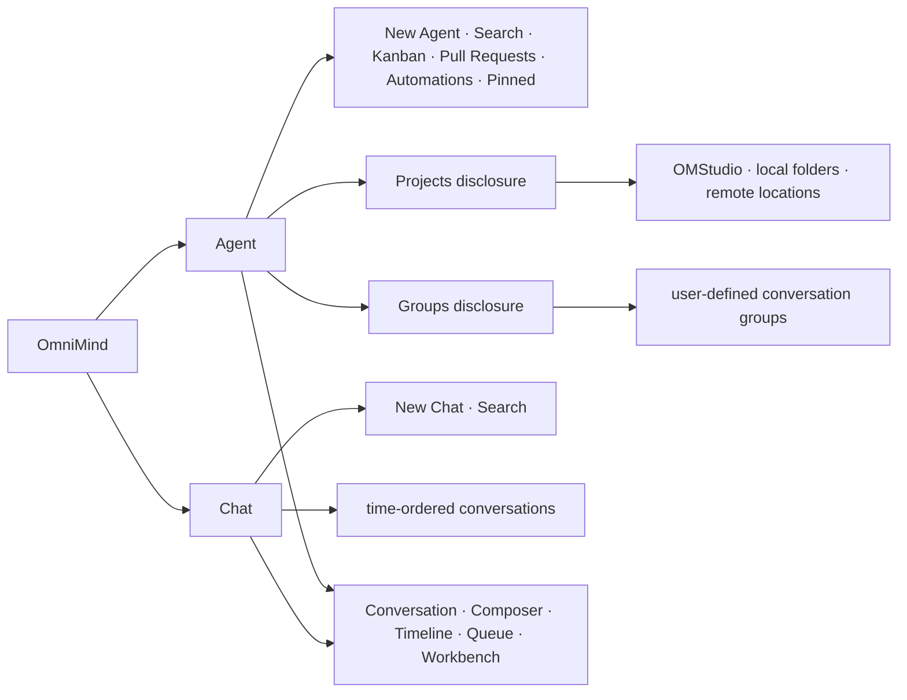

# Workbench

本文件是 OmniMind 唯一完整 UI 契约。根 README 只保留产品级摘要；研究记录只解释证据与被替代路线，不复制本文件。

## 1. 设计立场

固定 U1 是获准的完整物理 UI 母体，不是参考图。首个正确起点是完整源码、可运行 baseline 和直接 source transplant；不得按截图重画、手工挑选少数组件，或用“简洁”“现代化”擅自改变已批准几何。

先保全 shell、navigation、design system、layout、Timeline、Composer、Queue、viewer、tabs、stream/scroll 和桌面桥接的隐性行为，再进行 OmniMind product surgery。surgery 可以大胆，但必须比母体更奥卡姆、更统一、更少认知负担，并通过同状态人工复核。

表面克制、精确、漂亮、丝滑；水下必须有唯一权威、真实回执、失败语义、恢复、性能和跨平台证据。漂亮 mock、假进度、假 streaming、假权限和无真实状态的 skeleton 不算完成。

## 2. 信息架构

`Agent | Chat` 是唯一一级入口，顺序永远是 Agent 在左、Chat 在右。默认入口、键盘顺序、可访问名称和自动化测试顺序一致。Projects、Studio、Remote、Cloud、This Mac 或 Dashboard 都不能成为并列一级世界。



### Agent

- 有 Primary Folder 或独立受管目录；Folder、位置、信任和写入状态只在相关时出现。
- 新 Agent 可以立即在受管目录中打开，不强迫先选 Folder；之后可显式 Open Folder。
- 文件树、Diff、Changes、Terminal、Git、Output 与工作区操作属于 Agent 能力。
- 实质运行状态出现后改变 Primary Folder，应创建新的 Agent Conversation/Handoff，不能静默交换 cwd。

Agent 侧栏使用母体原生的两个纵向 disclosure：`Projects` 在上、`Groups` 在下。它们不是第二组一级 Tabs 或胶囊，可以同时展开，展开一方不折叠另一方。

- Projects 回答“工作发生在哪里”，来自 OMStudio identity 或真实 `ExecutionTarget + path` 投影；Git 只能补充显示，不定义身份。
- Groups 回答“这些 Conversation 属于什么主题”，只拥有名称、颜色、顺序、membership 和折叠偏好；不拥有 Folder、Engine、Permission、Run、文件或 Git。
- 两区复用相同行高、padding、字体、hover、selected、focus、disclosure、Conversation renderer 和截断规则。
- 标题无重复 leading icon；具体项目可使用固定 folder icon，分组可使用克制颜色 marker。
- 同一 Conversation 可在多个浏览上下文出现，但只有一个 `aria-current` owner；搜索结果必须去重并展示上下文。
- V1 允许一个 Conversation 显式加入多个 Groups。普通拖动默认是 move，只有复制修饰手势或菜单“添加到分组”才新增 membership，不能悄悄制造重复项。
- Pinned、Archived、running、blocked、unread 和 attention 在 Projects、Groups 与搜索结果中来自同一上游事实；Archived 暂离活跃投影但保留 membership，恢复后回到原组织位置。

### Chat

- 无 Primary Folder，按时间和最近使用组织，不要求 Project、Folder 或 Workspace 仪式。
- 新 Chat 立即打开空 Conversation，不创建用户可见目录。只有 Engine 真正需要 cwd 时，才按需创建不可见、可回收的内部 scratch。
- 文件和文件夹引用默认只读；无法证明隔离的 Engine 不获得用户原始可写路径。
- 需要修改用户文件时提供克制、明确的 `Send to Agent`，创建可编辑的新 Agent 输入；不能偷偷把 Chat 变成可写 Agent。
- Chat 不显示 Projects/Groups，也不因为 Remote 引用出现新的一级模式。

### 首次使用

首次使用不是品牌欢迎页，而是让用户在真实能力和失败状态下进入可用产品的短路径：

1. 说明 OmniMind 是独立产品、`Powered by Pi`，Pi 是默认 bundled-native Engine；既不冒充 Pi 官方产品，也不隐藏运行时来源。
2. 解释 Agent 与 Chat 的稳定差别；Remote、Package 或先选 Folder 都不是开始普通 Chat 的前置仪式。
3. 根据运行时真实能力连接受支持的 Provider/Model，或选择受支持的本地路径；不展示产品静态镜像伪造的可用项。
4. 在第一次实质文件或命令操作前，解释用户权限策略与实际 enforcement source 是两件事。
5. 进入可用 Chat；若没有可用 Model 或 Runtime，则停在准确的 unavailable 状态并提供 Settings、重试或诊断入口。

认证取消或过期、离线、Runtime 缺失、没有兼容 Model 和版本不匹配都必须保留已完成步骤与用户输入，提供对应的重试或设置入口，不能让用户从头重来。Onboarding 可以推迟；推迟不伪造 ready，也不阻断对已有 Conversation 的只读访问。任何 onboarding 文案都不得暗示全部 Package 已受信任，或外部 Engine 与 Pi 能力相同。

### 来源真实性

来源只在影响理解与决策的地方出现，并渐进披露：

- Composer/Engine selector 显示下一次发送的真实 Engine、来源与当前可用性；
- Package detail 显示 source、rights、exact artifact，并说明 Native Package 运行在 Pi runtime；
- Agent detail 显示实现来源、版本、协议和 capability evidence；
- About、Licenses 与 diagnostics 显示产品和 runtime 的 exact version/source、上游 attribution、法定文本与证据质量。

缺失或无法核验的来源、版本和能力显示为 unknown/unverified，不能从 display name 猜测，也不能被隐藏。普通 Conversation row 不反复刷品牌 badge；完整来源与复杂诊断沉入对应详情层，但真实性不能因界面克制而省略。

## 3. 统一交互语言

Agent 与 Chat 共用：

- Conversation renderer；
- Composer；
- Engine、Model、Thinking/Reasoning；
- `+`、`@`、附件和路径引用；
- Timeline、Activity、Queue 和 Output；
- streaming、滚动和结构化提问；
- 文件引用、键盘行为、密度和视觉状态。

不得维护两套 Composer、消息组件、排版密度或 Activity 语言。稳定差别只来自位置、写入权威和相关 workbench capability。

## 4. 导航与列表

Conversation、Project 与 Group 列表共享一套 row grammar：固定行高、左右 padding、字号、字重、icon size、truncation、hover、selected、focus-visible、unread、running、waiting、blocked、attention、failed 和 disclosure motion。状态不能只靠颜色，必须有图形、文字或可访问名称。

行为要求：

- 页面顶部和列表顶部 hover 不产生卡顿；
- Conversation 切换不让 shell 跳动；
- 后台更新不重排用户正在操作的列表；
- streaming 不频繁重渲染选中行；
- running/attention 状态不改变行高；
- 中文、英文、路径和混排稳定截断；
- 上下键、Home/End、展开/收起、Enter 打开和 roving focus 完整可用；
- 拖拽不是唯一入口，菜单和键盘提供等价移动、添加、移出和排序；
- collapsed target、edge autoscroll、drop feedback、Undo、CAS conflict、失败回滚与重启恢复真实成立；
- 长列表虚拟化后仍保持可解释焦点、稳定滚动和唯一 `aria-current`。

## 5. Composer

Composer 是日常核心，不是控制面板垃圾场。默认只显示输入、附件入口、`+`、`@`、Engine、Model、Thinking/Reasoning、发送和当前必要的运行控制；低频设置渐进披露。

用户必须理解下一次发送会使用的 Engine、Model 和 Thinking。切换选择：

- 只影响下一次发送；
- 不热换当前 Run；
- 不创建 Conversation；
- 不弹确认；
- 不写 Timeline、系统消息或“已切换至……”Toast；
- 不丢失输入、附件和 Queue。

运行中的 send、queue、steer、follow-up、interrupt、stop、cancel 与 abort 必须根据真实能力显示不同按钮状态和准确文案，不能粗暴合并成语义不明的控制。

多行输入、中文输入法 composition、代码粘贴、超长路径、拖拽文件和窗口缩放必须稳定。Composer 高度变化不能造成 Timeline 猛烈跳动；快捷键不得与 Terminal、Viewer 或系统输入法冲突。

## 6. Queue

运行中普通再次发送进入可见 Composer Queue。每项支持查看、编辑、删除、排序，并显示必要的冻结选择；Engine 接纳前仍可修改，失败时保留用户输入。

默认仅显示摘要，展开后再显示 Engine、Model、Thinking、位置和资源等细节。当前编辑项、等待派发项、已被产品接纳项与 Engine 已接受 operation 必须清楚区分。

Queue 不是第二个任务管理器：排序和编辑不刷 Timeline，不伪造进度，不因后台更新丢失本地编辑。产品只拥有 pre-dispatch intent；派发后转成 Run/receipt，Engine 原生操作由 Engine 拥有。

## 7. Conversation、Timeline 与 Activity

Timeline 默认只包含用户需要长期阅读的内容：

- 用户输入和 Assistant 可见回答；
- 结构化问题；
- 重要 Tool/Activity 摘要；
- 文件、Diff、Terminal、Artifact 与 Output 引用；
- 必要的失败、中断、恢复、`outcome_unknown` 和 attention。
- 派发边界不确定时显示 `delivery_unknown`，保留用户输入并禁止无提示重试。

内部 wire noise、隐藏 reasoning、私有 Tool chatter 和逐 token event 不进入 Timeline。Thinking、Planning、Tool、Diff、Terminal 等对象使用一致但可辨识的语言：默认紧凑摘要，按需展开步骤、来源、耗时、文件和错误。同一动作的 streaming updates 原位归并，完成后稳定，不继续闪烁或重排。

用户已经触发且结果自然可见的动作，不再额外出现 Toast、Timeline 系统消息或完成 Banner。只有失败、异步等待、不可逆后果、隐藏副作用、结果不可见、`outcome_unknown`、需要返回处理或权限/信任实质改变时增加提示。版本、来源、兼容和复杂诊断沉入详情层。

## 8. 结构化提问

`Question` 是稳定的结构化 UI 对象。Agent 提问不能退化为普通文本段落；它包含清晰问题、选项、可识别的推荐、自由输入、跳过/取消与等待用户状态，回答后自然回到原 Run，不生成重复系统消息。

等待状态在崩溃和重启后准确恢复；键盘、焦点、屏幕阅读器和移动焦点顺序完整可用。若 Engine 只提供普通文本，产品不得用字符串猜测伪造结构化问题。

## 9. Child Agent、Team 与 Workflow

Delegated Agent 显示为可进入的 child Conversation/Run，而不是日志行。用户可以看见 parent/origin、running、waiting、attention、failed、completed，进入 child，查看输出，追问、steer、stop，并理解结果是否已回到 parent。未经显式提升，child 不成为顶层并列 Conversation。

Team 只增加成员、消息和当前协作状态，不制造第二任务板，也不与 Todo、Workflow 或 Goal 混成一个控制台。

Dynamic Workflow 展示当前计划及其随 evidence 的变化，允许 retry、blocked 和未知副作用被准确表达；不默认提供固定 DAG/YAML 编辑器，也不把所有内部步骤永久塞进主 Timeline。

## 10. Workbench

下列母体能力保持在 production lineage 中：

- 文件树、搜索、reveal 与拖拽；
- Tabs、Split 与 active pane；
- Markdown、PDF、Office、图片、大文本和 unknown binary Viewer；
- Diff、Changes、Terminal 与 generated Output；
- Git、Pull Requests、Kanban 与 Automations；
- recovery/checkpoint 与 location/trust；
- Browser、Source Control、Side Chat 和 Subagents 等获准母体域。

首个 slice 尚未接通的能力可以被 feature gate，并显示准确的 unavailable 状态；不得以假按钮或假数据冒充可用，也不得因当前 Runtime 尚未连接就从架构和 source lineage 永久删除。

每个 Conversation 恢复自己的 open tabs、active tab、open files、split tree、active pane、viewer references、Diff、Terminal 和相对布局。切换 Conversation 不能继承其他 Conversation 的 tab；同一 Output 重复打开应复用已有目标；文件缺失或 viewer 失败只影响当前 tab。

## 11. Viewer

统一使用 `Open / Preview / Reveal / System Open` 语义。Viewer 必须处理：

- 超长文本、大文件、二进制和未知格式；
- 文件缺失、损坏、编码异常或查看期间变化；
- 中文、CRLF/LF 与超长行；
- 超大图片、PDF 失败、Office 转换失败；
- Remote 延迟或失联；
- 尚未完成的 generated artifact。

失败局部、可恢复，不阻塞 Conversation 和其他 tabs。大文件、日志和二进制不得整体塞入 renderer、transcript 或模型上下文。

## 12. Diff、Changes 与 Terminal

Diff 可提供 split/unified view，但 stale diff 必须明确；文件变化后不能静默应用旧位置。大 Diff 使用虚拟化或渐进加载；comment/review 不建立第二持久状态权威。

Changes 清楚区分创建、修改、删除、重命名，以及已观察与尚未确认；Git 状态不能冒充全部文件事实，并发修改和恢复必须有明确反馈。

Terminal 使用真实 PTY，支持进入、复制、搜索、resize，并区分 running、exited、disconnected 和 reconnectable。Terminal 原始噪声不灌入 Timeline；焦点、快捷键和滚动不与 Conversation 冲突。本地与 Remote 使用相同视觉语法，同时清楚显示真实位置。

## 13. Settings

一级设置边界已确认采用稳定领域命名：

- **Models**：Model connection、Provider、Model、Thinking/Reasoning 与认证状态。
- **Agents**：内置原生 Agent、外部 Agent、发现、版本、能力、权限真实性和诊断。
- **Packages**：来源、rights、trust、exact version、兼容、更新、rollback 与 License。

拒绝使用 `Pi / Engines` 作为设置一级导航。Pi 在真实来源、默认 Agent、Package、诊断和 About 中清楚出现，但不成为长期信息架构 namespace。默认页面不把全部高级诊断平铺给普通用户。

### Models

Models 使用 runtime-backed capability 呈现 connection、Provider、Model、Thinking/Reasoning、authentication 和 health。它支持连接、重新认证、在安全时断开、选择下一次发送使用的项，以及打开诊断。

界面必须分别表达：

- connection 的 authenticated、expired、unavailable 与 misconfigured；
- Model 的 available、temporarily unavailable 与 unsupported；
- Thinking level 的 supported、unsupported 与 unknown；
- 下一次发送请求的选择，与当前 Run receipt 中已经冻结的实际选择。

Runtime 事实优先，产品静态 catalog 不得静默覆盖它。Model 或 Thinking 改变仍遵守 Composer 的 next-Run 规则：不确认、不写 Toast/Timeline、不热换当前 Run，也不丢输入、附件或 Queue。

### Agents

Agents 将 bundled native Agent 与安装或连接的 external Agents 清楚分开，但不宣称能力齐平。每个详情可以显示 source、version、status、protocol、Model/Session 限制、capability、用户权限策略、enforcement source 与 diagnostics。

Capability 同时表达正面和负面事实。至少对 Thinking、结构化 Question、queue/steer/follow-up/cancel、Package integration、files/write、Terminal 与 namespaced UI 表明 `available`、`unavailable`、`unsupported`、`degraded` 或 `unknown`，并提供 evidence/reason。进程缺失、连接离线、协议不匹配和版本不匹配是不同故障，各自保留重新连接、更新、改选或诊断入口；不能用一个泛化错误或假 parity 掩盖。

### Packages

Packages 是完整产品面，不是三个分类标签。它支持：

- Catalog/Curated/Verified discovery、search 与 evidence；
- source、rights、publisher、exact artifact digest、release time 与 verification generation；
- Native/Bridged UI/PTY/Unsupported compatibility，以及 Pi/Node/platform/UI 要求；
- install script、native dependency、network/file/command permission 与 private-state review；
- install/stage、approve、在安全边界 activate、查看 active lease、update、retry 与 rollback to LKG；
- Package 所含 Skill/Extension 的 capability detail、License 与最后验证证据；
- loading、install、update 与 fault diagnostics。

`Catalog` 不等于 trust；`Curated` 和 `Verified` 只表示已有记录的审查，不表示 sandbox。`Unverified` 不能显示成可信。Unsupported Package 在 activation 前以具体原因拒绝；install/load/update 或 staging 失败保留原 current/LKG generation。活跃 Run 保持其 leased generation，绝不热替换。Package fault 停止发出新 lease，显示恢复和 LKG 状态，但不能声称进程隔离阻止了文件或网络副作用。

Package private state 与 loading lifecycle 仍由 native runtime/Package 拥有。Workbench 只投影来自 Product State 与 Execution 的事实和可执行入口，不创建竞争 loader、私有状态库或第二套 Package lifecycle。

### 权限策略与执行真实性

影响 Run、Agent、Package 或实质操作时，界面把用户策略和实际强制来源作为两个字段：

| User policy | 用户看到的含义 |
| --- | --- |
| `Approval required` | 覆盖范围内的操作先询问 |
| `Auto` | 按已配置自动策略处理 |
| `Full access` | 用户策略允许广泛操作；不代表 sandbox |

| Enforcement source | 产品可以声称的含义 |
| --- | --- |
| `host-enforced` | 经过拒绝副作用测试的 Host 路径实际阻止了被禁行为 |
| `engine-enforced` | Engine contract 执行约束，Host 没有相同强制 |
| `mixed` | 两侧分别强制，详情必须说明职责边界 |
| `unverified` | 产品不能证明强制，界面不得暗示 containment |

Enforcement source 来自实际 call path 和 deny-side-effect evidence，不来自 renderer 回传、协议名称或“进程已隔离”的推断。denied action、approval cancellation、dispatch 前失败和 post-dispatch uncertainty 必须使用各自准确的可见结果；`Full access` 与进程隔离都不得包装成 filesystem/network sandbox。

### External Engine 能力与无静默 fallback

Composer 的 Engine selector 和相关控制使用真实 capability data。unsupported control 只有在省略不造成误导时才隐藏，否则显示 disabled/unavailable 与原因。Engine 特有能力通过 namespaced typed presentation 出现，不为了模仿 parity 扩张为通用核心字段。

若选中的 Engine 或 Model 在接纳前不可用：

- 不得改由 Pi 或其他来源派发 Run；
- 保留输入、附件、资源和显式选择；
- 在原位置解释 Engine、Model 或 capability 的具体失败，并允许重试或由用户主动改选。

派发后的不确定性遵守 `delivery_unknown`/`outcome_unknown`：不把输入偷偷放回 editable Queue，不经 Pi 或其他 Engine 自动重放。用户从外部 Engine 返回 Pi 时，若旧 Session 已与可见 Conversation 分叉，界面必须准确呈现新 lineage/rebuild，而不是伪装恢复陈旧 Session。

### 固定 Plugin/Skill 发现域

固定母体包含一个受保护的 discovery lineage：

```text
vendor/ui/apps/web/src/routes/_chat.plugins.tsx
vendor/ui/apps/web/src/routeTree.gen.ts                  (/plugins registration)
vendor/ui/apps/web/src/components/PluginLibrary.tsx
```

该域需要保全或有证据地替代 browse/search、plugin 与 skill 的有意义区分、installed/enabled 状态、capability-driven availability、loading/empty/error、source/marketplace failure 和 Skill working-directory requirement。产品映射是：

```text
donor /plugins discovery
  -> Settings › Packages discovery/trust/compatibility/activation
  -> Package detail for contained Skills/Extensions and source evidence
  -> Settings › Agents for Engine discovery capability truth
  -> Composer for enabled Skill use where the selected Engine supports it
```

Donor provider tabs、branding、`Plugin` 作为永久通用产品类别，以及 provider-specific discovery API 都不是受保护 ontology。只有 mapped behavior 已完成 direct transplant 或明确 replacement、正常/失败路径有 proof、并通过适用的同状态视觉复核后，才能删除这些实现。尚未接通时显示 truthful unavailable、来源失败和 re-entry path；不能借 unavailable 删除整个发现域。

## 14. 视觉系统与动效

母体审查必须逐项覆盖：窗口几何、sidebar 和主内容宽度、workbench 展开方式、Composer 位置与高度、Header 克制度、列表密度、字体层级、字重、spacing、radius、border、shadow、surface hierarchy、light/dark theme、hover、selected、focus、disclosure、loading、empty、error、disabled、motion timing、stream smoothing 和 scroll anchoring。

拒绝到处胶囊、重复 icon/title/status、大片装饰色、过度卡片化、badge 化内部对象、技术名词堆叠、每个 Activity 独占大卡片，以及千篇一律的紫色“AI 风”。动效短、快、可打断，只解释空间关系；`prefers-reduced-motion` 下保持完整语义。

## 15. 性能是正确性

从第一条真实 UI slice 就建立：

- high-frequency stream batching；
- active Conversation 的细粒度订阅与后台摘要更新；
- 100k+ 字符 Conversation 的 bounded DOM；
- 长列表、Viewer 和 Diff 虚拟化；
- 稳定 scroll anchor 与 Conversation 切换；
- 页面顶部 hover 与 window/split resize；
- watcher storm backpressure；
- 多后台 Run 和 child 状态更新；
- 有界内存增长；
- 中文输入法 composition。

性能预算必须以 profile 和用户可观察 latency 定义，不能在 UI 完成后再补，因为渲染边界和状态订阅本身就是设计。

## 16. 双语与可访问性

简体中文和英文是首发完整路径。稳定文案集中管理，中文不机械逐词翻译；Thinking、Planning、Git、Diff、PR、Token、ACP、API、Model、路径和代码保留英文更准确时不强译。

CJK 字体、行高、输入法 composition 和混排截断必须稳定。Agent/Chat、Projects/Groups、Composer、Queue、Workbench、Tabs、Viewer 和结构化提问全部支持纯键盘；覆盖 screen-reader name、focus order、contrast、focus-visible 与 reduced motion。

## 17. 接管与删除门

母体域的顺序固定为：

```text
source anchor
→ direct transplant
→ behavior proof
→ same-state visual review
→ founder approval
→ product surgery
→ renewed proof
→ source-domain deletion
```

material visual drift 包括一级 IA、shell/panel geometry、核心 token/密度、导航模式、主要 Timeline/Composer 形态或新增常驻可见域。状态接线、a11y、locale、真实性修复和不改几何的局部缺陷默认不重新打开视觉门。相关 material 变化合并为一次清晰复核，不做微能力截图仪式。

固定 Plugin/Skill 发现域同样遵守这条门：三个 source anchor 必须先映射到 Packages、Agents 与 Composer 的目标行为；删除 route、library 或 donor discovery API 前，需要 direct transplant 或明确 behavior replacement、正常/失败/re-entry proof 与适用的视觉复核。仅保留关键词、空 Settings 标签或永久 unavailable 占位都不算接管完成。

可以删除 donor branding、Provider-first navigation、静态 Model 表、迁移提示、旧失败 skeleton、假 Activity/进度、generic payload renderer、重复 Header/Toast 和无真实能力的按钮。

不得删除已批准母体几何、`Agent | Chat`、Projects above Groups、row grammar、Composer、Queue、Timeline、Workbench、Viewer、Diff、Terminal、结构化提问、child、Git、PR、Kanban、Automations、stream/scroll/performance、CJK 或 accessibility 契约。

## 18. UI 完成门

只有同时满足以下条件，才能宣称 UI 契约保全或 UI 完成：

- 母体源码路径、行为与视觉 lineage 可追踪；
- `Agent | Chat` 与 Agent 内部层级未漂移；
- Composer、Queue、Timeline、Workbench、Viewer 与失败路径真实；
- Engine switching 无确认、Toast、Timeline 或 Handoff 噪声；
- child、结构化提问和后台状态是原生 UI；
- Git、PR、Kanban 与 Automations 未因暂未接 Runtime 被永久删除；
- onboarding 能从真实来源进入可用 Chat，并在 auth cancel/expiry、offline、missing Runtime、no compatible Model 与 version mismatch 下保留进度和 re-entry；
- Composer、Package/Agent detail、About、Licenses 与 diagnostics 的 provenance 完整，unknown/unverified 不被伪造或隐藏；
- Models、Agents、Packages 不仅边界一致，而且正常、unavailable、failure 与 recovery 行为真实；
- permission policy 与 `host-enforced / engine-enforced / mixed / unverified` 可见分离，Package fault 不被宣传为 sandbox containment；
- external Engine capability difference 与 no-silent-fallback 已证明，dispatch uncertainty 不会导致跨 Engine blind replay；
- 固定 Plugin/Skill lineage 的三个 source anchor、目标映射和 preserve/adapt/delete 证据可追踪；未接通域保持 truthful unavailable 与 re-entry，而不是被删除；
- 双语、CJK、键盘、屏幕阅读器与 reduced motion 通过；
- stream、scroll、长 Conversation、大 Viewer 与内存达到测量预算；
- 不存在假进度、假权限、静默 fallback 或重复反馈；
- 同状态人工视觉复核无 material finding。

本文件文本完整只证明 UI contract 已被冻结，不证明以上 UI 已实现。宣称 UI 契约保全、UI 完成或 Campaign claim 成立，仍需在适用的同一 frozen SHA 上提供真实 source-domain map、运行/失败/恢复、性能、双语、可访问性和同状态视觉证据。本轮 documentation/governance repair 不能替代这些产品证据。
