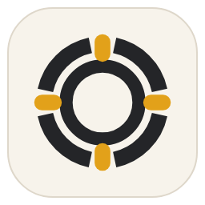

<div align="center">
  
  <h1>Haros</h1>
  <p><strong>十个 Engine，一套本地优先的 Harness OS。</strong></p>
  <p>切换 Engine，工作不断线。</p>
  <p>
    <a href="guide/README.md"><strong>Guidebook</strong></a> ·
    <a href="../README.md">English</a> ·
    <a href="architecture.md">架构</a> ·
    <a href="../CONTRIBUTING.md">参与贡献</a>
  </p>
</div>

Haros 把 Codex、Claude、Cursor、Antigravity、Grok、Droid、Kilo、OpenCode、Pi 和内置
Engine 带进同一套工作台。每轮都能选择最合适的 Engine，而不必搬走项目、重建上下文，
也不会失去统一的工作历史。

## 所有 Engine 进入同一套工作台

每个 Engine 保留自己的模型、参数、认证和原生 Session 语义。Haros 负责它们之外的产品
系统：Project、Thread、Queue、Timeline、工具、权限与恢复。

这条边界是有意设计的。Haros 会冻结每个排队任务选定的 Engine、模型和参数；它不会
伪造跨 Engine continuation，也不会在启动失败时悄悄换用另一个 Engine。

## Harness OS 负责什么

| Haros 的唯一 owner | 始终一致的事实                           |
| ------------------ | ---------------------------------------- |
| 工作               | Project、Thread、消息、附件与工作区      |
| 编排               | Queue、Timeline、中断与后续任务          |
| 本地工具           | 文件、Git、终端、浏览器与设备            |
| 恢复               | 可供对账和恢复的已提交 prompt 与排队任务 |

## 进入 Harness OS 的三种方式

| 工作面 | 最适合                     | 工作区                 |
| ------ | -------------------------- | ---------------------- |
| Agent  | 属于真实项目的工作         | 用户选择的文件夹       |
| Chat   | 无需准备项目的专注对话     | Haros 管理的工作区     |
| Studio | 围绕具体产物持续创作与迭代 | 带独立输出的隔离工作区 |

Agent、Chat 和 Studio 共用同一套产品状态。它们改变的是工作区如何开始、工作如何呈现，
而不是工作历史由谁拥有。

## 从源码运行 Haros

需要 Bun 1.3.12、Node.js 24.13.1，以及 macOS、Linux 或 Windows。

```bash
git clone https://github.com/piai-lab/Haros.git
cd Haros
bun install --frozen-lockfile
bun run dev
```

Haros 当前版本为 `0.1.0-alpha.0`。每个 Engine 是否可用，取决于对应的 CLI、账号与
本机配置。本机构建成功仍然只是未签名的源码软件，不代表正式发行。

## 继续了解

- 从 [Haros Guidebook（英文）](guide/README.md) 开始，完整了解产品与架构。
- 阅读[架构说明](architecture.md)，了解 owner 边界与 runtime 设计。
- 提交改动前请先阅读[参与贡献](../CONTRIBUTING.md)。
- 使用[支持文档](../SUPPORT.md)获取帮助；安全问题请按[安全策略](../SECURITY.md)私下报告。

<details>
<summary>开发检查与仓库结构</summary>

```bash
bun run fmt:check
bun run lint
bun run typecheck
bun run test
bun run build:desktop
```

```text
apps/desktop   桌面壳与操作系统集成
apps/server    产品编排、本地能力与持久化
apps/web       Agent、Chat 和 Studio 工作台
packages/      类型合同、共享逻辑与 runtime 组合
docs/          Guidebook、架构与贡献者文档
```

</details>

## 许可证

Haros 使用 [Apache License 2.0](../LICENSE)。第三方代码与资产保留原始许可证及必要
归属，详见 [NOTICE](../NOTICE) 与 [source-adoptions.json](../source-adoptions.json)。
