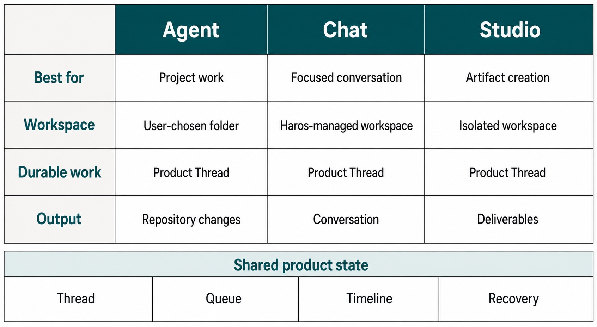

# Preface {#preface}

The Haros Guidebook begins with a simple promise: you should be able to understand what Haros is
doing without memorizing its implementation. When you do need implementation detail, the Guidebook
should lead you to the owner instead of quietly becoming a second owner itself.

This edition completes Parts I and II. Chapters 1–6 establish the product vocabulary and local
boundaries; Chapters 7–15 teach setup, workspace ownership, execution identity, permissions,
interaction modes, lifecycle control, and Timeline evidence. The independently verified Pilot
chapters remain nested regression anchors for surface choice, Queue/Steer/Interrupt, and Product
Orchestration. Together they exercise product explanation, lifecycle reasoning, source trails,
generated teaching figures, reproducible product captures, and four publication formats.

_Part I opener — Begin by choosing the workspace boundary that matches the job while keeping shared
product facts under one Haros owner._

**Accessible equivalent.** Agent supports project work in a user-chosen folder and produces repository changes. Chat supports focused conversation in a Haros-managed workspace. Studio supports artifact creation in an isolated workspace and produces deliverables. Each surface keeps a Product Thread, while Thread, Queue, Timeline, and Recovery remain shared Haros product facts rather than one shared filesystem or native Session.

## How to read evidence in this Guidebook

Generated figures explain durable relationships. They are conceptual and never impersonate a
Haros screen or a protocol trace. Product captures are rendered from actual Haros components with
synthetic data in an isolated browser fixture. Tables carry exact comparisons and changing facts.
Source trails identify the pinned owners and focused tests used for this edition.

The visual palette—charcoal, warm white, amber, restrained slate and teal—is editorial, not a new
Haros identity. The canonical Haros mark is never regenerated. Every essential relationship inside
a raster figure is repeated in nearby text, a table, or an extended description.

## What this edition does not claim

Haros remains source alpha. This edition does not document all features, promise stable alpha behavior,
or announce a release. It does not read real Engine-private state, embed credentials or endpoints,
or use generated UI as evidence. If the source and the Guidebook disagree, the source owner at the
pinned edition wins and the Guidebook must be corrected.

<!-- guide-navigation:start -->

[Guidebook contents](README.md) · [Next: Why an AI Workbench, Not Another Chat Box](part-01-meet-haros/01-why-an-ai-workbench-not-another-chat-box.md)

<!-- guide-navigation:end -->
