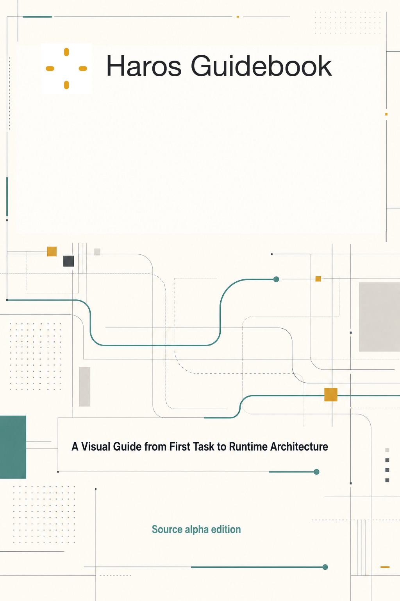

# Haros Guidebook

_Cover — The generated editorial field reserves a blank brand region; the unchanged canonical Haros mark and deterministic wordmark are composed above the generated subtitle and edition text._

**Accessible equivalent.** The generated editorial field reserves the upper third for deterministic
brand composition. The unchanged canonical Haros mark sits left of the typeset Haros Guidebook
wordmark; the generated subtitle and edition text remain below.

**A Visual Guide from First Task to Runtime Architecture**

Haros is a local-first AI workbench that keeps durable product work separate from replaceable
Agent Engines, then reconnects them through typed orchestration and an authorized host-capability
boundary. This Guidebook teaches that idea from the outside in: first what you can see and do, then
the lifecycle that makes the work dependable, and finally the owners a contributor must preserve.

> Edition status: Parts I–VII and Appendices A–H. This edition is pinned to Haros commit
> `17b578d3c65d72113accc17200b9b290f80139f6`. Haros is source alpha; this Guidebook does not imply
> an installer, release, update feed, support promise, or permanent guarantee for alpha behavior.

[Read the preface](00-preface.md) or start with any completed part:

- [Part I — Meet Haros](part-01-meet-haros/01-why-an-ai-workbench-not-another-chat-box.md#chapter-01)
- [Part II — Work in the Haros Workbench](part-02-workbench/07-first-run-setup.md#chapter-07)
- [Part III — Organize and Extend a Line of Work](part-03-organize-work/16-groups-without-moving-projects.md#chapter-16)
- [Part IV — Use Haros's Local Capabilities](part-04-capabilities/25-files-search-preview-editors.md#chapter-25)
- [Part V — Understand the Architecture](part-05-architecture/35-desktop-web-server.md#chapter-35)
- [Part VI — Reliability, Security, and Recovery](part-06-reliability/43-startup-admission.md#chapter-43)
- [Part VII — Extend and Maintain Haros](part-07-contributing/47-diagnostics-usage-retention-maintenance.md#chapter-47)
- [Appendices A–H](appendices/appendix-a-glossary.md#appendix-a)

## Reading routes

| Route                    | Order                                    | Outcome                                                                     |
| ------------------------ | ---------------------------------------- | --------------------------------------------------------------------------- |
| First complete task      | Preface → 1 → 4 → 6 → 25 → 27 → 28       | Understand the workbench, finish a task, inspect files, and review changes. |
| Workbench operator       | Preface → 7 → 10 → 12 → 14 → 15 → 25–34  | Configure exact execution, control it, and use local capabilities safely.   |
| Work organization        | Preface → 16–24 → 34                     | Organize durable work, preserve lineage, hand off, and schedule follow-up.  |
| Capability practitioner  | Preface → 25–34 → 41                     | Use local capabilities with the correct authority and recovery model.       |
| Architecture contributor | Preface → 35–50 → A–H                    | Preserve product owners, runtime boundaries, recovery truth, and evidence.  |
| Complete Guidebook       | Preface → Chapters 1–50 → Appendices A–H | Read every chapter and reference surface in one continuous order.           |

This file is the sole hand-maintained reading-order owner. Publication tools derive navigation from
this order; they do not keep another chapter registry.

## Complete reading order

### Part I — Meet Haros

1. [Why an AI Workbench, Not Another Chat Box](part-01-meet-haros/01-why-an-ai-workbench-not-another-chat-box.md#chapter-01)
2. [Haros in One Sentence](part-01-meet-haros/02-haros-in-one-sentence.md#chapter-02)
3. [Agent, Chat, and Studio](part-01-meet-haros/03-agent-chat-studio.md#chapter-03)
4. [Your First Complete Task](part-01-meet-haros/04-your-first-complete-task.md#chapter-04)
5. [The Vocabulary of Haros](part-01-meet-haros/05-the-vocabulary-of-haros.md#chapter-05)
6. [Local-First, Explained Precisely](part-01-meet-haros/06-local-first-explained-precisely.md#chapter-06)

### Part II — Work in the Haros Workbench

7. [First-Run Setup](part-02-workbench/07-first-run-setup.md#chapter-07)
8. [Projects and Managed Workspaces](part-02-workbench/08-projects-and-managed-workspaces.md#chapter-08)
9. [Threads, Turns, Messages, and Sessions](part-02-workbench/09-threads-turns-messages-and-sessions.md#chapter-09)
10. [The Composer as a Control Surface](part-02-workbench/10-composer-control-surface.md#chapter-10)
11. [Engines, Models, and Options](part-02-workbench/11-engines-models-and-options.md#chapter-11)
12. [Permissions and Runtime Modes](part-02-workbench/12-permissions-and-runtime-modes.md#chapter-12)
13. [Interaction Modes: Default, Plan, Debug, Converge, and Learn](part-02-workbench/13-interaction-modes.md#chapter-13)
14. [Queue, Steer, Interrupt](part-02-workbench/14-queue-steer-interrupt.md#chapter-14)
15. [Timeline, Activity, and Model Provenance](part-02-workbench/15-timeline-activity-model-provenance.md#chapter-15)

### Part III — Organize and Extend a Line of Work

16. [Groups Without Moving Projects](part-03-organize-work/16-groups-without-moving-projects.md#chapter-16)
17. [Notes, Pinned Messages, and Markers](part-03-organize-work/17-notes-pinned-messages-markers.md#chapter-17)
18. [Goals and Goal Achievement](part-03-organize-work/18-goals-and-goal-achievement.md#chapter-18)
19. [Plans and Implementation Threads](part-03-organize-work/19-plans-and-implementation-threads.md#chapter-19)
20. [Attachments, Mentions, Skills, and References](part-03-organize-work/20-attachments-mentions-skills-references.md#chapter-20)
21. [Images and Voice](part-03-organize-work/21-images-and-voice.md#chapter-21)
22. [Sidechats, Subagents, and Thread Hierarchy](part-03-organize-work/22-sidechats-subagents-thread-hierarchy.md#chapter-22)
23. [Forks and History Boundaries](part-03-organize-work/23-forks-and-history-boundaries.md#chapter-23)
24. [Handoffs, Branches, and Worktrees](part-03-organize-work/24-handoffs-branches-worktrees.md#chapter-24)

### Part IV — Use Haros's Local Capabilities

25. [Files, Search, Preview, and Editors](part-04-capabilities/25-files-search-preview-editors.md#chapter-25)
26. [The Integrated Terminal](part-04-capabilities/26-integrated-terminal.md#chapter-26)
27. [Git Status, Branches, and Checkpoints](part-04-capabilities/27-git-branches-checkpoints.md#chapter-27)
28. [Diffs, Rollback, and Edit-and-Resend](part-04-capabilities/28-diffs-rollback-edit-resend.md#chapter-28)
29. [Pull Requests](part-04-capabilities/29-pull-requests.md#chapter-29)
30. [Browser Workflows and Web Access](part-04-capabilities/30-browser-workflows-web-access.md#chapter-30)
31. [Device Workflows](part-04-capabilities/31-device-workflows.md#chapter-31)
32. [Project Actions and Dev Servers](part-04-capabilities/32-project-actions-dev-servers.md#chapter-32)
33. [Studio Outputs](part-04-capabilities/33-studio-outputs.md#chapter-33)
34. [Automations](part-04-capabilities/34-automations.md#chapter-34)

### Part V — Understand the Architecture

35. [Desktop, Web, and Server](part-05-architecture/35-desktop-web-server.md#chapter-35)
36. [Typed Contracts and Narrow Projections](part-05-architecture/36-typed-contracts-narrow-projections.md#chapter-36)
37. [Product Orchestration](part-05-architecture/37-product-orchestration.md#chapter-37)
38. [Persistence and Read Models](part-05-architecture/38-persistence-read-models.md#chapter-38)
39. [Engine Identity, Discovery, and Adapters](part-05-architecture/39-engine-identity-discovery-adapters.md#chapter-39)
40. [Product Threads vs Native Engine Sessions](part-05-architecture/40-product-threads-native-engine-sessions.md#chapter-40)
41. [HostGateway and Exact-Turn Authority](part-05-architecture/41-hostgateway-exact-turn-authority.md#chapter-41)
42. [Streaming, Synchronization, and Backpressure](part-05-architecture/42-streaming-synchronization-backpressure.md#chapter-42)

### Part VI — Reliability, Security, and Recovery

43. [Startup and Admission](part-06-reliability/43-startup-admission.md#chapter-43)
44. [Failure, Cancellation, Timeout, and Idempotency](part-06-reliability/44-failure-cancellation-timeout-idempotency.md#chapter-44)
45. [Restart, Quit, and Recovery](part-06-reliability/45-restart-quit-recovery.md#chapter-45)
46. [Secrets, Trust, and Local Boundaries](part-06-reliability/46-secrets-trust-local-boundaries.md#chapter-46)

### Part VII — Extend and Maintain Haros

47. [Diagnostics, Usage, Retention, and Maintenance](part-07-contributing/47-diagnostics-usage-retention-maintenance.md#chapter-47)
48. [External Connections and MCP](part-07-contributing/48-external-connections-mcp.md#chapter-48)
49. [Adding an Engine Without Adding a Second Truth](part-07-contributing/49-adding-an-engine-without-second-truth.md#chapter-49)
50. [Contributing, Proving, Packaging, and Shipping](part-07-contributing/50-contributing-proving-packaging-shipping.md#chapter-50)

### Appendices

A. [Glossary](appendices/appendix-a-glossary.md#appendix-a)
B. [State and Lifecycle Reference](appendices/appendix-b-lifecycle-reference.md#appendix-b)
C. [Engine Capability Matrix](appendices/appendix-c-engine-capability-matrix.md#appendix-c)
D. [Command and Event Index](appendices/appendix-d-command-and-event-index.md#appendix-d)
E. [Source Map](appendices/appendix-e-source-map.md#appendix-e)
F. [Failure Playbook](appendices/appendix-f-failure-playbook.md#appendix-f)
G. [Security and Privacy Checklist](appendices/appendix-g-security-and-privacy-checklist.md#appendix-g)
H. [Edition Notes](appendices/appendix-h-edition-notes.md#appendix-h)

Chapters 1–50 and Appendices A–H are present in this edition. Future numbered chapters or
reference surfaces are not listed until their Markdown source exists and can join this same derived
navigation chain.
