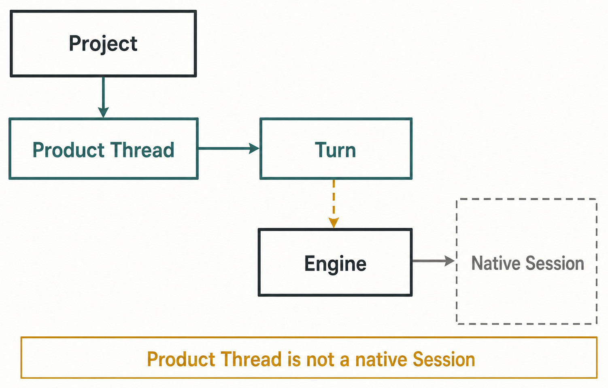
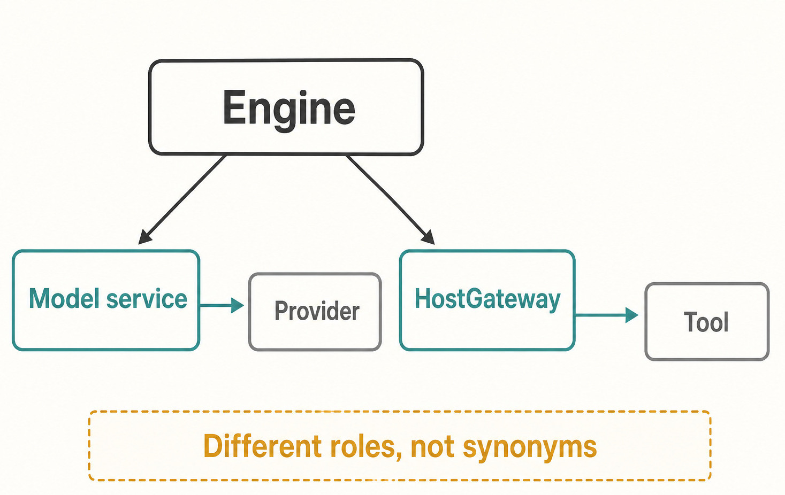

# Appendix A — Glossary {#appendix-a}

This glossary gives one Haros meaning for each product or architecture term. It is a reading aid,
not a new schema. When an exact field, literal, or capability changes, the source named in the
front matter remains authoritative and this edition must be regenerated or reverified.

The most important reading rule is that similar-looking nouns do not automatically share an owner.
A Product Thread is not a native Engine Session. An Engine is not a Provider. An external MCP
server can offer tools without owning Haros state. A package can pass packaged proof without being
a release.

_Figure A.1 — The vocabulary is easiest to use when every term stays inside its ownership boundary._

**Accessible equivalent.** Project contains Product Thread, which contains Turn. Turn binds to Engine execution, and Engine owns Native Session. The constraint states Product Thread is not a native Session.

## Canonical definitions

| Term                      | Canonical plain-English definition                                                                                                                          | Owner or boundary                                                                    | Common confusion to avoid                                                                                              |
| ------------------------- | ----------------------------------------------------------------------------------------------------------------------------------------------------------- | ------------------------------------------------------------------------------------ | ---------------------------------------------------------------------------------------------------------------------- |
| **Haros**                 | The sole product identity in this repository: a local-first workbench for durable AI work across Agent, Chat, and Studio.                                   | Product copy and repository architecture                                             | Internal package names and supported runtimes are implementation or integration identities, not second product brands. |
| **Agent**                 | The Haros surface for repository-scoped, tool-using work that can continue across multiple Turns.                                                           | Haros product surface                                                                | Agent is a surface, not an Engine name.                                                                                |
| **Chat**                  | The Haros surface for direct conversational work while retaining shared Product Thread, Queue, Timeline, and recovery semantics.                            | Haros product surface                                                                | Chat is not a stateless wrapper around an upstream transcript.                                                         |
| **Studio**                | The Haros surface for composing and running media-oriented work through explicit artifacts, drafts, jobs, and delivery.                                     | Haros product surface and Studio owners                                              | Studio output is not automatically published merely because generation completed.                                      |
| **Project**               | A durable Haros record that supplies repository or workspace context for related Product Threads.                                                           | Product Orchestration                                                                | A Project record and a directory on disk are related but not identical facts.                                          |
| **managed workspace**     | A workspace whose lifecycle Haros deliberately creates or manages for a task, including bounded worktree operations.                                        | Product Orchestration plus HostGateway for local effects                             | It is not permission to mutate arbitrary repositories or user directories.                                             |
| **Space**                 | A Haros grouping and ordering construct for Projects and Threads; older code may use “group” in a field name.                                               | Product Orchestration                                                                | A Space is organizational metadata, not a filesystem folder or Engine workspace.                                       |
| **Product Thread**        | The durable Haros record that holds product-visible history, settings, lineage, Queue, Timeline, and recovery facts.                                        | Product Orchestration                                                                | It is not a native Engine Session, and Haros does not fabricate Session continuity when Engines change.                |
| **Turn**                  | One admitted unit of user or automation work within a Product Thread, with provenance and lifecycle facts.                                                  | Product Orchestration for admission and durable state; selected Engine for execution | A Turn is not every streamed token, tool item, or native Engine turn identifier.                                       |
| **Message**               | A user- or assistant-visible contribution recorded in Product Thread history.                                                                               | Product Orchestration                                                                | A message delta is transport progress; it is not automatically a settled message.                                      |
| **Queue**                 | The ordered Product state for work accepted to wait behind active work.                                                                                     | Product Orchestration                                                                | The Queue is not an Engine process queue and must survive Engine replacement according to product rules.               |
| **Timeline**              | The product-visible ordered projection of messages, activities, decisions, and settled work.                                                                | Product Orchestration projections                                                    | The Timeline is a read model, not a second event store.                                                                |
| **Engine**                | A complete agent runtime that can run a Turn, maintain its own private Session facts, and expose adapter capabilities.                                      | `ENGINE_DESCRIPTORS`, Engine adapter registry, and adapter implementation            | Do not use “Provider” as a synonym.                                                                                    |
| **Provider**              | An upstream model-service or search-service concept inside the domain where it is accurate.                                                                 | The model or search service integration                                              | A Provider does not automatically have a complete agent runtime or Product Thread ownership.                           |
| **model**                 | The exact model selection presented and admitted for Engine execution.                                                                                      | Engine discovery/admission contracts and per-Turn provenance                         | A display alias must not silently replace exact admitted model identity.                                               |
| **native Engine Session** | Private execution continuity maintained by one Engine adapter and its runtime.                                                                              | Selected Engine and adapter                                                          | It is not copied across Engines and is not the durable Product Thread.                                                 |
| **Engine adapter**        | The boundary that translates Haros execution requests and native runtime events for one Engine.                                                             | Adapter implementation, checked by registry and conformance tests                    | An adapter must not duplicate HostGateway permissions, receipts, local file authority, or Product state.               |
| **`ENGINE_DESCRIPTORS`**  | The exhaustive, credential-blind list that solely owns Engine identity, registration order, display name, usage metadata, and Settings discovery.           | `packages/shared/src/engineMetadata.ts`                                              | Capability implementations may be keyed by Engine, but they must not become parallel Engine identity lists.            |
| **Product Orchestration** | The command, decision, event, projection, and reactor system that owns shared product facts across Agent, Chat, and Studio.                                 | Server orchestration contracts and services                                          | It does not own private native Session state or arbitrary local system authority.                                      |
| **command**               | A request to change Product state, carrying an identity and enough facts for the decider to accept or reject it.                                            | Orchestration contract and command bus                                               | A command is intent, not proof that the requested outcome happened.                                                    |
| **event**                 | A durable Product fact emitted after a command is decided, with sequence and causation metadata.                                                            | Orchestration event store and contract                                               | A native runtime event or WebSocket notification is not automatically a Product domain event.                          |
| **projection**            | A rebuildable read model reduced from owned facts for efficient product queries and UI display.                                                             | Projection reducer/query owner                                                       | A projection must not decide commands or quietly become a second writable store.                                       |
| **reactor**               | A component that observes committed Product facts and coordinates bounded follow-up effects.                                                                | Orchestration reactors                                                               | A reactor can request work; it does not replace the decider or own Product state.                                      |
| **HostGateway**           | The single local capability boundary for files, Git, terminals, browsers, devices, permissions, cancellation, timeouts, idempotency, and receipts.          | HostGateway                                                                          | Engine adapters and external MCP tools must not bypass or duplicate this authority.                                    |
| **capability**            | A declared operation that the selected Engine or local host can actually support under current admission rules.                                             | Descriptor/adapter capability sources and HostGateway policy                         | A visible control, tool name, or installed binary alone does not prove capability.                                     |
| **permission**            | A bounded decision that admits or denies a specific sensitive action in its current context.                                                                | HostGateway and interaction-settlement contracts                                     | Permission is not ambient trust for later commands or another target.                                                  |
| **runtime mode**          | The requested execution posture: `approval-required`, `auto`, or `full-access`, admitted only when the Engine structure supports it.                        | Orchestration contract and `ENGINE_EXECUTION_STRUCTURE`                              | The label does not override HostGateway or operating-system boundaries.                                                |
| **interaction mode**      | The Engine interaction style: `default`, `plan`, `debug`, `converge`, or `learn`, where supported.                                                          | Orchestration contract and Engine execution structure                                | It is not a Provider name or a substitute for runtime permissions.                                                     |
| **checkpoint**            | A bounded record of completed Turn file changes that can support an explicit revert workflow.                                                               | Product Orchestration plus HostGateway/Git effect path                               | It is not a complete backup of private Engine state or every file on the machine.                                      |
| **fork**                  | Creation of a distinct Product Thread with explicit lineage and a bounded imported-history scope.                                                           | Product Orchestration                                                                | A fork is not an in-place branch of the same Product Thread or automatic native Session clone.                         |
| **handoff**               | Creation of a distinct Product Thread that carries an explicit, bounded transfer of product-visible context.                                                | Product Orchestration                                                                | Handoff does not move or copy private native Engine Session state.                                                     |
| **automation**            | A persisted Haros instruction and schedule that dispatches ordinary admitted work under a permission snapshot and run lifecycle.                            | Automation service plus Product Orchestration                                        | It is not a background permission bypass.                                                                              |
| **heartbeat automation**  | An automation mode that continues an existing target Product Thread on later runs.                                                                          | Automation service                                                                   | “Continue” refers to Product Thread context; native Session survival is not promised.                                  |
| **standalone automation** | An automation mode in which each run creates a fresh Product Thread and Turn.                                                                               | Automation service                                                                   | It is not the same as a dedicated automation, which reuses one automation-owned Thread.                                |
| **Studio Outbox**         | The explicit Studio workspace boundary that marks candidate deliverables as eligible for capture.                                                           | Studio output convention and service                                                 | Presence in Outbox is not by itself proof of capture or external publication.                                          |
| **external MCP**          | An admitted external Model Context Protocol connection that may expose tools or resources through explicit policy.                                          | External MCP gateway, settings, and admission policy                                 | It is not a Product state owner, HostGateway replacement, or automatic source of trusted commands.                     |
| **receipt**               | The durable accepted/rejected result associated with a command identity and payload fingerprint.                                                            | Command store and orchestration receipt contract                                     | Retrying with the same identity and different content is not a safe duplicate.                                         |
| **idempotency**           | The rule that an exact retry can return its prior result without applying the same effect twice.                                                            | Command and HostGateway receipt owners                                               | Idempotency is not “ignore all duplicates”; the fingerprint and target still matter.                                   |
| **local-first**           | Product work and core state remain usable on the local machine, with external services treated as bounded integrations.                                     | Haros architecture                                                                   | It does not mean offline-only, no security boundary, or unrestricted filesystem access.                                |
| **diagnostic**            | Bounded evidence that explains observed system behavior or failure without becoming the owner of that behavior.                                             | Diagnostic producer and query projection                                             | A diagnostic can be stale, incomplete, sanitized, or retained for less time than Product history.                      |
| **source adoption**       | A declared use of external source material whose identity, license, notice, differences, and shipped status are recorded in the machine-readable authority. | `source-adoptions.json`                                                              | Source presence, copied bytes, runtime registration, and product presentation are separate claims.                     |
| **packaged proof**        | Evidence that an installable or packaged candidate behaves as claimed in a controlled verification environment.                                             | Packaging tests and retained evidence                                                | It is not signing, notarization, publication, updater availability, or a release.                                      |
| **release**               | A maintainer-authorized distribution outcome that has passed the required signing, publication, provenance, and channel gates.                              | Maintainer and release pipeline                                                      | An unsigned local build, archive, or passing smoke test must never be described as a release.                          |

## The shortest ownership test

When two terms seem interchangeable, ask three questions:

1. Which owner can write the fact?
2. Does that fact survive a process or Engine restart?
3. Which failure can occur without invalidating the other fact?

For example, a Product Thread can remain durable after a native Engine Session stops. A projection
can be rebuilt while its events remain valid. An external MCP server can be unavailable while the
Product Queue remains intact. Those failure separations show that the nouns are not synonyms.

_Figure A.2 — Ownership, survival, and independent failure are a practical test for choosing the right term._

**Accessible equivalent.** Engine branches to Model service, which leads to Provider, and separately to HostGateway, which leads to Tool. Different roles, not synonyms constrains both branches.

## Source trail and update rule

Definitions of Product Thread, Turn, command, event, projection, receipt, and interaction state are
anchored in `packages/contracts/src/orchestration.ts` and the orchestration decider, reactors, and
projections. Engine identity comes only from `packages/shared/src/engineMetadata.ts`; native event
vocabulary comes from `packages/contracts/src/engineRuntime.ts`. Automation modes and run states
come from `packages/contracts/src/automation.ts`. Local authority is defined by HostGateway, while
external MCP and Studio delivery have separate bounded owners.

If a future edition changes one of those owners, update the canonical source first, prove the
behavior there, and then reverify this glossary. Do not patch a definition here to make an
implementation inconsistency appear resolved.

<!-- guide-navigation:start -->

[Guidebook contents](../README.md) · [Previous: Contributing, Proving, Packaging, and Shipping](../part-07-contributing/50-contributing-proving-packaging-shipping.md) · [Next: Appendix B — State and Lifecycle Reference](appendix-b-lifecycle-reference.md)

<!-- guide-navigation:end -->
