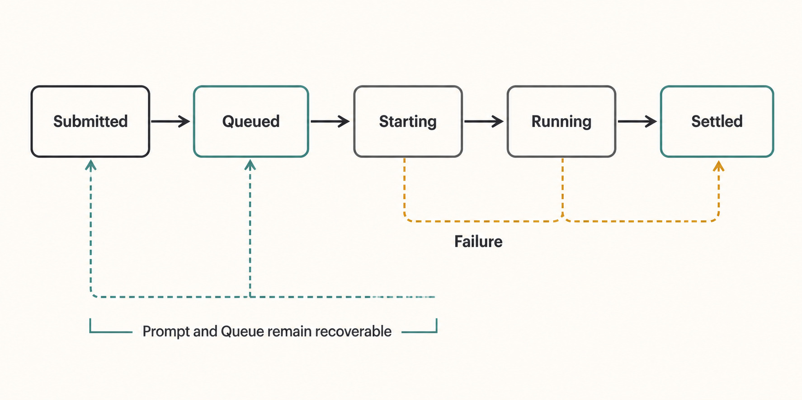
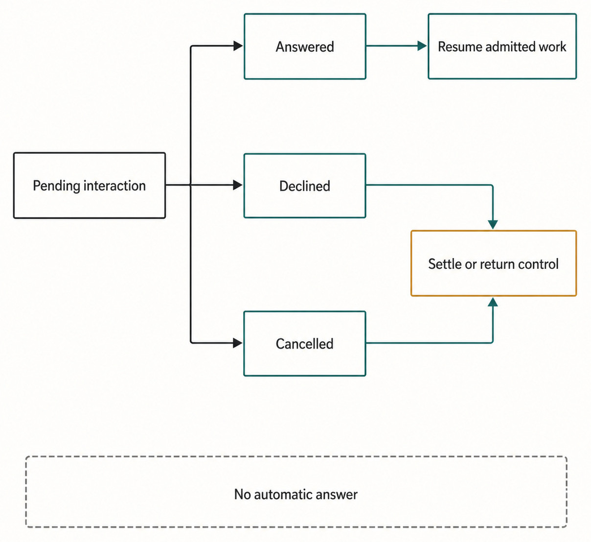
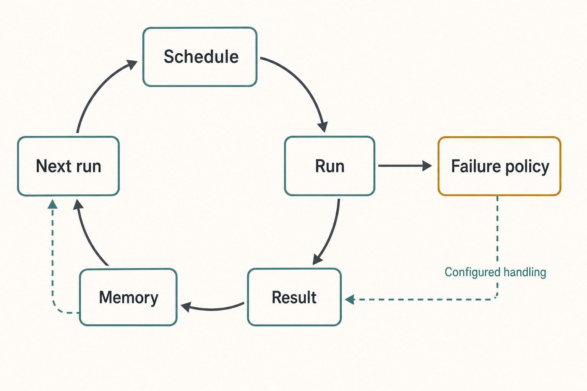

# Appendix B — State and Lifecycle Reference {#appendix-b}

This appendix is a compact lookup for state words that appear in Haros. The tables record the
edition-pinned contract literals and their boundary. They do not create a universal state machine:
Product Orchestration, a native Engine runtime, automation, pending interactions, and maintenance
each have a different owner and recovery path.

Read a row as “this owner may report this state,” not “every neighboring state is a permitted next
step.” Exact transitions are decided by the canonical service and tested there. If a UI needs a new
state, change the owning contract and reducer first, then regenerate or reverify this appendix.

_Figure B.1 — Product history and native execution use related but separate lifecycles._

**Accessible equivalent.** Submitted flows to Queued, Starting, Running, and Settled. The raster
label Failure marks dashed paths from Starting and Running that also settle honestly. Prompt and
Queue remain recoverable across interruption.

## Product and native execution states

| Lifecycle                      | Contract states                                                           | What the state describes                                                    | Restart and recovery boundary                                                                                                              |
| ------------------------------ | ------------------------------------------------------------------------- | --------------------------------------------------------------------------- | ------------------------------------------------------------------------------------------------------------------------------------------ |
| Haros orchestration Session    | `idle`, `starting`, `running`, `ready`, `interrupted`, `stopped`, `error` | Haros's projection of execution readiness for one Product Thread            | Product Thread history remains authoritative. Recovery may start or bind a new native Session; it must not claim the old Session survived. |
| Latest Product Turn            | `running`, `interrupted`, `completed`, `error`                            | The latest admitted Turn's product-visible settlement                       | A restart can reconcile from durable events and receipts. It must not turn an uncertain effect into a fabricated completion.               |
| Checkpoint                     | `ready`, `missing`, `error`                                               | Whether a completed Turn has usable file-change checkpoint evidence         | `missing` or `error` preserves the Product Turn but removes the promise that file revert is available.                                     |
| Native runtime Session         | `starting`, `ready`, `running`, `waiting`, `stopped`, `error`             | The selected Engine's normalized process/session condition                  | Adapter-owned. A stopped process may be replaced; its private continuity is not Product state.                                             |
| Native runtime Thread          | `active`, `idle`, `archived`, `closed`, `compacted`, `error`              | A normalized Engine-side thread/session record when that Engine exposes one | Never infer the Haros Product Thread lifecycle from this state alone.                                                                      |
| Native runtime Turn settlement | `completed`, `failed`, `interrupted`, `cancelled`                         | A terminal normalized result reported by an Engine                          | It becomes product-visible only through ingestion, command admission, and Product Orchestration settlement.                                |
| Native runtime task            | `pending`, `inProgress`, `completed`                                      | Progress of an Engine-native task item                                      | Task progress is evidence; it does not independently settle the Product Turn.                                                              |
| Native runtime item            | `inProgress`, `completed`, `failed`, `declined`                           | Progress or disposition of an Engine-native item such as a tool action      | Permission and local effects still pass through their proper boundaries.                                                                   |

Two spelling differences are intentional contract facts: Product-facing states use words such as
`running`, while normalized native item/task states include `inProgress`. Do not normalize them in
documentation or UI code by inventing a shared enum.

## Pending interaction settlement

An approval or structured user-input request can survive transport interruption. The projection
therefore records more than “open” or “closed.” It retains the response command identity and a
lifecycle generation so an exact retry can be distinguished from a stale response.

| State        | Plain meaning                                                                     | Preserved fact                                                                                    | Safe next action                                                                                                 |
| ------------ | --------------------------------------------------------------------------------- | ------------------------------------------------------------------------------------------------- | ---------------------------------------------------------------------------------------------------------------- |
| `pending`    | The request is visible and no response is being settled.                          | Request identity, kind (`approval` or `userInput`), Product Thread, optional Turn, and generation | Collect one bounded response and dispatch it with a fresh command identity.                                      |
| `responding` | A response command is in flight or its outcome is not yet reflected.              | Response command identity, requested time, and proposed decision/answer                           | Wait for the receipt or replayed projection; do not send a different answer as a “retry.”                        |
| `confirmed`  | The response was durably accepted and the interaction was resolved.               | Decision, response command, and resolution time                                                   | Continue from Product state. A duplicate exact response should resolve through idempotency.                      |
| `retryable`  | The previous attempt failed in a way the product has classified as safe to retry. | Original request and enough response identity to explain the failure                              | Retry through the same interaction path, preserving the intended answer and current lifecycle generation.        |
| `uncertain`  | Haros cannot prove whether the external effect or response settled.               | The unresolved request and attempted response evidence                                            | Reconcile or inspect receipts before acting. Never guess “confirmed” or repeat a potentially destructive effect. |

_Figure B.2 — Pending interactions preserve enough identity to recover without double-submitting._

**Accessible equivalent.** Pending interaction branches to Answered then Resume admitted work, and to Declined or Cancelled then Settle or return control. No automatic answer constrains all branches.

- Recovery must preserve the lifecycle generation and response command identity. The `Uncertain`
  branch points to `Reconcile` before any new side effect, never to `Assume success` or
  `Repeat effect`.

## Automation lifecycle

Automation has two related vocabularies: configuration mode decides which Product Thread a run
uses, while run status describes one claimed execution. Neither vocabulary grants extra authority.
Each run carries an admitted permission snapshot and dispatches ordinary Product Orchestration
work.

| Family         | Exact values                                                                                                          | Meaning and lifecycle boundary                                                                                                                                                                       |
| -------------- | --------------------------------------------------------------------------------------------------------------------- | ---------------------------------------------------------------------------------------------------------------------------------------------------------------------------------------------------- |
| Execution mode | `standalone`, `heartbeat`, `dedicated`                                                                                | Standalone creates a fresh Thread per run; heartbeat continues an existing target Thread; dedicated creates one automation-owned Thread and reuses it. None promises native Engine Session survival. |
| Schedule kind  | `manual`, `once`, `interval`, `daily`, `weekdays`, `weekly`, `cron`                                                   | Describes when a run may be proposed. A due schedule is not proof that permission, capacity, or Turn admission succeeded.                                                                            |
| Worktree mode  | `auto`, `local`, `worktree`                                                                                           | Selects the requested workspace placement. Local creation and Git effects remain behind HostGateway and project policy.                                                                              |
| Proposal state | `pending`, `accepted`, `dismissed`                                                                                    | Tracks a user-visible proposal before it becomes active configuration.                                                                                                                               |
| Run status     | `pending`, `claimed`, `running`, `waiting-for-approval`, `succeeded`, `failed`, `cancelled`, `interrupted`, `skipped` | Tracks one run from scheduling through settlement. A waiting run preserves its interaction rather than bypassing approval.                                                                           |
| Run outcome    | `findings`, `no-findings`, `changed-files`, `needs-attention`, `unknown`                                              | Summarizes the result for review; it does not replace Turn history or Git evidence.                                                                                                                  |
| Disable reason | `failures`, `max-iterations`, `completion`, `schedule`, `user`                                                        | Explains why future scheduling stopped. It is configuration state, not deletion of existing Threads or run history.                                                                                  |

When a heartbeat run cannot continue immediately, the correct preserved state is the target Product
Thread plus the automation/run record. Recovery may dispatch another admitted Turn later. It may
not synthesize a native Session, silently select a different Engine, or weaken the saved permission
snapshot.

## Engine version and update states

Version checking and updating are maintenance evidence. They do not define Engine identity and do
not constitute a Haros release.

| Lifecycle            | Exact values                                                    | Interpretation                                                  | Failure-preserving recovery                                                                                            |
| -------------------- | --------------------------------------------------------------- | --------------------------------------------------------------- | ---------------------------------------------------------------------------------------------------------------------- |
| Server Engine health | `ready`, `warning`, `error`                                     | Current bounded health evidence for an Engine installation      | Recheck the executable and sanitized diagnostic source; Product Threads remain intact.                                 |
| Version advisory     | `unknown`, `current`, `behind_latest`                           | Comparison between detected and bounded latest-version evidence | `unknown` means no safe comparison, not “current.” Refresh later or use the documented manual path.                    |
| Update action        | `idle`, `queued`, `running`, `succeeded`, `failed`, `unchanged` | One explicit maintenance command under a per-target lock        | Preserve installed-version evidence and logs; on failure, resolve install source/path before another explicit attempt. |

The update coordinator serializes the same logical target and rejects incompatible concurrent
work. A successful update action proves only that the bounded command completed and refreshed
status. It does not sign, notarize, publish, or release Haros, and it does not make an Engine a
Provider or vice versa.

_Figure B.3 — Failure recovery resumes from the owner that preserved the fact; it does not merge lifecycles._

**Accessible equivalent.** Schedule leads to Run, Result, Memory, Next run, and back to Schedule. Run also passes through Failure policy and Configured handling before rejoining Result.

## How to use this reference safely

Start from the visible state, identify its lifecycle owner, and inspect that owner's receipt,
event, or focused diagnostic. Preserve Product Thread and Turn history even when execution evidence
is missing. Treat `uncertain`, `unknown`, and `error` as honest limits on knowledge, not invitations
to manufacture a green state.

The security boundary remains unchanged in every lifecycle: HostGateway owns local capabilities;
an Engine adapter reports execution but cannot grant itself local authority; an external MCP
connection can provide an admitted tool but cannot write Product state directly. Tests must use
fresh task-specific homes and user-data directories and must never probe or repair real private
Engine state.

## Source trail and derivation

The literals in the first two tables come from `packages/contracts/src/orchestration.ts` and
`packages/contracts/src/engineRuntime.ts`. Automation modes, schedules, run states, outcomes, and
disable reasons come from `packages/contracts/src/automation.ts`. Engine health, advisory, and
update states come from `packages/contracts/src/server.ts`, with behavior checked against the
maintenance owner and command coordinator. Explanations of restart behavior are constrained by the
orchestration decider, projections, and reactors. This appendix intentionally does not encode an
independent transition graph.

<!-- guide-navigation:start -->

[Guidebook contents](../README.md) · [Previous: Appendix A — Glossary](appendix-a-glossary.md) · [Next: Appendix C — Engine Capability Matrix](appendix-c-engine-capability-matrix.md)

<!-- guide-navigation:end -->
