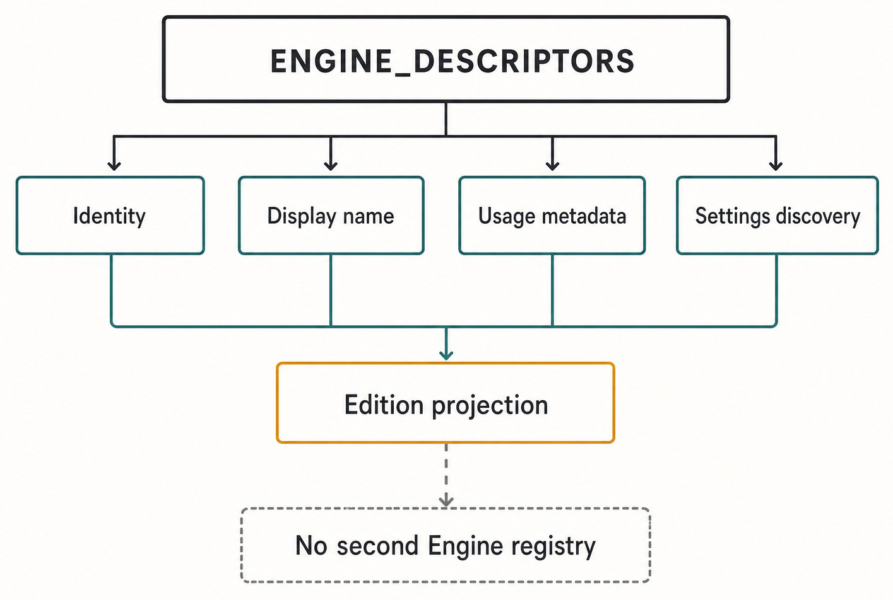
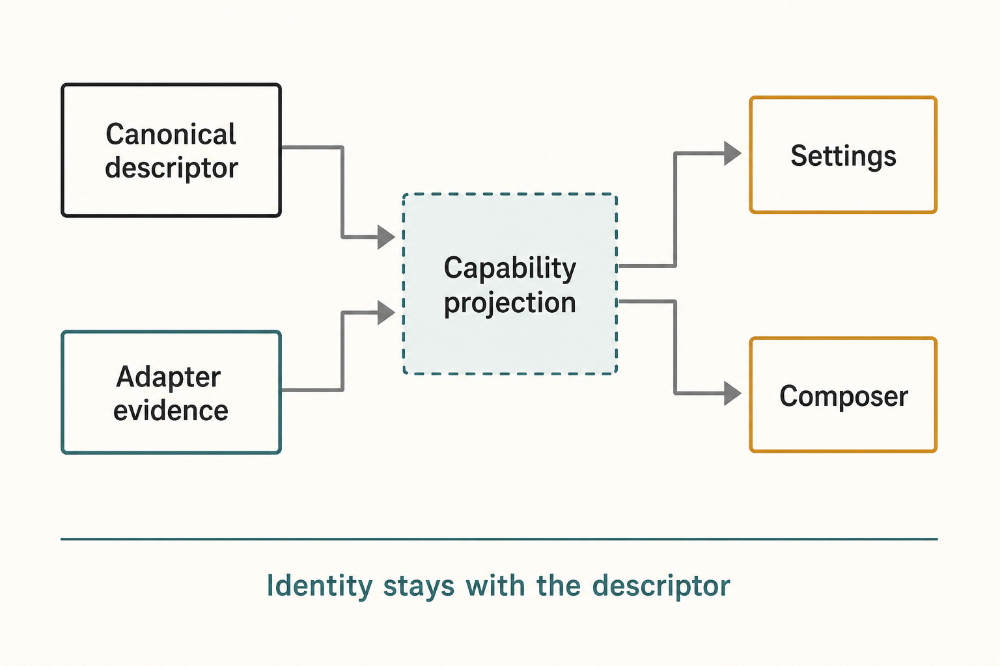

# Appendix C — Engine Capability Matrix {#appendix-c}

This matrix is an **edition-pinned generated/verified derivation**, not a hand-maintained Engine
registry. Engine order and display names are projected from `ENGINE_DESCRIPTORS`, the sole identity
owner. Execution modes come from `ENGINE_EXECUTION_STRUCTURE`. Feature flags come from the live
adapter capability blocks and are checked against adapter methods by conformance tests.

If this appendix and the running product disagree, the canonical owners and focused tests win. Fix
or prove those owners, then regenerate the publication snapshot. Never add an Engine to this table
as the first implementation step, and never copy these rows into Settings, routing, or discovery
code.

_Figure C.1 — The matrix is downstream evidence produced from canonical owners._

**Accessible equivalent.** ENGINE_DESCRIPTORS fans out to Identity, Display name, Usage metadata, and Settings discovery, which feed Edition projection. No second Engine registry constrains the projection.

## Identity and execution structure

The mode abbreviations are `approval` for `approval-required`, `auto` for `auto`, and `full` for
`full-access`. Interaction mode `all` means `default`, `plan`, `debug`, `converge`, and `learn`.
`host set` means `default`, `debug`, `converge`, and `learn`; it intentionally excludes `plan`.

| Descriptor order | Engine key    | Display name | Model change    | Turn steering | Runtime modes        | Interaction modes |
| ---------------: | ------------- | ------------ | --------------- | ------------- | -------------------- | ----------------- |
|                1 | `oa`          | OA           | In session      | Yes           | full                 | all               |
|                2 | `codex`       | Codex        | In session      | Yes           | approval, auto, full | all               |
|                3 | `claude`      | Claude       | In session      | Yes           | approval, auto, full | all               |
|                4 | `cursor`      | Cursor       | In session      | No            | approval, full       | all               |
|                5 | `antigravity` | Antigravity  | Restart Session | No            | full                 | host set          |
|                6 | `grok`        | Grok         | Restart Session | No            | approval, full       | all               |
|                7 | `droid`       | Droid        | Restart Session | No            | approval, full       | all               |
|                8 | `kilo`        | Kilo         | In session      | No            | approval, full       | all               |
|                9 | `opencode`    | OpenCode     | In session      | No            | approval, full       | all               |
|               10 | `pi`          | Pi           | In session      | Yes           | full                 | host set          |

“Restart Session” is an adapter capability claim, not a Product Thread reset. The durable Product
Thread remains in Haros; the adapter rebuilds or starts native execution under the canonical
command and admission path. Likewise, “full” names a supported runtime mode. It does not bypass
HostGateway, operating-system controls, or per-operation validation.

## Discovery and Thread-operation capabilities

In this table, **Yes** means the adapter declares the exact capability true in this edition and,
where a method is required, passes conformance. A dash means the capability is false or not
declared. “Use” means Haros can place the reference in an execution request; “discover” means the
adapter exposes a native listing seam. Those two columns are deliberately separate.

| Engine      | Models | Skills use / discover | Slash commands | Plugins use / discover | Compact | Import | Live diff |
| ----------- | ------ | --------------------- | -------------- | ---------------------- | ------- | ------ | --------- |
| OA          | Yes    | Yes / Yes             | Yes            | — / —                  | Yes     | —      | —         |
| Codex       | Yes    | Yes / Yes             | —              | Yes / Yes              | Yes     | Yes    | Yes       |
| Claude      | Yes    | — / —                 | Yes            | — / —                  | —       | Yes    | —         |
| Cursor      | Yes    | Yes / Yes             | —              | — / —                  | —       | Yes    | —         |
| Antigravity | Yes    | Yes / —               | —              | — / —                  | —       | —      | —         |
| Grok        | Yes    | — / —                 | —              | — / —                  | Yes     | —      | —         |
| Droid       | Yes    | — / —                 | Yes            | Yes / Yes              | —       | Yes    | —         |
| Kilo        | Yes    | — / —                 | —              | — / —                  | Yes     | Yes    | —         |
| OpenCode    | Yes    | — / —                 | Yes            | — / —                  | Yes     | Yes    | —         |
| Pi          | Yes    | Yes / Yes             | Yes            | — / —                  | Yes     | —      | —         |

The Antigravity row illustrates why this cannot be reduced to one “skills supported” boolean. It
can consume Haros's unified skill projection, but its adapter does not expose an Engine-native
`listSkills()` seam. Similarly, a control should appear only when the focused capability projection
admits it; a package being installed or a command being imaginable is not capability proof.

Conversation rollback is another separate adapter fact. In this edition, Claude, Antigravity, and
Droid explicitly declare `restart-session` rollback behavior. Other adapters may expose rollback
methods under their own native or default implementation boundaries; callers must consult the live
capability and method contract rather than infer rollback from compact/import columns.

## How the derivation was verified

The edition derivation uses this bounded join:

1. Iterate `ENGINE_DESCRIPTORS` to obtain the exhaustive Engine key, order, display name, and usage
   metadata. Do not start from adapter filenames or a copied list.
2. Join each key to `engineExecutionStructure(engine)` for steering, runtime modes, and interaction
   modes. This source is deliberately limited to structural execution truth.
3. Join the corresponding live adapter capability block for model switching, discovery, compact,
   import, and live-diff flags. The OA and Pi rows share the Pi adapter factory; Kilo and OpenCode
   share the OpenCode adapter factory with an explicit OpenCode-only command-discovery branch.
4. Verify registry completeness and order, duplicate rejection, structural capability projection,
   and capability-to-method conformance with the focused tests named in `source_anchors`.

This is a publication procedure, not a runtime code path. It does not query credentials, health,
installed versions, model availability, or private Engine Sessions. Those facts are dynamic and
belong to discovery, diagnostics, and adapter owners.

_Figure C.2 — Adding an Engine follows the canonical change radius and ends in verified projections._

**Accessible equivalent.** Canonical descriptor and Adapter evidence converge on Capability projection, which branches to Settings and Composer. Identity stays with descriptor.

## Contributor rule

To add an Engine, extend the exhaustive descriptor owner, implement one adapter, project its
capabilities through existing discovery and Settings seams, and add focused registry,
conformance, admission, and recovery tests. Do not create a second identity array, a second
Settings menu registry, or adapter-local copies of HostGateway permissions and receipts.

Engine describes a complete runtime. Provider remains a model-service or search-service term only
where accurate. Product Thread history remains Haros-owned across Engine choice; private native
Session state stays adapter-owned and is never fabricated or copied across Engines. External MCP
connections may add admitted tools, but they do not add Engines and never own Product state.

## Source trail

Identity/order/display columns were verified against
`packages/shared/src/engineMetadata.ts`. Structural execution columns were verified against
`apps/server/src/engine/engineExecutionStructure.ts`. Discovery and Thread-operation columns were
read from the eight adapter implementation files named above, including the two shared factories.
Registry completeness and method presence were checked against `EngineAdapterRegistry` and
`engineAdapterConformance` plus their focused tests. The matrix is valid only for the edition
commit in the front matter.

<!-- guide-navigation:start -->

[Guidebook contents](../README.md) · [Previous: Appendix B — State and Lifecycle Reference](appendix-b-lifecycle-reference.md) · [Next: Appendix D — Command and Event Index](appendix-d-command-and-event-index.md)

<!-- guide-navigation:end -->
