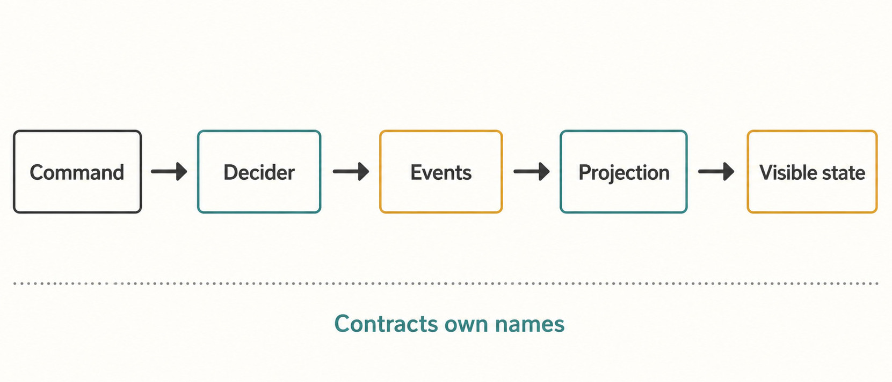
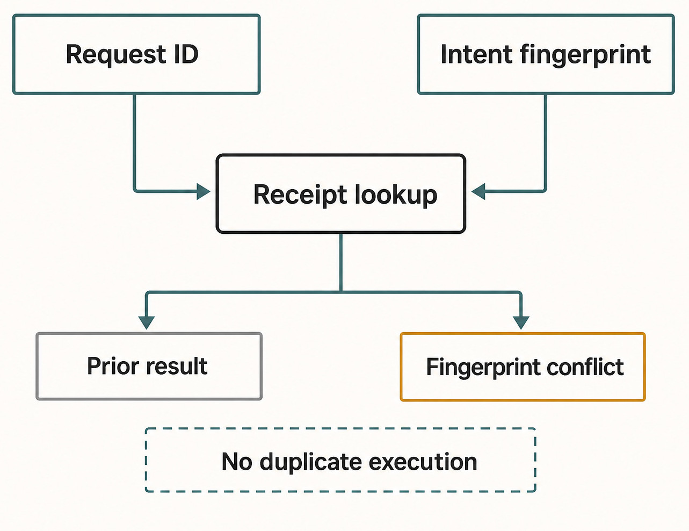

# Appendix D — Command and Event Index {#appendix-d}

This appendix is a human-readable, edition-pinned index derived from exported contracts. It is not
a dispatch registry, event registry, or compatibility layer. Exact decoding, admission, emission,
replay, and projection remain with the contracts and Product Orchestration owners named above.

The core flow is:

> **Command → decision → durable Product event → projection → visible outcome**

Reactors may observe a committed event and request a bounded follow-up effect. Native Engine events
enter through the adapter and Engine service; they are not automatically durable Product events.
External MCP notifications may supply integration evidence, but they do not write Product state.

_Figure D.1 — Product commands and native runtime events meet only at explicit ingestion and decision boundaries._

**Accessible equivalent.** Command leads to Decider, Events, Projection, and Visible state. Contracts own names constrains the sequence.

## Public Product Orchestration commands

The list below is derived from `ClientOrchestrationCommand` and its dispatchable counterpart.
Commands are grouped only for reading. Group names have no runtime meaning. A decoded command can
still be rejected by the decider, permission policy, lifecycle precondition, or idempotency check.

| Family                       | Exact public command types                                                                                                                              | Intended visible outcome after acceptance                                                                                                                                                         |
| ---------------------------- | ------------------------------------------------------------------------------------------------------------------------------------------------------- | ------------------------------------------------------------------------------------------------------------------------------------------------------------------------------------------------- |
| Space organization           | `space.create` `space.meta.update` `space.reorder` `space.delete`                                                                              | Space navigation is created, renamed/re-iconed, reordered, or removed through the shell projection.                                                                                               |
| Project lifecycle            | `project.create` `project.meta.update` `project.delete`                                                                                           | Project identity and workspace metadata appear, change, or disappear from Product state. Local directory effects remain bounded by HostGateway.                                                   |
| Thread identity and lineage  | `thread.create` `thread.handoff.create` `thread.fork.create` `thread.delete` `thread.archive` `thread.unarchive` `thread.meta.update` | A distinct Product Thread is created, related, updated, archived/unarchived, or removed. Fork and handoff import only explicit Product context; they do not copy a native Engine Session.         |
| Pinned messages              | `thread.pinned-message.add` `thread.pinned-message.remove` `thread.pinned-message.done.set` `thread.pinned-message.label.set`                  | The Thread checklist projection changes while the underlying message remains part of Product history.                                                                                             |
| Thread markers               | `thread.marker.add` `thread.marker.remove` `thread.marker.done.set` `thread.marker.label.set`                                                  | A bounded text marker is added, removed, marked done, or labeled in Thread metadata.                                                                                                              |
| Execution settings           | `thread.runtime-mode.set` `thread.interaction-mode.set`                                                                                              | The Product Thread's requested runtime or interaction mode changes after capability admission. The mode name does not grant HostGateway authority.                                                |
| Turn and task control        | `thread.turn.start` `thread.turn.interrupt` `thread.task.stop` `thread.task.background`                                                        | Work is admitted/queued or an active Engine operation is asked to interrupt, stop, or move to background. A request event is not itself proof that the native effect finished.                    |
| Interaction settlement       | `thread.approval.respond` `thread.user-input.respond`                                                                                                | A pending approval or structured user-input request receives one identity-bound response and later resolves through receipts/projection.                                                          |
| Recovery and editing         | `thread.checkpoint.revert` `thread.message.edit-and-resend`                                                                                          | Haros requests a bounded file checkpoint revert or creates a revised message/Turn path. Product history is changed only through emitted facts; private Session state is not rewound by assertion. |
| Activity and Session control | `thread.activity.append` `thread.session.stop`                                                                                                       | A bounded activity is recorded or the current execution Session is asked to stop while the Product Thread remains durable.                                                                        |

Server-only coordination commands such as `thread.session.set`, `thread.goal.continue`, assistant
delta/complete commands, import/bootstrap completion, queued-Turn dispatch, and revert completion are
intentionally not labeled public. They belong to `InternalOrchestrationCommand` and let reactors or
Engine ingestion request ordinary decisions without giving clients a second write path.

## Durable Product event types

These event types come from `OrchestrationEventType` and the matching `OrchestrationEvent` union.
Each event carries sequence, aggregate, occurrence, command, causation, correlation, and bounded
metadata fields. Projections reduce them; UI components do not rewrite them.

| Event family                    | Exact event types                                                                                                                                                                                                                                      | Product fact and visible use                                                                                                                                                                                                       |
| ------------------------------- | ------------------------------------------------------------------------------------------------------------------------------------------------------------------------------------------------------------------------------------------------------ | ---------------------------------------------------------------------------------------------------------------------------------------------------------------------------------------------------------------------------------- |
| Space                           | `space.created` `space.meta-updated` `space.order-updated` `space.deleted`                                                                                                                                                                    | Rebuilds Space identity, order, and shell navigation.                                                                                                                                                                              |
| Project                         | `project.created` `project.meta-updated` `project.deleted`                                                                                                                                                                                       | Rebuilds Project shells and workspace-facing metadata.                                                                                                                                                                             |
| Thread identity                 | `thread.created` `thread.deleted` `thread.archived` `thread.unarchived` `thread.meta-updated`                                                                                                                                              | Rebuilds durable Thread identity, lineage, organization, settings, and visibility. The contract retains archived/unarchived event literals for legacy persisted rows; their presence does not require a new producer to emit them. |
| Pinned messages and markers     | `thread.pinned-message-added` `thread.pinned-message-removed` `thread.pinned-message-done-set` `thread.pinned-message-label-set` `thread.marker-added` `thread.marker-removed` `thread.marker-done-set` `thread.marker-label-set` | Rebuilds bounded Thread annotations without turning UI state into a separate owner.                                                                                                                                                |
| Modes and message admission     | `thread.runtime-mode-set` `thread.interaction-mode-set` `thread.message-sent` `thread.turn-queued` `thread.turn-start-requested` `thread.goal-continuation-requested`                                                                   | Records requested settings, admitted user content, Queue state, and the decision to request execution.                                                                                                                             |
| Active control requests         | `thread.turn-interrupt-requested` `thread.task-stop-requested` `thread.task-background-requested` `thread.session-stop-requested`                                                                                                             | Preserves that Haros requested a bounded native effect. Later Engine evidence is needed to show settlement.                                                                                                                        |
| Interaction requests            | `thread.approval-response-requested` `thread.user-input-response-requested`                                                                                                                                                                         | Preserves the identity-bound attempt to settle an outstanding interaction.                                                                                                                                                         |
| Recovery                        | `thread.checkpoint-revert-requested` `thread.reverted` `thread.conversation-rollback-requested` `thread.conversation-rolled-back` `thread.message-edit-resend-requested`                                                                   | Separates request from completion so failures preserve enough state for retry, reconciliation, or an honest unavailable result.                                                                                                    |
| Session, plans, diffs, activity | `thread.session-set` `thread.proposed-plan-upserted` `thread.turn-diff-completed` `thread.activity-appended`                                                                                                                                  | Updates the execution projection, plan record, completed checkpoint/diff evidence, or Timeline activity. None transfers private native Session ownership to Product state.                                                         |

Not every accepted command emits an event with the same suffix, and one command may produce more
than one event. For example, Turn admission can preserve a user message and then record queued or
start-requested work. Consumers must follow the event contract and sequence, not construct event
names by string replacement.

## Normalized native Engine events

`packages/contracts/src/engineRuntime.ts` defines the common event vocabulary adapters stream into
Haros. These events describe execution. The Engine service and orchestration boundary decide which
facts become durable Product commands/events and which remain diagnostic or transient progress.

| Runtime family                        | Exact normalized event types                                                                                                                                                                                                                                 | Product treatment                                                                                                                                                       |
| ------------------------------------- | ------------------------------------------------------------------------------------------------------------------------------------------------------------------------------------------------------------------------------------------------------------ | ----------------------------------------------------------------------------------------------------------------------------------------------------------------------- |
| Session                               | `session.started` `session.configured` `session.state.changed` `session.exited`                                                                                                                                                                     | Update adapter/Session evidence; Product Thread durability does not depend on native Session survival.                                                                  |
| Thread and realtime                   | `thread.started` `thread.state.changed` `thread.metadata.updated` `thread.token-usage.updated` `thread.realtime.started` `thread.realtime.item-added` `thread.realtime.audio.delta` `thread.realtime.error` `thread.realtime.closed` | Supply normalized native Thread, usage, and realtime evidence. They must not overwrite Product Thread identity.                                                         |
| Turn                                  | `turn.started` `turn.completed` `turn.aborted` `turn.tasks.updated` `turn.proposed.delta` `turn.proposed.completed` `turn.diff.updated` `turn.steered`                                                                                  | Drive bounded progress, proposal, diff, steering, and settlement ingestion for the active admitted Turn.                                                                |
| Items and content                     | `item.started` `item.updated` `item.completed` `content.delta`                                                                                                                                                                                      | Feed visible progress and assistant/tool content through ordered ingestion; a delta alone is not a completed Product message.                                           |
| Approval and user input               | `request.opened` `request.resolved` `user-input.requested` `user-input.resolved`                                                                                                                                                                    | Create or reconcile pending interactions. HostGateway and Product interaction receipts remain authoritative for local permission settlement.                            |
| Tasks, hooks, and tools               | `task.started` `task.progress` `task.updated` `task.completed` `hook.started` `hook.progress` `hook.completed` `tool.progress` `tool.summary`                                                                                        | Provide structured progress and summaries without independently settling the Product Turn.                                                                              |
| Account, MCP, and routing             | `auth.status` `account.updated` `account.rate-limits.updated` `mcp.status.updated` `mcp.oauth.completed` `model.rerouted`                                                                                                                     | Supply Engine-side account, connection, and routing evidence. An Engine-native MCP event is not an external MCP Product-state grant.                                    |
| Configuration, files, VCS, and errors | `config.warning` `deprecation.notice` `files.persisted` `vcs.state.changed` `runtime.warning` `runtime.error` `event.unmapped`                                                                                                             | Preserve bounded diagnostics or request explicit product/local follow-up. File and Git authority stays behind HostGateway, and unmapped input remains visibly unmapped. |

_Figure D.2 — Recovery uses command identity, receipts, and ordered events instead of guessing from a disconnected UI state._

**Accessible equivalent.** Request ID and Intent fingerprint converge on Receipt lookup, which branches to Prior result or Fingerprint conflict. No duplicate execution constrains the lookup.

## Orchestration transport index

The transport exposes queries, dispatch, repair/reconciliation operations, and subscriptions. The
constant is the owner of these wire names; this table merely groups them.

| Transport role                 | Exact method or channel names                                                                                                                                                                                                                                                               | What consumers receive                                                                                                                                 |
| ------------------------------ | ------------------------------------------------------------------------------------------------------------------------------------------------------------------------------------------------------------------------------------------------------------------------------------------- | ------------------------------------------------------------------------------------------------------------------------------------------------------ |
| Snapshot queries               | `orchestration.getSnapshot` `orchestration.getShellSnapshot` `orchestration.getThreadDetailSnapshot`                                                                                                                                                                                  | A current full, shell, or Thread-detail projection with a sequence boundary.                                                                           |
| Command and bounded operations | `orchestration.dispatchCommand` `orchestration.importThread` `orchestration.repairState` `orchestration.getTurnDiff` `orchestration.getFullThreadDiff` `orchestration.replayEvents` `orchestration.listEngineDeliveryBlockers` `orchestration.reconcileEngineDelivery` | A receipt, requested bounded operation, diff, replay window, or delivery-reconciliation result. These methods do not make the transport a state owner. |
| Subscriptions                  | `orchestration.subscribeShell` `orchestration.unsubscribeShell` `orchestration.subscribeThread` `orchestration.unsubscribeThread`                                                                                                                                                  | Bounded live projection streams; clients recover a gap from a fresh snapshot rather than inventing missing events.                                     |
| Channels                       | `orchestration.domainEvent` `orchestration.shellEvent` `orchestration.threadEvent`                                                                                                                                                                                                    | Durable domain events or shell/detail projection stream items, each with its own schema and consumer boundary.                                         |

## Failure, security, and update rule

If a command times out, first read its receipt by identity and fingerprint, then replay or refresh
the relevant projection. If an Engine event stream disconnects, preserve the Product Thread and
active Turn evidence and reconcile through the adapter owner. Do not replay a local or destructive
effect merely because the UI missed an update.

Commands cannot smuggle local authority around HostGateway. Engine adapters cannot grant
themselves file, Git, terminal, browser, device, timeout, cancellation, or receipt ownership.
External MCP connections remain admitted tool/resource integrations, not Product command emitters
or event-store owners. Diagnostics and payloads must stay sanitized: no credentials, raw private
Engine state, or unnecessary local paths belong in events or screenshots.

To update this appendix, derive public commands from the exported client command union, durable
events from `OrchestrationEventType` plus its matching union, native events from the runtime event
contract, and wire names from `ORCHESTRATION_WS_METHODS` and `ORCHESTRATION_WS_CHANNELS`. Compare
the extracted sets with the grouped rows and focused contract tests. Never make a runtime decision
by parsing this Markdown.

## Source trail

`packages/contracts/src/orchestration.ts` owns the Product command/event and transport vocabulary.
The decider, command bus, event store, reactors, and projections own behavior and visible outcomes.
`packages/contracts/src/engineRuntime.ts` owns the normalized native event vocabulary, while the
Engine service owns ingestion. HostGateway remains the local capability authority. This appendix
is accurate only for the edition commit in its front matter and deliberately creates no second
registry.

<!-- guide-navigation:start -->

[Guidebook contents](../README.md) · [Previous: Appendix C — Engine Capability Matrix](appendix-c-engine-capability-matrix.md) · [Next: Appendix E — Source Map](appendix-e-source-map.md)

<!-- guide-navigation:end -->
