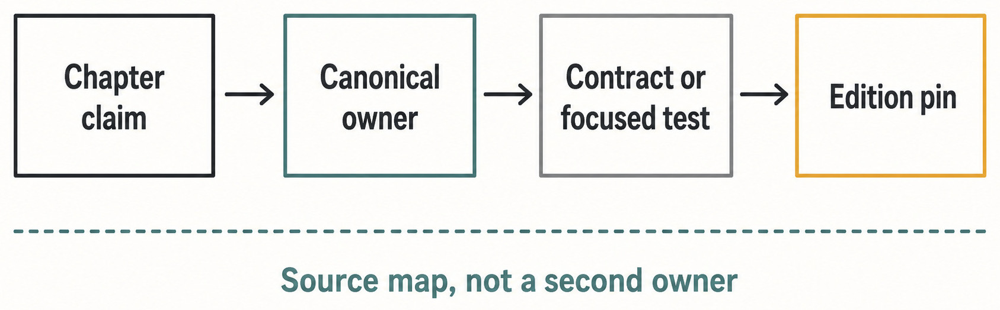

# Appendix E — Source Map {#appendix-e}

This appendix answers one maintenance question: **where should a reader verify a Guidebook claim
before changing it?** It is a route into canonical owners and focused evidence, not a substitute
for those owners. A path listed here may move as the repository evolves. The contract, descriptor, service, or adoption record at that path remains the owner to inspect. A
focused test corroborates or disproves a claim; it does not own the fact.

_Figure E.1 — A Guidebook claim remains useful only while it can be traced to an owner, evidence, and the pinned edition._

**Accessible equivalent.** Chapter claim leads to Canonical owner, Contract or focused test, and Edition pin. Source map, not a second owner constrains the route.

## Chapter-to-owner routes

The table groups chapters by the source boundary that carries most of their changing facts. It is
deliberately coarse. Each chapter front matter contains the exact files used for that chapter, and
its Source trail explains how those files constrain the prose.

| Chapter | Principal claim                                                | Canonical owner path                                                  | Focused proof path                                                                    | Claim boundary                                                                           |
| ------: | -------------------------------------------------------------- | --------------------------------------------------------------------- | ------------------------------------------------------------------------------------- | ---------------------------------------------------------------------------------------- |
|       1 | Why an AI Workbench, Not Another Chat Box                      | `README.md`                                                           | `scripts/check-public-identity.mjs`                                                   | Product identity is public copy, not an internal package identity.                       |
|       2 | Haros in One Sentence                                          | `docs/architecture.md`                                                | `scripts/check-public-identity.mjs`                                                   | The owner defines behavior; the test can disprove the edition claim but does not own it. |
|       3 | Agent, Chat, and Studio                                        | `packages/shared/src/productSurface.ts`                               | `packages/shared/src/productSurface.test.ts`                                          | The owner defines behavior; the test can disprove the edition claim but does not own it. |
|       4 | Your First Complete Task                                       | `apps/server/src/orchestration/decider.ts`                            | `apps/server/src/orchestration/Layers/OrchestrationEngine.integration.test.ts`        | The owner defines behavior; the test can disprove the edition claim but does not own it. |
|       5 | The Vocabulary of Haros                                        | `packages/contracts/src/orchestration.ts`                             | `packages/contracts/src/orchestration.test.ts`                                        | The owner defines behavior; the test can disprove the edition claim but does not own it. |
|       6 | Local-First, Explained Precisely                               | `apps/server/src/hostGateway/mcpInjection.ts`                         | `apps/server/src/hostGateway/mcpInjection.test.ts`                                    | Local-first still routes authorized local effects through HostGateway.                   |
|       7 | First-Run Setup                                                | `apps/web/src/components/onboarding/firstRunReadiness.logic.ts`       | `apps/web/src/components/onboarding/firstRunReadiness.logic.test.ts`                  | The owner defines behavior; the test can disprove the edition claim but does not own it. |
|       8 | Projects and Managed Workspaces                                | `packages/shared/src/productSurface.ts`                               | `packages/shared/src/productSurface.test.ts`                                          | The owner defines behavior; the test can disprove the edition claim but does not own it. |
|       9 | Threads, Turns, Messages, and Sessions                         | `packages/contracts/src/orchestration.ts`                             | `packages/contracts/src/orchestration.test.ts`                                        | Product Thread and native Engine Session remain separate facts.                          |
|      10 | The Composer as a Control Surface                              | `apps/web/src/composerSlashCommands.ts`                               | `apps/web/src/composerSlashCommands.test.ts`                                          | The owner defines behavior; the test can disprove the edition claim but does not own it. |
|      11 | Engines, Models, and Options                                   | `packages/shared/src/engineMetadata.ts`                               | `apps/server/src/engine/Layers/EngineDiscoveryService.integration.test.ts`            | ENGINE_DESCRIPTORS owns Engine identity and Settings discovery.                          |
|      12 | Permissions and Runtime Modes                                  | `apps/server/src/hostGateway/Layers/HostGateway.ts`                   | `apps/server/src/orchestration/decider.runtimeMode.test.ts`                           | The owner defines behavior; the test can disprove the edition claim but does not own it. |
|      13 | "Interaction Modes: Default, Plan, Debug, Converge, and Learn" | `apps/server/src/engine/interactionMode.ts`                           | `apps/server/src/engine/interactionMode.test.ts`                                      | The owner defines behavior; the test can disprove the edition claim but does not own it. |
|      14 | Queue, Steer, Interrupt                                        | `apps/server/src/persistence/Layers/QueuedTurnPromotions.ts`          | `apps/server/src/persistence/Layers/QueuedTurnPromotions.integration.test.ts`         | The owner defines behavior; the test can disprove the edition claim but does not own it. |
|      15 | Timeline, Activity, and Model Provenance                       | `packages/contracts/src/orchestration.ts`                             | `apps/server/src/orchestration/projector.test.ts`                                     | Contracts, admission, and projection own the facts; `workLog.ts` only presents them.     |
|      16 | Groups Without Moving Projects                                 | `apps/server/src/orchestration/decider.ts`                            | `apps/server/src/orchestration/conversationGroups.test.ts`                            | The owner defines behavior; the test can disprove the edition claim but does not own it. |
|      17 | Notes, Pinned Messages, and Markers                            | `packages/shared/src/pinnedMessages.ts`                               | `apps/server/src/orchestration/Layers/pinnedMessagesRoundTrip.integration.test.ts`    | The owner defines behavior; the test can disprove the edition claim but does not own it. |
|      18 | Goals and Goal Achievement                                     | `apps/server/src/orchestration/decider.ts`                            | `apps/server/src/orchestration/decider.goalTiming.test.ts`                            | The owner defines behavior; the test can disprove the edition claim but does not own it. |
|      19 | Plans and Implementation Threads                               | `apps/server/src/persistence/Layers/ProjectionThreadProposedPlans.ts` | `apps/web/src/proposedPlan.test.ts`                                                   | The owner defines behavior; the test can disprove the edition claim but does not own it. |
|      20 | Attachments, Mentions, Skills, and References                  | `apps/server/src/persistence/Layers/ManagedAttachments.ts`            | `apps/server/src/persistence/Layers/ManagedAttachments.integration.test.ts`           | The owner defines behavior; the test can disprove the edition claim but does not own it. |
|      21 | Images and Voice                                               | `apps/server/src/persistence/Layers/ManagedAttachments.ts`            | `apps/server/src/persistence/Layers/ManagedAttachments.integration.test.ts`           | Attachment evidence does not make generated media a product capture.                     |
|      22 | Sidechats, Subagents, and Thread Hierarchy                     | `apps/server/src/orchestration/decider.ts`                            | `packages/shared/src/subagents.test.ts`                                               | The owner defines behavior; the test can disprove the edition claim but does not own it. |
|      23 | Forks and History Boundaries                                   | `apps/server/src/orchestration/decider.ts`                            | `apps/server/src/orchestration/decider.forkScope.test.ts`                             | The owner defines behavior; the test can disprove the edition claim but does not own it. |
|      24 | Handoffs, Branches, and Worktrees                              | `apps/server/src/orchestration/handoff.ts`                            | `apps/server/src/orchestration/handoff.test.ts`                                       | The owner defines behavior; the test can disprove the edition claim but does not own it. |
|      25 | Files, Search, Preview, and Editors                            | `apps/server/src/workspace/Layers/WorkspaceFileSystem.ts`             | `apps/server/src/workspace/Layers/WorkspaceFileSystem.integration.test.ts`            | The owner defines behavior; the test can disprove the edition claim but does not own it. |
|      26 | The Integrated Terminal                                        | `apps/server/src/terminal/Layers/Manager.ts`                          | `apps/server/src/terminal/Layers/Manager.integration.test.ts`                         | The owner defines behavior; the test can disprove the edition claim but does not own it. |
|      27 | Git Status, Branches, and Checkpoints                          | `apps/server/src/git/Layers/GitManager.ts`                            | `apps/server/src/git/Layers/GitManager.integration.test.ts`                           | The owner defines behavior; the test can disprove the edition claim but does not own it. |
|      28 | Diffs, Rollback, and Edit-and-Resend                           | `packages/shared/src/conversationEdit.ts`                             | `packages/shared/src/conversationEdit.test.ts`                                        | The owner defines behavior; the test can disprove the edition claim but does not own it. |
|      29 | Pull Requests                                                  | `apps/server/src/git/Services/GitHubCli.ts`                           | `apps/server/src/git/Layers/GitHubCli.test.ts`                                        | The owner defines behavior; the test can disprove the edition claim but does not own it. |
|      30 | Browser Workflows and Web Access                               | `apps/server/src/browserAutomation/Layers/BrowserAutomationHost.ts`   | `apps/server/src/browserAutomation/Layers/BrowserAutomationHost.test.ts`              | The owner defines behavior; the test can disprove the edition claim but does not own it. |
|      31 | Device Workflows                                               | `apps/server/src/device/Layers/DeviceService.ts`                      | `apps/server/integration/device.integration.test.ts`                                  | The owner defines behavior; the test can disprove the edition claim but does not own it. |
|      32 | Project Actions and Dev Servers                                | `apps/server/src/devServerManager.ts`                                 | `apps/server/src/devServerManager.test.ts`                                            | The owner defines behavior; the test can disprove the edition claim but does not own it. |
|      33 | Studio Outputs                                                 | `apps/server/src/studioOutputs.ts`                                    | `apps/server/src/studioOutputs.integration.test.ts`                                   | The owner defines behavior; the test can disprove the edition claim but does not own it. |
|      34 | Automations                                                    | `apps/server/src/automation/Layers/AutomationService.ts`              | `apps/server/src/automation/Layers/AutomationService.integration.test.ts`             | The owner defines behavior; the test can disprove the edition claim but does not own it. |
|      35 | Desktop, Web, and Server                                       | `apps/server/src/effectServer.ts`                                     | `apps/server/src/main.integration.test.ts`                                            | The owner defines behavior; the test can disprove the edition claim but does not own it. |
|      36 | Typed Contracts and Narrow Projections                         | `packages/contracts/src/server.ts`                                    | `packages/contracts/src/server.test.ts`                                               | The owner defines behavior; the test can disprove the edition claim but does not own it. |
|      37 | Product Orchestration                                          | `apps/server/src/orchestration/Layers/OrchestrationEngine.ts`         | `apps/server/src/orchestration/Layers/OrchestrationEngine.integration.test.ts`        | Events and projections do not create a second writable store.                            |
|      38 | Persistence and Read Models                                    | `apps/server/src/persistence/Layers/OrchestrationEventStore.ts`       | `apps/server/src/persistence/Layers/OrchestrationEventStore.integration.test.ts`      | The owner defines behavior; the test can disprove the edition claim but does not own it. |
|      39 | Engine Identity, Discovery, and Adapters                       | `apps/server/src/engine/Layers/EngineAdapterRegistry.ts`              | `apps/server/src/engine/engineAdapterConformance.test.ts`                             | Registry and conformance evidence do not create a parallel Engine list.                  |
|      40 | Product Threads vs Native Engine Sessions                      | `apps/server/src/orchestration/turnStartSession.ts`                   | `apps/server/src/orchestration/turnStartSession.test.ts`                              | The owner defines behavior; the test can disprove the edition claim but does not own it. |
|      41 | HostGateway and Exact-Turn Authority                           | `apps/server/src/hostGateway/Layers/HostGateway.ts`                   | `apps/server/src/hostGateway/Layers/HostGateway.integration.test.ts`                  | Engine adapters do not duplicate local authority.                                        |
|      42 | Streaming, Synchronization, and Backpressure                   | `apps/server/src/wsStreamBackpressure.ts`                             | `apps/server/src/wsStreamBackpressure.test.ts`                                        | The owner defines behavior; the test can disprove the edition claim but does not own it. |
|      43 | Startup and Admission                                          | `apps/server/src/serverRuntimeStartup.ts`                             | `apps/server/src/serverRuntimeStartup.test.ts`                                        | The owner defines behavior; the test can disprove the edition claim but does not own it. |
|      44 | Failure, Cancellation, Timeout, and Idempotency                | `apps/server/src/persistence/Layers/OrchestrationCommandReceipts.ts`  | `apps/server/src/persistence/Layers/OrchestrationCommandReceipts.integration.test.ts` | The owner defines behavior; the test can disprove the edition claim but does not own it. |
|      45 | Restart, Quit, and Recovery                                    | `apps/server/src/orchestration/startupTurnReconciliation.ts`          | `apps/server/src/orchestration/startupTurnReconciliation.test.ts`                     | The owner defines behavior; the test can disprove the edition claim but does not own it. |
|      46 | Secrets, Trust, and Local Boundaries                           | `apps/server/src/auth/Layers/ServerSecretStore.ts`                    | `apps/server/src/auth/Layers/ServerSecretStore.test.ts`                               | Secret bytes stay with server-side owners; projections are credential-blind.             |
|      47 | Diagnostics, Usage, Retention, and Maintenance                 | `apps/server/src/diagnostics/Layers/ThreadDiagnosticsQuery.ts`        | `apps/server/src/diagnostics/Layers/ThreadDiagnosticsQuery.integration.test.ts`       | The four exact subdomain routes below prevent diagnostics from standing in for all four. |
|      48 | External Connections and MCP                                   | `apps/server/src/externalMcp/Layers/ExternalMcpGateway.ts`            | `apps/server/src/externalMcp/Layers/ExternalMcpGateway.e2e.integration.test.ts`       | External MCP is admitted integration, not Product-state ownership.                       |
|      49 | Adding an Engine Without Adding a Second Truth                 | `packages/shared/src/engineMetadata.ts`                               | `apps/server/src/engine/Layers/EngineAdapterRegistry.test.ts`                         | An Engine addition follows descriptor, adapter, projection, Settings, and focused proof. |
|      50 | Contributing, Proving, Packaging, and Shipping                 | `scripts/build-desktop-artifact.ts`                                   | `scripts/build-desktop-artifact.test.ts`                                              | Packaged proof is not signing, publication, or release.                                  |

### Chapter 15 owner set and presentation consumer

- Contract owner: `packages/contracts/src/orchestration.ts`; focused proof:
  `packages/contracts/src/orchestration.test.ts`.
- Admission owner: `apps/server/src/orchestration/decider.ts`; focused proof:
  `apps/server/src/orchestration/decider.projectScripts.test.ts`.
- Durable projection owner: `apps/server/src/orchestration/projector.ts`; focused proof:
  `apps/server/src/orchestration/projector.test.ts`.
- Read-only presentation consumer: `apps/web/src/workLog.ts`; consumer proof:
  `apps/web/src/workLog.test.ts`. Its source explicitly says it is a presentation projection,
  never a second event model, so it cannot be listed as the canonical owner.

### Chapter 47 four-subdomain routes

- Diagnostics owner: `apps/server/src/diagnostics/Layers/ThreadDiagnosticsQuery.ts`; proof:
  `apps/server/src/diagnostics/Layers/ThreadDiagnosticsQuery.integration.test.ts`.
- Usage, profile, and archive owners: `apps/server/src/engineUsage/registry.ts`,
  `apps/server/src/usageHistory/UsageHistory.ts`, `apps/server/src/profileStats.ts`, and
  `apps/server/src/profileStatsArchive.ts`; proofs: `apps/server/src/engineUsage/registry.test.ts`,
  `apps/server/src/usageHistory/UsageHistory.integration.test.ts`,
  `apps/server/src/profileStats.integration.test.ts`, and
  `apps/server/src/profileStatsArchive.integration.test.ts`.
- Retention owner: `apps/server/src/threadRetention.ts`; proofs:
  `apps/server/src/threadRetention.test.ts` and
  `apps/server/src/managedWorktrees.integration.test.ts`.
- Engine-maintenance owners: `apps/server/src/engine/engineMaintenance.ts` and
  `apps/server/src/engine/engineMaintenanceCommandCoordinator.ts`; proof:
  `apps/server/src/engine/engineMaintenance.integration.test.ts`.

## How to follow a source anchor

| If the claim is about…                                                        | Start with…                                        | Then inspect…                                                                                             | Stop and reassess when…                                                                              |
| ----------------------------------------------------------------------------- | -------------------------------------------------- | --------------------------------------------------------------------------------------------------------- | ---------------------------------------------------------------------------------------------------- |
| A public state, command, event, or transport name                             | `packages/contracts`                               | The decider, event store, projection, reactor, and focused contract tests                                 | A second list is being introduced only to feed documentation or UI.                                  |
| Engine identity, display, usage metadata, or Settings discovery               | `packages/shared/src/engineMetadata.ts`            | Execution structure, adapter registry, adapter conformance, and consumer projections                      | A consumer begins registering Engines independently of `ENGINE_DESCRIPTORS`.                         |
| Native runtime progress or private Session behavior                           | `packages/contracts/src/engineRuntime.ts`          | The selected adapter and Engine ingestion service                                                         | Product history is being inferred from a native Session identifier alone.                            |
| A local file, Git, terminal, browser, device, permission, timeout, or receipt | `apps/server/src/hostGateway`                      | Exact tool implementation, policy, operation repository, and failure tests                                | An Engine adapter or external MCP integration starts duplicating local authority.                    |
| External MCP access                                                           | `apps/server/src/externalMcp`                      | Credential verification, scope/project admission, audit completion, and bounded wait behavior             | The integration can write Product state directly or claims ownership of a native Session.            |
| Adopted source or shipped third-party bytes                                   | `source-adoptions.json`                            | `docs/source-intake.md`, exact retained legal text, build inputs, and focused lifecycle proof             | Source presence is being used to imply shipped bytes, runtime registration, or product presentation. |
| Packaging or release status                                                   | The build workflow and retained candidate evidence | Signing, notarization, publication, provenance, and updater/channel authorities, if separately authorized | An unsigned build or passing packaged smoke test is called a release.                                |

## Update procedure

Start from the chapter or appendix front matter, open every named anchor, and verify the claim
against the pinned commit. Prefer a focused test that can disprove the sentence. If an intentional product change is required, update the canonical owner and its tests first, then
update the Guidebook projection. If only the book is stale, correct the book against the unchanged
owner. Do not modify product behavior merely to preserve old prose, and do not hide a genuine owner
conflict by weakening the explanation.

The source map contains paths but no credentials, endpoints, raw service responses, private Engine
state, or user data. A path to a credential owner explains the boundary; it is not permission to
read a real credential. Source adoption is similar: the machine-readable adoption record may name
an external origin and pinned revision, while private purchase or account material stays outside
the repository.

## Source trail

The Product and architecture starting points are `README.md` and `docs/architecture.md`.
Orchestration, native Engine, automation, and server projections begin in `packages/contracts`.
Engine identity begins only in `packages/shared/src/engineMetadata.ts`. Local capabilities begin in
HostGateway. External MCP has its own admission boundary. External-source facts begin in
`source-adoptions.json`, whose update procedure is defined by `docs/source-intake.md`. The chapter
front matter narrows these routes to the exact evidence used by each claim.

<!-- guide-navigation:start -->

[Guidebook contents](../README.md) · [Previous: Appendix D — Command and Event Index](appendix-d-command-and-event-index.md) · [Next: Appendix F — Failure Playbook](appendix-f-failure-playbook.md)

<!-- guide-navigation:end -->
