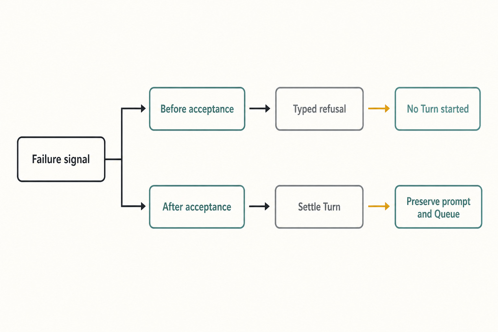
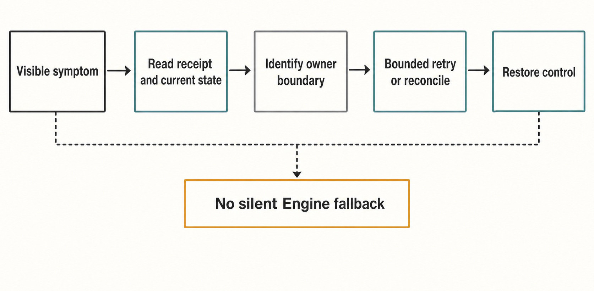

# Appendix F — Failure Playbook {#appendix-f}

Use this appendix when the symptom is visible but the failing owner is not. The safe order is:
preserve the user's work, identify whether failure happened before or after durable Product command
acceptance, read the receipt and current owned state, then perform one bounded recovery action.
Never treat “try again”
as permission to repeat an effect whose outcome is uncertain.

_Figure F.1 — Acceptance determines whether Haros refuses new work or must settle already admitted work._

**Accessible equivalent.** Failure signal branches to Before acceptance then Typed refusal and No
Turn started, meaning no Product Turn was durably accepted. After acceptance, the other branch
settles the Turn and preserves prompt, binding, Queue, and Product-history facts; it does not promise
that the Turn remains queued or that execution succeeds.

## Symptom-to-owner lookup

| Visible symptom                                 | Likely boundary to inspect first                                      | Safe evidence                                                                                    | Bounded recovery                                                                                                                    | Do not infer or do                                                                             |
| ----------------------------------------------- | --------------------------------------------------------------------- | ------------------------------------------------------------------------------------------------ | ----------------------------------------------------------------------------------------------------------------------------------- | ---------------------------------------------------------------------------------------------- |
| A submitted request never becomes a Turn        | Admission, command fingerprint, or startup readiness                  | Typed refusal, command receipt, current Product Thread snapshot, startup access result           | Correct the rejected input or prerequisite, then retry under that command's idempotency contract or create an explicitly new intent | Do not insert a Turn directly or assume the Engine saw the request.                            |
| A queued Turn does not start                    | Queue projection, active-Turn settlement, or Engine readiness         | Queue entry, active Turn state, reactor decision, Engine discovery/health evidence               | Settle or reconcile the exact blocking Turn; let the ordinary Queue owner dispatch the next item                                    | Do not reorder durable work from a diagnostic panel or silently select another Engine.         |
| Streaming stops mid-answer                      | Engine event ingestion, transport, or active Turn lifecycle           | Last accepted sequence, native runtime event, current Product Turn state, sanitized diagnostic   | Reconnect for evidence, then interrupt, reconcile, or retry according to the exact Turn state                                       | Do not treat the last token delta as a completed message.                                      |
| A permission or user-input card remains pending | Interaction identity and settlement receipt                           | Pending request ID, active generation, answer/decline/cancel receipt                             | Submit exactly one identity-bound response or reconcile the already settled result                                                  | Do not auto-answer, reuse an answer for another request, or bypass HostGateway.                |
| A local tool timed out or disconnected          | HostGateway request registry and operation receipt                    | Exact request ID, intent fingerprint, accepted/running/settled state, sanitized tool diagnostic  | Query the receipt; cancel or retry only when the owner proves the prior effect did not complete                                     | Do not repeat a destructive command because the UI missed its response.                        |
| A restart shows an interrupted Turn             | Startup reconciliation and Product Turn projection                    | Durable Thread history, Turn state, Queue, checkpoint/diff evidence, native Session availability | Settle the interrupted Turn honestly and restore control; start new Engine execution only through normal admission                  | Do not claim a private native Session survived or reconstruct hidden reasoning.                |
| Engine usage or health is unavailable           | Descriptor-selected usage/health source                               | Freshness, last-good status, typed unavailable reason, Engine diagnostic                         | Preserve the unavailable state, refresh later, or ask the operator to repair the named Engine                                       | Do not change Engine selection or Product state from telemetry alone.                          |
| External MCP create/read/wait fails             | Credential, capability scope, project grant, rate limit, or admission | Sanitized audit entry, connection projection, typed admission result                             | Repair the exact grant or request; retry through the same bounded gateway                                                           | Do not expose credentials, broaden scopes silently, or let the MCP server write Product state. |
| Engine maintenance reports an uncertain result  | Maintenance command coordinator and installed-version evidence        | Command receipt, action state, refreshed bounded version/status evidence                         | Re-read state, then explicitly retry only if the coordinator says the prior action did not settle                                   | Do not call a successful update a Haros release.                                               |
| Packaged behavior differs from source tests     | Packaging inputs, environment, or distribution-only boundary          | Artifact digest, build log, packaged smoke evidence, exact source revision                       | Reproduce in a fresh task-specific environment and fix the owner with the narrowest failing proof                                   | Do not weaken source tests or publish the candidate.                                           |

## Recovery decision sequence

_Figure F.2 — Recovery restores control by following the owner of the uncertain fact._

**Accessible equivalent.** Visible symptom leads through Read receipt and current state, Identify
owner boundary, Bounded retry or reconcile, and Restore control. A retry is allowed only when owner
evidence permits it. Restore control means a visible rejected, failed, interrupted, or unavailable
outcome, not guaranteed success. No silent Engine fallback marks a forbidden path.

| Decision             | Question                                                                                                         | Evidence required before continuing                                         | Safe outcome                                                                             |
| -------------------- | ---------------------------------------------------------------------------------------------------------------- | --------------------------------------------------------------------------- | ---------------------------------------------------------------------------------------- |
| 1. Locate acceptance | Was a command rejected, accepted, running, or settled?                                                           | Typed receipt plus payload fingerprint                                      | Refuse cleanly before acceptance, or preserve the admitted work after it.                |
| 2. Locate ownership  | Is the uncertain fact Product state, native Engine state, local capability state, or external integration state? | Current owner projection and its focused diagnostic                         | Query or repair one owner instead of mutating a neighboring system.                      |
| 3. Locate durability | Which facts survive restart, and which are only live execution evidence?                                         | Product Thread/Turn history, Queue, receipts, and explicit Session evidence | Preserve durable work without inventing private Engine continuity.                       |
| 4. Choose one action | Can the same identity return a prior result, must work be reconciled, or is a new command required?              | Idempotency contract and exact prior outcome                                | Return the prior receipt, reconcile once, or submit a deliberately new command.          |
| 5. Restore control   | Can the user see the final state and choose the next action?                                                     | Settled Turn or typed refusal, refreshed projection, sanitized explanation  | A visible recovered, failed, interrupted, or unavailable state—not an ambiguous spinner. |

## Failure reporting rules

Record the symptom, exact boundary, safe timestamps or sequence numbers, sanitized codes, and the
recovery attempted. Keep credentials, authorization headers, complete endpoints, raw upstream
responses, private Engine state, and unnecessary local paths out of diagnostics, captures, and
shared artifacts. If evidence is unavailable, say so; absence of a diagnostic row is not proof that
the failure did not happen.

Retries stay bounded. Exact command identities and intent fingerprints prevent a caller from
reusing an old receipt for different work. Cancellation and timeout are settlement paths, not
process-wide authority. Silent Engine fallback is forbidden because Product Thread continuity does
not make native Engine Sessions interchangeable.

## Source trail

Product acceptance, Turn states, and events come from the orchestration contract and Engine. The
command-receipt service and persistence layer own receipt storage and fingerprint lookup. Startup
recovery is constrained by startup Turn reconciliation. HostGateway owns
in-flight local operations, startup recovery, and diagnostic sanitization. Engine maintenance and
external MCP each retain a separate coordinator or admission boundary. The focused tests named in
front matter exercise the failure separations summarized here.

<!-- guide-navigation:start -->

[Guidebook contents](../README.md) · [Previous: Appendix E — Source Map](appendix-e-source-map.md) · [Next: Appendix G — Security and Privacy Checklist](appendix-g-security-and-privacy-checklist.md)

<!-- guide-navigation:end -->
