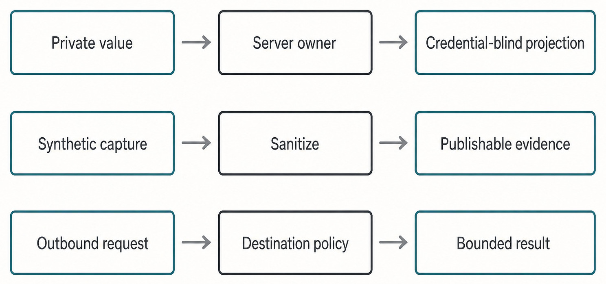

# Appendix G — Security and Privacy Checklist {#appendix-g}

Apply this checklist before accepting a feature, diagnostic, screenshot, source adoption, or
publication artifact. A checked box means the named owner and focused evidence support the claim;
it is not a general assertion that the system is “secure.”

_Figure G.1 — Credentials, evidence, and outbound access cross different gates and remain independently bounded._

**Accessible equivalent.** In this figure, Private value means a credential or secret value: it
passes through Server owner to a credential-blind projection, never secret bytes in the UI.
Synthetic capture passes through Sanitize to Publishable evidence only when it also uses a
production component, fresh reproducible fixture, sidecar, and human raster inspection. Outbound
request passes through the exact service's destination, DNS/address, redirect, header, size,
timeout, and concurrency policy to a bounded result.

## Review checklist

| Area                           | Required check                                                                                                                                                                                                 | Evidence to retain                                                                       | Reject when…                                                                                                                                                                        |
| ------------------------------ | -------------------------------------------------------------------------------------------------------------------------------------------------------------------------------------------------------------- | ---------------------------------------------------------------------------------------- | ----------------------------------------------------------------------------------------------------------------------------------------------------------------------------------- |
| Product and Engine identity    | Haros remains the sole product identity; Engine and Provider are used only in their accurate domains. Product Thread and native Engine Session remain distinct.                                                | Descriptor/contract references and focused owner tests                                   | Copy or code invents a second product brand, calls a Provider an Engine, or promises Session transfer.                                                                              |
| Credentials and settings       | General server secrets stay in `ServerSecretStore`; Engine credentials and HostGateway session/bearer credentials stay in their narrower owners. UI and diagnostics receive only typed credential-blind state. | Projection schema, set/clear receipt, and tests that assert secret fields are absent     | A secret, sensitive header, token, private or credential-bearing endpoint, account identifier, or raw service response reaches logs, UI, screenshots, fixtures, or committed files. |
| Local capabilities             | Files, Git, terminal, browser, device, permissions, cancellation, timeout, idempotency, and receipts pass through HostGateway.                                                                                 | Exact target resolution, policy decision, request identity, receipt, and failure tests   | An Engine adapter, browser surface, or external MCP tool duplicates or bypasses local authority.                                                                                    |
| Paths and targets              | Targets are explicit, resolved, bounded, and tied to an admitted Project/Turn. Tests use task-specific temporary homes and user-data directories.                                                              | Sanitized target class, allowed root, request identity, and cleanup proof                | Code relies on broad roots, unresolved variables, ambient current directories, or real private Engine state.                                                                        |
| Diagnostics and audit          | Evidence is useful but bounded, sanitized at the producer, and honest about freshness or unavailability.                                                                                                       | Safe kind/code, source, time or sequence, retention boundary, and sanitizer test         | The UI is treated as the final redaction layer, or absence of a diagnostic is reported as absence of failure.                                                                       |
| External MCP                   | Credential verification, capability scope, Project grant, rate limit, admission, and audit are independent gates.                                                                                              | Sanitized connection projection, typed admission result, and bounded completion audit    | An external MCP server writes Product state, grants HostGateway authority, or owns native Session continuity.                                                                       |
| Outbound network               | Destination, DNS/address class, redirect, sensitive headers, request/response size, timeout, concurrency, and result shape follow the exact service policy. Local-first does not mean offline-only.            | Policy decision and bounded, sanitized result                                            | A caller can reach arbitrary local/private destinations, forward secrets, or retain an unbounded response.                                                                          |
| Captures and publication media | UI evidence comes only from production components with fresh synthetic state or replay. Generated art never imitates UI.                                                                                       | Capture sidecar, synthetic-state provenance, sanitization verdict, and visual inspection | Real user data, credentials, endpoints, private paths, fake UI, or rejected generation candidates enter the repository.                                                             |
| Source adoption and legal      | External origin, immutable revision, rights, exact paths, differences, digests, retained notices, and update policy are recorded in `source-adoptions.json`.                                                   | Adoption record, required legal text, source/build proof, and focused lifecycle tests    | Private purchase records are copied, rights are assumed, or source presence is confused with shipped/registered/presented behavior.                                                 |
| Packaging and release          | Candidate identity and packaged proof are exact. Signing, notarization, publication, updater feed, and release authority remain separate gates.                                                                | Candidate/artifact digests and gate receipts                                             | An unsigned archive, local build, or passing smoke test is called a release.                                                                                                        |

## How to use the checklist

Begin with the change's real boundary, not the most visible component. A Settings panel that shows
configured state still depends on a credential-blind server projection. A browser tool still
depends on HostGateway target and permission policy. An MCP connection still depends on Haros
admission before a Product task exists. A captured screen is publishable evidence only after its
state is synthetic, its production path is genuine, and the raster has been inspected for private
content.

Redaction is defense in depth, not permission to send secrets to a log and remove them later. Public
security reports follow `SECURITY.md` and omit exploit payloads, credentials, private endpoints,
user data, and unnecessary proof-of-concept detail.

For failures, preserve the user's durable Product work and report what is unknown. Never inspect,
rewrite, migrate, or delete real private Engine state for a test. Never use a security checklist to
justify a broader permission than the admitted command requires. If a required owner or test does
not exist, stop the claim rather than adding a documentation-only promise.

## Source trail

The architecture document defines the top-level owner boundaries. Server contracts define typed
credential-blind projections. `ServerSecretStore` owns general server secrets; Engine credential
and server Settings owners expose credential-blind projections. HostGateway owns only its own
bearer/session credentials plus local target resolution, policy, and diagnostic sanitization.
External MCP owns its credential verification, admission, and audit gates
without owning Product state. `source-adoptions.json` and `docs/source-intake.md` own external-source
provenance and update discipline. Packaging and release claims remain constrained by the explicit
maintainer and distribution gates described in Chapter 50.

<!-- guide-navigation:start -->

[Guidebook contents](../README.md) · [Previous: Appendix F — Failure Playbook](appendix-f-failure-playbook.md) · [Next: Appendix H — Edition Notes](appendix-h-edition-notes.md)

<!-- guide-navigation:end -->
