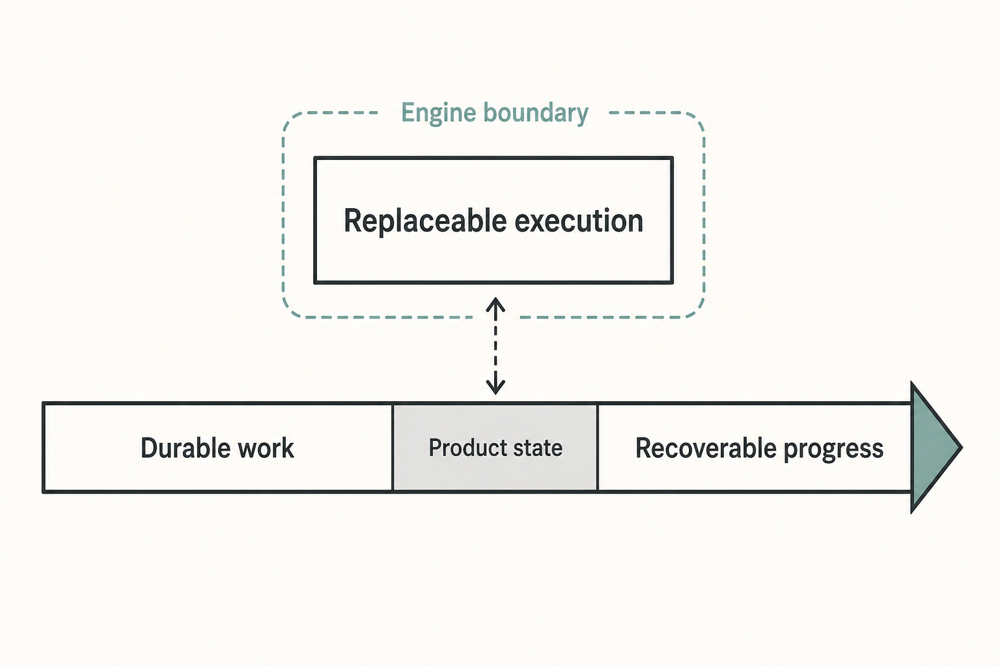

# Appendix H — Edition Notes {#appendix-h}

This source-alpha Guidebook candidate is pinned to Haros commit
`17b578d3c65d72113accc17200b9b290f80139f6` and was last reconciled against that source on
2026-08-31. The date identifies the evidence-review boundary; it is not a release date, support
promise, independent acceptance verdict, or guarantee that later Haros revisions behave the same
way. This surface records what the candidate includes and what it does not claim.

_Figure H.1 — Haros preserves durable work while execution remains replaceable and progress remains recoverable._

**Accessible equivalent.** Replaceable execution sits above a Product-state rail that moves from
Durable work to Recoverable progress through an explicit Product Orchestration and adapter
boundary. The connector carries admitted requests and terminal evidence; it does not copy a native
Session, perform automatic Engine fallback, promise rollback, or guarantee successful completion.

## Edition record

| Edition fact                | Value in this candidate                                                                                      | Boundary                                                                                                                                         |
| --------------------------- | ------------------------------------------------------------------------------------------------------------ | ------------------------------------------------------------------------------------------------------------------------------------------------ |
| Product                     | Haros, a local-first AI workbench                                                                            | Internal package, protocol, and supported runtime identities remain implementation facts, not second product brands.                             |
| Product version             | `0.1.0-alpha.0`                                                                                              | The version is source-alpha identity, not a release or support promise.                                                                          |
| Source pin                  | Git commit `17b578d3c65d72113accc17200b9b290f80139f6`                                                        | Later repository behavior may differ and requires a new source review.                                                                           |
| Verification date           | 2026-08-31                                                                                                   | A date records when evidence was checked; it is not a support or freshness guarantee.                                                            |
| Reading surface             | Preface, Chapters 1–50, and Appendices A–H                                                                   | Appendices are reference surfaces, not Chapters 51–58.                                                                                           |
| Generated explanatory media | 140 canonical publication slots                                                                              | Generated figures explain relationships; they are not UI evidence. The cover uses the unchanged deterministic Haros mark over a generated field. |
| Product captures            | 18 production-component captures with synthetic state or replay                                              | Captures prove only the depicted bounded behavior and contain no real user or private Engine state.                                              |
| Publication formats         | Website pages, one standalone HTML document, PDF, and EPUB from the same Markdown sources                    | These are candidate artifacts. Format success is not signing, publication, or release.                                                           |
| Source tables               | Purposeful Markdown reference/comparison tables counted separately from format-derived table representations | A renderer may produce several format tables from one source table; that does not multiply editorial content.                                    |
| Release status              | Source-alpha Guidebook candidate; no release claim                                                           | No unsigned build, local package, or passing smoke test is called a release.                                                                     |

## What this edition adds

The candidate's Part VII adds diagnostics and maintenance, external MCP boundaries, the canonical method for adding
an Engine, and the proof ladder from source change through packaged candidate. Appendices A–H add
compact vocabulary, lifecycle, Engine capability, command/event, source, failure, security, and
edition references. The cover, Part VII opener, eight Part VII figures, and fourteen appendix
plates close the planned 140-slot generated-visual allocation.

The reference surfaces are derived publication views. The Engine capability matrix comes from
`ENGINE_DESCRIPTORS`, execution structure, adapter evidence, and focused tests. The command/event
index comes from exported contracts. The source map points back to owners. None is a second runtime
registry or writable store.

| Candidate surface         | Evidence it contributes                                     | Claim it cannot establish by itself                                      |
| ------------------------- | ----------------------------------------------------------- | ------------------------------------------------------------------------ |
| Canonical Markdown        | Exact English copy, reading order, source tables, and links | That every rendered format preserved those relationships                 |
| Generated figure raster   | The accepted explanatory labels and bounded visual topology | Product UI behavior, runtime registration, or native Engine state        |
| Synthetic product capture | A production component in one replayable bounded scenario   | Real-user behavior, complete platform coverage, or permission to publish |
| Local format artifact     | Successful transformation of the same source candidate      | Signing, notarization, release authority, or updater availability        |

## Known source-alpha limits

- Haros behavior, contracts, and supported Engines may change after the pinned commit.
- Live service availability, account usage, installed versions, credentials, and native Engine
  Sessions are dynamic facts and are not frozen into this book.
- A production-component capture demonstrates only its synthetic scenario; it is not a complete UI
  specification or a promise that every platform renders identically.
- Generated figures are explanatory editorial artifacts. Exact adjacent prose and tables remain
  the accessible technical authority for their relationships.
- Packaged proof validates an identified candidate in a controlled environment. Signing,
  notarization, publication, updater availability, and maintainer release authority are separate.
- Inclusion in this candidate does not itself establish independent editorial acceptance or a
  whole-book final audit.

## Verification and correction

All four intended formats derive from the same Markdown reading order. Candidate validators check source
anchors, chapter and appendix navigation, figure allocation and checksums, raster-derived visible
text, palette and casing, capture count, purposeful table count, rendered internal links, PDF and
EPUB integrity, source-adoption boundaries, and candidate identity. Older candidate evidence remains
immutable regression evidence.

If a reader finds a mismatch, report the exact edition pin, chapter or appendix anchor, claim,
canonical source owner, and safe reproduction evidence. Do not include credentials, full endpoints,
private state, real user content, or unnecessary local paths. A correction changes the canonical
Markdown and obtains a new candidate identity; it does not overwrite a frozen evidence receipt.

## Source trail

Product identity and architecture come from the repository README and architecture document.
Package identity comes from `package.json`, and source-alpha support boundaries come from
`SUPPORT.md`. The
reading order and edition composition come only from `docs/guide/README.md`. The reviewed content,
visual, and publication requirements come from the canonical Guidebook plan. External-source facts
come from `source-adoptions.json`. Packaged-candidate and legal-closure scripts constrain artifact
claims. This appendix summarizes public edition facts without exposing or replacing internal
acceptance state.

<!-- guide-navigation:start -->

[Guidebook contents](../README.md) · [Previous: Appendix G — Security and Privacy Checklist](appendix-g-security-and-privacy-checklist.md)

<!-- guide-navigation:end -->
