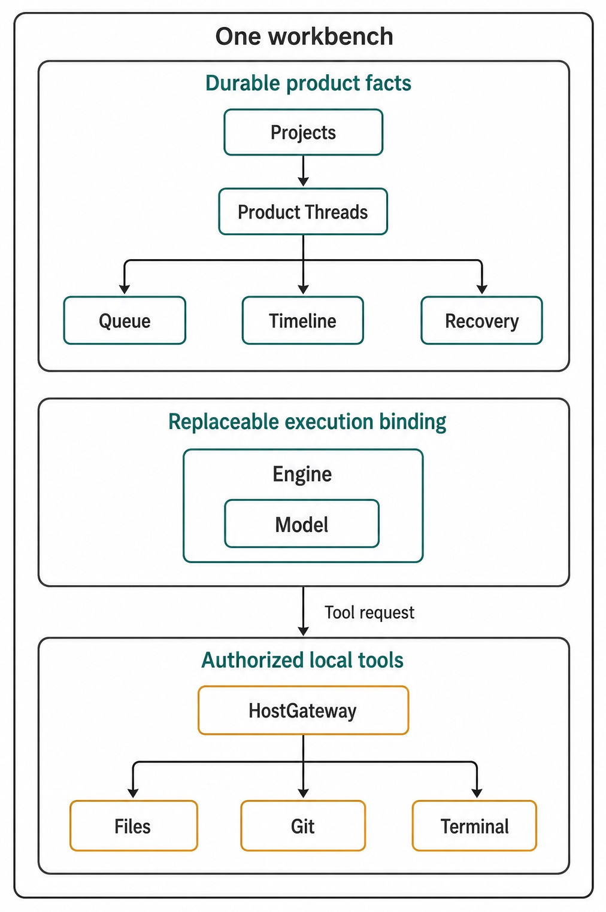
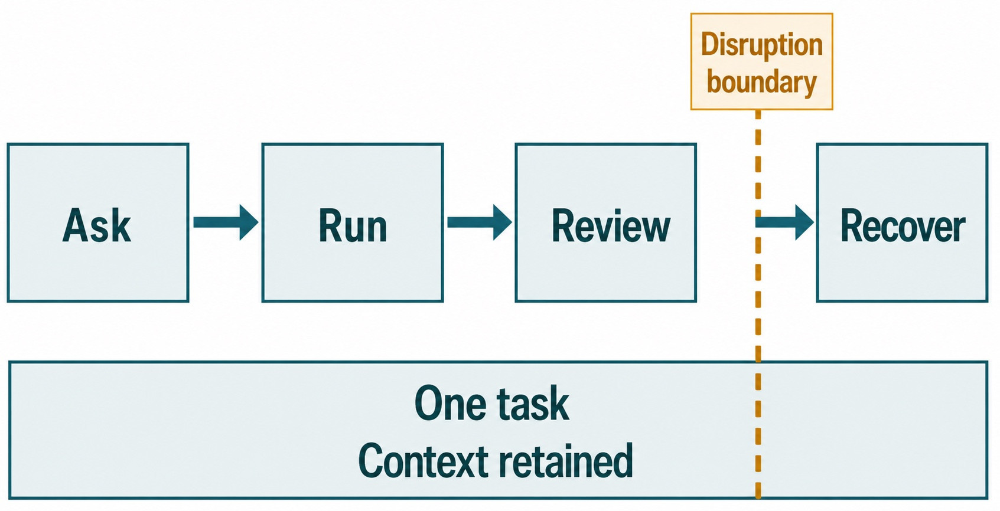

# Chapter 1 — Why an AI Workbench, Not Another Chat Box {#chapter-01}

## The question

A chat box is excellent at one exchange: you ask, it answers. Real software work is not one
exchange. A bug fix begins with a repository, grows through questions and tool calls, waits for
tests, produces changes, survives corrections, and ends only when a person has reviewed the result.
If every step lives in a separate tool, the user becomes the integration layer. You repeatedly paste
paths, restate decisions, explain which command ran, and reconstruct what survived a failure.

Haros is designed around a different question: **what must remain coherent while AI-assisted work
moves from intent to evidence?** Its answer is an AI workbench. Projects, Product Threads, Queue,
Timeline, local capabilities, and recovery belong to one product model. An Engine performs the
execution, but the workbench retains the durable work.

_Figure 1.1 — A workbench unifies the product facts that a fragmented chat-and-tools workflow asks
the user to reconcile manually._

**Accessible equivalent.** Projects, Product Threads, local tools, and recovery converge on one Haros workbench rather than requiring four unrelated products.

## The plain-English model

In this Guidebook's running journey, a junior developer named Sam opens a small repository whose
test fails after a configuration value is missing. Sam asks Haros to diagnose the bug, reviews the
proposed direction, lets an Engine inspect files and run a focused test, checks the diff, and then
recovers after an interruption. The important unit is not the first prompt. It is the complete task.

A conventional chat transcript can record sentences, but it often leaves the surrounding facts
implicit. Which folder did those sentences refer to? Which model was admitted for the turn? Is a
command still running? Was a follow-up queued or lost? Did cancellation stop execution, or merely
request it? Haros makes these product questions visible and gives them owners.

| Need during Sam's fix | Fragmented-tool burden                      | Workbench responsibility                     | Durable result                                |
| --------------------- | ------------------------------------------- | -------------------------------------------- | --------------------------------------------- |
| Establish scope       | Re-paste paths and repository context       | Project supplies workspace context           | Reviewable association with the intended work |
| Continue reasoning    | Reconstruct prior prompts manually          | Product Thread retains conversation history  | A readable line of work                       |
| Run local operations  | Switch among shell, editor, and helper apps | HostGateway projects authorized capabilities | Receipts and visible activity                 |
| Submit a follow-up    | Remember it outside the running chat        | Queue preserves admitted intent              | Follow-up remains recoverable                 |
| Handle interruption   | Guess what completed                        | Timeline and recovery settle product state   | Control returns without invented success      |

The workbench is not valuable because it hides every boundary. It is valuable because it makes the
boundaries explicit while preserving continuity. Files remain owned by their file services. Git,
terminal, browser, and device capabilities retain their own authority. Engine adapters do not
become secret super-users. Product Orchestration coordinates Projects, Threads, Queue, Timeline,
and recovery without claiming to own an Engine's private native Session.

## See it in Haros

Sam starts in Agent because the bug belongs to a folder on disk. The first useful action is not to
paste the entire repository into a message. It is to select the correct Project and state a bounded
outcome: “Find why the missing configuration falls through, make the smallest safe fix, and run the
focused test.” That instruction creates a line of work whose workspace and intent can be inspected.

When the turn is admitted, the exact Engine and model selection travel with it. If another request
arrives while the Engine is working, Haros can preserve it in Queue rather than forcing Sam to keep
a note elsewhere. Tool activity appears in the Timeline. The final answer is review input, not a
substitute for checking the diff and test evidence.

This yields a practical workbench loop:

1. place the task in its truthful workspace;
2. state the intended observable result;
3. let admitted execution use bounded capabilities;
4. read the Timeline and review the actual changes;
5. recover or correct the work without rebuilding the entire context.

The same product model also supports Chat and Studio, although their workspace lifecycles differ.
Chapter 3 explains that choice. For now, the durable lesson is that a work surface is not an Engine,
and an Engine is not the Product Thread.

## Continuity is a product feature

_Figure 1.2 — Continuity means retained product context across a task, not a promise that one native
Engine Session survives every disruption._

**Accessible equivalent.** One task moves from ask to run to review; after a disruption, recovery uses retained product context. The figure does not promise continuation of a native Engine Session.

Continuity has several layers. Message history can remain while a runtime process stops. A queued
instruction can remain while the selected Engine becomes unavailable. Timeline facts can remain
while a retry creates new execution. These distinctions prevent a comforting but false statement:
“The same session continued.” Haros promises product continuity where its owners can support it and
reports execution discontinuity where they cannot.

| Continuity layer  | Owner                        | What may survive interruption                 | What is not implied           |
| ----------------- | ---------------------------- | --------------------------------------------- | ----------------------------- |
| Workspace context | Project and workspace owners | Intended root and Project identity            | Access to every local path    |
| Conversation      | Product Orchestration        | Product Thread, messages, admitted turns      | One endless native Session    |
| Pending intent    | Queue/promotion owner        | A queued prompt and its admitted binding      | Immediate execution           |
| Activity history  | Timeline/read models         | Visible commands, tools, outcomes, provenance | Automatic rollback            |
| Native execution  | Selected Engine              | Only what that Engine truthfully supports     | Cross-Engine Session transfer |

This model becomes especially important in Sam's bug fix. Suppose the Engine reads two files and
runs a test before the server is interrupted. The test result and file effects may already exist.
Recovery must not erase the transcript or silently claim that nothing happened. Nor can it invent a
completed answer. The product reconciles the orphaned running state, records a terminal fact, and
returns control. Sam then inspects the Timeline, Git state, and relevant receipts before deciding
whether to retry.

## How it works

Haros separates durable product orchestration from replaceable execution. Product commands enter a
decider, become events, and project into visible state. The exact implementation is contributor
detail; the reader-facing consequence is that the Web workbench consumes typed projections rather
than maintaining a private second store.

An Engine is a complete agent runtime. `ENGINE_DESCRIPTORS` is the sole owner of Engine identity,
display name, registration, capability projection, and Settings discovery. The workbench does not
copy that catalog into each screen. When a turn starts, its Engine selection, model, and relevant
options are admitted together. A launch failure does not authorize a silent switch.

Local capabilities follow a similarly narrow route. HostGateway owns catalog and authorization for
system operations. File, Git, terminal, browser, and device services remain their real owners.
Adapters receive typed projections and exact-turn authority rather than ambient access. This design
keeps the convenience of one workbench from becoming an excuse for one unbounded authority.

| Fact                             | Sole owner                         | Workbench projection                            | Forbidden duplicate                    |
| -------------------------------- | ---------------------------------- | ----------------------------------------------- | -------------------------------------- |
| Project, Thread, Queue, Timeline | Product Orchestration              | Navigation, transcript, lifecycle state         | A client-only product store            |
| Engine identity and capabilities | `ENGINE_DESCRIPTORS`               | Selector and credential-blind status            | Parallel Engine lists                  |
| Native Session                   | Selected Engine/adapter            | Bounded status and identifiers when appropriate | Product Thread disguised as Session    |
| Local operation authority        | HostGateway and capability service | Request, approval, activity, receipt            | Adapter-specific permission system     |
| Filesystem effects               | File/Git/terminal owners           | Diff, status, output, receipt                   | Transcript treated as filesystem truth |

## The continuity test

You can test whether a product behaves like a workbench by asking what happens when the happy path
breaks. Imagine four interruptions in Sam's task. The application window closes after the prompt is
accepted. A local command needs approval. The selected Engine fails before startup. The test finishes,
but the final response never arrives. In each case, the useful question is not merely “Can I reopen
the chat?” It is “Which accepted facts remain, which runtime facts ended, and what evidence tells me
how to continue?”

For the first interruption, the Product Thread should still identify the task and its workspace.
For the second, the pending request should state the capability and await a decision rather than
gaining permission from silence. For the third, the admitted Engine/model selection and prompt should
remain visible even though no useful native Session exists. For the fourth, the Timeline and actual
repository state help Sam distinguish a completed side effect from an incomplete answer.

This test also explains why a workbench needs both history and current state. History alone can tell
you that a test command was requested. Current process or receipt state tells you whether it settled.
A state snapshot alone can show an error without explaining the prompt and binding that produced it.
Haros joins them through product projections while retaining the underlying owners.

A useful review habit is to narrate the task in owner language:

- the Project establishes the intended workspace;
- the Product Thread records the durable line of work;
- the admitted turn fixes the exact execution binding;
- HostGateway authorizes local capabilities for that turn;
- the capability owner produces a result or failure;
- Timeline and recovery make the outcome inspectable.

If the narration instead says, “The chat knows the folder, the AI has all the tools, and the session
will remember,” three boundaries have disappeared. The folder has become ambient, authorization has
become implicit, and Product Thread continuity has been replaced by an unsupported native-session
promise. The workbench model exists to keep those shortcuts out of both user expectations and code.

### Why this matters to contributors

The same continuity test constrains implementation. A new UI feature must consume the canonical
projection rather than create a second registry or lifecycle. A new Engine adapter may translate its
protocol, but it may not duplicate Product Queue, HostGateway permissions, or recovery. A new tool
must preserve its real service owner and receive exact-turn authority. These are not abstract purity
rules; they keep Sam's task understandable when one component fails.

At the pinned edition, this separation is especially important because Haros is a source alpha.
Alpha behavior may change, but current behavior still needs precise ownership and evidence. The
Guidebook therefore distinguishes durable principles—such as Product Thread not equaling native
Session—from current implementation choices that require fresh verification in a later edition.

## From a fragmented sequence to one reviewable task

Consider how Sam's fix would proceed without a workbench. Sam opens one chat to discuss the error,
copies an answer into an editor, opens a terminal to run the test, saves the output somewhere else,
and starts a second chat after the first loses context. When a teammate asks why the line changed,
Sam reconstructs the story from shell history, editor buffers, and memory. Each tool may have worked
perfectly, yet the task is difficult to review because no product owns the line of work.

Haros does not eliminate the editor, terminal, Git repository, or Engine. It gives their relevant
facts a shared product context. The Project identifies the workspace. The Product Thread holds the
conversation and admitted turns. HostGateway makes local operations attributable. Timeline projects
activity. Queue preserves accepted follow-ups. Recovery states explain how control returned. The
reviewer still reads the actual diff and test result, but no longer has to guess which conversation
or model they belonged to.

This is why “one workbench” should not be interpreted as “one giant screen.” A terminal can appear
in a panel, a diff in a review surface, and a conversation in the Timeline while each component
retains its own interaction contract. Visual proximity is helpful, but ownership continuity is the
real feature. A product could place many widgets together and still be fragmented if each kept a
separate, incompatible idea of the current task.

The same reasoning applies when work spans time. Sam may stop for lunch, restart the application,
or wait for a teammate's decision. The task remains reviewable because its durable facts do not
depend on one screen staying open. If execution must restart, the new turn is explicit. If a queued
instruction is no longer wanted, cancellation is explicit. If the repository changed outside
Haros, the next review reads current Git state rather than assuming the earlier projection is still
the filesystem.

The workbench therefore reduces coordination cost without hiding uncertainty. It can say “this
prompt was accepted, this operation ran, this outcome settled, and this fact is still unknown.”
That sentence is more useful than an uninterrupted animation whose underlying owners disagree.

## What can go wrong

### Treating the answer as the task

An assistant message may sound confident while the focused test still fails. Review the repository
effect and evidence. The workbench keeps those facts nearby precisely so fluency is not mistaken for
completion.

### Treating continuity as automatic rollback

Interrupting a turn does not reverse commands or file writes that already finished. A workbench can
show what happened and provide explicit recovery actions; it cannot truthfully pretend completed
side effects never occurred.

### Treating one product as one authority

Haros coordinates local capabilities but does not dissolve their boundaries. A request can be
denied, time out, or become unavailable. The correct response is an explicit failure with retained
product work, not a hidden bypass.

### Treating an Engine failure as permission to substitute

If Sam admitted a turn for a particular Engine and model, using another selection changes the
execution contract. Haros preserves the request and asks for an explicit recovery decision rather
than silently routing to a convenient alternative.

| Failure              | Preserved fact                             | Honest visible response                | Non-guarantee               |
| -------------------- | ------------------------------------------ | -------------------------------------- | --------------------------- |
| Engine cannot launch | Prompt, Product Thread, admitted selection | Failure and recovery choice            | Automatic fallback Engine   |
| Tool request denied  | Conversation and request provenance        | Denial or pending approval             | Ambient local access        |
| Test fails           | Files, output, Timeline                    | Failed evidence for review             | “Task complete”             |
| Process interruption | Product events and queued intent           | Reconciliation and terminal settlement | Native Session continuation |

## Try it safely

Use a disposable repository or a tiny synthetic fixture. Create one harmless failing test, then ask
Haros only to explain the likely cause and propose the narrowest check. Before allowing any change,
identify the Project, the active Product Thread, the selected Engine/model, and the local capability
that would run the test. If you proceed, review the diff and focused test output.

The observable result is a complete evidence chain: intent in the Thread, bounded execution,
visible activity, and a reviewed outcome. Do not use credentials, production deployments, broad
home-directory access, or real private Engine state.

## Recap

1. A chat box optimizes an exchange; Haros coordinates a complete line of work.
2. Projects, Product Threads, Queue, Timeline, tools, and recovery remain explicit product facts.
3. Durable product continuity does not fabricate native Engine Session continuity.
4. HostGateway preserves local capability ownership inside one coherent workbench.
5. Completion means reviewed evidence, not merely a fluent answer.

## Check your model

1. **Why is a transcript alone insufficient for Sam's bug fix?**  
   It does not necessarily own the workspace, admitted execution binding, tool evidence, Queue, or
   recovery lifecycle that make the task reviewable.

2. **What can remain after an Engine process stops?**  
   Product-owned facts such as the Thread, prompt, Queue, Timeline, and recovery state can remain;
   Haros must not claim that the native Session continued.

3. **Why does one workbench not mean one unlimited authority?**  
   Coordination and authority have different owners. HostGateway and capability services retain
   authorization while the workbench projects their bounded results.

## Source trail

- `README.md`, “Three ways into the Harness OS” and “What the Harness OS owns,” states the public continuity,
  local-tool, local-first, recovery, and replaceable-execution promises.
- `docs/architecture.md`, “Product orchestration,” owns the durable product facts.
- `docs/architecture.md`, “Engines” and “State boundaries,” separates Product Threads from native
  Sessions and forbids fabricated continuation.
- `docs/architecture.md`, “HostGateway,” owns exact-turn local capability authorization.

<!-- guide-navigation:start -->

[Guidebook contents](../README.md) · [Previous: Preface](../00-preface.md) · [Next: Haros in One Sentence](02-haros-in-one-sentence.md)

<!-- guide-navigation:end -->
