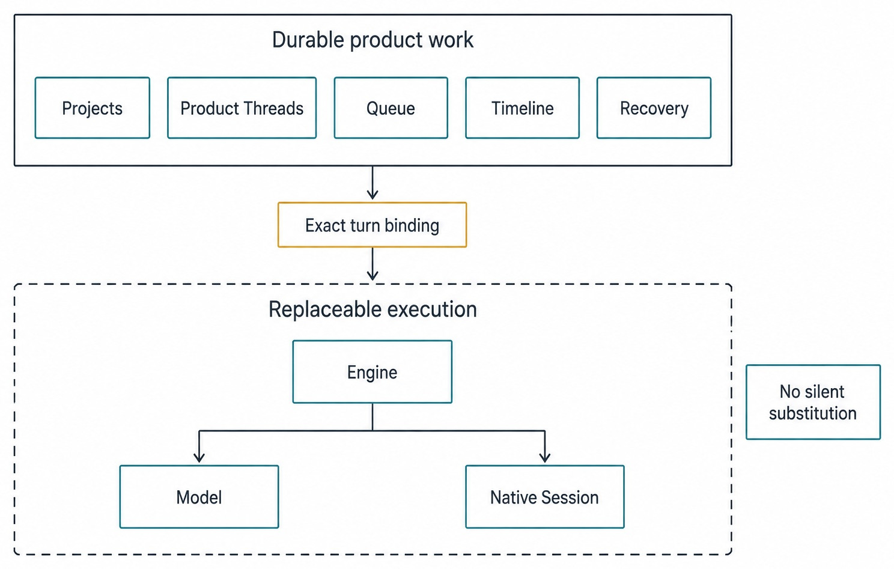
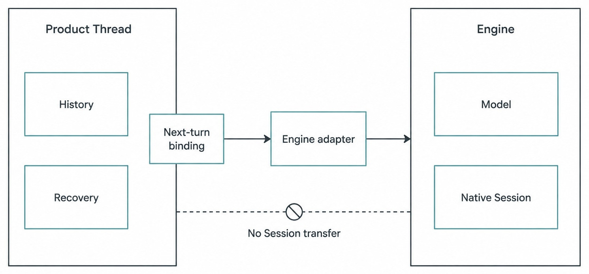

# Chapter 2 — Haros in One Sentence {#chapter-02}

## The question

How do you explain Haros accurately without reciting a feature list? Use this sentence:

> **Haros is a local-first desktop workbench that keeps product work durable while the Engine,
> model, and exact execution behind each turn remain explicit and replaceable.**

Every phrase matters. “Local-first” describes the state boundary, not offline-only operation.
“Desktop workbench” describes one product across Agent, Chat, and Studio, not a thin chat wrapper.
“Product work” includes Projects, Product Threads, Queue, Timeline, and recovery. “Replaceable” does
not mean Haros swaps execution silently; a change is explicit, stop-first, and never fabricates
native Session continuation.

_Figure 2.1 — Haros keeps durable work and replaceable execution as connected but separate layers._

**Accessible equivalent.** Haros owns durable Projects, Threads, Queue, and Timeline above a separate execution layer in which an Engine and its selected model can change explicitly.

## Unpack the sentence

### Local-first

Haros product state and the Project workspace remain on the machine unless an explicit action uses
a connected service. This is an ownership statement. It does not promise that every Engine runs
without a network, that every model is local, or that an authorized browser request never leaves
the machine. Chapter 6 defines the boundary precisely.

### Desktop workbench

The desktop shell, Web workbench, and server cooperate as one product. The Web layer consumes typed
projections; it does not own native processes, parse private Engine configuration, or keep a second
product database. The workbench combines navigation, conversation, Queue, Timeline, review, and
local capability surfaces while retaining the owners beneath them.

### Durable product work

A Product Thread can remain meaningful even after an Engine fails. Messages, admitted turns,
queued intent, activity, and recovery records are product facts. “Durable” is not the same as “every
intermediate byte is eternal.” It means the product has an explicit persistence and reconciliation
model rather than relying on one live process to remember the task.

### Explicit and replaceable execution

An Engine is a complete agent runtime. A model is one selection within that execution context. A
native Session is the Engine's own runtime continuity. Haros binds the exact Engine, model, modes,
and relevant options when a turn is admitted. If the selection becomes unavailable, the prompt is
preserved and failure is visible. Haros does not silently choose a replacement.

| Phrase                | Plain meaning                                             | Frequent overclaim                        | Correct boundary                                        |
| --------------------- | --------------------------------------------------------- | ----------------------------------------- | ------------------------------------------------------- |
| Local-first           | Product state begins and remains on your machine          | “Nothing ever uses a network”             | Connected operations remain explicit                    |
| Desktop workbench     | One place coordinates complete work                       | “The Web view owns everything”            | Server and capability owners remain authoritative       |
| Durable product work  | Thread, Queue, Timeline, and recovery outlive one runtime | “Every native Session is resumable”       | Product and native continuity differ                    |
| Replaceable execution | Engine/model choice can change explicitly                 | “Haros silently picks anything available” | Admission binding and stop-first change remain truthful |

## Apply it to the running bug fix

Sam's configuration bug is durable product work because its Project, Product Thread, messages,
queued follow-up, activity history, and review context belong to Haros. The Engine performing the
inspection is execution. The selected model is part of that turn's admitted binding. The native
Session is private continuity maintained by that Engine, not the identity of Sam's task.

Suppose the first Engine proposes a fix but cannot complete the focused test. Sam reviews what
happened and explicitly selects another Engine. The Product Thread can retain the history that
explains the decision. The new Engine receives an honest new execution boundary. Haros must not
copy a native identifier or tell the new runtime that it is continuing the old Session.

_Figure 2.2 — Product history can cross an explicit execution change; native Session identity
cannot be transferred as if two runtimes shared private continuity._

**Accessible equivalent.** Product history and recovery remain with the Product Thread. The adapter connects work to an Engine and model, but Haros does not transfer or fabricate the Engine's native Session.

The distinction also improves review. A teammate can ask, “Which Engine and model produced this
turn?” without treating the answer as the identity of the Thread. If a later turn uses a different
binding, the Timeline should show the change rather than smoothing it away.

## Product work versus execution

| Fact                         | Product work or execution? | Owner                                 | Change behavior                                     |
| ---------------------------- | -------------------------- | ------------------------------------- | --------------------------------------------------- |
| Project and workspace root   | Product work               | Product Orchestration/workspace owner | Persists until an explicit Project action           |
| Product Thread and messages  | Product work               | Product Orchestration                 | Survive Engine lifecycle changes                    |
| Queue and admitted follow-up | Product work               | Queue/promotion owner                 | Retains original binding until settled or cancelled |
| Timeline projection          | Product work               | Product events/read models            | Adds facts; does not rewrite history                |
| Engine identity              | Execution selection        | `ENGINE_DESCRIPTORS`                  | Explicit selection, stop-first when changing        |
| Model and Engine options     | Turn execution binding     | Engine selection contract             | Frozen at admission for the turn                    |
| Native Session               | Engine runtime             | Engine adapter/runtime                | Never fabricated across Engines                     |
| Tool operation               | Authorized execution       | HostGateway/capability owner          | Exact-turn request, receipt, cancellation rules     |

This table prevents two opposite errors. The first is to make execution permanent: “We started with
Engine A, so the entire Product Thread is Engine A.” The second is to make product work disposable:
“Engine A stopped, so the task is gone.” Haros rejects both. The work persists at the product layer,
while each execution remains attributable and bounded.

## How it works

Product commands and events are the stable seam. A command such as starting a turn carries the
intended Product Thread, admitted Engine selection, runtime mode, interaction mode, and model
presentation identity. The orchestration decider determines whether the request starts, queues, or
needs another disposition. Events then update projections consumed by the workbench.

The Engine adapter translates between product intent and one runtime's protocol. Translation does
not transfer ownership. The adapter must not invent product persistence, duplicate HostGateway
permissions, or read private state belonging to another Engine. `ENGINE_DESCRIPTORS` remains the
single owner of Engine registration and displayed capabilities.

The model deserves its own noun because it changes independently. An Engine can expose multiple
models, and a model name without the Engine is not always sufficient identity. Haros therefore
admits an Engine selection that includes both. A user-visible label may be projected immediately,
while discovery and startup reconcile in the background; that immediate feedback is still tied to
the exact requested identity.

## What the sentence does not claim

### It does not claim every feature is release-ready

The pinned edition is a source alpha. Passing local checks is not an installer, official release,
signed package, notarization, or update feed. The sentence describes the product architecture and
intent, not a distribution claim.

### It does not claim every Engine has the same capabilities

Replaceable does not mean interchangeable in every respect. Engines can differ in discovery,
steering, modes, options, and native session behavior. Haros projects capabilities truthfully and
keeps the product boundary stable.

### It does not claim connected work is local

A model service, web request, or other connected operation may cross the machine boundary. The
local-first promise is that outward use is deliberate and bounded, not that the network ceases to
exist.

### It does not claim product continuity equals rollback

Durable history records what happened; it does not undo file writes or commands. Review Git state,
Timeline activities, and receipts. Recovery and rollback are separate operations.

| Misstatement                               | Why it fails                                          | Accurate replacement                               |
| ------------------------------------------ | ----------------------------------------------------- | -------------------------------------------------- |
| “Haros is a chat app with tools.”          | Omits Projects, Queue, Timeline, review, and recovery | Haros is a workbench for durable product work      |
| “Haros keeps one universal AI session.”    | Collapses Product Thread and native Session           | Product history persists across bounded executions |
| “Haros always works offline.”              | Confuses local-first with offline-only                | Connected services are explicit boundary crossings |
| “Any available model may finish the task.” | Erases admission truth                                | Engine/model changes require an explicit decision  |
| “A recovered task was rolled back.”        | Confuses control restoration with effect reversal     | Inspect effects; rollback is separate              |

## Use the sentence as a diagnostic

The one-sentence description is more than introductory copy. Each phrase can diagnose a proposed
feature or a confusing bug report. If a change stores Product Thread state inside one Engine's
private directory, it violates “durable product work.” If a selector changes the displayed model but
queued work drains under the new value, it violates “exact execution.” If a connected operation is
triggered without a visible user or product request, it violates “local-first.” If a screen adds its
own Engine list, it violates “one workbench” and the descriptor owner.

Apply the diagnostic to Sam's bug fix. Sam reports, “The chat forgot my task when the model failed.”
The sentence prompts two separate investigations. Did product history disappear, which would be a
Product Thread or projection defect? Or did native execution stop, while the product history
correctly remained? The visible symptom may feel similar, but the owners and remedies differ.

Now consider, “I changed the model and my queued test ran under the old model.” That may be correct.
Queue retains the binding admitted with the follow-up. The selector is current draft intent; the
queued turn is already accepted product work. The one-sentence model warns against using current UI
selection to rewrite durable accepted intent.

The diagnostic also prevents feature language from outrunning evidence. “Replaceable Engine” does
not mean every Engine supports the same steering protocol, options, or tools. It means the product
keeps an explicit boundary and can select another Engine without redefining Projects, Threads,
Queue, Timeline, or recovery. Capability differences remain visible.

### A three-question explanation for teammates

When a teammate asks what Haros is, give the sentence and then answer three questions:

1. **What remains?** Product-owned work: workspace context, Thread history, queued intent, Timeline,
   and recovery facts.
2. **What may change?** The explicit Engine, model, runtime mode, interaction mode, and native
   execution used for a turn.
3. **What authorizes effects?** HostGateway and the underlying capability services, not the mere
   presence of an Engine or a message in the transcript.

This explanation is short enough for onboarding yet precise enough to survive contributor review.
It also points naturally to later chapters: surface choice in Chapter 3, vocabulary in Chapter 5,
local-first boundaries in Chapter 6, and detailed execution controls in Part II.

### Product identity stays singular

Haros is the only product identity on normal surfaces. Machine contracts such as package names,
environment variables, schemes, and private paths may retain implementation identities, but they
do not create a second user-facing product. Likewise, an Engine's own name may appear where a
selector, diagnostic, or legal fact requires it; that accuracy does not turn the Engine into the
owner of the workbench.

This matters because vocabulary shapes architecture. Calling a full runtime a “provider” in every
screen encourages product code to treat it like only a model endpoint. Calling a model an “Engine”
encourages capability and session assumptions. Haros uses Engine for the complete runtime and
reserves provider terminology for genuine upstream model or search services inside the relevant
domain.

## Stress-test the sentence under change

A good product description remains accurate when one component changes. Replace the Web layout:
Haros is still a local-first workbench because product ownership did not move into the old screen.
Add another Engine: durable Projects and Threads do not need a new product store. Change a model
catalog: existing admitted turns retain their recorded binding. Restart the server: recovery adds
truthful settlement instead of asking a dead runtime to remember.

Now stress-test the sentence against tempting shortcuts. Suppose a contributor wants to improve
startup by using the first available Engine whenever the requested one is slow. That may feel
helpful, but it violates explicit execution and provenance. The product can show readiness layers,
preserve the prompt, or offer a selection; it cannot quietly change the accepted meaning of the
turn.

Suppose another contributor wants the Web client to cache a full Engine list so Settings opens
instantly. A short-lived projection or query cache may be appropriate, but a separately maintained
registry is not. The descriptor owner must remain canonical, or display names and capabilities will
drift. “Desktop workbench” describes a coordinated consumer of truth, not permission for every
surface to become an owner.

Suppose a connected model produces a useful answer after the local app loses its connection. The
product may later reconcile an authoritative outcome if the protocol and evidence support it. It
must not infer success from plausibility. Durable product work means uncertainty can be recorded and
reviewed; it does not mean all distributed outcomes are knowable immediately.

Finally, suppose Sam changes from Agent to Studio to package a report. The surface and workspace
lifecycle change explicitly, but Haros remains one product. Deliberate inputs can move into the
isolated Studio workspace and outputs can be captured. That transition does not turn Studio into an
Engine, move the original Project silently, or transfer a native Session.

These stress tests show why the sentence uses ownership nouns rather than a feature inventory.
Features will grow; the boundaries determine whether growth stays coherent.

## What can go wrong

If Engine discovery fails during Sam's task, the UI may know the requested identity but lack a
startable runtime. The honest state is degraded or failed execution with preserved product work.
Do not turn the Product Thread into an error object, and do not make the client invent a catalog.

If Sam switches Engine while work is active, the change is stop-first. Runtime cancellation and
product settlement may take time. The product can record intent immediately without claiming that
execution has already stopped. Once the boundary settles, new work starts under the new binding.

If a connected model service rejects a request, Haros should expose that failure. A silent fallback
would produce an answer whose provenance differs from the admitted selection. Preserving the prompt
and returning control is more useful than hiding the failure.

## Try it safely

Take the running bug-fix description and classify each noun before starting execution:

1. Project: the disposable fixture directory.
2. Product Thread: “Fix missing configuration fallback.”
3. Turn: the bounded request to diagnose and test.
4. Engine and model: the exact selection shown before admission.
5. Tool: the focused file or test capability requested through Haros.

Now imagine the Engine becomes unavailable after the prompt is admitted. Write down what Haros may
retain and what it may not claim. The correct observable result is: prompt, Thread, Queue/Timeline,
and recovery context may remain; native Session continuation and silent model substitution may not
be claimed. Use synthetic data only.

## Recap

1. Haros is a local-first desktop workbench for durable product work.
2. Projects, Threads, Queue, Timeline, and recovery are product facts.
3. Engine, model, options, modes, and native Session belong to bounded execution.
4. Replaceability requires explicit provenance, not silent substitution.
5. Local-first permits deliberate connected operations without moving product ownership outward.

## Check your model

1. **If an Engine stops, did the Product Thread stop existing?**  
   No. Product history and recovery can remain while native execution settles or is replaced.

2. **Why is “model” not a synonym for “Engine”?**  
   The Engine is the complete runtime; the model is one selected service/model identity within its
   admitted execution binding.

3. **Can Haros call a network service and still be local-first?**  
   Yes, when product state remains locally owned and the outward operation is explicit, bounded,
   and truthfully represented.

## Source trail

- `README.md` states Haros's public local-first, continuity, recovery, and replaceable-execution
  promises and marks the current source-alpha boundary.
- `docs/architecture.md` owns product orchestration, Engine separation, HostGateway, and state
  boundaries.
- `packages/contracts/src/orchestration.ts` owns `EngineSelection`, model binding, runtime mode,
  interaction mode, and turn admission fields.
- `ENGINE_DESCRIPTORS` remains the sole owner of Engine registration and capability projection.

<!-- guide-navigation:start -->

[Guidebook contents](../README.md) · [Previous: Why an AI Workbench, Not Another Chat Box](01-why-an-ai-workbench-not-another-chat-box.md) · [Next: Agent, Chat, and Studio](03-agent-chat-studio.md)

<!-- guide-navigation:end -->
