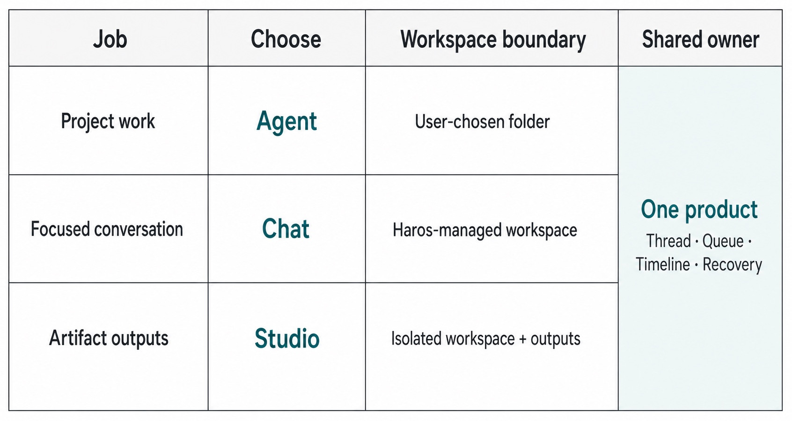
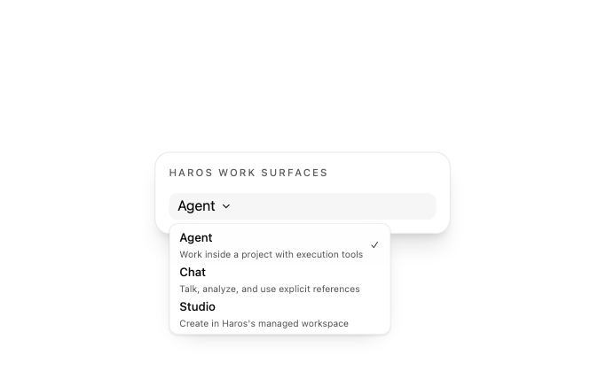
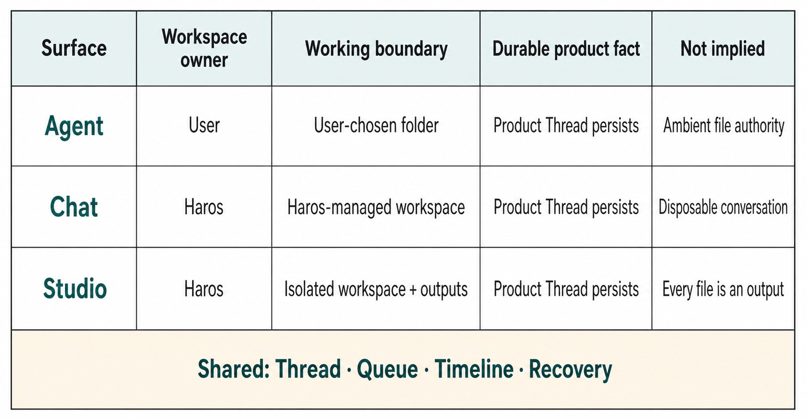

# Chapter 3 — Agent, Chat, and Studio {#chapter-03}

## The question

You have work for Haros, but where should it begin? The answer is not “whichever screen looks most
familiar.” Agent, Chat, and Studio are three work surfaces with different workspace lifecycles. They
belong to one product and share one orchestration model, yet each makes a different promise about
where files live and what kind of result you are trying to produce.

The shortest rule is this:

- choose **Agent** when the work belongs to a folder you selected;
- choose **Chat** when the work is a focused conversation in a Haros-managed workspace;
- choose **Studio** when the goal is an artifact created in an isolated managed workspace.

That rule is useful only if you also understand what does _not_ change. Moving among surfaces does
not create three different Haros products. Projects, Threads, Queue, Timeline, and recovery remain
product facts. An Engine is still a replaceable execution runtime, and its native Session is still
not the same thing as a Haros Product Thread.

_Figure 3.1 — Three surfaces are different workspace choices inside one product. This is a
conceptual teaching figure, not a screen representation._

**Accessible equivalent.** Project work maps to Agent and a user-chosen folder. Focused conversation maps to Chat and a Haros-managed workspace. Artifact outputs map to Studio and an isolated workspace plus outputs. The three rows remain distinct workspace choices but share one Haros product owner for Thread, Queue, Timeline, and Recovery.

## A plain-English model

Imagine a workshop with three benches. At the first bench, you bring an existing box of parts: your
repository or project folder. At the second, the workshop gives you a clean table for discussion and
keeps the notes. At the third, the workshop gives you a protected fabrication area and a clearly
marked place for finished outputs. The benches support different jobs, but the job cards, history,
and recovery desk belong to the same workshop.

This metaphor has a boundary. A Haros workspace is a real filesystem location with product-owned
lifecycle rules, not merely a visual tab. The surface is derived from the Project kind. Haros does
not need a second persisted “surface” field that could drift away from the Project. In the pinned
edition, `projectKindToProductSurface` maps a folder-backed `project` (and the deliberately handled
legacy absence of a kind) to Agent, `chat` to Chat, and `studio` to Studio.

| Surface | Workspace home                      | Best first question                         | Typical result                                                               |
| ------- | ----------------------------------- | ------------------------------------------- | ---------------------------------------------------------------------------- |
| Agent   | A folder you choose                 | “What should change in this project?”       | Source changes, analysis, tests, or a reviewed plan tied to that folder      |
| Chat    | A Haros-managed workspace           | “Can we reason through this focused topic?” | A durable conversation, references, and follow-up work without project setup |
| Studio  | An isolated Haros-managed workspace | “Can you create a deliverable for me?”      | Files captured as explicit Studio outputs                                    |

The table compares starting conditions, not capability guarantees. Exact tool availability also
depends on the selected Engine, admitted runtime mode, the current product state, and HostGateway
authorization. Surface choice does not silently grant a tool, credential, or permission.

## See it in Haros

The surface picker makes all available work surfaces visible. Its descriptions say what each is for
instead of presenting three unexplained brand names.

_Figure 3.2 — The real surface picker, captured from the production component with English locale,
a synthetic state, and no user data._

The capture is evidence of the picker and its current wording at this edition. It is not evidence
that every Engine provides every capability on every surface. The distinction matters: a UI can
truthfully offer a route while deeper admission rules still decide whether a particular action can
start.

When you open the picker, ask two questions:

1. **Where should the working files live?** If the answer is “in this repository,” Agent is the
   natural home. If Haros should own the workspace, choose Chat or Studio.
2. **Is the main outcome conversation or an artifact?** Chat optimizes for the conversation;
   Studio gives the output path a first-class role.

Do not ask “which one has the smartest model?” Model selection belongs to Engine and model
discovery, not surface identity. The same product surface can use different admitted Engines and
models. Conversely, selecting the same Engine in two surfaces does not collapse their workspace
lifecycles.

## The three workspace lifecycles

_Figure 3.3 — Workspace ownership changes by surface; product continuity does not. The figure is
conceptual rather than a literal directory map._

**Accessible equivalent.** Agent uses a user-owned, user-chosen folder without granting ambient file authority. Chat uses a Haros-managed workspace and its Product Thread persists, so the conversation is not disposable. Studio uses a Haros-managed isolated workspace plus outputs, but not every file automatically becomes an output. Thread, Queue, Timeline, and Recovery remain shared product facts without merging the three workspace boundaries.

### Agent: work where the project lives

Agent is for a real project directory. The folder is not an attachment copied into a chat. It is the
workspace in which file, Git, terminal, and related project operations can be admitted. That makes
Agent the right default for diagnosing a bug in a repository, reviewing a diff, running focused
tests, or carrying an approved plan into implementation.

The folder boundary is important. A tool request still goes through the product's capability and
authorization path. Being in Agent does not make all local files ambiently available, and it does
not move HostGateway authority into an Engine adapter. The selected Engine receives only the typed,
authorized projection needed for the exact work.

### Chat: start with the conversation

Chat removes the requirement to select a project folder first. Haros creates and manages the
workspace so you can ask a focused question, analyze supplied references, or develop an idea. The
conversation is durable product work; it is not a disposable web chat merely because the workspace
was managed for you.

Chat can still involve files or connected services when explicitly admitted. The difference is
ownership and lifecycle: you did not declare an existing local folder as the Project home. If the
conversation later needs repository work, create or move into an appropriate Agent path rather than
pretending the managed Chat workspace has always been that repository.

### Studio: make the deliverable explicit

Studio uses an isolated managed workspace for artifact-oriented creation. Its useful distinction is
not “Chat with a nicer canvas.” The workspace lifecycle and output handling are oriented toward
captured deliverables. Inputs enter the workspace, work happens inside it, and outputs are surfaced
from the designated output boundary.

Isolation is not a marketing synonym for a security guarantee. It describes the workspace model.
Actual capability, external access, and authorization remain governed by their owners. The safe
mental model is: Studio gives artifact production a clear home; it does not bypass product or host
boundaries.

| Fact                       | Sole owner                              | What the surface may project                  | What it must not invent                                   |
| -------------------------- | --------------------------------------- | --------------------------------------------- | --------------------------------------------------------- |
| Project kind               | Product contracts and persisted Project | Agent, Chat, or Studio presentation           | A second mutable surface identity                         |
| Product Thread and history | Product Orchestration                   | Surface-appropriate navigation and transcript | A native Engine Session disguised as the Thread           |
| Engine identity            | `ENGINE_DESCRIPTORS`                    | A selector and credential-blind status        | A surface-specific Engine registry                        |
| Local capability authority | HostGateway and capability services     | Controls and receipts for admitted operations | Ambient file, Git, terminal, browser, or device authority |
| Studio outputs             | Studio workspace/output owners          | Captured deliverables                         | Arbitrary files falsely presented as outputs              |

## Moving between surfaces without blurring them

A useful conversation can lead to project work, and project work can lead to a deliverable. That
does not require turning every surface into every other surface. Keep the transition explicit.

If a Chat investigation identifies a repository change, create an Agent path rooted at the intended
folder and carry forward only the approved context. The new Agent Thread may refer to the Chat
history, but its workspace and execution admission must be truthful. If Agent work produces material
for a polished artifact, Studio can receive deliberate inputs and capture the resulting deliverable.
The fact that ideas travel does not mean workspace ownership travels invisibly.

| Starting point | New need                        | Honest transition                                          | Boundary to preserve                                                      |
| -------------- | ------------------------------- | ---------------------------------------------------------- | ------------------------------------------------------------------------- |
| Chat           | Edit and test a real repository | Start or fork into an Agent Project rooted at that folder  | Do not relabel the managed Chat workspace as the repository               |
| Agent          | Produce an isolated deliverable | Send approved inputs to Studio and use its output boundary | Do not treat every project file as a Studio output                        |
| Studio         | Diagnose source behavior        | Open the relevant folder in Agent                          | Do not use a generated artifact as source-code evidence                   |
| Any surface    | Change Engine                   | Stop first and make an explicit Engine selection           | Preserve Product Thread truth; do not fabricate native Session continuity |

This transition model also helps with privacy. Moving a reference should be deliberate and bounded.
Do not copy broad home directories, Engine-private configuration, credentials, or unrelated user
data merely to make a transition convenient. The destination receives the context required for the
new job, and the appropriate product/HostGateway boundary remains in force.

Finally, distinguish a navigation change from a lifecycle transition. Clicking another surface in
the sidebar changes what you are viewing. It does not, by itself, move the current Project, convert a
Thread's workspace kind, transfer a native Session, or grant capabilities. A real transition is an
explicit product action with a visible source and destination. That rule keeps the history readable
for the next person—or for you a week later.

There is also a review benefit. When a Thread's surface and workspace are truthful, a reviewer can
interpret tool receipts and file paths without reverse-engineering how the work arrived there. An
Agent diff belongs to the selected folder. A Chat attachment is admitted context, not evidence that
the managed workspace owns the source repository. A Studio file is a deliverable only when the
Studio output owner captured it. These statements reduce ambiguity during failure: the recovery path
can return to the correct workspace owner instead of searching every surface for a copy.

For the same reason, examples in this Guidebook keep the surface name visible when a workflow
crosses a boundary. This is not repeated branding. It is lifecycle context. A junior reader should
always be able to answer three questions: who owns the workspace, which Product Thread records the
work, and which Engine currently executes the admitted turn. If any two answers are treated as one
fact, the mental model needs correction before the workflow becomes more complex.

## What stays continuous

Surface differences are easiest to understand when contrasted with the facts that remain shared.
Haros keeps the Product Thread and its visible history independent from an Engine's private native
Session. It also keeps queueing, timeline projection, and recovery as product responsibilities.
That separation is what lets a user reason about durable work even when execution changes or fails.

Suppose you begin in Agent and the selected Engine fails to launch. The correct response is not to
silently select another Engine and pretend nothing happened. Haros preserves the product facts and
reports the failure. The prompt and Queue remain recoverable according to their lifecycle. A later
retry or explicit Engine change can create new execution, but it cannot fabricate native
continuation.

Likewise, a Chat conversation can be durable even though its files live in a managed workspace.
Durability belongs to the product's state and recovery model, not to whether the user chose a folder.
Studio can share the same Product Orchestration vocabulary while treating deliverables differently.
Shared vocabulary is not sameness of workspace.

| Common confusion       | Incorrect shortcut                                    | Better model                                                                                             |
| ---------------------- | ----------------------------------------------------- | -------------------------------------------------------------------------------------------------------- |
| Surface vs Engine      | “Agent is an Engine.”                                 | Agent is a product surface; an Engine is a complete execution runtime selected for work.                 |
| Chat vs temporary      | “Chat disappears because there is no project folder.” | Chat uses a Haros-managed workspace and durable product state.                                           |
| Studio vs generated UI | “Studio is an AI mockup mode.”                        | Studio is an artifact-oriented workspace; outputs must still be real files and evidence remains real.    |
| Thread vs Session      | “Switching Engine continues the same native Session.” | The Product Thread persists; native Engine Sessions remain separate facts.                               |
| Surface vs permission  | “Agent means full filesystem access.”                 | Surface establishes workspace context; authorization still belongs to HostGateway and runtime admission. |

## What can go wrong

### You choose Chat for repository-bound work

The conversation may still be useful, but the workspace does not become your repository by wishful
thinking. Stop and choose an Agent Project rooted at the intended folder before authorizing changes.
Do not compensate by copying broad directory contents into Chat or by teaching an Engine adapter to
reach outside the product boundary.

### You choose Agent for a disposable discussion

Nothing necessarily breaks, but you have attached the discussion to a Project lifecycle it may not
need. If there is no project-specific file or tool boundary, Chat is the clearer home. Clarity helps
future readers understand why the Thread exists.

### You expect Studio to prove product behavior

A Studio-created illustration can explain an idea, but it cannot prove what Haros currently renders
or how a protocol behaves. Use a reproducible capture from the real product for UI evidence and a
focused source/test trail for behavior. Generated visuals and real captures have different jobs.

### An Engine or model is unavailable

The surface should remain conceptually intact. Availability is a current discovery/admission fact,
not a reason to rename the surface or silently route work through another runtime. Preserve the
prompt, show the failure, and let the user make an explicit selection or recovery decision.

## Try it safely

Open the surface picker without starting a turn. For each choice, say aloud where files would live
and what the intended output is. Then classify these tasks:

1. “Diagnose a failing test in the repository currently open on disk.” → **Agent**.
2. “Compare two API design approaches from the excerpts I provide.” → **Chat**.
3. “Create a self-contained report and place the finished files in an output area.” → **Studio**.

The observable result is not a file change. It is a correct prediction of workspace ownership before
work begins. If the answer depends on a desired Engine or model rather than file/output lifecycle,
revisit the distinction.

## Recap

1. Agent, Chat, and Studio are product surfaces, not Engines.
2. Agent uses a folder you choose; Chat and Studio use different Haros-managed workspace lifecycles.
3. All three consume shared Product Orchestration facts such as Threads, Queue, Timeline, and
   recovery.
4. Surface choice does not grant local capability authority or fabricate native Session continuity.
5. Choose by workspace home and intended result, then choose Engine, model, and runtime options.

## Check your model

1. **Why is “Agent has the best model” the wrong reason to choose Agent?**  
   Because surface and Engine/model selection are separate facts. Agent is chosen for folder-backed
   project work.

2. **What survives when an Engine cannot start?**  
   Product-owned work such as the prompt, Queue, Thread, and visible recovery state can survive;
   Haros must not claim a native Session continued when it did not.

3. **What is the key difference between Chat and Studio?**  
   Both are managed workspaces, but Chat is conversation-oriented while Studio makes isolated
   artifact production and captured outputs the primary lifecycle.

## Source trail

- `README.md`, “Three ways into the Harness OS,” establishes the public surface promises.
- `docs/architecture.md`, “Product orchestration” and “State boundaries,” establishes the shared
  product facts and Engine-private separation.
- `packages/shared/src/productSurface.ts` owns the projection from Project kind to product surface.
- `packages/contracts/src/orchestration.ts` owns Project and Engine selection contracts.
- `apps/web/src/components/Sidebar.tsx`, `SidebarSurfacePicker`, owns the captured picker behavior.
- `apps/web/src/components/SidebarSurfacePicker.browser.tsx` proves the current English descriptions,
  keyboard selection, and visibility behavior.

<!-- guide-navigation:start -->

[Guidebook contents](../README.md) · [Previous: Haros in One Sentence](02-haros-in-one-sentence.md) · [Next: Your First Complete Task](04-your-first-complete-task.md)

<!-- guide-navigation:end -->
