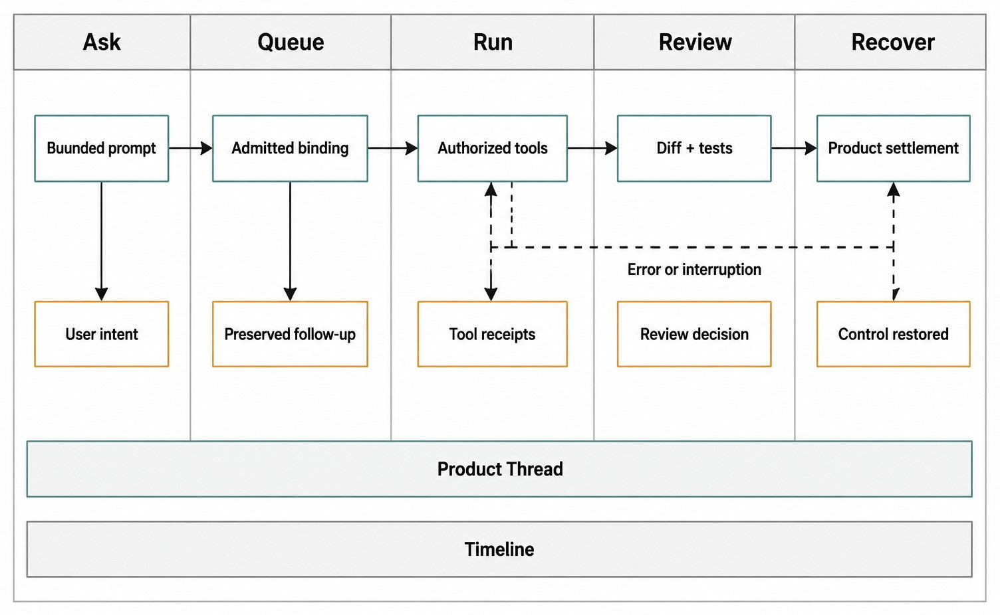
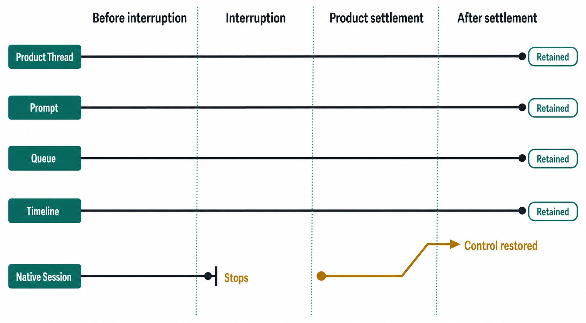

# Chapter 4 — Your First Complete Task {#chapter-04}

## The question

What does “done” look like for a first Haros task? It is not the moment an assistant begins
streaming, nor the moment a file changes. A complete task has an admitted request, visible execution,
reviewed evidence, a terminal outcome, and a known recovery path.

Sam will fix a deliberately small bug: a fixture function returns an empty value when a configuration
key is absent, even though the test expects a documented default. The safe objective is: locate the
responsible branch, make the smallest change, run the focused test, and review the diff. The fixture
contains no credentials, production data, deployment, or private Engine state.

_Figure 4.1 — A first task is a five-stage user journey; these are not claimed as universal runtime
states for every turn._

**Accessible equivalent.** A complete beginner workflow asks, admits or queues the turn, runs it, reviews evidence, and recovers when needed while the Product Thread remains retained.

## Before you ask

Open the disposable Project and confirm the workspace root. Read `git status --short` before any
write so existing changes remain visible. Choose the intended Engine and model, then select a runtime
mode appropriate to a harmless local fixture. Do not grant broad access simply to avoid thinking
about the test's needs.

A good first prompt includes four parts:

> In this disposable fixture, find why the missing configuration key does not use the documented
> default. Make the smallest related change, run the focused test, and summarize the diff and test
> result. Preserve unrelated changes and stop if the intended workspace is uncertain.

This prompt names scope, outcome, evidence, and a stop condition. It does not prescribe an
implementation before inspection. It also gives a junior reviewer concrete questions to ask later.

| Prompt part    | Sam's wording                      | Why it matters                  | Observable evidence                     |
| -------------- | ---------------------------------- | ------------------------------- | --------------------------------------- |
| Scope          | “this disposable fixture”          | Prevents accidental broad edits | Files touched stay inside fixture       |
| Defect         | “missing key does not use default” | Anchors diagnosis               | Explanation names the failing branch    |
| Change bound   | “smallest related change”          | Protects unrelated work         | Focused diff                            |
| Verification   | “run the focused test”             | Separates answer from proof     | Command result in Timeline              |
| Stop condition | “workspace uncertain”              | Returns control safely          | Explicit pause rather than guessed path |

## ASK: submit a bounded intent

When Sam submits, Haros creates or uses a Product Thread and admits a turn. Admission freezes the
exact Engine selection, model, runtime mode, interaction mode, and relevant options. The text in the
composer is not yet proof of execution. The server must accept the command and project the turn.

If no active turn exists, ordinary start admission can proceed. If another turn is live, default
follow-up behavior is Queue. This is why Figure 4.1 uses “Queue” as a reader journey stage but does
not insist that every request visibly waits in a queued state.

Immediately after submission, check that the visible model identity matches the intended binding.
Do not infer identity from the answer's style. The selected provenance is a product fact.

## QUEUE: preserve intent before execution

Queue matters when work is already active or startup has not yet produced a running turn. A queued
follow-up owns its admitted binding. Changing the selector later must not rewrite that accepted
instruction. If the original Engine/model becomes unavailable, the honest outcome is a failure or
explicit recovery choice.

For Sam's first task, avoid generating many micro-prompts. One coherent request is easier to admit,
review, cancel, and recover than a chain whose logical ordering exists only in Sam's head. If a new
fact appears, Chapter 14 explains when to Queue, Steer, or Interrupt.

Inspect the journey in order. At submission, confirm the correct Project, Engine, and model. While
waiting, confirm that the prompt remains visible. During startup, distinguish projected progress
from actual running execution. During the run, require provenance for file and test operations. At
the terminal boundary, require an explicit completed, interrupted, or error outcome rather than a
spinner that survives a dead runtime.

## RUN: follow evidence, not animation

During execution, the Timeline is the readable account of what the Engine requested and what Haros
projected. Sam should expect a narrow sequence: inspect the relevant file and test, explain the
cause, edit the owner, run the focused test, then summarize. Exact ordering may vary, but unrelated
repository exploration is a reason to intervene.

Tool activity does not obtain authority from the transcript. HostGateway and the underlying file,
Git, and terminal services authorize and execute operations for the exact turn. A tool receipt is
stronger evidence than a prose claim that a command ran. A diff is stronger evidence than a prose
claim that only one line changed.

If approval is required, read the requested capability and target. Approving a focused test in the
fixture does not approve every future command. Declining should remain a normal outcome; it should
not force the Engine adapter to invent another path.

## REVIEW: decide whether the task is complete

Review has three layers. First, read the explanation: did the Engine identify the actual fallback
branch? Second, inspect the diff: is the change minimal and related? Third, inspect the focused test
result: did the expected behavior pass under the same workspace?

| Review layer | Question                       | Evidence                               | Reject when                              |
| ------------ | ------------------------------ | -------------------------------------- | ---------------------------------------- |
| Diagnosis    | Why did the default fail?      | Source location and explanation        | It merely restates the test failure      |
| Change       | What exactly changed?          | Git diff/checkpoint summary            | Unrelated files or broad refactor appear |
| Verification | Did the focused behavior pass? | Terminal/tool result and exit status   | Only “tests should pass” is reported     |
| Provenance   | Which execution produced it?   | Timeline Engine/model binding          | Identity is missing or silently changed  |
| Settlement   | Has the turn ended truthfully? | Completed/interrupted/error projection | UI equates stop request with completion  |

A passing focused test is necessary but not always sufficient. If the change affects a shared
owner, broader tests may be appropriate. This first exercise is intentionally bounded so focused
proof can disprove the change cheaply. Do not expand into repository-wide cleanup.

## RECOVER: survive interruption without fiction

_Figure 4.2 — Product work can survive an interrupted runtime even though the native Session does
not._

**Accessible equivalent.** Interruption can stop the native Session without erasing Product Thread, prompt, Queue, or Timeline. Product control returns only after authoritative settlement.

Suppose the server exits after the file edit but before the final answer. Replaying old events would
reconstruct a stale running turn because the dead in-process runtime can no longer provide a
terminal event. Startup reconciliation identifies work that cannot advance and emits new settlement
facts. It does not rewrite history or claim graceful cancellation.

Sam must inspect the repository after control returns. The edit may remain, the focused test may or
may not have run, and the native Session is not promised. The Product Thread still explains the
intent and prior activity. Sam can ask for a bounded verification turn, revert explicitly, or keep
the change after review.

Recovery is also needed when launch fails before any tool operation. In that case the prompt and
Queue remain valuable even though no native Session began. Haros should expose the failure and
preserve the admitted binding, not silently select another Engine.

## How it works

The orchestration contract distinguishes message, turn, Session, and projected status. A user
message records intent. A turn binds one response course. A native or adapter-managed Session is
runtime execution. Projection statuses provide visible lifecycle without turning the client into
the owner.

The decider handles `thread.turn.start`, comparing the admitted binding with committed Thread and
active execution state. Events then feed projections. Terminal status must reflect authoritative
outcome: completed, interrupted, or error. Requesting an interrupt can become visible before the
runtime settles, but it is not itself a completed outcome.

Timeline construction in the Web workbench merges messages, work activities, and provenance into a
readable view. The Timeline is a projection, not an alternative event store. If a view is stale, the
repair belongs in synchronization/reconciliation, not a client-side invented success.

| Fact                       | Owner                           | Consumer                        | Forbidden shortcut                   |
| -------------------------- | ------------------------------- | ------------------------------- | ------------------------------------ |
| Turn admission and binding | Orchestration decider/contracts | Web workbench, reactors         | Composer-only truth                  |
| Runtime execution          | Engine adapter/runtime          | Orchestration reactor           | Product fabricates native completion |
| Local operation            | HostGateway/capability service  | Engine through typed projection | Adapter duplicates permissions       |
| Timeline                   | Product events/read models      | Reviewer                        | Client creates missing history       |
| Restart settlement         | Startup reconciliation          | Projections and controls        | Replaying stale running forever      |

## What can go wrong

### The wrong workspace is selected

Stop before writing. A correct patch in the wrong repository is still a failed task. Preserve the
prompt and choose the truthful Project rather than copying broad files between workspaces.

### The Engine changes more than requested

Interrupt if continuing is unsafe, but remember that interruption is not rollback. Inspect Git
status and receipts, then revert only the known material if desired.

### The focused test fails after the edit

The task is not complete. Keep the failure visible, ask for a bounded diagnosis, or revert. Do not
convert a red test into a prose caveat under a “completed” heading.

### Startup or a connected service fails

The Product Thread and prompt may survive. Haros returns an explicit error or recovery state and
must not substitute another Engine/model without Sam's decision.

| Failure              | What survives                            | Safe next action                   | Not promised                    |
| -------------------- | ---------------------------------------- | ---------------------------------- | ------------------------------- |
| Wrong root detected  | Prompt and Thread                        | Stop and select correct Project    | Automatic workspace inference   |
| Approval declined    | Intent and provenance                    | Revise scope or cancel             | Permission bypass               |
| Test returns nonzero | Diff and output                          | Diagnose or revert                 | Completion                      |
| Runtime interrupted  | Product history and effects already made | Reconcile, inspect, retry narrowly | Rollback or native continuation |
| Binding unavailable  | Queued prompt and binding                | Explicit reselection               | Silent substitution             |

## A reviewer’s complete-task protocol

The five stages become easier to repeat when Sam uses the same protocol for every small change.
Before submission, record the intended root and baseline status. After admission, check the binding.
During execution, watch for the smallest evidence that can disprove the proposed change. At review,
compare diagnosis, diff, and test result. At settlement, decide whether the outcome is complete,
interrupted, or failed. Only then choose another action.

This protocol separates correction from escalation. If the Engine reads an adjacent test to
understand the contract, that may be reasonable. If it starts a repository-wide refactor, the work
has crossed the stated bound. Sam can Steer with a new fact when native steering is supported, Queue
a follow-up that should wait, or Interrupt work that is actively wrong. Those controls express
different intent and are covered in Chapter 14.

It also separates validation from repetition. Running the same focused test three times does not
create three kinds of evidence. A better next check might be reading the changed branch, checking
the diff for unrelated lines, or exercising the missing-key and present-key cases. Choose the
narrowest check that could reveal the suspected mistake.

### Handing the task to a teammate

A complete Product Thread should let a teammate answer: What was requested? Which workspace and
binding were admitted? What changed? Which focused check ran? What terminal outcome was recorded?
What remains uncertain? If one answer exists only in Sam's memory, the task is not yet well packaged
for review.

The handoff does not require copying a native Session. The teammate can read product history and
start a new bounded turn. If another Engine is selected, the new execution is explicit. This is
stronger than pretending the new runtime inherited private context it never received.

### Know when to stop

The exercise stops when the requested behavior is supported by the reviewed diff and focused test,
unrelated state remains intact, and the turn settles. It also stops when the workspace is uncertain,
permission would exceed the task, the test exposes a different owner, or recovery cannot establish
what happened. Stopping with a precise uncertainty is a valid outcome; silently broadening scope is
not.

## First-frame truth and final truth

Haros tries to make the admitted identity visible immediately. When Sam submits, the selected model
can appear before every startup check finishes. This is first-frame truth: it tells Sam what the
product accepted, not that the Engine is already running. Later lifecycle events reconcile startup,
activity, and settlement.

This distinction prevents two opposite interface errors. Waiting to show any identity until startup
finishes makes the product feel unresponsive and hides what was requested. Showing the identity as
if execution already succeeded overclaims readiness. The correct presentation keeps the requested
binding visible while status progresses through honest product states.

Final truth arrives from evidence and settlement. A completed turn should have an authoritative
terminal outcome. A failed launch should preserve the requested binding and explain why no response
course began. An interruption should remain an interruption even when some file effects already
exist. Timeline gives Sam enough provenance to connect first-frame intent with final outcome.

For the fixture bug, Sam can narrate the full chain: “I submitted this bounded prompt under this
Engine/model binding. The turn was admitted. The Engine requested these file and terminal
capabilities. This diff resulted. The focused test returned this status. The product settled the
turn as completed.” If the last sentence is instead “The process disappeared and I think it was
done,” recovery is still required.

### A second turn should add evidence, not erase the first

If Sam needs another check, submit a new bounded turn. The new turn can refer to the previous diff
and test, but it has its own admitted binding and outcome. Do not edit earlier history to make the
sequence look cleaner. Product continuity is strongest when corrections remain visible.

For example, the first test may expose that the documented default applies only when the key is
absent, not when it is explicitly empty. Sam can ask for one additional case. The second turn adds
evidence and may revise the patch. A reviewer can see why the implementation changed instead of
receiving a final answer detached from its discovery process.

## Try it safely

Create a temporary repository with one function and one focused test. Introduce a missing-default
bug, commit the baseline if convenient, and confirm `git status --short`. Ask Haros using the bounded
prompt above. During the run, identify ASK, admission/QUEUE, RUN activities, REVIEW evidence, and
the terminal state. If you want to test recovery, interrupt before any destructive operation and
inspect what remains.

Success is observable: the intended file changes, the focused test passes, unrelated status is
unchanged, the Timeline shows provenance, and the turn settles. Delete only the disposable fixture
when you are finished; never point this exercise at real private Engine state or production data.

## Recap

1. A complete task joins bounded intent, admitted execution, evidence, review, and settlement.
2. Queue preserves a follow-up and its exact admitted binding.
3. Timeline evidence is more reliable than an assistant's summary alone.
4. Interruption does not imply rollback or native Session continuation.
5. Recovery returns control by adding truthful settlement facts.

## Check your model

1. **Why is a final assistant message not sufficient proof?**  
   The diff, test result, operation receipts, provenance, and terminal state must support it.

2. **What should Sam do after interruption during a file edit?**  
   Wait for settlement, inspect Product Thread/Timeline and repository state, then retry or revert
   explicitly. Do not assume effects vanished.

3. **Why retain the queued Engine/model binding?**  
   Admission already accepted that exact execution request; using a later selector silently rewrites
   intent.

## Source trail

- `packages/contracts/src/orchestration.ts` owns dispatch mode, admitted turn binding, Session and
  projected turn status contracts.
- `apps/server/src/orchestration/decider.ts` owns conditional start and queue admission.
- `apps/server/src/orchestration/turnLifecycle.ts` owns lifecycle transitions.
- `apps/server/src/orchestration/startupTurnReconciliation.ts` owns dead-runtime reconciliation.
- `apps/web/src/components/ChatView.tsx` consumes Timeline entries and binding provenance.

<!-- guide-navigation:start -->

[Guidebook contents](../README.md) · [Previous: Agent, Chat, and Studio](03-agent-chat-studio.md) · [Next: The Vocabulary of Haros](05-the-vocabulary-of-haros.md)

<!-- guide-navigation:end -->
