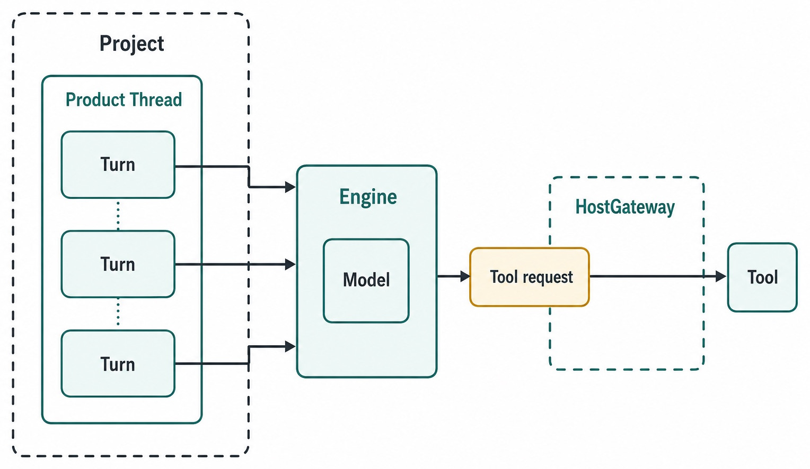
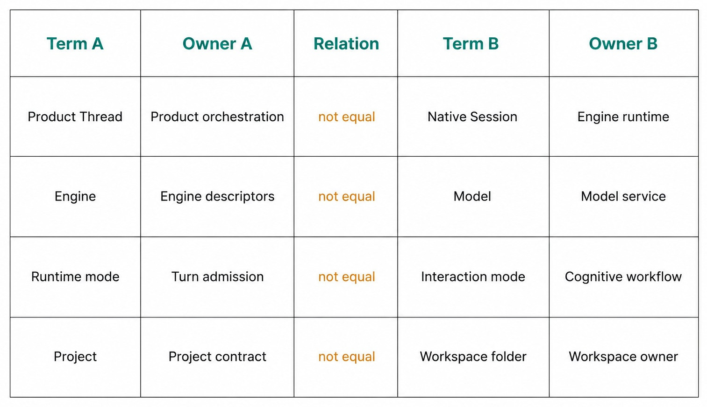

# Chapter 5 — The Vocabulary of Haros {#chapter-05}

## The question

When Sam says, “The project session used the model tool in plan mode,” nearly every noun is
ambiguous. Did “project” mean a folder, a persisted Product, or all work on a feature? Did “session”
mean the Product Thread or the Engine's native process? Was “plan mode” a permission policy or an
interaction workflow? Imprecise vocabulary makes bugs hard to assign and recovery easy to overclaim.

This chapter establishes the contract-backed vocabulary for the pinned edition. The shortest model
is:

> A **Project** supplies workspace context for **Product Threads**. A Thread contains messages and
> ordered **Turns**. Each admitted Turn binds an **Engine**, **model**, runtime mode, and interaction
> mode. An Engine may request a **tool**, but HostGateway and the capability owner authorize it. A
> native **Session** belongs to the Engine and is never the Product Thread.

_Figure 5.1 — The core nouns form an ownership map, not a stack of synonyms._

**Accessible equivalent.** A Project supplies workspace context for Threads; a Thread contains ordered Turns; each admitted Turn binds an Engine and model; tool use remains a separately authorized capability.

## The current glossary

| Term             | Contract-backed meaning                                                                             | Owner                                         | Common confusion                 |
| ---------------- | --------------------------------------------------------------------------------------------------- | --------------------------------------------- | -------------------------------- |
| Project          | Persisted product context with kind, title, workspace root, defaults, and lifecycle                 | Product Orchestration/project contract        | The folder alone                 |
| Workspace folder | Filesystem root used for work                                                                       | Workspace/file owner                          | The whole Project record         |
| Product Thread   | Durable line of conversation and work inside product orchestration                                  | Product Orchestration                         | Native Engine Session            |
| Message          | User, assistant, or system content with role, text, attachments, provenance, and optional Turn link | Message/event contract                        | The complete execution unit      |
| Turn             | One admitted user-to-response course with exact execution binding                                   | Turn lifecycle/orchestration                  | A message or whole Thread        |
| Timeline         | Product projection of messages, activities, outcomes, and provenance                                | Product events/read models                    | Raw Engine log or event store    |
| Queue            | Preserved admitted follow-up intent awaiting eligible promotion                                     | Queue/promotion owner                         | A client-only draft list         |
| Engine           | Complete agent runtime selected to execute work                                                     | `ENGINE_DESCRIPTORS` plus adapter/runtime     | Model service or product surface |
| Model            | Exact model identity selected within an Engine binding                                              | Engine/model-service domain                   | Engine itself                    |
| Native Session   | Runtime-private continuity owned by one Engine                                                      | Engine adapter/runtime                        | Product Thread                   |
| Tool             | Typed capability an Engine can request for an exact turn                                            | HostGateway catalog and real capability owner | Ambient Engine power             |
| Runtime mode     | Permission/sandbox posture: approval-required, auto, or full-access                                 | Turn admission/runtime policy                 | Interaction workflow             |
| Interaction mode | Cognitive workflow: default, plan, debug, converge, or learn                                        | Engine interaction-mode contract              | Permission level                 |
| Surface          | Agent, Chat, or Studio presentation derived from Project kind                                       | Product-surface projection                    | Engine or runtime mode           |

The table describes current contracts, but it does not turn the Guidebook into their owner. If the
contract changes, a later edition must re-verify the terms from source. This chapter exists to make
the current relationships readable, not to create a parallel type system.

## Project and workspace folder

A Project is a product record. In the pinned contract it has an identifier, kind, title, workspace
root, optional default Engine selection, scripts, organization fields, and timestamps. The workspace
folder is one important field or lifecycle resource, but it is not the Project by itself.

This distinction matters during Sam's bug fix. The folder tells file and Git services where to
operate. The Project also tells Haros which surface lifecycle applies and which defaults or product
relationships belong to the work. Renaming a folder does not automatically rewrite every Product
fact. Conversely, changing a Project title does not move files.

Project kind currently distinguishes folder-backed `project`, managed `chat`, and isolated
`studio` lifecycles. Agent, Chat, and Studio are product surfaces projected from that fact; they are
not Engines. Chapter 3 explains the workspace choices in detail.

## Product Thread, message, and Turn

A Product Thread is the durable line of work Sam and a reviewer can return to. It holds product
relationships and projects messages, turns, activities, plans, goals, and other Thread-scoped facts.
It is not merely a list of chat bubbles, and it is not the live Engine process.

A message is content with a role and provenance. A user message can be queued or steered and may be
linked to a Turn. An assistant message can stream and settle. System content has a different role.
Messages explain what was said; they do not alone define the execution lifecycle.

A Turn is one admitted response course. Admission binds the Engine selection, exact model,
runtime mode, interaction mode, and relevant options. One Thread contains many Turns over time.
This lets the Timeline answer which binding produced each response without declaring the whole
Thread to be owned by that Engine.

For Sam's task, “Find the missing-default bug” is a user message. Its admitted execution and
response form a Turn. “Run the focused test after the current analysis” may become another Turn,
possibly preserved in Queue first. Both remain in one Product Thread about the bug.

## Queue and Timeline

Queue stores accepted follow-up intent when execution cannot or should not start immediately. A
queued item is not just unsent composer text. It retains the admitted binding so later promotion
does not borrow whatever selector happens to be visible then. Promotion has its own lifecycle and
can be claimed, released, promoted, or cancelled.

Timeline is the product-facing explanation of what happened. It combines messages, tool activity,
turn outcomes, and provenance into a readable projection. It is not the canonical event store and
not a raw Engine log. The Web workbench consumes it; it must not invent missing history to make the
screen look complete.

Queue points forward to preserved work. Timeline points backward to projected facts. They can both
be present in one Thread without being the same list.

| Relationship      | Correct statement                          | Incorrect shortcut               | Failure caused by shortcut                   |
| ----------------- | ------------------------------------------ | -------------------------------- | -------------------------------------------- |
| Project → Thread  | A Project supplies context for Threads     | “The folder is the Thread”       | Workspace and conversation lifecycles blur   |
| Thread → Turn     | One Thread contains many admitted Turns    | “One Thread is one request”      | Provenance cannot vary by Turn               |
| Message → Turn    | A message may be associated with a Turn    | “Every message starts execution” | System/output messages become false commands |
| Queue → Turn      | Queue preserves intent for later promotion | “Queue is an unsent draft”       | Accepted binding can disappear or change     |
| Events → Timeline | Product events project readable history    | “The client Timeline owns truth” | Stale UI becomes a second store              |

## Engine, model, and native Session

An Engine is a complete agent runtime. It can have discovery, models, options, capabilities,
steering behavior, and native-session semantics. Haros uses `ENGINE_DESCRIPTORS` as the sole owner
of Engine identity, display name, registration, capability projection, and Settings discovery.

A model is one exact selection within an Engine. A bare model name may not identify the same
service, options, or capabilities across Engines. That is why the admitted binding includes the
Engine and model rather than treating a model selector as the runtime.

A native Session is continuity private to one Engine. It may have an identifier and runtime state,
but Haros does not equate it with the Product Thread. If Sam switches Engines, the Product Thread
and history can remain while the new Engine starts distinct native execution. No adapter may copy
or fabricate another Engine's Session.

_Figure 5.2 — The highest-cost vocabulary collisions cross different owners and must remain
explicitly unequal._

**Accessible equivalent.** Product Thread is not native Session; Engine is not model; runtime mode is not interaction mode; Project is not merely its workspace folder.

## Tool and HostGateway

A tool is not a magical ability attached to an Engine name. It is a typed capability that the
Engine can request for an exact admitted turn. HostGateway owns the catalog and authorization
boundary. The real file, Git, terminal, browser, or device service remains the capability owner.

This vocabulary keeps authority traceable. “The Engine edited a file” is convenient shorthand, but
the precise statement is: the Engine requested a file operation for the active Turn, HostGateway
resolved authorization, and the file capability performed or rejected it. Receipts and Timeline
activities preserve the result.

Engine adapters must not implement parallel permission, cancellation, timeout, idempotency, or
receipt systems. If each adapter defined “tool” independently, Sam could not predict whether the
same visible request had the same safety boundary.

## Runtime mode and interaction mode

Runtime mode controls execution authority. The pinned contract exposes `approval-required`, `auto`,
and `full-access`, with a current default defined in source. Exact behavior still depends on the
admitted Engine and HostGateway policy. A runtime mode does not grant capabilities that do not
exist, and a surface does not silently select a permission mode.

Interaction mode controls the cognitive workflow. The current modes are `default`, `plan`, `debug`,
`converge`, and `learn`. Plan mode changes how the Engine approaches and presents work; it is not a
sandbox. Debug mode does not automatically authorize terminal commands. Full-access does not mean
the Engine is in a particular reasoning workflow.

“Mode” without its qualifier is therefore unsafe in documentation and bug reports. Say runtime
mode or interaction mode and include the current value.

| Collision                        | Owner A                    | Owner B                     | Decisive question                                      |
| -------------------------------- | -------------------------- | --------------------------- | ------------------------------------------------------ |
| Product Thread vs native Session | Product Orchestration      | Engine runtime              | Does this fact survive a different Engine?             |
| Engine vs model                  | Descriptor/adapter runtime | Model-service domain        | Is it the complete runtime or one model selection?     |
| Runtime vs interaction mode      | Admission/authority policy | Cognitive workflow contract | Does it change permission or approach?                 |
| Project vs workspace folder      | Product contract           | Filesystem/workspace owner  | Is it the product record or its file root?             |
| Timeline vs Engine log           | Product read model         | Engine-private diagnostics  | Is it user-visible product history or protocol detail? |

## What can go wrong

### Session confusion during recovery

Sam sees the Product Thread after restart and says, “The Session resumed.” That claim is unsupported.
The product history resumed being visible. Startup reconciliation may have settled the old runtime
as interrupted. A new native Session may begin later.

### Model confusion during admission

A selector displays the same model label under two Engines, so code compares only the label. That
can erase options, service identity, and capability differences. Preserve the complete Engine
selection.

### Tool confusion during failure

An operation is denied, and an adapter tries another direct path. That bypasses the canonical
authority owner. The correct result is a visible denial, revised scope, or explicit user decision.

### Mode confusion during review

A teammate hears “plan mode” and assumes no files could change. Interaction mode describes workflow,
not authority. Review the admitted runtime mode and actual receipts.

| Failure                      | Preserved fact                            | Correct recovery                          | Forbidden claim                       |
| ---------------------------- | ----------------------------------------- | ----------------------------------------- | ------------------------------------- |
| Engine process dies          | Product Thread, messages, Timeline, Queue | Reconcile and start bounded new execution | Native Session continued              |
| Model unavailable            | Admitted Engine/model binding and prompt  | Explicit reselection or retry             | Equivalent model silently substituted |
| Tool denied                  | Request provenance and product work       | Narrow request, approve, or cancel        | Engine has ambient authority          |
| Runtime/interaction mismatch | Both admitted mode values                 | Correct the intended value explicitly     | One “mode” implies the other          |
| Workspace moved              | Project record and visible failure        | Repair Project/workspace mapping          | Folder and Project are identical      |

## Translate bug reports into owner language

Vocabulary earns its keep when a report is unclear. “My session lost the project” should become two
questions: Is the Product Thread or Project association missing from product state? Or did a native
Engine Session end while the Project and Thread remain? The first points to orchestration or
projection; the second may be expected execution failure followed by recovery.

“The model could not use the terminal” also splits. Was the selected Engine incapable of projecting
that tool? Did runtime mode require approval? Did HostGateway reject the exact-turn request? Did the
terminal owner fail to start a process? A model rarely owns any of those facts. Naming the layer
turns a vague complaint into a focused investigation.

“Plan mode changed my permissions” requires checking two admitted fields. Perhaps the user also
changed runtime mode, or perhaps the UI projected them incorrectly. Interaction mode alone should
not redefine approval posture. A useful report records both values and the capability request that
behaved unexpectedly.

“The queued message used the wrong model” needs admission timing. If the item ran under the model
captured when it was queued, the product preserved intent. If it borrowed the selector visible at
promotion time, the product rewrote accepted work. The nouns identify exactly which timestamp and
owner matter.

Contributors should use the same discipline in code review. A variable called `session` is
insufficient when both Product Thread and native Engine Session are in scope. A “provider list” is
dangerous if it actually registers complete Engines. A “project path” should not carry Product
identity implicitly. Precise names reduce the chance that a future refactor moves responsibility
across an ownership boundary by accident.

For readers, the practical rule is simple: when a sentence contains “project,” “session,” “mode,”
or “model,” ask whether a more exact term changes who owns the fact. If it does, rewrite the
sentence before acting on it.

## Try it safely

Use the disposable bug fixture and write one sentence for every noun before execution: Project,
workspace folder, Product Thread, message, Turn, Queue, Timeline, Engine, model, native Session,
tool, runtime mode, and interaction mode. Then classify the focused test request.

The expected observable result is a precise statement such as: “In the fixture Project rooted at
this workspace folder, Sam submits a user message in one Product Thread. Haros admits a Turn for the
selected Engine/model under explicit runtime and interaction modes. The Engine requests a terminal
tool through HostGateway. Timeline projects its result. The Engine's native Session remains a
separate runtime fact.”

Do not open private Engine directories or use real credentials. This is a language and contract
exercise, not a state-migration test.

## Recap

1. A Project is a product record; its workspace folder is one owned resource.
2. A Product Thread contains messages and Turns but is never a native Engine Session.
3. Each Turn admits an exact Engine/model and mode binding.
4. Queue preserves future intent; Timeline projects what happened.
5. Tools cross HostGateway authority; runtime and interaction modes change different facts.

## Check your model

1. **What survives an Engine change: Product Thread or native Session?**  
   Product Thread history can survive. Haros does not transfer or fabricate native Session
   continuity.

2. **Why is a model not an Engine?**  
   The Engine is the complete runtime with adapter, capabilities, discovery, and session behavior;
   the model is one selection within its binding.

3. **Does plan interaction mode mean file writes require approval?**  
   Not by itself. Approval belongs to runtime mode and capability authorization. Interaction mode
   changes the cognitive workflow.

## Source trail

- `packages/contracts/src/project.ts` owns `ProjectKind` and project/file capability contracts.
- `packages/contracts/src/orchestration.ts` owns Project, message, Turn binding, Engine selection,
  runtime mode, interaction mode, Session, Queue, and projection schemas.
- `docs/architecture.md`, “Product orchestration,” owns Project, Thread, Queue, Timeline, and
  recovery as product facts.
- `docs/architecture.md`, “Engines,” separates complete runtimes and native Sessions from Product
  Threads.
- `docs/architecture.md`, “HostGateway,” owns exact-turn local capability authorization.

<!-- guide-navigation:start -->

[Guidebook contents](../README.md) · [Previous: Your First Complete Task](04-your-first-complete-task.md) · [Next: Local-First, Explained Precisely](06-local-first-explained-precisely.md)

<!-- guide-navigation:end -->
