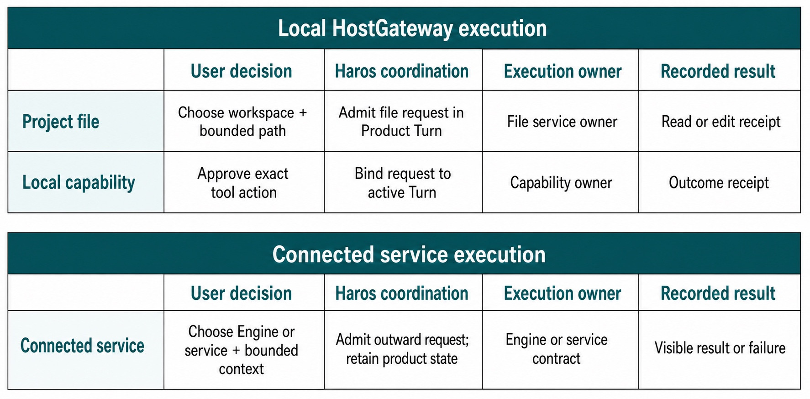
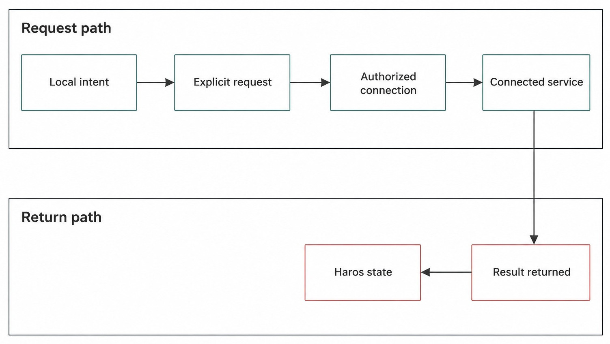
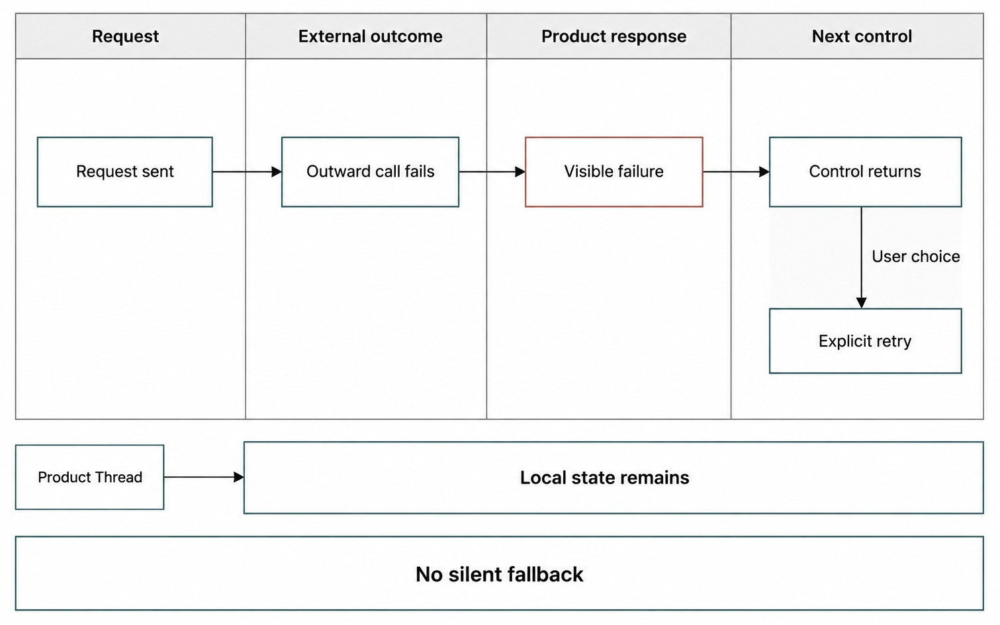

# Chapter 6 — Local-First, Explained Precisely {#chapter-06}

## The question

When Haros says “local-first,” what remains on your machine, what may connect outward, and who
authorizes the boundary crossing? The precise answer is:

> Haros owns its product state locally and works from explicit local workspace boundaries. It may
> use connected Engines, model services, browser resources, or other services only through explicit
> requests and their real authorization paths. Local-first is not offline-only, network-proof,
> secret-free, or automatic permission.

For Sam's running bug fix, the Project record, Product Thread, Queue, Timeline, and selected fixture
remain local product facts. The repository files stay in the chosen workspace. A connected model or
web request may receive the bounded data required for an admitted action. That outward action does
not transfer ownership of the Product Thread or silently upload the whole Project.

_Figure 6.1 — Local-first starts with machine-local product and workspace boundaries; outward work
begins at an explicit request and authority boundary, not at raw Project files._

**Accessible equivalent.** In the Local HostGateway execution band, a project-file request starts with a chosen workspace and bounded path, is admitted in a Product Turn, reaches the file-service owner, and returns a read or edit receipt. A local-capability request requires approval, binds to the active Turn, reaches the capability owner, and returns an outcome receipt. In the separate Connected service execution band, Haros admits an outward request while retaining product state, but the execution owner is an Engine or service contract, never HostGateway.

## Four boundaries, not one slogan

Local-first becomes useful when separated into four questions.

1. **State ownership:** where do Projects, Threads, Queue, Timeline, and recovery live?
2. **Workspace ownership:** which folder or managed workspace may local capabilities address?
3. **Execution location:** is the selected Engine or model local, connected, or mixed?
4. **Capability authority:** who decides whether files, Git, terminal, browser, or device operations
   may run for this turn?

The first two are central local-first product commitments. The third varies by explicit selection.
The fourth remains with HostGateway and the real capability services. Conflating them produces two
bad claims: “local product state means no network can be used,” and “a connected model means the
whole product moved to the cloud.” Neither follows.

| Boundary           | Local owner                                             | Possible outward edge                                       | What the edge does not transfer       |
| ------------------ | ------------------------------------------------------- | ----------------------------------------------------------- | ------------------------------------- |
| Product state      | Haros persistence/orchestration                         | Synchronization or service request when explicitly designed | Product Thread ownership              |
| Project files      | Chosen or managed workspace plus file services          | Bounded content supplied to an admitted operation           | Entire folder by default              |
| Engine execution   | Selected Engine/adapter                                 | Model service or runtime protocol                           | Authority over Product Queue/Timeline |
| Local capabilities | HostGateway and file/Git/terminal/browser/device owners | Tool-specific network or device action                      | Ambient system access                 |
| Credentials        | Credential owner/private configuration                  | Authentication to intended service                          | Secret values in Web projections      |

## What stays on your machine

Product state is owned by Haros persistence. Projects and their workspace references, Product
Threads, messages, turns, Queue, Timeline projections, and recovery facts are not delegated to an
Engine's private native Session. The Web workbench receives typed projections and does not parse
private Engine configuration or maintain a duplicate store.

Built-in Engine global and project-local state uses Haros-owned paths. Other Engines retain their
own private configuration and session state. Haros must not treat those private directories as a
convenient shared database, nor should tests read, migrate, rewrite, or delete real user Engine
state.

Project files follow their workspace lifecycle. Agent uses a user-chosen folder. Chat uses a
Haros-managed workspace. Studio uses an isolated managed workspace with an output boundary. Local
files are not attachments automatically copied to every Engine or service. An operation identifies
a root and a bounded path, and preview or edit capabilities enforce their contracts.

For Sam, this means the fixture's source file remains a file in the selected Project. The assistant
message describing it is not a second authoritative copy. If an Engine reads the file, it receives
content through an admitted capability path. If the Engine stops, the file and product history do
not become native-session data.

## What may connect outward

Haros can use connected model services, interactive browser resources, agent web access, external
MCP services, source-control hosting, and other integrations when the relevant product action and
configuration permit them. Each is a different edge. “Network access” is not one global capability
that erases purpose, target, or authority.

A connected Engine may send the admitted prompt and selected context to its model service according
to that Engine's contract. A browser action may request a specific page. An external MCP tool may
invoke a named remote capability. Git hosting may use an authenticated command for a repository.
The visible product should make the type of operation and its provenance understandable.

Local-first requires minimization. Sam's focused missing-default bug does not justify sending the
home directory, unrelated repositories, credential files, or private Engine state. Supply only the
source context needed to answer or execute the admitted turn. A broad request remains broad even
when initiated from a local application.

_Figure 6.2 — Outward use is a bounded round trip with separate request and return paths; it is not
an ambient synchronization loop._

**Accessible equivalent.** Local intent becomes an explicit request, crosses an authorized connection to a connected service, and returns a result to Haros state. The connection is neither ambient nor evidence that all work leaves the machine.

## HostGateway and local authority

HostGateway owns the catalog and authorization boundary for local system capabilities. An Engine
adapter sees a typed projection appropriate to the turn; it does not receive ambient file, terminal,
Git, browser, or device authority. Exact-turn session leases and operation records let the product
bind requests to the active work and recover interrupted operations.

The underlying capability remains the real owner. File services enforce workspace-relative paths
and file contracts. Git services operate on repository state. Terminal services own processes and
shutdown. Browser and device services have their own target and approval rules. HostGateway
coordinates authorization and receipts without replacing those implementations.

This distinction protects local-first semantics in both directions. It prevents a connected Engine
from reaching arbitrary local state, and it prevents local UI code from inventing remote success.
The adapter can request; the boundary can approve, reject, cancel, or time out; the product records
the outcome.

| Operation                | Explicit input                              | Authority/owner                            | Evidence to review                   |
| ------------------------ | ------------------------------------------- | ------------------------------------------ | ------------------------------------ |
| Read fixture file        | Project root and bounded relative path      | File service through HostGateway           | Read activity and referenced path    |
| Edit fallback branch     | Expected file/version and new content       | File service through exact-turn authority  | Diff/version result                  |
| Run focused test         | Command, working directory, runtime context | Terminal/process owner through HostGateway | Output, exit status, receipt         |
| Fetch connected resource | Intended URL/service request                | Browser/web or external service owner      | Target, result, failure provenance   |
| Change Engine/model      | Explicit admitted selection                 | Product admission plus Engine adapter      | Timeline binding and startup outcome |

“Full access” runtime mode does not abolish these owners. It changes approval posture within the
admitted policy; it does not grant a nonexistent tool, move a workspace root, or authorize an Engine
to read another Engine's private directory.

## Credentials and credential-blind projections

Local-first is not the claim that no credential exists. Connected services often require one. The
important rules are ownership, exposure, and use. Credentials remain with their designated private
owner. The Web workbench receives credential-blind readiness or capability projections, not secret
values. Engine and service layers use credentials only for the intended request.

Do not paste secrets into prompts, logs, screenshots, chapter examples, test fixtures, or error
messages. Do not copy private configuration into a shared Project to make an integration easier.
When an authentication failure occurs, report the service and failure class without reproducing the
secret or an identifying raw response.

Sam's bug exercise needs no credentials. If an Engine selection normally uses a connected model,
that configuration is already outside the fixture. The exercise must not inspect it. The observable
evidence is whether the admitted turn starts or fails, not the content of private configuration.

## Failure semantics at the boundary

An outward request can be denied before sending, fail authentication, time out, lose connection, or
return an invalid response. The correct behavior is explicit failure and restored control. Product
state remains available for review. Haros does not silently select another service or pretend the
same native Session continued.

_Figure 6.3 — Connected-service failure is a visible product outcome; retry is explicit and local
state does not depend on a hidden fallback._

**Accessible equivalent.** When an outward request fails, Haros reports failure and returns control. Local state remains, and the product does not silently substitute another service.

If the failure occurs before a turn starts, the prompt and admitted selection can remain for a
recovery choice. If a tool operation fails during a turn, Timeline and receipts identify the
attempt. If the process dies while waiting on a connected service, startup recovery must settle work
that a dead runtime cannot advance. None of these paths implies rollback of completed local effects.

| Failure                 | Local fact preserved                          | Visible settlement                             | Not promised                                    |
| ----------------------- | --------------------------------------------- | ---------------------------------------------- | ----------------------------------------------- |
| Authorization denied    | Prompt, Thread, request provenance            | Denied/cancelled operation                     | Permission bypass                               |
| Authentication rejected | Product context and exact service selection   | Explicit service failure                       | Secret disclosure or fallback account           |
| Connection timeout      | Queue/Timeline and known operation state      | Timeout, cancellation, or later reconciliation | Unknown remote effect is automatically reversed |
| Engine launch failure   | Prompt and admitted Engine/model binding      | Start failure and recovery choice              | Another Engine silently starts                  |
| Server interruption     | Product events and local effects already made | Startup reconciliation and control return      | Native Session continuation                     |

## What local-first does not promise

It does not promise offline execution. A selected connected model cannot answer without its service.
It does not promise that local files never leave the machine; an explicit request may send bounded
content to a connected service. It does not promise automatic encryption, backup, or synchronization
for every workspace. It does not promise that a plugin or external tool is trustworthy merely
because Haros invoked it.

It also does not promise anonymity. A connected service may observe account, network, or request
metadata according to its own contract. Haros must keep the boundary explicit, but users and
maintainers still evaluate the service and data supplied.

Finally, local-first is not a migration license. Haros does not read, rewrite, or delete retired
product namespaces or another Engine's private state to present a unified story. Stable machine
contracts remain implementation facts and are touched only under their real owners and explicit
migration authority.

## Apply the boundary to Sam's task

Before the run, Sam identifies the fixture root and checks status locally. The prompt contains the
bug description, not the entire repository. The admitted Engine/model selection is visible. When the
Engine requests the relevant source file, HostGateway and the file service constrain the read. When
it requests the focused test, the terminal owner runs it in the selected workspace.

If the Engine uses a connected model, only the admitted prompt and required projected context cross
that service boundary. The Product Thread, Queue, Timeline, and repository ownership remain in
Haros. If the service fails, Sam receives a visible failure and can retry explicitly or select
different execution after settlement.

The final review is local: inspect the diff and test evidence in the Project. A connected assistant
summary does not replace those facts. This is the practical meaning of “local-first workbench”: the
user retains an inspectable local center of gravity even when selected execution reaches outward.

## Build a minimum-context envelope

Before any connected request, identify the smallest context envelope that can answer the question.
For Sam's bug, it may contain the failing assertion, the responsible function, and a short statement
of expected behavior. It should not contain unrelated modules, Git credentials, home-directory
paths, or private Engine configuration.

The envelope is not necessarily one blob. Haros may project a prompt, approved file reads, tool
results, or annotations at different points in the Turn. Each contribution should have a reason and
an owner. “The model might need it” is not sufficient justification for sending broad state
preemptively.

Minimization also improves correctness. Extra files can introduce stale alternatives, generated
outputs, or similarly named owners that distract execution. A precise workspace root and focused
source anchors give the Engine a clearer problem. Security and quality align: send less, but send
the right evidence.

When a connected service returns, treat the result as input to local product work. It may be an
assistant response, search evidence, or remote tool outcome. Haros projects provenance and the user
reviews effects locally. The service result does not become an owner of the Product Thread or an
automatic command to mutate files.

### Repeated outward work stays explicit

A retry, pagination request, redirected browser action, or follow-up model turn is another boundary
crossing even when it belongs to the same Product Turn. The implementation may manage protocol
details efficiently, but authority and target remain bounded. Cancellation should stop future work
where the protocol allows and report uncertainty where a remote outcome cannot be known.

Automations make this especially important. A schedule is not standing permission for arbitrary
future data access. Each run has an execution environment, admitted context, and failure policy. A
future chapter covers automation in detail; the local-first rule already applies: product ownership
remains local, connected edges are explicit, and credentials remain with their owners.

## Try it safely

Use a synthetic Project and draw two columns on paper: “stays local” and “crosses only if requested.”
Place Project record, Product Thread, Queue, Timeline, fixture files, Engine/model request, focused
file content, and test output in the correct column. For every outward item, name the explicit
request, intended service, minimum data, authority owner, and visible failure result.

Then run only the harmless local focused test, or stop at the classification exercise if a connected
service is unnecessary. The observable result is a truthful boundary explanation and a local diff/
test review. Never use real credentials, production services, private Engine state, or broad home
directories.

## Recap

1. Haros product state and workspace ownership form the local center of gravity.
2. Connected Engines and services are explicit edges, not product-state owners.
3. HostGateway and real capability services authorize exact-turn local operations.
4. Credentials stay with private owners and the Web workbench receives credential-blind projections.
5. Outward failure is visible; local state remains and fallback or retry is never silently invented.

## Check your model

1. **Does local-first mean Haros never sends data to a network service?**  
   No. An explicit connected operation may send bounded required data. Product and workspace
   ownership remain local and the edge must be truthful.

2. **Can a connected Engine directly read any file because the user selected full access?**  
   No. Runtime mode does not erase workspace, HostGateway, capability, or exact-turn boundaries.

3. **What remains when an outward call fails?**  
   Product Thread, prompt, Queue/Timeline, local files, and known receipts can remain. Haros returns
   a visible failure and control without silently substituting a service.

## Source trail

- `README.md`, “What the Harness OS owns,” states the public local-first, built-in-tool, recovery, and replaceable-
  execution promises.
- `docs/architecture.md`, “State boundaries,” identifies Haros product state, Engine-private state,
  and the prohibition on importing retired namespaces.
- `docs/architecture.md`, “HostGateway,” owns catalog and authorization for local capabilities.
- `apps/server/src/hostGateway/mcpInjection.ts` and `sessionLease.ts` implement typed tool exposure
  and exact-turn lease boundaries.
- `apps/server/src/externalMcp/Layers/ExternalMcpGateway.ts` is a current connected-service boundary,
  not a second Product Thread owner.
- `packages/contracts/src/project.ts` owns bounded project file inputs and workspace-relative access.

<!-- guide-navigation:start -->

[Guidebook contents](../README.md) · [Previous: The Vocabulary of Haros](05-the-vocabulary-of-haros.md) · [Next: First-Run Setup](../part-02-workbench/07-first-run-setup.md)

<!-- guide-navigation:end -->
