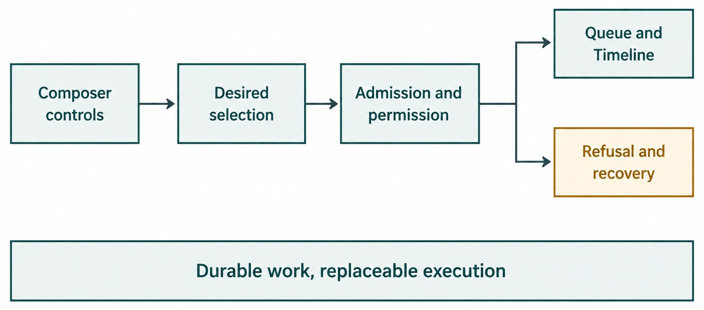
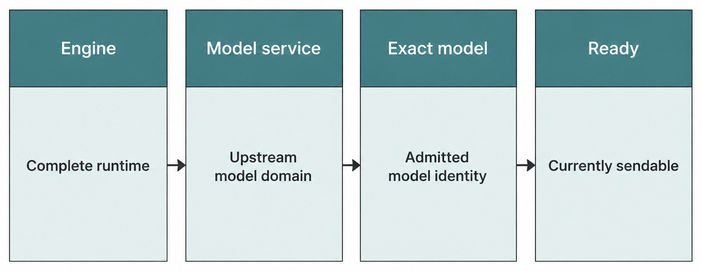
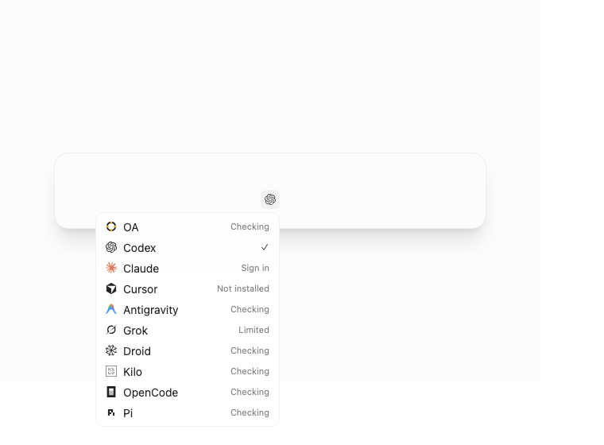
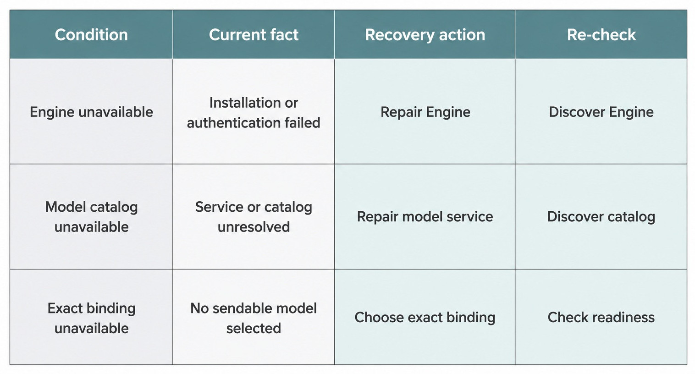
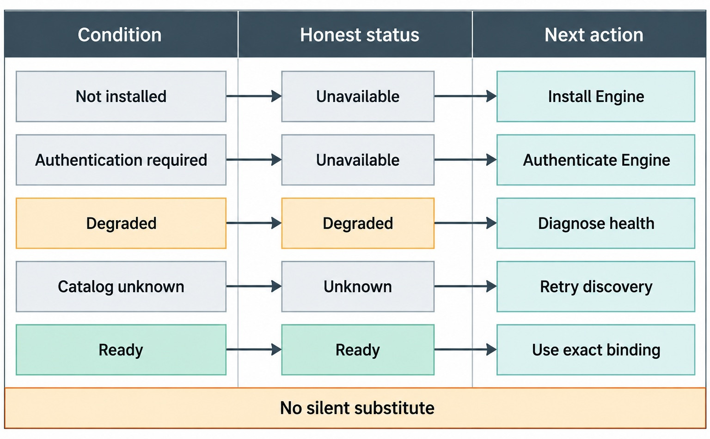

# Chapter 7 — First-Run Setup {#chapter-07}

Current source correction: a welcome tour lives in `apps/web/src/onboarding/**`. It can show on a
fresh install with no ordinary projects, and Settings can replay it. Fresh installs default to Pi
with DeepSeek as the model service. The tour never silently freezes a model. Engine and exact-model
readiness still live in Settings, the
Composer, and `resolveEngineExecutionCapabilities`. AppSnap welcome remains a separate optional
overlay, not Engine setup. The older first-run _readiness_ dialog that guessed a default Engine is
retired; treat those dialog states below as historical edition evidence for readiness layers, not
as current product UI.

## The question

What does Haros actually need before it can send useful work? It needs a complete **Engine**, a
usable exact model binding, and enough current health information to say that the binding is ready.
For Haros's built-in Engine, a configured model service may also be part of that path. These are
separate layers. “The app opened” is not the same as “this exact request can run.”

The pinned edition described a setup dialog as a truthful readiness check rather than a ceremonial
welcome screen. That readiness dialog is gone. The current welcome tour is optional setup, not
admission. The same layers still apply at send time: Haros derives readiness from settled discovery
facts and remembered exact bindings, and it never treats an Engine name, a model-service
connection, or a model family label as a complete executable choice.

_Part II opener — Durable work remains product-owned while exact selection, permission, admission,
and recovery keep replaceable execution truthful._

**Accessible equivalent.** Composer controls produce a desired selection. Admission and permission then branch either to Queue plus Timeline or to explicit refusal plus recovery.

_Figure 7.1 — Readiness is a resolved binding, not a hopeful label._

**Accessible equivalent.** ENGINE is the complete runtime. MODEL SERVICE is the upstream model domain. EXACT MODEL is the admitted identity. READY means currently sendable.

## The plain-English model

Think of setup as answering four increasingly precise questions. Which complete runtime will do the
work? If that runtime uses separately configured model services, which service can supply models?
Which exact model is selected? Do current discovery and health facts support sending now? Haros asks
in that order because each answer narrows the next one.

| Layer         | Question it answers                                          | Current owner                                  | What it does not prove                           |
| ------------- | ------------------------------------------------------------ | ---------------------------------------------- | ------------------------------------------------ |
| Engine        | Which complete agent runtime executes?                       | `ENGINE_DESCRIPTORS`, adapter registry, health | That credentials, catalog, or a model are usable |
| Model service | Which upstream model source is configured inside the Engine? | Engine-owned model-service subsystem           | That an exact model was selected                 |
| Exact model   | Which model slug is bound to the request?                    | `EngineSelection` and discovered catalog       | That the Engine is healthy at this moment        |
| Readiness     | Can this exact binding be admitted now?                      | readiness and capability projections           | A permanent guarantee about the next request     |

An Engine is not a Provider. “Provider” is accurate only inside a model-service or search-service
domain. It does not name the top-level runtime. This distinction prevents a common setup error:
configuring an upstream API and assuming the surrounding runtime, tools, permissions, and session
behavior have also been configured.

## See it in Haros

Fresh installs open the workbench directly. Haros still gathers credential-blind product facts.
The Engine picker derives its entries from the canonical descriptor owner. Health discovery reports
whether a runtime is installed, authenticated, ready, degraded, or not yet known. Model discovery
produces options for the selected Engine. Settings and the Composer ask for an exact model where
required and retain a usable remembered binding.

_Product capture — The production Engine picker exposes availability and recovery entry points from
sanitized synthetic discovery state._

The pinned edition's readiness state is deliberately conservative:

| State                   | Meaning                                                                | Useful next action                              | Silent behavior forbidden                                   |
| ----------------------- | ---------------------------------------------------------------------- | ----------------------------------------------- | ----------------------------------------------------------- |
| `first-run`             | Facts are settled and no usable binding exists                         | Configure or choose a binding                   | Guess an Engine or model                                    |
| `deferred`              | Initial setup was postponed                                            | Return to setup before sending                  | Pretend deferred means ready                                |
| `ready`                 | At least one exact binding is proven usable                            | Continue to the workbench                       | Re-open setup merely because another service is unavailable |
| `recover-engine`        | A remembered independent Engine binding exists but is not usable       | Repair install/auth/health or choose explicitly | Substitute a different Engine                               |
| `recover-model-service` | A remembered built-in binding or configured service needs recovery     | Repair the service or exact model               | Treat service presence as an exact binding                  |
| `unknown`               | Discovery is not settled or transport/capability facts are unavailable | Wait, retry discovery, or diagnose transport    | Convert uncertainty into success or failure                 |

The important detail is that a proven sendable binding wins. If one independent Engine can already
send, an unrelated model-service problem does not block the entire workbench. Conversely, a
remembered choice is not enough when current health says it cannot run.

## One bug-fix journey

Our running reader, Maya, opens a local repository and intends to ask Haros to diagnose a failing
date parser test. She first chooses an Engine. That choice names a complete runtime, including the
adapter that translates an admitted Haros turn into native execution. She then chooses an exact
model from that Engine's credential-blind catalog. The selection contains both `engine` and `model`;
the UI does not store only a friendly model caption.

Before she sends, the workbench checks current availability. If the Engine is not installed, Settings
and the Composer explain that condition. If authentication is required, it remains an explicit
recovery task. If health is degraded or still unknown, Haros does not invent a green “ready” state.
Maya can repair the selected path or deliberately choose another ready binding. What Haros cannot do
is silently move the prompt to another Engine or model, because that would change the executor after
the user made a choice.

Once ready, Maya's selection becomes the candidate binding for the Composer. Admission later freezes
the exact Engine, model, runtime mode, interaction mode, and applicable options for the turn.
Choosing a valid binding prepared admission; it did not execute anything or grant capability
authority.

_Figure 7.2 — Recovery is explicit and bounded; readiness never comes from silent substitution._

**Accessible equivalent.** An unavailable Engine maps to Repair Engine and then Discover Engine; an unavailable model catalog maps to Repair model service and then Discover catalog; an unavailable exact binding maps to Choose exact binding and then Check readiness. Each recovery stays in its own row and returns through the owner-specific re-check.

## How it works

`ENGINE_DESCRIPTORS` owns the exhaustive credential-blind identity and display information for
top-level Engines. The Web does not maintain another Engine list in Settings or the Composer.
Engine status and model catalog hooks add current facts without becoming new identity owners.
This lets Settings and the Composer project the same Engine vocabulary.

The pinned edition derived first-run state in `deriveFirstRunReadinessState`. That owner is
removed. Current send-time ordering still matters: a usable exact binding is ready before
unrelated model-service state is considered; unsettled facts stay unknown; Engine recovery,
model-service recovery, and a missing binding remain distinct.

At execution time, `resolveEngineExecutionCapabilities` combines the exact selection, registered
adapter capabilities, and Engine health. Missing adapters are unavailable. Not-installed and
unauthenticated Engines are unavailable. Warnings and uncertain authentication are degraded.
Runtime and interaction modes may also be unavailable even when the base Engine is healthy. This is
why setup and send admission are related but not identical gates.

| Fact                               | Sole owner                           | Consumer                            | Forbidden duplicate                 |
| ---------------------------------- | ------------------------------------ | ----------------------------------- | ----------------------------------- |
| Engine identity and display name   | `ENGINE_DESCRIPTORS`                 | Settings, Composer, selectors       | Component-local Engine arrays       |
| Native availability/authentication | Engine health and discovery services | readiness and capability projection | UI guesses from installed files     |
| Exact model options                | Engine model catalog projection      | Settings and Composer               | Hand-maintained global model list   |
| Selected exact binding             | typed `EngineSelection`              | admission and provenance            | Caption-only or Provider-only state |
| Local capability authority         | HostGateway                          | admitted execution                  | Settings or Composer granting tools |

## Make a readiness decision explainable

A useful readiness result should answer two questions at once: **what fact is missing?** and **who
can repair it?** “Not ready” is too broad. A missing Engine installation needs an Engine recovery
path. An authentication requirement belongs to that Engine's sign-in path. An unavailable model
catalog points to discovery or model-service recovery. A catalog that loaded successfully but has
no selected model needs a user choice. These cases may look similar from the Send button, yet they
require different actions and must not share a silent fallback.

Read the decision from the narrowest fact outward. First ask whether a remembered binding names an
Engine and an exact model. Next ask whether the Engine is registered and currently usable. Then ask
whether the exact model is still present in the relevant credential-blind catalog. Finally ask
whether the requested runtime and interaction modes are supported for that binding. A failure at a
later step does not erase earlier intent; it makes the incomplete layer visible.

| Observation                                                  | Safe conclusion                                   | Next check or action                      |
| ------------------------------------------------------------ | ------------------------------------------------- | ----------------------------------------- |
| No remembered exact binding                                  | Setup is incomplete                               | Choose an Engine and exact model          |
| Binding exists; discovery is still unsettled                 | Readiness is unknown                              | Wait or retry bounded discovery           |
| Engine is known but not installed or not authenticated       | That Engine cannot run now                        | Use its explicit install/sign-in recovery |
| Engine is healthy; selected model is absent from catalog     | The old exact binding is unavailable              | Choose a currently advertised model       |
| Binding and health are usable; requested mode is unsupported | The request, not the whole Engine, is unavailable | Change the mode or binding explicitly     |
| All required facts are current and compatible                | The binding is a valid setup candidate            | Continue to Composer admission            |

This order also improves bug reports. “Setup is broken” gives a maintainer no boundary. “The
remembered Engine is healthy, its catalog settled without the selected slug, and readiness entered
model-service recovery” identifies both the observation and the owner without exposing credentials
or private runtime state.

## From a ready binding to the first admitted turn

Selection and admission are adjacent gates, not duplicates. Settings and the Composer establish that
Maya has at least one currently usable candidate binding. The Composer can then add a prompt,
references, options, runtime mode, interaction mode, and dispatch intent. Admission evaluates that
complete request against the latest product and capability state. Time passes between the two
checks, so a binding that was ready in Settings can still be refused at send time.

Consider three short outcomes for the parser task:

1. Maya keeps the same exact binding and sends while health remains current. Admission can accept
   the request and freeze its provenance.
2. Maya's Engine then loses authentication. Admission refuses that exact request, preserves her
   prompt, and points back to Engine recovery. It does not pretend no choice had ever existed.
3. Maya then selects Plan on an Engine that does not support Plan. The Engine may still be generally
   usable, but this request is not. Recovery changes the mode or binding through an explicit
   decision.

The distinction matters after restart as well. Product-owned remembered selection can survive a
process restart. Runtime health must be discovered again. A native Engine's private Session is not
readiness evidence, and its presence cannot replace descriptor, catalog, and capability facts.
Haros reconstructs what the user intended, then re-establishes whether that intent is executable
now.

For review, capture the setup result as a small fact bundle rather than a screenshot alone: edition
commit, Engine kind, exact model slug, credential-blind health state, catalog-settled state, mode
capability, and derived readiness result. The friendly labels explain the choice to a person; the
typed identities and settled facts make it reproducible. No item in that bundle grants filesystem,
terminal, browser, device, or connected-service authority.

### Review a readiness defect from one missing fact

Suppose Maya returns after an update and sees her remembered Engine and model in Settings or the
Composer, but readiness does not settle. Begin with the remembered binding and compare each current
fact in order. The Engine descriptor proves identity, not installation. Adapter registration proves an
integration exists, not that authentication is valid. Health can prove the runtime is usable while
the catalog remains unsettled. The catalog can settle while the remembered exact slug is absent.
Only the complete chain supports the readiness conclusion.

Record the first missing fact and stop. If catalog discovery is still pending, do not diagnose a
missing model. If the catalog has settled without the slug, do not blame transport. If the exact
binding is usable but Plan is unsupported, readiness for ordinary work may still be valid while the
specific planned request is not. Naming the narrow failure keeps recovery attached to its owner.

Now simulate the repair with synthetic state. Let the catalog settle with the remembered slug and
confirm readiness changes without replacing Engine identity. Then remove authentication and confirm
the same binding becomes a recovery clue rather than a sendable choice. Finally restore health and
request an unsupported interaction mode at Composer admission. The remembered binding may still be
complete while that request is refused. These transitions prove that selection, capability, and
admission are related but independent decisions.

The reviewer should finish with one sentence containing the exact boundary: “The selected binding
was remembered, current catalog and health made it usable, and the requested mode was evaluated
later.” If that sentence cannot be supported without private Engine files, copied credentials, or a
screen-local Engine list, the readiness evidence is incomplete.

## What can go wrong

### Discovery stays unknown

The server connection may still be opening, capability negotiation may be incomplete, or a catalog
request may have failed. UNKNOWN is a real state. Retrying a bounded discovery operation is safe;
declaring the Engine ready without evidence is not.

### The Engine is remembered but no longer usable

An upgrade, removed binary, expired login, or changed local configuration can invalidate yesterday's
choice. Haros retains the user's intent as a recovery clue but does not claim current readiness.
Repair the same Engine or choose a different one explicitly.

### A model service exists but no exact model is selected

Service configuration proves that an upstream route may exist. It does not identify the model for
this turn. Select an exact catalog entry. If the catalog is empty or unavailable, diagnose that
condition rather than inventing a default slug.

### Health degrades after setup

Readiness is time-scoped. Send admission can still refuse a later request. The prompt should remain
recoverable, and the error should name the unavailable binding. No fallback Engine or model is
allowed without a new user decision.

_Figure 7.3 — Explicit degraded states preserve the choice needed for honest recovery._

**Accessible equivalent.** Not installed, authentication required, degraded, catalog unknown, and ready remain separate states. No non-ready state permits silent Engine or model substitution.

## Try it safely

Use a fresh task-specific Haros home or the isolated browser fixture. Open Settings or the Composer
and inspect one ready Engine and one unavailable or unknown path. Do not enter real credentials for
this exercise. Confirm three observable results: each Engine comes from the shared descriptor
vocabulary; the model choice is exact rather than a family slogan; and an unavailable binding stays
explicit.

Then return to the Composer without sending. Change the selected Engine and note that its model
catalog changes with it. The exercise proves selection structure, not external service quality. It
must not modify private Engine state or probe paid APIs.

## Recap

1. Opening the workbench is not enough; sending still requires a complete Engine and exact model binding.
2. Model services are internal upstream layers, not top-level Engine identity.
3. Readiness is derived from current settled facts and can be unknown or degraded.
4. Haros never silently substitutes another Engine or model during recovery.
5. Settings and Composer prepare admission; HostGateway still owns local capability authority.

## Check your model

1. **Why is a configured model service not enough?** Because it neither identifies a complete Engine
   nor freezes an exact model for a turn.
2. **What should Haros do when discovery is unsettled?** Show UNKNOWN and keep recovery explicit,
   rather than guessing readiness.
3. **Can Settings or the Composer grant filesystem authority?** No. Exact-turn capability
   authorization belongs to HostGateway later in the execution path.

## Source trail

- `packages/shared/src/engineMetadata.ts` owns `ENGINE_DESCRIPTORS`.
- `docs/architecture.md` records that a welcome tour may exist, but it does not silently choose an
  Engine. AppSnap welcome is not Engine setup.
- `apps/server/src/engine/executionCapabilityProjection.ts` resolves mode capability and health for
  an exact Engine selection.
- Current welcome-tour owners live in `apps/web/src/onboarding/**` and project
  `ENGINE_DESCRIPTORS`; do not restore a second Engine registry.

<!-- guide-navigation:start -->

[Guidebook contents](../README.md) · [Previous: Local-First, Explained Precisely](../part-01-meet-haros/06-local-first-explained-precisely.md) · [Next: Projects and Managed Workspaces](08-projects-and-managed-workspaces.md)

<!-- guide-navigation:end -->
