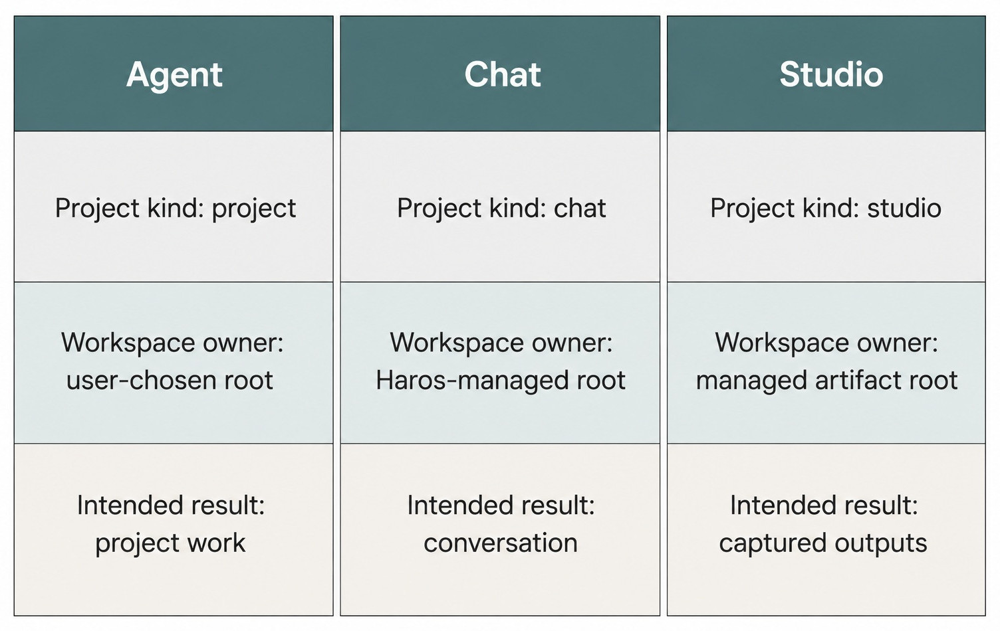
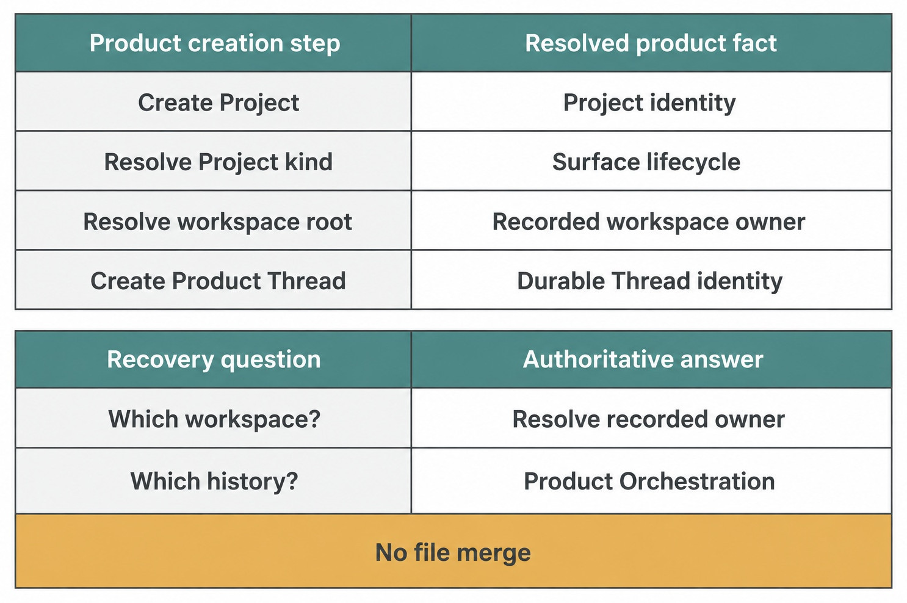

# Chapter 8 — Projects and Managed Workspaces {#chapter-08}

## The question

When Haros says “Project,” where do the files actually live? The answer depends on the Project kind.
Agent work uses a folder you chose. Chat uses a Haros-managed workspace. Studio uses a managed,
artifact-oriented workspace whose isolation and output handling are part of its lifecycle. These are
three workspace homes, not three brands and not three permission levels.

_Figure 8.1 — Workspace identity comes from Project kind; the lanes must not be collapsed._

**Accessible equivalent.** The project kind maps to a user-chosen Agent root, Haros-managed Chat root, or managed Studio artifact root. Their result boundaries remain distinct.

## The plain-English model

A Project is the product record that binds a title, `workspaceRoot`, Project kind, optional default
Engine selection, scripts, and organizational metadata. The kind determines the product surface.
It does not create a separate orchestration store: Threads, Queue, Timeline, and recovery still use
the shared product owner.

| Project kind | Product surface | Workspace lifecycle                          | Accurate promise                                     |
| ------------ | --------------- | -------------------------------------------- | ---------------------------------------------------- |
| `project`    | Agent           | User chooses an existing folder              | Work is rooted in that selected folder               |
| `chat`       | Chat            | Haros creates and manages a workspace        | Conversation can begin without choosing a repository |
| `studio`     | Studio          | Haros manages an artifact-oriented workspace | Outputs are surfaced through Studio's output owner   |

“Managed” does not mean remote, temporary, public, or automatically synchronized. “Isolated” is
also not a universal security claim. It describes Studio's workspace lifecycle, not an escape from
HostGateway authorization or from whatever external services the user deliberately connects.

## One bug-fix journey

Maya has a failing parser test in a repository on disk. She creates or selects an Agent Project and
points it at that repository. Haros does not copy the repository into a hidden chat directory. The
Project's `workspaceRoot` remains the truthful context for file, Git, and terminal operations that
are later admitted.

Before editing, Maya wants to reason about two date-format strategies without touching the
repository. She can open a Chat Project. Haros owns that managed workspace, and the discussion is
durable product work. If the discussion later leads to a patch, she should return to the Agent
Project or create an explicit transition. Renaming the Chat Project or navigating to Agent cannot
turn its managed root into the original repository.

After the fix, Maya needs a self-contained review report. Studio can receive deliberate inputs and
produce captured outputs inside its managed lifecycle. A file becomes a Studio deliverable because
the Studio output owner recognizes it, not merely because some Engine mentioned a path.

## Creation, use, and recovery

_Figure 8.2 — Recovery returns to the workspace owner; it does not search for an interchangeable copy._

**Accessible equivalent.** Project creation resolves kind and workspace root before creating a Product Thread. Workspace ownership stays with its recorded owner; durable Thread state stays with Product Orchestration; recovery does not merge files.

Creation should establish a valid Project record and a usable root before a turn starts. During use,
the root supplies workspace context, while exact tools still pass through capability authorization.
Recovery reconstructs product facts from persistence and reconnects the correct workspace. It does
not infer a new root from a native Engine Session.

| Lifecycle moment | Product fact that survives          | Owner consulted               | Forbidden shortcut                           |
| ---------------- | ----------------------------------- | ----------------------------- | -------------------------------------------- |
| Create           | Project kind and workspace root     | Project creation/persistence  | Derive kind from screen route alone          |
| Open             | Project and Thread identity         | Product projection            | Treat current process directory as authority |
| Execute          | Exact Project/Thread/turn context   | Orchestration and HostGateway | Let adapter choose another root              |
| Restart          | Durable Project and product history | Persistence and recovery      | Import private native Session state          |
| Transition       | Explicit source and destination     | Product transition owner      | Relabel one workspace as another kind        |

## How it works

`ProjectKind` has exactly three values in the pinned edition: `project`, `chat`, and `studio`.
`OrchestrationProject` stores that kind together with the root and other product fields. The shared
`projectKindToProductSurface` projection converts kind to Agent, Chat, or Studio presentation. That
projection prevents a second mutable surface fact from drifting away from the Project.

The default for older absent kind data is deliberately `project`, an existing decoding contract.
It is not permission to add new aliases or dual reads. New guide prose and new product behavior use
the canonical values.

The Web consumes the typed Project projection. It must not discover workspace identity by reading
private Engine directories. The server owns managed workspace creation and cleanup. Capability
services own file operations. Studio's output owner identifies deliverables. These responsibilities
remain separate even when they operate on paths under the same managed root.

| Fact                        | Sole owner                        | Consumer                        | Must not become             |
| --------------------------- | --------------------------------- | ------------------------------- | --------------------------- |
| Project kind and root       | Project contract/persistence      | product surfaces, orchestration | a route-local guess         |
| Surface presentation        | shared product-surface projection | Sidebar and views               | a second stored identity    |
| File authority              | HostGateway and file service      | admitted turn                   | ambient Engine access       |
| Managed workspace lifecycle | server workspace owners           | Chat/Studio                     | user folder mutation policy |
| Studio deliverables         | Studio output owner               | output presentation             | every changed file          |

## Choose the workspace from the intended result

The safest way to choose a Project kind is to begin with the result that must remain truthful. If
the result is a patch in an existing repository, the work needs the repository's real root and
therefore belongs in an Agent Project. If the result is a durable conversation that does not yet
need a chosen folder, Chat supplies a managed home. If the result is an artifact that should be
collected through Studio's output lifecycle, Studio supplies the corresponding managed workspace.

Do not choose by assumed power. Agent is not “the mode with all permissions.” Chat is not “the mode
that forgets.” Studio is not “the secure mode.” Permission comes from runtime policy and
HostGateway, retention comes from product contracts, and security depends on several boundaries.
Project kind answers a narrower question: which workspace lifecycle and product surface own this
line of work?

| Intended outcome                                 | Appropriate home     | Evidence to record                         | Wrong shortcut                        |
| ------------------------------------------------ | -------------------- | ------------------------------------------ | ------------------------------------- |
| Diagnose and edit an existing repository         | Agent Project        | selected root, Project ID, Thread ID       | copy the repository into managed Chat |
| Explore an idea without choosing a user folder   | managed Chat Project | managed root owner and durable Thread      | call the history temporary            |
| Produce a reviewable, collected artifact         | Studio Project       | Studio Project plus recognized deliverable | treat every workspace file as output  |
| Continue earlier discussion while editing a repo | explicit transition  | source context and destination Project     | relabel the Chat root as Agent        |
| Reopen work after process restart                | original Project     | stored kind, root, and product history     | infer home from a native Session      |

For Maya, the decision is easy at first: the parser test and Git history already exist in her
repository, so the patch belongs to an Agent Project rooted there. Her design discussion may happen
in Chat, but a conclusion in that discussion is context, not a file transfer or authorization. If
she later creates a Studio report, the report should identify the repository evidence it summarizes
without pretending the Studio workspace became the repository.

This result-first method scales to contributor reviews. When a bug report says that the “wrong
workspace opened,” ask for four facts: Project ID, Project kind, recorded root, and navigation path.
Then ask which capability tried to use the root. Those facts distinguish an incorrect Project
projection from a file-service authorization failure. A screenshot of the active tab cannot do
that by itself.

## Transitions preserve identity by being explicit

Sometimes the correct workflow crosses surfaces. A Chat discussion may produce a decision worth
implementing in Agent. An Agent task may produce evidence worth packaging in Studio. Haros can make
those transitions useful without pretending the source and destination are one workspace.

An explicit transition should name the source line of work, create or select the destination
Project, carry only the approved context, and leave both histories intelligible. The destination
receives new product identity and its own workspace root. The source remains where it was. A reader
should be able to answer “where did this context come from?” and “which root did the resulting tool
operation target?” without relying on native Engine memory.

Answer transition questions from the owner that can keep the answer true after navigation or
restart. Origin comes from the source Project and Thread, never the current route. File authority
comes from the destination root and HostGateway, never a copied transcript or attachment caption.
The destination Product Thread owns its new Turns; a native Engine Session does not. Studio's
output owner identifies deliverables rather than treating every changed file as published. Product
persistence and recovery determine what survives restart, not the browser's last frame or process
memory.

In Maya's handoff, that means the Chat conclusion is cited as source context, the Agent Turn is
created in the repository-backed destination, and the eventual Studio report is recognized through
Studio's output lifecycle. The three records can be related without sharing one root or native
Session.

The minimum-context rule is practical, not ceremonial. Copying a focused test excerpt or a
confirmed design decision is reviewable. Copying an entire home directory, private Engine profile,
credential store, or unrelated repository history is neither necessary nor authorized. When the
destination needs more evidence, add that evidence deliberately through a supported reference or
capability path.

## Recover the owner before recovering the work

Workspace recovery begins with the stored Project fact. On restart, reconnect the Project ID to its
recorded kind and root, then project its Threads. Only after that should execution readiness and
capability access be re-established. Reversing the order—starting from whatever directory or native
Session an Engine remembers—can attach correct-looking history to the wrong filesystem.

For a missing user-selected folder, the honest state is “Project known, root unavailable.” Haros can
offer a bounded reconnection action, but it should not search unrelated directories or silently
rewrite the root. For a managed Chat or Studio root, the managed-workspace owner diagnoses its own
lifecycle. For a missing Studio output, first determine whether the file exists and then whether the
output owner recognized it; those are two different failures.

A concise recovery record contains the stored Project ID and kind, expected root owner, root
availability, recovered Thread ID, and any explicit transition taken. That record proves the
workspace relationship without exposing private paths in published evidence. It also gives a
reviewer a clean stop condition: if recovery requires guessing, copying private state, or changing
Project kind in place, the workflow has crossed the ownership boundary.

One final mental check helps: imagine the Engine is completely replaced. The Agent Project should
still point to Maya's repository, the Chat Project should still point to its managed home, and the
Studio Project should still know which outputs its owner recognized. A different Engine can change
execution capability, but it cannot redefine those workspace facts. If replacing the Engine would
move a root, merge histories, or publish every file, the design has allowed execution state to own
the Project lifecycle.

### Review a workspace mismatch without moving data

Suppose Maya opens the parser Thread and Haros reports that its repository root is unavailable.
Before reconnecting anything, record the Project ID, `project` kind, expected root owner, and Thread
ID. Confirm that the Product Thread is still present even though file capability cannot reach the
root. This separates durable product recovery from workspace availability.

Next, attach a disposable replacement folder through the supported recovery action in a synthetic
fixture. The action should be explicit and should update only the Project's owned root fact. It must
not import a Chat root, search Maya's home directory, or infer a path from an Engine-native Session.
After reconnection, inspect a harmless file through HostGateway and confirm the capability targets
the recovered Project root.

Run the same reasoning for Studio without reusing the Agent rule. A Studio workspace may be
available while an expected report is absent from the output list. First check whether the file
exists in the managed root; then check whether the Studio output owner recognized it. Changing
Project kind or declaring every file a deliverable would hide which layer failed.

The handoff record should state the original Project fact, the observed availability failure, the
explicit recovery action, and the resulting capability target. It should not copy the private path
into public evidence. A reviewer can then verify that recovery restored access to the correct owner
without changing surface identity, merging histories, or fabricating native continuity.

## What can go wrong

### The selected folder moves or disappears

The Project record may still exist while its root is unavailable. Haros should expose a recovery
condition and let the user reconnect or choose deliberately. It must not search unrelated home
directories, rewrite the root silently, or copy private data into a managed workspace.

### A managed workspace is mistaken for disposable storage

Chat product history can be durable even though Haros manages the files. Do not promise indefinite
retention beyond the product contract, but do not describe the Thread as ephemeral merely because
the user did not select a folder.

### “Isolated Studio” is over-read

Studio isolation does not prove a sandbox model, network denial, or blanket confidentiality. Tool
availability, external connections, and permissions still follow their owners. State only the
verified workspace and output lifecycle.

### A transition copies too much

Carry the minimum approved context. Never sweep a home directory, credentials, Engine-private
configuration, or unrelated project files into another surface for convenience.

## Try it safely

With synthetic data, create one Project of each kind. Before sending anything, record the expected
workspace owner for each. Navigate among surfaces and confirm that navigation alone changes none of
the roots. Delete only the disposable fixture through its supported cleanup path; do not use real
repositories or private Engine state.

The observable result is a correct three-column prediction: Project kind, workspace owner, intended
result. If you describe Agent as “full access,” Chat as “temporary,” or Studio as “secure by
definition,” repeat the exercise with the ownership table.

Add one recovery observation before closing the fixture. Record each synthetic Project ID and root,
restart only the disposable product process, and reopen the same Project through its supported
navigation. The Project kind, recorded root, and Product Thread should agree after reconnect. Do not
judge recovery by whether an Engine happens to remember native context; that is a separate fact.
Then inspect the Studio fixture's designated outputs and compare them with ordinary workspace files.
Only files recognized by the Studio output owner should be described as deliverables. This final
check protects two boundaries at once: durable product state does not become native Session state,
and managed workspace contents do not automatically become published outputs.

## Recap

1. Project kind determines Agent, Chat, or Studio presentation.
2. Agent uses your selected folder; Chat and Studio use distinct managed lifecycles.
3. Shared orchestration does not imply a shared filesystem.
4. Studio isolation is a workspace fact, not a blanket security guarantee.
5. Workspace transitions must be explicit, minimal, and recoverable.

## Check your model

1. **Does opening Agent move a Chat workspace into your repository?** No; navigation is not a lifecycle transition.
2. **Why is every Studio file not automatically an output?** Output identity belongs to the Studio output owner.
3. **Who grants file authority?** HostGateway and the file capability owner, not Project kind.

## Source trail

- `packages/contracts/src/project.ts` defines the three `ProjectKind` values.
- `packages/contracts/src/orchestration.ts` defines the Project record and `workspaceRoot`.
- `packages/shared/src/productSurface.ts` owns kind-to-surface projection.
- `README.md` and `docs/architecture.md` establish the public lifecycle and shared-orchestration boundaries.

<!-- guide-navigation:start -->

[Guidebook contents](../README.md) · [Previous: First-Run Setup](07-first-run-setup.md) · [Next: Threads, Turns, Messages, and Sessions](09-threads-turns-messages-and-sessions.md)

<!-- guide-navigation:end -->
