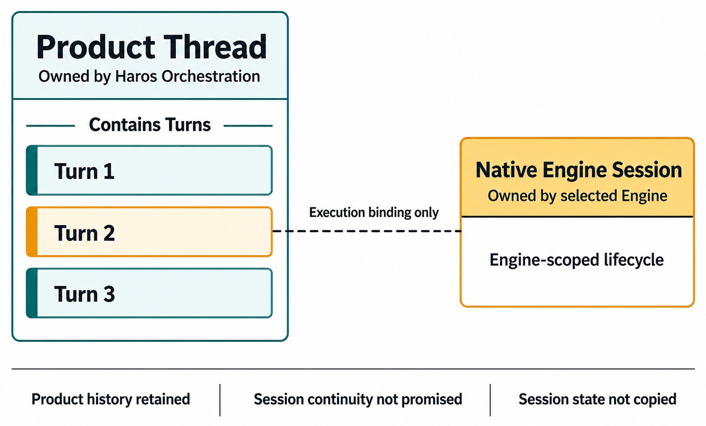
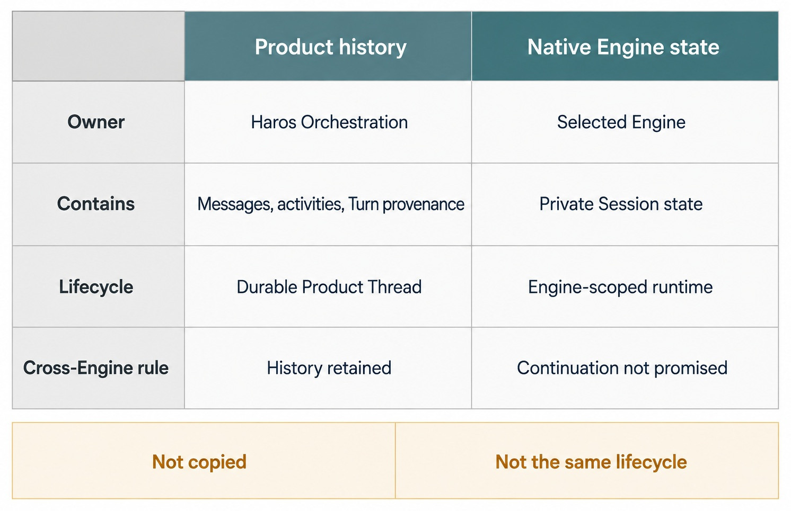

# Chapter 9 — Threads, Turns, Messages, and Sessions {#chapter-09}

## The question

When you read one Haros conversation, are you looking at one Thread, one Turn, a list of Messages,
or an Engine Session? You are looking at all four facts projected together, but they have different
lifetimes and owners. Confusing them produces the most dangerous kind of continuity bug: a product
history that appears to promise native execution state it never had.

_Figure 9.1 — The Product Thread is durable context; a native Session is Engine-scoped execution state._

**Accessible equivalent.** The Product Thread is owned by Haros Orchestration and visibly contains Turn 1, Turn 2, and Turn 3. A Native Engine Session sits outside that boundary, is owned by the selected Engine, and has an Engine-scoped lifecycle. One dashed line from Turn 2 is labeled Execution binding only. Product history is retained, but Session continuity is not promised and Session state is not copied.

## The plain-English model

A **Thread** is Haros's durable line of work inside a Project. A **Message** is a visible transcript
item with a role, content, timestamps, optional attachments and references, and possibly a `turnId`.
A **Turn** is one admitted unit of user intent and its execution lifecycle. A **Session** is current
execution state associated with an Engine; a native Engine may maintain additional private session
state that Haros neither owns nor fabricates.

| Noun                       | Lifetime                                      | Product owner            | Key question                                                   |
| -------------------------- | --------------------------------------------- | ------------------------ | -------------------------------------------------------------- |
| Thread                     | From creation through archive/delete          | Product orchestration    | “Which durable line of work is this?”                          |
| Message                    | Append/update within visible history          | Product orchestration    | “What was said, by whom, and when?”                            |
| Turn                       | Admission through completed/interrupted/error | Turn lifecycle           | “What bounded request is running or settled?”                  |
| Product session projection | Engine startup/running/idle/error interval    | Orchestration projection | “What execution state is visible now?”                         |
| Native Engine Session      | Engine-private lifecycle                      | Selected Engine          | “What private continuation does that Engine actually support?” |

## One bug-fix journey

Maya opens the parser Project and creates a Thread called “Fix timezone rollover.” Her first user
Message asks for diagnosis. Admission creates a Turn binding, and the latest-turn projection moves
from running to a terminal result. Tool activities and the assistant Message refer to that bounded
work. The Thread remains after the Turn settles.

Maya then asks for a focused patch. That is another Message and another Turn in the same Product
Thread. It may reuse a compatible native Session if the selected Engine and runtime support that,
but the Thread's truth does not depend on reuse. If the Engine process restarts, Haros can preserve
the Messages, activities, provenance, and settled Turn facts while reconciling the dead runtime.

If Maya explicitly switches Engines, Haros stops first. The Product Thread remains the visible line
of work. A new Engine may receive bounded history or handoff context, but Haros does not copy a
native Session identifier and call that continuation. The reviewer can therefore trust the
Timeline: product history is continuous; native execution identity is explicit.

## How the facts connect

`OrchestrationThread` contains Project ownership, title, exact Engine selection, runtime and
interaction modes, current environment metadata, lifecycle fields, Messages, provenance, plans,
activities, pending interactions, checkpoints, and a nullable Session projection. This is a rich
product aggregate, not a serialization of an Engine's private state.

Messages have `user`, `assistant`, or `system` roles. A Message can carry a `turnId`, but some
messages or historical imports may not map one-to-one with a running turn. Dispatch mode and origin
record how a user follow-up entered the lifecycle. Streaming is a presentation and delivery fact,
not a second transcript owner.

`OrchestrationLatestTurn` tracks one bounded lifecycle with requested, started, and completed times,
an assistant message link, and a state of running, interrupted, completed, or error. A Session
projection separately reports idle, starting, running, ready, interrupted, stopped, or error,
together with its active turn when known.

| Relationship            | Correct rule                                                | Misleading shortcut                     |
| ----------------------- | ----------------------------------------------------------- | --------------------------------------- |
| Thread → Messages       | A Thread owns visible product history                       | Transcript text is native Session state |
| Message → Turn          | A message may identify the Turn it belongs to               | Every message is exactly one Turn       |
| Turn → Session          | A running Turn can be executed in a Session                 | Turn and Session share one lifecycle    |
| Thread → native Session | Haros may project current Engine execution                  | Thread ID is a native Session ID        |
| Engine change           | Product history survives; native continuity is not promised | Copy session state across Engines       |

_Figure 9.2 — Messages, activities, and provenance remain product facts; private native state is not copied._

**Accessible equivalent.** Haros owns Messages, Activities, and Turn provenance. The selected Engine owns private Session state. These facts are not copied, do not share one lifecycle, and do not promise continuation.

## Read one line of work in four passes

A transcript is easiest to understand when you read it four times, once for each lifetime. First,
identify the Product Thread: the durable container that gives the work its Project, title, history,
and current binding. Second, identify Messages: the visible statements and their authors. Third,
group the Messages and activities by Turn so each admitted request has a bounded beginning and
terminal result. Only then inspect the current Session projection and any Engine-native session
capability.

Applied to Maya's parser work, the first pass finds the Thread “Fix timezone rollover” inside the
parser Project. The second separates the diagnosis request, assistant explanation, and patch
request as visible Messages. The third identifies one completed diagnosis Turn and one running or
settled patch Turn, assigning activities to the correct bounded request. The fourth reads the
current Engine Session projection beside the selected Engine provenance. Each pass answers one
question without asking a later lifetime to redefine an earlier one.

If the four passes disagree, stop at the first owner mismatch. A Message rendered under the wrong
Turn is a projection problem; a correct Turn with stale Session status is a lifecycle reconciliation
problem. Treating both as a generic transcript defect would hide the boundary that needs repair.

This method prevents a common debugging mistake. Suppose the assistant's patch Message is visible,
but the latest Turn is still running and no tool receipt proves the test result. The correct
conclusion is not “the task completed because the transcript has an answer.” The Message is one
fact; Turn settlement and capability evidence are others. Conversely, a Turn can settle with an
error while the Product Thread and earlier Messages remain fully usable.

It also clarifies imports and system Messages. A visible Message without a `turnId` is not corrupt
merely because it does not fit a one-message-one-turn story. Product history can include imported or
system-owned context. The absence of a Turn link limits what you may claim about execution; it does
not erase the Message.

## Continuity has two different meanings

When users say “continue this conversation,” they may mean one of two things. **Product continuity**
means reopening the same Product Thread with its Messages, activities, queued work, provenance, and
recovery state. **Native continuity** means a particular Engine resumes its own private execution
context. Haros owns the first. The selected Engine may or may not support the second.

The distinction matters even when both happen successfully. A compatible Engine might reuse a
native Session for a follow-up, making execution efficient. That success does not transfer ownership
of the Thread. Product history still comes from orchestration, and recovery must still work when the
native Session cannot be resumed. Native reuse is a capability of one execution path, not the
definition of the product line of work.

The scenarios separate cleanly. An ordinary same-Engine follow-up keeps the Thread and creates a new
Turn; the Engine may reuse compatible private state. After an Engine process restart, durable
history can recover even when in-memory state is gone. An explicit Engine switch can retain visible
Thread history but creates new Engine state rather than copying a Session. A fork or handoff records
product lineage while destination capability determines its new execution context. A browser
reconnect rebuilds the server projection and proves nothing about native state.

These cases deliberately avoid promising a specific resume mechanism. The pinned edition can
expose current Session projection, but the durable rule is that Product Thread identity does not
become a native Session identifier. If a future Engine gains stronger resume support, Haros can
project that capability without rewriting what a Thread means.

## Diagnose with identities, not impressions

When history looks inconsistent, collect a small identity set before proposing a fix: Project ID,
Thread ID, Message IDs, each relevant `turnId`, latest-Turn state, admitted Engine/model provenance,
and current Session state. Then ask the owner of each fact for its current value. Do not begin from
the browser's last animation, a native log line, or a friendly “conversation” label.

Consider a reconnect where Maya sees the first diagnosis Message twice. If both rows share one
Message ID, the problem may be presentation duplication. If different product Message IDs exist,
the event/projection path needs investigation. If the duplicate exists only in a native log, it is
not yet evidence that Product history duplicated. The identity set narrows the defect without
reading private Engine state.

Now consider a row that remains “running” after restart. The Thread and Message can be correct while
latest-Turn or Session reconciliation is stale. Recovery should settle the orphaned in-process fact
honestly; it should not delete the Message, fabricate a completion, or attach a new native Session
to the old Turn. A reviewer can verify the result by observing the same Thread and Messages, a
terminal old Turn, and any later retry as a new admitted Turn with its own provenance.

The same discipline applies to Engine switching. Record the last Turn under the old Engine, the
stop-first boundary, and the first new Turn under the new binding. Continuous Product history is
expected. Matching native Session identity is neither expected nor allowed as a cross-Engine
claim.

Before closing an incident, ask three model-check questions. Could the same Product Thread be shown
if the Engine process vanished? If yes, its history is product-owned. Could two Turns in that Thread
have different terminal results or admitted bindings? If yes, Turn identity is doing real work.
Could a native Session disappear while Messages remain? If yes, recovery has preserved the right
boundary. A “no” answer to any of these usually means the diagnosis treated one visible
conversation as one undifferentiated runtime object.

For reviewer handoff, state both continuities explicitly: “Product Thread and Messages recovered;
native Session continuation was not asserted.” That sentence prevents a future reader from
interpreting successful UI recovery as proof that private Engine memory resumed.

Also record whether any retry became a new Turn. Reusing the same Product Thread is expected;
relabeling a new execution attempt as the old Turn is not. Distinct Turn identity lets Timeline and
recovery show which attempt failed, which binding was retried, and which result finally settled.
That evidence remains useful even when the same assistant wording appears in both attempts.

### Retry without changing what the Thread means

Imagine Maya's patch Turn fails during Engine startup. The user Message is already part of the
Product Thread, provenance identifies the attempted binding, and the latest Turn settles with an
error. None of those facts creates a native Session. Maya repairs the Engine and retries the same
intent. The retry belongs to the same Thread but receives a new Turn identity and a new admitted
request time.

Compare the two attempts. Their user-facing wording may be identical, but their Turn IDs, lifecycle
states, and receipts differ. The first remains a failed attempt; the second can run and settle
successfully. A Timeline may group the work readably, yet it must not rewrite the first Turn as
completed or attach the second native Session to it.

Now switch Engines before a third retry. Product history can remain visible because it is Thread
history. The new Turn records the new Engine/model provenance and begins whatever native context
that Engine truthfully supports. The old Engine's Session identifier is neither copied nor used as
proof of continuation. If bounded prior context is supplied, it is explicit input to the new
execution, not transferred private state.

This retry exercise gives a reviewer three independent checks: one Thread across attempts, distinct
Turns for each admission, and Engine-scoped native state. It also explains why deleting the failed
Message to make the transcript look clean would be harmful. The failed attempt is part of the
recoverable product story and shows exactly where control returned to Maya.

## Failure, restart, and recovery

If startup fails before native execution begins, the user Message and its admitted binding remain
product facts. The turn can settle with an explicit error while the Thread stays usable. If the
server restarts during an in-process runtime, startup reconciliation must not leave a permanently
running projection. It adds honest failure/interrupt facts and returns control.

If an Engine supplies late output after cancellation, authoritative lifecycle rules decide whether
and how it is accepted. The UI must not locally rewrite terminal history merely because a stream
arrived. If the native Session disappears, Haros does not promise replay at the exact token or tool
boundary. It promises truthful product recovery within its evidence.

| Failure               | What survives                          | What settles                                  | What is not promised                |
| --------------------- | -------------------------------------- | --------------------------------------------- | ----------------------------------- |
| Engine launch failure | Thread, user Message, admitted binding | Turn error/recovery state                     | Native Session creation             |
| User interrupt        | prior Messages and activities          | Turn after authoritative cancellation outcome | Rollback of completed side effects  |
| Server restart        | durable events and projections         | orphaned in-process work reconciled           | continuation of dead runtime memory |
| Engine switch         | Product Thread and visible history     | old execution stopped before new start        | cross-Engine native continuation    |
| Transcript reconnect  | server-owned product state             | Web projection reconciles                     | client-local history as authority   |

## Ownership table

| Fact                       | Sole owner                          | Consumer                  | Forbidden duplicate                        |
| -------------------------- | ----------------------------------- | ------------------------- | ------------------------------------------ |
| Thread identity/history    | Product orchestration/persistence   | Web, recovery, automation | adapter-owned Thread store                 |
| Turn lifecycle             | orchestration decider and projector | Queue, Timeline, controls | component-local lifecycle guess            |
| Messages                   | product event/projection path       | transcript                | native log treated as canonical transcript |
| Current Session projection | orchestration/Engine reactor        | status UI                 | Message list inferring runtime health      |
| Native Session state       | individual Engine                   | adapter boundary          | copied state across Engines                |

## Try it safely

In a synthetic Thread, send a harmless request, wait for it to settle, then send a follow-up. Identify
the two user Messages, the two Turn boundaries, and the single Product Thread. If the fixture
supports a simulated restart, replay only synthetic product state and confirm that history remains
while the dead runtime is not described as continuing.

Do not inspect or migrate real private Engine directories. The exercise is successful when you can
point to each noun without using “conversation,” “task,” or “session” as an interchangeable label.

## Recap

1. A Product Thread is the durable line of work.
2. Messages are visible history items; Turns are bounded admitted execution units.
3. Session projection and Turn state have related but distinct lifetimes.
4. Native Engine Sessions remain Engine-private facts.
5. Recovery preserves product truth without fabricating native continuation.

## Check your model

1. **Does a second user message always create a new Thread?** No; it normally creates another Turn in the same Thread.
2. **Can a Product Thread survive a dead Engine process?** Yes; durable product history survives, while native continuation is not promised.
3. **Why can a Message have no `turnId`?** Product history and import/system cases are broader than one active execution mapping.

## Source trail

- `packages/contracts/src/orchestration.ts` owns Thread, Message, latest-Turn, Session, activity, and provenance schemas.
- `apps/server/src/orchestration/decider.ts` owns command admission and lifecycle decisions.
- `apps/server/src/orchestration/projector.ts` owns visible product projection.
- `apps/server/src/orchestration/startupTurnReconciliation.ts` owns orphaned in-process turn recovery.
- `docs/architecture.md` establishes Product Thread ≠ native Engine Session.

<!-- guide-navigation:start -->

[Guidebook contents](../README.md) · [Previous: Projects and Managed Workspaces](08-projects-and-managed-workspaces.md) · [Next: The Composer as a Control Surface](10-composer-control-surface.md)

<!-- guide-navigation:end -->
