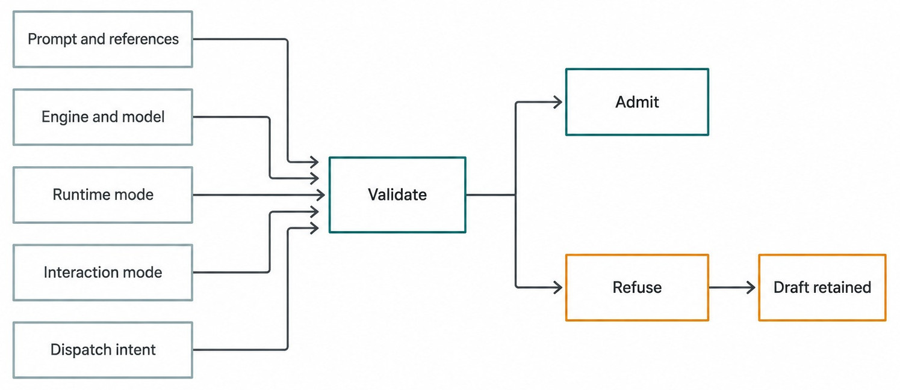
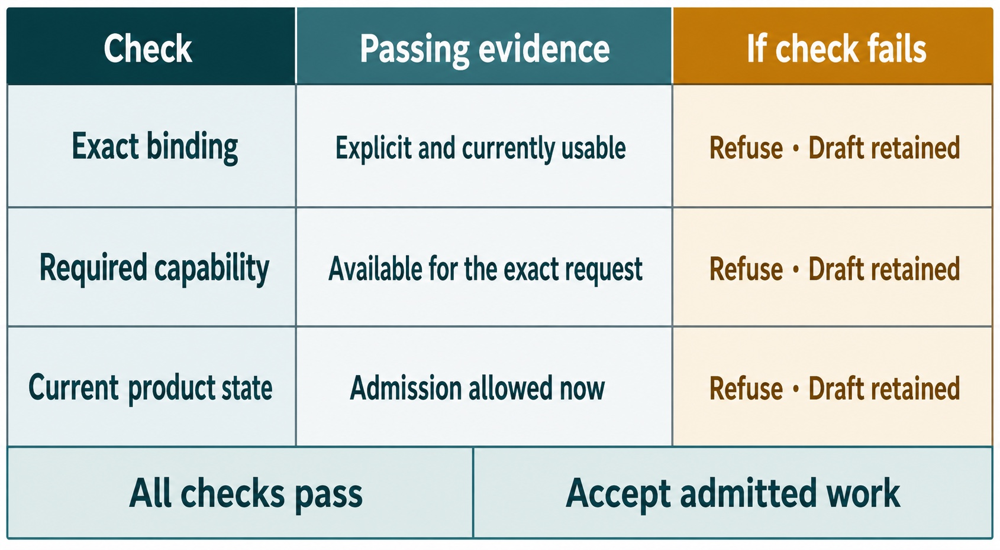

# Chapter 10 — The Composer as a Control Surface {#chapter-10}

## The question

Is the Composer just a text box? No. It is the place where user intent, references, an exact
Engine/model binding, runtime mode, interaction mode, and follow-up disposition become one proposed
request. The Composer can prepare that request, but server admission decides whether it becomes a
turn. This separation is why a draft can survive refusal without becoming false history.

_Figure 10.1 — The Composer prepares typed intent; it is not a picture of the product UI._

**Accessible equivalent.** Prompt and references, exact binding, runtime mode, interaction mode, and dispatch intent feed validation. Validation admits or refuses; refusal retains the draft.

## The plain-English model

The Composer has three jobs. It collects content. It makes execution choices visible. It hands one
coherent request to the admission path. That path may accept, queue, steer, or refuse according to
current Thread and Engine facts.

| Input class         | Examples                                  | Why it matters                              | Boundary                              |
| ------------------- | ----------------------------------------- | ------------------------------------------- | ------------------------------------- |
| Content             | prompt text, images, voice transcription  | says what the user wants                    | content is not authority              |
| Context             | attachments, mentions, skills, references | narrows evidence or method                  | a reference does not grant tools      |
| Execution binding   | Engine, exact model, options              | identifies the requested executor           | must be explicit and currently usable |
| Behavioral controls | runtime and interaction modes             | constrains authority and cognitive workflow | modes do not create another Engine    |
| Dispatch intent     | ordinary start, Queue, Steer              | states how new work relates to active work  | server decides actual admission       |

## One bug-fix journey

Maya writes, “Diagnose the timezone rollover failure and propose the smallest fix.” She attaches the
focused test output rather than an entire home directory. She chooses the exact Engine and model she
validated in Chapter 7, selects Plan because she wants a reviewable direction before edits, and
keeps the runtime mode at the level appropriate for inspection.

Before submission, the Composer can show slash-command suggestions, model options, attachment
chips, and mode controls. Those presentation features help Maya form intent; they do not bypass
canonical owners. The Engine list comes from descriptor-backed projections. Model options come from
the selected Engine's catalog. Slash commands are recognized by the Composer parser and then mapped
to product or Engine-native behavior.

When Maya presses send, Haros freezes the values used for this request. If the Thread is already
running, follow-up logic resolves Queue or Steer. If no exact selection exists, Plan is unsupported,
the Engine is unavailable, or dispatch is disconnected, admission refuses. The draft and selected
context remain recoverable rather than disappearing into a transcript that never existed.

## Commands are controls, not magic text

Slash commands give concise access to existing owners. `/model` opens or filters model selection;
mode commands select a typed interaction mode; product commands can initiate bounded actions. The
parser deliberately distinguishes a command token from an in-word slash or path such as `src/foo`.
This avoids treating ordinary prompt content as control syntax.

Some Engines expose native commands. Haros may project those capabilities, but the Composer remains
responsible for clear product admission. A native command is not permission to invent product
history, mutate another Engine's state, or skip capability checks.

| Composer signal     | Presentation owner       | Execution owner                    | Common mistake                            |
| ------------------- | ------------------------ | ---------------------------------- | ----------------------------------------- |
| Slash trigger       | Composer parser/picker   | mapped command owner               | treating any slash as a command           |
| Engine/model picker | Web projection           | descriptor, catalog, admission     | storing display label as identity         |
| Mode picker         | typed mode controls      | capability projection and dispatch | assuming every Engine supports every mode |
| Send button         | Composer                 | orchestration command path         | equating click with accepted turn         |
| Queue/Steer header  | Composer follow-up state | decider and lifecycle              | rewriting a running turn locally          |

## Admission and refusal

_Figure 10.2 — Refusal is a first-class truthful result, not a reason to lose intent._

**Accessible equivalent.** A draft proceeds through exact binding, capability, and current state checks. Acceptance creates admitted work; refusal leaves the draft retained.

The Web performs early checks to give immediate feedback, but it does not become the authority for
server lifecycle. The server decider consumes the command under current product state. Accepted work
emits product facts; rejected work returns an explicit failure. The first visible pending message can
show admitted Engine/model provenance immediately, then reconcile with server truth.

Refusal should be actionable. “Choose an exact model” differs from “Engine not installed,” “mode
unsupported,” “active edit requires stop,” and “transport disconnected.” Collapsing them into a
generic disabled button makes recovery guesswork.

## Freeze one request before following it

To reason about the Composer, take a snapshot at the moment Maya asks to send. The snapshot is not a
screenshot; it is the semantic bundle that the control surface assembled. Record the prompt body,
admitted references, exact Engine/model selection, Engine-specific options, runtime mode,
interaction mode, and dispatch intent. Each field can change the meaning or authority of the
request, so each must cross admission coherently.

For Maya's request, the prompt says to diagnose the timezone rollover and the reference is focused
synthetic test output. Reading either later from mutable UI could replace submitted intent or
execution context. The Engine/model is one exact usable binding, with typed Engine options; reading
the picker or Settings later could rewrite provenance or queued execution. The runtime mode records
the bounded inspection policy and the interaction mode records Plan or Debug for this dispatch.
Later mode changes must not leak backward. Finally, dispatch intent records start, Queue, or Steer
before active state can change underneath the client.

This bundle also gives Maya a reviewable retry boundary. If admission rejects only Plan support,
she can keep content, references, Engine/model, options, runtime mode, and dispatch intent while
changing the interaction mode explicitly. Reassembling the whole draft would create opportunities
for unrelated context or authority to drift.
That narrow repair remains easy to explain and reproduce.

Now follow the bundle across two moments. The Web sends a proposed command and can show immediate
pending presentation from the exact binding. The server evaluates current product state and returns
an authoritative acceptance or refusal. A correct path either associates the admitted work with
that frozen bundle or leaves no accepted Turn and retains the repairable draft. It never assembles
half the request before the click and reads the other half afterward.

This audit catches bugs that visual inspection misses. A picker can display the right model while
the request carries only its friendly caption. A mode badge can look correct while queued work
receives the previous typed value. A reference chip can remain visible after its admitted identifier
was omitted. The evidence is the typed request plus the resulting Product facts, not the confidence
of the control's appearance.

## Choose dispatch intent from the active lifecycle

The same prompt has different lifecycle meaning depending on whether another Turn is active. With
no running work, ordinary start asks admission to begin a new Turn. Queue preserves a follow-up for
later promotion with its admitted binding. Steer asks to influence compatible live work or enter a
truthful fallback path when live steering is unavailable. Interrupt is a separate control action,
not an aggressive spelling of Send.

With no active Turn, honest intent is to start a new Turn while preserving the exact submitted
bundle. If active work may finish first, Queue preserves the follow-up binding and request time. If
guidance is timely and the active Turn is compatible, Steer preserves the active Turn identity and
adds an explicit steering fact. Work that must stop before replacement needs Interrupt, terminal
settlement, and a separately identified redispatch. When transport or lifecycle is uncertain,
Haros refuses or waits while preserving the draft and user intent.

Maya should not infer these outcomes from button wording alone. The server decider sees the
authoritative active state. If her client thought a Turn was idle but the server still records it
as running, the submitted intent must be reconciled under server truth. Preserving the draft makes
that refusal recoverable. Inventing a local completed row would hide the conflict.

Queue deserves special attention because it looks deceptively passive. Once accepted, queued work
has its own identity and frozen execution selection. Changing the Composer after that point prepares
future intent; it does not edit the queued item. To change queued meaning, use an explicit supported
product action rather than relying on whatever values happen to be visible when promotion occurs.

## Recover from refusal without losing the user's work

A refusal is useful when it names the failed gate and leaves the smallest repair. The Composer
should keep content that is safe to retry, keep references visible, and avoid claiming that a Turn
started. Recovery then changes only the invalid part.

| Refusal reason                | Preserve                          | Repair                                          |
| ----------------------------- | --------------------------------- | ----------------------------------------------- |
| Exact model missing           | prompt, references, modes, intent | choose one exact current model                  |
| Engine unavailable            | full proposed request             | repair that Engine or choose another explicitly |
| Mode unsupported              | content and exact binding         | select a supported mode                         |
| Active lifecycle forbids send | draft and requested disposition   | wait, Queue, or stop through product control    |
| Transport disconnected        | local draft; no success history   | reconnect, refresh state, then resubmit         |

After recovery, the new attempt is a new admission decision. It may resemble the refused request,
but it should not borrow a nonexistent Turn ID or claim an earlier request time. If the original
command reached the server and the client merely lost the response, stable command/request identity
must support idempotent reconciliation rather than blind resubmission. The correct next action
depends on evidence about admission, not on whether the draft still looks present.

For a safe review exercise, force one missing-model refusal in a synthetic Project, inspect the
retained semantic bundle, repair only the model, and submit a harmless read. Then repeat while a
synthetic Turn is active and select Queue. The resulting evidence should show one refused attempt
without fabricated history and one queued request whose binding remains unchanged after the picker
moves. That pair proves more than a successful click ever could.

The same exercise can test references without granting authority. Attach a synthetic test excerpt,
then ask the Engine to read an unrelated path. The attachment proves that context reached the
request; it does not authorize the path. Any file access must still pass through the capability
boundary for the admitted Turn. This separates two frequently conflated failures: “the Engine did
not receive my evidence” and “the requested operation was not authorized.”

Finally, compare a command-looking prompt with a real Composer command. A path such as
`src/parser/date.ts` contains a slash but should remain content. A recognized slash command should
resolve through its mapped owner and still respect admission. If ordinary text triggers control, or
a command bypasses the typed request, the Composer has stopped being a predictable control surface.

A concise review record should therefore include the draft bundle, command classification,
admission request identity, result, and retained recovery state. It should not include private
Engine configuration or broad filesystem captures.

The model check is simple: if the server refuses, can Maya recover every meaningful part of her
intent without a false transcript row? If yes, draft and lifecycle ownership are separate. If no,
the control surface has tied user work to an admission result it does not own.
The retained state should also make the repaired field obvious, so recovery does not require rebuilding the request.
That is the practical value of treating the Composer as a control surface instead of a text box.
The boundary remains visible under failure.

### Reconcile a send whose response was lost

The hardest Composer failure is not an explicit refusal; it is uncertainty after the request left
the browser. Suppose Maya clicks Send, the transport disconnects, and the draft remains visible.
She cannot tell from the draft alone whether the server admitted the command. Blindly sending again
could create a second Turn, while clearing the draft could lose intent that never reached the
server.

Begin with the stable request or command identity used by the admission path. After reconnect, ask
server-owned product state whether that identity produced an admitted Message, queued item, Turn,
or explicit refusal. If admitted work exists, reconcile the pending presentation to it and keep its
original binding. If no admitted fact exists and the refusal is definitive, the retained draft can
be repaired or retried as a new request. An unresolved transport state remains unknown until its
owner supplies evidence.

Run a synthetic comparison. In the first case, disconnect before the command reaches admission;
reconnect should reveal no Turn, and Maya can retry the retained bundle. In the second case,
disconnect after admission but before the response; reconnect should find the existing admitted
identity rather than submit another. In the third case, let admission refuse an unavailable model;
the draft remains, but no successful-looking Timeline row appears.

This walkthrough separates draft persistence, idempotent command handling, and Turn lifecycle. A
Composer implementation that treats them as one boolean cannot recover all three cases honestly.
The user-visible result may look similar for a moment, but the next safe action depends on the
authoritative admission record.

## What can go wrong

### The request has content but no exact binding

Do not infer a model from an old caption or another Engine's selection. Keep the draft and ask for an
exact choice.

### A reference is mistaken for authorization

An attachment or mention supplies context. It cannot grant filesystem, Git, terminal, browser, or
device authority. HostGateway still evaluates exact-turn requests.

### The UI predicts acceptance from stale health

Current server state can change after the selector renders. Preserve optimistic responsiveness, but
consume the admission result and reconcile. Do not append a completed-looking turn locally.

### A live follow-up changes binding

Queue preserves the admitted binding. Steer is valid only under compatible live conditions or a
truthful queue–interrupt–redispatch path. Mid-turn selector changes do not rewrite active execution.

## Ownership table

| Fact                | Sole owner              | Consumer             | Forbidden duplicate          |
| ------------------- | ----------------------- | -------------------- | ---------------------------- |
| Draft content       | Composer draft store    | Web controls         | transcript before admission  |
| Engine identity     | `ENGINE_DESCRIPTORS`    | picker               | local Engine array           |
| Exact model options | selected Engine catalog | picker and readiness | cross-Engine model list      |
| Admission           | orchestration decider   | Web projection       | button-state lifecycle       |
| Local capabilities  | HostGateway             | Engine adapter       | attachment-derived authority |

## Try it safely

In an isolated fixture, prepare a prompt with one synthetic reference. Change Engine/model and
interaction mode, then remove the exact model. Attempt submission and confirm an explicit refusal
while the draft remains. Restore the exact binding and submit only a harmless inspection task.

The observable result is a clean distinction among prepared draft, admitted pending work, and
refused work. Do not use credentials, destructive commands, or a real private Engine home.

## Recap

1. The Composer combines content, context, binding, modes, and dispatch intent.
2. References add context, not capability authority.
3. A click proposes a request; admission creates product facts.
4. Refusal should preserve the draft and explain recovery.
5. Queue and Steer express lifecycle intent without rewriting active work.

## Check your model

1. **Why is the Composer more than a text box?** It forms the complete typed request.
2. **Does a slash command bypass admission?** No; it maps to an existing owner and current capability.
3. **What should happen when no exact model is selected?** Refuse explicitly and retain the draft.

## Source trail

- `apps/web/src/components/ChatView.tsx` owns Composer composition and send orchestration.
- `apps/web/src/composer-logic.ts` and `composerSlashCommands.ts` own command detection and mapping.
- `apps/web/src/components/chat/EngineModelPicker.tsx` projects Engine/model choice.
- `packages/contracts/src/orchestration.ts` owns typed binding, modes, and dispatch intent.
- `apps/server/src/orchestration/decider.ts` owns authoritative admission.

<!-- guide-navigation:start -->

[Guidebook contents](../README.md) · [Previous: Threads, Turns, Messages, and Sessions](09-threads-turns-messages-and-sessions.md) · [Next: Engines, Models, and Options](11-engines-models-and-options.md)

<!-- guide-navigation:end -->
