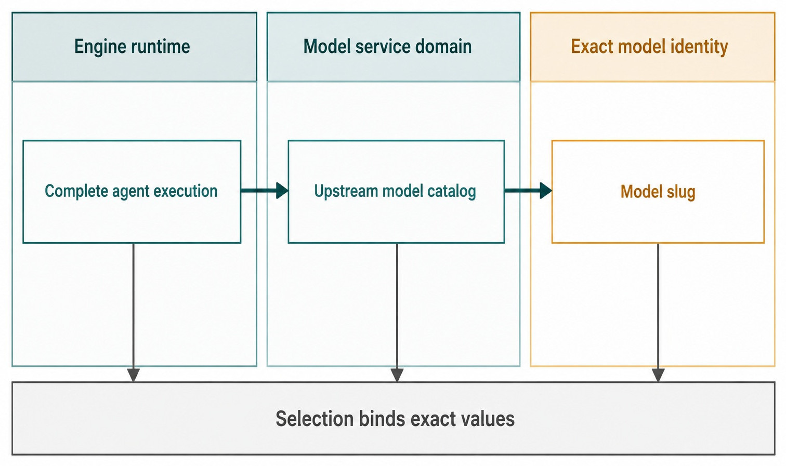
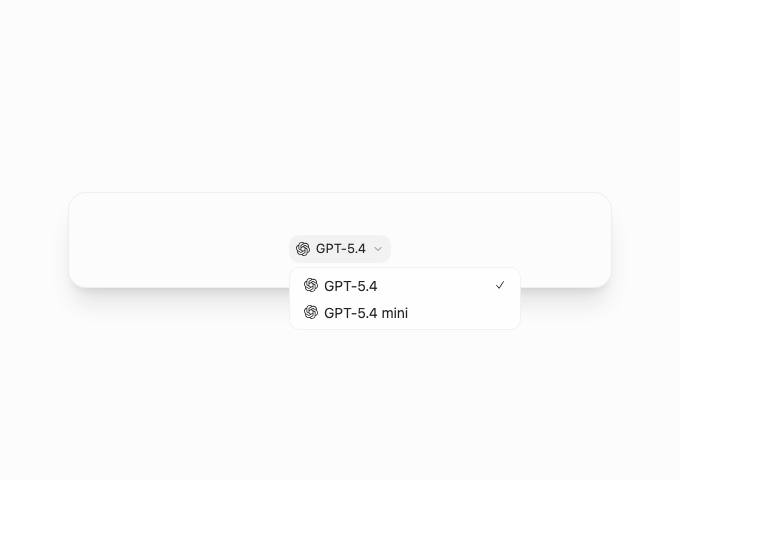
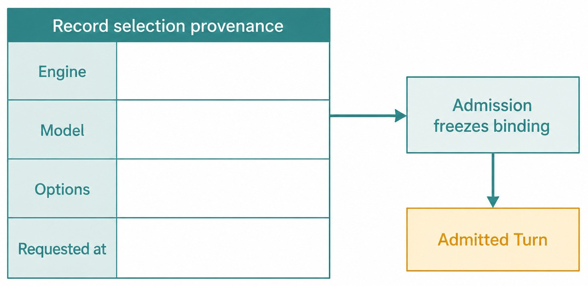

# Chapter 11 — Engines, Models, and Options {#chapter-11}

## The question

What changes when you select an Engine, a model, or an Engine-specific option? An Engine changes the
complete runtime. A model service is an upstream subsystem inside an Engine where applicable. An
exact model selects the model identity for the request. Options refine how that selected Engine
starts or runs. These layers must remain visible because each has a different owner and failure
surface.

_Figure 11.1 — The Engine is the complete runtime; model service and exact model are narrower facts._

**Accessible equivalent.** Engine runtime is complete agent execution; model-service domain supplies an upstream catalog; exact model identity uses a model slug.

## The plain-English model

| Choice                   | Scope of change                             | Canonical fact             | Does not mean                           |
| ------------------------ | ------------------------------------------- | -------------------------- | --------------------------------------- |
| Engine                   | Complete agent runtime and adapter behavior | `EngineSelection.engine`   | model Provider                          |
| Model service            | Upstream catalog/auth inside an Engine      | service-owned projection   | a Product Engine                        |
| Exact model              | Model slug bound to one selection/turn      | `EngineSelection.model`    | family caption or automatic fallback    |
| Engine option            | Engine-specific start/runtime input         | typed `EngineStartOptions` | a universal setting every Engine shares |
| Runtime/interaction mode | authority/cognitive workflow                | typed mode contracts       | Engine identity change                  |

Haros uses “Provider” only where an upstream model or search service really is a provider. Calling
the complete runtime a Provider collapses tool protocols, native Session behavior, health,
capabilities, and execution into a model API concept.

## One bug-fix journey

Maya chooses an Engine that is installed and authenticated. Its catalog offers an exact model.
Haros records the stable machine identity, not merely the friendly label shown in a picker. If Maya
chooses a different exact model under the same Engine, the adapter and native Session rules remain
those of that Engine, while model-specific capabilities and cost/performance may change.

If Maya chooses another Engine, Haros applies stop-first behavior when needed. The Product Thread
continues as durable product history, but a new native Session may begin. Haros never copies a
private Session and never tells the new Engine that it is the old Engine's continuation.

Engine-specific options can include binary path, profile, permission strategy, account, or other
typed fields depending on the adapter. They belong with that Engine's selection/start contract.
They should not leak into a universal untyped bag that every UI consumer interprets differently.

## One identity owner

`ENGINE_DESCRIPTORS` exhaustively maps `EngineKind` to credential-blind display identity and narrow
usage help. Onboarding, Sidebar, Settings, ordering, and discovery project from that owner. Adding an
Engine may require a descriptor, adapter, assets/copy, and focused tests; it must not require new
lists in every screen.

Discovery adds volatile facts—installed status, authentication, health, catalogs, supported modes—
without replacing identity ownership. A selector merges identity and current availability for
presentation. It does not persist discovery as a second registry.

| Fact                     | Sole owner                        | Typical consumer                | Forbidden duplicate        |
| ------------------------ | --------------------------------- | ------------------------------- | -------------------------- |
| Engine kind/display name | `ENGINE_DESCRIPTORS`              | Settings, onboarding, selectors | component arrays           |
| Adapter registration     | Engine adapter registry           | server runtime                  | Web registry               |
| Model catalog            | selected Engine discovery/service | Composer                        | global handwritten catalog |
| Exact selection          | `EngineSelection`                 | admission, provenance           | display caption only       |
| Capability status        | execution capability projection   | mode controls                   | guesses from Engine name   |

_Product capture — The production picker keeps Engine identity fixed while selecting one exact
model from a sanitized synthetic catalog._

## Selection provenance

_Figure 11.2 — Provenance answers what was admitted, not what the selector shows now._

**Accessible equivalent.** Engine, model, options, and requested time belong to the provenance record for the admitted turn.

`OrchestrationTurnProvenance` binds the pending user Message, optional resolved Turn, exact
`EngineSelection`, optional presentation identity, and request time. Queue keeps the admitted
binding. Timeline can therefore show which Engine/model handled historical work even after the
Composer selection changes.

Presentation identity is useful when a catalog provides a friendly model name or model-service
context, but it remains subordinate to the exact typed selection. A missing caption must not erase
machine identity; a changed caption must not rewrite history.

## Trace a selection without trusting its caption

Start with one synthetic catalog entry and write down four values: Engine kind, exact model slug,
friendly presentation label, and typed Engine options. Follow that selection into a proposed
request, an admitted or queued binding, Turn provenance, and a historical Timeline row. This gives
you a stable baseline for three controlled changes.

First, change only the friendly label in the fixture. The selector and Timeline may display new
wording for future choices, but the machine binding is still the same Engine and model. Historical
provenance should not become a new selection merely because presentation changed. Second, change
only the exact model. Engine identity and adapter behavior remain fixed, while model-specific
capability may change. Third, change the Engine. Adapter registration, health, options, and native
Session behavior can all change; Product Thread history remains visible without claiming that the
old native Session moved.

Changing only the friendly label may update current or future presentation, but Engine kind, exact
slug, and historical binding remain stable. Changing only the exact model updates model identity
and model-specific capability while keeping the Engine and Product Thread. Changing an Engine
option freezes a typed value for this request without affecting unrelated Engines or prior queued
provenance. Changing the Engine changes adapter and native lifecycle; Product history remains and
Session continuity is not fabricated.

This sequence exposes several weak implementations quickly. A historical row that follows a new
caption has stored presentation instead of exact identity. A model change that rebuilds the Product
Thread has collapsed model and Engine. An Engine change that preserves a private Session identifier
has fabricated continuity. The comparison is more reliable than asking whether two assistant
responses “feel like” the same model.

## Keep Engine options typed and local to their owner

Engine-specific options deserve the same discipline as Engine identity. An option should be defined
in that Engine's selection or start contract, projected only where the Engine can interpret it, and
frozen with an admitted request whenever it affects execution meaning. A global untyped string map
invites one screen to accept values that an adapter ignores and another to reinterpret them.

Use two removal tests during review. If one Engine disappeared, could its option fields disappear
without edits to unrelated Engine code? If a queued request was accepted and Settings changed
later, would that request retain the options it admitted? Passing both tests shows that options
belong to the Engine selection boundary rather than ambient application state.

Review an option by asking five questions in order. The selected Engine's typed contract should
define and validate it, not a generic UI key/value convention. Admission should freeze it when it
affects execution; the adapter must not read mutable Settings later. Credential-blind typed
projections may display it, while consumers must not read private Engine configuration. An
unsupported value should fail validation or capability checks rather than disappear silently. No
unrelated Engine should need to understand the field.

For Maya, the result is observable at queue time: the option value admitted with the parser request
remains attached to that request even if she changes Settings before promotion. A later request can
use the new value without rewriting the earlier provenance.
The option's owner remains unambiguous throughout that transition.

Typed ownership does not require every Engine to expose identical controls. Uniformity at the
product boundary means selections are explicit and validated, not that all runtimes have the same
native configuration.

## Diagnose identity, catalog, health, and capability separately

An Engine can be known to `ENGINE_DESCRIPTORS` while no adapter is registered. An adapter can be
registered while its runtime is not installed. A runtime can be healthy while a requested exact
model is absent from the current catalog. A model can be present while one interaction or runtime
mode remains unsupported. “Available” is therefore a conclusion about a particular request, not a
single stored bit attached to the Engine name.

| Evidence layer        | It answers                                          | It cannot answer alone                      |
| --------------------- | --------------------------------------------------- | ------------------------------------------- |
| Descriptor            | which Engine identity Haros recognizes              | whether runtime execution works now         |
| Adapter registration  | whether Haros has an execution integration          | whether native runtime is installed/healthy |
| Health/discovery      | current runtime and authentication condition        | whether one exact model is selected         |
| Model catalog         | currently projected exact model choices             | whether requested modes are usable          |
| Capability projection | whether the complete requested binding is supported | whether admission state allows a Turn       |

Suppose Maya sees her Engine in the picker, but Send refuses. Begin at the bottom of the relevant
chain, not at the display label. Confirm the typed Engine kind, adapter registration, credential-blind
health, selected exact slug, and requested-mode capability. If all are usable, inspect product
admission state. Each failed layer has a different recovery owner. Merging the layers into one
generic error encourages the worst response: silent substitution.

Catalog and health deserve special separation. A catalog may load from cached or service state
while native authentication is currently invalid. A runtime may report healthy while an exact
model has been removed. Preserve the proposed selection, report the failed layer, and require an
explicit repair or replacement. Old Turns keep their admitted selection even when no new request
can use it.

## Read provenance as an immutable receipt of intent

Provenance answers “what did Haros admit for this Turn?” It does not promise that execution
completed successfully, and it does not mirror the selector's current value. For Maya's queued
patch request, record pending Message identity, request time, exact Engine/model/options, and any
presentation identity. When the Turn resolves, join the resulting Turn ID without replacing those
admission facts.

That record supports precise recovery. If the model disappears before queued promotion, Haros can
surface that the previously accepted binding is no longer executable and settle or recover through
the lifecycle owner. It must not run the nearest catalog model and leave the old provenance in
place. If the Engine fails to launch, provenance still proves which binding failed; it is not a
success receipt.

A useful review compares three surfaces: the current picker, the queued binding, and a settled
historical row. Change the picker after queueing. Only the current picker should move. Then simulate
a launch failure. The queued/Turn record should retain the original identity while lifecycle shows
failure. Finally choose a replacement explicitly for a new request. The Timeline should show a
transition between two admitted choices, not one magically continuous runtime.

When documenting the result, report machine identity and presentation separately. “Codex / model
X” may be readable UI copy, but the evidence should still carry the exact typed Engine kind and
model slug used by the synthetic fixture. Avoid enumerating a handwritten catalog in prose: the
catalog is volatile and belongs to discovery. The durable lesson is how a current catalog entry
becomes a frozen binding.

One mental-model check exposes most identity drift: remove the picker from view and ask whether the
Timeline can still name the Engine/model for each old Turn. If it can only do so by consulting
current Settings, provenance is incomplete. If it reads private Engine configuration, the
projection boundary is broken. Historical identity must stand on the admitted product record.

The companion failure check removes the selected model from the current synthetic catalog. New
admission should refuse or request a new explicit choice, while old provenance remains readable.
That contrast proves catalog freshness without turning catalog availability into historical truth.
It also proves that a missing model is not permission to select a similarly named replacement.

### Replace an Engine without rewriting the record

Suppose the Engine Maya used for diagnosis becomes unavailable before implementation. The current
picker can show that health failure, while the diagnosis Turn retains its original Engine kind,
exact model slug, options, and presentation identity. Repairing future execution must not edit that
historical binding.

Maya explicitly selects another ready Engine and one exact model from its current catalog. Haros
validates that Engine's own options and supported modes; it does not carry the old Engine's option
bag across by name. If implementation is admitted, the new Turn records the replacement binding
and begins a new native lifecycle. The Product Thread connects the two Turns as durable work, not
as one native Session.

Review the transition from three viewpoints. The descriptor owner explains both Engine identities.
Discovery and capability projections explain why the old choice is unavailable and the new request
is usable. Turn provenance explains what each historical request actually admitted. None of those
owners needs private credentials or a component-local Engine list.

Now restore the old Engine in the synthetic fixture. Its return should make it available for future
selection; it should not absorb the intervening Turn or rewrite the replacement provenance. This is
the decisive test of selection history. Availability is current and volatile, while admitted
identity is historical and durable. Keeping those times separate allows replacement to be honest
without sacrificing work continuity.

## What can go wrong

### A model disappears from discovery

Keep historical provenance. New admission may refuse the unavailable selection and ask for an
explicit replacement. Do not rewrite queued work or silently choose the nearest model.

### An Engine health check is degraded

Capability projection can mark modes degraded or unavailable. Show the reason and allow recovery;
do not infer that every exact model under the Engine behaves identically.

### Options drift between draft and queue

Admission-time options belong to the queued binding. Later Settings or Composer changes apply to new
work, not already accepted intent.

### A screen adds its own Engine list

That creates a change-radius bug immediately. Remove the duplicate and derive from descriptors and
current projections.

| Failure signal             | Evidence to inspect                    | Honest recovery                                        | Historical effect                     |
| -------------------------- | -------------------------------------- | ------------------------------------------------------ | ------------------------------------- |
| Engine not installed       | Engine health status                   | Install that Engine or choose another explicitly       | Existing provenance unchanged         |
| Authentication required    | credential-blind authentication status | Complete the Engine-owned sign-in path                 | No model substitution                 |
| Model missing from catalog | current exact-model options            | Choose a currently advertised exact model              | Old turns keep their exact slug       |
| Option unsupported         | typed option validation/capability     | Remove or correct the option before admission          | Queued accepted options remain frozen |
| Adapter unregistered       | adapter capability projection          | Fix registration; do not expose the Engine as runnable | Product Thread remains product-owned  |

## Try it safely

Using synthetic catalogs, select two models under one Engine and then the same-named display model
under another Engine. Write down the full binding each time. Queue a harmless turn, change the
selector, and confirm the queued provenance does not change. Do not invoke paid APIs.

## Recap

1. An Engine is a complete runtime, not a model Provider.
2. Model service and exact model are narrower Engine-owned layers.
3. `ENGINE_DESCRIPTORS` is the only Engine identity owner.
4. Admission freezes exact selection and options for provenance.
5. Engine changes preserve Product Thread truth without native Session fabrication.

## Check your model

1. **What changes when only the exact model changes?** Model identity/capability can change; Engine runtime identity does not.
2. **Why is a model caption insufficient provenance?** It is presentation, not the stable typed binding.
3. **Where should a new Engine appear first?** In the canonical descriptor/adapter cut, not new screen lists.

## Source trail

- `packages/shared/src/engineMetadata.ts` owns Engine identity.
- `packages/contracts/src/orchestration.ts` owns `EngineSelection`, options, and turn provenance.
- `apps/server/src/engine/Layers/EngineAdapterRegistry.ts` owns adapter registration.
- `apps/server/src/engine/Layers/EngineDiscoveryService.ts` owns volatile discovery.
- `apps/server/src/engine/executionCapabilityProjection.ts` combines structure and health.

<!-- guide-navigation:start -->

[Guidebook contents](../README.md) · [Previous: The Composer as a Control Surface](10-composer-control-surface.md) · [Next: Permissions and Runtime Modes](12-permissions-and-runtime-modes.md)

<!-- guide-navigation:end -->
