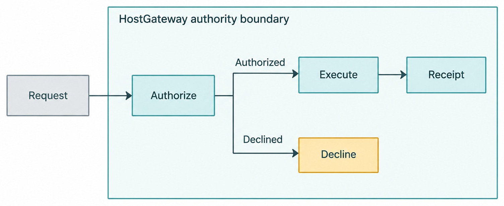
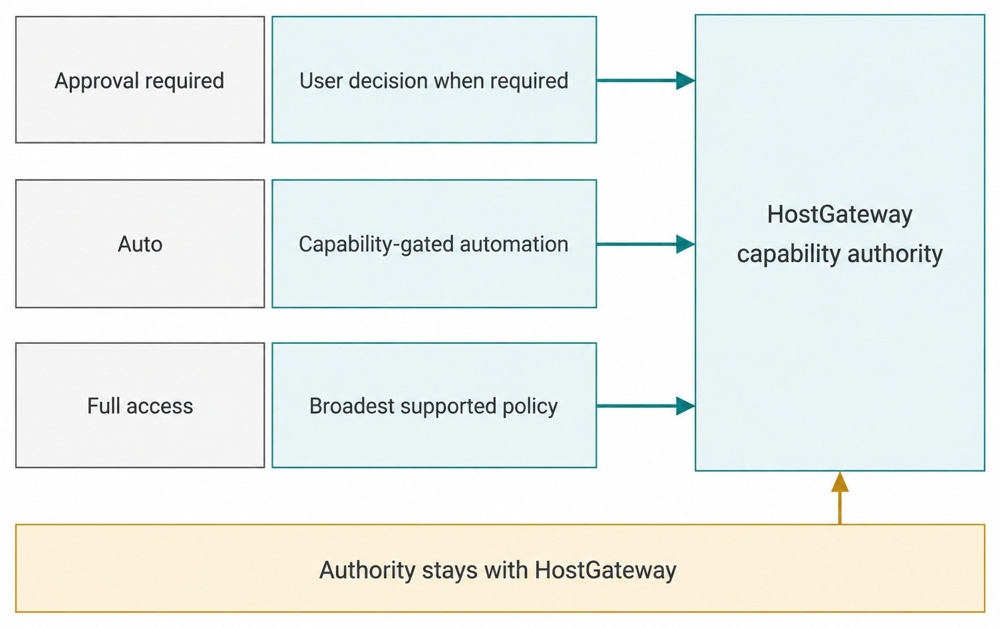
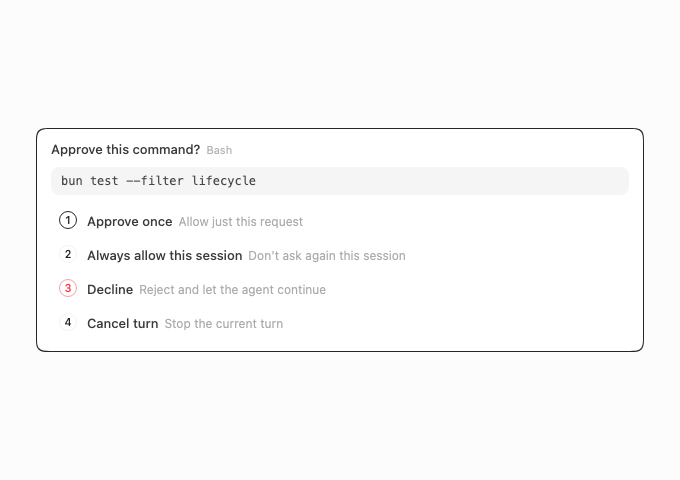
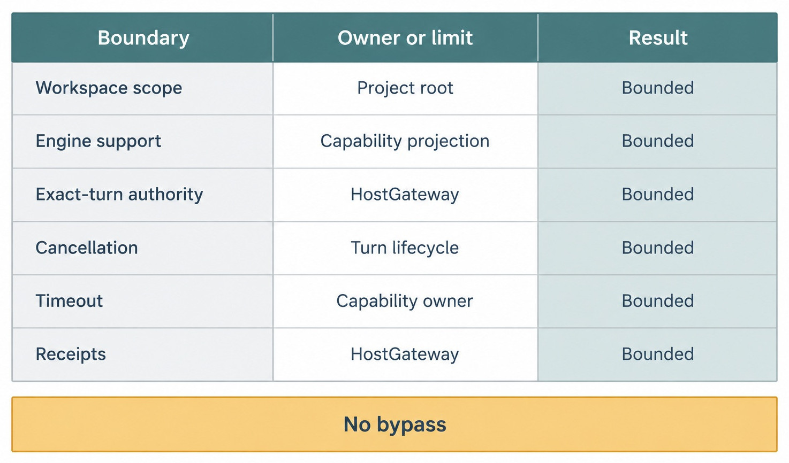

# Chapter 12 — Permissions and Runtime Modes {#chapter-12}

## The question

When will Haros ask before an operation, allow bounded automatic work, or grant the selected runtime
broader access? The visible answer is the **runtime mode**. The deeper answer is that all modes still
pass through one HostGateway capability boundary. A mode changes authorization policy; it does not
move authority into an Engine adapter or erase exact-turn scope.

_Figure 12.1 — Permission is an exact request lifecycle, not an attribute of a screen._

**Accessible equivalent.** A request reaches HostGateway authorization. An authorized request can execute and produce a receipt; a declined request does not execute.

## The plain-English model

The pinned edition defines three runtime modes: `approval-required`, `auto`, and `full-access`.
Their names describe policy intent, not a universal guarantee that every Engine/version/model
supports each mode. Capability projection combines adapter structure, Engine health, and relevant
model facts before the UI offers a mode.

| Runtime mode        | User expectation                                                  | Still enforced                                         | Common misreading                               |
| ------------------- | ----------------------------------------------------------------- | ------------------------------------------------------ | ----------------------------------------------- |
| `approval-required` | sensitive operations request approval                             | workspace, exact-turn, cancellation, timeout, receipts | “Nothing can run without a click”               |
| `auto`              | supported operations can proceed under bounded automatic policy   | Engine/model support and HostGateway policy            | “The Engine decides its own authority”          |
| `full-access`       | the admitted runtime receives the broadest supported local policy | capability owner, scope, lifecycle, receipts           | “Every file and service is ambiently available” |

The precise prompt shown to the user and the set of automatically admitted actions are current
product behavior, not a permanent definition carried by this Guidebook. The durable rule is the
ownership cut: HostGateway owns authorization and receipts; local file, Git, terminal, browser, and
device services own execution.

## One bug-fix journey

Maya begins the parser diagnosis in `approval-required`. Read-only inspection may still be allowed
according to current policy, while a command or file change can surface a pending approval. The
request identifies the exact turn, operation kind, and relevant target. Maya can approve or decline
without pretending the Engine owns the decision.

After reviewing the plan, she may choose `auto` if the selected Engine/model/version reports that
mode as structurally and operationally supported. If capability is unknown, Haros keeps the mode
unknown or unavailable. It does not optimistically treat a selector label as proof.

`full-access` is the widest policy in the current contract and is the decoding default in this
alpha edition. That historical/current default is not advice for every task. The reader should
choose the least authority compatible with the intended work and understand that “full” remains
inside Project, host, product, and connected-service boundaries.

## One capability boundary

_Figure 12.2 — Modes select policy at one authority owner; they do not create three gateways._

**Accessible equivalent.** Approval-required, auto, and full-access are policy modes. All remain under one HostGateway capability authority.

An Engine adapter receives a typed projection of capabilities. It does not duplicate permission,
cancellation, timeout, idempotency, receipt, or device authority. This allows heterogeneous Engines
to request the same product-owned capabilities without each inventing a security model.

HostGateway evaluates exact-turn authority and calls the real capability owner. A successful action
produces a receipt or activity that can be projected into the Timeline. A decline is also a product
fact. If cancellation races with completion, authoritative outcome and idempotency rules determine
settlement; the UI must not guess.

| Fact                     | Sole owner                               | Engine receives        | Forbidden duplicate               |
| ------------------------ | ---------------------------------------- | ---------------------- | --------------------------------- |
| Runtime mode value       | Thread/turn contract                     | admitted mode          | adapter-local mode enum           |
| Structural mode support  | adapter capabilities                     | supported set          | Web inference from Engine kind    |
| Operational availability | Engine health/capability projection      | current status         | stale selector as authority       |
| Authorization            | HostGateway policy                       | approved typed request | adapter approval logic            |
| Execution                | file/Git/terminal/browser/device service | result                 | gateway reimplementation of tools |
| Receipt/settlement       | HostGateway + orchestration              | projected evidence     | UI-only success state             |

## Pending approval is a lifecycle

An approval is not just a modal. The product records a pending interaction with identity and state.
The same request should not execute twice because the user clicked again after a transport delay.
Submitting a decision can be responding, retryable, resolved, or failed according to current
lifecycle evidence. Restart reconciliation must clear or settle requests whose owning runtime can
no longer continue.

_Product capture — The production decision surface keeps approval, refusal, and cancellation
explicit for one harmless synthetic command and does not execute it._

Declining an operation need not terminate the whole Product Thread. The Engine can receive a
declined result or the current turn can settle according to adapter behavior. What matters is that
the decline is visible and no local capability ran under fabricated approval.

## Boundaries no mode overrides

_Figure 12.3 — Broad policy is still bounded product authority._

**Accessible equivalent.** Runtime mode remains bounded by workspace scope, Engine support, exact-turn authority, cancellation, timeout, and receipts.

| Boundary             | Why it remains                                    | Failure if ignored                        |
| -------------------- | ------------------------------------------------- | ----------------------------------------- |
| Workspace scope      | Project root and managed lifecycle define context | unrelated files become ambient            |
| Engine support       | adapters expose different safe structures         | unsupported mode reaches runtime          |
| Exact-turn authority | requests must bind to current work                | stale turn acts later                     |
| Cancellation/timeout | control must return under pressure                | orphaned tools/processes                  |
| Idempotency/receipts | retry and audit need stable identity              | duplicate side effects or false success   |
| Connected services   | external access has its own authorization         | local mode becomes external blanket grant |

## Choose a mode by the work, not by convenience

Runtime mode should match the consequence of the next admitted work. During diagnosis, Maya may
prefer `approval-required` because the value of a pause is high: she wants to distinguish reading
evidence from editing files or running commands. For a bounded, well-understood mechanical task,
`auto` may reduce interruptions if the exact Engine/model supports it. `full-access` is appropriate
only when the user deliberately accepts the broadest supported local policy for that task.

The choice does not classify the Project or the Engine. One Agent Project can host Turns admitted
under different runtime modes. One Engine can support a mode for one model/version combination and
not another. The historical Turn keeps the mode it admitted even when Maya selects a different
policy for future work.

For an unknown repository and diagnostic exploration, begin with `approval-required` and ask which
operation truly needs more authority than reading. A reviewed plan with bounded repetitive work may
fit `auto` when support, scope, cancellation, and receipts are clear. Deliberately broad local
maintenance may justify `full-access` only after the user accepts its exact scope. External account
actions still require their own connected-service authority. When capability is unsupported or
unknown, keep a supported explicit mode and identify the missing projection or health fact.

Mode choice remains a per-request risk decision, not a permanent confidence score for the user.

“Broadest” is not the same as “fastest.” A broad mode can still wait on unsupported capability,
fail on workspace scope, or require a connected-service decision. Conversely, an approval-required
Turn may perform harmless operations without a prompt where current policy allows them. The mode
sets policy; the exact request determines the decision.

## Read an approval as a state machine

When Haros presents a permission decision, identify the request before evaluating the button. The
request belongs to an exact Turn and operation. It has a target, a policy context, and a stable
identity used for decision and retry. The visible panel is one projection of that lifecycle.

| Approval moment          | Product evidence                                   | Unsafe interpretation                          |
| ------------------------ | -------------------------------------------------- | ---------------------------------------------- |
| Request created          | pending interaction with exact Turn/request ID     | “The tool is already running”                  |
| User approves            | decision submission begins                         | “The click proves execution completed”         |
| Decision transport waits | same request remains responding/retryable          | create a second uncorrelated request           |
| Capability executes      | service outcome and HostGateway receipt            | assistant text is the receipt                  |
| User declines            | resolved decline; no authorized execution          | silently convert decline into Turn success     |
| Owning Turn is cancelled | lifecycle reconciliation determines terminal state | assume every completed side effect rolled back |

This distinction matters during network trouble. If Maya clicks Approve and the response is lost,
the client should reconcile the stable request rather than submit a fresh operation. The operation
may have executed, may still be pending, or may have failed. Only the authoritative lifecycle and
receipt can distinguish those cases. A second request with a new identity risks duplicate side
effects.

A durable approval row is also more useful than a modal screenshot. It lets a reviewer connect the
request to the admitted Turn, the user decision, the exact capability, and the outcome. The row must
avoid secrets and raw private payloads; evidence should be sufficient to establish what kind of
operation occurred and whether it settled.

## Cancellation stops future work; it does not rewind history

Cancellation is another exact lifecycle request. It asks the active owner to stop work and return
control. A terminal interrupted result can prove that the Turn will not continue. It cannot prove
that every earlier side effect disappeared. A file write may have completed, a command may have
created output, or an external operation may have crossed its own commit boundary before
cancellation arrived.

For Maya's parser task, imagine a harmless command that writes a fixture result and then waits. If
the write receipt precedes cancellation, recovery should retain that evidence. The Timeline can
show the interruption and the completed operation separately. Hiding the receipt would make the
state look cleaner while teaching a false rollback guarantee.

If no execution began, inspect request and Turn terminal facts before retrying deliberately. If the
operation completed first, inspect its receipt and resulting state, then reverse it only through a
supported path. If execution stopped partway, the service-specific terminal result determines
which partial effects require review. If transport was lost, stable request identity and
reconciliation are necessary; neither success nor rollback may be assumed.

Timeout follows the same evidence discipline. It bounds waiting or execution according to the
capability owner; it does not automatically undo work. Idempotency makes a defined retry safe where
the owner supports it. None of these controls should be described as universal transaction
semantics.

## Recover permission state after restart

Restart reveals which facts were product-owned. A pending approval can be projected again only if
its owning Turn and capability lifecycle can still make a truthful decision. If the runtime that
requested it is gone, reconciliation should settle or clear the stale interaction rather than
leaving the user with an Approve button for dead work.

The recovery sequence is: restore the Product Thread and Turn facts, reconcile the runtime,
reconcile pending interactions, then expose the next valid action. Do not begin by asking the
Engine's private state whether an old approval should still apply. “Always allow this session,”
where supported, remains scoped to the real session/lifecycle contract; it must not become ambient
authority after the owning context disappears.

A focused restart test uses a synthetic pending request, terminates only the disposable runtime,
and reopens the same Product Thread. The acceptable results are evidence-backed: the request is
still actionable under a recovered owner, or it is truthfully settled/failed and a new Turn is
required. A permanently spinning approval, a second execution after retry, or a recreated request
with no connection to the old identity signals a lifecycle bug.

### Walk one approval incident to terminal evidence

Maya approves a harmless fixture command, but the decision indicator remains pending. Start with the
approval request identity and owning Turn. Determine whether the decision submission was received,
whether HostGateway authorized the exact operation, and whether the capability owner emitted an
outcome. The assistant's later summary cannot replace any missing step.

If authorization never occurred, no execution receipt should exist and a correlated retry may be
safe. If authorization occurred and execution completed, the receipt remains authoritative even if
the client missed the response. If execution is still active, cancellation can request that future
work stop, but it cannot promise rollback. If the runtime vanished, restart reconciliation must
settle the pending interaction instead of offering approval for dead work.

Repeat the incident under each supported mode without changing the operation. `approval-required`
may surface the decision; `auto` may admit it under bounded policy; `full-access` may apply the
broadest supported local policy. All three outcomes still bind to the same HostGateway owner,
workspace scope, request identity, cancellation rules, and receipts. A mode-specific adapter
approval path would violate that invariant.

The incident record ends only when the request and Turn have terminal evidence. Record whether the
operation ran, the exact outcome, any surviving side effect, and the next safe action. Do not close
the case because a modal disappeared or assistant prose sounds confident. That discipline makes
permission recovery useful without demonstrating danger against real files or services.

## What can go wrong

### `auto` is unavailable for the selected model

Capability projection may report model unsupported, model capability unknown, or runtime version
unsupported. Keep the existing mode or request an explicit supported choice. Never relabel
`full-access` as `auto` to make the selector appear enabled.

### Approval transport fails after a click

Do not submit another uncorrelated operation. Preserve request identity and surface retryability.
Idempotent handling must prevent a second execution.

### The Engine requests a path outside workspace intent

Mode does not erase scope. HostGateway should refuse or ask according to policy and evidence. The
adapter must not open the path directly.

### Cancellation arrives during execution

Cancellation is a request, not guaranteed rollback. Wait for terminal outcome and inspect receipts.
Already completed file or external side effects may remain.

## Try it safely

Use a synthetic Project and a harmless request such as reading a fixture file. Compare the three
mode presentations without enabling real broad access. Simulate one approval decline and confirm no
execution receipt appears. Simulate unsupported `auto` and confirm the UI explains unavailability.

Do not point the exercise at a home directory, private Engine state, purchases, deployments, or real
external services. The evidence is the gate lifecycle and visible receipt, not destructive proof.

Repeat the fixture with a delayed approval response and a stable synthetic request ID. The first
decision should move through the pending-interaction lifecycle; a retry caused by simulated
transport loss must not execute the operation twice. Then request cancellation while a harmless
long-running fixture operation is active. Observe the cancellation request, authoritative terminal
outcome, and any receipt already produced. The expected lesson is precise: policy controls
admission, idempotency controls safe retry, and cancellation controls future execution, but none of
them promises rollback of a side effect that completed before settlement. Keeping these three
claims separate is essential when reviewing broad runtime modes.

## Recap

1. Runtime mode selects authorization policy, not Engine identity.
2. All modes pass through HostGateway and real capability owners.
3. Mode support depends on adapter, Engine health, and sometimes exact model/version.
4. Approval, cancellation, timeout, idempotency, and receipts are product lifecycles.
5. `full-access` does not mean ambient access outside workspace and connected-service boundaries.

## Check your model

1. **Who owns permission checks?** HostGateway, not the Engine adapter.
2. **Can every Engine use `auto`?** Only when structural and current capability evidence supports it.
3. **Does Interrupt roll back an approved command?** No; inspect terminal outcome and receipts.

## Source trail

- `packages/contracts/src/orchestration.ts` defines runtime modes and approval request kinds.
- `apps/server/src/engine/executionCapabilityProjection.ts` resolves per-selection availability.
- `apps/server/src/hostGateway/Layers/HostGateway.ts` owns capability authorization and receipts.
- `apps/server/src/hostGateway/harnessPolicy.ts` owns shared policy.
- `apps/server/src/orchestration/decider.runtimeMode.test.ts` proves mode lifecycle decisions.

<!-- guide-navigation:start -->

[Guidebook contents](../README.md) · [Previous: Engines, Models, and Options](11-engines-models-and-options.md) · [Next: Interaction Modes: Default, Plan, Debug, Converge, and Learn](13-interaction-modes.md)

<!-- guide-navigation:end -->
