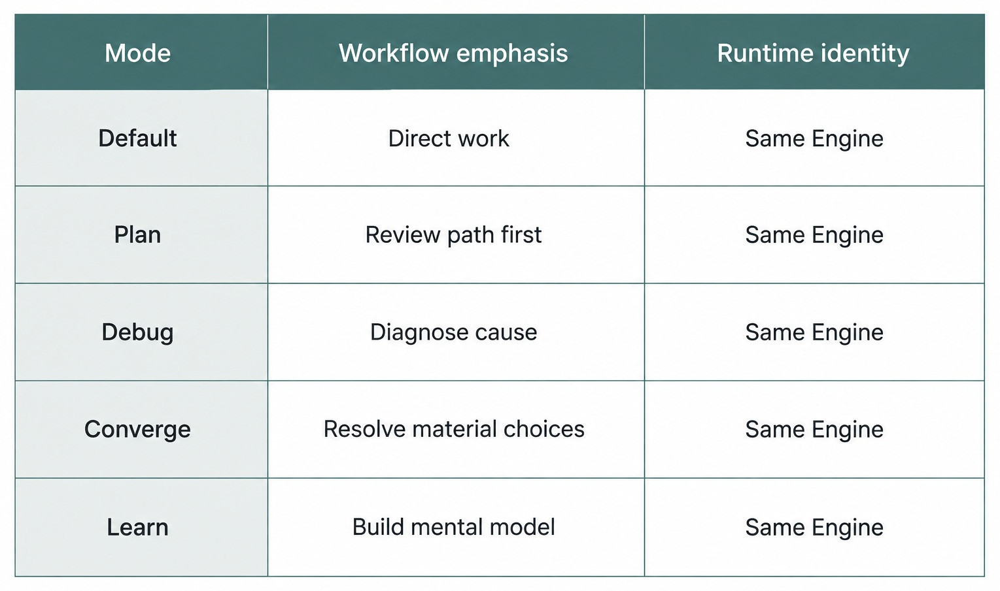
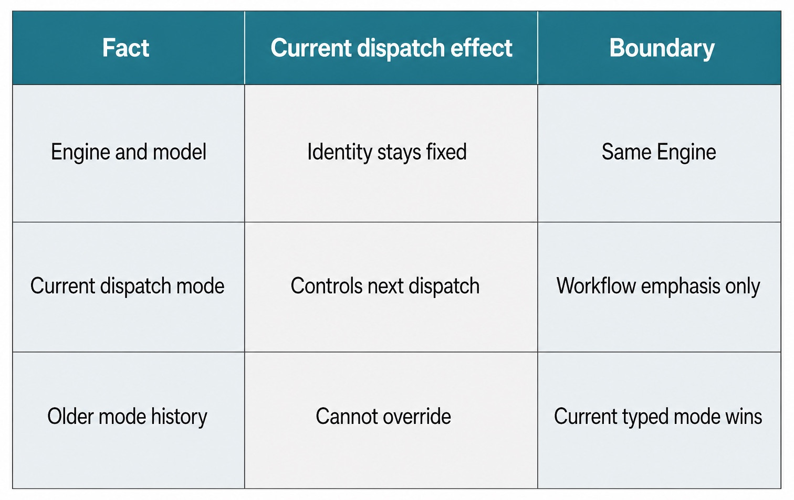

# Chapter 13 — Interaction Modes: Default, Plan, Debug, Converge, and Learn {#chapter-13}

## The question

How do you ask the same Engine to work differently without pretending you selected a different
runtime? Choose an interaction mode. The pinned edition has exactly five: **Default, Plan, Debug,
Converge, and Learn**. A mode changes the current dispatch's cognitive workflow and product
constraints. It does not change Engine identity, exact model identity, Project ownership, or local
capability authority.

_Figure 13.1 — Mode changes workflow emphasis; SAME ENGINE remains the invariant._

**Accessible equivalent.** Default, Plan, Debug, Converge, and Learn shape workflow under the same Engine.

## The plain-English model

| Mode     | Best question                                        | Workflow emphasis                        | Important boundary                            |
| -------- | ---------------------------------------------------- | ---------------------------------------- | --------------------------------------------- |
| Default  | “Do the requested work under normal product rules.”  | direct balanced execution                | no special workflow promise                   |
| Plan     | “Propose and review the path before implementation.” | planning and explicit follow-up          | plan is not implementation authority          |
| Debug    | “Find the cause before changing the system.”         | evidence, reproduction, diagnosis        | diagnosis does not imply a fix was applied    |
| Converge | “Resolve material ambiguity before consequence.”     | discovery and user-owned decisions       | read-only until direction is confirmed/exited |
| Learn    | “Help me build the right mental model.”              | causal explanation and optional practice | teaching does not create a new Engine         |

The product contract owns the five names and their order. The server's capability projection reports
whether the selected Engine supports each mode. The Web projects active non-default modes with one
exhaustive presentation map. Components must not add a sixth local mode.

## One bug-fix journey

Maya begins in Debug: “Reproduce the timezone rollover failure and identify the causal branch.” The
same exact Engine/model binding receives diagnostic workflow constraints. Debug does not grant more
tools, and it does not authorize editing merely because a likely fix becomes obvious.

Once the cause is supported, Maya switches to Plan. A new dispatch asks for the smallest fix, test
coverage, and rollback boundary. The Product Thread preserves the Debug evidence, but the current
Plan dispatch is authoritative for behavior. The old mode cannot remain ambiently active through
session history.

If a product choice remains—whether UTC normalization or caller-local semantics is intended—Maya
can use Converge. The mode directs the Engine to investigate discoverable facts, identify material
user-owned choices, and ask through the structured question path. It stays read-only; confirmation
of understanding is not permission to implement.

Maya may use Learn to understand why the failure crosses midnight. Learn favors a compact causal
model, worked example, and boundary. Returning to Default later creates ordinary current-dispatch
behavior. None of these transitions replaces the Engine or fabricates a new native Session.

## Current-dispatch authority

_Figure 13.2 — Typed current state outranks mode-looking text in history._

**Accessible equivalent.** Engine and model identity remains explicit. Current dispatch mode controls workflow emphasis; older mode history cannot override.

For host-owned modes that require an explicit instruction envelope, `interactionMode.ts` builds the
current-dispatch envelope from typed mode state and canonical raw text. The envelope says older mode
instructions in replay or compacted history cannot change the current dispatch. Supporting material
such as skills, mentions, goals, retrieved content, or tool output also cannot override it.

This exactly-once composition is important. A user-authored string that resembles a mode tag must
not suppress the real Host envelope. Conversely, repeatedly appending mode instructions to stored
transcript would create stale, contradictory authority. The Thread stores typed `interactionMode`;
the dispatch path applies current behavior.

| Fact                 | Sole owner                     | Consumer              | Forbidden duplicate         |
| -------------------- | ------------------------------ | --------------------- | --------------------------- |
| Mode names           | `ENGINE_INTERACTION_MODES`     | server and Web        | component-local modes       |
| Active mode state    | Thread/turn contract           | Composer and dispatch | transcript parsing          |
| Mode support         | adapter capability projection  | selector              | Engine-name guess           |
| Mode envelope        | Engine interaction-mode policy | final Engine input    | arbitrary UI prompt strings |
| Capability authority | HostGateway                    | admitted tools        | mode-specific gateway       |

## Mode changes and queued work

Interaction mode is part of the admitted binding. A queued turn retains the mode chosen when the
request was accepted. Changing the Composer to Learn while a Plan follow-up waits does not rewrite
that queued request. A live Plan follow-up may have dedicated product handling, but it still carries
typed intent through the admission path.

Engine switching and mode switching are therefore different operations. Engine switching can
require stop-first native lifecycle handling. Mode switching updates current/future dispatch
behavior subject to support and product state. If the active execution cannot accept a compatible
change, Haros must queue or stop explicitly rather than changing runtime instructions mid-turn.

## Compare modes while holding execution identity constant

The cleanest way to learn interaction modes is to control the other variables. Keep Project,
Product Thread, exact Engine/model, runtime mode, and harmless prompt constant. Change only the
interaction mode, then inspect the admitted typed value and the workflow that follows. This avoids
attributing differences in model, tools, workspace, or permission policy to the mode.

Use one small parser question: “Why does this date cross into the previous day?” The five modes
should frame the work differently without changing the executor.

Default should answer or act under ordinary product rules without claiming a specialized workflow.
Debug should reproduce, gather evidence, and isolate the causal branch without claiming a fix was
applied. Plan should propose a bounded implementation and proof path without converting review into
authority. Converge should expose the UTC-versus-local-semantics choice and ask, remaining read-only
after agreement. Learn should build a causal model with a worked time-zone example without implying
that teaching selected another Engine.

The comparison becomes diagnostic when Maya records the same harmless prompt under each typed mode.
If the Product Thread, Engine/model, and runtime policy stay fixed while admitted mode and workflow
emphasis change, the boundary holds. If model identity or capability authority changes merely
because she selected Learn or Debug, the implementation has coupled unrelated controls.
Typed mode evidence makes that coupling visible immediately.

Assistant wording alone is weak evidence because responses vary for many reasons. The stronger
evidence is the typed admitted mode, selected Engine capability, current-dispatch envelope where
applicable, and visible active-mode projection. If the response looks like Debug but the admitted
mode is Default, the product did not enter Debug merely because the prose was diagnostic.

Repeat the comparison with queued work. Admit a Plan request, change the Composer to Learn, and
inspect both facts. The queued binding must still say Plan; the Composer prepares Learn for a later
request. This single test catches a queue implementation that reads mutable Thread state at
promotion instead of preserving admission intent.

## Use modes as a deliberate workflow, not a ladder

The five modes are not maturity levels and do not have to be visited in order. Choose the mode that
matches the current question. Debug is valuable when the cause is unknown. Plan is valuable when
the cause is known but the change needs review. Converge is valuable when a material user-owned
choice remains. Learn is valuable when understanding, not immediate execution, is the result.
Default is the correct choice when no specialized contract helps.

For Maya, a sensible sequence is Debug → Converge → Plan → Default, but only because her task has
those boundaries. Debug establishes whether UTC conversion is the cause. Converge asks which
semantic behavior the product should own if source evidence cannot decide it. Plan describes the
smallest approved change after that decision. Default may implement only after an explicit new
request and appropriate runtime authority.

Maya chooses Debug while the cause is unknown and exits only when evidence supports a causal
explanation. Material ambiguity calls for Converge until she confirms direction and explicitly
changes mode. Plan fits a change path that needs review; implementation remains a separate request.
Learn fits a reusable mental model and ends successfully when the reader can explain and apply it.
Clear, authorized work belongs in Default and follows ordinary Turn settlement.

This sequence still does not grant capabilities. Runtime mode and HostGateway decide authority.
Debug can request a file read only through the same capability boundary. Plan can describe a shell
command without running it. Converge remains read-only even if `full-access` is selected, because
the interaction-mode contract constrains the workflow. Learn can include a safe exercise but does
not acquire a special tool gateway.

## Keep entry and exit explicit

Persistent modes such as Converge and Learn remain current until the user changes the visible
Composer control. Completing a subproblem, receiving an answer, or confirming a brief does not
silently exit. The next dispatch uses the typed current mode, not an inference from how the last
Message ended.

Review both sides of that contract. The Web must present the active mode exhaustively, and the next
admitted dispatch must carry the same typed value. An implementation that changes only the badge is
cosmetic. One that changes only Engine input leaves the user unable to predict behavior. Both
projections must derive from the typed owner.

Explicit exit also protects Converge's read-only boundary. Suppose Maya answers “Use UTC
normalization.” That response resolves a choice; it is not permission to edit. Converge can record
the confirmed direction and explain the next step. Maya must switch to Plan or Default and make a
new request before implementation. A hidden automatic exit would combine decision and consequence
in one ambiguous Turn.

| Event                                           | Changes current mode?                      | Why                                      |
| ----------------------------------------------- | ------------------------------------------ | ---------------------------------------- |
| Assistant completes a Debug explanation         | no                                         | output does not mutate typed mode        |
| User answers a Converge question                | no                                         | confirmation is not mode exit            |
| Learn exercise reaches a correct answer         | no                                         | teaching completion is not control input |
| User selects another mode in Composer           | yes, for future/current supported dispatch | explicit product control                 |
| Old history contains a mode-looking instruction | no                                         | current typed state outranks history     |

## Diagnose mode failures at the correct layer

A missing mode in the selector can mean the Engine adapter does not support it, current health is
unsettled, the runtime version is incompatible, or model-specific capability is unknown. A visible
mode that admission refuses can mean state changed after rendering. These are capability or
admission problems, not reasons to translate the request silently into Default.

When investigating, record the exact Engine/model binding, requested mode, projected support, typed
Thread mode, submitted request, and admission result. Then check whether the host-owned envelope was
applied exactly once for the current dispatch. Do not search transcript text for the last mention
of “Plan” or “Debug”; that makes prose a control plane.

Recovery keeps the user's request explicit. If Plan is unavailable, Haros can ask Maya to choose a
supported mode or another exact binding. If history contains a stale Converge instruction, the
current typed mode still wins. If the client and server disagree after reconnect, reconcile the
visible control from server-owned product state before admitting new work.

A focused failure test places a strong mode-looking string in older synthetic history, selects
Default now, and sends a harmless question. The admitted typed mode and Engine input must follow
Default. A second test requests an unsupported mode and expects explicit refusal with the draft
preserved. Together they prove that neither history nor fallback can become a hidden mode owner.

### Audit mode authority after reconnect

Suppose Maya was using Converge when the browser disconnected. On reconnect, an older Debug Message
and a mode-looking retrieved note arrive before current Thread state. The client must not choose a
mode by whichever text appears last. It waits for or reconciles to the typed current mode, then
projects the matching visible control.

Before sending again, compare four facts: the current typed mode, selected Engine/model, projected
mode support, and next dispatch request. If Converge remains current, the dispatch keeps its
read-only decision workflow. If Maya explicitly changes to Plan, the new request carries Plan while
the earlier Converge history remains unchanged. Neither transition modifies runtime mode or grants
HostGateway authority.

Now queue a Learn request and switch the Composer to Default. Restart the disposable product
process before promotion. Recovery should preserve Learn in the queued binding and Default in the
current Composer state. Promoting the queue from mutable Thread mode would silently change admitted
intent; replaying mode text from history would create another hidden owner.

The audit is successful when a reviewer can predict the next workflow from typed state alone and
explain every difference without invoking a new Engine. It fails if a badge and dispatch disagree,
unsupported mode falls back silently, confirmation exits Converge automatically, or old transcript
text regains authority. These conditions make reconnect a sharp proof of the interaction-mode
boundary rather than a visual persistence check.

The handoff statement for such a test should name the fixed Engine/model, requested mode, projected
support, admitted mode, and observable workflow. “The answer looked educational” is not enough to
prove Learn, just as “the answer contained steps” is not enough to prove Plan.

## What can go wrong

### A mode is unsupported

The selected Engine's adapter may not advertise the mode, health may be unknown, or the runtime
version may be insufficient. Keep the selection explicit and explain unavailability. Do not map the
unsupported mode to Default silently.

### Old history contains a stronger-looking instruction

Current typed state wins. Retrieved or replayed text cannot reactivate a prior Converge or Debug
contract.

### Plan is mistaken for authorization

A proposed plan is reviewable product output. Implementation requires a distinct approved path.
Never treat “looks good” in unrelated history as ambient execution permission.

### Converge is treated as a clever planning style

Converge has a hard read-only boundary and structured decision gate. It must not edit while seeking
agreement. The user exits through the visible mode control before a new execution request.

| Transition       | What changes                             | What remains fixed                                | Required evidence                                    |
| ---------------- | ---------------------------------------- | ------------------------------------------------- | ---------------------------------------------------- |
| Default → Debug  | current-dispatch diagnostic workflow     | Product Thread, Engine, exact model, runtime mode | admitted `interactionMode` plus supported capability |
| Debug → Plan     | current-dispatch planning workflow       | prior Messages and provenance                     | new dispatch or explicit supported mode update       |
| Plan → Converge  | read-only decision workflow              | Engine identity and HostGateway owner             | typed mode and visible active-mode presentation      |
| Converge → Learn | explanatory workflow for future dispatch | confirmed product facts and history               | explicit Composer change; no implicit exit           |
| Any mode queued  | nothing about the already admitted mode  | queued binding and request time                   | queued-turn binding remains unchanged                |

## Try it safely

In a synthetic Thread, ask the same harmless question in Debug and Learn. Compare the workflow, not
the model quality. Queue a Plan request, switch the Composer to Default, and confirm the queued
binding still records Plan. Do not ask any mode to perform destructive work.

## Recap

1. Haros has exactly Default, Plan, Debug, Converge, and Learn in this edition.
2. Interaction mode changes workflow, not Engine or model identity.
3. Current typed mode outranks older mode-looking history.
4. Queued work retains its admitted mode.
5. Capability authority remains with HostGateway in every mode.

## Check your model

1. **Does switching from Debug to Plan start a different Engine?** No.
2. **Can an old Converge envelope override current Default?** No; current dispatch state is authoritative.
3. **Why might a mode be unavailable?** Adapter support, health, runtime version, or model capability may not prove it.

## Source trail

- `packages/contracts/src/orchestration.ts` owns the exact five modes and Thread state.
- `apps/server/src/engine/interactionMode.ts` owns current-dispatch envelopes.
- `apps/server/src/engine/planMode.ts` and `debugMode.ts` own focused mode behavior.
- `apps/server/src/engine/executionCapabilityProjection.ts` projects mode support.
- `apps/web/src/interactionModePresentation.ts` exhaustively projects active non-default modes.

<!-- guide-navigation:start -->

[Guidebook contents](../README.md) · [Previous: Permissions and Runtime Modes](12-permissions-and-runtime-modes.md) · [Next: Queue, Steer, Interrupt](14-queue-steer-interrupt.md)

<!-- guide-navigation:end -->
