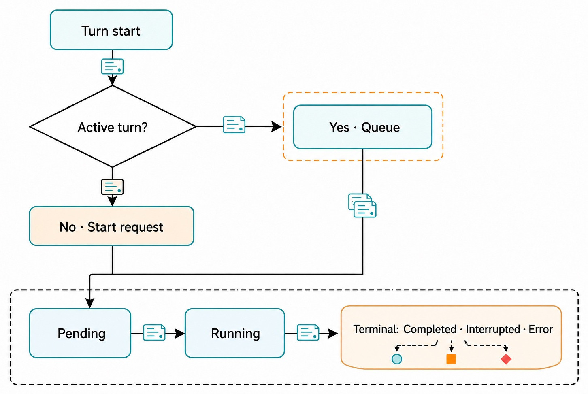
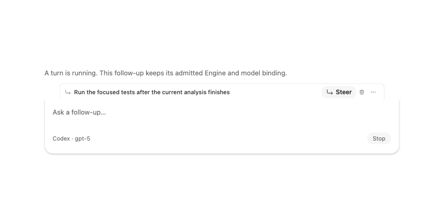
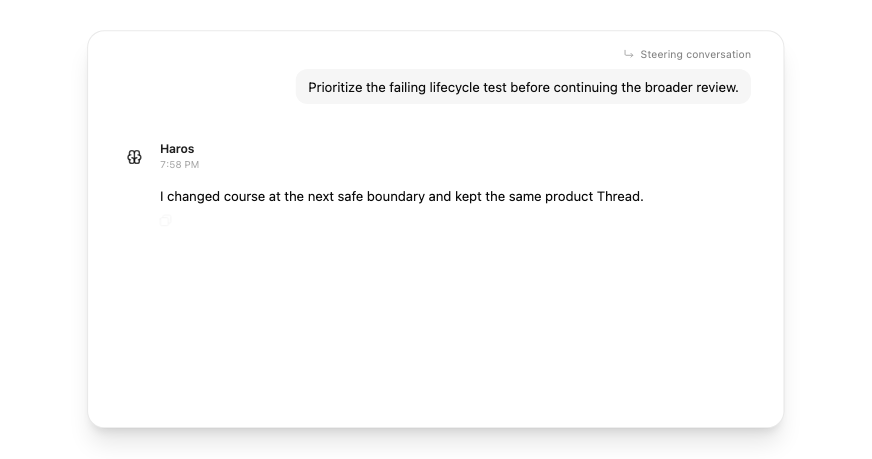
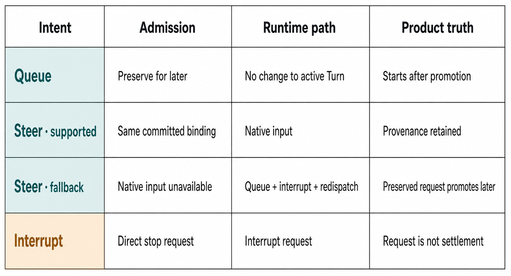

# Chapter 14 — Queue, Steer, Interrupt {#chapter-14}

## The question

An Engine is already working when you realize something new. Should Haros wait, change the running
conversation's course, or stop the current turn? **Queue**, **Steer**, and **Interrupt** are three
different instructions. Treating them as synonyms leads to lost intent, surprising ordering, or a
false belief that execution was cancelled before it actually settled.

Use this first approximation:

- **Queue** means “keep this follow-up and run it after the current turn can settle.”
- **Steer** means “change course now if the active Engine can accept live input; otherwise preserve
  the follow-up, request interruption, and redispatch it safely.”
- **Interrupt** means “request that the active turn stop; do not invent a successful result.”

The important word is _request_. Product state can record intent immediately, while the Engine
runtime still needs to acknowledge or reach a terminal boundary. Haros therefore distinguishes a
visible request from authoritative settlement.

_Figure 14.1 — Admission is conditional; projected lifecycle begins only after Haros accepts the
start request or queued intent._

**Accessible equivalent.** A turn start branches on whether a turn is active. No active turn produces a start request; an active turn queues. Both admitted paths project pending, then running, then one of completed, interrupted, or error.

## One Thread, one active course

A Product Thread may contain many messages and turns, but the active execution course must remain
understandable. Haros does not start unlimited overlapping turns in the same Thread and hope their
events sort themselves out. A new `thread.turn.start` command carries its admitted Engine selection,
runtime mode, interaction mode, model presentation identity, and dispatch mode. The decider compares
that binding with the committed Thread and active Session before deciding whether to start, queue, or
steer.

The default dispatch mode in the product contract is `queue`. The Web preference also defaults
follow-ups to Queue. While no turn is live, the practical distinction disappears: the new request can
start through ordinary admission. While a turn is live, the selected follow-up behavior matters.

| Instruction | User intent       | Product action while a turn is live                                                                        | What it does not guarantee                               |
| ----------- | ----------------- | ---------------------------------------------------------------------------------------------------------- | -------------------------------------------------------- |
| Queue       | Preserve order    | Store the admitted follow-up for later promotion                                                           | That it starts before the active turn settles            |
| Steer       | Change course     | Inject natively when supported and binding-compatible; otherwise queue, request interrupt, then redispatch | That every Engine supports mid-turn injection            |
| Interrupt   | Stop current work | Emit an interrupt request for the active turn                                                              | Immediate process death, rollback, or a completed answer |

Queue and Steer are dispatch choices for a new message. Interrupt can stand alone. This distinction
explains why “Steer” may create both a preserved queued event and an interrupt request on an Engine
without native steering. Haros protects the new instruction before disturbing the old execution.

## Queue: preserve the follow-up and its binding

Suppose an Agent is examining a repository and you type, “Run the focused tests after the current
analysis finishes.” Queue is appropriate because the new work depends on the current work but does
not invalidate it.

_Figure 14.2 — A queued follow-up remains visible and actionable while the current turn owns
execution._

The row is more than a visual reminder. At admission time, the queued turn captures the exact
binding needed to execute truthfully: Engine selection, exact model, runtime and interaction modes,
and relevant Engine options. When the Queue later drains, the server requires that admission-time
selection. It does not silently substitute whatever model happens to be selected in the UI then.

That property prevents a subtle error. Imagine you queue a follow-up for Engine A, then change the
Thread selector to Engine B before the active turn settles. If the queued item inherited B at drain
time, the product would rewrite an already accepted instruction. Instead, the queued item owns its
admitted binding. A later inability to use that binding must become an explicit failure or recovery
choice, not silent substitution.

The durable promotion repository also separates Queue state from presentation. Pending items can be
claimed for promotion, marked promoted, released after a failed attempt, or cancelled. Claims have
owners and expiry, so a temporary drain attempt does not by itself erase the queued intent. Deleting
a Thread cancels both ordinary queued rows and rows currently being promoted, avoiding resurrection
after a race.

| Queue state | Meaning                                | Safe next transition                       | Preserved fact                                |
| ----------- | -------------------------------------- | ------------------------------------------ | --------------------------------------------- |
| queued      | Waiting for eligible promotion         | promoting or cancelled                     | Message and admitted dispatch binding         |
| promoting   | A bounded owner is attempting dispatch | promoted, released to queued, or cancelled | Original queued event sequence and binding    |
| promoted    | Start request was emitted              | Runtime lifecycle owns the turn            | Promotion identity and history                |
| cancelled   | The queued work must not start         | Terminal                                   | Cancellation rather than silent disappearance |

This persistence is an implementation detail supporting a product principle: accepted follow-up
intent must not vanish merely because a process boundary or transient failure interrupts promotion.
The exact database shape may change in a later edition; the principle and visible behavior require
fresh evidence then.

## Steer: change course without rewriting history

Steer is for information that changes the usefulness of the active response. If the Engine is
reviewing broad architecture and you discover a failing lifecycle test, you might say, “Prioritize
the failing lifecycle test before continuing the broader review.”

_Figure 14.3 — A real timeline marker preserves provenance: this message changed the active
conversation rather than joining the ordinary Queue._

The marker matters because the transcript should explain why the response changed direction. The
message is still part of the Product Thread, and the product retains dispatch provenance. Steer does
not edit the preceding user message or pretend the new instruction was present from the start.

Native steering is conditional. The active Engine must advertise support, the request must target
the same committed binding, and the Thread must actually be running. When those conditions hold,
Haros can pass the new input into the live execution path. When they do not, the decider chooses a
queue–interrupt–redispatch disposition: record the message, queue the admitted request, request an
interrupt of the old turn, and promote the preserved request when the lifecycle permits.

That fallback may feel slower than direct injection, but it is more truthful. It avoids telling a
runtime to change model, Engine, or interaction contract in the middle of a turn when it cannot do
so safely.

_Figure 14.4 — Queue, Steer, and Interrupt express different intent. The Steer path may vary by
Engine capability while preserving the same product meaning._

**Accessible equivalent.** Queue preserves work for later, leaves the active Turn unchanged, and starts only after promotion. Supported Steer uses native input for the same committed binding and retains provenance. When native input is unavailable, fallback Steer uses queue, interrupt, and redispatch so the preserved request can promote later. A direct Interrupt is a stop request, and the request itself is not terminal settlement.

## Interrupt: request settlement, then wait for truth

Interrupt is appropriate when continuing the current turn is wasteful or unsafe—for example, the
task targets the wrong directory, the premise is invalid, or the user needs control back before
another action.

The product emits `thread.turn-interrupt-requested`. That event records intent and identifies the
target turn when available. An Engine reactor or adapter performs runtime-specific cancellation.
Product settlement follows authoritative runtime state. The projection may show interruption intent
while keeping the turn active until the runtime supplies a terminal event; otherwise a late success
or error could be overwritten by a premature guess.

An interruption also does not mean rollback. Files, commands, or external actions already completed
before cancellation may remain. HostGateway receipts, Git state, and the product Timeline are the
places to inspect what happened. If rollback is desired, it is a separate, explicit operation with
its own evidence and failure modes.

When a Thread has an active Goal, a direct interrupt also pauses Goal pursuit in the pinned edition.
That prevents an automatic continuation loop from immediately reviving work the user just stopped.
This is current alpha behavior tied to the decider source, not a universal promise about all future
Goal designs.

_Figure 14.5 — Product Thread retention and native Engine Session continuation are different facts;
interrupt settlement promises neither completion nor rollback._

**Accessible equivalent.** The matrix columns are Condition, Runtime handling, and Product settlement. No active session → Settle locally → Terminal: Interrupted. Main Session → Confirmed stop → Terminal: Interrupted. Child Session → Await terminal event → Terminal event settles Turn. Timeout / uncertain → Stop Session → Settlement after outcome. Rejected → Failure + local settlement → Terminal: Interrupted. Product Thread retained. Native Session not promised.

## Failure, restart, and recovery

Queue and interruption are valuable only if they survive the failures they are meant to manage.
Haros separates durable product state from in-memory Engine runtimes. If the server exits while a
turn is running, the runtime process cannot deliver the terminal event after restart. Replaying the
event log alone would faithfully reconstruct a stale “running” projection, leaving the UI stuck.

Startup reconciliation therefore looks for turns that only a dead in-process runtime could advance.
Before accepting new client commands, it emits failure activities for stale pending approvals or
user questions and settles the orphaned Session as interrupted with no active turn. The ordinary
projection path then clears blocked controls and records a terminal state.

This recovery does not rewrite old history. It adds new reconciliation facts. Nor does it claim the
Engine performed a graceful cancellation before the process died. It says the product can no longer
wait for a runtime that no longer exists and returns control honestly.

| Failure                              | What remains                            | Visible or durable response                                       | What is not promised                         |
| ------------------------------------ | --------------------------------------- | ----------------------------------------------------------------- | -------------------------------------------- |
| Engine lacks native steering         | New message and admitted binding        | Queue, request interrupt, redispatch later                        | Mid-turn injection                           |
| Promotion attempt fails              | Queued row and claim metadata           | Release claim for another bounded attempt                         | Infinite instant retry                       |
| Server restarts during a turn        | Product events, messages, queued intent | Reconcile orphan as interrupted; clear stale pending interactions | Continuation of the dead native Session      |
| User interrupts after side effects   | Timeline and operation receipts         | Terminal interruption when runtime settles                        | Automatic reversal of completed side effects |
| Selected binding becomes unavailable | Accepted queued binding                 | Explicit failure/recovery path                                    | Silent Engine or model substitution          |

## A decision procedure

Ask these questions in order:

1. **Would the current work still be useful if it finishes as planned?** If yes, Queue.
2. **Does the new fact materially change the current answer?** If yes, Steer.
3. **Would continuing be actively wrong, costly, or unsafe?** If yes, Interrupt.
4. **Do you also need replacement work to run?** If so, preserve it as a queued or steered message;
   do not assume Interrupt contains an unstated next task.

Queue is usually the calm default. Steer is not “higher priority Queue”; it changes the active
course and therefore needs visible provenance. Interrupt is not “delete”; it initiates lifecycle
settlement and returns control after truth catches up.

### The opposite-behavior shortcut

The pinned Web client can resolve an explicit “use the opposite follow-up behavior” gesture while a
turn is live: Queue becomes Steer and Steer becomes Queue. This is a convenience at the Composer
boundary, not a third dispatch mode. The resulting command still carries `queue` or `steer`, so the
server does not need to interpret a keyboard gesture or local preference.

That dependency direction is deliberate. Preferences and gestures are presentation facts; dispatch
mode is product intent. If a shortcut changes later, the orchestration contract remains stable. If
no turn is live, follow-up resolution returns Queue because there is no active course to steer. The
ordinary start path can then admit the message immediately.

When teaching or debugging the shortcut, inspect the Timeline and queued row rather than inferring
behavior from the key you pressed. The visible product facts tell you which intent Haros admitted.
This also avoids a common mistake in bug reports: saying “Steer failed” when the gesture actually
resolved to Queue under the current preference.

### Ordering is part of the promise

Queued promotion is not merely “run something later.” Ordering carries user intent. Ordinary queued
items are considered by their durable event sequence, while a queued Steer fallback is prioritized
so the newest course correction can take effect after interruption. The repository's promotion
query encodes that distinction. This is current implementation evidence for the pinned edition, not
an invitation for UI code to reproduce the sort.

The practical lesson is to keep related instructions in one follow-up whenever their internal order
matters. Five separately queued micro-prompts create five separately admitted units, each with its
own binding and cancellation lifecycle. Haros can preserve them, but it cannot infer that the third
sentence was logically a precondition for the first. Write one coherent queued instruction or use
an explicit plan when the steps form one atomic intention.

Likewise, repeated Steer messages are not a substitute for waiting until the active course visibly
changes. A Steer may be native, or it may be preserved while interruption settles. Sending another
correction before observing the first can create a newer priority without clarifying the desired
final course. Use the Timeline marker, current turn state, and queued rows as feedback. The product
is designed to make those facts visible so you do not have to guess from response timing.

## Try it safely

Use a synthetic or disposable Thread with a harmless long-running prompt, such as asking the Engine
to inspect a small fixture and explain its structure. While it runs:

1. Queue “Summarize the findings in three bullets after you finish.” Confirm that the follow-up row
   remains visible.
2. On another run, Steer “Check the error-handling branch first.” Confirm that the Timeline marks
   the message as steering rather than ordinary queued work.
3. On a third run, Interrupt. Confirm that the UI eventually reaches a terminal state and that the
   original transcript remains visible.

Do not use real deployments, purchases, destructive commands, or private Engine state for this
exercise. The observable result is lifecycle behavior and provenance, not a useful production
artifact.

## Recap

1. Queue preserves a follow-up and its admission-time binding for later promotion.
2. Steer changes course natively only when the active Engine and binding support it; otherwise Haros
   preserves the message, interrupts, and redispatches.
3. Interrupt records stop intent but waits for authoritative terminal settlement.
4. Interruption does not imply rollback or native Session continuation.
5. Restart reconciliation adds honest terminal facts so dead runtimes do not leave turns stuck.

## Check your model

1. **Why does a queued turn keep its original Engine/model binding?**  
   Because admission already accepted that exact instruction. Using a later selector value would
   silently rewrite the request.

2. **What happens when an Engine cannot steer natively?**  
   Haros can preserve the steered message as queued work, request interruption of the active turn,
   and redispatch the preserved request after settlement.

3. **Does an Interrupt prove all side effects stopped or rolled back?**  
   No. It requests cancellation. Inspect terminal state and receipts; rollback is separate.

## Source trail

- `packages/contracts/src/orchestration.ts` owns `TurnDispatchMode` and its `queue`/`steer` values.
- `apps/web/src/localPreferences.ts` owns follow-up preference resolution while a turn is live.
- `apps/web/src/components/chat/ComposerQueuedHeader.tsx` owns the real queued-row UI in Figure 14.2.
- `apps/web/src/components/chat/MessagesTimeline.tsx` owns the steering provenance marker in Figure
  14.3.
- `apps/server/src/orchestration/decider.ts`, `thread.turn.start`, owns start/queue/native-steer/
  queue-interrupt-redispatch admission.
- `apps/server/src/persistence/Layers/QueuedTurnPromotions.ts` owns durable promotion claims.
- `apps/server/src/orchestration/startupTurnReconciliation.ts` owns restart-orphan settlement.
- `apps/web/src/components/ChatView.browser-suite.tsx` and focused server integration tests exercise
  queued follow-ups, Steer disposition, binding preservation, interruption, and recovery paths.

<!-- guide-navigation:start -->

[Guidebook contents](../README.md) · [Previous: Interaction Modes: Default, Plan, Debug, Converge, and Learn](13-interaction-modes.md) · [Next: Timeline, Activity, and Model Provenance](15-timeline-activity-model-provenance.md)

<!-- guide-navigation:end -->
