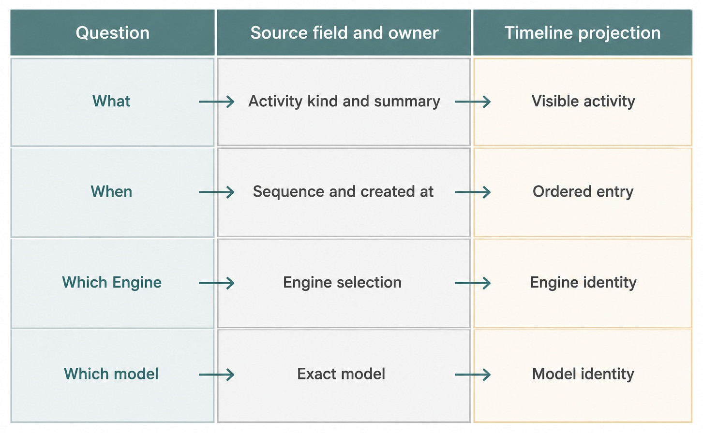
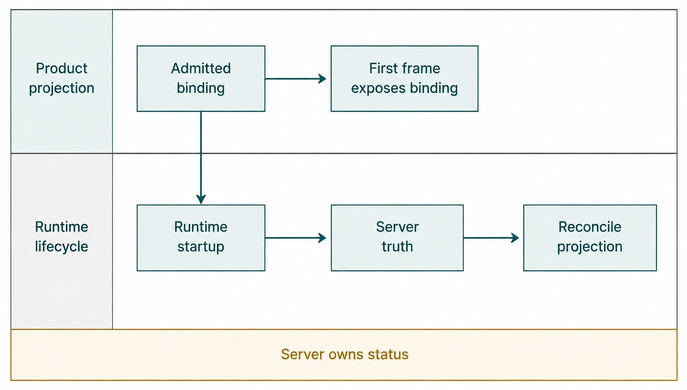

# Chapter 15 — Timeline, Activity, and Model Provenance {#chapter-15}

## The question

After Haros works, how can you tell what happened, when it happened, and which admitted Engine and
model were responsible? Read the Timeline as a projection of product history, not as decorative
streaming text. Messages explain the conversation. Activities explain work and control events.
Turn provenance identifies the exact selection admitted for the response.

_Figure 15.1 — A useful Timeline answers four questions without asking the reader to infer identity._

**Accessible equivalent.** Timeline evidence answers what, when, which Engine, and which model.

## The plain-English model

A Timeline combines several product facts in chronological order. User and assistant Messages carry
the visible conversation. Activities carry typed summaries of tool work, approvals, user input,
reasoning, failures, Queue/Steer provenance, and recovery. Latest-turn state supplies lifecycle.
Turn provenance supplies exact Engine/model identity from admission.

| Evidence           | Answers                                    | Stable owner                 | Must not be inferred from |
| ------------------ | ------------------------------------------ | ---------------------------- | ------------------------- |
| Message            | what was said and its visible time         | product message projection   | native console log        |
| Activity           | what operation/control fact occurred       | activity event/projection    | animation or toast        |
| Latest Turn        | whether bounded work is running or settled | turn lifecycle               | last text color           |
| Turn provenance    | admitted Engine, model, request time       | admission/projection         | current Composer selector |
| Receipt/checkpoint | what a capability or change completed      | HostGateway/capability owner | assistant claim alone     |

## First-frame identity

Haros aims to show truthful Engine/model identity immediately after submission. The Web has the
exact binding it is sending, so it can attach a presentation identity to the pending user Message
before Engine startup completes. This improves responsiveness without making the client a second
source of truth.

_Figure 15.2 — Immediate identity and later reconciliation are complementary, not competing truths._

**Accessible equivalent.** The admitted binding can be shown on the first frame while runtime startup continues. Server truth reconciles status.

The distinction is subtle. Engine/model identity is already part of the proposed/admitted request,
so the pending row can show it. Runtime status is still evolving, so “starting,” “running,” or
failure must reconcile from server facts. A launch failure does not mean the UI lied about the
selection; it means that exact selected runtime failed to start.

## One bug-fix journey

Maya submits the parser diagnosis with an exact Engine/model binding. The Timeline immediately shows
her Message and the selected identity. Startup activity follows. The Engine reads the focused test,
runs a command through HostGateway, and emits reasoning/tool activities. An approval request, if
required, appears with its own lifecycle rather than as assistant prose.

When the command finishes, its receipt or structured activity records the outcome. The assistant
Message summarizes the cause. The latest Turn settles completed, interrupted, or error. Maya can
therefore distinguish “the assistant said the test passed” from “the admitted command produced a
successful receipt.”

She then changes the Composer to another model for a follow-up explanation. The earlier Turn keeps
its original provenance. Timeline identity is historical evidence, not a live mirror of the picker.
If the second request queues, its admitted binding remains frozen while the selector continues to
change.

## How Timeline entries are derived

The Web's work-log derivation combines canonical Messages, plans, and activities. It orders entries
using activity sequence where available, preserves richer lifecycle updates, and avoids reviving
turnless historical activity as if it belonged to a later active turn. Presentation groups or
merges repeated engine tool updates, but it must not erase terminal failure detail.

This is why the Timeline is a projection rather than the event store itself. Rendering may condense
many low-level updates into one readable row. The source facts remain server-owned. Reconnect
rebuilds the projection; the client does not promote its last animation into durable truth.

| Projection behavior         | Reader benefit              | Truth boundary                              |
| --------------------------- | --------------------------- | ------------------------------------------- |
| Order by sequence/time      | causal reading              | never invent sequence absent evidence       |
| Merge tool progress         | one comprehensible activity | retain terminal tone/detail                 |
| Mark steering               | explains course change      | do not edit prior Message                   |
| Show pending approval/input | identifies why work waits   | interaction lifecycle remains server-owned  |
| Settle orphaned activity    | clears stale running rows   | requires authoritative turn/restart outcome |

## Provenance is more than a model label

`OrchestrationTurnProvenance` includes the pending Message identity, optional resolved Turn ID, exact
`EngineSelection`, optional model presentation identity, and request time. This lets the product
show a friendly exact-model label without replacing stable binding fields. It also supports the
period before a pending request has received its final Turn ID.

Engine identity comes from the canonical descriptor owner. Model presentation may come from the
credential-blind catalog. Neither includes credentials. The Web should never parse private Engine
configuration merely to decorate history.

| Provenance field      | Meaning                                  | Why retained                       | Not equivalent to     |
| --------------------- | ---------------------------------------- | ---------------------------------- | --------------------- |
| Pending Message ID    | user intent awaiting/receiving execution | connects first frame to later turn | native Session ID     |
| Turn ID               | bounded admitted lifecycle once resolved | joins activities and settlement    | Product Thread ID     |
| Engine selection      | exact Engine/model/options               | historical execution choice        | current picker value  |
| Presentation identity | friendly credential-blind label          | readable display                   | secret catalog/config |
| Requested time        | admission chronology                     | ordering and diagnosis             | runtime start time    |

## Activity tones and semantics

The activity contract provides `info`, `tool`, `approval`, and `error` tones plus a kind, summary,
JSON payload, optional Turn ID, sequence, and creation time. Tone helps presentation but does not
replace kind or payload. An approval-colored row is not itself proof of approval; lifecycle state and
the corresponding decision matter.

Activities should be specific enough to diagnose control flow but free of secrets and raw private
responses. Summaries can name bounded operations. Payloads can carry structured evidence required
by the product. Neither should leak credentials, private endpoints, or unrelated local paths.

## Read one Timeline entry from claim to evidence

Begin with the user-visible claim, then work inward. If an assistant Message says “the focused test
passed,” locate the tool activity that represents the test run, its terminal tone/state, and the
structured outcome or receipt. Join that activity to the Turn. Finally read the Turn's admitted
Engine/model provenance. Each step answers a different question; no single row should be stretched
to answer all of them.

The user Message, not the Thread title, says what Maya asked. Message and Activity `turnId` values
plus latest-Turn state identify the bounded work; visual grouping is insufficient. Turn provenance,
not the current picker, identifies the admitted Engine/model. A terminal capability outcome or
receipt proves whether a command finished, while the authoritative latest-Turn terminal state proves
whether the whole Turn settled. After reconnect, durable sequence, projection, and reconciliation
explain the change; client arrival order does not.

For Maya's parser diagnosis, the evidence chain might be: user Message → admitted Turn provenance
→ file-read activity → test-command receipt → assistant explanation → completed latest Turn. If the
receipt is missing, the explanation may still be useful, but the Guidebook should not claim that
the command succeeded. If the command succeeded but the Turn later errored while writing a response,
the receipt and Turn terminal state should both remain visible.

This approach also prevents “green by association.” A successful tool row does not automatically
make every later claim true. A completed Turn does not prove an external side effect that lacks its
own evidence. Timeline is a map to product facts, not a machine that upgrades prose into proof.

## Separate chronology from arrival order

Live updates can arrive in bursts, reconnect after interruption, or replace a partial tool-progress
row with a terminal one. The readable Timeline may merge those updates, but causal order should
come from product sequence and durable timestamps, not the order in which the browser happened to
receive frames.

Imagine that Maya disconnects while a test command is running. On reconnect, the browser first
receives the assistant Message and then replays an earlier progress activity. Sorting by arrival
would place the progress after the answer and might revive a running indicator. Correct derivation
uses activity sequence and terminal lifecycle evidence, retaining the richer settled row.

Repeated updates for one activity identity should merge or replace without creating a second fact.
A late nonterminal update cannot revive work after a terminal outcome. Known activity sequence sets
canonical order; an activity without sequence uses stable fallback rules without invented
causality. An orphaned running state after restart settles only through authoritative
reconciliation.

Presentation can still condense detail. Several progress updates may become one tool row; approval
states may become one readable lifecycle. Condensation is safe only when it preserves terminal
failure, request identity, and the evidence needed to distinguish pending from completed work.

## Use provenance to compare past and future choices

The Composer selector answers “what would the next request use?” Turn provenance answers “what did
this request admit?” Put them side by side when diagnosing identity. Change Maya's current model
after the diagnosis Turn settles. The old row should keep the original exact selection while the
Composer shows the future choice. Queue a second request and change the picker again; the queued
binding should remain frozen too.

Friendly model names complicate the view but not the ownership. A catalog can supply a
credential-blind presentation label, while the exact machine binding remains authoritative. If a
label changes between catalog refreshes, historical records can retain the readable presentation
captured for that request without changing Engine kind or model slug. They must never read private
configuration to reconstruct a nicer name.

The Composer picker describes a proposed future request from the current descriptor/catalog
projection. A pending first frame describes the request being admitted from its exact submitted
binding. A queued row describes already admitted future work from a frozen queued binding. A settled
Timeline row uses Turn provenance for historical identity. Current runtime status is different
again: it comes from the server lifecycle projection.

This temporal separation makes first-frame identity honest. The request can expose which binding it
contains before startup finishes. A later launch failure changes runtime status, not the fact that
this was the selected Engine/model. The Timeline should show “that binding failed to start,” not
replace it with an apparently successful fallback.

## Build a minimal incident record

When Timeline evidence looks wrong, collect only the facts needed to distinguish projection,
lifecycle, and execution: edition commit, Thread ID, Message ID, Turn ID, activity identity and
sequence, exact provenance, latest-Turn state, and relevant receipt identity. Use synthetic or
sanitized values in published evidence. Do not include credentials, raw provider responses, private
endpoints, or unrelated local paths.

For a stale running row, compare the activity's last projected state with the Turn's terminal state
and restart reconciliation. For a changed model label, compare historical provenance with the
current picker. For a duplicate tool entry, compare activity identity and sequence before assuming
the operation ran twice. For an overconfident assistant summary, compare the claim with the receipt
and resulting artifact.

The record should end with an observable statement, such as: “After synthetic restart, the original
activity retained its identity, projected interrupted, the Turn settled interrupted, and no success
receipt existed.” That is more useful than “Timeline recovered correctly” because it names the
facts a reviewer can reproduce. If one link in the chain is unavailable, say what remains unproven
rather than filling the gap with narrative.

### Review a mixed-success Turn

Consider a Turn in which the file read succeeds, the test command fails, and the assistant still
produces an explanation. Timeline should retain all three meanings. The file activity has a
successful outcome, the test activity has terminal failure evidence, and the assistant Message is a
claim informed by those results. The latest Turn may complete with an answer or settle with an
error according to authoritative lifecycle facts; presentation must not recolor the failed command
to match the prose.

After reconnect, verify that activity identities and sequence preserve the same order, repeated
progress updates remain condensed, and no running row is revived. Change the current model before
opening the Thread again. Historical provenance must still identify the Engine/model admitted for
the mixed-success Turn.

This example teaches why Timeline is not a binary success indicator. One Turn can contain several
capability outcomes and a useful assistant explanation without making every operation successful.
A reviewer should cite the exact row or receipt that supports each claim and state “not proven” for
missing evidence. That habit preserves both usefulness and technical honesty.

## What can go wrong

### The current picker rewrites history

Historical rows must use Turn provenance. A newly selected model affects new requests only. If old
rows change labels when the picker changes, the UI has confused draft state with admitted state.

### A tool row remains running after restart

An in-memory runtime may have died. Startup reconciliation and projected turn settlement must close
or fail orphaned activity truthfully. The client must not hide the row merely because time elapsed.

### A summary claims more than a receipt

Assistant prose may be mistaken. Inspect structured tool outcome, file diff, test result, or
checkpoint. The Timeline helps locate evidence; it does not turn narrative into proof.

### Sensitive data enters activity payloads

Activities are product-visible and durable. Capability owners must sanitize and bound payloads.
Never store keys, passwords, full private endpoints, or raw service responses for convenience.

### Ordering differs after reconnect

Use canonical sequence where present and stable timestamp/identity rules otherwise. Client arrival
order is not durable causality.

## Ownership table

| Fact                   | Sole owner                           | Consumer                | Forbidden duplicate       |
| ---------------------- | ------------------------------------ | ----------------------- | ------------------------- |
| Message/Turn history   | orchestration persistence/projection | Timeline                | Web-only transcript store |
| Activity lifecycle     | event and capability owners          | work-log derivation     | toast history as evidence |
| Engine identity        | `ENGINE_DESCRIPTORS`                 | provenance presentation | per-component names       |
| Exact model provenance | admitted `EngineSelection`           | Timeline                | current selector          |
| Tool result/receipt    | HostGateway and service owner        | activities, review      | assistant claim           |

## Try it safely

Use a synthetic Thread and harmless file-inspection request. Before sending, note the exact
Engine/model. After sending, verify the pending Message shows that identity on the first frame. Let
the fixture emit one tool activity and terminal result. Change the Composer model and confirm the
old row remains unchanged.

If a restart fixture exists, replay only synthetic data and confirm an orphaned running row settles
through reconciliation. Do not use real user paths, private Engine state, credentials, paid calls,
or irreversible actions.

The observable result is a four-part explanation for each step: what, when, which Engine, which
model. Where receipt evidence is absent, say “not proven” rather than filling the gap with prose.

## Recap

1. Timeline combines Messages, activities, lifecycle, and provenance as a product projection.
2. First-frame Engine/model identity comes from the exact request binding.
3. Runtime status still reconciles from server truth.
4. Historical provenance never follows the current Composer selector.
5. Tool receipts and structured outcomes outrank assistant claims as execution evidence.

## Check your model

1. **Why can the first frame show a model before startup finishes?** The exact binding is already part of the request; runtime status is separate.
2. **What proves a command succeeded?** Its structured outcome/receipt and relevant artifact evidence, not assistant prose alone.
3. **Should reconnect ordering follow client arrival?** No; use canonical sequence and durable product facts.

## Source trail

- `packages/contracts/src/orchestration.ts` owns activity, latest-Turn, and provenance schemas.
- `apps/server/src/orchestration/decider.ts` admits the exact binding.
- `apps/server/src/orchestration/projector.ts` projects durable history.
- `apps/web/src/workLog.ts` derives readable Timeline entries.
- `apps/web/src/components/chat/MessagesTimeline.tsx` renders message and activity provenance.
- `apps/web/src/workLog.test.ts` proves ordering, merging, failure tone, steering, and reconnect cases.

<!-- guide-navigation:start -->

[Guidebook contents](../README.md) · [Previous: Queue, Steer, Interrupt](14-queue-steer-interrupt.md) · [Next: Groups Without Moving Projects](../part-03-organize-work/16-groups-without-moving-projects.md)

<!-- guide-navigation:end -->
