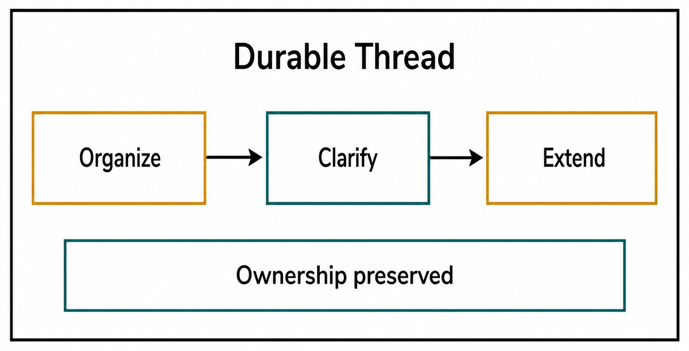
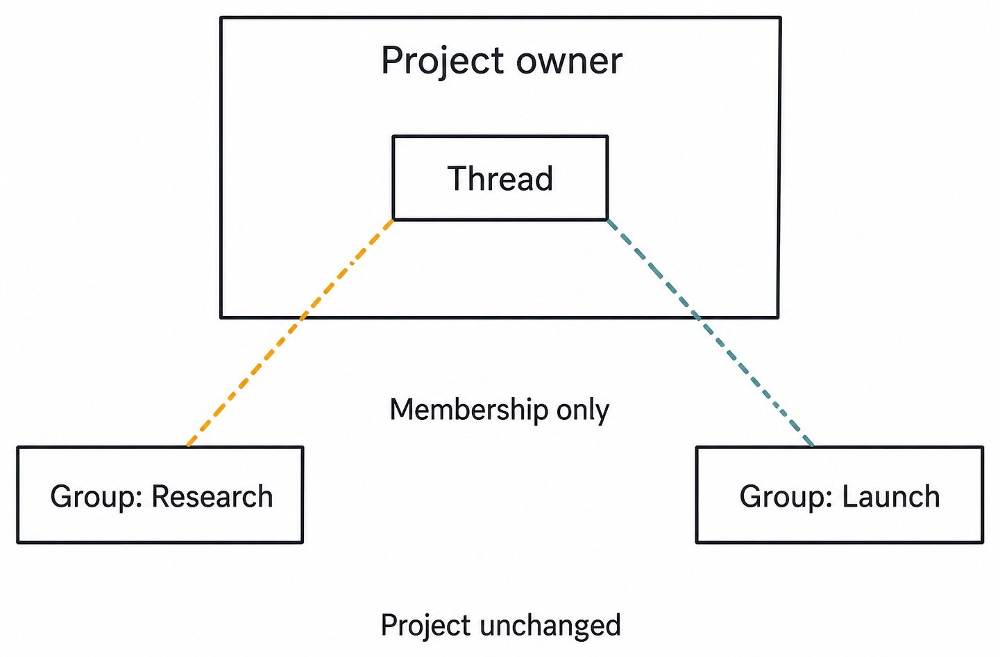
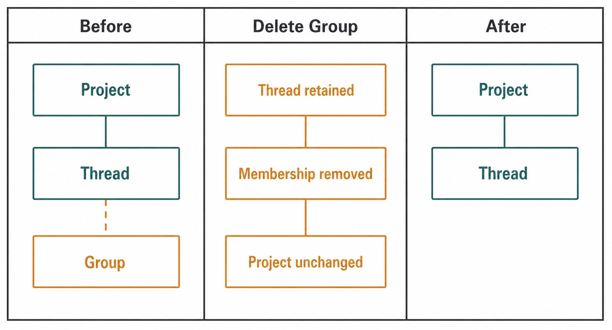

# Chapter 16 — Groups Without Moving Projects {#chapter-16}

_Part III opener — Organizing a line of work adds durable relationships around a Thread without
changing who owns its history._

**Accessible equivalent.** Within a Durable Thread boundary, three labelled rectangles form the directional path Organize, Clarify, Extend. A lower labelled band states Ownership preserved across the path.

## The question

Suppose one Project contains twenty Threads. Some investigate the same release, some concern a
customer report, and some are temporary experiments. You want a view named “Release readiness”
that shows five of those Threads together. You do **not** want to relocate their files, change their
Project, merge their histories, or create five copies. A Haros Group solves exactly that narrower
problem: it is an ordered membership overlay on Threads that already exist.

This distinction is the chapter's central rule. A Project says where work lives. A Thread says which
durable line of conversation and execution history the work belongs to. A Group says which existing
Threads you want to see together for an organizing purpose. Changing the overlay does not rewrite
either underlying owner.

_Figure 16.1 — Group membership changes organization, not Project ownership or Thread history._

**Accessible equivalent.** The Project owner boundary contains one Thread. Group: Research and Group: Launch remain outside the Project boundary and connect to the Thread only through membership. Project ownership remains unchanged.

## Three different questions

The easiest way to avoid mistakes is to ask what question each object answers.

| Object         | Question it answers                                               | Durable fact it owns                         | What it does not do                         |
| -------------- | ----------------------------------------------------------------- | -------------------------------------------- | ------------------------------------------- |
| Project        | Where is this body of work rooted?                                | workspace and Project identity               | classify every investigation                |
| Thread         | Which product history does this task continue?                    | Messages, Turns, activity, and relationships | imply a single visual category              |
| Group          | Which existing Threads should appear together, and in what order? | Group identity plus ordered Thread IDs       | move files, copy history, or change Project |
| Native Session | Which Engine execution context handled work?                      | Engine-owned runtime state                   | determine Group membership                  |

This model is deliberately asymmetric. Groups point to Threads. Threads do not become children whose
identity is rewritten by the Group. A membership list can be updated or deleted while a Thread keeps
the same ID, Project, Messages, and execution history. That is why the UI can offer flexible views
without turning organization into a data migration.

The many-to-many part matters too. One Thread can help both “Release readiness” and “Parser defects.”
Adding it to both Groups is not duplication. Both memberships resolve to the same durable Thread.
If a new Message appears in that Thread, either Group view reaches the same updated history.

## Where Groups are available

The current contract scopes Groups to folder-backed Agent work. That boundary is not a judgment that
Chat or Studio are less important. It reflects what the product presently owns and projects for this
organizing feature. A junior reader should resist the temptation to infer a universal taxonomy from
one visible control.

A useful test is: “Could I explain the result using only a list of Thread IDs?” If yes, a Group may
be the right abstraction. If the desired action needs moving a repository, changing a working
directory, creating an isolated workspace, or transferring execution to another Engine, it is not a
Group operation.

## Build a Group deliberately

Imagine that Priya is preparing version 0.8. She has these Agent Threads in one folder-backed
Project:

- diagnose an intermittent parser test;
- review a settings copy change;
- validate an attachment limit;
- explore an unrelated rendering idea;
- prepare release evidence.

She creates “0.8 readiness” and adds the parser, settings, attachment, and evidence Threads. The
rendering exploration stays outside. She orders the evidence Thread last because it depends on the
other investigations. Nothing moves on disk, and none of the four histories is combined.

The safe workflow is short but exact:

1. Start from a folder-backed Agent Project and identify the durable Threads you mean to organize.
2. Create a Group with a name that states a review purpose, milestone, or concern.
3. Add existing Threads by identity; do not recreate their prompts merely to make them appear.
4. Arrange the membership order for the way you plan to review the work.
5. Open each member when you need its actual Messages, activity, Goal, or execution state.
6. Remove stale memberships when the view is no longer useful; delete the Group when the organizing
   purpose ends.

Order is data, not an accidental sort. If Priya puts the evidence Thread last, the Group should
preserve that sequence rather than silently reordering by most-recent activity. A separate product
view may offer its own presentation sort, but it must not rewrite canonical membership order merely
because the screen was rendered differently.

_Figure 16.2 — Overlapping membership reuses one Thread identity; it does not manufacture copies._

**Accessible equivalent.** Before deletion, a Thread has Group membership. Delete Group removes the membership. Afterward the Project and Thread remain; the Project is unchanged.

## Reading the membership model

The canonical Group fact is best thought of as a record containing its own identity, its eligible
Project context, and an ordered `groupIds` or membership relationship projected onto Threads. The UI
tree is a consumer of that fact. It is not the authority merely because drag, drop, or checkboxes are
where the change begins.

That matters during reconnect. Suppose Priya adds a Thread and immediately loses the connection.
The optimistic UI may briefly show the intended placement. After reconnect, the server projection
settles what was actually accepted. If the command failed, the product should restore the prior
membership rather than preserve a visually convenient fiction.

| User action     | Canonical effect              | Preserved facts                        | Recovery check                              |
| --------------- | ----------------------------- | -------------------------------------- | ------------------------------------------- |
| Create Group    | new organizing identity       | all existing Threads and Projects      | confirm Group appears from projection       |
| Add Thread      | append or place one Thread ID | Thread history, files, Engine Sessions | reopen the member Thread by its existing ID |
| Reorder members | change membership sequence    | membership set and Thread identities   | reload and compare canonical order          |
| Remove member   | delete one relationship       | Thread itself and all its history      | find Thread in its Project or another Group |
| Delete Group    | remove Group and memberships  | Projects and member Threads            | verify only the overlay disappeared         |

The final row is the most important recovery guarantee. Deleting “0.8 readiness” should not delete
the parser diagnosis or release evidence. If the user intends to delete a Thread, that is a separate,
more consequential command with its own confirmation and lifecycle. A Group must never become a
hidden cascade owner.

## “Move” is a misleading verb

Interfaces often say “move to group” because it feels familiar. In this model, that phrase can lead
to three false expectations.

First, it may suggest exclusive membership. Haros membership can be many-to-many, so adding a Thread
to one Group need not remove it from another. Second, it may suggest Project relocation. The Thread's
Project does not change. Third, it may suggest filesystem movement. No folder or repository path is
rewritten.

Prefer the mental verbs **add**, **remove**, and **reorder**. When explaining an action to a teammate,
say, “I added the test investigation to the release Group,” not, “I moved the task.” The more precise
language makes recovery predictable: removing the membership reveals that nothing underneath was
ever moved.

## A worked overlap example

Priya later creates a second Group, “Customer A follow-up.” The parser Thread is relevant to both
customer follow-up and release readiness, so she adds the same Thread to both. The attachment-limit
Thread belongs only to release readiness. A newly created documentation Thread belongs only to the
customer follow-up.

Now another developer, Mateo, adds a failure analysis Message to the parser Thread while viewing it
through “Customer A follow-up.” When Priya opens that Thread through “0.8 readiness,” she sees the same
Message. This is not synchronization between copies; there is only one Thread.

If Mateo removes the parser Thread from the customer Group, Priya's release view remains unchanged.
If he deletes the customer Group entirely, the parser Thread still exists in the Project and release
Group. If he deletes the parser Thread through a true Thread-deletion workflow, both memberships can
no longer resolve; that is a different lifecycle and should not be confused with Group cleanup.

## Common failure stories

### The Thread “disappeared”

A member removed from a Group may look gone if the user is only viewing that Group. Search or return
to the owning Project. Confirm the Thread ID and title before doing anything else. Do not recreate the
task from memory; that would produce a second history and make the apparent loss harder to diagnose.

### The order jumps back

An optimistic reorder can be rejected or superseded. Reload the canonical projection and check
whether the command was admitted. Reapply the desired order once, after resolving any stale-version
conflict. Repeated blind dragging risks issuing competing updates without clarifying which order won.

### A Group cannot be created

Check the surface and workspace kind. Groups are not a promise across every Product surface. If the
work is not a folder-backed Agent Project, use the organizing facilities that surface actually owns,
or keep the classification in Thread notes. Do not create an empty Project merely to imitate a Group.

### A deleted Group is mistaken for deleted work

Open the Project and locate the member Threads. Their Messages and activity should remain. If they do,
recreate only the overlay if it is still useful. If underlying Threads are truly absent, treat that as
a separate deletion/recovery incident; a normal Group deletion does not explain it.

| Symptom                         | Likely boundary                               | What should be preserved    | Safe next move                    | Do not assume               |
| ------------------------------- | --------------------------------------------- | --------------------------- | --------------------------------- | --------------------------- |
| member missing from one Group   | membership changed                            | Thread and Project          | locate Thread by Project/ID       | history was deleted         |
| member missing from every Group | overlays changed or Thread deleted separately | depends on Thread lifecycle | check canonical Thread projection | Groups are backups          |
| new order reverts               | command rejected or stale                     | previous accepted order     | reload, then retry once           | drag animation is durable   |
| Group command unavailable       | ineligible surface/workspace                  | all work facts              | use supported organization        | every surface has Groups    |
| Group deleted                   | Group lifecycle completed                     | all member Threads          | recreate view if needed           | deletion cascades into work |

## Groups and execution are separate

A Group does not start, pause, steer, or resume work. Those actions belong to Turn, Queue, Goal, or
Engine lifecycle owners. Adding a running Thread to a Group does not transfer its native Session.
Removing it does not interrupt a Turn. Reordering it does not change execution priority.

This separation is useful. Priya can reorganize her review view while a test investigation runs. The
Thread's exact Engine/model provenance and active Turn remain where they were. If she needs to stop
that work, she must use Interrupt on the Thread, not remove it from the Group.

Groups also do not grant authority. A Thread grouped under “Release readiness” does not thereby gain
permission to run Git, terminal, browser, or device actions. Those capabilities still pass through
their real authorization owner. Labels help humans focus; they do not elevate privileges.

## Choosing between nearby tools

Use a Group when the main requirement is a reusable list of existing Agent Threads. Use a Thread note
when the requirement is explanatory context inside one Thread. Use a pinned Message or marker when
the requirement is a precise landmark in history. Use a fork when the requirement is a new Thread
with a defined inherited history prefix. Use a handoff when execution must move across an Engine or
workspace boundary. These choices are not cosmetic; each creates a different durable relationship.

Before acting, finish this sentence: “I need to preserve **_ while changing _**.” For a Group, the
answer should resemble: “preserve Project and Thread identity while changing an organizing
membership.” If you instead need “preserve a history prefix while beginning a new line of work,” you
are describing a fork, not a Group.

## Check your model

Consider these questions before relying on a Group in a consequential workflow:

1. If I delete this Group, where will I find each member Thread?
2. Can the same Thread appear in two Groups without producing two histories?
3. Does reordering members change Turn scheduling or Queue order?
4. Am I in a folder-backed Agent Project where the feature is actually supported?
5. Could I represent the desired change as an ordered update to existing Thread IDs?

The correct answers are: the owning Project; yes; no; verify it; and yes. If any answer differs, pause
and identify the real owner before issuing a command.

The deeper lesson is that organization should have a small blast radius. A view can be temporary
even when the work is durable. Haros keeps those lifecycles separate so that cleaning the view does
not rewrite the work.

## A practical Group review

Once a week, review Groups as views rather than as archives. Start with the purpose expressed by the
name. If “0.8 readiness” has become a mixture of 0.8 work, future ideas, and completed customer
follow-up, its membership no longer answers one useful question. Remove the unrelated memberships or
rename the Group only if its purpose has genuinely changed. Do not compensate for an unclear view by
renaming member Threads; their titles belong to their own histories.

Next, compare member order with the review sequence. Put prerequisites before dependent evidence, or
put the highest-risk investigation first. This is not execution scheduling. It is a human reading
order. If a running Thread belongs later in the review, reordering it will not delay its Turn; use
Queue or Interrupt controls for execution decisions.

Then open a sample of overlapping memberships. Confirm that both Group routes resolve the same Thread
ID and latest Message. This catches a damaging workaround in which someone recreated a similar Thread
instead of adding the existing one. Two titles can match while histories diverge. Stable identity is
the proof.

Finally, delete a disposable test Group only after listing its member Thread IDs. Confirm those
Threads remain in their Project. This small exercise builds confidence in the non-cascading contract
without touching meaningful work. Never use a production Group as the first deletion experiment.

### Naming without building a taxonomy

Names should describe the temporary organizing lens: milestone, review, incident, customer concern,
or risk. Avoid names that pretend to redefine Project ownership, such as “Moved projects,” and avoid
status names that will become false unless actively maintained. “Needs review” is useful only if the
team removes memberships after review.

Do not build nested semantic meaning that the contract does not own. A visual tree can invite the
assumption that one Group contains another or that membership inherits down a hierarchy. The durable
fact remains the explicit ordered Thread IDs. If the current contract does not define nested Groups,
indentation or naming conventions cannot safely create them.

### Concurrency and stale views

Two collaborators can change membership near the same time. A client may render its local action
before seeing the other's accepted update. Resolve this by returning to canonical projection and
making one intentional edit from current state. Do not infer malice or data loss from a stale tree.

When reporting a membership defect, include the Group ID, Thread ID, intended operation, accepted
order before and after reload, and whether the underlying Thread remains in its Project. That evidence
localizes the problem to organization instead of mixing it with Thread deletion or filesystem state.

The strongest operational statement you can make is narrow: “This Group currently projects these
Thread IDs in this order.” It does not promise that every Thread is idle, achieved, authorized, or on
the same Engine. Those facts belong elsewhere.

## Source trail

- `packages/contracts/src/orchestration.ts` defines Group and Thread-facing orchestration facts and
  the membership shapes consumed across the product.
- `apps/server/src/orchestration/decider.ts` owns command decisions for creating, updating, ordering,
  and deleting Group relationships.
- `apps/server/src/orchestration/projector.ts` projects accepted Group events into readable state.
- `apps/web/src/components/ConversationGroupPickerDialog.tsx` consumes Group and membership
  projections for the Agent organization view without becoming their durable owner.
- `apps/server/src/orchestration/conversationGroups.test.ts` provides focused evidence for membership,
  ordering, eligibility, and non-cascading lifecycle behavior.

<!-- guide-navigation:start -->

[Guidebook contents](../README.md) · [Previous: Timeline, Activity, and Model Provenance](../part-02-workbench/15-timeline-activity-model-provenance.md) · [Next: Notes, Pinned Messages, and Markers](17-notes-pinned-messages-markers.md)

<!-- guide-navigation:end -->
