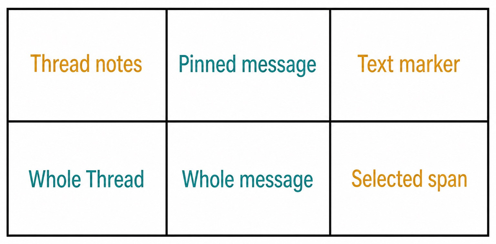
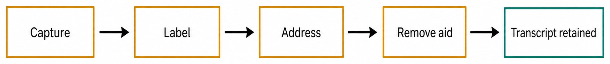

# Chapter 17 — Notes, Pinned Messages, and Markers {#chapter-17}

## The question

A Thread can remain useful long after its first Turn. That durability creates a practical problem:
the facts you need are scattered through an expanding transcript. Haros offers three memory aids with
different scopes. Thread notes summarize context for the whole Thread. A pinned Message points back
to one complete Message. A text marker identifies a selected span inside a Message.

They are not three styles for the same annotation. Scope determines what a reader can safely infer.
A note is authored context and may be revised. A pin preserves the identity of an existing Message.
A marker preserves a bounded textual selection plus its relationship to the source. Choosing the
smallest correct scope keeps memory useful without turning it into a second transcript.

_Figure 17.1 — The three aids differ first by addressable scope._

**Accessible equivalent.** Thread Notes apply to the Whole Thread. A Pinned Message points to a Whole message. A Text Marker points to a Selected span.

## Pick by the thing you need to remember

| Memory aid     | Exact scope                | Best for                                                | Weak fit                                  | Current bound          |
| -------------- | -------------------------- | ------------------------------------------------------- | ----------------------------------------- | ---------------------- |
| Thread notes   | whole Thread               | assumptions, status, vocabulary, next-step context      | proving who said an exact sentence        | 16,384 characters      |
| Pinned Message | one complete Message       | decisions, authoritative user instructions, key results | highlighting one clause in a long Message | 100 pins per Thread    |
| Text marker    | selected span in a Message | a precise risk, requirement, quote, or review target    | general Thread summary                    | 200 markers per Thread |

These limits are contract facts, not editorial targets. A Thread with 99 pins is probably difficult
to navigate even though it remains within the public maximum. The limits protect storage and UI
behavior; good curation aims for fewer, higher-value landmarks.

## Thread notes: living orientation

Use notes for information a collaborator should understand before reading the recent transcript.
Examples include the current objective, definitions of local terms, a known constraint, or a short
status summary. Notes are especially useful when a Thread pauses for days and the next reader needs
orientation.

Notes are not evidence that an event occurred. If a note says “tests passed on Friday,” the test
receipt or Timeline activity remains the stronger evidence. If a note says “the user approved the
breaking change,” pin the actual approval Message as well. Treat notes as maintained working context,
not as a replacement event log.

Write notes so they survive ordinary changes. “Current plan: validate parser ownership before
editing” is useful. “Do the thing above” is fragile because “above” changes as history grows. Include
stable nouns and, when important, point readers to a pinned Message or marker.

Because notes are editable, revision can remove obsolete context. That is a feature. Before replacing
a note, make sure any historical fact worth preserving already exists in the transcript. Editing the
note should improve orientation, not silently erase the only record of a decision.

## Pinned Messages: whole-message anchors

Pin a Message when its entire contents matter. Strong candidates include the user's acceptance
criteria, a maintainer's decision, a detailed failure report, or an assistant result whose attached
receipt should remain easy to find. The pin retains a relationship to an existing Message; it does
not copy the Message into a second authoring surface.

That identity relationship protects meaning. If two Messages have similar prose, the pin still
identifies the intended one. Timestamps, author role, attachments, and neighboring history remain
available through the source Message. A pasted excerpt in notes would lose some of that provenance.

Do not pin every update. Pins work because the list is selective. If a review has ten intermediate
observations and one final disposition, pin the final disposition and use markers for the two clauses
that need precise follow-up. If all ten remain equally important, the Thread may need a clearer note
or a separate synthesis Message.

## Text markers: precision inside a Message

A marker is appropriate when one span matters but the surrounding Message is too broad. During code
review, a user may write a long response containing one non-negotiable compatibility condition. A
marker can address that exact span. During incident analysis, a tool result may contain one failure
signature worth revisiting.

Precision has a cost: selected text depends on its source Message and selection coordinates or
canonical marker representation. The product must round-trip the relationship rather than treating
the visible highlight as durable truth. If the marker cannot resolve after reconnect, the source
Message should still exist; recovery should help the reader locate it rather than invent a new span.

Markers are not permissions. Marking “delete the old data” does not authorize deletion. It merely
records that the phrase deserves attention. Execution authority continues to belong to the relevant
command and capability boundary.

## A curation workflow

No one needs to annotate every Turn. Curate at meaningful boundaries: after requirements settle,
after a decisive investigation result, before a handoff, and when pausing a long task.

1. Read the latest Thread state and decide whether you need orientation, a whole-message anchor, or a
   precise span.
2. Choose notes, a pin, or a marker by scope—not by which control is nearest.
3. Give pins and markers short labels that explain why the source matters.
4. For notes, write a compact present-tense summary and link mentally or explicitly to durable
   transcript evidence.
5. Reopen the aid once to ensure it resolves to the intended Thread, Message, or span.
6. Remove obsolete aids when they stop helping; do not delete the source history just to clean the
   memory view.

_Figure 17.2 — Annotation cleanup removes the aid, not the source transcript._

**Accessible equivalent.** A memory aid is captured, labelled, addressed, and removed in one directional sequence. Removing the aid retains the transcript and ends only the annotation lifecycle.

## One investigation, three aids

Lena is diagnosing why an image upload fails. The user Message contains reproduction steps, a desired
privacy boundary, and unrelated background. Lena writes a Thread note: “Investigating local image
normalization; preserve the original only under the managed attachment owner; next check the size
contract.” That orients the whole task.

She pins the user's Message because the complete reproduction steps and attachment are important.
Inside it, she marks the sentence “the original must not be forwarded when normalization fails” and
labels the marker “privacy boundary.” Later, the team can navigate at three resolutions: summary,
source Message, exact clause.

After the fix is verified, Lena revises the note to record the current outcome and removes a marker
for a disproved theory. The pinned user Message remains useful as the original report. Removing the
marker does not alter that Message. Six months later, a maintainer can still read the actual history
without confusing the former highlight with permanent transcript content.

| Need in Lena's Thread            | Chosen aid     | Why this scope fits                       | Evidence still consulted       |
| -------------------------------- | -------------- | ----------------------------------------- | ------------------------------ |
| current diagnosis and next check | Thread note    | applies to the task as a whole            | latest Turn and test receipt   |
| full reproduction report         | Pinned Message | author, attachment, and all steps matter  | original Message               |
| one privacy sentence             | Text marker    | only a selected span is the review target | source Message around the span |
| obsolete hypothesis              | remove marker  | aid no longer helps                       | transcript remains unchanged   |

## Labels should explain purpose

A pin labelled “important” becomes useless once five other items are also important. Prefer labels
such as “accepted behavior,” “reproduction,” “privacy constraint,” or “rollback decision.” They tell
the next reader why the item was curated.

Do not put the entire source text into the label. The source remains available. A label is an index,
not a duplicate storage field. It should be short enough to scan and specific enough to distinguish
nearby aids.

For markers, avoid labels that prejudge unresolved facts. “Probable parser race” is safer than
“confirmed parser race” until evidence confirms it. The annotation should not gain more certainty
than its source.

## Update and removal boundaries

Editing Thread notes changes authored Thread-level context. Updating a pin or marker label changes
the aid's explanation. Removing an aid removes its navigational relationship. None of these ordinary
actions edits the source Message.

This separation gives cleanup a small blast radius. Teams can prune a cluttered marker list without
rewriting what participants said. They can replace an outdated summary without moving the Messages
it summarizes. They can unpin a result that is no longer central while retaining the result in
chronology.

If a user actually edits and resends a Message, that is a replay/history operation covered by a
different lifecycle. A marker attached to the old Message does not automatically become a truthful
marker on the new one. Re-resolve the intended source and create a new aid when necessary.

## Failure and recovery

### The aid points to the wrong place

Stop and inspect its stable source relationship. Similar text is not enough. Confirm Thread ID,
Message ID, and the selected span where applicable. Remove the incorrect aid and recreate it against
the correct source. Do not alter transcript text to make a bad annotation appear right.

### A save appears to vanish

The client may have shown an optimistic update before server acceptance. Reconnect or reload the
projection. If the note, pin, or marker is absent, verify limits and validation errors, then submit
once more. Avoid repeated clicks, which can create duplicate aids when delayed responses arrive.

### A source Message is unavailable

An unresolved pin or marker is not evidence that the Message was deleted by the annotation action.
Check Thread scope and history state first. If the underlying Message was removed through a separate
history lifecycle, the aid should fail visibly or be cleaned up; it must not silently attach to a
different similar Message.

### The limit is reached

Curate rather than bypass. Merge overlapping Thread notes, remove obsolete pins, or delete markers
whose follow-up is complete. Do not create parallel Threads solely to obtain a fresh quota, because
that fragments the very history the aids are meant to clarify.

| Failure              | Preserved fact                       | Safe recovery                           | Non-guarantee                         |
| -------------------- | ------------------------------------ | --------------------------------------- | ------------------------------------- |
| note update rejected | last accepted note and transcript    | reload, correct validation, resubmit    | optimistic text is not durable        |
| pin fails to resolve | source history may still exist       | locate exact Thread and Message ID      | similar prose is not the same Message |
| marker span is stale | source Message remains authoritative | inspect source, recreate precise marker | marker does not migrate by wording    |
| count limit reached  | existing accepted aids               | prune and consolidate                   | limits are not expanded by UI retries |
| aid removed          | source transcript                    | navigate through history                | removal is not transcript deletion    |

## Memory aids and Engine context

These aids are durable product facts. Whether and how they are projected into an admitted Turn is a
separate context decision. Their presence in the Web interface does not prove that every Engine saw
every note, pin, or marker. When exact context matters, inspect the admitted request and capability
contract rather than guessing from visibility.

Likewise, an Engine output does not become a note automatically just because it sounds like a
summary. A user or product workflow must create or update the note through its proper owner. This
prevents arbitrary assistant prose from silently rewriting durable working memory.

Cross-Engine handoff preserves product history according to the handoff contract, but it does not
fabricate native Session continuity. Notes and annotation relationships may remain visible as Haros
facts while the target begins a new Engine Session. That is useful precisely because product memory
and runtime memory are not the same thing.

## Review hygiene

At the end of a milestone, scan memory aids before creating more. Ask whether the Thread note states
the current situation, whether each pin still saves meaningful search time, and whether each marker
has an unresolved purpose. Remove aids that merely repeat the latest Message.

Never use annotations to conceal disagreement. If a later Message supersedes an earlier decision,
keep both in history and update the note to explain which rule is current. You may unpin the old
decision and pin the new one, but the chronology should remain reviewable.

For sensitive material, remember that curation can increase discoverability. Do not paste secrets
into notes or labels. A marker should not expose private text in a broader projection than the source
contract permits. The same security boundary applies to memory views as to ordinary Messages.

## Check your model

Try these cases:

- You need every collaborator to see the current constraint before reading history. Use a Thread
  note, and retain evidence elsewhere.
- You need the full user approval with its author and attachments. Pin the Message.
- You need one sentence in a long review. Mark the selected span.
- You finished following up a marker. Remove the marker; do not edit the historical Message.
- You change Engines. Expect durable product aids to remain product facts, but do not claim that a
  native Session carried them forward as private runtime memory.

The reliable habit is to preserve provenance while adding navigation. Notes explain; pins point;
markers select. None of them grants authority, changes Project ownership, or substitutes for the
Timeline and receipts that prove work occurred.

## Curating at a handoff boundary

Before another person or Engine takes over, perform a short memory pass. Read the Thread note first as
if you knew nothing else. It should name the current objective, the confirmed constraint, the present
status, and the next decision. Remove speculative statements that later evidence disproved. Do not
erase the fact that the speculation occurred; history already owns that chronology.

Next, pin the smallest set of whole Messages that establish authority and outcome. A user instruction
that limits scope, a proposed Plan that was explicitly accepted, and the latest verification result
are reasonable candidates. If the Plan is represented by a typed product record, the pin helps
navigation but does not replace the proposed-Plan relationship.

Then inspect markers. Every selected span should still have a purpose a new reader can understand
from its label. Resolve completed review markers and retain unresolved ones. Reopen each surviving
marker to confirm that its source Message and surrounding text make the selection truthful. A phrase
such as “approved” may refer to a visual choice rather than publication authority when read in full
context.

This pass improves the product history handed to a new execution context, but it does not copy native
Session state. The target may see the durable note and source Messages according to admission while
still needing to inspect files and request capabilities again.

### A drill for precise scope

Take one long Message and identify three possible memories: a whole-Thread implication, the reason the
complete Message matters, and one exact clause. Write a hypothetical note, pin label, and marker
label. If the note merely quotes the clause, it is too narrow. If the marker selects the entire
Message, it is too broad. If the pin label states a conclusion absent from the Message, it is
misleading.

Now imagine removing each aid. The Thread's Message count and text should remain unchanged. If your
mental model predicts transcript deletion, return to the scope matrix. Annotation lifecycle is
deliberately reversible because it is not history ownership.

### Reporting annotation defects

Useful evidence includes the Thread ID, aid type, stable Message ID, selected text where applicable,
the label, the action attempted, and the state after canonical reload. Avoid screenshots that expose
unrelated private Messages. A narrow description makes it possible to determine whether the defect is
in validation, relationship persistence, projection, or navigation.

Do not report “memory lost” when only a highlight failed to render. State separately whether the aid
record exists and whether the source Message remains. Those are two different preservation claims.

## Source trail

- `packages/contracts/src/orchestration.ts` defines Thread notes, pinned-Message, text-marker shapes,
  limits, identifiers, and relationships.
- `apps/web/src/components/chat/environment/EnvironmentNotesSection.tsx` presents and validates the
  whole-Thread notes workflow.
- `apps/web/src/components/chat/environment/EnvironmentPinnedSection.tsx` consumes pin projections
  and navigates to whole source Messages.
- `apps/web/src/components/chat/environment/EnvironmentMarkersSection.tsx` consumes selected-span
  marker projections without owning source history.
- `apps/server/src/orchestration/Layers/pinnedMessagesRoundTrip.integration.test.ts` exercises the
  durable pin round trip and recovery-relevant relationship behavior.

<!-- guide-navigation:start -->

[Guidebook contents](../README.md) · [Previous: Groups Without Moving Projects](16-groups-without-moving-projects.md) · [Next: Goals and Goal Achievement](18-goals-and-goal-achievement.md)

<!-- guide-navigation:end -->
