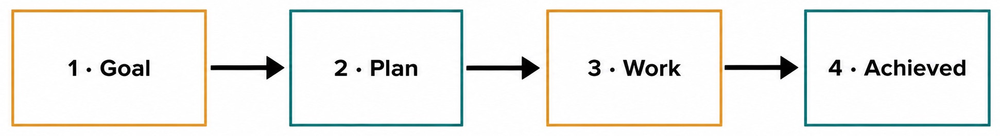
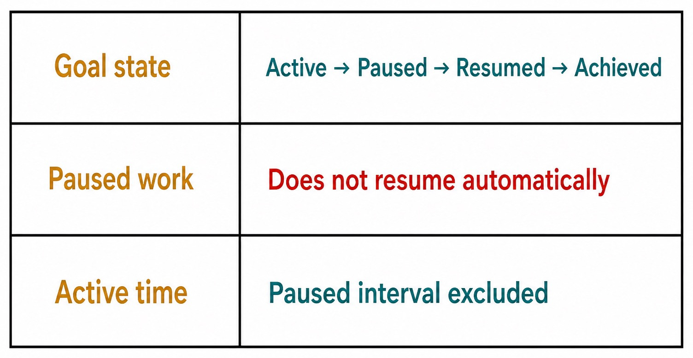
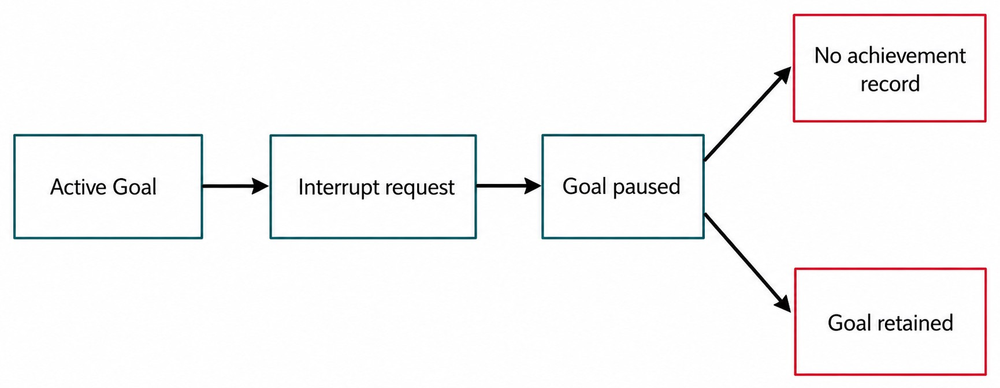

# Chapter 18 — Goals and Goal Achievement {#chapter-18}

## The question

A prompt asks for the next response. A Goal records what a longer pursuit is trying to accomplish.
That difference becomes important when work spans multiple Turns, pauses for user input, survives a
restart, or needs a deliberate achievement record.

“Inspect this test” is a useful prompt. “Make attachment admission fail safely and prove the behavior
with focused tests” is a Goal. Several prompts may advance it: inspect the contract, reproduce the
failure, propose a plan, implement a change, and verify recovery. The Goal remains one product fact
across those bounded Turns.

_Figure 18.1 — Goal, Plan, Work, and Achieved are related stages, not interchangeable labels._

**Accessible equivalent.** A Goal informs a Plan, and the Plan guides Work through the first three labelled states. Achieved is an explicit terminal achievement record rather than an inference from ordinary Work.

## Four facts, four owners

| Fact        | Plain meaning                                 | Typical evidence             | Common mistake                                    |
| ----------- | --------------------------------------------- | ---------------------------- | ------------------------------------------------- |
| Goal        | durable objective being pursued               | Goal record and lifecycle    | treating one prompt as the whole objective        |
| Plan        | proposed sequence for reaching it             | proposed-plan projection     | calling the Plan the Goal                         |
| Work        | admitted Turns and capability results         | Timeline, receipts, Messages | inferring success from activity volume            |
| Achievement | explicit settlement that the Goal was reached | Goal-achievement record      | equating completion of one Turn with Goal success |

A Goal can exist without a detailed Plan. A Plan can be reviewed before implementation. Work can
produce useful information without reaching the Goal. Achievement must therefore be explicit. This
model avoids the cheerful but unsafe inference that “the assistant stopped talking, so the objective
must be complete.”

## Start with a testable objective

A useful Goal names an outcome, its important boundary, and the evidence that will distinguish
success from mere motion. Avoid embedding an entire implementation recipe; that belongs in planning.
Avoid vague aspirations such as “improve uploads.” Prefer: “Make oversized image intake refuse before
Engine execution, retain a recoverable Composer draft, and pass the focused admission tests.”

Before starting pursuit, ask:

1. What product fact should be different when the Goal is achieved?
2. What must remain unchanged?
3. Which focused evidence can disprove success?
4. Does the Goal require authority the current task does not have?
5. What condition should pause pursuit instead of inviting guesses?

This framing helps the Engine make progress, but it does not grant authority. A Goal that mentions a
deployment does not authorize publishing. Commands, permissions, and external effects remain bounded
by their real owners.

## The pursuit lifecycle

An active Goal can guide continuation across Turns. Pausing it stops automatic pursuit. Resuming it
rebases active-time accounting and enables work to continue from current product truth. Achievement
settles the objective with an explicit record.

_Figure 18.2 — Pause is a durable lifecycle state, not a temporary animation._

**Accessible equivalent.** A three-row state matrix maps Goal state to Active, Paused, Resumed, Achieved; Paused work to Does not resume automatically; and Active time to Paused interval excluded.

Active-time calculation matters for honest status. If a Goal runs for ten minutes, waits paused
overnight, and resumes for five minutes, its active pursuit time should not include the overnight
pause. Resume therefore cannot merely flip a visual badge; the lifecycle rebases timing from a new
active interval.

Continuation is similarly bounded. An active Goal may create a continuation trigger after a Turn
settles if more work is required and the contract allows it. A paused Goal injects no continuation.
That invariant prevents a user who pressed Interrupt from discovering that background pursuit
quietly restarted itself.

| State    | Entry                                  | What may happen                                          | Exit                      | Time treatment              |
| -------- | -------------------------------------- | -------------------------------------------------------- | ------------------------- | --------------------------- |
| Active   | Goal pursuit starts or resumes         | bounded work and eligible continuation                   | pause or achievement      | active interval accrues     |
| Paused   | explicit pause or interruption outcome | inspection and user decisions; no automatic continuation | explicit resume           | interval excluded           |
| Resumed  | explicit transition back to pursuit    | work proceeds from current product state                 | pause or achievement      | new active interval accrues |
| Achieved | explicit achievement command/record    | historical review                                        | terminal for that pursuit | final active total retained |

## Interrupt is not achievement

Interrupt stops active work. When a Goal is being pursued, the safe product outcome is to pause the
Goal, retain it, and create no achievement record. Otherwise a stop button could falsely certify
success.

_Figure 18.3 — Interruption preserves the objective while refusing to invent success._

**Accessible equivalent.** An Interrupt request pauses an active Goal. Interrupt creates no Goal-achievement record, and the Goal itself remains retained.

Suppose Noor's Goal is to repair a flaky test. A command hangs, so she interrupts. The current Turn
settles interrupted according to its lifecycle. The Goal becomes paused. The transcript, activities,
and Goal remain available. Noor can inspect what happened, change the Plan, and resume deliberately.
Nothing about the interruption says the flaky test is fixed.

This boundary also supports recovery after uncertainty. Even if Engine cancellation is delayed, the
product should not promote uncertainty into achievement. It settles the Turn using authoritative
events and keeps the Goal paused until a user explicitly resumes.

## A complete working example

Mateo creates this Goal: “Prove that Group deletion retains member Threads and add a focused
regression test without changing Project ownership.” Haros records the Goal and begins pursuit.

The first Turn inspects contracts and tests. It finds the expected ownership boundary but no focused
coverage. That Turn completes, but the Goal is not achieved: evidence is still missing. A proposed
Plan follows—add one decider test, run it, and inspect the resulting projection. Mateo reviews it.

During implementation, the test runner stalls. Mateo interrupts. The Turn settles interrupted; the
Goal is paused and retained. Overnight time does not count as active pursuit, and no continuation
starts. The next morning, he discovers an unrelated environment issue, fixes the environment outside
the Goal, and resumes.

The resumed Turn adds the focused test and runs it successfully. The assistant summarizes the
evidence. Mateo then records achievement because the objective and its preservation constraint are
both satisfied. The achievement record is meaningful because it is distinct from the successful test
Turn and because earlier interrupted work did not masquerade as success.

## Plans serve Goals; they do not replace them

A Plan answers “how might we proceed?” The Goal answers “what outcome are we pursuing?” Plans can
change while the Goal remains stable. In Mateo's example, the original Plan assumed the existing test
runner would work. After interruption, he rebased the Plan around the environment issue without
rewriting the desired ownership outcome.

Conversely, discovering that the desired outcome is wrong should cause a Goal decision, not just a
Plan edit. If source evidence shows Group deletion is supposed to cascade, Mateo must stop and resolve
the conflicting objective. Quietly changing steps cannot make an invalid Goal legitimate.

Implementation Threads, discussed next, can preserve a relationship to a proposed Plan. That
relationship helps provenance, but the Goal lifecycle remains its own product fact. A new
implementation Thread does not automatically achieve or resume the Goal.

## Achievement needs evidence

An achievement summary should state the outcome and point to the evidence that justifies settlement.
It should not simply repeat the Goal in past tense. For a code change, useful evidence may include
the focused test, relevant diff, and preserved behavior. For an investigation, it may be a confirmed
cause plus a reproducible disproof of alternatives.

The product record says that achievement was declared; it does not make every claim inside the
summary infallible. Review still matters. A later discovery may lead to a new Goal rather than
rewriting historical evidence. Keeping the original achievement record intact preserves chronology.

Do not use achievement to clean up a Goal you no longer want. Pause or otherwise end pursuit using
the supported lifecycle. “Abandoned,” “superseded,” and “achieved” are different meanings even if all
remove the Goal from an active-work view.

## Failure and recovery guide

### Work completed but the Goal remains active

Check whether an explicit achievement command was accepted. A completed Turn is insufficient. Review
the Goal criteria, gather evidence, and record achievement if they are met. If more work remains,
leave the Goal active or pause it honestly.

### A paused Goal seems to continue

Distinguish already-admitted work settling from a newly injected continuation. Inspect Turn IDs and
Timeline events. The system may need to finish cancellation or receive a terminal event, but it must
not admit a new continuation while the Goal is paused. If it does, treat that as a lifecycle defect.

### Active time looks too large

Check pause and resume timestamps and whether resume created a new active interval. Do not repair the
display by subtracting time only in the client; timing is a product fact and must be corrected at its
owner or projection.

### Resume starts from an obsolete assumption

Read current Thread history and update the Plan or next prompt before resuming. Resume does not rewind
the world to the pause moment. It restarts pursuit against current product state; external files may
have changed and prior permissions may no longer apply.

| Symptom                           | Likely cause                                       | Preserved fact             | Safe recovery                                 | Never infer                         |
| --------------------------------- | -------------------------------------------------- | -------------------------- | --------------------------------------------- | ----------------------------------- |
| Goal active after a good Turn     | no achievement record                              | Goal and successful Turn   | verify criteria, then achieve explicitly      | Turn completion equals Goal success |
| work visible after Interrupt      | cancellation settling                              | Goal, transcript, receipts | wait for terminal Turn, confirm paused state  | new pursuit is allowed              |
| continuation appears while paused | lifecycle violation or stale projection            | paused Goal should remain  | reload authoritative projection, diagnose IDs | UI spinner is proof                 |
| active duration includes waiting  | timing projection defect                           | pause/resume timestamps    | repair owner/projection                       | client math is canonical            |
| resume fails                      | validation, stale state, or unresolved interaction | paused Goal                | resolve cause, resume once                    | Goal was deleted                    |

## Goals across Engines and restarts

A Goal is Haros product state. A native Engine Session is runtime state. If work is handed to another
Engine, the product may retain Goal and Thread history while the target starts a new native Session.
Do not claim that the target Engine “remembers” private runtime context simply because the Goal is
still visible.

The same principle applies after application restart. Durable Goal state can be projected again.
Any active or uncertain Turn must reconcile through recovery rules. The system should not create a
fresh continuation merely because the UI restarted and saw an active label. Admission requires the
current lifecycle facts.

This separation is reassuring: the objective can survive replaceable execution. It is also a
discipline: every resumed runtime receives only admitted context and authority, not an imaginary copy
of the old native Session.

## Check your model

Answer these without looking at the UI:

1. A Turn finishes successfully. Is the Goal necessarily achieved? No.
2. Interrupt is requested during pursuit. What happens to the Goal? It is retained and paused; no
   achievement record is created.
3. Does paused wall-clock time count as active pursuit? No.
4. Can a paused Goal inject an automatic continuation? No.
5. Does a cross-Engine handoff continue the native Session? No; a new Engine Session begins.
6. Can the Plan change while the Goal stays the same? Yes, provided the objective remains truthful.

The robust model is simple: define a durable outcome, pursue it through bounded work, pause without
pretending progress continues, resume from current truth, and record achievement only when evidence
supports it.

## Designing achievement criteria

Achievement criteria should be observable and proportional to the Goal. For a diagnosis Goal,
“identify the owner” is incomplete if two owners remain plausible. A better criterion is: name the
canonical owner, cite the contract and focused test, and explain why the competing layer cannot own
the behavior. For an implementation Goal, criteria should cover the requested change, a focused
disproof, and the preservation constraint.

Avoid criteria that depend only on assistant confidence. “The assistant says it is fixed” is a
summary, not evidence. Avoid criteria that require an unapproved external effect. If the Goal says
“prepare a release candidate,” do not quietly interpret that as “publish the release.” Preparation
and publication have different authority.

Criteria may be refined when investigation reveals missing facts, but a material change to the desired
outcome deserves an explicit decision. Otherwise a team can declare achievement by shrinking the Goal
after work becomes difficult. Keep the original objective visible and explain the revision.

## Continuation without runaway work

Goal continuation is useful when one settled Turn naturally leads to another bounded step. It must be
derived from current Goal state and continuation rules. The trigger is not a permanent timer and not
an Engine promise to “keep going forever.” Each continuation creates or admits work through ordinary
Turn lifecycle.

Before allowing continuation, the product must know that the Goal remains active, no blocking user
interaction is unresolved, no stop state forbids progress, and the next step is still within scope.
If the next action requires new authority, continuation should pause for that decision rather than
infer consent from the Goal text.

After restart, stale active presentation is insufficient. Reconciliation must determine whether the
prior Turn settled and whether a continuation was already admitted. Idempotent ownership prevents two
continuations from racing because both a recovering client and server observed the same Goal.

## Auditing a Goal history

Read a Goal from outcome backward. Start with the achievement record, if present. Does it identify the
criteria and supporting evidence? Then inspect the final work Turn and receipts. Next, trace pauses
and resumes to verify that active-time intervals exclude waiting. Finally, inspect continuation
triggers to ensure none occurred while paused.

If there is no achievement record, do not add one merely to make the audit neat. Determine whether
the Goal is active, paused, superseded, or abandoned according to available lifecycle. An unfinished
Goal can be an honest record.

A useful defect report names Goal ID, related Thread and Turn IDs, the expected transition, the actual
projected state, and the decisive event timestamps. Do not rely on a recording of a badge alone. The
timing owner and event sequence are what can prove a pause-accounting bug.

## Collaboration boundaries

Two people may discuss a Goal, but concurrent lifecycle commands need one accepted order. If one user
pauses while another records achievement, reload canonical state before issuing another command. A
client should not merge contradictory optimistic outcomes.

Subagents can advance bounded work, yet the parent or authorized product workflow remains responsible
for the Goal-level achievement decision. A child reporting “done” does not settle the parent Goal.
Verify the result, integrate it, and then evaluate the criteria.

Likewise, a Fork can explore an alternative history without automatically inheriting the source Goal
lifecycle. If a relationship is intended, it must be explicit. Similar objective text in two Threads
does not make them one Goal.

One final discipline is to distinguish “blocked” from “paused.” A missing decision, failed dependency,
or unavailable capability may explain why pursuit cannot progress, but the durable lifecycle still
needs an explicit state. Record the blocking evidence in history and pause when the product contract
requires it. Do not leave automatic continuation active merely because the prose says “waiting.”

When the blocker clears, verify current state before resume. A file, permission, or user preference
may have changed during the wait. Resume means renewed pursuit from current truth, not replay of the
old next step. If the original criteria are no longer appropriate, revise the Goal explicitly before
work continues.

## Source trail

- `packages/contracts/src/orchestration.ts` defines Goal, achievement, continuation, and timing-facing
  orchestration contracts.
- `apps/server/src/orchestration/decider.ts` owns Goal start, pause, resume, interruption, continuation,
  and achievement decisions.
- `apps/server/src/orchestration/decider.goalTiming.test.ts` provides focused evidence for active-time
  accounting, pause exclusion, resume rebasing, and lifecycle invariants.

<!-- guide-navigation:start -->

[Guidebook contents](../README.md) · [Previous: Notes, Pinned Messages, and Markers](17-notes-pinned-messages-markers.md) · [Next: Plans and Implementation Threads](19-plans-and-implementation-threads.md)

<!-- guide-navigation:end -->
