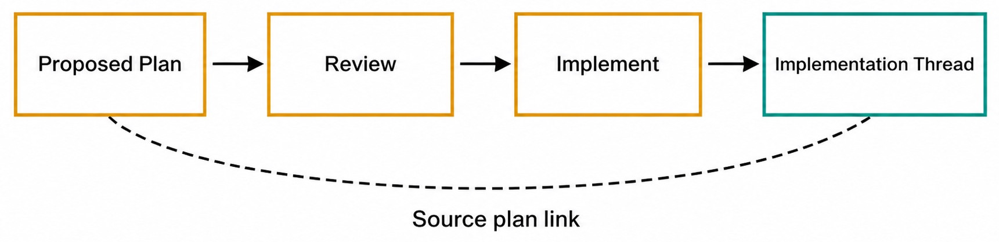
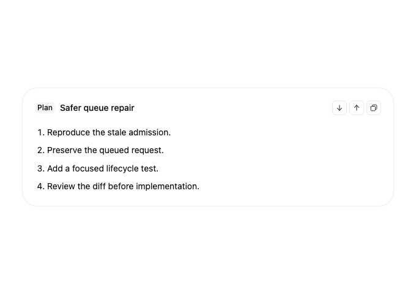
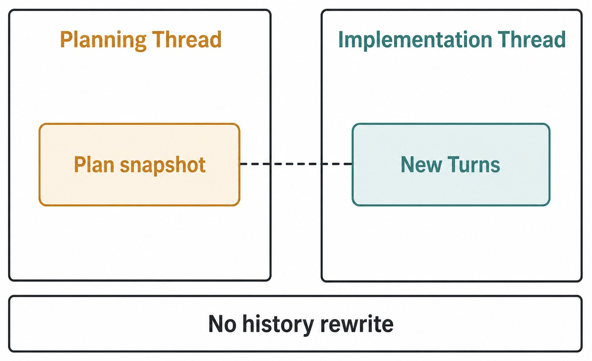

# Chapter 19 — Plans and Implementation Threads {#chapter-19}

## The question

A proposed Plan is a reviewable statement of intended work. It is valuable precisely because it is
not yet the implementation. You can inspect scope, ordering, evidence, and risky assumptions before
granting the next phase of work.

When the Plan is accepted, Haros can create a distinct implementation Thread linked to that source
Plan. The new Thread provides a clean execution history while preserving why it exists. This does not
merge two histories or turn the Plan into an executable authority token.

_Figure 19.1 — The source-plan link preserves provenance without collapsing planning and execution._

**Accessible equivalent.** The main path is Proposed Plan, Review, Implement, Implementation Thread. A dashed Source plan link binds the new Thread to the reviewed plan without merging histories.

## The records involved

| Record                | What it owns                                  | When it becomes durable                  | What it does not imply                 |
| --------------------- | --------------------------------------------- | ---------------------------------------- | -------------------------------------- |
| Proposed Plan         | a reviewable snapshot and source relationship | when projected from accepted plan output | approval, authority, or completed work |
| Review decision       | the user's chosen next action                 | when the product accepts that action     | that every plan claim is correct       |
| Implementation Thread | new product history for carrying out work     | when creation settles                    | copied native Session state            |
| Source-plan link      | why the implementation Thread was created     | with the relationship projection         | shared Message or Turn identity        |
| Goal                  | durable desired outcome, if present           | through its own lifecycle                | that this Plan is the only route       |

The word **snapshot** is useful. A proposed Plan records what was reviewed at a point in history.
Later discussion can refine the approach, but should not silently rewrite the proposal that justified
the implementation Thread. If the direction changes materially, record the new decision in current
history rather than pretending the earlier Plan always said it.

_Real product capture — The proposed-plan card keeps review actions attached to a visible Plan before
any distinct implementation path is started._

## What makes a Plan reviewable

A strong Plan names the intended changes, their order, the evidence to inspect, and the checks that
can disprove success. It calls out irreversible or external actions instead of burying them. It also
states preservation constraints: files that should not change, histories that remain separate, and
authority the task does not have.

A weak Plan is a list of generic verbs: “analyze, implement, test.” A review cannot evaluate the
blast radius because no owner or boundary is named. Another weak Plan copies the Goal word for word.
The objective may be correct, but the reader still does not know how work will proceed.

For a parser fix, a useful proposal might be:

1. inspect the parser contract and the narrow failure test;
2. prove whether normalization or dispatch owns the defect;
3. change only the canonical owner;
4. add a regression case for the observed boundary;
5. run the focused test and typecheck the affected package;
6. report remaining uncertainty without publishing or changing unrelated compatibility paths.

This structure is concrete enough to challenge. A reviewer can reject step three if the owner is
wrong, request a missing preservation test, or choose to continue planning before implementation.

## Review is an active decision

Do not treat the appearance of a Plan as permission to execute it. Read it against current source
truth. Check whether filenames and owners still exist, whether the evidence is sufficient, and whether
the proposed actions remain in scope. Plans can be stale, overly broad, or based on an incorrect
assumption.

Useful review outcomes include:

- implement the Plan in a distinct Thread;
- continue the current discussion to revise it;
- reject it because the objective or authority is wrong;
- request a narrower investigation before deciding.

The interface action is not the intellectual review. Pressing “Implement” records a decision; it
does not make an unsafe Plan safe. Conversely, requesting revision is not failure. It is the primary
benefit of separating planning from implementation.

## Why a distinct Thread

Planning history answers how the approach was formed. Implementation history answers what was
actually attempted, changed, verified, interrupted, or recovered. Keeping them distinct makes both
easier to read.

_Figure 19.2 — A relationship provides traceability; separate histories preserve lifecycle truth._

**Accessible equivalent.** The Planning Thread retains the Plan snapshot, while the Implementation Thread owns its New Turns. A dashed provenance link joins them but does not rewrite either history.

The implementation Thread may receive admitted context derived from the source Plan, but it gets a
new identity and its own future Messages. A user can return to the planning Thread without sifting
through command output. A reviewer can open the implementation Thread and find the accepted starting
point.

This separation also limits accidental authority. The new Thread can be created from a reviewed Plan,
yet terminal, Git, browser, device, or external-service actions still pass through their actual
capability owners. “The Plan said to deploy” is not a substitute for deployment authorization.

## A complete workflow

Jules asks Haros to improve recovery when an attachment is rejected. The initial Thread investigates
the contracts and produces a proposed Plan. Jules does the following:

1. Confirms the Plan points to the managed attachment and admission owners rather than an unrelated
   UI component.
2. Checks that it preserves the Composer draft and avoids forwarding rejected data to an Engine.
3. Adds a required test for the visible recovery path.
4. Chooses Implement, creating a distinct implementation Thread.
5. Verifies that the new Thread shows its source-plan relationship.
6. Lets bounded Turns perform the work and reviews receipts in the implementation Timeline.
7. Returns to the source Thread if the Plan needs a conceptual revision, rather than rewriting the
   old snapshot.

Midway through implementation, source evidence reveals that normalization belongs to a different
layer than the Plan assumed. Jules pauses the Goal, if one is active, and records the finding in the
implementation Thread. The team may propose a revised Plan. They do not edit the old proposal to hide
the incorrect assumption. That record explains why the implementation changed course.

## Context crosses; history does not merge

The target must receive enough admitted context to begin useful work: the reviewed proposal, relevant
source relationship, and perhaps bounded recent Messages according to the command contract. That is
not the same as giving the new Thread every property of the source.

| May cross as admitted context or relationship           | Remains separate                    |
| ------------------------------------------------------- | ----------------------------------- |
| reviewed Plan snapshot                                  | Thread ID                           |
| source Plan and source Thread identifiers               | future Message history              |
| bounded references needed to start                      | Turn lifecycle and Queue state      |
| Goal relationship when the product contract provides it | native Engine Session               |
| workspace metadata explicitly selected                  | permissions and capability receipts |

This table prevents a common overclaim: “implementation continues the planning Session.” Haros can
preserve product provenance while starting fresh execution. If the same Engine happens to be used,
that still does not justify inventing native continuation unless the adapter and product contract
prove it.

## Plan changes after implementation starts

Implementation is evidence. It may invalidate a step, uncover a dependency, or show that the goal is
already satisfied. A Plan should guide work, not force the team to ignore reality.

Small tactical adjustments can be explained in the implementation Thread. A material scope or
authority change deserves explicit review. For example, replacing one focused unit test with the
correct integration test is usually tactical. Adding a data migration or publishing a package is a
different responsibility and cannot enter merely because the first approach became inconvenient.

When a material revision is needed, write a new proposal or return to the source planning discussion.
Keep both the original and revised decisions readable. The source-plan link still explains the
origin; later Messages explain the divergence.

## Failure and recovery

### Implement creates no visible target

The creation may still be pending, rejected, or interrupted. Reload canonical projections and inspect
the command outcome. Do not press Implement repeatedly: delayed success can otherwise create multiple
implementation Threads. If a target exists, use its stable relationship rather than title matching.

### Two target Threads appear

Identify their IDs and source-plan links. Determine which creation settled first and whether either
contains admitted work. Do not merge histories by copying Messages. Choose the authoritative target
according to product records, stop or archive the unused path through supported controls, and keep an
explanatory record.

### The Plan link is missing

The implementation history may still exist, but provenance is incomplete. Inspect relationship
projection and creation events. Do not add a prose note claiming equivalence as a substitute for the
canonical link. Recover or repair the owning projection.

### Implementation departs from the Plan

Compare the accepted snapshot with current Messages and receipts. If the departure is justified,
record why. If it broadens authority or scope, stop and seek a new decision. Never rewrite the source
Plan retroactively.

| Failure                 | Preserved fact                       | First check                     | Recovery                                    | Not promised            |
| ----------------------- | ------------------------------------ | ------------------------------- | ------------------------------------------- | ----------------------- |
| target creation pending | source Plan and review choice        | creation command status         | wait/reconcile, then retry once if rejected | instant target ID       |
| duplicate targets       | each separate Thread history         | relationship and admitted Turns | select one, settle unused path              | automatic history merge |
| source link absent      | source and target may both exist     | relationship projection         | repair canonical owner                      | notes equal provenance  |
| stale Plan              | reviewed snapshot remains historical | current source truth            | revise explicitly                           | snapshot auto-updates   |
| capability denied       | implementation history retained      | authority/receipt               | request or choose safe alternative          | Plan grants permission  |

## Proposed Plan versus ordinary prose

An assistant can write a numbered list in any Message. A proposed Plan is a typed product projection
with actions and relationships the interface can recognize. Do not infer proposed-plan lifecycle
from formatting alone.

This distinction matters for automation and accessibility. A typed proposed Plan can expose specific
review actions and later link an implementation Thread. A Markdown heading named “Plan” may be useful
conversation, but it does not automatically gain that lifecycle.

Similarly, a Goal is not created because a proposal contains the word “goal.” Product records—not
linguistic resemblance—decide which lifecycle exists.

## Implementation is still bounded by Turn lifecycle

The new Thread can contain many Turns. Each request is admitted with exact Engine/model provenance,
may Queue or require interaction, and settles independently. The Thread relationship does not fuse
those Turns into one uninterruptible job.

If a Turn is interrupted, inspect its terminal outcome and the Goal state. The implementation Thread
remains available. Resume the Goal or submit a new Turn deliberately. The source Plan does not rerun
itself and the target does not automatically rewind to a clean state.

This makes recovery honest. The Plan provides intent; the Timeline and receipts show execution; the
Goal achievement record says whether the broader outcome was reached.

## Check your model

Ask these questions during review:

1. Is this a typed proposed Plan or merely plan-shaped prose?
2. Which exact snapshot am I accepting?
3. Does the implementation target have a new Thread identity and an explicit source-plan link?
4. Which facts are admitted as context, and which histories remain separate?
5. Does any step require authority that Plan approval cannot grant?
6. If the approach changes, will the history explain the revision rather than rewrite the past?

The intended answer is a workflow with visible decisions: propose, review, create a linked but
distinct target, implement through bounded Turns, and preserve both origin and actual execution.

## Reviewing preservation and rollback

A Plan review should ask not only “what will change?” but also “what happens if the third step fails?”
For a multi-file edit, identify which changes can remain safely, which must be reverted together, and
which command receipts prove the actual state. For a read-only investigation, rollback may simply mean
no mutation occurs; make that explicit.

Do not promise recovery the implementation owner cannot provide. A proposed Plan that says “we can
always roll back” is incomplete without naming the checkpoint, branch, backup, or product lifecycle
that makes reversal possible. Git history does not automatically cover external service changes, and
a worktree does not undo a command sent to a device.

When the Plan includes cleanup, make cleanup targets exact and task-owned. Never accept a vague final
step such as “remove temporary files” if the path is unresolved. Review is the right time to prevent
a broad destructive command.

## Comparing the Plan with the result

At implementation review, place the accepted snapshot beside the actual diff, Timeline, and receipts.
For each planned step, decide whether it occurred, changed, or became unnecessary. A skipped step is
not automatically a defect if new evidence made it redundant, but the implementation Thread should
explain the decision.

Check preservation claims independently. If the Plan said “do not change Project ownership,” inspect
the relevant projection or focused test. If it said “no publish,” confirm no publishing command or
external receipt exists. Absence of a summary sentence is not enough; use the narrowest evidence that
could disprove the claim.

The final report should link back to the source Plan and name deviations. This preserves review value
for future maintainers. A perfect-looking diff with no explanation of a material Plan change leaves
the relationship incomplete.

## When not to create an implementation Thread

Not every numbered answer deserves a new Thread. If the user asked only for an explanation, a proposed
Plan may be the final deliverable. If one tiny approved edit belongs naturally in the current Thread,
creating a second history may add navigation cost without clarifying responsibility. Follow the
typed product workflow and user choice rather than enforcing separation mechanically.

Conversely, substantial work should not stay in the planning Thread merely to avoid a creation step.
A distinct target is valuable when execution will generate a long Timeline, use a different workspace,
or needs an independently reviewable responsibility boundary.

The decision is about lifecycle, not word count. Ask whether future readers need to distinguish
“why this approach was approved” from “what execution actually did.” If yes, the relationship earns
its place.

## Concurrent planning and implementation

Once implementation starts, the source planning Thread can still receive discussion. That does not
mean every new source Message is admitted into the target. Communicate important corrections
explicitly. If the correction invalidates ongoing work, pause or interrupt through the target's real
lifecycle before revising the Plan.

Do not allow two target Threads to implement the same Plan unintentionally. Before another creation,
inspect existing source-plan relationships and target state. Parallel alternatives can be legitimate,
but they require explicit scope and separate ownership rather than duplicate clicks.

A defect report for this workflow should include source Thread ID, proposed Plan ID/snapshot, review
action, target Thread ID if created, and the state after reload. Those facts distinguish projection
failure, duplicate creation, and missing relationship without depending on titles.

The same evidence helps during restart recovery. Reconstruct the proposal and relationship from
durable projections, then inspect the target Turn state. Do not recreate an implementation Thread
because the action button briefly reappears before reconciliation. A pending or ready target may
already exist.

If the source Plan is visible but its action is no longer available, check whether it was already
implemented, superseded, or made ineligible by current state. The absence of a button is not itself a
loss of Plan history. Separate presentation eligibility from the preserved proposal and relationship
records.

## Source trail

- `packages/contracts/src/orchestration.ts` defines proposed-Plan, Thread, and relationship shapes
  used by the planning-to-implementation workflow.
- `apps/web/src/components/chat/ProposedPlanActions.tsx` presents review actions and requests an
  implementation path without owning durable creation truth.
- `apps/server/src/persistence/Layers/ProjectionThreadProposedPlans.ts` projects proposed Plans and
  their source/implementation relationships for reliable reload and review.

<!-- guide-navigation:start -->

[Guidebook contents](../README.md) · [Previous: Goals and Goal Achievement](18-goals-and-goal-achievement.md) · [Next: Attachments, Mentions, Skills, and References](20-attachments-mentions-skills-references.md)

<!-- guide-navigation:end -->
