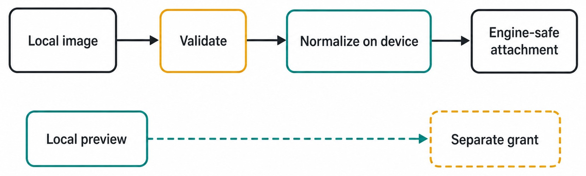
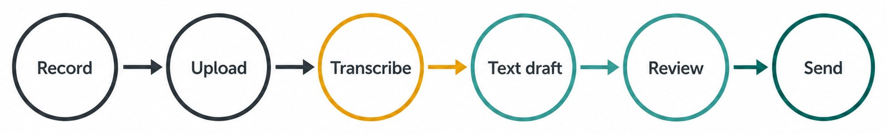

# Chapter 21 — Images and Voice {#chapter-21}

## The question

Images and voice are convenient ways to explain a problem, but raw media is not yet an admitted
prompt. Haros uses bounded intake paths: an image is selected, validated, and normalized under managed
attachment ownership; voice is captured or uploaded, transcribed, and returned as an editable draft
before the user sends it.

The review step is essential. An image can contain private information outside the intended crop. A
transcript can mishear a filename, number, or destructive verb. The user should see what will be
admitted and correct it before Engine execution.

_Figure 21.1 — Image intake creates a bounded managed representation; selection alone is not admission._

**Accessible equivalent.** The main image path is Local image, Validate, Normalize on device, Engine-safe attachment. A separate lower path connects Local preview to Separate grant.

## Two intake paths

| Stage             | Image path                              | Voice path                     | Shared safety principle                    |
| ----------------- | --------------------------------------- | ------------------------------ | ------------------------------------------ |
| Capture/select    | choose an image source                  | record or choose audio         | user initiates bounded input               |
| Local preparation | inspect type, dimensions, size          | encode supported audio payload | reject obvious invalid input early         |
| Transformation    | normalize image representation          | transcribe audio to text       | transformed output is not presumed perfect |
| User review       | preview image and metadata              | edit transcript draft          | user controls what will be sent            |
| Admission         | managed attachment metadata enters Turn | edited text enters Message     | server validates canonical request         |

These paths converge only at the high-level purpose of supplying context. Images remain attachments
with managed content. Voice normally becomes text in the Composer. Do not describe a transcript as
if the Engine received a continuing microphone stream or native audio Session unless a separate
contract explicitly provides one.

## Image intake step by step

The user begins with a local selection, paste, drop, or supported capture source. The client can
perform early checks for allowed types and current limits. It may decode and normalize the image to a
bounded representation suitable for preview and admission. The managed attachment layer then owns
the durable identity and metadata used by Messages.

Normalization is not cosmetic. Camera images may be extremely large, carry orientation differences,
or use formats that are awkward for downstream Engines. A controlled conversion can reduce size and
create predictable dimensions. The product must nevertheless preserve truth about what was admitted:
the normalized representation is not necessarily byte-identical to the original.

If normalization fails, Haros should not forward the original as a secret fallback. That would bypass
the safety boundary and make size/type validation meaningless. The user keeps control, sees a clear
failure, and can choose another file or produce a safer crop.

Current size and count limits should be read from the public contract and UI validation rather than
copied from memory. They may evolve by edition. The stable lesson is the order: validate before
admission, and refuse before Engine execution when the media cannot be represented safely.

## Preview is evidence of selection, not authority

A local preview helps the user catch the wrong screenshot, an accidental secret, or a misleading
crop. It does not prove that the server accepted the attachment. After send, the admitted Message
metadata and managed attachment projection provide that evidence.

A preview grant is also narrow. It lets the product render the selected resource in an allowed
context. It is not a general filesystem permission, and it does not authorize editing or uploading
neighboring files. If the selected image came from outside the Project, attachment intake does not
relocate its source into the Project workspace.

## Privacy-aware image preparation

Before attaching a screenshot, scan every edge. Menu bars, terminal prompts, browser tabs, account
names, local paths, notifications, and background windows often disclose more than the intended
content. Crop or redact at the source using a trustworthy tool before selection. Do not rely on a
prompt that tells the Engine to ignore a visible secret.

Prefer the narrowest image that proves the issue. A cropped error region plus a text explanation is
often safer and more legible than a full desktop. For product evidence, preserve enough frame to
identify the genuine state; for ordinary debugging context, minimize unrelated pixels.

Generated images must never be presented as product screenshots. A conceptual illustration can
teach a relationship, while real UI evidence comes from an actual product capture. The two assets
answer different questions.

## Voice becomes an editable draft

Voice input lowers the cost of expressing a complex request, especially when hands are occupied or
the user is thinking aloud. The safe lifecycle is capture, upload/transcription, editable draft, then
ordinary send admission.

_Figure 21.2 — Transcription prepares user-controlled text; it does not bypass the Composer._

**Accessible equivalent.** A voice recording is uploaded for transcription, and transcription yields an editable text draft. Review follows, and only Send admits the reviewed text as work.

The transcript should not auto-send. Speech recognition can confuse “do not delete” with “delete,”
mistake `ch-16` for `ch-60`, or remove punctuation that changes scope. Editing gives the user a clear
chance to correct these errors and remove incidental speech.

Once inserted, the draft behaves like other Composer text. The user can add attachments, mentions,
or a skill, and admission validates the complete request. The Engine receives the sent text, not an
unreviewed theory about what the audio meant.

## A worked media request

Chen encounters a layout defect in a local build. He takes a screenshot containing the affected
panel, but notices a terminal window with a token fragment at the edge. He creates a clean crop that
retains the panel boundary and removes the terminal. He selects the crop and checks its preview.

He then dictates: “Compare this narrow-screen state with the responsive contract. Diagnose only; do
not edit yet.” The transcript reads “Compare this narrow screen state with the responsive contract.
Diagnose and edit now.” Chen corrects the crucial final sentence before sending.

The admitted request contains the normalized screenshot and corrected text. If attachment admission
fails, no Turn begins and the draft remains recoverable. If it succeeds, the Timeline identifies the
exact Engine/model selection. The screenshot informs diagnosis but grants no browser, file, or device
authority.

| Risk in Chen's flow          | Detection point         | Safe action                       | Preserved fact                |
| ---------------------------- | ----------------------- | --------------------------------- | ----------------------------- |
| secret at screenshot edge    | local preview           | crop/redact before selection      | original remains local        |
| unsupported/large image      | preparation/admission   | normalize or choose smaller image | Composer draft                |
| wrong destructive verb       | transcript review       | edit before send                  | audio need not be re-recorded |
| duplicate send after delay   | Message/Turn projection | inspect admission before retry    | first accepted request        |
| Engine requests extra access | authority boundary      | approve or deny explicitly        | admitted media and history    |

## Normalization and fidelity

Normalization may resize, re-encode, or orient an image. Those changes can affect tiny text, color,
or metadata. If the task depends on exact pixels—visual regression, forensic metadata, or checksum
comparison—state that requirement and use an evidence path designed for exact files. A normalized
Composer image is optimized for bounded context, not automatically a forensic master.

For ordinary UI diagnosis, check that text remains readable after normalization. If essential labels
become illegible, attach a tighter crop or provide the text separately. Do not ask the Engine to infer
characters from blur when a precise textual fact is available.

Keep provenance straight in reports: “the admitted normalized image shows…” is more accurate than
“the original file proves…” unless the original was actually inspected through an exact-file path.

## Transcription and meaning

Transcription converts audio into editable language. It may normalize punctuation or omit hesitations,
and it can be weakest on code identifiers, names, and mixed-language speech. Review these high-risk
tokens first.

Read numbers digit by digit. Check negation, file paths, branch names, and quoted error text. Replace
ambiguous pronouns such as “that one” with the exact mentioned resource. If the request includes a
consequential action, add an explicit scope and stopping condition in text.

The transcript is not an authoritative quote of another person merely because it came from audio.
If attribution matters, retain the source under the appropriate privacy and evidence contract and
state uncertainty. The Composer draft represents what the user chooses to send.

## Failure and recovery

### Image selection succeeds but send fails

Check whether the managed upload settled and whether the Message was admitted. Keep the draft. If the
attachment is stale, reselect or re-normalize it; do not repeatedly send without checking for a
delayed accepted Turn.

### Normalization fails

Use a supported format, smaller dimensions, or a safer crop. Report the failure. Do not forward raw
bytes as a fallback and do not edit product limits locally just to admit one file.

### Transcription is unavailable

The audio path may fail before a draft exists. Preserve user control, show the failure, and allow
retry or manual typing. Do not submit an empty or partial prompt. If a partial transcript exists,
label its status and require review.

### The transcript overwrites existing text

Composer integration should preserve or deliberately combine the user's existing draft. If a defect
causes replacement, stop before send and restore from the available draft state. Do not trust undo
behavior without checking the final request.

| Failure                | Boundary                     | User-visible outcome     | Recovery                   | Forbidden shortcut     |
| ---------------------- | ---------------------------- | ------------------------ | -------------------------- | ---------------------- |
| invalid image type     | local/admission validation   | clear refusal            | choose supported input     | rename extension       |
| too much media         | count/size contract          | no Engine execution      | remove or reduce items     | silently omit extras   |
| decode/normalize error | image preparation            | selection remains unsent | recapture/re-encode safely | forward original bytes |
| transcription error    | voice service/path           | editable incorrect draft | correct or retry           | auto-send              |
| upload uncertainty     | managed attachment/admission | pending or failed state  | reconcile IDs, retry once  | create duplicate Turn  |

## Images and voice across history

An admitted image remains associated with its Message according to managed attachment lifecycle. A
voice transcript becomes ordinary Message text after send. Later notes, pins, and markers can help
navigate that history without changing the media or source Message.

A fork or handoff may import product history according to its exact scope. That does not mean a native
Engine Session carries a private media cache forward. The new request can use imported Messages and
admitted attachments only as the product contract provides.

If a managed attachment is unavailable later, the product should show that boundary honestly. It
must not substitute a visually similar local file. Identity and provenance matter more than a smooth
but false preview.

## Accessibility and alternative input

An image should be accompanied by enough textual context for a collaborator who cannot inspect it
visually or whose Engine cannot process images. State the problem location, expected state, and key
visible text. Avoid instructions such as “fix this” with no verbal anchor.

Voice is an input convenience, not the only path. All important actions should remain possible
through text. Transcription feedback should be readable and editable with keyboard and assistive
technology. A recording indicator should not be the sole signal that capture is active.

These are not extras. They improve correctness for everyone: precise text makes image diagnosis more
reliable, and visible transcript review catches errors that audio-only confirmation would hide.

## Check your model

1. Does a preview prove server admission? No.
2. May normalization fall back to forwarding the original after failure? No.
3. Is normalized media always a forensic copy? No.
4. Should a voice transcript send automatically? No; it becomes an editable draft first.
5. Does attached media grant file, browser, or device authority? No.
6. Does cross-Engine work continue a private media Session? No; product history and new native
   execution remain separate.

The safe media workflow is visible and interruptible: minimize, select, validate, transform, review,
admit, then execute only through real authority boundaries.

## Designing a useful image prompt

An image rarely explains the desired task by itself. Tell the Engine which region matters, what the
expected behavior is, and whether you want diagnosis, comparison, extraction, or implementation. If
the image shows a responsive layout, state the viewport or device context when known. If it shows an
error, transcribe the decisive text so accuracy does not depend on optical reading.

Avoid asking the Engine to infer invisible state. A screenshot cannot prove which branch is checked
out, which Engine created the result, or whether a toast corresponded to a durable event. Pair visual
evidence with Timeline, Git, or contract facts that own those claims.

For two images, label their roles explicitly: “expected” and “actual,” or “before” and “after.” Do not
rely on attachment order alone, especially after retry or normalization may change presentation.

## Voice capture in noisy environments

Background speech and echo can add plausible but unintended words. Keep consequential dictation
short, pause between identifiers, and review the transcript in a quiet visual pass. If confidence is
low, type critical filenames, numbers, and negations manually.

Do not use voice capture as an ambient meeting recorder unless the product, participants, and privacy
policy explicitly support that use. The Composer voice path is designed to create a user-controlled
request, not to establish broad recording consent or archival authority.

If capture appears active after you stop, inspect the recording state before discussing sensitive
information. A clear stop action and visible state should be available. Report a stuck recording
indicator as a privacy-relevant defect even if no upload ultimately occurred.

## Local preview and managed lifecycle

The preview may use a narrow local grant that expires or becomes invalid after restart. Durable
Messages should refer to managed attachment identity rather than depending forever on that local URL.
If a preview breaks later while managed content remains, the defect may be presentation-only. If the
managed content is absent, that is a different preservation issue.

Deleting a Composer draft before send should clean up task-owned temporary intake according to the
managed lifecycle, without deleting the original local image. Deleting a historical Message or
attachment follows a different product path. Never infer one deletion from another.

## Media comparison and color

Normalization and display profiles can change color appearance. Use images to reason about broad
visual state, but use deterministic design tokens or pixel-aware evidence for exact color claims.
Likewise, resizing can change antialiasing and line breaks. State whether the comparison is conceptual,
layout-level, or pixel-exact.

When generated explanatory images appear in documentation, their labels and relationships must be
audited at full resolution. They are teaching aids, not runtime evidence. Real UI captures retain the
full evidence frame and should not be trimmed like conceptual diagrams.

## A media intake audit

To test the workflow safely, use a non-sensitive fixture in a temporary user-data environment. Try
one supported image, one invalid type, and one item over the relevant bound. Confirm refusal occurs
before Engine execution and that draft recovery behaves as the contract states. For voice, dictate a
harmless sentence containing a filename and negation, verify the draft is editable, and cancel before
send.

Do not run these probes against real user private state. Record sanitized dimensions, types, and
pass/fail outcomes, not raw media or provider responses. The narrow test should prove the boundary
without becoming a load test or privacy risk.

## Source trail

- `packages/contracts/src/orchestration.ts` defines attachment-facing Message shapes, limits, and
  admission metadata used by image and voice-derived requests.
- `apps/server/src/persistence/Layers/ManagedAttachments.ts` owns managed attachment persistence and
  retrieval rather than exposing arbitrary local paths as product truth.
- `apps/web/src/components/chat/useComposerAttachmentController.ts` implements local selection,
  validation, preview, normalization, and recoverable Composer behavior.
- `apps/web/src/components/chat/useComposerVoiceController.ts` implements capture/transcription-to-draft
  behavior and keeps user review before send admission.

<!-- guide-navigation:start -->

[Guidebook contents](../README.md) · [Previous: Attachments, Mentions, Skills, and References](20-attachments-mentions-skills-references.md) · [Next: Sidechats, Subagents, and Thread Hierarchy](22-sidechats-subagents-thread-hierarchy.md)

<!-- guide-navigation:end -->
