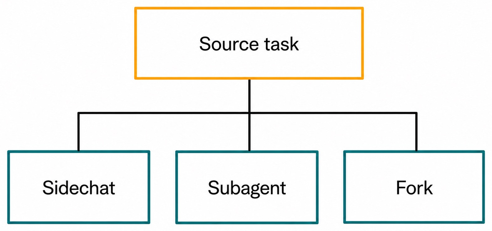
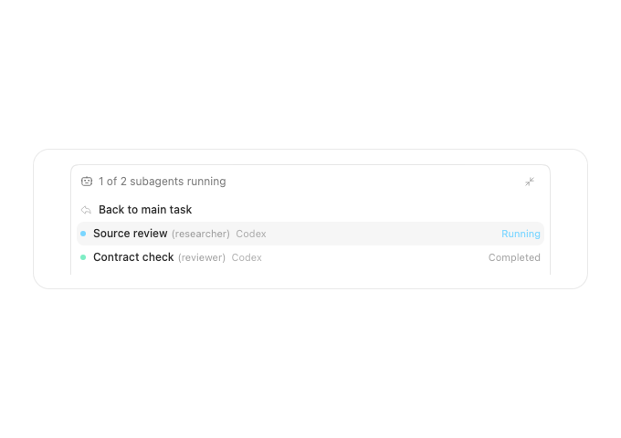
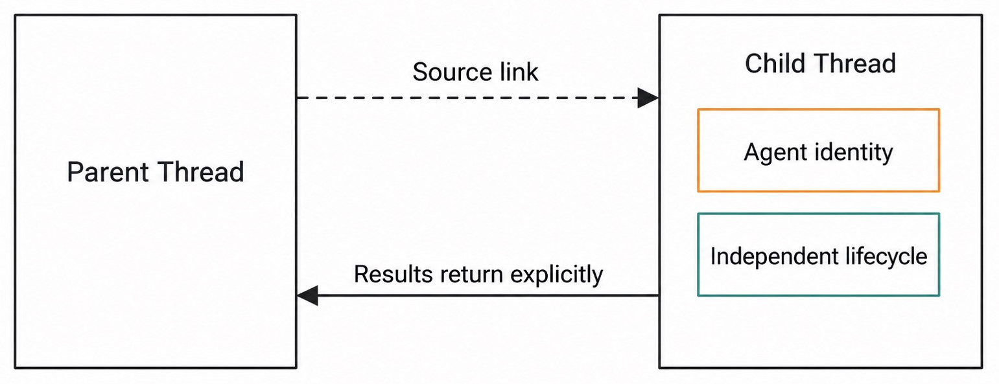
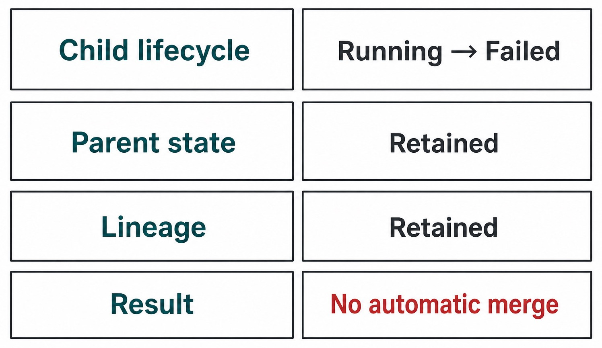

# Chapter 22 — Sidechats, Subagents, and Thread Hierarchy {#chapter-22}

## The question

Some tasks benefit from a separate line of investigation. You may want to ask a narrow side question,
delegate bounded work to a subagent, or create a fork with inherited history. Haros records these as
distinct Thread relationships so the product can show where each descendant came from and what kind
of responsibility it carries.

The labels are not interchangeable. A Sidechat is a side investigation associated with a source
task. A Subagent represents delegated bounded work with explicit parent/source lineage. A Fork is a
new Thread created from a defined history boundary. All can appear as descendants, but each answers a
different lifecycle question.

_Figure 22.1 — Visible hierarchy preserves different relationship kinds instead of flattening them._

**Accessible equivalent.** Source task is connected to three separately bounded descendants: Sidechat, Subagent, and Fork. The three sibling relations remain distinct; no child contains another.

## Read the lineage fields literally

| Relationship | Primary purpose                             | Essential lineage                        | Responsibility expectation              | Not equivalent to               |
| ------------ | ------------------------------------------- | ---------------------------------------- | --------------------------------------- | ------------------------------- |
| Sidechat     | investigate a side question                 | source task/Thread relationship          | returns insight to the source decision  | delegated implementation worker |
| Subagent     | perform bounded delegated work              | parent/source plus subagent identity     | produces a result for the parent        | invisible tool call             |
| Fork         | begin a new product history from a cutoff   | source Thread, cutoff, fork relationship | owns its future independent history     | continuation of the same Thread |
| Handoff      | move product work across execution boundary | source/target and handoff record         | target takes over after stop-first flow | one of the three child types    |

The exact fields may include parent, source, subagent, fork, or related identifiers according to the
contract. Do not infer one from layout. A child indented under a source in the UI is not necessarily a
Subagent. Read the relationship metadata and source divider.

_Real product capture — The subagent strip preserves a route to the parent and reports each child's
separate status instead of flattening responsibility._

## Sidechat: protect the main decision path

A Sidechat is useful when the main Thread needs an answer but not all exploratory discussion. For
example, a release Thread may need a quick investigation of whether a library option changed. The
side investigation can inspect that question while the source remains focused on release readiness.

Keep the Sidechat bounded. State the question, the evidence it may inspect, and the form of the return
answer. “Determine whether the option is supported in the pinned version; report the exact source and
do not edit files” is better than “look into the library.”

A Sidechat's conclusion does not silently become source truth. Bring the relevant result back through
the supported relationship or a source-Thread Message. The source owner still decides how the answer
affects the main task.

Use Sidechat for divergent reasoning, not as a hiding place for consequential actions. If the side
question requires an external write, deletion, or scope expansion, it still needs the same authority
as if it were asked in the main Thread.

## Subagent: bounded delegation

A Subagent handles a concrete subtask on behalf of a parent agent or task. Good delegation specifies
exclusive files or evidence, deliverables, forbidden actions, and a stopping condition. The parent
remains responsible for integration and final claims.

Examples include reviewing one independent source package, drafting one mutually exclusive chapter,
or running a focused read-only analysis. Poor delegation says “finish anything you can find.” It
invites scope overlap and makes the parent unable to tell who owns the result.

Subagent activity should be visible as lineage, not impersonated as parent work. When results return,
the parent verifies them against current shared state. In a shared filesystem, another agent's edits
can be visible immediately; visibility does not remove the need to preserve unknown changes or avoid
overlapping ownership.

The product Thread and native Engine Session distinction still applies. A child may have its own
execution Session. The parent should not claim the child continued its private runtime context.

## Fork: history-bounded independence

A Fork creates a new Thread from an exact source-history scope. It is appropriate when future work
should diverge while retaining a defined prefix. Chapter 23 covers the cutoff rules in detail.

Unlike a Sidechat, a Fork is not merely a side question expected to return one answer. Unlike a
Subagent, it is not defined primarily by delegation responsibility. Its central property is the
history boundary: what source Messages are imported and where new history begins.

Because a Fork owns its future history, changes in the source after the cutoff do not automatically
appear in the child. The relationship remains visible so readers can compare paths without pretending
they are synchronized copies.

## A branching example

Amara owns a Thread for a failing Desktop capture. Three needs emerge:

1. She needs a quick answer about a browser viewport contract. She opens a Sidechat with a read-only
   question and asks for a source citation.
2. She delegates inspection of a separate capture fixture to a Subagent with an exclusive file list
   and no write authority.
3. She wants to explore an alternate architecture from the history up to the confirmed root cause.
   She creates a Fork at that cutoff.

The hierarchy now shows three descendants. The Sidechat returns a concise finding that Amara records
in the source. The Subagent reports a fixture mismatch; Amara verifies it before integration. The Fork
develops a separate future and does not feed changes back automatically.

_Figure 22.2 — A side branch is useful only when its question, responsibility, and return path are clear._

**Accessible equivalent.** Parent and Child Threads remain separate and are joined by a dashed source link. The child has its own Agent identity and independent lifecycle, and results return only through an explicit path to the parent.

## Relationship does not mean inheritance of everything

| Fact                           | May be represented in lineage/context | Must remain independently owned     |
| ------------------------------ | ------------------------------------- | ----------------------------------- |
| source Thread identity         | yes                                   | source future Messages              |
| parent task identity           | yes for applicable child type         | parent Turn lifecycle               |
| bounded prompt/history context | according to command contract         | child future history                |
| selected Engine/model          | recorded per admitted child Turn      | parent native Session               |
| workspace relationship         | explicit when applicable              | permissions and capability receipts |

Do not use the word “inherits” without naming the fact. A Fork inherits a defined history prefix. A
Subagent may receive a bounded task and context. A Sidechat may know its source relationship. None of
these statements proves that permissions, Queue position, active Turn state, Goal continuation, or
native Session memory crossed.

This precision makes failures diagnosable. If a child lacks a file, ask whether its workspace or
attachment context admitted that file. Do not assume parent access flowed through the lineage edge.

## Returning results

A child result needs provenance and an integration decision. A useful return includes what was asked,
what evidence was inspected, what conclusion follows, what remains uncertain, and whether any files
or external state changed.

For a read-only Sidechat, a short source-backed answer may be enough. For a Subagent edit, the parent
should inspect the exact paths and run the narrowest relevant check. For a Fork, there may be no
return at all; it is a separate path whose relationship remains available for comparison.

Do not paste an entire child transcript into the parent by default. That destroys the readability
benefit of splitting work. Bring back the conclusion and exact evidence, while retaining a link to the
child history for deeper review.

## Stop and cancellation behavior

Stopping a parent does not justify guessing that every descendant stopped. Each active Turn and
native Session follows its own lifecycle and the product's relationship-aware control path. Likewise,
stopping a child does not settle the parent Goal as achieved.

The safe UI exposes which task is active and which control is being applied. A parent may decide to
wait, interrupt a child, or continue other work. Terminal outcomes must reconcile from authoritative
events, not from a collapsed tree spinner.

_Figure 22.3 — Lineage aids control, but each bounded Turn still settles explicitly._

**Accessible equivalent.** The matrix rows are Child lifecycle: Running to Failed; Parent state: Retained; Lineage: Retained; Result: No automatic merge.

## Failure and recovery

### The child appears under the wrong source

Inspect stable lineage IDs rather than titles. Similar titles are common. If the canonical
relationship is wrong, repair it at the owner or recreate the bounded child through a supported path.
Do not drag it visually and assume product history changed.

### A child result never returns

Check whether its Turn is queued, running, waiting for interaction, interrupted, or terminal. If it
needs attention, resolve that lifecycle. If it failed, preserve its history and decide whether to
retry with the same bounded task. Do not fabricate a successful summary in the parent.

### Two agents edited the same file

Shared visibility is not safe integration. Stop overlapping work, inspect both changes, and choose a
single owner. Preserve unrelated user edits. The parent should not overwrite one result merely because
the other child finished later.

### A Sidechat grows into the main task

Stop and redefine the responsibility. Return the useful finding, then create the proper distinct
Thread or approved delegation if substantial work is needed. Sidechat convenience does not broaden
the original authority.

| Symptom             | Likely boundary                 | Preserved facts           | Recovery                                   | Do not claim             |
| ------------------- | ------------------------------- | ------------------------- | ------------------------------------------ | ------------------------ |
| wrong visual parent | lineage projection or source ID | both Thread histories     | inspect canonical IDs, repair relationship | indentation is authority |
| child waiting       | child Turn/interaction          | parent and child Messages | address child state or interrupt           | child failed silently    |
| missing return      | child terminal/result path      | child history             | read result, verify, summarize in parent   | parent already knows it  |
| overlapping edits   | delegation scope                | both visible change sets  | stop overlap, integrate deliberately       | last writer is correct   |
| parent interrupted  | parent Turn/Goal                | descendant lifecycles     | inspect each child separately              | all descendants stopped  |

## Hierarchy is a projection, not a filesystem tree

The UI may draw nested rows, but lineage does not mean directories were created. Thread hierarchy and
worktree hierarchy are different facts. A child can share a workspace, use another managed
workspace, or have explicit worktree metadata depending on the command; the relationship alone says
nothing about paths.

It is also not an ownership transfer. The source Project remains the Project. A Group can organize
any eligible Threads without changing lineage. Notes, pins, and markers remain scoped to their own
Threads.

This allows several views over the same durable work: Project ownership, Group membership, and Thread
lineage. Each has one question and a small modification radius.

## Choosing the right branch

Use Sidechat when the main task needs one bounded answer and you want exploratory discussion out of
the main transcript. Use Subagent when a parent is delegating a concrete deliverable and will verify
and integrate it. Use Fork when future product history should become independent from an exact
source prefix.

If you need to change Engines or move to a separate worktree with stop-first semantics, use Handoff,
not a generic descendant. If you only need a reusable view of existing Threads, use a Group. If you
need a landmark in one history, use notes, pins, or markers.

Naming the relationship before creating it is a useful guardrail. Finish: “This child exists to **_;
it receives _**; it returns or owns **_; it must not _**.” If you cannot fill the blanks, the split is
not yet bounded enough.

## Check your model

1. Does every child row mean Subagent? No; inspect relationship type.
2. Does a Sidechat automatically change the source Thread? No; its finding needs an explicit return
   and integration decision.
3. Does a Fork stay synchronized with later source Messages? No.
4. Can a lineage edge transfer capability authority? No.
5. If the parent is interrupted, are all child Turns necessarily terminal? No; inspect each lifecycle.
6. Is a nested Thread necessarily a nested folder or worktree? No.

Visible lineage is valuable because it keeps origin and responsibility reviewable. Its value depends
on refusing to inflate that relationship into copied history, inherited permissions, or fabricated
native continuity.

## Writing a bounded child brief

A good brief has five parts. State the exact question or deliverable. Name the sources or files the
child may use. Declare whether the work is read-only or which exclusive paths may be edited. List
forbidden actions, especially shared files, publishing, destructive cleanup, and authority changes.
Finally, define the return format and stop condition.

For example: “Inspect the Group decider tests and contract. Report whether deletion is non-cascading,
with exact source locators. Do not edit files, run broad gates, or infer behavior from UI copy. Stop
after the source-backed answer.” This brief is suitable for a Sidechat or read-only Subagent. “Help
with Groups” is not.

For an editing Subagent, add the current workspace status and preserve unknown changes. Exclusive
paths prevent two agents from racing. The parent still inspects the result because a bounded brief
reduces risk; it does not make verification unnecessary.

## Monitoring without accidental control

A parent can observe child status, but polling should not mutate it. Read whether the child is active,
waiting for input, completed, or failed. If it requests a decision outside the delegated scope, the
parent returns that decision or stops the child; it should not let the child assume expanded authority.

Avoid interpreting silence as failure. A tool call may still be running. Conversely, do not interpret
a “completed” badge as proof that every requested fact is correct. Read the returned evidence and
verify material edits.

When a user sends a new instruction, decide whether it replaces the parent task or adds to it before
continuing children. Stale children should be interrupted if their work is no longer desired. Their
existing history remains available for review.

## Integrating a child result

Integration begins by checking scope: did the child touch only its assigned paths or sources? Then
check truth: do conclusions match current canonical owners? Then check compatibility with other
visible worktree changes. Only after those checks should the parent rely on the result in a final
claim.

If the child found a blocker, preserve the evidence and decide at the parent. A child should not mark
the broader Goal achieved merely because its local subtask ended. If the child edited files, the
parent runs the affected narrow tests rather than asking another child to certify the same output
without inspection.

For a Sidechat answer, integration may be one sentence with a source link. For a Subagent deliverable,
it may include a diff and test result. For a Fork, integration is optional; the new path can remain an
independent alternative.

## Lineage during recovery

After restart, reconstruct hierarchy from durable relationship fields, not the last expanded/collapsed
tree UI. Child Turns that were active need their own settlement. A parent should not create replacement
children until it knows whether earlier requests succeeded.

If a relationship projects before child history is fully available, show a bounded pending state.
Do not attach the child to a similar source as a visual fallback. Stable source, parent, and target IDs
are the recovery anchors.

A useful hierarchy defect report includes every relevant Thread ID, relationship type, parent/source
fields, active Turn IDs, and the state after reload. It does not need private transcript content to
prove that one child was attached to the wrong source.

## Source trail

- `packages/contracts/src/orchestration.ts` defines parent, source, subagent, fork, and related Thread
  lineage fields and child-facing projections.
- `apps/web/src/components/chat/ComposerSubagentStrip.logic.ts` derives visible subagent status and
  controls from explicit child lifecycle facts.
- `apps/web/src/components/chat/ForkSourceDivider.tsx` presents a fork's source boundary without
  representing it as ordinary continuation.
- `apps/server/src/orchestration/decider.ts` owns child/fork command decisions and the events from
  which hierarchy is projected.

<!-- guide-navigation:start -->

[Guidebook contents](../README.md) · [Previous: Images and Voice](21-images-and-voice.md) · [Next: Forks and History Boundaries](23-forks-and-history-boundaries.md)

<!-- guide-navigation:end -->
