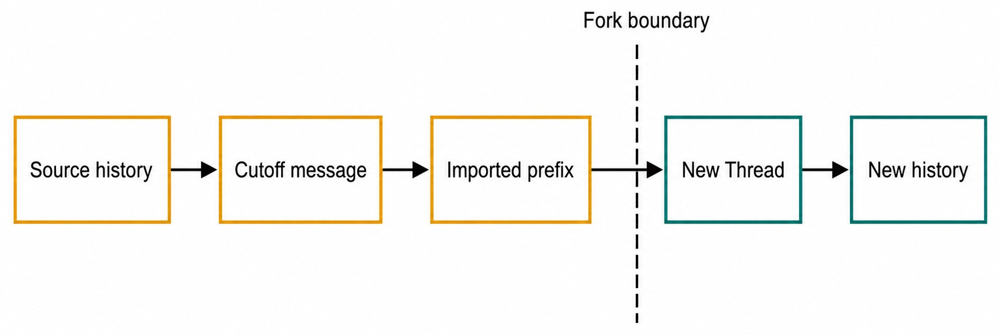
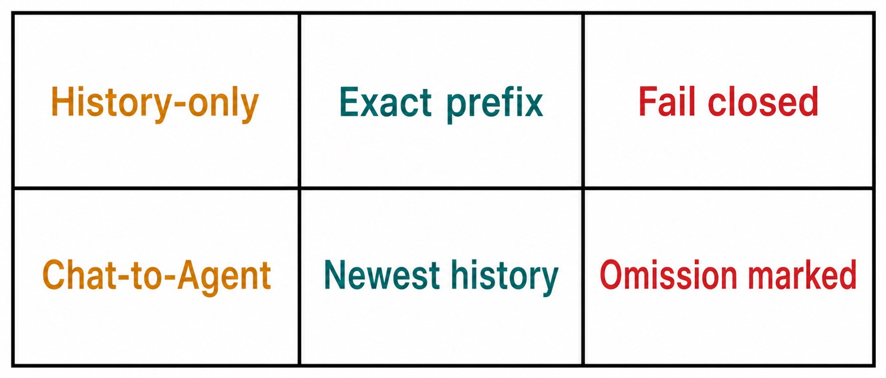

# Chapter 23 — Forks and History Boundaries {#chapter-23}

## The question

A Fork begins a new Product Thread from a defined source-history boundary. The source remains intact.
The target receives exactly the history allowed by the selected fork scope, then owns new Messages
from that point onward.

This is not continuation of the source Thread. It is not a live branch that receives later source
Messages. It is not a copy of native Engine Session memory. A Fork preserves provenance by recording
the source and cutoff while creating a new durable future.

_Figure 23.1 — The cutoff determines the imported prefix; new history begins only after the boundary._

**Accessible equivalent.** History-only Fork input stops at an exact cutoff Message. The imported prefix crosses into a newly created Thread at the labelled Fork boundary, and new history begins after that boundary.

## The exact facts

| Fact              | Source side                                     | Target side                     | Why it matters                            |
| ----------------- | ----------------------------------------------- | ------------------------------- | ----------------------------------------- |
| Source Thread ID  | identifies origin                               | retained as lineage             | titles are not reliable identity          |
| Cutoff Message ID | ends eligible prefix                            | validates imported boundary     | prevents approximate slicing              |
| Fork scope        | declares history-only or Chat-to-Agent behavior | determines bootstrap            | different scopes import different context |
| Target Thread ID  | absent before creation                          | owns future history             | target is not source continuation         |
| Native Session    | remains Engine-owned                            | new execution binding as needed | cannot be copied by history import        |

The cutoff must resolve exactly. If the requested Message does not belong to the source, or if the
prefix cannot be constructed according to the scope, the safe behavior is to fail closed. Choosing a
nearby Message or importing all history would change the user's intended context.

## History-only Fork

A history-only Fork imports the exact eligible source prefix through the cutoff. Think of it as a
new reading position: “Create another Thread that knows the conversation up to this Message.” The
target's first new Message follows that imported product history.

Messages after the cutoff do not enter. Activities, pending interactions, Queue state, and native
runtime memory do not become part of the prefix merely because they were visible near those Messages.
Only the contract-defined history crosses.

Use this scope when you want to explore an alternative response to an earlier point, test a different
approach, or separate a new deliverable while retaining relevant discussion.

## Chat-to-Agent Fork

Chat-to-Agent Fork moves from a managed Chat context into an Agent-oriented Thread. Its bootstrap is
bounded rather than an unlimited transcript dump. Current evidence uses the newest eligible history
within the defined cap and may include an omission marker when older content is not imported.

The omission marker is a truth feature. It tells the reader that the target does not contain the full
source history. Without it, a target might appear comprehensive while silently missing early
constraints.

Do not assume this scope also transfers workspace files or permissions. The target Agent Project and
workspace are explicit facts. Imported conversational context can describe a file, but actual file
access comes from the target workspace and HostGateway authorization.

## Choose a cutoff deliberately

Fork after the last Message that should be shared by both futures. If the source has already taken a
direction you want to avoid, cut before that decision. If a user correction is essential, include the
correction and exclude the obsolete path only if the exact history remains understandable.

Ravi has a Thread that investigates two possible owners for a timeout defect. At Message 42, source
evidence establishes that the orchestration reactor owns it. Messages 43–50 explore a risky migration
that Ravi no longer wants. He forks at Message 42 and asks the target to design a narrow owner-local
fix. The target receives the reasoning through the ownership conclusion but none of the discarded
migration discussion.

If Ravi forked at Message 41, the target would miss the decisive evidence. If he forked at Message 50,
the target would inherit the distracting migration path. The cutoff is therefore part of the task
design, not a decorative timestamp.

## Source and target after creation

_Figure 23.2 — Imported history is fixed at creation; both Threads then evolve independently._

**Accessible equivalent.** History-only requires an exact prefix and fails closed when that prefix cannot fit. Chat-to-Agent keeps bounded newest history and marks the omission.

After Ravi creates the Fork, he can continue discussing release risk in the source while the target
implements the narrow fix. Neither future automatically updates the other. To share a new finding,
Ravi must reference or communicate it explicitly.

| After the Fork          | Source Thread                              | Target Thread                                  |
| ----------------------- | ------------------------------------------ | ---------------------------------------------- |
| identity                | unchanged                                  | new ID                                         |
| imported prefix         | original history                           | bounded copy/projection through cutoff         |
| future Messages         | remain source-owned                        | remain target-owned                            |
| Goal/Plan relationships | source lifecycle unless explicitly related | only explicit admitted relationships           |
| Engine Session          | source runtime ownership                   | new target runtime binding; no fabricated copy |

This independence avoids retroactive mutation. Editing or resending a source Message after target
creation does not rewrite the target's imported snapshot unless an explicit replay workflow says so.
Similarly, target work cannot alter the source transcript.

## Bootstrap is product state

Target creation may have a bootstrap lifecycle: requested, pending, ready, or failed according to the
contract. Do not submit work repeatedly while the target is still being prepared. Wait for the new
Thread identity or a clear failure.

If bootstrap fails, the source remains. The product should report whether a target was created and
which history, if any, was imported. A failed target must not be presented as a ready Fork merely
because a placeholder row exists.

Idempotency is important. Retrying the same creation after uncertainty should reconcile with the
existing request/target where supported rather than create many near-identical Threads. Users should
inspect stable IDs and lineage, not guess by title.

## What never crosses implicitly

A Fork does not automatically carry:

- the source's active Turn or Queue position;
- pending approval or user-input interactions;
- native Engine Session identifiers or private context;
- filesystem changes not represented in the target workspace;
- capability grants or receipts;
- later source Messages;
- every attachment forever, outside managed lifecycle;
- Group membership or notes unless the product explicitly creates those relationships.

This list is not a limitation of conversation quality. It is an ownership guarantee. Each target
fact must be admitted by its actual owner instead of inferred from the presence of copied Messages.

## Failure and recovery

### Cutoff cannot be resolved

Confirm the source Thread and exact Message ID. Do not choose the nearest visible Message. Reload
history if the projection is stale. If the Message is truly outside the source or unavailable, ask
the user for another explicit boundary.

### Imported history is shorter than expected

Check the fork scope and whether a bounded Chat-to-Agent bootstrap emitted an omission marker. If the
scope behaved correctly, supply missing context through a new admitted reference or choose a new Fork
with the intended cutoff. Do not claim the target has full history.

### Target contains a Message after the cutoff

Compare stable Message IDs and ordering with the source. If source content beyond the cutoff entered
the target, treat it as a scope defect. Do not continue consequential work until the context boundary
is understood.

### Creation times out

Reconcile the request before retrying. Search for a target with the canonical source/fork relationship,
not merely the same title. If one exists, use it. If creation definitively failed, retry once through
the supported action.

| Symptom               | Preserved fact             | Narrow check                 | Safe recovery                   | Unsafe shortcut          |
| --------------------- | -------------------------- | ---------------------------- | ------------------------------- | ------------------------ |
| invalid cutoff        | source Thread/history      | source owns exact Message ID | choose explicit valid cutoff    | nearest-message fallback |
| omitted older history | target and omission marker | inspect scope/cap            | admit needed context separately | claim full copy          |
| extra source history  | both Threads               | compare IDs through cutoff   | stop and diagnose scope owner   | ignore contamination     |
| target pending        | source remains usable      | creation lifecycle           | reconcile before retry          | click repeatedly         |
| wrong target selected | all candidate Threads      | lineage IDs                  | open exact related target       | match by title           |

## Fork versus edit-and-resend

Edit-and-resend changes the conversation path through a replay mechanism. A Fork creates a new Thread.
Both can revisit an earlier point, but their ownership and visible outcomes differ.

Choose Fork when you want both futures preserved as separate product histories. Choose edit-and-resend
when the supported replay workflow should revise the current line. Do not use copying and pasting into
a new ordinary Thread as an informal Fork; it loses exact cutoff and source provenance.

The reversible question helps: “Should I be able to return to both paths with their relationship
visible?” If yes, Fork is likely right.

## Fork versus Plan implementation

An implementation Thread starts from a reviewed proposed Plan and retains a source-plan link. A Fork
starts from a history boundary. A Plan may be present in the imported history, but that does not turn
the Fork into the typed implementation workflow.

Use the implementation action when review and source-plan provenance are central. Use Fork when the
cutoff and divergent future are central. A product may create both kinds of relationships, but one
should not be inferred from the other.

## Fork versus Handoff

A Handoff moves work across an Engine or workspace boundary with stop-first semantics and a new
native Engine Session. A Fork creates a new history path; the source may continue. Fork does not mean
“stop the source and let the target take over.”

If the user's goal is to switch Engines while preserving one continuing product task, Handoff is the
more accurate operation. If the goal is to explore an alternative from earlier history, Fork is
appropriate. Combining the words casually leads to false expectations about stopping and runtime
continuity.

## Privacy and history selection

A Fork can increase the number of places where source content appears. Choose the smallest useful
prefix. Do not import early Messages containing unrelated sensitive data merely for convenience. For
Chat-to-Agent transitions, heed omission and bounded-history behavior instead of forcing an unlimited
copy.

Attachments in imported Messages remain governed by managed attachment lifecycle and target access.
A visible filename is not proof that bytes are available. Secrets and private runtime responses must
not be copied into a target simply because they were near the cutoff.

If publication or external sharing follows, review the target as its own artifact. The source's local
privacy context does not automatically transfer as a release decision.

## Check your model

1. Does a Fork modify the source? No.
2. Is the cutoff approximate? No; it resolves an exact eligible Message.
3. Do later source Messages synchronize into the target? No.
4. Does history import copy a native Engine Session? No.
5. Can Chat-to-Agent bootstrap omit older history visibly? Yes, according to its bounded scope.
6. If creation is uncertain, should you immediately retry? No; reconcile first.
7. Is a Fork the same as a Plan implementation Thread or Handoff? No.

The correct model is a fixed source prefix, a labelled boundary, a new Thread identity, and an
independent future. Every additional fact must cross through its own explicit contract.

## Auditing an imported prefix

For a history-only Fork, list the source Message IDs from the beginning through the cutoff and compare
them with the imported target prefix in order. The target may project imported Messages with its own
relationship metadata, but it must not reorder content or include a source Message beyond the cutoff.
Then verify that the first target-created Message is visibly after the Fork boundary.

For Chat-to-Agent scope, inspect the bounded window rather than expecting the source beginning. If an
omission marker is required, confirm it appears before the imported newest history. Count and ordering
should match the contract even when the source contains attachments or assistant Messages.

Do not compare prose only. Duplicate or repeated Messages make text matching ambiguous. Stable IDs,
roles, ordering, cutoff, and relationship fields provide stronger evidence.

## Attachments, activities, and Plans at the boundary

An imported Message may reference a managed attachment. Whether the target can retrieve the content
depends on managed attachment and target admission rules; the filename alone does not prove access.
If the attachment is essential, test its availability before consequential work.

Timeline activities are not necessarily Message history. A history-only scope should not acquire
pending approvals, tool progress, or source Queue state just because those activities occurred before
the cutoff. The target generates its own activities when it begins work.

A proposed Plan inside the prefix remains a historical proposal. The target is not automatically a
typed implementation Thread unless the proper Plan action and relationship created it. If you intend
to implement the Plan, use the workflow that preserves source-plan provenance.

## Divergence and later reconciliation

Two Forks from the same cutoff can reach different conclusions. That is expected. Compare their new
evidence explicitly. Do not attempt to “sync” histories by rewriting imported Messages. If one path
becomes authoritative, record the decision in the relevant Thread and preserve the other as an
alternative history.

If target work must be brought back into the source repository branch, Git integration is separate
from Thread history. Review diffs and checkpoints normally. A Fork relationship does not merge files,
and a Git merge does not merge conversation histories.

When a target discovers that the cutoff excluded a decisive constraint, stop or pause consequential
work. Admit the missing context through a clear Message/reference or create a new Fork at a corrected
cutoff. Continuing with known incomplete context sacrifices the main truth benefit of the boundary.

## Idempotency and duplicate prevention

Fork creation should have a stable request/relationship path so uncertain retries can reconcile. From
the user's perspective, wait for a ready target or explicit failure. If the UI reloads during pending
creation, inspect existing targets associated with the source and cutoff before pressing Fork again.

If duplicates exist, do not delete either until you know which contains new work. Compare creation
events, relationships, and admitted Turns. Choose one continuation path and settle the unused target
through supported lifecycle while retaining evidence of why it was abandoned.

Titles are poor duplicate keys. Two legitimate alternative Forks may share a title, while one target
may be renamed. Source Thread ID, cutoff Message ID, fork request, and target ID identify the operation.

## A safe Fork rehearsal

In a disposable Thread, create several harmless Messages with distinct labels. Fork at the middle
Message. Verify the exact prefix, add one source-only Message and one target-only Message, reload, and
confirm neither future synchronized. If Chat-to-Agent scope is available, use enough fixture history
to exercise its bounded behavior and omission marker without real private content.

The rehearsal should use isolated state and no external capabilities. It proves history semantics,
not Engine quality. Record only IDs/counts needed for the check, then keep or remove the disposable
Threads through normal lifecycle rather than altering real user history.

When reporting a Fork defect, include the source Thread ID, cutoff Message ID, declared scope, target
Thread ID, ordered imported Message IDs, and the first target-created Message. For bounded
Chat-to-Agent scope, include whether the omission marker appeared. These sanitized relationship facts
usually prove the boundary without exposing Message bodies.

Keep runtime evidence separate. A target Engine startup failure does not prove history import failed,
and correct imported history does not prove a native Session started. Report each claim against its
own owner so recovery can preserve the successful half.

## Source trail

- `packages/contracts/src/orchestration.ts` defines fork scopes, source/cutoff relationships, target
  bootstrap facts, and Thread lineage.
- `apps/server/src/orchestration/decider.forkScope.test.ts` proves exact cutoff, history-only, bounded
  Chat-to-Agent, omission, and fail-closed scope behavior.
- `apps/server/src/orchestration/engineSessionThread.test.ts` proves Product Thread and native Engine
  Session identities remain separate across new Thread execution.
- `apps/web/src/components/chat/ForkSourceDivider.tsx` presents the visible source boundary and
  provenance without implying ordinary continuation.

<!-- guide-navigation:start -->

[Guidebook contents](../README.md) · [Previous: Sidechats, Subagents, and Thread Hierarchy](22-sidechats-subagents-thread-hierarchy.md) · [Next: Handoffs, Branches, and Worktrees](24-handoffs-branches-worktrees.md)

<!-- guide-navigation:end -->
