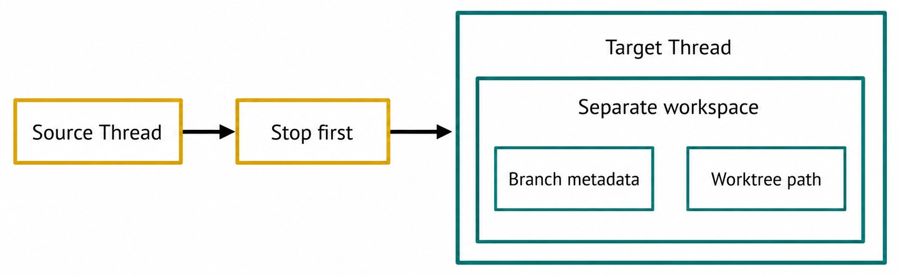
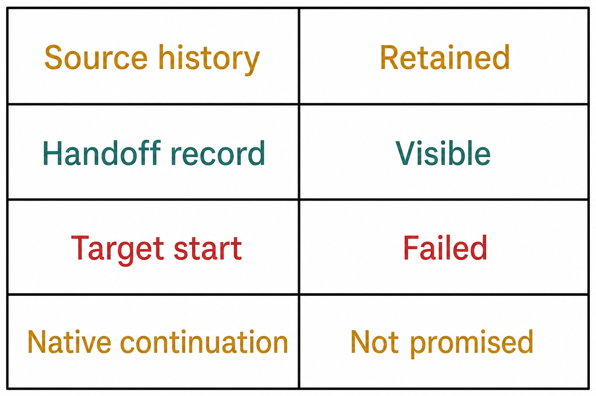

# Chapter 24 — Handoffs, Branches, and Worktrees {#chapter-24}

## The question

A Handoff moves responsibility for continuing product work to a target execution context. Haros can
preserve product Messages, history, relationships, and explicit workspace metadata. It cannot copy a
native Engine Session across Engines. The target begins a new native Session.

That boundary is the chapter's foundation. Product continuity is real because Haros owns the Thread
and handoff records. Runtime continuity would be false unless the same Engine's native protocol
explicitly provided it. Handoff therefore imports the product facts the target needs and starts fresh
execution.

_Figure 24.1 — Handoff preserves Haros history while execution restarts at a truthful native boundary._

**Accessible equivalent.** Two explicit left-to-right arrows connect Product history to Handoff and Handoff to New Engine Session. The new native Session begins after the handoff; source native Session state is not shown crossing the boundary.

## Separate the relevant identities

| Identity/fact   | Owner                            | Handoff behavior                                               | Must not be confused with            |
| --------------- | -------------------------------- | -------------------------------------------------------------- | ------------------------------------ |
| Product Thread  | Haros orchestration              | source/target relationship and imported history remain visible | native Engine Session                |
| Handoff record  | Haros orchestration              | records source, target, phase, and outcome                     | transcript copy alone                |
| Native Session  | selected Engine adapter/runtime  | target starts a new one                                        | transferable product history         |
| Branch metadata | workspace/worktree product state | explicitly bound when applicable                               | proof that checkout succeeded        |
| Worktree path   | workspace setup owner            | projected after setup                                          | Thread hierarchy or Group membership |

The target may use the same Engine type, a different Engine, the same repository, or a separate
worktree depending on the command. None of those choices changes the identity rule. A Product Thread
is not a native Session, and a worktree is not a Thread.

## Stop first

The source must stop before the target takes over. This prevents two execution contexts from both
believing they own the next action. Stop-first semantics do not require deleting the source history;
they require settling or halting active source execution before target admission.

_Figure 24.2 — Execution ownership changes directionally; workspace facts remain inside the target boundary._

**Accessible equivalent.** The source Thread stops first before the target Thread takes over. Inside a separate workspace, the target Thread owns explicit Branch metadata and Worktree path metadata.

If source interruption is still uncertain, the handoff cannot safely pretend takeover completed.
The product may show pending or failed state while cancellation settles. It should preserve the
prompt and history and restore control. Starting target execution early risks duplicate edits or
external effects.

Stop-first is also not achievement. If a Goal was active, stopping source execution normally pauses
or transfers pursuit according to explicit lifecycle facts; it does not certify that the objective
was reached.

## Product history import

The target needs an intelligible starting point. Handoff imports product Messages/history according
to the command contract and records the source relationship. This allows the target Engine to reason
from reviewed conversation without claiming access to the source Engine's private memory.

The imported history is product-owned data. Native tool caches, hidden reasoning, process state,
pending approval handles, and provider-specific Session state do not cross. Any required capability
must be requested again through the target's authorized path.

This distinction explains a familiar experience: the target can summarize the prior discussion yet
still needs to rediscover a runtime detail or reopen a file. The history was preserved; the runtime
was replaced.

## Branches and worktrees are explicit workspace facts

A Git branch names a line of repository history. A worktree is a checkout at a path, often attached
to a branch. A Haros Thread is product conversation and execution history. The target can be bound to
branch/worktree metadata, but the objects remain separate.

When a handoff creates or uses a separate worktree, the product should project setup state before
claiming readiness. A path string alone does not prove the directory exists, is clean, or points to
the intended branch. Setup completion and failure are lifecycle facts.

Never invent a branch name from a Thread title unless the user or canonical workflow explicitly
requests it. Never assume uncommitted changes moved into a new worktree. If starting state matters,
the handoff must name whether it uses a clean ref, an existing branch, or a supported working-tree
transfer.

| Workspace choice     | Product expectation                        | Git fact to verify                      | Common false assumption              |
| -------------------- | ------------------------------------------ | --------------------------------------- | ------------------------------------ |
| same local checkout  | target operates in existing saved Project  | current branch and worktree status      | Engine change resets files           |
| separate worktree    | target gets explicit isolated path         | checkout/branch setup completed         | Thread creation alone made directory |
| existing branch      | target binds to named existing ref         | ref resolves and worktree is valid      | title selects branch                 |
| requested new branch | workflow may create exact requested name   | creation origin and success             | any missing ref may be invented      |
| working-tree start   | explicitly carries supported current state | uncommitted changes included as defined | normal clean worktree includes them  |

## A cross-Engine example

Nadia begins a repository diagnosis with Engine A. The Product Thread contains the user's constraints,
a proposed Plan, test output, and an active Goal. Engine A cannot perform the next supported workflow,
so Nadia chooses a handoff to Engine B in a separate worktree.

Haros first stops Engine A's active work and waits for a terminal outcome. It records the handoff
request and prepares a target workspace using the explicitly selected branch state. The UI shows
setup progress. Only after the path and target relationship are ready does the target begin work.

Engine B receives imported product history and the handoff context. It starts a new native Session.
It does not receive Engine A's hidden runtime state or live process. It inspects the target checkout,
reconfirms current files, and requests any required capability through HostGateway.

If the worktree setup fails, Nadia still has the source history and handoff failure record. She can
repair the branch/path problem and retry through the supported workflow. She should not manually copy
the transcript into an ordinary Thread and claim the handoff succeeded.

## Handoff phases

Different implementations may expose detailed phases, but a truthful user model has five steps:

1. Resolve the exact source and requested target execution/workspace.
2. Stop active source execution and reconcile its terminal state.
3. Create and prepare the target Thread/workspace relationship.
4. Import admitted product history and start a new native Engine Session.
5. Record success or failure and make one owner visible for continued work.

_Figure 24.3 — Failure can stop takeover while preserving product history and a recoverable decision point._

**Accessible equivalent.** The matrix states Source history: Retained; Handoff record: Visible; Target start: Failed; Native continuation: Not promised.

No phase should be inferred from a spinner alone. The target Thread ID, worktree metadata, setup
receipt, and Engine admission provide the relevant evidence.

## Same directory versus worktree

Use the same checkout when the user explicitly wants direct work in the saved Project and overlapping
execution is not a risk. Use a worktree when isolation, rollback, or parallel review justifies a
separate checkout. A Git repository normally supports worktrees; a non-Git Project may require a
local workspace instead.

Isolation does not eliminate coordination. Two worktrees can still target related branches and later
conflict. The handoff recipient should inspect repository status and the chosen base. The source owner
should know whether uncommitted changes were included, left behind, or represented through a supported
starting state.

The product must not silently switch strategies because setup is inconvenient. If worktree creation
fails, report failure. Falling back to the source checkout could expose uncommitted changes or permit
two agents to edit the same path.

## Failure and recovery

### Source will not stop

Keep the handoff pending or fail it visibly. Use the source Engine's supported cancellation and wait
for terminal evidence. Do not start the target merely because the UI control was pressed. If timeout
leaves uncertainty, preserve history and request a recovery decision.

### Target Thread exists but workspace is not ready

Treat the target as setup-pending, not executable. Inspect worktree path and branch setup records.
Retry the setup idempotently where supported, or remove the failed target through its lifecycle. Do
not run commands in a guessed path.

### Worktree path conflicts

Resolve the exact path and existing owner. Never recursively delete an unknown directory to make room.
Choose another explicit target or clean up only a proven task-owned failed workspace through a
recoverable procedure.

### Target Engine fails to start

The imported product history and handoff record remain valuable. Settle the target Turn or startup as
failed, keep control available, and choose whether to retry or hand off elsewhere. Do not claim that
the source native Session resumed automatically.

### Branch metadata differs from checkout

Stop work. Compare the projected branch/ref and actual Git state. Correct the setup owner or create a
new verified target. Do not edit sidecar metadata to make the mismatch disappear.

| Failure                | Preserved fact                        | Blocking uncertainty                 | Safe recovery                       | Not guaranteed              |
| ---------------------- | ------------------------------------- | ------------------------------------ | ----------------------------------- | --------------------------- |
| source stop timeout    | source history and handoff request    | source execution may still be active | reconcile/cancel before target      | single owner until settled  |
| workspace setup failed | source and target relationship record | target path readiness                | repair or retry exact setup         | fallback to source checkout |
| target startup failed  | imported product history              | native Session absent                | settle failure, retry/choose Engine | copied source Session       |
| wrong branch/path      | handoff and Git evidence              | target checkout identity             | stop, verify, recreate target       | metadata equals filesystem  |
| duplicate target       | each target history                   | which takeover is authoritative      | inspect IDs/events, select one      | automatic merge             |

## Handoff versus nearby operations

A Fork preserves a source prefix and creates an independent future; the source may continue. A
Handoff transfers responsibility and stops source execution first. A Subagent performs bounded work
for a parent; it does not necessarily take over. A Group merely organizes existing Threads. Changing
the Composer's Engine selection affects a new admitted Turn but does not by itself create a full
handoff record or worktree.

Use Handoff when the operational question is “Which target should own continued execution, and what
must be prepared before takeover?” Use Fork when it is “From which history point should an alternate
future begin?”

## Authority after takeover

Handoff does not transfer approvals as a blanket. The target Engine and HostGateway evaluate each
capability request in its exact Turn and workspace. A source receipt proves what happened there; it
does not authorize a new target action.

Credentials remain behind their secret owners. Product history may state that a service was used,
but private tokens and raw provider configuration must not be copied into target Messages. If the
target needs a connected service, it obtains access through the supported configuration path.

This is especially important in a new worktree. Files may be isolated, but network and device actions
can still affect shared external state. Workspace separation is not a universal sandbox.

## Finishing and returning work

At the end of target work, report the target Thread, branch, worktree, changes, checks, and unresolved
state. A future return or another handoff should use the actual records. Do not summarize “everything
continued seamlessly”; name the preserved product context and the newly established execution.

If the worktree is no longer needed, cleanup is a separate lifecycle. Confirm the exact task-owned
path and whether changes were committed or retained before removal. Handoff authorization does not
automatically authorize deleting workspaces.

If changes must rejoin another branch, ordinary Git review and merge rules apply. A successful
handoff is not a merge receipt and not a release claim.

## Check your model

1. What crosses Engines? Admitted product history and explicit relationships—not native Session state.
2. When may the target take over? After source execution stops and target setup is ready.
3. Does a Thread equal a worktree? No.
4. Does branch metadata prove the checkout? No; verify setup and Git state.
5. May the system silently fall back from worktree to source checkout? No.
6. Do source approvals grant target actions? No.
7. Is a Handoff the same as a Fork? No; takeover and history divergence are different.

The trustworthy handoff story is explicit: stop one execution owner, preserve Haros product history,
prepare the target workspace, begin a new native Session, and prove which target now owns the work.

## Preflight before a handoff

Record the source Thread and active Turn IDs, current Engine, workspace path, Git branch/status, active
Goal state, and any unresolved interaction. Then name the requested target Engine and workspace mode.
This preflight makes the stop and setup outcomes comparable; it does not copy private state into the
target.

If the source checkout contains unknown uncommitted changes, decide explicitly whether the supported
starting state includes them. A normal fresh worktree from a branch will not contain arbitrary
working-tree edits. Never stash, reset, or overwrite them merely to make setup convenient without the
required authority.

Check disk/path constraints and whether the target branch already has another worktree. Resolve exact
conflicts before stopping valuable source work when possible. Preflight cannot eliminate every
failure, but it makes recovery bounded.

## Proving takeover

A target row in the UI is insufficient. Confirm the handoff record identifies the source and target,
source execution is terminal, workspace setup is ready, the projected branch/path match actual Git
state, and the target's first Turn records its own Engine/model provenance.

Then inspect one imported constraint from product history and one current target filesystem fact. This
proves both halves of the handoff: context crossed through Haros, while execution began against the
new workspace. Do not use a private native Session identifier as the continuity proof.

If any check fails, keep the handoff in a recoverable incomplete state. Do not write an achievement
record or claim ownership transferred merely because some setup steps succeeded.

## Returning from a worktree

Completing target work does not automatically move files back. Review the target diff, run the
appropriate checks, and use normal Git integration with explicit branch ownership. Keep the handoff
relationship as execution provenance; do not rewrite it into a merge record.

Before removing a worktree, verify its exact path, task ownership, branch, and uncommitted state. A
safe cleanup should be recoverable or use supported Git worktree removal after changes are retained.
Never recursively delete a broad or unresolved path.

The target Product Thread may remain valuable after workspace cleanup because it contains Messages,
receipts, and decisions. Worktree lifecycle and Thread lifecycle end independently.

## Handoff audit evidence

A useful report includes source/target Thread IDs, target Engine selection, source terminal outcome,
handoff phase/outcome, imported Message boundary, worktree path, branch metadata, and target startup
receipt. Sanitize local paths and omit credentials or raw provider responses.

When diagnosing duplicate work, include both target IDs and their first admitted Turn timestamps.
When diagnosing wrong workspace, compare projected metadata with read-only Git commands. These facts
locate the defect without claiming that a screenshot or assistant summary is canonical.
Keep every recovery action scoped, explicit, and reversible whenever possible.

## Source trail

- `packages/contracts/src/orchestration.ts` defines handoff, source/target Thread, Engine selection,
  branch, worktree, and setup-facing product facts.
- `apps/server/src/orchestration/handoff.ts` owns the stop-first handoff workflow, history import, and
  target execution transition.
- `apps/server/src/orchestration/handoff.test.ts` proves source preservation, target creation,
  cross-Engine native Session separation, and failure behavior.
- `apps/server/src/orchestration/decider.worktreeMetadata.test.ts` provides focused evidence for
  explicit branch and worktree metadata.
- `apps/web/src/components/chat/MessagesTimeline.worktreeSetup.browser.tsx` proves the Web presents
  setup progress/failure from product facts rather than treating target creation as instant readiness.

<!-- guide-navigation:start -->

[Guidebook contents](../README.md) · [Previous: Forks and History Boundaries](23-forks-and-history-boundaries.md) · [Next: Files, Search, Preview, and Editors](../part-04-capabilities/25-files-search-preview-editors.md)

<!-- guide-navigation:end -->
