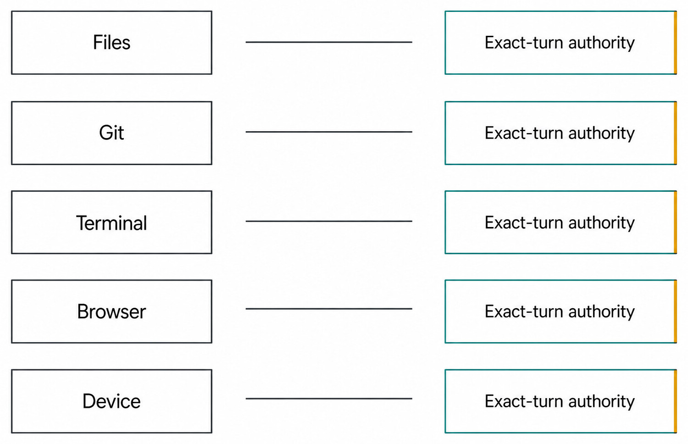
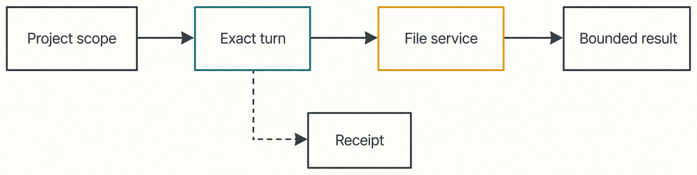
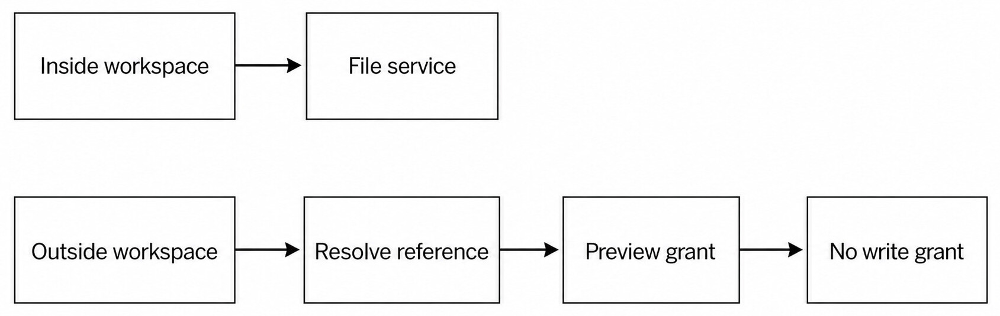

# Chapter 25 — Files, Search, Preview, and Editors {#chapter-25}

_Part IV opener — Files, Git, Terminal, Browser, and Device remain separate capability owners even
when Haros presents them in one workbench._

**Accessible equivalent.** Files, Git, Terminal, Browser, and Device remain parallel capability owners; each is independently bounded by exact-turn authority.

## The question

Haros can list, search, read, write, preview, and open files, but those verbs do not all carry the
same authority. The Project establishes a workspace root. The file service resolves a path against
that root and performs the operation. HostGateway admits the particular capability for the exact
Turn; it does not become a second file-system owner and it does not grant an Engine ambient access
to the machine.

_Figure 25.1 — File execution remains with the file service while authority is bounded to a Project
and exact Turn._

**Accessible equivalent.** A project-scoped request is authorized for one exact turn, executed by the File service, and returns a bounded result plus receipt.

Start with the reader's real question: “Which file, under which Project, for which operation, in
which Turn?” A path alone is not enough. The same relative name can exist in many Projects, a
preview can refer to an external absolute path, and an editor launch can outlive the request that
opened it. The contract therefore carries explicit Project and path fields instead of relying on a
process-wide current directory.

| Operation       | Canonical owner               | Expected scope                       | Durable evidence                   | Not implied                   |
| --------------- | ----------------------------- | ------------------------------------ | ---------------------------------- | ----------------------------- |
| List entries    | Workspace file service        | Project root and requested directory | Bounded entry result               | Recursive machine inventory   |
| Search names    | Search/index service          | Project or explicit local root       | Query and matching entries         | File contents were read       |
| Search contents | Content search service        | Project root, limits, query          | File, line, bounded excerpt        | Every binary was decoded      |
| Read or write   | Workspace file service        | Resolved Project-relative path       | Encoding, content/result, activity | Permission for later Turns    |
| Preview         | Preview-grant owner           | One resolved local reference         | Grant URL and bounded lifetime     | Write authority               |
| Open in editor  | Open/editor discovery service | Resolved path and chosen app         | Launch outcome                     | Haros owns the editor process |

## Search before reading broadly

Directory search and content search answer different questions. Entry search locates names and
paths. Content search returns bounded matches and line information. The contracts impose query and
line limits because a useful search result is a navigational aid, not a covert archive of the whole
workspace. A junior workflow should narrow by filename or directory, search for a distinctive
identifier, then read only the relevant section.

Suppose a test fails in `invoiceParser`. First search entries for parser-related files. Then search
contents for the failing symbol. Read the focused implementation and its test. This is both faster
and safer than reading every file. If results are empty, distinguish “no match” from “index is still
prewarming” or “the path was outside the admitted root.” Do not convert absence of evidence into
evidence that the code does not exist.

Search results can become stale as files change. Before editing, re-read the exact file or verify
the relevant text. A match excerpt is not a write precondition. An edit should preserve the file's
recorded encoding and line-ending facts where the write contract exposes them. When a tool reports
UTF-8 with BOM, CRLF, or mixed endings, normalize only when the task explicitly requires it.

## Read, edit, and verify as one bounded workflow

A safe edit has five observable steps. Resolve the Project path. Read enough surrounding context.
Make the smallest relevant change. Re-read or diff the result. Run the narrowest check able to
disprove it. These steps may occur in one Turn, but each capability request still has its own target
and result.

| Step     | Question to answer                        | Common mistake                     | Recovery                          |
| -------- | ----------------------------------------- | ---------------------------------- | --------------------------------- |
| Resolve  | Is the target inside this Project?        | Trusting display text as a path    | Ask file service to resolve again |
| Inspect  | Is this the current content and encoding? | Editing a search excerpt           | Read the file directly            |
| Write    | Is the requested mutation bounded?        | Replacing unrelated matches        | Reduce the patch or range         |
| Review   | Did only intended bytes change?           | Accepting assistant prose          | Inspect diff/read-back            |
| Validate | Does focused behavior still hold?         | Treating a write receipt as a test | Run the relevant check            |

The write result proves that the service accepted and completed that write. It does not prove that
the program builds, that the change is correct, or that Git contains a commit. Those facts belong
to later checks and other owners. If a write fails after a read, retain the failure and current
workspace state; never fabricate a complete edit because the proposed text was visible in chat.

## Outside the workspace means a different path

Haros sometimes needs to show a local file referenced by an Engine result even when it is outside
the current Project. The server does not treat arbitrary message text as a trustworthy file URL.
It resolves an out-of-root reference through a dedicated owner and can issue a local preview grant.
That grant permits bounded preview delivery. It is not an instruction to edit, move, delete, or
adopt the file into the Project.

_Figure 25.2 — Resolving an external reference and previewing it do not widen workspace write
authority._

**Accessible equivalent.** Inside-workspace files use the File service; outside references require resolution and a preview grant that does not grant writes.

This distinction matters with generated images, downloaded reports, and temporary diagnostics. A
preview may be useful without becoming Project content. If the user wants the file copied into the
Project, that is a separate file mutation with an explicit destination and collision policy. If the
reference no longer exists, report it as unavailable. Do not search the machine for a similarly
named replacement.

| Boundary case                    | Safe interpretation                           | Unsafe shortcut                 |
| -------------------------------- | --------------------------------------------- | ------------------------------- |
| Relative path containing `..`    | Resolve and reject escape                     | Concatenate strings             |
| Symlink crossing the root        | Use canonical resolution policy               | Assume lexical prefix is enough |
| External absolute path in output | Resolve reference, then preview grant         | Embed unrestricted file URL     |
| Preview grant expires            | Request a new bounded grant if still intended | Reuse stale authority           |
| Destination already exists       | Ask or follow explicit overwrite contract     | Silent replacement              |

## Editors are consumers, not owners of truth

Editor discovery identifies applications available on the current host. Opening a file passes a
resolved target to the selected app. The editor can then change the file independently, so Haros
must re-read or refresh Git status before claiming what exists. A successful launch means the host
accepted the open request; it does not mean the editor loaded successfully, saved a change, or
remained running.

Discovery can differ by operating system and installed applications. A missing preferred editor is
an availability problem, not permission to invoke an unknown executable. The product can present a
credential-blind, bounded list of discovered editors and their icons, while executable lookup and
launch stay server-owned. The Web workbench should not scan application directories itself.

### Worked example: inspect a generated report safely

Nora asks Haros to inspect `reports/weekly.html` and open it in her editor. Haros resolves the path
inside the Project, reads its heading and linked assets, and reports that two referenced images are
missing. Nora asks to repair the links. The file service writes the focused substitutions and a
read-back confirms them. Only then does the open service launch the editor.

If the report instead lives in an Engine-owned temporary directory, Haros resolves the reported
reference and creates a preview grant. Nora can inspect it, but “open and edit this Project report”
cannot silently target that external copy. She must choose a Project destination or explicitly
authorize an external-file operation supported by the product. The preview result remains useful
without erasing ownership.

### Failure and recovery

A path-resolution refusal preserves the workspace. A search timeout preserves the query and allows
a narrower retry. A read decoding error should return the unsupported or observed encoding rather
than replacement characters presented as truth. A write conflict requires a fresh read and a new
edit decision. An editor-launch failure leaves the file untouched. An expired preview grant can be
reissued only after resolving the target again.

The recovery principle is stable: re-establish the smallest missing fact, then repeat only the
operation that depended on it. Do not respond to a preview failure by widening file access, or to a
search miss by recursively reading the user's machine.

## Check your model

1. Does a preview grant permit editing? No. It permits bounded preview delivery.
2. Does HostGateway own file contents? No. It authorizes exact-turn use of the real file service.
3. Does a write receipt prove the test passes? No. Validate behavior separately.
4. Can the Web workbench trust an arbitrary absolute path in assistant text? No. Resolve it through
   the server owner.
5. What should happen when an editor changes the file after launch? Refresh from file/Git owners;
   do not preserve a stale client copy as truth.

## Build a reliable file incident record

When a file workflow behaves unexpectedly, record the Project identity, resolved relative path,
operation, Turn, result, and a content fingerprint or relevant line range. Keep this record narrow.
It should not contain unrelated home-directory paths or complete private files. The goal is to tell
whether the defect occurred during path resolution, search, reading, writing, preview delivery, or
editor launch.

Imagine that a user says a write “went to the wrong file.” First compare the Project ID and root
used by the request with the Project shown in the Thread. Then compare the original relative path
with the service's resolved target. Next inspect the write receipt and current bytes. Only after
these checks should you investigate editor behavior. A client tab titled with the same basename is
weak evidence because two Projects can contain `config.json`.

For a search complaint, retain the query, search mode, root, result limit, and index state. A result
cut off by the limit differs from an index that had not incorporated a new file. Repeating an
unbounded search hides that distinction and can produce a different sample. A focused retry with a
specific directory or symbol is more diagnostic.

| Symptom                 | First owner to inspect            | Disambiguating observation                | Avoid                         |
| ----------------------- | --------------------------------- | ----------------------------------------- | ----------------------------- |
| Wrong file opened       | Path resolution/open service      | Project ID plus canonical target          | Matching by basename          |
| Search misses new text  | Search/index service              | Index readiness and direct read           | Claiming text absent          |
| Garbled characters      | File read/encoding contract       | Raw encoding and BOM result               | Silent replacement characters |
| Edit disappears         | File service then external editor | Write receipt and later modification time | Blaming Git first             |
| Preview loads old bytes | Grant/cache owner                 | Grant identity and fresh target hash      | Treating URL as permanent     |

## Encoding, line endings, and atomicity

Text is not merely a JavaScript string on disk. The read contract distinguishes supported encodings
and line endings because a visually correct edit can still rewrite every line or remove a BOM. A
small patch should preserve those properties unless normalization is the stated goal. Review Git
diff statistics after writing: a one-line semantic edit that appears as a full-file replacement is
a warning.

Atomicity also has a boundary. A single write may be atomic from the service's perspective, while
an operation that edits five files is a sequence of writes. If the fourth fails, three files may
already differ. The Turn should report partial completion and inspect current state. It should not
roll back automatically unless a safe checkpoint contract covers those writes and the user asked
for it.

For structured data, syntactic validity is a separate check. Writing JSON proves bytes reached the
target, not that the JSON parses or preserves application semantics. Re-read and run the smallest
parser or schema check. For source code, run formatter only when repository policy calls for it;
formatting an unrelated file expands ownership.

## Concurrent writers and stale context

Haros is not the only actor that can edit a Project. The user, an editor, a build tool, another
Agent task, or a formatter may write between read and patch. Exact-turn authority says who may ask
the service to act; it does not freeze the workspace. A safe workflow notices when the expected
context no longer matches.

Patch application should fail or narrow when its anchors are stale. The next step is a fresh read,
not a blind whole-file replacement built from old content. If two intentions genuinely conflict,
ask the user which result should win. If they touch separate regions, rebuild the patch against the
current file and review the combined diff.

This is why “I already read it in the previous Turn” is not sufficient for a later write. Each Turn
has a new authority boundary and the file may have changed. Product Thread continuity preserves the
conversation, not an immutable snapshot of the filesystem.

## A complete preview-and-promote workflow

Consider an Engine that generates a chart in its tool-owned output directory. The assistant
mentions an absolute path. Haros resolves that reference through the server and issues a preview
grant. The user reviews the chart and asks to add it to the Project under
`docs/images/latency-chart.jpg`.

That second request is a new operation. Resolve the destination inside the Project. Check whether it
already exists. Copy bytes through the file owner. Verify format and dimensions. Refresh Git status
to show the new untracked file. If the Project document should reference it, edit that document in
the same bounded workflow. The original external file remains external; the preview grant did not
magically change ownership.

If the copy succeeds but document editing fails, report the Project image as created and the link as
unfinished. If validation reveals the bytes are not actually JPEG despite the extension, do not
publish it as a finished asset. Preserve the source reference so a corrected conversion can be
attempted without searching the machine.

## Choose the right opening surface

Preview, in-app file inspection, and an external editor have different strengths. Preview is useful
for rendered media and bounded external references. In-app inspection preserves Project/Thread
context and can show diffs. An external editor supports deep manual editing but evolves state
outside Haros's client projection. Choose based on the job, not on which button is most visible.

When opening a directory rather than a file, confirm that the selected editor supports it and that
the exact Project root is intended. Opening a parent directory can expose unrelated material. When
several editors are discovered, preserve the user's selection rather than inventing a global
default during a one-off request.

Finally, opening is reversible only in the weak sense that a window can be closed. Any edits made
inside that editor are real file mutations with their own evidence. Haros should refresh before
making later claims and never assume the external editor saved merely because launch succeeded.

## Observable completion criteria

A file task is complete when the intended target resolves inside the declared boundary, the current
bytes reflect the requested change, the diff excludes unrelated work, and the focused behavioral
check passes. A preview task is complete when the resolved file renders through a valid bounded
grant. An editor task is complete when launch is reported; later editor behavior remains external.
Writing these criteria before acting prevents “opened,” “saved,” and “validated” from collapsing
into one vague success.

If one criterion is unavailable, name it. “The file was written and read back, but the repository's
test runtime is unavailable” is a usable result. “Done” would conceal the missing fact and tempt a
later Turn to rely on evidence that never existed.

## Source trail

- `packages/contracts/src/project.ts` defines Project file, search, read/write, out-of-root, and preview-grant contracts.
- `apps/server/src/workspace/Layers/WorkspaceFileSystem.ts` owns workspace-scoped file operations.
- `apps/server/src/workspace/outOfRootFileReference.ts` resolves external file references.
- `apps/server/src/open.ts`, `editorAppDiscovery.ts`, and focused integration tests cover editor discovery and launch.

<!-- guide-navigation:start -->

[Guidebook contents](../README.md) · [Previous: Handoffs, Branches, and Worktrees](../part-03-organize-work/24-handoffs-branches-worktrees.md) · [Next: The Integrated Terminal](26-integrated-terminal.md)

<!-- guide-navigation:end -->
