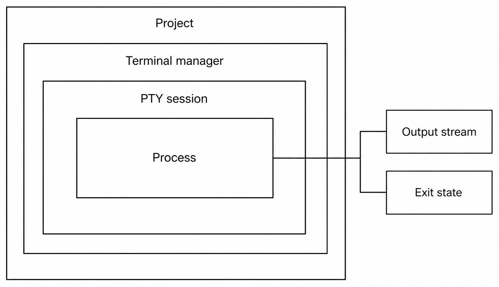
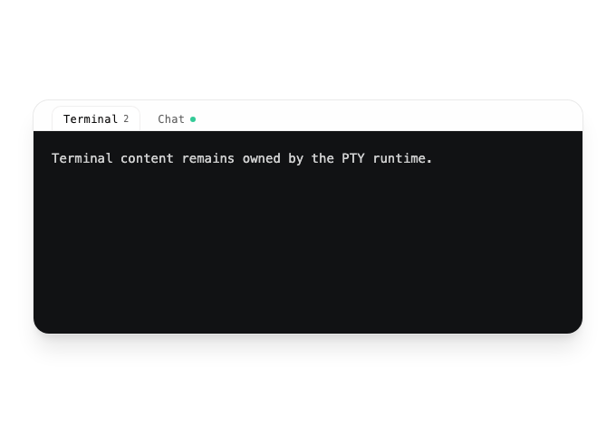
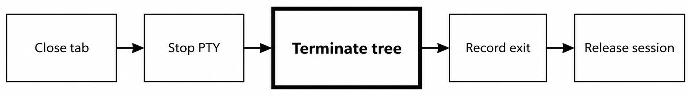
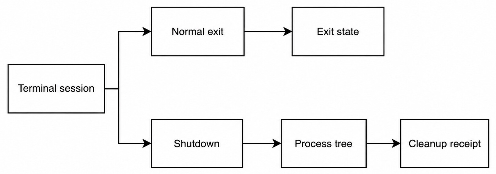

# Chapter 26 — The Integrated Terminal {#chapter-26}

## The question

The integrated terminal is not a textarea that happens to run commands. A server-side Terminal
manager owns a pseudo-terminal session, process, dimensions, output flow, exit state, and cleanup.
The Workbench owns tabs and presentation. HostGateway may authorize a command for an exact Turn,
but it does not replace the terminal manager or turn a PTY into Engine-private state.

_Figure 26.1 — Terminal presentation, PTY lifetime, child process, output, and exit evidence are
related but not interchangeable._

**Accessible equivalent.** A Project contains a Terminal manager, PTY session, and process; output and exit state are separate projections.

_Product capture — The production terminal workspace switcher exposes terminal count and Chat separately; the visual surface does not imply that transcript state owns PTY process state._

An open request names a Project or Thread context, terminal identity, shell or command, dimensions,
and environment policy. The server creates or reconnects to the managed session. Output events are
sequenced and acknowledged so an eager process cannot make the browser the unbounded owner of a
byte stream. Resize changes PTY dimensions; clear changes the visible buffer contract; restart
creates a new process lifecycle. Close must eventually clean up the process tree.

| Fact                    | Owner              | Visible projection            | Not the same as           |
| ----------------------- | ------------------ | ----------------------------- | ------------------------- |
| Tab selection           | Workbench          | Active terminal tab           | Process running state     |
| PTY session             | Terminal manager   | Starting/running/exited/error | Product Thread            |
| Process and descendants | OS through manager | Activity and exit outcome     | Engine native Session     |
| Output bytes            | PTY/manager        | Decoded terminal stream       | Durable assistant Message |
| Exit state              | Manager event      | Code/signal/error projection  | Whole Turn settlement     |

## Opening and reconnecting

Use one terminal identity for one intended interactive session. Opening an existing identity should
reconnect to its snapshot rather than spawn a duplicate shell. The snapshot records status,
dimensions, and enough stream position for presentation. A new tab gets a distinct identity even
if it starts in the same Project directory.

The starting directory is resolved by the server from Project context. Shell environment is built
through the repository's login-shell environment policy, not copied blindly from browser state.
Secrets must not be printed into activity payloads simply because they exist in a process
environment. When runtime selection is available, the selected shell or command remains an
explicit input and an unavailable executable is an error.

Output acknowledgment is important. The client acknowledges consumed output so the server can
bound buffering and apply backpressure. If the browser disconnects, the process may continue under
the manager; reconnect reads authoritative session state. If policy says the session should stop,
the manager performs cleanup rather than relying on a vanished React component.

## Input, resize, clear, restart, close

These actions sound similar in a UI, but they affect different state.

| Action  | Changes                             | Preserves                             | Failure meaning                  |
| ------- | ----------------------------------- | ------------------------------------- | -------------------------------- |
| Write   | Sends bytes to current PTY          | Session identity and process          | Input was not accepted           |
| Resize  | PTY rows and columns                | Process and output history            | Old dimensions remain            |
| Clear   | Visible/history buffer per contract | Running process                       | Command is not cancelled         |
| Restart | Process lifecycle                   | Terminal/tab identity where supported | Old process must not appear live |
| Close   | Session and process-tree lifetime   | Project files already written         | Cleanup must settle explicitly   |

Do not use Clear to stop a command. Do not use Close as a substitute for conversation rollback. Do
not infer a successful command from new prompt text alone; inspect the exit event or operation
receipt. Interactive programs may not exit until they receive EOF, a signal, or a direct command.

## Process-tree cleanup is a product obligation

Closing only the shell's first PID can leave children holding ports, files, or device handles.
Haros therefore treats cleanup as a process-tree concern. The manager stops the PTY, terminates the
tree according to platform policy, records exit, and releases the session. Server shutdown applies
the same discipline across owned sessions.

_Figure 26.2 — A closed tab is not settled until its managed process tree and session are cleaned
up._

**Accessible equivalent.** Closing a terminal stops its PTY, terminates the process tree, records exit, and releases the session.

This is especially visible with dev servers. A shell can spawn a package runner, which spawns the
actual server, which spawns a watcher. Killing the shell while leaving the watcher alive creates a
ghost server. The terminal manager's tests exercise cleanup and session removal because a blank
panel is not proof that the port was released.

| Shutdown observation   | What it proves                  | What remains to check                   |
| ---------------------- | ------------------------------- | --------------------------------------- |
| Close request accepted | Manager began close handling    | Process-tree outcome                    |
| PTY exited             | Controlling process ended       | Descendants and owned resources         |
| Exit event recorded    | Terminal lifecycle has evidence | Turn or Project-action state            |
| Session removed        | Manager no longer projects it   | External processes not owned by session |

## Normal exit and forced shutdown differ

_Figure 26.3 — Normal exit records the process outcome; shutdown additionally proves bounded
cleanup work._

**Accessible equivalent.** Normal exit records exit state; shutdown additionally targets the process tree and produces cleanup evidence.

When a command finishes normally, the manager records its exit. When the user closes a running
session or the server shuts down, the manager initiates cleanup. A timeout during cleanup is not a
normal zero exit. It should remain an error or uncertain shutdown outcome and trigger bounded
follow-up checks, not a green status.

### Worked example: diagnose a test watcher

Leo opens a terminal in a Project and runs a watcher. Output confirms an initial failed test. He
edits the file elsewhere, the watcher reruns, and emits a pass. The output is useful live evidence,
but the durable change belongs to the file and Git owners. Leo then closes the terminal. Haros sends
the close through the terminal manager, terminates the watcher tree, records exit, and releases the
session. A later new tab is a new PTY lifecycle, not continuation of the old process.

If the browser reloads before close completes, the server remains authoritative. The Workbench can
reconnect and show running or exited state. It must not create a new watcher merely because the old
tab component remounted. If shutdown reports failure, Leo can inspect the port or process using a
bounded diagnostic; he should not assume the blank terminal means cleanup succeeded.

## Failure and recovery

A missing shell fails before session readiness. Invalid dimensions are rejected by contract limits.
A write to an exited PTY must not revive it. Output decoding or transport failure should preserve
the terminal's error state and bounded bytes, not silently restart. Restart must settle the old
process before projecting the new one. Close timeout requires explicit failure and cleanup follow-up.

Recovery begins by reading the session snapshot. If the session is running, reconnect. If exited,
open a new session only when the user wants one. If error, retain the error and offer a focused
restart. Never reuse a stale process identifier or infer ownership of an external process that was
not launched by the manager.

## Check your model

1. Is a terminal tab the PTY? No; it is a client projection of a server-owned session.
2. Does Clear cancel the process? No.
3. May output success settle the whole Turn? Not by itself; Turn lifecycle is separate.
4. Why terminate a process tree? Children can outlive the controlling shell and retain resources.
5. What should reconnect do? Read authoritative session state, not spawn by default.

## Output flow, ordering, and backpressure

Terminal output can arrive faster than a browser can render it. The manager therefore needs a
bounded flow between PTY reads, event transport, and client acknowledgment. Without backpressure, a
single verbose command can consume unbounded memory or freeze the Workbench. Acknowledgment means
the client consumed a segment; it does not mean the command succeeded.

Ordering comes from the session's event stream. The browser may receive a reconnect snapshot and
new output close together, so it must merge by the contract rather than append in arrival order.
An exit event is terminal for the process lifecycle. Late buffered output may still be displayed,
but it must not revive the session to running.

| Observation                | Terminal meaning           | Incorrect inference             |
| -------------------------- | -------------------------- | ------------------------------- |
| Output acknowledged        | Client consumed bytes      | Command passed                  |
| Prompt-looking text        | Program printed characters | Shell is idle                   |
| Exit code zero             | Process reported success   | Artifacts are correct           |
| Signal exit                | Process was terminated     | User requested every child stop |
| Reconnect snapshot running | Manager still owns session | Browser kept process alive      |

Programs can write control sequences, carriage returns, and partial multibyte characters. Decoding
and terminal emulation belong to the terminal presentation stack, not assistant prose. Activity
summaries should be bounded and sanitized rather than copying arbitrary output into durable product
state. A password printed by a misconfigured command must not become a Timeline payload.

## Signals, interrupts, and conversation stop

Typing Ctrl-C sends terminal input or a signal according to PTY behavior. Closing the terminal asks
the manager to end its session. Interrupting an Agent Turn asks orchestration and the selected
Engine to stop execution. These actions may coincide when a Turn owns a terminal operation, but
their contracts remain separate.

Suppose an Agent launches a command through a HostGateway terminal tool. The user interrupts the
Turn. HostGateway cancellation should propagate to the bounded operation, and the terminal owner
settles the process outcome. The Turn then settles from authoritative Engine/orchestration events.
The UI must not mark the command exited just because it displayed “Interrupt requested.”

Conversely, a user can open a manual terminal tab unrelated to the active Turn. Interrupting the
Turn must not kill that manual session. Exact operation and session identities prevent a broad
“stop all terminals” implementation.

## Shell environment and working directory

Commands inherit a server-constructed environment and an explicit Project working directory.
Different platforms and login shells can produce different paths. A command succeeding in an
external terminal does not prove the managed environment is identical. Diagnose executable lookup,
shell choice, current directory, and relevant environment fields without dumping secrets.

Quoting matters. A command string interpreted by a shell differs from an executable plus argument
array. Avoid building commands from untrusted text. Paths containing spaces, wildcard characters,
backticks, or substitution syntax require the exact invocation mode. The terminal is powerful
precisely because it can execute arbitrary shell behavior; that is why authority and review are
necessary.

When a task only needs a typed file or Git service, prefer that service. A shell pipeline may be
appropriate for repository-defined checks, but it should not replace a safer owner merely for
convenience. For example, opening a preview through the file contract gives bounded path handling
that `open $(assistant text)` would not.

## Diagnose a server that will not stop

Start with the terminal session snapshot and its root process identity. Read the close request and
exit events. Then inspect the process-tree cleanup result. If a port remains in use, identify the
listener and verify whether it belongs to the terminal session, a Project action, or an external
program. Do not kill by port alone; the port may have been reused.

A watcher can spawn detached descendants or ask another manager to run work. The terminal manager
is responsible for descendants it owns under its platform strategy, but it cannot promise control
over a separately launched system service. Report the boundary. If cleanup timed out, state which
process remained and what evidence exists.

### Long-running command playbook

For a migration preview, build, or test watcher, decide whether the terminal or Project-action
model is appropriate. Name the session. Record the command and Project. Watch bounded output for
readiness rather than waiting for a prompt glyph. Provide a deliberate cancellation path. After
exit, verify expected artifacts or test reports through their owners.

If the command is expected to run for hours, browser presence must not be its only lifetime anchor.
Use a manager-owned background action where supported. If no such contract exists, be honest that
closing the application may stop the session. Do not market terminal persistence beyond tests.

## Terminal safety checklist

Before running a consequential command, confirm the exact Project directory, current Git status
where relevant, command/arguments, expected side effects, runtime requirements, approval state, and
recovery plan. Afterward, collect exit evidence, relevant artifacts, and current repository state.

For destructive commands, resolve targets without broad environment variables or globs. Prefer
recoverable operations. Do not expose keys in command arguments or logs. If a command output
unexpectedly contains a secret, stop copying it into the conversation and sanitize any retained
evidence.

The terminal can do almost anything the host user can do; that does not make every action an
ordinary implementation step. Publishing, deleting remote data, changing system security settings,
or high-cost network jobs still require explicit authority beyond “run this check.”

## Session identities and multiple tabs

Several terminal tabs can share a Project but must not share input accidentally. Each tab/session
identity selects its own PTY snapshot and stream. The default terminal identity is a contract
convenience, not permission to route every command into whichever terminal is visible. When a tool
operation creates a dedicated terminal, retain that identity for cancellation and receipts.

A tab can be renamed or reordered without changing the server session. A session can exit while its
tab remains available for review. Closing an exited tab releases presentation/session resources but
does not change already written files. Restoring a recent view should reconnect only when the
manager still reports the session; otherwise present the historical exit and allow an explicit new
open.

## A reproducible command record

For a development check, record Project root, command invocation mode, relevant runtime version,
start time, terminal/session identity, terminal outcome, and the artifact or test report supporting
the claim. Do not store the entire environment. This makes “works in Haros terminal” diagnosable
without leaking secrets.

If two runs differ, compare command and working directory before blaming the Engine. Then compare
runtime/executable resolution and dependencies. Then compare environment fields known to matter.
Finally compare repository state. A terminal screenshot with green text is weaker than an exit
event plus parsed test report at a known commit.

### Exercise: separate three stop operations

Run a harmless long-lived fixture in a manual terminal. Interrupt an unrelated synthetic Agent
Turn and verify the fixture remains. Then send Ctrl-C to the fixture and observe its exit. Start it
again and close the tab, verifying process-tree cleanup. The three observations demonstrate that
Turn interrupt, PTY input, and terminal close have different targets.

Use task-specific temporary directories and synthetic processes. Never perform this exercise on a
real migration, production server, or private Engine process. The expected evidence is a preserved
manual session after Turn interrupt, a signal/exit state after Ctrl-C, and a cleanup outcome after
close.

## Completion criteria for terminal work

A one-shot command is complete when the correct Project/session accepted the exact invocation, the
process reached a terminal exit, and the claimed result is supported by its artifact or test
evidence. An interactive session is ready when the manager reports running and input/output flow is
usable. A close is complete only after session/process cleanup settles.

These criteria prevent three common substitutions: prompt-looking output for readiness, exit code
for artifact correctness, and a hidden tab for cleanup. When one layer is missing, report the exact
partial result. For example: “The build process exited zero, but the expected bundle was not found”
is a failure of the overall task even though terminal execution itself completed.

On handoff, include the exact terminal identity when it remains live. A later Turn can then inspect
or close the right session without guessing from tab order. If the session is terminal, retain its
exit evidence but open a new PTY for new work rather than writing to a dead process.

## Source trail

- `packages/contracts/src/terminal.ts` defines terminal inputs, snapshots, limits, statuses, and events.
- `apps/server/src/terminal/Layers/Manager.ts` owns PTY sessions, output flow, restart, close, and cleanup.
- `apps/server/src/terminal/Layers/Manager.integration.test.ts` proves lifecycle and process-tree behavior.
- `apps/server/src/serverShutdown.ts` coordinates server-owned resource shutdown.

<!-- guide-navigation:start -->

[Guidebook contents](../README.md) · [Previous: Files, Search, Preview, and Editors](25-files-search-preview-editors.md) · [Next: Git Status, Branches, and Checkpoints](27-git-branches-checkpoints.md)

<!-- guide-navigation:end -->
