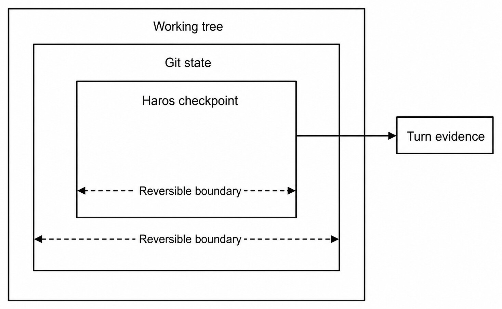
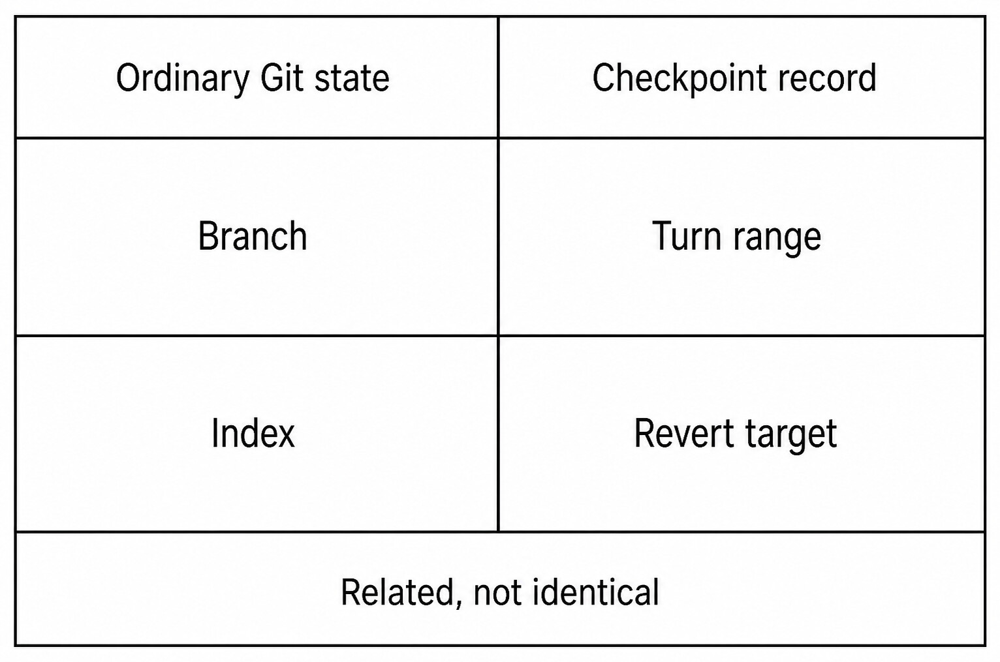

# Chapter 27 — Git Status, Branches, and Checkpoints {#chapter-27}

## The question

The working tree is what exists on disk. Git state describes tracked, staged, untracked, branch,
HEAD, and remote relationships. A Haros checkpoint associates a reversible boundary with product
Turn evidence. They overlap, but none can replace the others.

_Figure 27.1 — A checkpoint is a Turn-linked reversible boundary over repository state, not a new
definition of Git._

**Accessible equivalent.** A Haros checkpoint is related to Git and working-tree state while retaining a Turn-linked reversible boundary.

Git services own repository interrogation and mutation. The Web consumes a typed status projection
and may cache it briefly for responsiveness, but the cache is not truth after files change. The
checkpoint store owns checkpoint records and restoration data. Orchestration owns which Turn range
is associated with a revert. HostGateway authorizes bounded Git operations for the exact Turn.

| Question                         | Read from                                   | Why                                   |
| -------------------------------- | ------------------------------------------- | ------------------------------------- |
| What files differ now?           | Fresh Git status/diff                       | Working tree may change outside Haros |
| Which branch is checked out?     | Git repository state                        | Toolbar text can be stale             |
| What did this Turn change?       | Turn diff/checkpoint evidence               | Repository status includes other work |
| Can this checkpoint be reverted? | Checkpoint store plus current preconditions | A record may no longer apply cleanly  |
| Is the work committed?           | Git HEAD/index                              | A completed Turn is not a commit      |

## Read status without erasing context

A useful status separates staged, unstaged, untracked, conflicts, and branch information. Do not
compress all non-clean state into “modified.” An untracked generated file has different recovery
choices from an edited tracked file. A conflicted index cannot be treated as an ordinary diff. A
detached HEAD is not a branch name.

Before changing branches or restoring files, refresh status. Preserve unknown modifications. The
fact that Haros did not create a change does not make it disposable. If the task owns only one file,
stage or restore only that path. Broad reset and checkout commands require exact targets and
authority because their blast radius extends beyond a conversational intent.

| Status class | Meaning                       | Safe next question                    | Dangerous assumption        |
| ------------ | ----------------------------- | ------------------------------------- | --------------------------- |
| Staged       | Index differs from HEAD       | Is this intended for the next commit? | Worktree matches index      |
| Unstaged     | Worktree differs from index   | Who owns the modification?            | Haros may overwrite it      |
| Untracked    | File is outside Git history   | Is it task output or user data?       | Safe to delete              |
| Conflict     | Index has unresolved stages   | Which resolution is intended?         | Ordinary edit can settle it |
| Detached     | HEAD is not on a local branch | What target/ref is intended?          | Invent a branch name        |

## Branch operations are real repository mutations

Creating or switching a branch changes repository state and possibly the working tree. A toolbar
button is only an initiator. GitCore or GitManager performs the operation, checks preconditions, and
returns the result. Haros should not claim a branch switch until a fresh Git read confirms it.

If local changes would be overwritten, stop and explain. Do not silently stash, commit, or discard
them. If an exact new branch name is requested and repository policy permits creation, create from
the explicit base. If the branch exists, switch to it rather than creating an alias. Haros's default
branch prefix is a workflow convention, not permission to make branches for a read-only request.

## Checkpoints bind reversibility to a Turn

A checkpoint captures enough repository/workspace information to reason about reversing a bounded
change. It is not necessarily a public Git commit and must not be presented as one. Its value is
product context: which Turn produced a diff, what range is eligible, and what target a revert would
restore.

_Figure 27.2 — Git state and checkpoint records are related evidence with different owners and
different lifetimes._

**Accessible equivalent.** Ordinary Git branch/index state and a Haros checkpoint Turn range/revert target are related but not identical facts.

Checkpoints are especially useful when several Turns build on one another. Reverting an earlier
Turn may require rolling back a later Turn range or refusing because the current repository no
longer matches safe preconditions. The checkpoint service must inspect current state. It cannot
apply an old snapshot blindly over user changes.

| Property           | Ordinary Git fact             | Checkpoint fact                      |
| ------------------ | ----------------------------- | ------------------------------------ |
| Identity           | Ref, object, index, path      | Product checkpoint ID                |
| Scope              | Repository-wide/path-specific | Turn-linked change boundary          |
| Persistence        | Git database and files        | Haros checkpoint store               |
| Restore operation  | Git command semantics         | Validated checkpoint revert workflow |
| User-visible claim | Current repository state      | Reversible product milestone         |

### Worked example: preserve a colleague's edit

Mina asks Haros to fix one parser test. Status already shows an unstaged change to documentation
that she made manually. The Agent changes the parser and test only. A fresh status now contains both
the pre-existing documentation edit and the task's files. Turn diff evidence and a checkpoint let
Haros attribute the parser work without claiming ownership of the documentation.

Mina later requests “undo the parser fix.” The revert workflow resolves the eligible checkpoint and
current Turn range. It verifies that the parser files still match expected descendants. If another
manual edit overlaps them, Haros refuses or asks for a decision. It never resets the entire working
tree, because that would delete unrelated work while pretending to satisfy a narrow request.

## Status cache and refresh

Status computation can be expensive, so presentation may cache and invalidate. File writes, Git
mutations, external editor changes, and watcher events can all make it stale. Treat refresh as part
of any high-consequence claim. “Clean” should mean a current successful query returned no relevant
changes, not that the last known cache row was green.

Failure to read status is not a clean repository. A non-repository directory is not an empty Git
repository. A missing Git executable or permission failure must remain diagnostic evidence. Branch
controls should degrade rather than invent defaults.

## Failure and recovery

If status fails, preserve the last projection but label it stale or unavailable. If a branch switch
is refused, keep the current branch and working tree. If checkpoint creation fails, the Turn may
still have changed files; report the missing reversible boundary. If revert preconditions fail,
leave current files intact. Recovery starts with a fresh status/diff and exact checkpoint lookup.

Do not “recover” by creating a commit, stash, or backup branch without user intent. Those are new
Git facts with their own ownership and cleanup costs. The safest recovery is usually to narrow the
target and re-establish current state.

## Check your model

1. Is every checkpoint a Git commit? No.
2. Does completed Turn mean clean Git state? No.
3. May a status cache authorize destructive Git work? No; refresh first.
4. What protects unrelated changes? Exact path/Turn attribution and precondition checks.
5. If revert cannot prove safety, what happens? Refuse while preserving current files.

## Attribute changes before acting on them

A repository status describes all observed changes, not who made them. Attribution comes from
additional evidence: state before the Turn, operation receipts, Turn diff, checkpoint records, and the
current repository state. This evidence can support “this Turn changed these paths,” but it should not
erase uncertainty when another actor wrote concurrently.

Build a before/after record for focused work. Capture fresh status before mutation. Perform the
bounded edits. Capture a Turn diff and fresh status afterward. Compare paths and content, not only
counts. If an external formatter changes additional files during the same interval, investigate
instead of automatically including them in the checkpoint.

| Attribution signal                      | Strength                   | Limitation                            |
| --------------------------------------- | -------------------------- | ------------------------------------- |
| File absent before, write receipt after | Strong for creation        | Another writer may modify later       |
| Turn diff path                          | Strong product association | Depends on checkpoint/diff completion |
| Git status after Turn                   | Current repository fact    | Includes unrelated work               |
| Assistant says “I changed it”           | Weak claim                 | May be mistaken or incomplete         |
| Commit author/time                      | Git history evidence       | Commit can aggregate several actors   |

This discipline also improves review. A reviewer can separate task files from pre-existing changes,
stage only intended paths, and explain what remains uncommitted. It prevents “cleaning up” the user's
unrelated work just to produce a simple status.

## Branch topology and remote tracking

A local branch, its upstream, and a remote branch are separate refs. `main` locally may lag or lead
`origin/main`. A new branch may have no upstream. Detached HEAD may point to a valid commit without
a local branch. The branch control surface should present these facts accurately.

Before comparing or creating a branch from a base, decide whether the local or remote-tracking ref
is intended and whether fetching is authorized. A fetch is a remote operation that updates refs; a
read-only local diagnosis does not necessarily authorize it. If freshness matters and fetch cannot
run, state that the remote comparison may be stale.

Switching branches with uncommitted changes can carry edits across or be refused. Neither outcome
should be guessed. Git determines safety. Haros must preserve the exact error and current ref, then
let the user decide whether to commit, stash, move, or abandon changes. It must not create a hidden
stash as a compatibility trick.

## Checkpoint eligibility and conflicts

Checkpoint revert is strongest when current state descends predictably from the captured boundary.
Later non-overlapping changes may be preserved by a careful restore; overlapping changes can make
automatic reversal unsafe. Eligibility is a current computation, not a permanent property stamped
on the checkpoint at creation.

Consider checkpoint C1 after Turn 10 changed `parser.ts`. Turn 11 changes `README.md`. A request to
revert C1 might safely restore the parser while keeping the README if the checkpoint implementation
and current evidence support a bounded Turn range. If the user manually edits the same parser
function after Turn 11, the old replacement may destroy that work. Refusal is the truthful outcome.

Checkpoint storage also has failure modes: missing metadata, unavailable restore material, or a
record belonging to another Thread. Cross-Thread application is not allowed merely because paths
match. Product identity and repository preconditions both matter.

## Review and commit without broadening scope

When the user authorizes a commit, refresh status, inspect the exact diff, and stage only relevant
paths. Respect repository hooks and signing policy. A commit message should describe the change,
not claim tests or release status that were not proved. A successful commit does not push.

If hooks modify files, refresh diff and decide whether those modifications belong in the commit.
If a hook fails, preserve the index and working tree; do not bypass it unless the user and repository
policy authorize that. If Git identity is missing, report setup requirements without inventing an
author.

This chapter focuses on status, branches, and checkpoints rather than a full commit tutorial, but
the owner boundary is the same: Git creates Git facts, while Product Turns provide context and
evidence. The Timeline can say which Turn requested a commit; `git log` proves which commit exists.

## Recovery scenarios

### Stale clean badge

An external editor saves after the last cached status. A commit control still appears disabled.
Invalidate and refresh status from Git. Do not ask the user to touch the file again. The bug is a
projection freshness issue, not missing repository state.

### Branch switch partially perceived

The server switches successfully, but the Web disconnects before receiving the event. On reconnect,
query the repository's current branch and status. Do not replay the switch from the old client
intent; doing so could toggle or reapply work unexpectedly.

### Revert refused after manual edit

Show the overlapping current diff, checkpoint target, and preservation outcome. Offer choices such
as manual reverse patch or a new focused edit. Do not label refusal as a failed rollback that left
the repository “corrupt.” Preservation is the safety behavior.

### Checkpoint missing

The absence of a checkpoint means Haros cannot promise automatic restoration. Git history or a
current diff may still support a manual inverse, but that is a new edit requiring review. Do not
fabricate a checkpoint from assistant prose.

## Repository-state checklist

Before any branch or revert mutation, answer: Is this a Git repository? What is HEAD? Which branch
or detached ref? What is staged, unstaged, untracked, or conflicted? Which changes predate the Turn?
Which remote operation, if any, is intended? What checkpoint and Turn range apply? What will be
preserved on refusal?

After mutation, query the same facts again. A command receipt shows the operation returned; fresh
state shows the repository outcome. If the two disagree, retain both and diagnose rather than
forcing the projection to match the request.

## Checkpoint retention and portability

A checkpoint belongs to the repository/workspace and Product Thread context in which it was
created. It is not a portable patch format or a universal backup. Moving the Project, rewriting Git
history, deleting restore material, or changing paths can make it ineligible. The product should
report that limitation rather than attempt fuzzy matching.

Retention policy may remove old checkpoint material while durable conversation history remains.
The Timeline can still say a Turn changed files even if automatic revert is no longer available.
Do not promise indefinite undo unless the repository implements and tests that retention.

For long-lived work, ordinary Git commits provide durable repository history, while checkpoints
provide product-linked recovery during active work. Using both is appropriate: checkpoints help
review and bounded reversal; focused commits create shareable Git facts. Neither should secretly
replace the other.

## Exercise: distinguish four “clean” states

Create a synthetic repository fixture. Observe a completely clean status. Add an untracked file;
commit a tracked edit while leaving the untracked file; stage another edit; then create a checkpoint
for a later Turn. At each stage, describe Git state and checkpoint state separately.

The repository after the commit is not clean because the untracked file remains. After staging, the
index and working tree relationships differ. The checkpoint can be valid even while the repository
contains other changes, but safe revert depends on attribution and overlap. This exercise teaches
why one green icon cannot represent all four facts.

Use only temporary fixture data. Do not create or revert checkpoints against a real user's private
Engine state or unrelated working tree. The observable result is a table of HEAD, branch, staged,
unstaged, untracked, and eligible checkpoint facts at each step.

## Reporting a safe handoff

When ending work, report the current branch/ref, intended changed paths, pre-existing or unrelated
changes, staged state, commits created if authorized, checks run, checkpoint/revert availability,
and any remote state. This lets the next reader continue without rerunning risky operations.

Avoid “Git is clean” unless a fresh status proves it. Avoid “easy to undo” unless a current
checkpoint eligibility check supports it. Avoid “ready to push” when remote tracking or policy has
not been evaluated.

## Completion criteria for repository work

A status request is complete after a fresh successful repository query with each change class
preserved. A branch mutation is complete after Git reports success and a fresh read confirms the
intended ref and working tree. A checkpoint is complete after its record and Turn association exist;
a checkpoint revert is complete only after restore outcome and current state agree.

Use those criteria in summaries. “Switched to `feature-x`; pre-existing untracked notes remain” is
more useful than “branch ready.” “Checkpoint created for Turn 12; no commit created” prevents a
reviewer from searching Git history for a product-only fact. “Revert refused because current edits
overlap; files preserved” describes successful safety behavior rather than generic failure.

If the next action is a commit or PR, carry forward exact status, not the earlier Turn's narrative.
The repository can change between chapters, Threads, and tools. Fresh evidence is cheap compared
with recovering overwritten work.

## Source trail

- `apps/server/src/git/Layers/GitCore.ts` owns low-level repository operations.
- `apps/server/src/git/Layers/GitManager.ts` coordinates status, branches, and higher-level Git work.
- `apps/server/src/checkpointing/Services/CheckpointStore.ts` owns checkpoint records and restore material.
- `packages/contracts/src/orchestration.ts` defines Turn diff, checkpoint rows, and revert commands/events.

<!-- guide-navigation:start -->

[Guidebook contents](../README.md) · [Previous: The Integrated Terminal](26-integrated-terminal.md) · [Next: Diffs, Rollback, and Edit-and-Resend](28-diffs-rollback-edit-resend.md)

<!-- guide-navigation:end -->
