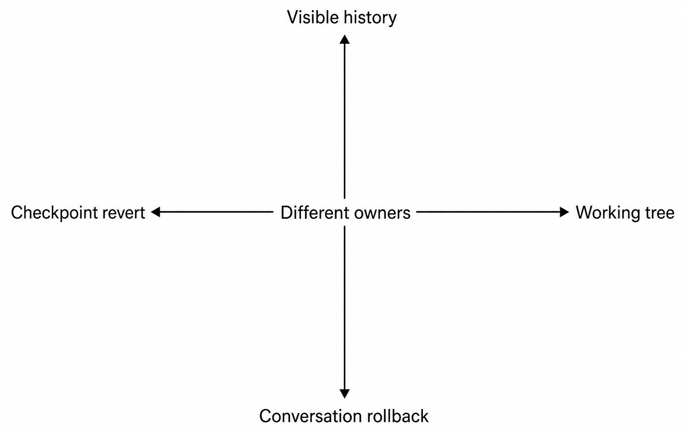
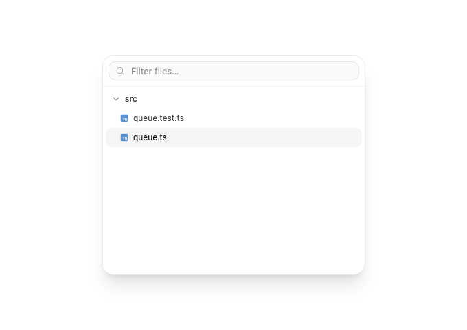
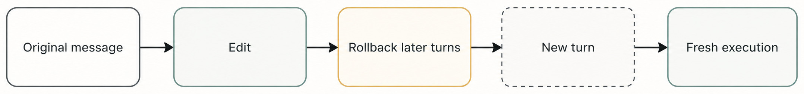
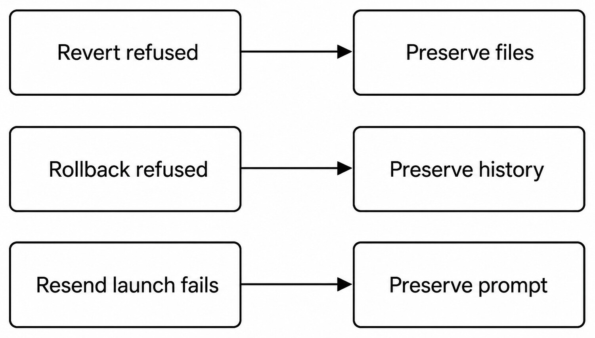

# Chapter 28 — Diffs, Rollback, and Edit-and-Resend {#chapter-28}

## The question

A file diff describes repository or workspace changes. A checkpoint revert changes file state. A
conversation rollback changes visible product history and Turn lineage. Edit-and-resend rolls back
later conversation work, substitutes an edited user message, and admits fresh execution. These are
separate operations because files and conversation history have separate owners.

_Figure 28.1 — File-state reversal and product-history rollback are independent axes._

**Accessible equivalent.** Checkpoint revert changes file state, while conversation rollback changes visible product history; they have different owners.

_Product capture — The real review file tree identifies the bounded files in a diff without treating that view as either a Git checkpoint or a conversation rollback._

The first diagnostic question is “What do you want to undo?” If the answer is “the code change,”
inspect diff/checkpoint evidence. If it is “everything after my earlier message,” inspect
conversation rollback. If it is “correct that earlier instruction and try again,” use
edit-and-resend. Never apply all three merely because the UI uses similar arrows.

| Operation             | Primary target                            | Owner                               | Creates new execution? | Files necessarily change?   |
| --------------------- | ----------------------------------------- | ----------------------------------- | ---------------------- | --------------------------- |
| View diff             | Evidence only                             | Git/checkpoint projection           | No                     | No                          |
| Checkpoint revert     | Workspace/Git state                       | Checkpoint and Git services         | Not by itself          | Yes, if successful          |
| Conversation rollback | Product history after boundary            | Orchestration                       | No                     | No                          |
| Edit-and-resend       | Earlier user message and later Turn range | Orchestration plus Engine admission | Yes                    | Only if new Turn edits them |

## Read diffs as evidence, not decoration

A Turn diff helps attribute changed paths and ranges to bounded work. Git diff shows current
relationships among HEAD, index, and working tree. They can diverge after later edits. Before a
revert, use the exact diff appropriate to the question. A pretty client-side diff must not become a
second mutable source of file truth.

Review additions and deletions in context. Renames, binary files, line-ending normalization, and
generated output need explicit interpretation. A large deletion can be intentional; a one-line
change can be dangerous. Size is not authority. If a diff includes unknown user changes, separate
them before proposing reversal.

## Checkpoint revert

The `thread.checkpoint.revert` command names a Thread and checkpoint boundary. The decider verifies
that the checkpoint belongs to the Thread and determines the affected Turn range. Execution applies
the restore through the real workspace/Git owner, then orchestration records completion. A request
event is not the same as a completed revert.

Preconditions matter. The current workspace may contain edits made after the checkpoint, including
outside Haros. If a safe revert cannot be established, refusal is correct. The product should keep
the files and explain the conflict rather than forcing an old snapshot over new work.

## Conversation rollback

Conversation rollback removes or hides product history after an exact boundary according to the
orchestration contract. It does not reach into an Engine's private native Session, it does not
rewrite Git, and it does not claim external side effects were reversed. It updates the Product
Thread projection and settles related pending state through server-owned events.

This is useful when later Turns are no longer meaningful, but it is not a time machine. A remote
email already sent or a file already copied outside the Project remains an external fact unless its
real owner performs a compensating action. Published Guidebook examples must state that boundary.

| Rollback consequence         | Product history                                 | Workspace         | External service        |
| ---------------------------- | ----------------------------------------------- | ----------------- | ----------------------- |
| Conversation rollback        | Later visible Turns removed/marked per contract | Unchanged         | Unchanged               |
| Checkpoint revert            | Turn history records revert outcome             | Restored if safe  | Unchanged               |
| Compensating external action | Records new activity                            | Usually unchanged | Service-specific change |

## Edit-and-resend creates a new Turn

_Figure 28.2 — Editing a historical message does not mutate an old execution; it establishes a new
admission boundary._

**Accessible equivalent.** Edit-and-resend rolls back later conversation Turns and creates a new Turn with fresh execution.

The shared conversation-edit logic identifies the editable user message and the later range that
would become invalid. The command carries the replacement content and an exact admitted Engine,
model, options, runtime mode, and interaction mode for the new work. The server first validates the
history boundary, then records rollback and admits a new Turn. It must not splice new text into an
old native Engine Session and call that replay.

If the edited message is the same text, the lifecycle is still a new request only when the command
is admitted. If admission fails, preserve the corrected prompt so the user can retry. If rollback
fails, do not start new execution against ambiguous history.

### Worked example: correct the requested target

Omar asked, “Update parser A,” and two Turns later realizes he meant parser B. The first Turn edited
files for A; the second ran tests. Edit-and-resend answers the conversation question: replace the
earlier instruction, roll back later product history, and start a new Turn for B. It does not by
itself restore A's files. Omar must also inspect the checkpoint/diff and request a safe file revert.

If A's changes were already pushed, neither conversation rollback nor local checkpoint revert
removes the remote commit. A separate Git or hosting action is needed, with its own evidence. This
worked example is deliberately uncomfortable because it prevents the UI word “undo” from hiding
three owners.

## Refusal preserves the relevant truth

_Figure 28.3 — Failure is conservative: do not partially erase the state the operation could not
safely replace._

**Accessible equivalent.** Refused or failed rollback operations preserve the files, history, or prompt they could not safely replace.

| Failure                     | Preserve                            | Do not do                   | Next evidence                 |
| --------------------------- | ----------------------------------- | --------------------------- | ----------------------------- |
| Revert precondition fails   | Current files and checkpoint record | Force overwrite             | Fresh status/diff             |
| Rollback boundary invalid   | Product history                     | Delete messages locally     | Authoritative Thread snapshot |
| New launch fails            | Edited prompt and Queue             | Fall back to another Engine | Exact admission error         |
| External compensation fails | External current state              | Claim side effect reversed  | Service receipt/state         |

## Recovery sequence

Name the intended axis. Refresh its canonical state. Validate the exact boundary. Apply one
operation. Read the resulting state. If another axis also needs change, perform it explicitly and
record a separate outcome. This sequence may feel slower than a global Undo button, but it avoids
the much larger cost of erasing unrelated user work or inventing external rollback.

For file recovery, inspect status and checkpoint eligibility. For conversation recovery, reload
the authoritative Thread and boundary message. For resend recovery, preserve the replacement
prompt and submitted binding. For remote effects, query the remote owner and choose a compensating
action rather than pretending history deletion reversed reality.

## Check your model

1. Does conversation rollback revert files? No.
2. Does checkpoint revert delete later Messages? No.
3. Is edit-and-resend continuation of the old native Session? No; it creates a new admitted Turn.
4. What happens when safety cannot be proved? Refuse and preserve current state.
5. Can local rollback reverse a pushed commit automatically? No.

## Preflight each reversal

Before checkpoint revert, identify the checkpoint, current workspace, affected paths, Turn range,
and later overlapping changes. Before conversation rollback, identify the boundary message/Turn,
pending interactions, Queue entries, and later history. Before edit-and-resend, validate the edited
message, replacement content, rollback range, and new exact Engine/model binding.

This preflight prevents partial semantic rollback. For example, admitting a new Turn before the
history rollback commits could produce work against messages the product later removes. Applying a
file restore before confirming the checkpoint belongs to the Thread could overwrite unrelated
state. Ordering is part of correctness.

| Preflight fact        | Checkpoint revert                  | Conversation rollback        | Edit-and-resend            |
| --------------------- | ---------------------------------- | ---------------------------- | -------------------------- |
| Exact boundary        | Checkpoint ID/Turn range           | Message or Turn boundary     | Editable user Message      |
| Current preconditions | Workspace/Git state                | Authoritative Thread state   | Both history and admission |
| Preserved on refusal  | Files                              | Messages/history             | Replacement prompt         |
| Terminal proof        | Revert-complete plus current files | Rollback-complete projection | New Turn admitted/settled  |

## Pending work complicates rollback

A later Turn may be queued, running, awaiting approval, or already settled. Rolling history back
across live work requires stop-first semantics and authoritative settlement. Deleting a client row
does not cancel its Engine operation. The server must resolve or refuse the boundary while preserving
the new request.

Queued work after the rollback boundary cannot remain eligible to execute against removed history.
It should be cancelled or reconciled by the orchestration owner. A pending approval tied to a
removed Turn must not survive as a clickable action. A running Turn may require interruption and
terminal confirmation before rollback completes.

If stop is uncertain, the safe response is to wait, escalate to Session stop according to policy,
or refuse. Starting edited execution in parallel would create two competing courses and make file
attribution unreliable.

## Diff direction and review traps

A diff always compares two sides. “Added” and “deleted” reverse when the comparison order reverses.
Before generating an inverse patch, confirm base and target. A Turn diff may describe changes from
before to after that Turn, while a current Git diff describes HEAD/index/worktree now. Later edits
can mean the inverse of the old Turn diff no longer applies.

Rename detection is heuristic presentation over underlying content and paths. Binary diffs often
lack line-level reversal. File-mode changes, symlink targets, and line endings can be the essential
change even when text is identical. A rollback tool must use canonical file/checkpoint evidence,
not reconstruct state from a colored HTML diff.

Review generated inverse changes like any other mutation. Confirm intended paths, preserve unknown
work, and validate resulting behavior. “Undo” does not waive testing.

## Edit-and-resend identity and provenance

The replacement Turn receives a new identity and its own provenance. The prior Turn's Engine/model
selection remains historical fact even if its visible history is rolled back according to the
product contract. The replacement uses the exact new binding submitted with edit-and-resend; it
must not inherit the current picker accidentally or silently fall back.

Attachments and references need careful treatment. If the original message referenced an admitted
attachment, replacement semantics must follow the implemented contract. It cannot assume an
expired external preview grant or reuse a temporary file that no longer exists. When context cannot
be reconstructed safely, preserve the edited prompt and ask for the attachment again.

The assistant answer from the old course is not training data for the new Turn by default. Product
history selection determines visible context; native Engine Session continuity is not fabricated.
This is fresh execution, which can reach a different result even with similar text.

## External effects require compensation

Suppose the old Turn created a GitHub issue, sent a message, or uploaded an artifact. Conversation
rollback can remove later Product Messages from the active history, and checkpoint revert can
restore local files, but the remote object remains. The correct response is to query its owner and
consider a compensating close, delete, correction, or follow-up if authorized.

Compensation creates new history; it is not erasure. Record its receipt and preserve the original
effect for audit. If deletion is unavailable or destructive authority was not granted, explain the
remaining external state. Never hide it because the local Thread looks rolled back.

## Multi-axis recovery example

Priya asks an Agent to rename a package and publish a draft PR. The Agent changes files, commits,
pushes, and creates the PR. Priya edits the earlier request to use a different package name and
chooses resend. A truthful recovery has at least four decisions.

First, stop and roll back later Product Thread history at the valid boundary. Second, preserve and
admit the corrected prompt as a new Turn. Third, inspect the local checkpoint and safely reverse the
old package changes without deleting unrelated work. Fourth, inspect the remote branch/PR and ask
whether Priya wants a compensating close or update. No single Undo operation owns all four facts.

If the remote CLI is unavailable during compensation, keep the local recovery and report the PR as
unresolved remote state. If checkpoint restore is unsafe, preserve files while the corrected Turn
can be paused. Partial truth is better than a fabricated globally consistent rollback.

## Revalidation after rollback

After file revert, refresh Git status, read affected files, and run the focused check that establishes
the old behavior is restored. After conversation rollback, reload the Thread snapshot, inspect Queue
and pending interactions, and confirm later entries are settled according to events. After
edit-and-resend, verify the new Turn's provenance and eventual terminal state.

Do not validate one axis with another: a clean working tree cannot prove messages rolled back; a
Thread with fewer Messages cannot prove remote effects disappeared; a completed replacement Turn
cannot prove its file writes succeeded without receipts and current state.

## Product-history audit after editing

An edited historical message should remain explainable. The product records the edit/resend request,
rollback event, and new Turn provenance rather than quietly replacing database text. Presentation
can show the current active course while retaining enough event evidence for recovery and
diagnosis.

Markers, pins, notes, or goals that referred to rolled-back content may require separate behavior.
Do not assume conversation rollback deletes every related product object. Inspect their specific
contracts. Likewise, attachments retained by storage are not necessarily visible in the new Turn;
context admission decides.

If a user later asks why a result changed, compare original and replacement Message identity,
rollback boundary, admitted Engine/model, capability receipts, and resulting files. This evidence
is stronger than comparing assistant wording alone.

## Exercise: reverse one axis at a time

In a synthetic repository Thread, create Turn A that changes one file and Turn B that only explains
the change. First perform a conversation rollback of B and confirm the file remains. Restore the
fixture, then checkpoint-revert A and confirm the Messages remain with a revert outcome. Finally use
edit-and-resend on A and verify a new Turn identity appears.

The exercise should never use a real user's repository or Engine-private Session. Its purpose is to
observe owner boundaries: fewer visible later Messages after conversation rollback, restored bytes
after checkpoint revert, and new provenance after resend. If the fixture cannot prove one
observation, mark it unavailable instead of narrating success.

## Choosing a manual inverse

When an automatic checkpoint revert is unavailable but the desired change is clear, a focused
manual inverse may be safer. Treat it as a new edit: read current files, construct the smallest
change, review the diff, and validate. Do not label it “restoring the checkpoint” because it lacks
the same proof and may preserve later work deliberately.

For Git commits already shared, a new revert commit can provide transparent history. Resetting or
rewriting shared history is a different, higher-risk operation. For external services, a correcting
comment or close action may preserve audit better than deletion. The correct inverse depends on the
owner and collaboration context.

## Completion criteria for every axis

For a diff review, completion means the comparison sides and current relevance are identified. For
checkpoint revert, it means the file owner reports restoration and current files/status confirm it.
For conversation rollback, it means the authoritative Thread projection reflects the event and no
removed queued or pending work remains active. For edit-and-resend, it means the replacement prompt
is preserved and a new exact-binding Turn is admitted or explicitly fails.

Do not summarize a multi-axis request with one boolean. Report each axis: Product history, local
files, Git/remote state, and external effects. “History rolled back; local revert refused; PR still
open; corrected prompt preserved” may be an uncomfortable result, but it tells the user exactly
what remains. The alternative—“undo failed”—does not support a safe next action.

This structured result also makes retry bounded. Retry only the failed axis after refreshing its
owner. Never replay successful rollback operations merely to reproduce one missing receipt.

## Source trail

- `packages/contracts/src/orchestration.ts` defines checkpoint-revert, conversation-rollback, and edit-resend commands and events.
- `packages/shared/src/conversationEdit.ts` computes editable-message and rollback boundaries.
- `apps/server/src/orchestration/decider.checkpointRevert.test.ts` proves checkpoint validation and Turn ranges.
- `apps/server/src/orchestration/orchestrationAdmission.ts` controls fresh execution admission.

<!-- guide-navigation:start -->

[Guidebook contents](../README.md) · [Previous: Git Status, Branches, and Checkpoints](27-git-branches-checkpoints.md) · [Next: Pull Requests](29-pull-requests.md)

<!-- guide-navigation:end -->
