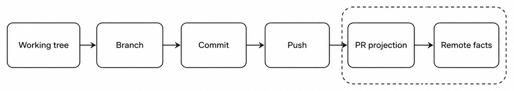
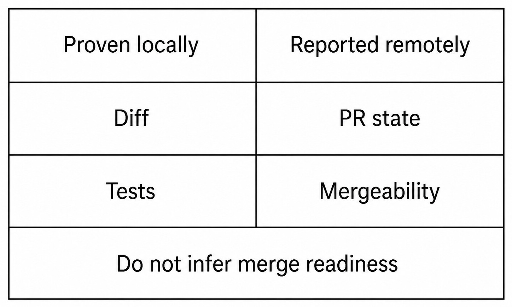

# Chapter 29 — Pull Requests {#chapter-29}

## The question

Haros can connect local repository work to a GitHub pull-request projection, but each step crosses
a real boundary. A working tree becomes a branch and commit only through Git operations. A commit
becomes remote only after push. Pull-request fields come from the hosting service through the
GitHub CLI boundary. A local diff cannot manufacture remote state.

_Figure 29.1 — Local work and remote PR facts meet through explicit Git and GitHub boundaries._

**Accessible equivalent.** Local work becomes a remote pull-request projection only after branch, commit, and push boundaries; remote facts remain distinct.

The GitHub CLI service owns command invocation, authentication diagnostics, bounded parsing, and
failure translation. GitCore owns local repository facts. The Workbench renders typed results. It
must not scrape terminal output or infer a PR number from a branch name.

| Claim                 | Required evidence                              | Insufficient evidence         |
| --------------------- | ---------------------------------------------- | ----------------------------- |
| Changes exist locally | Fresh status/diff                              | Assistant summary             |
| Commit exists         | Git object/HEAD                                | Saved files                   |
| Branch is pushed      | Remote/ref evidence                            | Local branch name             |
| PR exists             | GitHub CLI/API projection                      | A URL guessed from repository |
| Checks passed         | Reported check runs at observed revision       | Local test only               |
| PR is mergeable       | Remote mergeability field and current revision | Green-looking diff            |

## Establish the repository and remote

Before showing PR information, resolve the repository, current branch, remote hosting identity, and
CLI availability. A directory can be a Git repository without a GitHub remote. A GitHub remote can
exist while the CLI is unauthenticated. Multiple remotes can point to different repositories. Each
case needs an explicit state rather than a generic “no PR.”

Authentication belongs to the CLI/service boundary. Credentials never enter the Web projection.
An authentication failure should point the user to the relevant setup without printing tokens or
raw private endpoints. Haros source alpha does not imply that every repository or hosting workflow
is supported.

## From local change to PR

A truthful workflow is: refresh status, review diff, run relevant checks, create or choose a branch,
commit the intended paths, push the exact branch, then create or locate the PR. Each mutation needs
user intent and each result needs evidence. Do not commit unrelated work merely to make the PR
button available.

The PR title and body can be generated from source evidence, templates, and user text, but generated
copy remains a proposal until submitted. Template detection must respect repository files and not
invent checklist completion. Statistics such as additions, deletions, or changed files come from
the remote projection or exact local comparison appropriate to the view.

| Stage     | Local mutation                   | Remote mutation        | Refusal condition                         |
| --------- | -------------------------------- | ---------------------- | ----------------------------------------- |
| Review    | None                             | None                   | Status unavailable or scope unclear       |
| Branch    | Ref/working tree may change      | None                   | Unknown changes would be overwritten      |
| Commit    | Creates Git object and moves ref | None                   | Paths/message not authorized              |
| Push      | Updates remote ref               | Yes                    | Auth, policy, or non-fast-forward failure |
| Create PR | None beyond metadata cache       | Creates hosting object | Missing upstream/base or CLI failure      |

## Read PR state without overclaiming

PR state includes identity, title, author, base/head, draft state, checks, review status, statistics,
and mergeability where available. These fields update at different times. “Open” does not mean
“mergeable.” “Mergeable” does not mean “approved.” “Checks green” does not mean the local working
tree is clean or that the displayed revision is current.

_Figure 29.2 — Local proof and remote hosting facts remain separate inputs to a readiness decision._

**Accessible equivalent.** Local diff and test evidence do not by themselves prove remote PR state, mergeability, or merge readiness.

Mergeability is especially subtle. Hosting services can return unknown while they compute, false
because of conflicts, or true while required reviews are absent. Haros should display the observed
field and its time/revision, not collapse it into a universal green light. Repository policy,
required checks, review rules, and human approval still apply.

## GitHub CLI failure is not repository failure

If `gh` is unavailable, local Git can still work. If authentication expires, the working tree and
commits remain. If a PR query fails, preserve the last known projection as stale rather than
deleting it or showing “closed.” If push fails, do not create a PR against an unpushed guess.

| Failure              | Preserve                         | Accurate statement          | Recovery                               |
| -------------------- | -------------------------------- | --------------------------- | -------------------------------------- |
| CLI missing          | Local repo and work              | PR integration unavailable  | Install/configure supported CLI        |
| Auth required        | Local and public-safe projection | Remote query not authorized | Authenticate outside Web secrets       |
| Push rejected        | Local commits                    | Remote ref not updated      | Fetch/reconcile with user intent       |
| PR query timeout     | Last projection, marked stale    | Current PR state unknown    | Retry bounded query                    |
| Mergeability unknown | Other remote fields              | Readiness unproven          | Wait/requery, inspect checks/conflicts |

### Worked example: a green local test and a blocked PR

Rhea fixes a parser and runs the focused unit suite successfully. Status and diff show only intended
files. She commits and pushes. The PR projection reports an open PR with the new head revision, but
mergeability is unknown and one required remote check is pending. Haros can say “local focused
tests passed” and “the remote PR exists at this head.” It cannot say “ready to merge.”

Later the check passes, but a required review is still missing. Again, remote evidence is more
complete, yet policy has not been satisfied. If Rhea's working tree gains another uncommitted edit,
the PR remains at its pushed revision; the local change is not in the PR. The UI should make both
facts visible rather than mixing them into one status badge.

## Creation, update, and merge are separate authorities

Creating or updating a PR is an external side effect. Merging is a higher-consequence remote
mutation and is not authorized by a request merely to review or create. This Guidebook chapter does
not claim that the source-alpha product provides a universal merge workflow. If a merge action is
available, it must use exact repository/PR identity, current evidence, permission, and an explicit
request.

Likewise, passing repository checks does not constitute an official Haros release. Signing,
notarization, installer publication, updater feeds, and repository visibility have separate gates.
The PR view is a collaboration surface, not a release certificate.

## Check your model

1. Can a local branch name prove a PR exists? No.
2. Does mergeable mean approved and ready? No.
3. If `gh` fails, are local commits lost? No.
4. Does a local test prove the remote check? No; revisions and environments differ.
5. May Haros merge after a request to “show the PR”? No.

## Revision identity prevents stale conclusions

Every meaningful PR claim should be associated with the observed head revision. Checks, statistics,
review state, and mergeability can change after a push. If the local branch advances without push,
the remote PR still points to the older commit. If another collaborator pushes, the local branch
may lag while the PR advances.

When showing checks, include enough revision context to avoid attributing green results to a newer
head. When creating a summary, distinguish committed-and-pushed changes from uncommitted working
tree changes. A “PR diff” fetched from remote and a local branch diff can disagree legitimately.

| Divergence                 | Remote PR                  | Local repository    | Accurate action                  |
| -------------------------- | -------------------------- | ------------------- | -------------------------------- |
| Local commit not pushed    | Old head                   | Ahead               | Push if authorized, then refresh |
| Remote collaborator pushed | New head                   | Behind/diverged     | Fetch/reconcile with intent      |
| Working tree changed       | Same remote head           | Uncommitted changes | Do not include in PR summary     |
| Check rerun                | Same head, new check state | Unchanged           | Refresh remote projection        |

This revision discipline also limits race conditions during merge. A mergeability result observed
before a new push cannot authorize a later merge. Requery at the exact decision boundary if the
product supports that action.

## Templates and generated descriptions

Repositories can define PR templates with headings, checklists, and contribution requirements.
Template detection should find the applicable source and retain its structure. Generated text may
fill evidence-backed sections, but it must not mark unchecked work complete or delete legal/security
instructions.

A useful description connects problem, change, validation, and limitations. Cite exact tests run
and their outcomes. State when tests were not run. Avoid “production ready,” “fully tested,” or
“safe to merge” unless the corresponding gates and policy evidence exist. Haros is source alpha;
passing local checks is still not an official release.

If multiple templates apply ambiguously, present the choice. If generation fails, preserve the
user's draft. The text-generation helper does not own the remote PR and cannot publish merely by
producing Markdown.

## Forks, remotes, and base selection

In fork workflows, the push remote may differ from the repository that owns the PR base. Resolve
head repository, head branch, base repository, and base branch explicitly. Do not assume `origin`
is always the upstream project. A PR URL is determined by the hosting service response, not string
concatenation.

Base selection affects the diff and mergeability. Creating against the wrong base can make a clean
change appear enormous. Before creation, compare the exact base/head and show the user if repository
defaults are uncertain. A remote branch existing in one fork does not prove permission to create a
PR in another repository.

Authentication and authorization differ. The CLI can be authenticated while the account lacks push
or PR rights. Preserve the remote error without exposing credential details. Do not respond by
changing repository visibility, adding collaborators, or switching remotes unless explicitly asked.

## Diagnose pull-request projection drift

If the UI shows an old PR, compare repository identity, branch, remote head SHA, PR number, and query
time. A cached list may need invalidation after push or creation. If the CLI returns an empty list,
distinguish no matching PR from authentication, pagination, or parsing failure.

If statistics differ, check whether one view uses the PR base and another uses local HEAD. If
mergeability oscillates between unknown and true, retain the service's observed state and avoid
client-side smoothing that invents certainty. If a closed PR is still shown open, refresh the
remote record; do not mutate it to match the UI.

Bound raw CLI output in diagnostics. Parse through the typed service and sanitize errors. A debug
log should not include tokens, private endpoints, or unrelated repository data.

## A full review workflow

Begin with current local status and branch. Identify the matching remote PR and exact head revision.
Read the remote title, description, draft state, review decision, checks, and mergeability. Compare
the remote diff/statistics with intended scope. Run or inspect the required local checks for the
same code when appropriate. Note limitations separately.

Then write an answer with claim-specific evidence: “Focused unit tests passed locally at commit X,”
“Remote checks A and B passed for PR head X,” “review is pending,” or “mergeability is unknown.”
This vocabulary gives the user something operational. A single “looks good” badge hides the reason
the PR may still be blocked.

If asked to update the PR, identify which mutation is intended: push commits, change title/body,
mark ready, request review, close, or merge. These have different side effects. Perform only the
authorized one and refresh remote state afterward.

## Recovery after partial remote work

Push can succeed while PR creation fails. Preserve the pushed branch and report the exact state;
retry creation without force-pushing. PR creation can succeed while the client loses the response.
Before retrying, query by head branch to avoid duplicates. A title update can fail while the PR
itself remains valid; preserve the user's proposed text.

When a non-fast-forward push fails, fetch and inspect divergence. Do not force-push a shared branch
or main/master. Rebase, merge, or choose a new branch only with user intent. When a check fails,
read its actual evidence and fix the cause; do not rerun repeatedly to chase a green result.

When remote state is uncertain after a timeout, query before repeating any mutation. This is the PR
equivalent of idempotency. The hosting service, not the absence of a client receipt, determines
whether the object now exists.

## Reviews, comments, and requested changes

Review state belongs to the hosting service and can include several reviewers with different
outcomes. One approval does not necessarily satisfy policy; one requested-change review can remain
relevant after new pushes. Display the typed aggregate and, when needed, the individual current
facts. Do not infer consensus from comment sentiment.

Posting a comment, requesting review, resolving a thread, or dismissing a review are remote
mutations. A request to “summarize feedback” is read-only and does not authorize resolving or
replying. Generated replies should be presented for review unless the user explicitly asks to post.

Comments can quote code and contain private context. Bound and sanitize durable local activity.
Link directly to the relevant remote discussion when possible instead of copying an entire private
conversation into the Product Thread.

## Statistics and large diffs

Additions/deletions are useful scope signals but not quality measures. Generated files can dominate
counts. Renames can appear as delete/add depending on detection. Binary assets may count as files
without meaningful line statistics. A PR with few lines can still change authentication or data
migrations.

For a large PR, group files by responsibility and identify generated/vendor changes separately. Use
the source-adoption authority when external code is involved. Do not review license text as ordinary
prose or drop notices to shrink a diff.

When pagination limits the remote file list, state the limit. “Changed files reviewed” is false if
the projection fetched only a first page. Prefer exact counts and bounded follow-up queries.

## Exercise: prove a stale PR view

Using a synthetic remote fixture, observe PR head X and passing check X. Advance the local branch to
Y without pushing. The PR remains at X. Push Y and temporarily keep the client projection cached;
then refresh to observe head Y and pending/new checks. This demonstrates why local HEAD, remote
head, and check revision must be shown separately.

Do not use a public repository or real collaborator branch for the exercise. The expected result is
not a merge; it is a sequence of typed observations proving that the same PR number can carry
different revision-bound states over time.

## Pull-request handoff record

A useful handoff names repository and PR identity, base/head branches, observed head SHA, draft/open
state, current review/check/mergeability fields, local working-tree differences, validations run,
and explicit unresolved blockers. Include query time for changing remote state.

Avoid “all checks pass” without revision and source. Avoid “merge conflict free” when mergeability
is unknown. Avoid “ready” when required review or release gates remain. This record lets a
maintainer make the next decision without trusting an overcompressed status badge.

## Completion criteria for PR operations

A PR read is complete when repository/PR identity, observed revision, and requested fields come from
the remote owner. A creation is complete when the service returns or a follow-up query confirms one
PR for the intended head/base. An update is complete when refreshed remote state reflects the
requested field. A push is complete at the remote ref, not when upload merely starts.

Review completion is narrower: the reviewer has examined the available diff and evidence, stated
limits, and identified blockers. It does not merge the PR or guarantee future mergeability. If the
file list was paginated or a check belongs to an older revision, the review must say so.

When handing off, include the direct PR identity but never credentials. State whether remote state
was queried live, which revision it covered, and which local changes remain outside the PR. This
lets a maintainer refresh the facts instead of repeating potentially mutating setup.

## Source trail

- `apps/server/src/git/Services/GitHubCli.ts` defines the GitHub CLI boundary.
- `apps/server/src/git/Layers/GitHubCli.test.ts` proves parsing and failure behavior.
- `apps/server/src/pullRequests.logic.test.ts` covers PR projection and mergeability logic.
- `packages/shared/src/pullRequestList.ts` provides shared PR-list presentation logic without owning remote truth.

<!-- guide-navigation:start -->

[Guidebook contents](../README.md) · [Previous: Diffs, Rollback, and Edit-and-Resend](28-diffs-rollback-edit-resend.md) · [Next: Browser Workflows and Web Access](30-browser-workflows-web-access.md)

<!-- guide-navigation:end -->
