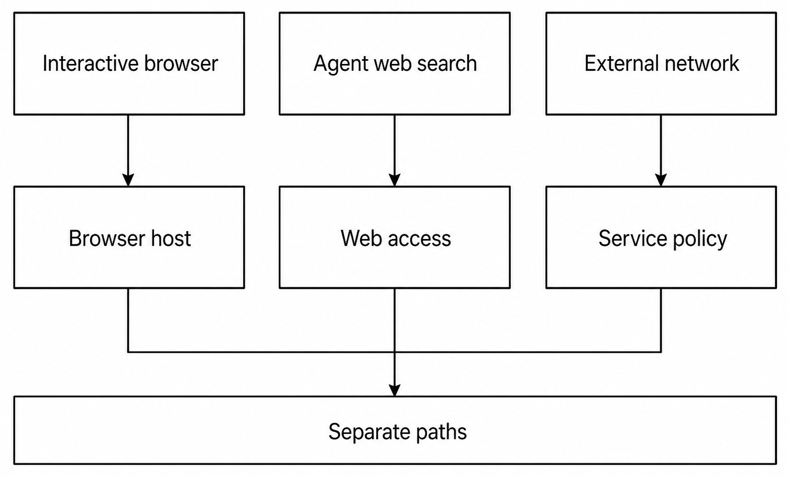
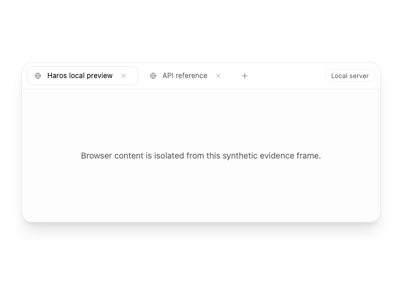
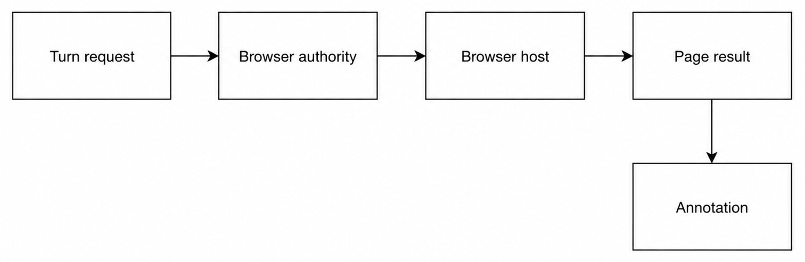
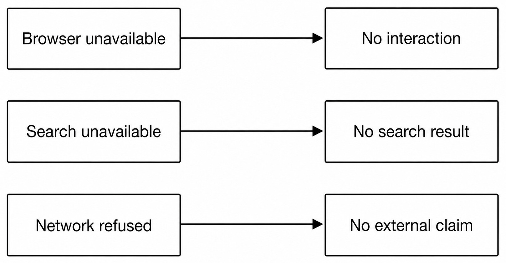

# Chapter 30 — Browser Workflows and Web Access {#chapter-30}

## The question

Interactive browser automation, agent web search, and ordinary external network access are not one
capability. Interactive automation operates a browser host and visible page state. Agent web search
uses a bounded search/retrieval service. External network access belongs to the service or command
making the request and its policy. Each path has its own availability, authority, evidence, and
failure behavior.

_Figure 30.1 — Similar destinations do not merge three execution paths into one owner._

**Accessible equivalent.** Interactive browsing, agent web search, and external network access are separate paths with separate owners and policies.

_Product capture — The real browser tab strip exposes thread-local interactive browser state; it is not proof that agent web search or arbitrary external network access follows the same authority path._

| Path                | Best for                                      | Owner                               | Useful evidence                         | Does not imply            |
| ------------------- | --------------------------------------------- | ----------------------------------- | --------------------------------------- | ------------------------- |
| Interactive browser | Signed-in UI, dynamic page, local Web testing | Browser Automation Host             | Page state, action outcome, screenshot  | Search index access       |
| Agent web search    | Finding and opening public sources            | Web-access package/service          | Result URL, retrieved content, citation | Control of user's browser |
| External network    | API, Git, package, command-specific traffic   | Calling service plus network policy | Protocol response/receipt               | Browser permission        |

Choosing the path is part of the task. “Find the official documentation” is search and retrieval.
“Use my signed-in dashboard” requires an interactive browser with the user's existing session.
“Call this test endpoint” belongs to a network-capable service or terminal command. Using browser
automation for every Web task adds fragility; using search for a signed-in form cannot work.

## Interactive browser authority

The Browser Automation Host owns browser instances, tabs, navigation, interaction, snapshots, and
cleanup. HostGateway admits browser tools for the exact Turn. The Engine receives typed operations,
not ambient OS control. The Web workbench does not secretly become the automation runtime.

_Figure 30.2 — Browser execution crosses an exact authority boundary; annotations describe returned
page evidence rather than authorizing it._

**Accessible equivalent.** A Turn request requires browser authority before Browser host execution; annotations derive from page results.

A good browser operation names the tab or target, waits for an observable state, performs one
bounded action, and reads the result. Click coordinates alone are weak when semantic targets are
available. Screenshots are evidence of pixels at a moment; DOM or accessibility state provides
different evidence. For a destructive submission, resolve the exact target and ask for approval
when policy requires it.

| Operation  | Precondition                    | Success evidence                  | Common ambiguity                       |
| ---------- | ------------------------------- | --------------------------------- | -------------------------------------- |
| Navigate   | Resolved tab and URL policy     | Observed destination/page state   | Redirect still in progress             |
| Click/type | Unique visible target           | Resulting state or value          | Wrong duplicate control                |
| Inspect    | Page has settled enough         | Semantic snapshot/text            | Lazy content not loaded                |
| Screenshot | Correct tab and viewport        | Image with time/context           | Pixels do not prove backend state      |
| Submit     | Exact form/action and authority | Confirmation plus resulting state | Client success before server rejection |

## Search, open, and cite

Web search is a source-discovery workflow. Search results suggest pages; they are not the pages
themselves. Open the relevant result, prefer primary sources, confirm dates for changing facts, and
place citations next to the claim they support. A snippet can be stale, truncated, or assembled by
the search engine.

Agent web access is bounded and credential-blind. It should not borrow browser cookies without an
explicit connector designed for that purpose. When a source cannot be retrieved, state the gap.
Do not cite a search-result page as if it directly supports a technical claim.

## External network access

A terminal command, Git operation, package manager, or Engine model service may use the network.
That traffic follows its own policy. Browser authorization does not grant `curl` permission, and a
successful API call does not prove the interactive page worked. Proxy, DNS, TLS, authentication,
rate limits, and remote errors remain distinguishable.

Haros's local-first statement does not mean “never uses a network.” It means product and Project
state remain on the machine unless an explicit connected capability sends bounded data outward.
Before sending repository content or artifacts, understand the receiving service and minimize the
payload.

## Fail closed, but explain which path failed

_Figure 30.3 — Failure in one Web path must not be disguised as success through another path._

**Accessible equivalent.** Unavailable browser, search, or network paths must not be reported as successful interaction, results, or external claims.

| Failure                    | Accurate outcome         | Preserved state | Safe recovery                  |
| -------------------------- | ------------------------ | --------------- | ------------------------------ |
| Browser host unavailable   | No interactive operation | Tab/task intent | Start/repair supported host    |
| Target ambiguous           | No click or typing       | Page unchanged  | Reinspect and disambiguate     |
| Search unavailable         | No search result         | Query           | Retry or use known primary URL |
| Network refused            | No external claim        | Local data      | Diagnose policy/proxy/auth     |
| Page changed after inspect | Prior target invalid     | Browser session | Refresh snapshot before action |

### Worked example: verify a release status

Kai asks whether a dependency has a new stable release. Web search finds the official release page;
opening it establishes the latest tag and date. A repository-local package file shows the currently
pinned version. These two facts support a comparison. There is no need to operate Kai's browser.

Then Kai asks to download a private artifact from a signed-in vendor portal. Search cannot use his
session. Interactive browser automation can navigate the existing signed-in browser, but download
is an external side effect and the file destination needs explicit handling. If the portal changes
layout, the host must reinspect. If download fails, Haros must not substitute an unrelated public
artifact.

## Check your model

1. Does search control the user's browser? No.
2. Does a screenshot prove a remote mutation committed? Not alone.
3. Does browser authority grant arbitrary terminal networking? No.
4. What should happen after page state changes? Reinspect before acting.
5. May failure in one path be hidden by silently switching paths? No.

## Tabs, targets, and page-state races

An interactive browser can contain several windows and tabs, and a page can replace its DOM without
changing the visible title. Every action should resolve the intended tab and obtain current page
state. “The last tab” is presentation history, not a durable target identity. A navigation can also
open a new tab, redirect through authentication, or close the original target.

The automation host should return enough target information for the next operation to be explicit.
After a click that triggers navigation, wait for a relevant observable condition rather than a
fixed sleep. A page can render a button before its event handler or data finishes loading. A long
sleep can still be wrong and wastes time when the page is ready early.

| Race         | Misleading observation  | Safer condition                                 |
| ------------ | ----------------------- | ----------------------------------------------- |
| Redirect     | Initial URL loaded      | Expected final origin/path or page marker       |
| Hydration    | Button visible          | Button enabled and action changes state         |
| Lazy content | Container exists        | Required text/row appears                       |
| New tab      | Original click returned | New target identity resolved                    |
| Save request | Toast appears           | Durable resulting state or service confirmation |

If page state changes between inspect and click, semantic lookup may fail or resolve a different
element. Stop and reinspect. Do not fall back to stale coordinates for a consequential action. If
the page contains repeated controls, use surrounding labels or a stable accessible name to
disambiguate.

## Signed-in state and sensitive pages

Interactive control can use an existing signed-in browser session when the available browser tool
is designed for it. That does not make cookies or credentials available to the Engine. The browser
host performs actions and returns bounded page evidence. It must not serialize private storage into
tool results for convenience.

Before operating an account page, confirm the exact service and account context visible enough to
avoid cross-account action. Be cautious with billing, security, access control, deletion, and
publication. Reading a page does not authorize changing it. If a submit button will create an
external side effect, the task must clearly include that mutation and any required approval.

Screenshots and page text from signed-in services can contain personal or confidential information.
Keep artifacts task-specific, avoid publishing them, and sanitize any Guidebook evidence. A
diagnostic should retain the minimum fields needed to prove behavior.

## Evidence from a dynamic page

Different claims require different evidence. Text inspection supports what the page currently
renders. A screenshot supports visual layout. Network or service state may support whether a
mutation persisted. Browser history supports navigation, not business success. Choose evidence at
the layer of the claim.

For a local Web test, a real component rendered in the supported browser can prove focus, keyboard,
responsive, or recovery behavior that a unit test cannot. Still use synthetic data and an isolated
user-data directory. A browser test passing does not constitute packaged Desktop proof.

For research, quote sparingly and record the direct source URL and date. If information changes
often, verify it at answer time. Search, opening, and citation form a chain: query finds candidates,
open retrieves the source, and citation binds a claim to it. Omitting the middle step turns a search
snippet into false precision.

## Browser automation versus Web APIs

When an official API or connector offers a stable typed operation, it may be more reliable than
clicking a UI. But using an API can require distinct credentials and permissions. Do not switch
silently from a browser request to an API that sends different data or performs a broader action.

Browser automation is appropriate when the task depends on the exact visible workflow, an existing
session, or visual behavior. A connector is appropriate for semantic records and bounded mutations.
Web search is appropriate for public source discovery. Terminal networking is appropriate for
developer diagnostics when authorized. Explain the chosen boundary when it affects privacy or
side effects.

## Download and upload boundaries

A download begins in browser state but ends as a local file. The browser host may initiate it, while
the file/download owner resolves destination and completion. A visible “download started” indicator
does not prove the file completed or passed validation. Inspect the saved file through the file
service.

An upload is the reverse crossing: a local file is sent to a service. Resolve the exact file,
confirm account and destination, minimize sensitive content, and observe completion. A preview grant
is not upload authority. If the browser loses connection after submission, query service state
before retrying to avoid duplicates.

## An interactive troubleshooting sequence

When an action seems ignored, identify the target tab, capture current semantic state, and verify
the element is present, visible, enabled, and unique. Check for modal overlays, pending navigation,
or validation messages. Perform one action. Then inspect the expected result. Keep a screenshot only
if visual evidence is relevant.

If the host reports a target-closed error, list current targets rather than recreating the whole
workflow. If authentication expired, stop at the sign-in boundary and let the user restore it; do
not ask for credentials in chat. If a CAPTCHA or anti-automation challenge appears, report it and
request user takeover where supported.

When the remote service returns an error, distinguish browser execution success from business
operation failure. The click may have worked perfectly while the server rejected the request. The
receipt is the resulting page/service state, not the absence of a browser-tool error.

## Web-access privacy checklist

Before sending a query or opening a URL, decide whether it contains Project names, code, personal
data, or credentials. Use the minimal query. Before a browser action, inspect destination origin and
account. Before download/upload, resolve the local file boundary. Before citing, verify the direct
source. Before retrying a mutation, query current external state.

These checks preserve local-first semantics without claiming isolation. Haros can use explicit Web
capabilities productively while keeping product state, browser authority, search retrieval, and
external service data as separate facts.

## Exercise: same goal, three paths

Use a synthetic local site with an accompanying public documentation page and a harmless JSON test
endpoint. Ask three questions: visually verify the local layout, find the official documented
default, and retrieve the endpoint response. Use interactive browser, Web search/open, and a
network-capable service respectively.

Record the evidence each path returns. The screenshot and semantic page state support layout; the
official source supports the documented default; the protocol response supports endpoint behavior.
Then disable one path and confirm the others do not masquerade as it. A screenshot of docs is not a
citation retrieval contract, and search results do not prove the local layout.

Keep the fixture isolated and credential-free. The exercise is successful when the three outcomes
remain separately attributed, including a bounded failure for the disabled path.

## Browser-session cleanup

Tabs or browser hosts launched for a task need lifecycle handling. Reuse an existing user session
only when the task depends on it. Close task-specific isolated tabs/contexts when finished according
to product policy, but do not close unrelated user tabs. A server shutdown should clean up owned
automation hosts without erasing normal browser state it does not own.

If cleanup is uncertain, report remaining targets rather than claiming the browser closed. This is
the same ownership principle seen with terminal process trees: visible disappearance is not enough,
and broad cleanup is not authorized by a narrow task.

## Replaying a browser workflow safely

A browser workflow should be described as state transitions, not a brittle list of pixel clicks.
Record the starting origin and account context, semantic target, intended action, and expected
postcondition. On retry, inspect current state first. If the postcondition already holds, do not
repeat the mutation.

This is especially important for forms. A timeout after Submit can mean the request failed, the
request succeeded but the confirmation was lost, or the browser navigated to a new target. Query
the account/service state or find the created record before submitting again. Stable client request
identity can help when the service supports it.

For harmless navigation, replay is often safe. For sending, purchasing, publishing, granting access,
or deletion, replay can duplicate or deepen the effect. The browser host's tool receipt proves the
interaction attempt; the page/service state proves the business outcome.

## Local Web testing as a boundary-crossing proof

When testing a local Haros page, start the server through its Project-action owner, resolve the
reported loopback address, and open it in an isolated browser target. Exercise keyboard, focus,
responsive layout, light/dark theme, reduced motion, failure, and recovery only to the degree the
claim requires. Keep fixture data synthetic.

Capture a screenshot when visual geometry is the evidence, but also inspect semantic state for
labels and focus. Stop the managed server and browser context afterward. Source-unit proof,
browser-runtime proof, Desktop-shell proof, and packaged proof remain distinct. A browser capture
cannot upgrade a source-alpha build into a release.

## Connector and browser decision test

Before using an interactive session, ask whether the task depends on what the user currently sees
or on a semantic record. A connector/API can fetch a calendar event or issue field reliably, while
the browser can prove the visible workflow and use an existing login. Search can locate public
documentation without either private account path.

If a connector is unavailable, browser fallback may be reasonable only when the user placed the
account and visible action in scope. It may not be reasonable for bulk records, hidden fields, or
high-impact mutations. If browser state is unavailable, do not request passwords in the
conversation; ask the user to sign in through the supported surface.

## Source evaluation beyond retrieval

Opening a page successfully does not make it authoritative. For technical claims, prefer official
documentation, repository source, standards, or research papers. For current product facts, check
date/version. For conflicting pages, explain the discrepancy and choose the source closest to the
canonical owner.

Distinguish facts observed from the page from inferences. A status page saying “operational” does
not prove the user's request path works; it is one external signal. A changelog announcing a feature
does not prove the installed local version contains it. Connect Web evidence to repository/runtime
evidence at the decision boundary.

## Completion criteria for the three paths

Interactive work completes when the exact browser target reaches the requested observable state or
returns a bounded failure. Search work completes when relevant sources are opened and the final
claims are cited to them, not merely listed. Network work completes when the owning service reports
the protocol outcome and any side effect is reconciled.

If the task uses more than one path, report them separately. “The official documentation says X;
the signed-in dashboard currently shows Y; the API probe was refused” is more truthful than merging
the result into one Web-success status.

## Source trail

- `apps/server/src/browserAutomation/Layers/BrowserAutomationHost.ts` owns interactive browser lifecycle and actions.
- `packages/shared/src/browserAutomationCatalogue.ts` defines the browser tool catalogue presented through HostGateway.
- `packages/shared/src/browserAnnotations.ts` defines bounded annotations derived from page evidence.
- `packages/oa-web-access/README.md` documents the separate bundled Web-access path.

<!-- guide-navigation:start -->

[Guidebook contents](../README.md) · [Previous: Pull Requests](29-pull-requests.md) · [Next: Device Workflows](31-device-workflows.md)

<!-- guide-navigation:end -->
