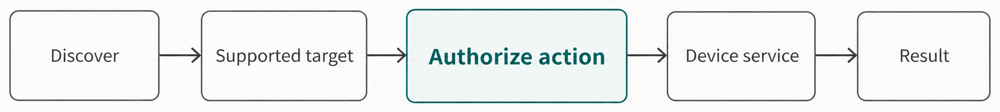
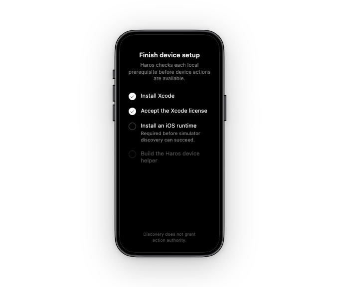
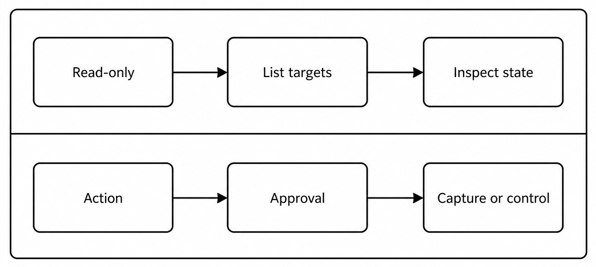
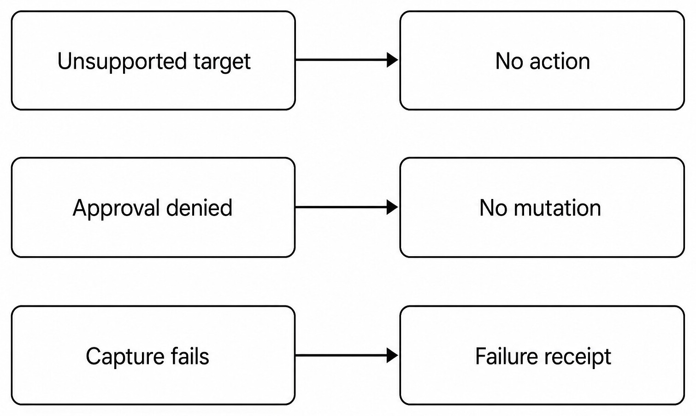

# Chapter 31 — Device Workflows {#chapter-31}

## The question

Device workflows cover supported simulators, emulators, or connected targets exposed by the device
service. They are not universal remote control. First discover targets, resolve a supported identity
and platform, then authorize the exact action. HostGateway admits the Turn; the device service owns
discovery, capture, and control execution.

_Figure 31.1 — An action becomes executable only after target resolution and exact authorization._

**Accessible equivalent.** Device discovery must resolve a supported target and authorize an exact action before the Device service executes.

_Product capture — The production setup surface shows availability prerequisites before device actions; even successful discovery would not itself grant approval-sensitive action authority._

| Stage     | Question                              | Evidence                        | Refusal condition            |
| --------- | ------------------------------------- | ------------------------------- | ---------------------------- |
| Discover  | Which supported targets exist now?    | Typed target list               | Helper unavailable           |
| Resolve   | Which exact target did the user mean? | Stable target identity/platform | Ambiguous or stale target    |
| Authorize | Is this action allowed for this Turn? | Approval/authority record       | Denied or missing permission |
| Execute   | Did the real service perform it?      | Service result/receipt          | Platform/action unsupported  |
| Review    | Does returned state match intent?     | Screenshot/state projection     | Evidence absent or stale     |

Device identity can change across boots. A display name alone may be duplicated. Use stable
service-provided identifiers and refresh discovery before a consequential action. Never infer a
target from the last device used by an unrelated Project.

## Observation and mutation are separate lanes

Listing devices and inspecting state are usually lower risk than capture, launch, install, input,
or control. The policy may still restrict all device access, but the conceptual difference helps a
reader predict approval.

_Figure 31.2 — Read-only inspection does not silently authorize capture or control._

**Accessible equivalent.** Read-only discovery and inspection remain separate from capture or control actions that require approval.

A screenshot is both an action and an artifact. It can contain private information, notifications,
or account data. Store it only in the intended task workspace, sanitize before publication, and
record which target and state it represents. Do not make a screenshot from a real user's device a
test fixture when a synthetic simulator can prove the same behavior.

| Capability     | Typical effect                | Privacy concern         | Validation                             |
| -------------- | ----------------------------- | ----------------------- | -------------------------------------- |
| List targets   | Reads helper/device inventory | Device names/IDs        | Expected supported entries             |
| Inspect state  | Reads current runtime state   | App/account context     | Target identity and timestamp          |
| Capture        | Writes image artifact         | Visible private content | File receipt and visual review         |
| Launch/control | Mutates target state          | External side effects   | Service outcome and resulting state    |
| Install/remove | Mutates software state        | Data loss/version drift | Explicit approval and package identity |

## Helper and sandbox boundaries

The device helper is an implementation boundary, not a second product identity. Helper discovery,
cache, sandbox, executable validation, and platform limits stay server-owned. The browser must not
run helper binaries or parse private device configuration.

A cached helper path is not permanent authority. Validate executable identity and supported
location when required. If the helper changes or becomes unavailable, fail with a bounded
diagnostic. Do not search arbitrary directories and execute the first similarly named binary.

## Screenshots and evidence

For visual proof, set the target into a known synthetic state, capture once, inspect at full
resolution, and record the relevant dimensions/context. Cropping or annotation may make an image
readable, but preserve the original evidence where the workflow requires it. A screenshot proves
rendered pixels, not necessarily backend persistence or accessibility semantics.

When a claim crosses Desktop or device boundaries, source tests alone may be insufficient. Use a
focused simulator/device integration proof. Do not call an unsigned build a release simply because
it ran in one simulator.

## Conservative failure outcomes

_Figure 31.3 — Unsupported or refused actions preserve device state; failed capture records failure
rather than inventing an image._

**Accessible equivalent.** Unsupported targets and denied approval cause no action or mutation; failed capture records failure.

| Failure             | Device mutation                  | Product evidence               | Recovery                               |
| ------------------- | -------------------------------- | ------------------------------ | -------------------------------------- |
| No target           | None                             | Empty/unavailable discovery    | Start supported simulator or reconnect |
| Stale identity      | None                             | Target-not-found               | Rediscover and reselect                |
| Approval denied     | None                             | Denied interaction/receipt     | Change request or approve explicitly   |
| Helper crash        | Uncertain only if action started | Error with bounded detail      | Reconcile target state before retry    |
| Capture write fails | Device may be unchanged          | No successful artifact receipt | Fix destination, capture again         |

### Worked example: capture a synthetic regression

Sana needs evidence that a mobile layout clips on a small viewport. She starts a synthetic supported
simulator outside Haros, then asks Haros to list targets. The device service returns the simulator's
stable identity. Sana authorizes a screenshot action for that exact target. The service captures to
the task workspace and the file owner confirms the artifact. Visual review shows the clipping.

If two simulators share the same display name, Haros asks Sana to choose by stable identity and
platform details. If capture returns an error, the Timeline records failure and no screenshot is
claimed. If Sana next asks to tap through onboarding, that is a new control action with its own
authority, not a continuation of screenshot permission.

## Check your model

1. Does discovering a target authorize control? No.
2. Can a display name safely identify a device? Not when duplicates or lifecycle changes exist.
3. Does capture success prove app data persisted? No; it proves an image artifact and visible state.
4. Should real private devices be default test fixtures? No.
5. What happens after uncertain helper failure? Reconcile target state before retrying.

## Target identity across lifecycle changes

A simulator can shut down, reboot, be erased, or be recreated with the same display name. A
physical device can disconnect and return. The target list is therefore a live service projection.
Cache can improve discovery speed, but a mutating action must validate the current identity and
state.

Record platform, runtime, stable service identifier, and relevant state when diagnosing. Do not
publish serial numbers or account-linked identifiers. For a Guidebook proof, synthetic aliases and
task-specific simulator state are sufficient.

| Lifecycle change  | Stale client risk                | Correct response                       |
| ----------------- | -------------------------------- | -------------------------------------- |
| Simulator reboot  | Old state/handle used            | Rediscover and inspect readiness       |
| Erase/recreate    | Same name, new identity          | Require new selection                  |
| Device disconnect | Action sent to absent target     | Refuse with target unavailable         |
| Multiple runtimes | Unsupported command chosen       | Match capability to platform/runtime   |
| Helper upgrade    | Cached executable/protocol drift | Revalidate helper and version contract |

This rule prevents a dangerous convenience: substituting another available device when the chosen
one disappears. A launch failure should preserve the intended target and ask for a new choice, not
redirect control to the first device in the list.

## Capability support is platform-specific

Discovery does not imply every action exists on every target. The device tool catalogue and service
tests define supported operations. A screenshot may be supported while installation or input is
not. Desktop platforms, simulators, emulators, and physical devices can have different approval and
helper requirements.

Present unavailable actions honestly. Do not render an enabled control and later claim the device
ignored it. When support is experimental or source-alpha, say so. One successful platform test does
not establish cross-platform product support.

If a requested action is unsupported, consider a documented manual workflow or a different
supported target only with user agreement. Do not construct an arbitrary shell command against a
private device tool as a hidden fallback.

## Coordinate and state-sensitive control

Some actions target semantic elements; others may depend on coordinates. Coordinates are fragile
across resolution, scale, rotation, keyboard visibility, and animation. Inspect current frame and
prefer semantic or platform-native targeting where exposed. If only coordinates are available,
state the risk and keep the action reversible.

Wait for stable state after launch or navigation. Fixed sleeps are weak evidence. A screenshot
captured during animation can misrepresent layout. For visual regression, configure consistent
viewport, scale, theme, locale, and reduced-motion state. Record these conditions with the artifact.

A screenshot crop can focus review, but a capture intended as runtime proof should retain enough
frame context to establish the target. Never crop away an error banner merely to make the desired
component look correct.

## Files cross the device boundary explicitly

Installation packages, screenshots, recordings, or pulled logs move between the local workspace and
the target. Device authority does not replace file authority. Resolve the local source or destination,
then execute the device transfer. Verify both the device outcome and the local artifact.

For an install, validate exact package path and target; do not pick the newest similarly named
build. For a screenshot, validate destination and file metadata. For logs, bound size and sanitize
sensitive content. A service result that says capture completed but lacks a readable file requires
file-side diagnosis.

## Approval and unattended work

Device mutation can be unsuitable for unattended automation. An automation schedule does not grant
future device control. Each run envelope and HostGateway decision must allow the exact action. If a
confirmation prompt cannot be answered safely, the automation should fail or request attention,
not auto-approve because the same action succeeded before.

Read-only monitoring can still expose private device state. Choose synthetic targets and bounded
fields. Avoid keeping a physical device awake, changing system settings, or consuming paid network
resources without explicit intent.

## Diagnose partial device outcomes

An action can reach the helper but fail on the target. It can complete on the target while the
result transport disconnects. It can capture an image but fail to save locally. Use stable operation
identity and inspect both sides before retrying.

For uncertain launch, inspect the target's current app/state. For uncertain installation, query the
installed package/version. For uncertain capture, check the destination and operation receipt. If
the action might be non-idempotent, do not repeat until state is known.

### Multi-device example

Tariq has an iOS simulator and Android emulator running. Both show “Test Phone” in a custom label.
Discovery returns different platform and stable identifiers. The requested bug is iOS-specific, so
Haros resolves the simulator, verifies screenshot support, and captures it. The Android target
remains untouched.

The simulator reboots before the next control request. Its old handle is stale. Haros rediscovers,
checks whether the same stable target returned, and asks Tariq if identity changed. It does not send
the tap to Android merely because that device is ready.

## Device evidence checklist

Before action: supported platform, exact target identity, current readiness, requested capability,
approval state, local file inputs/destinations, and expected side effect. After action: service
outcome, resulting target state, artifact receipt, and any privacy sanitization.

This checklist also clarifies review boundaries. A source test proves contract behavior in its
fixture. A simulator integration proves a supported runtime path. A screenshot proves pixels. A
signed release requires entirely different evidence and authority.

## Simulator preparation and reset

A reproducible device test often needs a known app build, locale, theme, permission state, and data
fixture. Preparing those conditions can mutate the simulator. State them before acting and use a
task-specific target. Resetting or erasing a simulator is destructive to its data and needs explicit
scope; it is not an ordinary response to a flaky screenshot.

Prefer application-level fixture setup over whole-device erasure. If permission prompts matter to
the test, record whether permissions were fresh, granted, denied, or reset. If the keyboard or
system overlays affect layout, include them intentionally rather than capturing an accidental
state.

## Captures, recordings, and accessibility

A still screenshot is useful for spatial layout. A recording can show motion, timing, or a sequence
but increases privacy and storage risk. Neither proves accessibility focus order or semantic labels.
Use platform accessibility inspection or focused tests for those claims.

Before capturing, remove unrelated notifications and accounts from the synthetic target. After
capture, inspect at original resolution for truncation and unintended private content. Preserve
orientation and scale metadata. When creating a cropped publication derivative, keep an accessible
text description of the essential relationship.

## Exercise: approval does not persist as ambient power

In a synthetic simulator, list targets and inspect state. Request one screenshot and approve that
exact action. Then request a control action such as a harmless tap. Verify that the prior screenshot
approval does not automatically authorize control. Deny the tap and confirm no target mutation is
reported.

Next capture again with a new exact action and verify its artifact receipt. The exercise should show
three distinct facts: read-only discovery, one approved capture, and one denied mutation. If the
implementation uses a broader approved runtime mode, describe that explicit policy rather than
claiming every action prompts.

## Platform failure diagnosis

When discovery is empty, distinguish no running target, unsupported platform, missing helper,
helper permission, and protocol/version mismatch. When an action fails, preserve target identity,
capability, operation ID, helper outcome, and bounded stderr/error. Do not include device secrets or
complete logs.

When a screenshot is blank, determine whether the device rendered blank pixels, capture targeted
the wrong display, the app was backgrounded, or file decoding failed. When input misses, inspect
orientation, scale, current frame, and semantic target. Random repeated taps make state less
diagnosable.

If the helper process remains after failure, server-owned cleanup should terminate it. Do not kill
unrelated platform processes by name. A stale cache entry is invalidated; it is not an invitation
to search and execute arbitrary binaries.

## Boundaries with browser and terminal

A mobile app may expose a WebView, and a simulator may be controlled by command-line tools. That
does not merge browser, terminal, and device ownership. Use device service for target discovery and
supported actions. Use browser automation for a separately owned browser target. Use terminal only
for explicit diagnostics when the supported service lacks the needed operation and authority allows
it.

Crossing layers can be useful in tests—for example, start a local server as a Project action, open
the app on a simulator, and capture the result—but each outcome has its own receipt. A running
server does not prove the app connected; a screenshot does not prove the server handled the intended
request.

## Device workflow handoff

Report platform, synthetic target identity, runtime state, actions requested and approved, current
app/build identity, artifacts with paths/hashes, failures, and cleanup status. Omit real serials and
account details. State which observations are screenshots, service results, or source tests.

If the target remains running for the user's next step, say so. If Haros owns a helper process,
confirm cleanup. If a mutation could not be reconciled, do not label the target pristine; recommend
a focused inspection before further actions.

## Completion criteria for device work

Discovery completes with a current typed list or a bounded unavailable result. Inspection completes
with target identity, state, and time. A mutating action completes only when the device service
returns a terminal result and resulting target state agrees. Capture completes when both the device
operation and local file artifact are proved.

If only one side succeeds, report partial state. “The helper reported capture, but the destination
file is unreadable” is not a delivered screenshot. “The local file exists, but target identity was
ambiguous” is not valid evidence for the requested simulator. Retry only after resolving the
missing side.

## Device actions inside a Turn

An Engine can request a typed device action through HostGateway, but it does not receive persistent
device authority. The operation binds Project/Thread/Turn, target, action, permission decision,
timeout, cancellation, and receipt. The device owner executes and sanitizes the result. Engine
adapters must not duplicate helper caches, approval logic, or target discovery.

If the Turn is interrupted, cancellation propagates to the bounded operation where supported. The
target may already have changed. Reconcile before declaring “nothing happened” or repeating. The
Product Thread preserves the request and outcome even though a native Engine Session may end.

## Real-device caution

Physical targets can contain irreplaceable data, personal accounts, paid connectivity, and security
controls. Prefer simulator proof. If a real target is necessary, minimize mutations, confirm exact
identity, and avoid erase, uninstall, reset, account, or system-setting actions without explicit
authority. A general request to “test the app” is not a license to reconfigure the device.

Keep host trust and helper verification enabled. Do not bypass platform security to make an action
work. If a capability requires developer-mode setup, report the prerequisite and let the user make
that platform decision.

## Source trail

- `apps/server/integration/device.integration.test.ts` proves supported discovery and action flows.
- `apps/server/src/device/helperSandbox.integration.test.ts` covers helper execution boundaries.
- `packages/shared/src/deviceHelperCache.ts` owns bounded helper cache facts.
- `packages/shared/src/hostToolSurfacePolicy.ts` projects device tools through the shared HostGateway policy.

<!-- guide-navigation:start -->

[Guidebook contents](../README.md) · [Previous: Browser Workflows and Web Access](30-browser-workflows-web-access.md) · [Next: Project Actions and Dev Servers](32-project-actions-dev-servers.md)

<!-- guide-navigation:end -->
