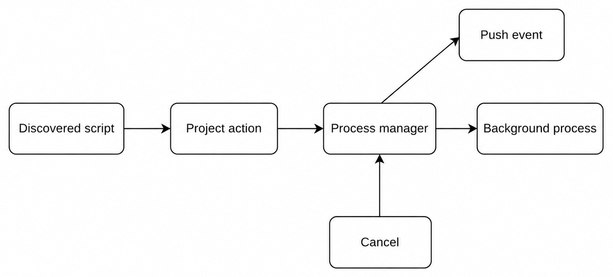
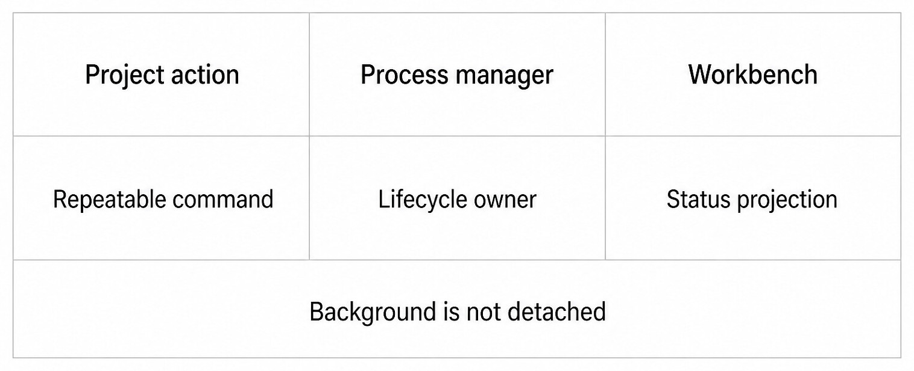

# Chapter 32 — Project Actions and Dev Servers {#chapter-32}

## The question

Project actions turn discovered scripts into repeatable commands. A dev server is a background
process managed as a Project resource. “Background” means the Workbench need not keep a terminal in
front; it does not mean detached from ownership, cancellation, events, or cleanup.

_Figure 32.1 — Script discovery identifies an action; the process manager owns the resulting
background lifecycle._

**Accessible equivalent.** A discovered script becomes a Project action whose background process lifecycle, events, and cancellation remain owned by the process manager.

| Fact              | Owner                      | Projection               | Not implied                    |
| ----------------- | -------------------------- | ------------------------ | ------------------------------ |
| Discovered script | Project discovery service  | Action name/target       | Script is safe or should run   |
| Start request     | Project action API         | Starting result          | Port is listening              |
| Process lifecycle | Dev-server/process manager | Starting/running/removed | Browser tab owns process       |
| Address           | Server monitor/manager     | Host, port, URL          | Public deployment              |
| Stop              | Manager                    | Stopped/removed event    | Every external child was owned |

## Discovery is not execution

Haros can inspect recognized project manifests and return script targets. It should not invent
commands from README prose or run every `dev` script automatically. The user or task chooses the
action. The Project root supplies the working directory; runtime and executable lookup remain
server-owned.

Multiple packages may expose the same script name. A discovered target therefore includes enough
identity to select its package/location. A stale discovery result should be refreshed after manifest
changes. Missing dependencies or executable errors are start failures, not permission to install
packages without authorization.

## Starting a dev server

The run contract names the Project and discovered target. The manager launches the process,
captures lifecycle state, monitors addresses, and emits push events. `starting` means admission and
launch began; `running` requires stronger process/address evidence. A browser preview should wait
for a usable address rather than assume the conventional port.

Port discovery can produce several addresses. Prefer loopback-safe presentation and the exact
reported protocol. Do not expose a service on all interfaces merely to make preview convenient.
Changing bind address or firewall state is a distinct, higher-risk action.

| Phase      | Observable evidence            | User action                    | Failure handling            |
| ---------- | ------------------------------ | ------------------------------ | --------------------------- |
| Discovered | Exact script target            | Choose Run                     | Refresh if manifest changed |
| Starting   | Manager accepted run           | Wait or cancel                 | Preserve launch error       |
| Running    | Process and address projection | Open/inspect                   | Do not call deployed        |
| Exited     | Exit/removal event             | Read logs, restart if intended | No ghost running badge      |
| Stopping   | Stop requested                 | Wait for cleanup               | Reconcile process/port      |

## The Workbench projects; the manager owns

_Figure 32.2 — Moving work to the background changes presentation, not process ownership._

**Accessible equivalent.** Project actions define repeatable commands, the process manager owns lifecycle, and the Workbench only projects status.

The client `projectRunStore` can make starting and running state immediate, but server push events
reconcile truth. Reloading the page should reconstruct running servers from server state. Closing a
panel should not kill a Project server unless it issues an explicit stop. Conversely, server exit
must remove the running projection even if no UI component witnessed it.

## Dev server versus terminal command

Both may launch processes, but their interaction contracts differ. A terminal is an interactive
PTY with input and output. A Project dev server is a managed background action with status and
address projection. Running a long-lived server in a terminal can be appropriate for debugging;
using the Project action makes repeated start/stop and Workbench visibility clearer.

Do not represent the same process as independently owned by both systems. If a Project action
launches through manager infrastructure, its stop and events remain there. If a user manually runs
the command in a terminal, terminal lifecycle owns it and Project action status must not claim it
without evidence.

## Failure and recovery

A start can fail because the target vanished, executable is missing, dependencies are absent, the
port is occupied, or the process exits early. Preserve the exact failure and useful bounded output.
Do not loop restart without user intent. A stop can time out; reconcile process and port before
declaring success.

| Failure            | Accurate projection                          | Preserve         | Recovery                          |
| ------------------ | -------------------------------------------- | ---------------- | --------------------------------- |
| Target missing     | Start refused                                | Discovery intent | Rediscover scripts                |
| Executable missing | Launch failed                                | Project files    | Install only with authority       |
| Port collision     | Process failed/alternate address if reported | Existing service | Choose port or stop correct owner |
| Early exit         | Removed with exit reason                     | Logs/status      | Fix cause, explicit restart       |
| Stop uncertain     | Not yet safely stopped                       | Process identity | Reconcile and bounded cleanup     |

### Worked example: two packages, one script name

Amir's monorepo has `web/dev` and `docs/dev`. Discovery returns two targets. He selects the Web
target; the manager starts it and reports a loopback address. The Workbench opens that address in a
preview, while the manager continues to own the process. Later Amir changes the Web manifest. The
old action identity is refreshed before restart.

If Amir closes the preview, the server remains running. If he clicks Stop, the manager terminates
the owned process tree and emits a removed event. If a manually launched docs server occupies the
same port, Haros does not kill it automatically; it reports the collision and asks Amir which owner
should change.

## Check your model

1. Does discovering a script run it? No.
2. Does background mean detached? No.
3. Does `starting` prove the address serves requests? No.
4. Who survives a browser reload? The server-owned process; the client rebuilds projection.
5. Can a Project action stop an unrelated manual process? Not without exact ownership and authority.

## Address discovery and readiness

Many dev servers print an address before they are truly ready, bind several interfaces, or restart
after compilation. The local-server monitor must interpret supported evidence and project bounded
addresses. The Workbench should prefer safe loopback URLs and not construct a public address from
port text.

Readiness is task-specific. A TCP listener proves a socket exists; an HTTP response proves more; a
loaded application route proves more still. A Project action's generic `running` state should not be
stretched into “all application tests pass.” When a workflow needs route readiness, perform a
focused browser or HTTP check after the manager reports an address.

| Evidence         | Supports                       | Does not support           |
| ---------------- | ------------------------------ | -------------------------- |
| Process alive    | Manager owns running process   | Server accepts requests    |
| Address detected | Candidate listener URL         | Correct application loaded |
| HTTP success     | Route responded                | Browser interaction works  |
| Browser render   | Visible page at moment         | Production deployment      |
| Test suite       | Tested behavior in environment | Public release readiness   |

If the server changes port after restart, update the projection and preview target. Do not keep a
stale URL because it looks familiar. If multiple servers expose the same Project, identify each by
managed process/action identity.

## Events and reconnect

Project dev-server events include additions/updates and removal with stopped or exited reasons.
Push delivery makes the Workbench responsive, while list state reconstructs truth after reconnect.
Events can race with initial lists, so the client store needs stable identities and terminal removal
semantics.

A late `running` update must not resurrect a server after a terminal removed event. A page reload
must not relaunch actions automatically. If a run request was accepted but the response was lost,
query managed servers before retrying to avoid duplicates.

The same pattern applies to cancellation. The client can project “stopping,” but the manager's
removal/exit evidence settles it. Closing the app invokes server shutdown policy for owned
processes; it should not depend on the final Web event being delivered.

## Logs and terminal access

A background process still produces output. The manager may retain bounded logs or activity for
diagnosis. Do not copy an unlimited stream into Product Thread history. Provide a way to inspect
recent relevant output and preserve terminal error detail.

When deeper interactive debugging is required, starting the same command again in a terminal can
cause a port collision. Stop the managed action first or choose an explicitly different port. Do
not attach a terminal UI to a process unless the manager contract supports that relationship.

Logs can contain environment values, request data, or tokens. Sanitize durable projections. The
fact that output was printed locally does not make it safe to place in a screenshot or Guidebook.

## Runtime and dependency decisions

Discovered scripts may rely on Bun, Node, Python, a package manager, or repository-specific tools.
The Project action executes the declared command in the configured environment. Missing runtime is
an availability error. Automatically installing or upgrading a runtime expands scope and can alter
the machine.

Use repository-pinned versions and lockfiles where present. If dependencies are missing, explain the
required setup and ask before a networked install when it is not already part of the requested
workflow. Do not use global packages as silent fallbacks that make behavior irreproducible.

Environment variables should come from approved configuration. Never display secret values in the
Workbench action description. A run envelope can name which configuration source was used without
making the Web client a secret owner.

## Background-process resource conflicts

Servers can consume ports, file watchers, CPU, memory, database connections, or device handles.
Starting duplicates may degrade the system even if each process launches successfully. Before a new
run, the manager should use action identity and policy to decide whether to reuse, refuse, or start
another instance.

If a port is occupied, identify whether Haros owns the listener. An owned prior instance can be
offered for stop/restart. An external process must not be killed automatically. A configuration
change may justify a new address instead.

Watchers can rebuild files and create Git noise. Their writes belong to the tool/process, not to an
Agent Turn merely because that Turn started the server. When reviewing task diffs, distinguish
generated artifacts and preserve unknown changes.

## Restart without split ownership

A restart is a stop followed by a new start under the same Project-action owner. Settle the old
process tree, record its removal, then launch a new process with a new lifecycle. Do not overlap two
instances and display one combined running row.

If stop fails, refuse or escalate according to bounded cleanup policy. Starting anyway can hide the
old listener behind a new status. If start fails after a successful stop, the accurate state is
stopped with launch failure, not “rolled back” to the old process.

### Worked recovery: lost connection during start

Nia clicks Run and the WebSocket disconnects. The server may have launched the process. On reconnect,
the Workbench lists managed dev servers and finds the action in running state with an address. It
does not replay the start. If the list is empty, it may safely issue a new run after confirming no
uncertain owned process remains.

Later Stop times out. Nia sees “stop uncertain,” not “stopped.” The manager reconciles process
identity and port. If the child remains, bounded process-tree cleanup runs. Only the terminal removal
event clears the running projection.

## Project-action operating checklist

Before Run: refresh script discovery, select exact target, confirm Project root, runtime and install
state, expected long-running behavior, port policy, and authority. During Run: observe manager state,
bounded logs, and address readiness. Before opening: validate the URL. Before Stop or restart:
resolve the managed identity. After settlement: inspect removal reason and resources.

These steps keep a convenient control surface truthful. They also make clear why a source-alpha
dev server is not a deployed service and why passing a local browser check does not cross release
gates.

## Shared Project state and multiple Threads

A dev server belongs to the Project manager, not exclusively to the Thread that clicked Run. Other
Threads viewing the same Project can observe the server projection. They must not each spawn a
duplicate merely because their local stores begin empty. Stable Project/action identity coordinates
the shared resource.

This also affects stop authority. A Thread can request stop, but the manager resolves the exact
server and current state. The resulting event updates all consumers. Product history can record
which Turn requested the action without making the process a native Engine Session.

If two users or tasks need different configurations, use distinct supported action identities or
ports. Do not mutate the running process's meaning underneath another Thread without an explicit
restart decision.

## Health versus availability

A running address can return errors. A compile watcher can stay alive after a failed build. The
generic Project server projection should show running while logs or a focused health check show the
application problem. Do not remove a living process merely because one request failed.

Conversely, a process can exit cleanly after completing a one-shot script; that is success for the
script but not a running dev server. Discovery should distinguish repeatable actions from expected
long-lived servers where the contract supports it.

For health, perform a bounded route check appropriate to the Project. Avoid aggressive polling or
turning local proof into a monitoring service without authorization. Record response and time;
health can change.

## Exercise: reconnect without duplicate launch

Use a synthetic Project with a server that reports a dynamic loopback port. Start it once and record
the managed identity. Disconnect the Web client, reconnect, list managed servers, and verify the
same identity and address appear. Confirm the process count remains one.

Then stop it and observe a removed event. Replay a stale running event in the client fixture if the
test supports it; the terminal removal must win. This exercise proves server ownership, reconnect
reconstruction, and terminal event monotonicity without relying on a visual badge.

## Dev-server security boundary

Local servers can expose Project files or development APIs. Default to loopback and avoid logging
tokens. Opening a browser to the server is local navigation; tunneling, sharing publicly, changing
firewalls, or deploying are separate external actions. A request to “run the app” does not authorize
public exposure.

If the app requires connected credentials, keep them in the approved server configuration and out
of Web projections. Use synthetic accounts for tests. Do not publish screenshots containing private
development data.

Dependencies and dev servers can execute repository code. Treat unknown repositories with
appropriate permission mode. Script discovery is not a trust endorsement. Review the command and
repository instructions before launching.

## Handoff for a running server

Report Project/action identity, discovered script, runtime, process status, loopback address,
readiness evidence, bounded recent errors, owning manager, and intended cleanup. If leaving it
running is deliberate, say how to stop it. If stop was attempted, report the terminal removal or
uncertainty.

Do not say “deployed.” Do not say “tests pass” because the home page loaded. Do not say “stopped”
because the preview closed. These small vocabulary choices preserve the actual process boundary.

## Completion criteria for Project actions

Discovery completes with a current exact script target. Start completes only when the manager
projects the owned process and, for a server, a usable address/readiness level appropriate to the
claim. Stop completes on terminal removal/exit and resource reconciliation. Browser preview is a
separate validation step.

Report partial outcomes precisely: “process running; address not detected,” “address responds; app
route fails,” or “stop requested; process remains.” These statements point to the correct owner.
“Dev server failed” obscures whether discovery, launch, monitoring, application health, or cleanup
is responsible.

## One-shot Project actions

Not every repeatable script is a server. Formatting, code generation, tests, or builds can run to
completion. Their manager lifecycle ends with exit, and artifacts/tests need owner-specific
validation. Do not keep a completed one-shot action in the running-server projection.

If a generator changes files, refresh Git status and attribute them. If a formatter exits zero but
touches unrelated paths, success of the command does not authorize including those edits. If a
build exits zero, inspect the requested output when the task claims an artifact.

The same exact-target and environment rules apply, but address monitoring does not. Modeling
one-shot and long-lived behavior honestly avoids forcing every script into a terminal or server
metaphor.

## Source trail

- `packages/contracts/src/project.ts` defines script discovery, dev-server inputs, statuses, and events.
- `apps/server/src/devServerManager.ts` owns background process lifecycle and cleanup.
- `apps/server/src/localServerMonitor.ts` observes usable local-server addresses.
- `apps/web/src/projectRunStore.ts` maintains the client projection reconciled by server events.

<!-- guide-navigation:start -->

[Guidebook contents](../README.md) · [Previous: Device Workflows](31-device-workflows.md) · [Next: Studio Outputs](33-studio-outputs.md)

<!-- guide-navigation:end -->
